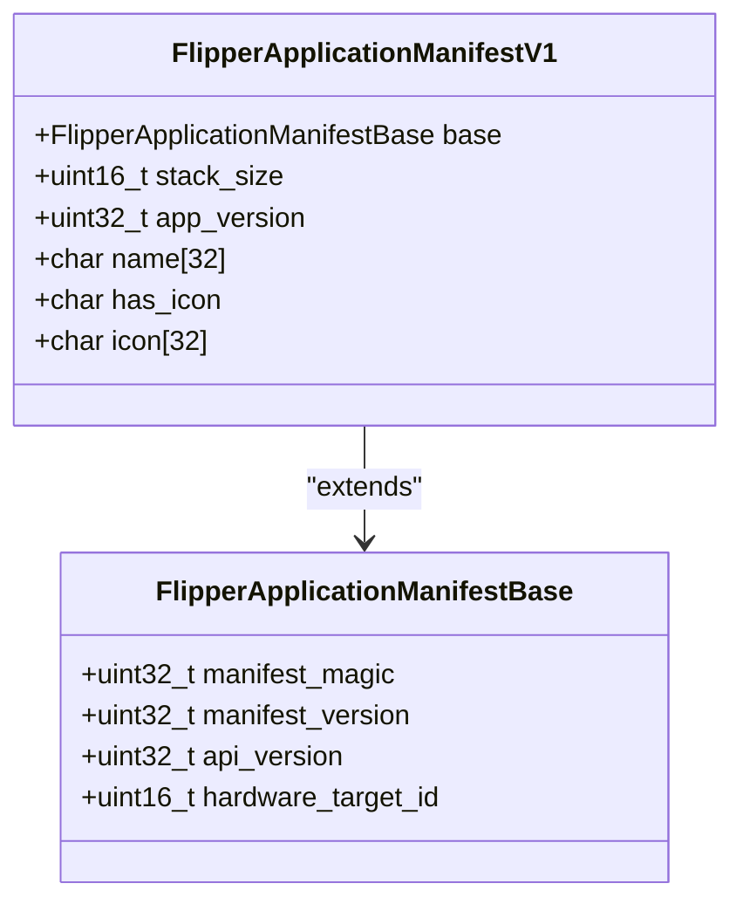
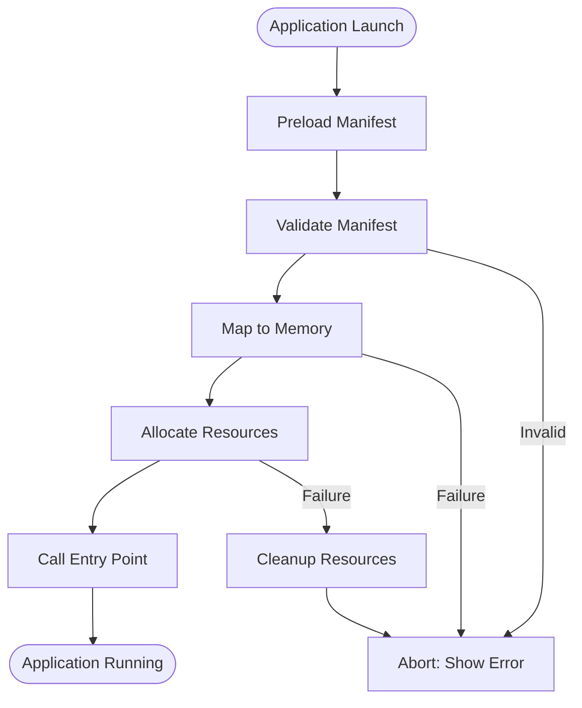
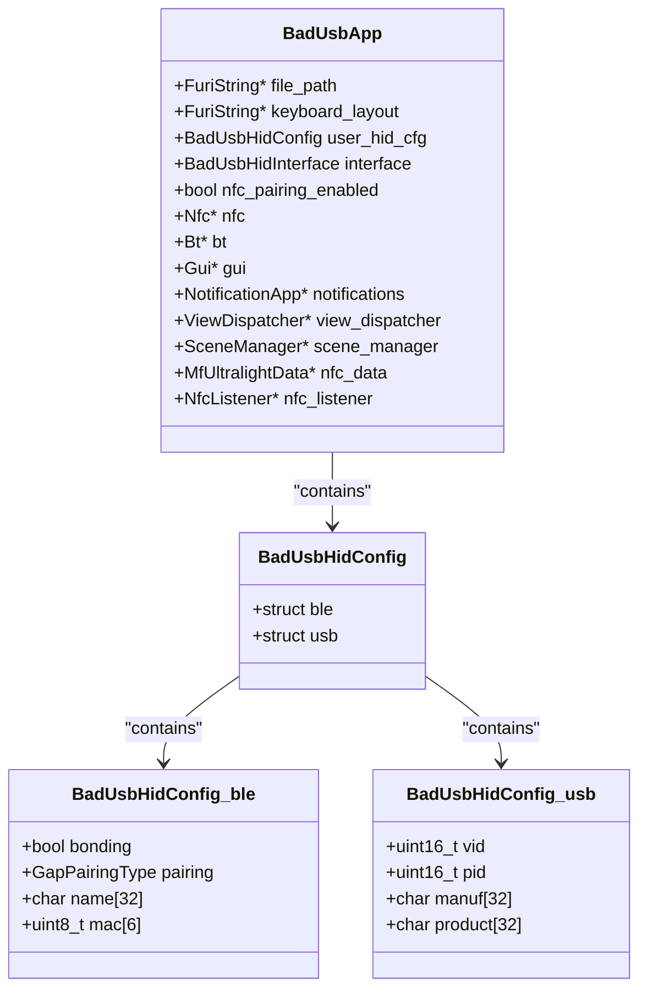
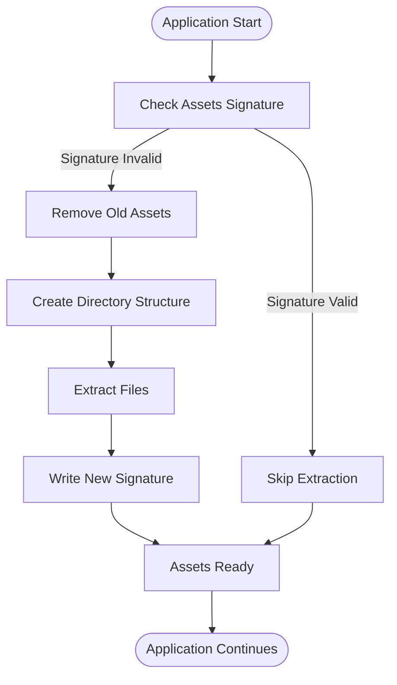
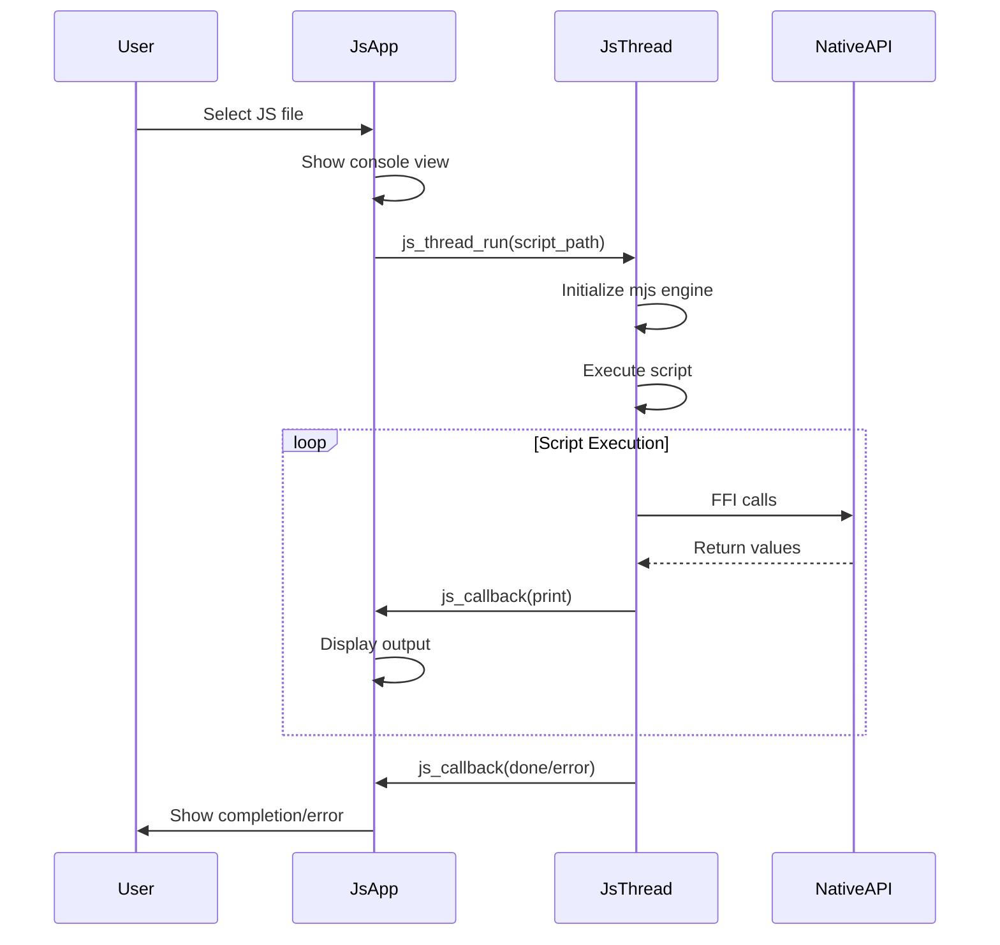

# Application Development

<cite>
**Referenced Files in This Document**   
- [application.fam](file://applications/main/bad_usb/application.fam)
- [bad_usb_app.c](file://applications/main/bad_usb/bad_usb_app.c)
- [nfc_app.c](file://applications/main/nfc/nfc_app.c)
- [application_manifest.h](file://lib/flipper_application/application_manifest.h)
- [application_manifest.c](file://lib/flipper_application/application_manifest.c)
- [flipper_application.c](file://lib/flipper_application/flipper_application.c)
- [js_app.c](file://applications/system/js_app/js_app.c)
- [AppManifests.md](file://documentation/AppManifests.md)
- [JavaScript.md](file://documentation/JavaScript.md)
- [example_apps_data.c](file://applications/examples/example_apps_data/example_apps_data.c)
- [example_apps_assets.c](file://applications/examples/example_apps_assets/example_apps_assets.c)
- [example_plugins.c](file://applications/examples/example_plugins/example_plugins.c)
- [application_assets.c](file://lib/flipper_application/application_assets.c)
</cite>

## Table of Contents
1. [Introduction](#introduction)
2. [Application Manifest System](#application-manifest-system)
3. [Application Lifecycle](#application-lifecycle)
4. [Built-in Application Examples](#built-in-application-examples)
5. [Interfaces and Hardware Access](#interfaces-and-hardware-access)
6. [JavaScript Scripting](#javascript-scripting)
7. [Common Development Issues](#common-development-issues)
8. [Conclusion](#conclusion)

## Introduction
This document provides comprehensive guidance for developing applications on the Flipper Zero platform. It covers the complete application development ecosystem, including the manifest system, application lifecycle, interface access, and both C/C++ and JavaScript development approaches. The documentation is designed to be accessible to beginners while providing sufficient technical depth for experienced developers to create complex applications. By understanding the structure and implementation details of built-in applications like BadUSB and NFC, developers can create powerful applications that leverage the full capabilities of the Flipper Zero hardware.

## Application Manifest System

The Flipper Zero platform uses a comprehensive manifest system to define application metadata, dependencies, and build configurations. This system is implemented through two complementary manifest formats: the build system manifest (.fam) and the runtime manifest (embedded in the application binary).

### Build System Manifest (.fam)

The build system manifest, defined in `application.fam` files, controls how applications are compiled and integrated into the firmware. These Python-based manifests define application properties and relationships within the build system.

Key parameters in the build system manifest include:

- **appid**: Unique identifier for the application within the build system
- **apptype**: Type of application (APP, PLUGIN, SERVICE, SYSTEM, DEBUG, SETTINGS, EXTERNAL)
- **name**: Display name shown in menus
- **entry_point**: C function serving as the application's entry point
- **stack_size**: Stack memory allocation for the application
- **icon**: Animated icon from built-in assets
- **requires**: List of dependencies that must be included
- **conflicts**: List of incompatible applications
- **sources**: File patterns for source code inclusion (for external apps)
- **fap_version**: Version string for external applications
- **fap_icon**: Path to a 10x10px PNG icon embedded in FAP files
- **fap_description**: Short description of the application
- **fap_author**: Application author information
- **fap_weburl**: Homepage URL for the application

For external applications (FAPs), additional parameters control packaging and distribution, including `fap_category`, `fap_libs`, and `fap_private_libs` for including additional libraries.

**Section sources**
- [AppManifests.md](file://documentation/AppManifests.md#L1-L140)

### Runtime Application Manifest

The runtime manifest is embedded within the application binary and contains metadata used by the Flipper OS at runtime. This manifest is defined by the `FlipperApplicationManifest` structure and includes essential information for application execution.

The manifest structure includes:
- **manifest_magic**: Validation magic number (0x52474448)
- **manifest_version**: Version of the manifest format
- **api_version**: Required API version compatibility
- **hardware_target_id**: Target hardware compatibility
- **stack_size**: Runtime stack size allocation
- **app_version**: Application version number
- **name**: Application name (up to 32 characters)
- **has_icon**: Flag indicating icon presence
- **icon**: Embedded 32-byte icon data

The manifest is validated at load time to ensure compatibility with the current firmware version and hardware target. Applications are rejected if they declare an API version that is too old or too new for the current firmware, or if they are incompatible with the hardware target.



**Diagram sources**
- [application_manifest.h](file://lib/flipper_application/application_manifest.h#L23-L45)
- [application_manifest.c](file://lib/flipper_application/application_manifest.c#L6-L50)

### Manifest Validation Process

When an application is loaded, the system performs several validation checks on the manifest:

1. **Integrity Check**: Verifies the manifest magic number and version
2. **API Compatibility**: Ensures the application's declared API version is compatible with the current firmware
3. **Hardware Compatibility**: Confirms the application is compatible with the current hardware target
4. **Icon Processing**: Extracts and processes the embedded icon if present

The validation functions `flipper_application_manifest_is_valid()`, `flipper_application_manifest_is_too_old()`, `flipper_application_manifest_is_too_new()`, and `flipper_application_manifest_is_target_compatible()` handle these checks and return appropriate status codes.

**Section sources**
- [application_manifest.h](file://lib/flipper_application/application_manifest.h#L55-L85)
- [application_manifest.c](file://lib/flipper_application/application_manifest.c#L6-L50)

## Application Lifecycle

The Flipper Zero application lifecycle is managed through a well-defined sequence of initialization, execution, and cleanup phases. Understanding this lifecycle is crucial for developing robust applications that properly manage resources and respond to system events.

### Initialization Process

Application initialization begins when the application is launched from the system menu or programmatically. The process follows these steps:

1. **Manifest Preloading**: The system reads and validates the application manifest without loading the entire binary
2. **Memory Mapping**: The application binary is mapped into memory and sections are loaded
3. **Resource Allocation**: The application allocates necessary resources (memory, threads, views)
4. **Entry Point Execution**: The application's entry point function is called

For C/C++ applications, the entry point is a function that returns an `int32_t` and accepts a void pointer argument. The argument typically contains launch parameters or file paths.



**Diagram sources**
- [flipper_application.c](file://lib/flipper_application/flipper_application.c#L157-L209)
- [bad_usb_app.c](file://applications/main/bad_usb/bad_usb_app.c#L578-L585)

### Core Lifecycle Components

The application lifecycle is managed through several key components that handle different aspects of application execution:

- **View Dispatcher**: Manages the application's user interface views and navigation
- **Scene Manager**: Controls the application's logical states or "scenes"
- **Event Callbacks**: Handle user input, timer events, and custom events
- **Resource Records**: Provide access to system services (GUI, storage, notifications)

In the BadUSB application example, these components are initialized in the `bad_usb_app_alloc()` function, which sets up the view dispatcher, scene manager, and various UI components like text input, byte input, and loading indicators.

The application establishes event callbacks for:
- **Custom Events**: Handled by `bad_usb_app_custom_event_callback()`
- **Back Navigation**: Handled by `bad_usb_app_back_event_callback()`
- **Timer Ticks**: Handled by `bad_usb_app_tick_event_callback()`

These callbacks route events to the scene manager, which determines the appropriate response based on the current application state.

**Section sources**
- [bad_usb_app.c](file://applications/main/bad_usb/bad_usb_app.c#L434-L517)
- [nfc_app.c](file://applications/main/nfc/nfc_app.c#L43-L142)

### Memory Management and Threading

Applications on Flipper Zero run in their own thread with a dedicated stack size specified in the manifest. The system uses dynamic memory allocation for application data, with careful management to prevent fragmentation and leaks.

Key memory management practices include:
- Allocating resources in the application allocation function
- Freeing all allocated resources in the cleanup function
- Using FuriString for dynamic string management
- Properly closing record handles to system services

The threading model follows a simple pattern:
1. Application allocates a thread with `furi_thread_alloc_ex()`
2. The thread executes the application's main loop
3. When the application exits, the thread is joined and freed

This ensures clean resource cleanup and prevents zombie threads.

**Section sources**
- [flipper_application.c](file://lib/flipper_application/flipper_application.c#L233-L253)
- [bad_usb_app.c](file://applications/main/bad_usb/bad_usb_app.c#L578-L585)

### Cleanup and Resource Deallocation

Proper cleanup is essential for maintaining system stability and preventing resource leaks. The cleanup process follows a systematic approach:

1. **Stop Active Operations**: Terminate any ongoing processes (NFC emulation, file operations)
2. **Remove Views**: Remove all UI views from the view dispatcher
3. **Free Components**: Deallocate UI components and data structures
4. **Close Records**: Close handles to system services
5. **Save State**: Persist any necessary application state
6. **Free Application Structure**: Release the main application structure

In the BadUSB application, the `bad_usb_app_free()` function demonstrates this pattern by stopping NFC emulation, removing all views, freeing UI components, closing record handles, saving settings, and finally freeing the application structure.

Special attention is given to stopping background processes like NFC emulation before cleanup to prevent crashes or undefined behavior.

**Section sources**
- [bad_usb_app.c](file://applications/main/bad_usb/bad_usb_app.c#L519-L575)
- [nfc_app.c](file://applications/main/nfc/nfc_app.c#L144-L228)

## Built-in Application Examples

Analyzing built-in applications provides valuable insights into best practices for Flipper Zero development. The BadUSB and NFC applications serve as excellent examples of well-structured, feature-rich applications.

### BadUSB Application Structure

The BadUSB application demonstrates a comprehensive implementation of USB HID functionality with multiple configuration options and user interfaces.

Key architectural components:
- **Configuration Management**: Handles settings for USB and BLE interfaces
- **NFC Pairing**: Implements NFC-based pairing for BLE connections
- **Multiple Interfaces**: Supports both USB and BLE HID protocols
- **User Configuration**: Allows customization of device descriptors and pairing options

The application uses a structured approach to configuration management, with separate sections for USB and BLE settings. The `bad_usb_load_settings()` and `bad_usb_save_settings()` functions handle persistent storage of user preferences using the Flipper Format system.



**Diagram sources**
- [bad_usb_app.c](file://applications/main/bad_usb/bad_usb_app.c#L1-L586)
- [bad_usb_app_i.h](file://applications/main/bad_usb/bad_usb_app_i.h)

### NFC Application Architecture

The NFC application showcases a modular design for handling various NFC protocols and operations. It provides a comprehensive interface for reading, writing, and emulating NFC tags.

Key features of the NFC application architecture:
- **Protocol Support**: Handles multiple NFC protocols (Mifare, Felica, ISO14443)
- **Device Management**: Abstracts NFC hardware operations
- **File Operations**: Manages saving and loading of NFC data
- **User Interface**: Provides intuitive navigation through different NFC operations

The application uses a plugin-like architecture for protocol support, with dedicated authentication and parsing modules for different card types. The `nfc_supported_cards` component manages a cache of supported cards and their parsing capabilities.

The file management system handles both primary NFC files (.nfc) and shadow files (.nfc~) for temporary data, ensuring data integrity during operations.

**Section sources**
- [nfc_app.c](file://applications/main/nfc/nfc_app.c#L1-L534)
- [nfc_app_i.h](file://applications/main/nfc/nfc_app_i.h)

### Application Data and Assets

Flipper Zero applications can store data and assets in designated directories, following a structured approach to file management.

#### Application Data
Application data is stored in the `/ext/apps_data/<app_name>` directory, created automatically when needed. The `APP_DATA_PATH()` macro simplifies path construction for data files.

```c
// Example of writing to application data
File* file = storage_file_alloc(storage);
if(storage_file_open(file, APP_DATA_PATH("test.txt"), FSAM_WRITE, FSOM_CREATE_ALWAYS)) {
    storage_file_write(file, "Hello World!", strlen("Hello World!"));
    storage_file_close(file);
}
storage_file_free(file);
```

#### Application Assets
Application assets are embedded in the binary and extracted to `/ext/apps_assets/<app_name>` on first run. The `.fapassets` section contains compressed directory and file structures that are unpacked automatically.

The asset system includes signature verification to avoid unnecessary extraction and improve startup performance. When assets are updated in the application, the signature changes, triggering re-extraction.



**Diagram sources**
- [application_assets.c](file://lib/flipper_application/application_assets.c#L1-L362)
- [example_apps_data.c](file://applications/examples/example_apps_data/example_apps_data.c#L1-L45)
- [example_apps_assets.c](file://applications/examples/example_apps_assets/example_apps_assets.c#L1-L53)

## Interfaces and Hardware Access

Flipper Zero provides extensive interfaces for accessing hardware peripherals and system services. Understanding these interfaces is essential for creating applications that interact with the physical world.

### System Records and Services

Applications access system services through "records" - named interfaces to shared system components. Key records include:

- **RECORD_GUI**: Graphical user interface system
- **RECORD_STORAGE**: File system and storage operations
- **RECORD_NOTIFICATION**: LED and vibration feedback
- **RECORD_DIALOGS**: Dialog and file browser interfaces
- **RECORD_BT**: Bluetooth functionality
- **RECORD_NFC**: NFC hardware interface

These records are opened using `furi_record_open()` and must be closed with `furi_record_close()` to prevent resource leaks.

```c
// Example of accessing system records
Storage* storage = furi_record_open(RECORD_STORAGE);
Gui* gui = furi_record_open(RECORD_GUI);
NotificationApp* notifications = furi_record_open(RECORD_NOTIFICATION);
DialogsApp* dialogs = furi_record_open(RECORD_DIALOGS);

// Use the records...
// ...

// Always close the records
furi_record_close(RECORD_DIALOGS);
furi_record_close(RECORD_NOTIFICATION);
furi_record_close(RECORD_GUI);
furi_record_close(RECORD_STORAGE);
```

**Section sources**
- [bad_usb_app.c](file://applications/main/bad_usb/bad_usb_app.c#L450-L455)
- [nfc_app.c](file://applications/main/nfc/nfc_app.c#L73-L83)

### Hardware Peripheral Access

Direct hardware access is provided through the Furi HAL (Hardware Abstraction Layer) interfaces. These low-level interfaces allow precise control of hardware components.

Key hardware interfaces:
- **furi_hal_nfc**: NFC transceiver control
- **furi_hal_bt**: Bluetooth controller
- **furi_hal_spi**: SPI bus communication
- **furi_hal_i2c**: I2C bus communication
- **furi_hal_gpio**: General-purpose I/O pins
- **furi_hal_speaker**: Audio output
- **furi_hal_vibro**: Vibration motor
- **furi_hal_light**: RGB LED control

These interfaces provide both high-level functions for common operations and low-level register access for advanced use cases.

### Input Event System

The input system provides a unified interface for handling button presses and releases. Input events are dispatched through a publish-subscribe system, allowing multiple components to respond to user input.

Input events include:
- **InputTypePress**: Button press detected
- **InputTypeRelease**: Button release detected
- **InputTypeShort**: Short press (release within timeout)
- **InputTypeLong**: Long press (held beyond timeout)
- **InputTypeRepeat**: Repeat event during long press

Applications typically handle input through the view dispatcher's navigation and custom event callbacks, which route events to the scene manager for state-specific processing.

**Section sources**
- [input.h](file://applications/services/input/input.h#L1-L57)
- [bad_usb_app.c](file://applications/main/bad_usb/bad_usb_app.c#L19-L30)

## JavaScript Scripting

The Flipper Zero platform includes a JavaScript runtime based on the mjs engine, enabling rapid prototyping and scripting without compilation.

### JavaScript Runtime Architecture

The JavaScript system is implemented as a system application (`js_app`) that loads and executes JavaScript files from the SD card. The runtime provides a bridge between JavaScript code and native C functions through FFI (Foreign Function Interface).

Key components of the JavaScript system:
- **JsThread**: Isolated thread for script execution
- **Callback System**: Event-driven communication between JavaScript and native code
- **Module System**: `require()` function for loading built-in modules
- **Console Interface**: Interactive console for debugging

The `js_app.c` file implements the application structure, including view management, file selection, and script execution. When a script is selected, it runs in a separate thread with callbacks for print, error, and completion events.



**Diagram sources**
- [js_app.c](file://applications/system/js_app/js_app.c#L1-L224)

### JavaScript API

The JavaScript API provides access to various Flipper Zero functionalities through module imports:

#### Global Functions
- `print()`: Output to console
- `delay()`: Pause execution
- `to_string()`: Convert number to string
- `to_hex_string()`: Convert number to hexadecimal string
- `ffi_address()`: Get address of native symbol
- `require()`: Load built-in modules
- `parse_int()`: Parse string to integer
- `to_upper_case()`: Convert string to uppercase
- `to_lower_case()`: Convert string to lowercase

#### Module System
JavaScript modules are loaded using the `require()` function:

```javascript
const subghz = require("subghz");
const badusb = require("badusb");
const notification = require("notification");
const storage = require("storage");
```

#### Available Modules
- **subghz**: Sub-GHz radio control
- **usbdisk**: USB mass storage
- **badusb**: USB HID emulation
- **blebeacon**: Bluetooth beacon functionality
- **dialog**: User interface dialogs
- **flipper**: System information
- **gpio**: GPIO pin control
- **keyboard**: Text input
- **math**: Mathematical functions
- **notification**: LED and vibration
- **serial**: Serial communication
- **storage**: File system access
- **submenu**: Menu interface

The API documentation in `JavaScript.md` provides detailed information about available functions and their parameters.

**Section sources**
- [JavaScript.md](file://documentation/JavaScript.md#L1-L151)
- [js_app.c](file://applications/system/js_app/js_app.c#L1-L224)

### Plugin System

The Flipper Zero plugin system allows applications to load and use shared libraries at runtime. This enables code reuse and modular application design.

Plugins are implemented as separate FAP files with a specific entry point that returns a descriptor structure:

```c
const FlipperAppPluginDescriptor* js_cli_plugin_ep(void) {
    return &plugin_descriptor;
}
```

The host application loads the plugin using `flipper_application_preload()`, maps it to memory with `flipper_application_map_to_memory()`, and retrieves the plugin descriptor with `flipper_application_plugin_get_descriptor()`.

The example_plugins application demonstrates this pattern by loading a plugin, validating its API version, and calling its methods.

**Section sources**
- [example_plugins.c](file://applications/examples/example_plugins/example_plugins.c#L1-L73)
- [js_app.c](file://applications/system/js_app/js_app.c#L215-L223)

## Common Development Issues

Developers often encounter specific challenges when creating applications for the Flipper Zero platform. Understanding these common issues and their solutions can significantly improve development efficiency.

### Memory Management Pitfalls

Memory leaks and improper resource management are common sources of application crashes. Key issues include:

- **Forgetting to free allocated memory**: Always match `malloc()` with `free()` and FuriString allocation with `furi_string_free()`
- **Not closing record handles**: Always call `furi_record_close()` for every `furi_record_open()`
- **Leaving views attached**: Remove views from the view dispatcher before freeing them
- **Stack overflow**: Ensure adequate stack size in the manifest; use `top` and `free` CLI commands to monitor memory usage

Solution: Implement a systematic cleanup function that follows the reverse order of allocation, ensuring all resources are properly released.

### Manifest Configuration Errors

Incorrect manifest configuration can prevent applications from loading or cause unexpected behavior:

- **API version mismatch**: Ensure the application's API version is compatible with the target firmware
- **Incorrect stack size**: Too small causes crashes; too large wastes memory
- **Missing dependencies**: Declare all required services in the `requires` field
- **Invalid file paths**: Use proper path construction macros like `APP_DATA_PATH()`

Solution: Test applications on the target firmware version and use the `fbt` build system to validate dependencies.

### UI and Navigation Issues

User interface problems often stem from improper event handling:

- **Unresponsive buttons**: Ensure event callbacks are properly registered with the view dispatcher
- **Navigation problems**: Implement both back and custom event callbacks
- **View conflicts**: Use unique view IDs and properly manage view addition/removal
- **Memory leaks in UI components**: Free all UI components (text_input, byte_input, etc.) in the cleanup function

Solution: Follow the pattern established in built-in applications, using scene managers to handle state transitions.

### Hardware Access Problems

Issues with hardware peripherals typically involve timing and state management:

- **NFC operations failing**: Ensure NFC hardware is properly initialized and not in use by other applications
- **Bluetooth connectivity issues**: Handle connection state changes and implement proper pairing procedures
- **GPIO configuration errors**: Verify pin modes and avoid conflicts with other system functions
- **Timing-sensitive operations**: Use appropriate delays and check operation completion

Solution: Study the implementation of built-in applications that use the same hardware peripherals and follow their patterns for initialization and cleanup.

**Section sources**
- [bad_usb_app.c](file://applications/main/bad_usb/bad_usb_app.c)
- [nfc_app.c](file://applications/main/nfc/nfc_app.c)
- [js_app.c](file://applications/system/js_app/js_app.c)

## Conclusion

Developing applications for the Flipper Zero platform involves understanding a comprehensive ecosystem of manifests, lifecycle management, hardware interfaces, and development approaches. The platform supports both compiled C/C++ applications and interpreted JavaScript scripts, providing flexibility for different development needs.

Key takeaways for successful application development:
- **Follow manifest conventions**: Properly configure both build system and runtime manifests
- **Manage the application lifecycle**: Implement systematic initialization and cleanup
- **Use system records appropriately**: Open and close record handles to prevent resource leaks
- **Handle events properly**: Implement navigation and custom event callbacks
- **Manage memory carefully**: Avoid leaks by freeing all allocated resources
- **Study built-in applications**: Learn from well-structured examples like BadUSB and NFC
- **Consider both development approaches**: Use C/C++ for performance-critical applications and JavaScript for rapid prototyping

By following these guidelines and leveraging the extensive interfaces available, developers can create powerful, reliable applications that fully utilize the capabilities of the Flipper Zero platform.