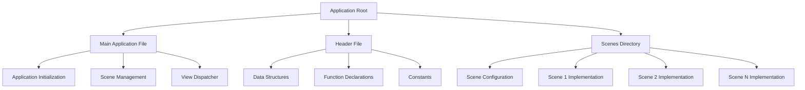
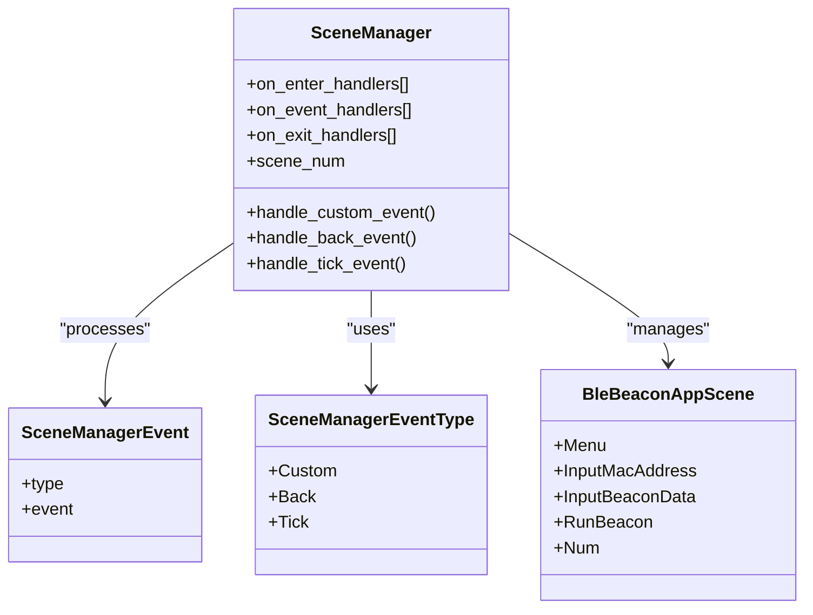
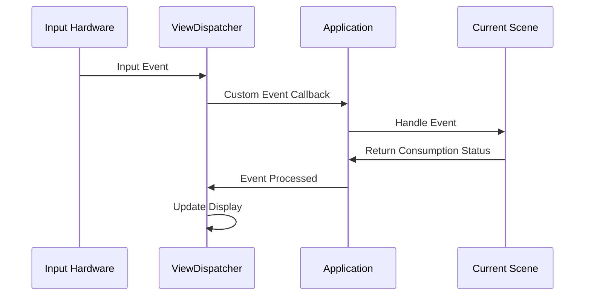
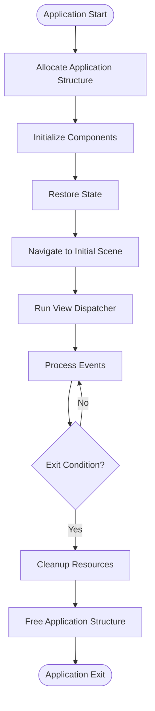
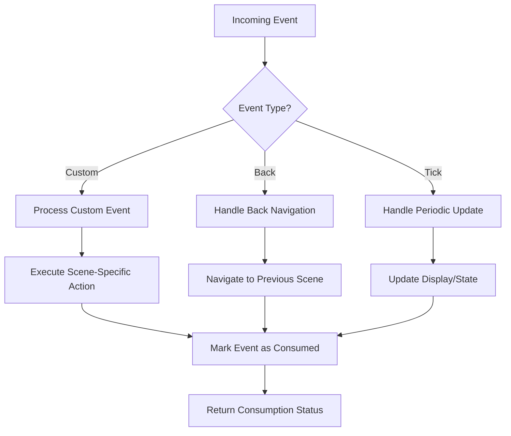
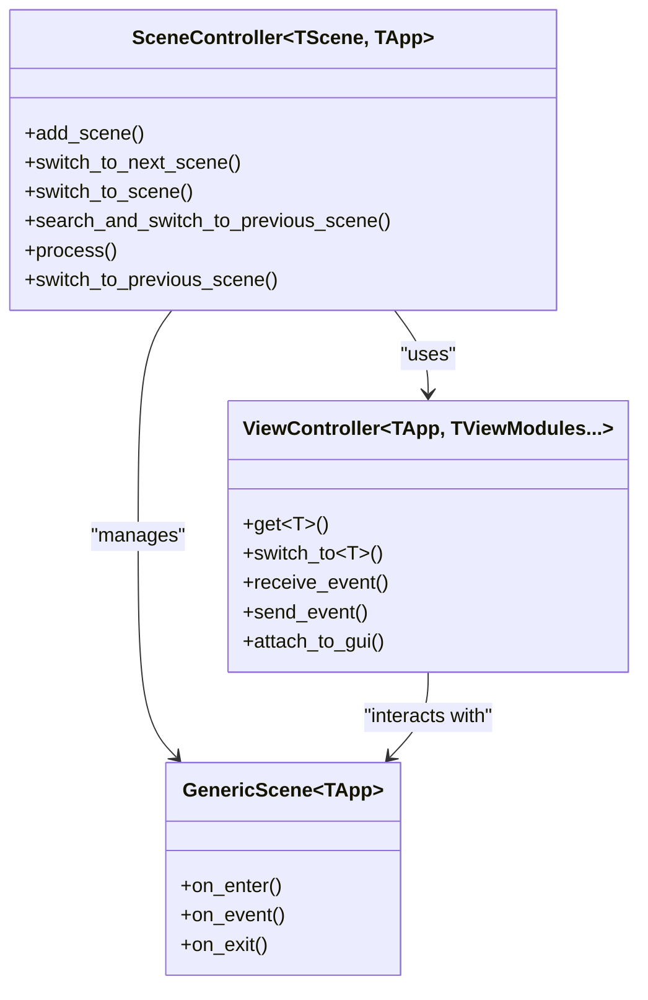

# Application Development

<cite>
**Referenced Files in This Document**   
- [ble_beacon_app.c](file://applications/examples/example_ble_beacon/ble_beacon_app.c)
- [ble_beacon_app.h](file://applications/examples/example_ble_beacon/ble_beacon_app.h)
- [scenes.c](file://applications/examples/example_ble_beacon/scenes/scenes.c)
- [scene_config.h](file://applications/examples/example_ble_beacon/scenes/scene_config.h)
- [scene_menu.c](file://applications/examples/example_ble_beacon/scenes/scene_menu.c)
- [scene_input_mac_addr.c](file://applications/examples/example_ble_beacon/scenes/scene_input_mac_addr.c)
- [scene_run_beacon.c](file://applications/examples/example_ble_beacon/scenes/scene_run_beacon.c)
- [scene_controller.hpp](file://lib/app-scened-template/scene_controller.hpp)
- [generic_scene.hpp](file://lib/app-scened-template/generic_scene.hpp)
- [view_controller.hpp](file://lib/app-scened-template/view_controller.hpp)
- [text_store.h](file://lib/app-scened-template/text_store.h)
</cite>

## Table of Contents
1. [Introduction](#introduction)
2. [Application Structure Overview](#application-structure-overview)
3. [Core Application Components](#core-application-components)
4. [Scene Management System](#scene-management-system)
5. [View Dispatcher Architecture](#view-dispatcher-architecture)
6. [Application Lifecycle](#application-lifecycle)
7. [Event Handling and State Management](#event-handling-and-state-management)
8. [UI Component Development](#ui-component-development)
9. [Modern C++ Template Approach](#modern-c-template-approach)
10. [Application Manifest and Resource Management](#application-manifest-and-resource-management)
11. [Plugin System Integration](#plugin-system-integration)
12. [Best Practices](#best-practices)

## Introduction
This document provides comprehensive guidance on developing applications for the Flipper Zero platform. It covers the complete application development lifecycle, from initialization to cleanup, with detailed explanations of the scene management system, view dispatcher architecture, and resource management patterns. The documentation includes examples of different application types and best practices for memory usage, performance optimization, and firmware compatibility.

## Application Structure Overview
The Flipper Zero application development framework follows a structured approach with clear separation of concerns. Applications are typically organized into directories containing source files, header files, and scene-specific implementations. The example BLE beacon application demonstrates the standard structure with a main application file, header file, and a scenes directory containing individual scene implementations.



**Diagram sources**
- [ble_beacon_app.c](file://applications/examples/example_ble_beacon/ble_beacon_app.c)
- [ble_beacon_app.h](file://applications/examples/example_ble_beacon/ble_beacon_app.h)
- [scenes.c](file://applications/examples/example_ble_beacon/scenes/scenes.c)

**Section sources**
- [ble_beacon_app.c](file://applications/examples/example_ble_beacon/ble_beacon_app.c)
- [ble_beacon_app.h](file://applications/examples/example_ble_beacon/ble_beacon_app.h)

## Core Application Components
The core components of a Flipper Zero application include the application structure, scene manager, and view dispatcher. The application structure typically contains pointers to GUI, scene manager, view dispatcher, and various UI modules, along with application-specific data.

```c
typedef struct {
    Gui* gui;
    SceneManager* scene_manager;
    ViewDispatcher* view_dispatcher;
    
    Submenu* submenu;
    ByteInput* byte_input;
    DialogEx* dialog_ex;
    
    FuriString* status_string;
    
    GapExtraBeaconConfig beacon_config;
    uint8_t beacon_data[EXTRA_BEACON_MAX_DATA_SIZE];
    uint8_t beacon_data_len;
    bool is_beacon_active;
} BleBeaconApp;
```

The application structure serves as the central data container, maintaining state across different scenes and UI components. It is allocated during application initialization and freed during cleanup.

**Section sources**
- [ble_beacon_app.h](file://applications/examples/example_ble_beacon/ble_beacon_app.h#L25-L50)

## Scene Management System
The scene management system in Flipper Zero applications provides a structured way to organize application flow and navigation. Scenes represent distinct states or screens within an application, and the scene manager handles transitions between them.



**Diagram sources**
- [ble_beacon_app.h](file://applications/examples/example_ble_beacon/ble_beacon_app.h#L35-L45)
- [scenes.c](file://applications/examples/example_ble_beacon/scenes/scenes.c#L1-L30)

**Section sources**
- [scenes.c](file://applications/examples/example_ble_beacon/scenes/scenes.c)
- [scene_config.h](file://applications/examples/example_ble_beacon/scenes/scene_config.h)

### Scene Configuration
The scene configuration uses a macro-based approach to define scenes and generate handler arrays. The `scene_config.h` file contains ADD_SCENE macros that define each scene in the application:

```c
ADD_SCENE(ble_beacon_app, menu, Menu)
ADD_SCENE(ble_beacon_app, input_mac_addr, InputMacAddress)
ADD_SCENE(ble_beacon_app, input_beacon_data, InputBeaconData)
ADD_SCENE(ble_beacon_app, run_beacon, RunBeacon)
```

These macros are processed in `scenes.c` to generate arrays of on_enter, on_event, and on_exit handlers, which are then used to initialize the SceneManagerHandlers structure.

## View Dispatcher Architecture
The view dispatcher manages the display of different UI components and handles input events. It acts as a bridge between the application logic and the physical display and input hardware.



**Diagram sources**
- [ble_beacon_app.c](file://applications/examples/example_ble_beacon/ble_beacon_app.c#L20-L40)
- [scene_menu.c](file://applications/examples/example_ble_beacon/scenes/scene_menu.c#L1-L20)

**Section sources**
- [ble_beacon_app.c](file://applications/examples/example_ble_beacon/ble_beacon_app.c)

### View Management
The view dispatcher is configured with callback functions for different event types:

```c
view_dispatcher_set_event_callback_context(app->view_dispatcher, app);
view_dispatcher_set_custom_event_callback(
    app->view_dispatcher, ble_beacon_app_custom_event_callback);
view_dispatcher_set_navigation_event_callback(
    app->view_dispatcher, ble_beacon_app_back_event_callback);
view_dispatcher_set_tick_event_callback(
    app->view_dispatcher, ble_beacon_app_tick_event_callback, 100);
```

Views are added to the dispatcher and associated with specific view types:

```c
view_dispatcher_add_view(
    app->view_dispatcher, BleBeaconAppViewSubmenu, submenu_get_view(app->submenu));
```

## Application Lifecycle
The application lifecycle follows a standard pattern of allocation, execution, and cleanup. The main application function serves as the entry point.



**Diagram sources**
- [ble_beacon_app.c](file://applications/examples/example_ble_beacon/ble_beacon_app.c#L100-L150)

**Section sources**
- [ble_beacon_app.c](file://applications/examples/example_ble_beacon/ble_beacon_app.c)

### Initialization
The application initialization process allocates memory for the application structure and initializes all required components:

```c
static BleBeaconApp* ble_beacon_app_alloc(void) {
    BleBeaconApp* app = malloc(sizeof(BleBeaconApp));
    
    app->gui = furi_record_open(RECORD_GUI);
    
    app->scene_manager = scene_manager_alloc(&ble_beacon_app_scene_handlers, app);
    app->view_dispatcher = view_dispatcher_alloc();
    
    // Configure view dispatcher callbacks
    view_dispatcher_set_event_callback_context(app->view_dispatcher, app);
    view_dispatcher_set_custom_event_callback(
        app->view_dispatcher, ble_beacon_app_custom_event_callback);
    // ... other callback configurations
    
    // Add views to dispatcher
    app->submenu = submenu_alloc();
    view_dispatcher_add_view(
        app->view_dispatcher, BleBeaconAppViewSubmenu, submenu_get_view(app->submenu));
    // ... add other views
    
    ble_beacon_app_restore_beacon_state(app);
    
    return app;
}
```

### Cleanup
The cleanup process ensures proper resource deallocation:

```c
static void ble_beacon_app_free(BleBeaconApp* app) {
    // Remove views from dispatcher
    view_dispatcher_remove_view(app->view_dispatcher, BleBeaconAppViewByteInput);
    // ... remove other views
    
    // Free allocated objects
    free(app->byte_input);
    free(app->submenu);
    // ... free other objects
    
    // Free managers
    free(app->scene_manager);
    free(app->view_dispatcher);
    
    // Close records
    furi_record_close(RECORD_GUI);
    
    // Free application structure
    free(app);
}
```

## Event Handling and State Management
Event handling in Flipper Zero applications follows a structured approach with custom events, navigation events, and tick events. Each scene implements on_event handlers to process incoming events.



**Diagram sources**
- [scene_menu.c](file://applications/examples/example_ble_beacon/scenes/scene_menu.c#L30-L50)
- [scene_input_mac_addr.c](file://applications/examples/example_ble_beacon/scenes/scene_input_mac_addr.c#L25-L40)

**Section sources**
- [scene_menu.c](file://applications/examples/example_ble_beacon/scenes/scene_menu.c)
- [scene_input_mac_addr.c](file://applications/examples/example_ble_beacon/scenes/scene_input_mac_addr.c)

### Scene-Specific Event Handling
Each scene implements event handling logic tailored to its purpose. For example, the menu scene processes submenu selections:

```c
bool ble_beacon_app_scene_menu_on_event(void* context, SceneManagerEvent event) {
    BleBeaconApp* ble_beacon = context;
    SceneManager* scene_manager = ble_beacon->scene_manager;
    
    bool consumed = false;
    
    if(event.type == SceneManagerEventTypeCustom) {
        const uint32_t submenu_index = event.event;
        if(submenu_index == SubmenuIndexSetMac) {
            scene_manager_next_scene(scene_manager, BleBeaconAppSceneInputMacAddress);
            consumed = true;
        } else if(submenu_index == SubmenuIndexSetData) {
            scene_manager_next_scene(scene_manager, BleBeaconAppSceneInputBeaconData);
            consumed = true;
        }
    }
    
    return consumed;
}
```

## UI Component Development
The Flipper Zero platform provides various UI components that can be integrated into applications. These components are managed through the view dispatcher and can be customized for specific use cases.

### Submenu Component
The submenu component provides a simple menu interface:

```c
submenu_add_item(
    submenu,
    "Set MAC",
    SubmenuIndexSetMac,
    ble_beacon_app_scene_menu_submenu_callback,
    ble_beacon);
```

### Byte Input Component
The byte input component allows users to enter binary data:

```c
byte_input_set_result_callback(
    ble_beacon->byte_input,
    ble_beacon_app_scene_add_type_byte_input_callback,
    NULL,
    context,
    ble_beacon->beacon_config.address,
    sizeof(ble_beacon->beacon_config.address));
```

### Dialog Component
The dialog component provides a flexible interface for displaying information and collecting user input:

```c
dialog_ex_set_header(dialog_ex, "BLE Beacon Demo", 64, 0, AlignCenter, AlignTop);
dialog_ex_set_text(dialog_ex, furi_string_get_cstr(status), 0, 29, AlignLeft, AlignCenter);
dialog_ex_set_icon(dialog_ex, 93, 20, &I_lighthouse_35x44);
dialog_ex_set_left_button_text(dialog_ex, "Config");
dialog_ex_set_center_button_text(dialog_ex, ble_beacon->is_beacon_active ? "Stop" : "Start");
```

**Section sources**
- [scene_menu.c](file://applications/examples/example_ble_beacon/scenes/scene_menu.c)
- [scene_input_mac_addr.c](file://applications/examples/example_ble_beacon/scenes/scene_input_mac_addr.c)
- [scene_run_beacon.c](file://applications/examples/example_ble_beacon/scenes/scene_run_beacon.c)

## Modern C++ Template Approach
The Flipper Zero platform also supports a modern C++ template approach to application development, providing a more structured and type-safe framework.



**Diagram sources**
- [scene_controller.hpp](file://lib/app-scened-template/scene_controller.hpp#L1-L50)
- [generic_scene.hpp](file://lib/app-scened-template/generic_scene.hpp#L1-L10)
- [view_controller.hpp](file://lib/app-scened-template/view_controller.hpp#L1-L50)

**Section sources**
- [scene_controller.hpp](file://lib/app-scened-template/scene_controller.hpp)
- [generic_scene.hpp](file://lib/app-scened-template/generic_scene.hpp)
- [view_controller.hpp](file://lib/app-scened-template/view_controller.hpp)

### Scene Controller Template
The SceneController template provides a type-safe approach to scene management:

```cpp
template <typename TScene, typename TApp>
class SceneController {
public:
    void add_scene(typename TApp::SceneType scene_index, TScene* scene_pointer);
    void switch_to_next_scene(typename TApp::SceneType scene_index, bool need_restore = false);
    void switch_to_scene(typename TApp::SceneType scene_index, bool need_restore = false);
    bool search_and_switch_to_previous_scene(
        const std::initializer_list<typename TApp::SceneType>& scene_index_list);
    void process(
        uint32_t tick_length_ms = 100,
        typename TApp::SceneType start_scene_index = TApp::SceneType::Start);
    bool switch_to_previous_scene(uint8_t count = 1);
    
private:
    std::map<typename TApp::SceneType, TScene*> scenes;
    typename TApp::SceneType current_scene_index;
    TApp* app;
    std::forward_list<typename TApp::SceneType> previous_scenes_list;
};
```

### View Controller Template
The ViewController template manages view switching and event handling:

```cpp
template <typename TApp, typename... TViewModules>
class ViewController {
public:
    template <typename T>
    T* get();
    
    template <typename T>
    void switch_to();
    
    void receive_event(typename TApp::Event* event);
    void send_event(typename TApp::Event* event);
    void attach_to_gui(ViewDispatcherType type);
    
private:
    std::map<size_t, GenericViewModule*> holder;
    FuriMessageQueue* event_queue;
    ViewDispatcher* view_dispatcher;
    Gui* gui;
    ViewNavigationCallback previous_view_callback_pointer;
};
```

## Application Manifest and Resource Management
Application manifests define metadata and resources for Flipper Zero applications. While not directly shown in the example files, the build system processes manifests to include assets and configure application properties.

Resource management follows a pattern of allocation during initialization and cleanup during application termination. The text_store component provides utilities for managing text data:

```cpp
// Text store functionality
class TextStore {
public:
    static constexpr size_t TextStoreSize = 256;
    char buffer[TextStoreSize];
    
    char* get() { return buffer; }
    void set(const char* format, ...) {
        va_list args;
        va_start(args, format);
        vsnprintf(buffer, TextStoreSize, format, args);
        va_end(args);
    }
};
```

**Section sources**
- [text_store.h](file://lib/app-scened-template/text_store.h)

## Plugin System Integration
The plugin system allows for extensible application functionality. The example_plugins and example_plugins_advanced directories demonstrate plugin integration patterns, though specific implementation details are not shown in the analyzed files.

Plugin integration typically involves:
- Defining plugin interfaces
- Implementing plugin functionality
- Registering plugins with the application
- Managing plugin lifecycle

## Best Practices
### Memory Usage
- Allocate memory during initialization and free during cleanup
- Use stack allocation for small, temporary data
- Reuse buffers when possible
- Avoid memory leaks by ensuring all allocations have corresponding frees

### Performance Optimization
- Minimize tick event processing
- Use efficient data structures
- Cache frequently accessed data
- Optimize display updates

### Firmware Compatibility
- Use documented APIs
- Check firmware version when using newer features
- Provide fallbacks for deprecated functionality
- Follow coding style guidelines

### Error Handling
- Use furi_check for critical assertions
- Validate input parameters
- Handle edge cases gracefully
- Provide meaningful error messages

### Code Organization
- Separate concerns into logical components
- Use consistent naming conventions
- Document complex logic
- Follow the established patterns in example applications