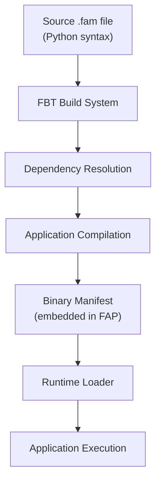
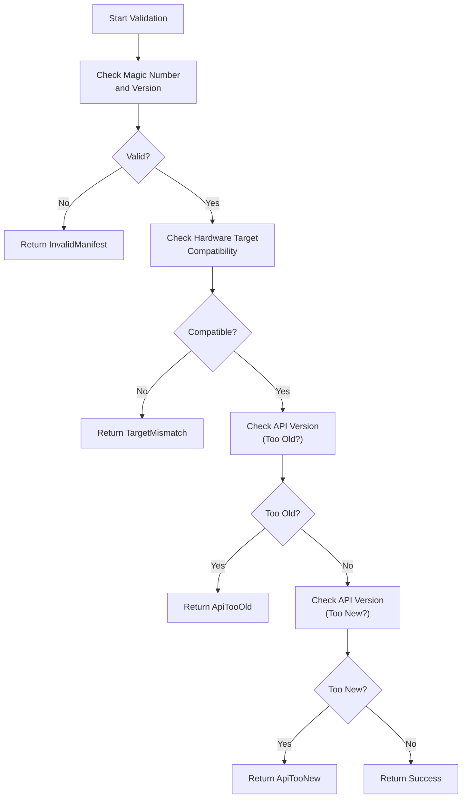
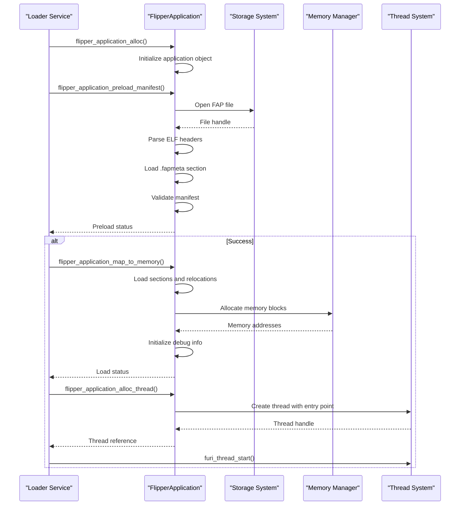

# Application Manifest System

<cite>
**Referenced Files in This Document**   
- [application.fam](file://applications/debug/accessor/application.fam)
- [application_manifest.h](file://lib/flipper_application/application_manifest.h)
- [application_manifest.c](file://lib/flipper_application/application_manifest.c)
- [flipper_application.h](file://lib/flipper_application/flipper_application.h)
- [flipper_application.c](file://lib/flipper_application/flipper_application.c)
- [appmanifest.py](file://scripts/fbt/appmanifest.py)
- [AppManifests.md](file://documentation/AppManifests.md)
- [application_assets.h](file://lib/flipper_application/application_assets.h)
- [application_assets.c](file://lib/flipper_application/application_assets.c)
</cite>

## Table of Contents
1. [Introduction](#introduction)
2. [Manifest File Format (.fam)](#manifest-file-format-fam)
3. [Manifest Structure and Fields](#manifest-structure-and-fields)
4. [Manifest Parsing and Validation](#manifest-parsing-and-validation)
5. [Application Registration and Loading](#application-registration-and-loading)
6. [Dynamic Application Loading](#dynamic-application-loading)
7. [Common Issues and Solutions](#common-issues-and-solutions)
8. [Best Practices for Manifest Configuration](#best-practices-for-manifest-configuration)
9. [Conclusion](#conclusion)

## Introduction
The Application Manifest System is a core component of the Flipper Zero platform that enables dynamic application management, loading, and integration with the system's main menu. This system uses manifest files (.fam) to define application metadata, dependencies, and configuration parameters that allow the firmware to properly load and execute applications. The manifest system serves as the bridge between compiled application binaries (FAP files) and the Flipper Zero operating environment, ensuring compatibility, proper resource allocation, and seamless user interface integration.

The manifest system operates at multiple levels: during the build process with the FBT (Flipper Build Tool) system, during runtime when applications are loaded from storage, and during execution when applications interact with system services. This documentation provides a comprehensive overview of the manifest system, covering the file format specification, parsing implementation, validation procedures, and practical usage patterns for both firmware developers and application creators.

**Section sources**
- [AppManifests.md](file://documentation/AppManifests.md#L1-L140)

## Manifest File Format (.fam)
The Flipper Application Manifest (.fam) files are Python-based configuration files that define the properties and relationships of applications within the Flipper Zero ecosystem. These files use a domain-specific syntax built around the `App()` function call, which accepts various parameters to describe an application's characteristics. The .fam format serves dual purposes: it acts as a build-time configuration for the FBT system and as a runtime descriptor embedded within FAP (Flipper Application Package) files.

The manifest system supports multiple application types through the `apptype` parameter, which determines how an application is treated by both the build system and runtime environment. Each .fam file can contain one or more `App()` declarations, allowing related applications to be defined within a single file. The Python-based syntax enables conditional logic and dynamic configuration, though most manifests use straightforward static declarations.

During the build process, the FBT system parses all .fam files in the repository to construct a complete dependency graph of applications. This graph determines which applications are included in a particular firmware build based on the target configuration. The same manifest information is then compiled into a binary format and embedded within the resulting FAP file, where it can be read by the runtime application loader.



**Diagram sources**
- [appmanifest.py](file://scripts/fbt/appmanifest.py#L1-L478)
- [application_manifest.h](file://lib/flipper_application/application_manifest.h#L1-L90)

## Manifest Structure and Fields
The Flipper application manifest supports a comprehensive set of fields that define various aspects of an application's behavior, requirements, and presentation. These fields are categorized into core properties, build-time configuration, runtime parameters, and metadata for user interface presentation.

### Core Properties
The essential fields that every manifest must define include:
- **appid**: A unique identifier following the pattern `^[a-z0-9_]+$`, used for dependency resolution and internal referencing
- **apptype**: Specifies the application category from the `FlipperAppType` enumeration (SERVICE, SYSTEM, APP, PLUGIN, etc.)
- **name**: The human-readable name displayed in menus and interfaces

### Runtime Configuration
These fields determine how the application executes within the system:
- **stack_size**: Memory allocation for the application's execution stack in bytes
- **entry_point**: The C function name that serves as the application's starting point
- **requires**: List of application IDs that this application depends on
- **conflicts**: List of application IDs that cannot coexist with this application
- **provides**: Additional application IDs that this application makes available (functionally identical to requires)

### User Interface and Presentation
Fields that control how the application appears to users:
- **icon**: Reference to an animated icon from built-in assets
- **order**: Numerical value determining the application's position within menus
- **fap_category**: For external applications, determines the subdirectory in the apps folder
- **fap_icon**: Path to a 10x10px PNG file for external application icons

### Build-Time Configuration
Parameters that affect the compilation process:
- **sources**: File patterns for source code inclusion (e.g., ["*.c*"])
- **cdefines**: Preprocessor definitions to be applied during compilation
- **cflags**: Compiler flags specific to this application
- **fap_version**: Version string in major.minor format
- **fap_libs**: External libraries to link against
- **fap_private_libs**: Private libraries bundled with the application
- **fap_extbuild**: External build commands for non-standard compilation processes

The manifest system distinguishes between firmware-embedded applications and external FAP applications, with certain fields only applicable to one type or the other. For example, the `fap_extbuild` parameter is only meaningful for external applications that require special compilation steps.

**Section sources**
- [AppManifests.md](file://documentation/AppManifests.md#L15-L110)
- [appmanifest.py](file://scripts/fbt/appmanifest.py#L34-L93)

## Manifest Parsing and Validation
The manifest parsing and validation process occurs at both build time and runtime, ensuring application integrity and compatibility with the host system. The runtime validation is implemented in the `flipper_application` library, which provides functions to verify manifest correctness and compatibility before loading an application.

### Binary Manifest Structure
At runtime, the manifest exists in a binary format defined by the `FlipperApplicationManifest` structure in `application_manifest.h`. This structure includes:
- Magic number (`FAP_MANIFEST_MAGIC`) for format identification
- Version number (`FAP_MANIFEST_SUPPORTED_VERSION`)
- API version compatibility information
- Hardware target identifier
- Stack size allocation
- Application version
- Application name (up to 32 characters)
- Icon data (up to 32 bytes)

The binary manifest is stored in the `.fapmeta` section of the ELF binary, allowing the loader to quickly access critical metadata without parsing the entire file.

### Validation Process
The validation process consists of several checks performed by dedicated functions:



The key validation functions are:
- `flipper_application_manifest_is_valid()`: Verifies the manifest's magic number and version
- `flipper_application_manifest_is_target_compatible()`: Ensures the application matches the current hardware
- `flipper_application_manifest_is_too_old()`: Checks if the application's API version is older than supported
- `flipper_application_manifest_is_too_new()`: Checks if the application's API version is newer than supported

These validation functions are called during the `flipper_application_preload()` process, which performs initial checks before fully loading an application into memory. The preload status codes provide detailed feedback about validation failures, enabling appropriate error handling and user feedback.

**Section sources**
- [application_manifest.h](file://lib/flipper_application/application_manifest.h#L15-L86)
- [application_manifest.c](file://lib/flipper_application/application_manifest.c#L6-L50)
- [flipper_application.c](file://lib/flipper_application/flipper_application.c#L101-L120)

## Application Registration and Loading
The application loading process in Flipper Zero is a multi-stage operation that begins with manifest parsing and ends with thread execution. This process is managed by the `FlipperApplication` structure and its associated functions in the `flipper_application` library.

### Loading Workflow
The application loading workflow follows these steps:



### Key Functions
The loading process utilizes several key functions:

- `flipper_application_alloc()`: Creates a new `FlipperApplication` instance with associated storage and API interface
- `flipper_application_preload_manifest()`: Parses the ELF file headers and loads the manifest without loading the full application
- `flipper_application_get_manifest()`: Retrieves the parsed manifest data for inspection
- `flipper_application_map_to_memory()`: Loads all application sections into memory and processes relocations
- `flipper_application_alloc_thread()`: Creates an execution thread for the application with the specified stack size

The loading process includes error handling at each stage, with specific status codes returned for different failure modes:
- `FlipperApplicationPreloadStatusInvalidFile`: The file is not a valid ELF binary
- `FlipperApplicationPreloadStatusNotEnoughMemory`: Insufficient memory to load the application
- `FlipperApplicationPreloadStatusInvalidManifest`: The manifest fails validation checks
- `FlipperApplicationPreloadStatusApiTooOld`: Application requires an older API version
- `FlipperApplicationPreloadStatusApiTooNew`: Application requires a newer API version
- `FlipperApplicationLoadStatusMissingImports`: Required symbols are not available

Applications are registered with the system through the main menu loader, which reads manifest information to determine application placement and presentation. The `flipper_application_load_name_and_icon()` function specifically handles extracting the application name and icon from the FAP file for menu display.

**Section sources**
- [flipper_application.h](file://lib/flipper_application/flipper_application.h#L19-L160)
- [flipper_application.c](file://lib/flipper_application/flipper_application.c#L54-L392)

## Dynamic Application Loading
The Flipper Zero platform supports dynamic application loading through its FAP (Flipper Application Package) system, which allows applications to be installed and executed without reflashing the entire firmware. This capability is enabled by the manifest system, which provides the necessary metadata for the runtime loader to safely execute external code.

### FAP File Structure
A FAP file is an ELF binary with specific sections containing application code and metadata:
- `.text`: Executable code
- `.rodata`: Read-only data
- `.data`: Initialized data
- `.bss`: Uninitialized data
- `.fapmeta`: Binary manifest data
- `.fapassets`: Embedded assets and resources
- `.gnu_debuglink`: Debug information link

The dynamic loading process begins when the user selects an application from the file browser or main menu. The loader service calls `flipper_application_preload_manifest()` to validate the application before full loading, ensuring compatibility and safety. This two-stage loading process (preload then map) prevents memory exhaustion from invalid applications.

### Plugin Architecture
The manifest system also supports a plugin architecture where applications can extend the functionality of other applications. Plugins are defined with `apptype=FlipperAppType.PLUGIN` and have a stack size of 0, indicating they are not standalone executables. The plugin system uses the `FlipperAppPluginDescriptor` structure to expose functionality:

```c
typedef struct {
    const char* appid;
    const uint32_t ep_api_version;
    const void* entry_point;
} FlipperAppPluginDescriptor;
```

Plugins are loaded using `flipper_application_plugin_get_descriptor()`, which calls the plugin's entry point to retrieve its descriptor. This allows the host application to dynamically discover and use plugin functionality at runtime.

The `fap_file_assets` parameter in the manifest enables applications to bundle additional resources that are extracted to the filesystem when the application runs. This feature supports complex applications that require data files, configuration, or other assets.

**Section sources**
- [application_assets.h](file://lib/flipper_application/application_assets.h#L1-L18)
- [application_assets.c](file://lib/flipper_application/application_assets.c#L1-L362)
- [flipper_application.h](file://lib/flipper_application/flipper_application.h#L127-L135)

## Common Issues and Solutions
Developers working with the Flipper Zero manifest system may encounter several common issues. Understanding these problems and their solutions is essential for creating reliable applications.

### Manifest Syntax Errors
Syntax errors in .fam files can prevent applications from building or loading. Common issues include:
- Invalid `appid` format (must match `^[a-z0-9_]+$`)
- Missing required fields (`appid` and `apptype`)
- Incorrect Python syntax in the manifest
- Circular dependencies between applications

These errors are typically caught during the build process by the FBT system, which provides detailed error messages about the location and nature of the problem.

### Invalid Paths and Resources
Issues with file paths and resources often occur when:
- Referencing non-existent icon files
- Specifying incorrect source file patterns
- Using absolute paths instead of relative paths
- Referencing resources that exceed size limitations

The build system validates paths during compilation, but runtime resource loading failures may occur if external dependencies are missing.

### Version Compatibility Problems
Version compatibility issues manifest as:
- `ApiTooOld` errors when applications are built against older SDK versions
- `ApiTooNew` errors when applications require newer firmware features
- ABI incompatibilities between library versions

These issues are detected during the manifest validation phase, before the application is fully loaded into memory.

### Hardware Target Mismatches
Applications built for specific hardware targets may fail to load on different Flipper Zero models. The manifest system includes hardware target validation to prevent execution of incompatible applications, returning a `TargetMismatch` error when detected.

### Solutions and Validation Techniques
To avoid these issues, developers should:
- Use the `fbt` build system to validate manifests before deployment
- Test applications on the target hardware whenever possible
- Follow the documented field requirements and constraints
- Use version control to track manifest changes
- Validate FAP files with the `flipper_format` tools before distribution
- Implement proper error handling in application code to manage loading failures gracefully

The runtime validation functions provide detailed feedback that can be used to diagnose and resolve issues, making the manifest system both robust and developer-friendly.

**Section sources**
- [AppManifests.md](file://documentation/AppManifests.md#L114-L140)
- [application_manifest.c](file://lib/flipper_application/application_manifest.c#L6-L50)

## Best Practices for Manifest Configuration
Creating effective manifest configurations requires understanding both the technical requirements and the user experience implications. The following best practices help ensure applications integrate smoothly with the Flipper Zero platform.

### Application Identification
- Use descriptive but concise `appid` values that clearly identify the application's purpose
- Follow the lowercase alphanumeric convention with underscores as separators
- Avoid generic names that might conflict with existing or future applications

### Resource Management
- Set appropriate `stack_size` values based on actual application requirements
- Profile memory usage using CLI commands like `top` and `free`
- Minimize dependencies to reduce memory footprint and loading time
- Use `fap_libs` judiciously, as each additional library increases FAP size

### User Interface Design
- Choose meaningful `name` values that are clear to end users
- Use the `order` parameter to position applications logically within menus
- Select appropriate `fap_category` values to organize applications in the file system
- Provide high-quality 10x10px icons that are easily recognizable

### Dependency Management
- Declare all required dependencies in the `requires` field
- Use `conflicts` to prevent incompatible applications from being installed together
- Leverage `provides` to create logical application groups and bundles
- Test dependency resolution thoroughly in different build configurations

### Versioning and Maintenance
- Increment `fap_version` with each release to help users identify updates
- Maintain backward compatibility when possible
- Document breaking changes in the application description
- Use semantic versioning principles for version numbers

Following these best practices ensures that applications are reliable, user-friendly, and maintainable within the Flipper Zero ecosystem.

**Section sources**
- [AppManifests.md](file://documentation/AppManifests.md#L39-L43)
- [appmanifest.py](file://scripts/fbt/appmanifest.py#L109-L125)

## Conclusion
The Application Manifest System is a sophisticated and essential component of the Flipper Zero platform, enabling flexible application management, dynamic loading, and robust dependency resolution. By providing a standardized way to describe application properties and requirements, the manifest system allows both the build process and runtime environment to make informed decisions about application compatibility, resource allocation, and user interface integration.

The system's design balances simplicity for basic applications with extensibility for complex use cases, supporting everything from simple utilities to sophisticated plugins with external dependencies. The two-phase validation process (build-time and runtime) ensures application integrity while allowing for dynamic loading of external code.

For developers, understanding the manifest system is crucial for creating applications that integrate seamlessly with the Flipper Zero platform. The comprehensive field set allows precise control over application behavior, while the validation mechanisms provide safety and compatibility guarantees. By following best practices and leveraging the full capabilities of the manifest system, developers can create powerful, reliable applications that enhance the Flipper Zero user experience.

As the platform evolves, the manifest system will continue to play a central role in enabling new features and capabilities, serving as the foundation for application management and execution on the Flipper Zero device.