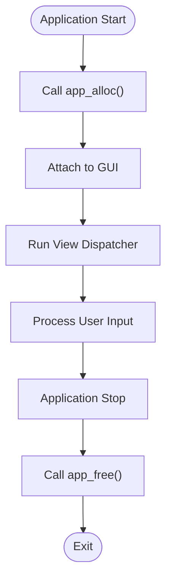
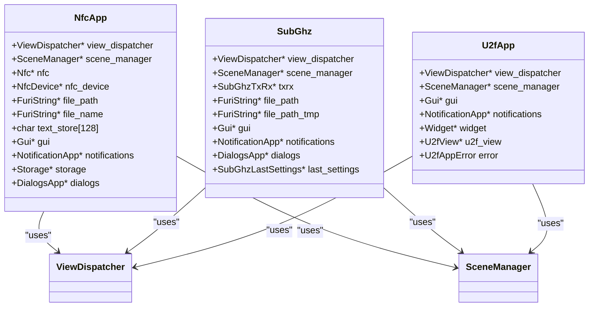
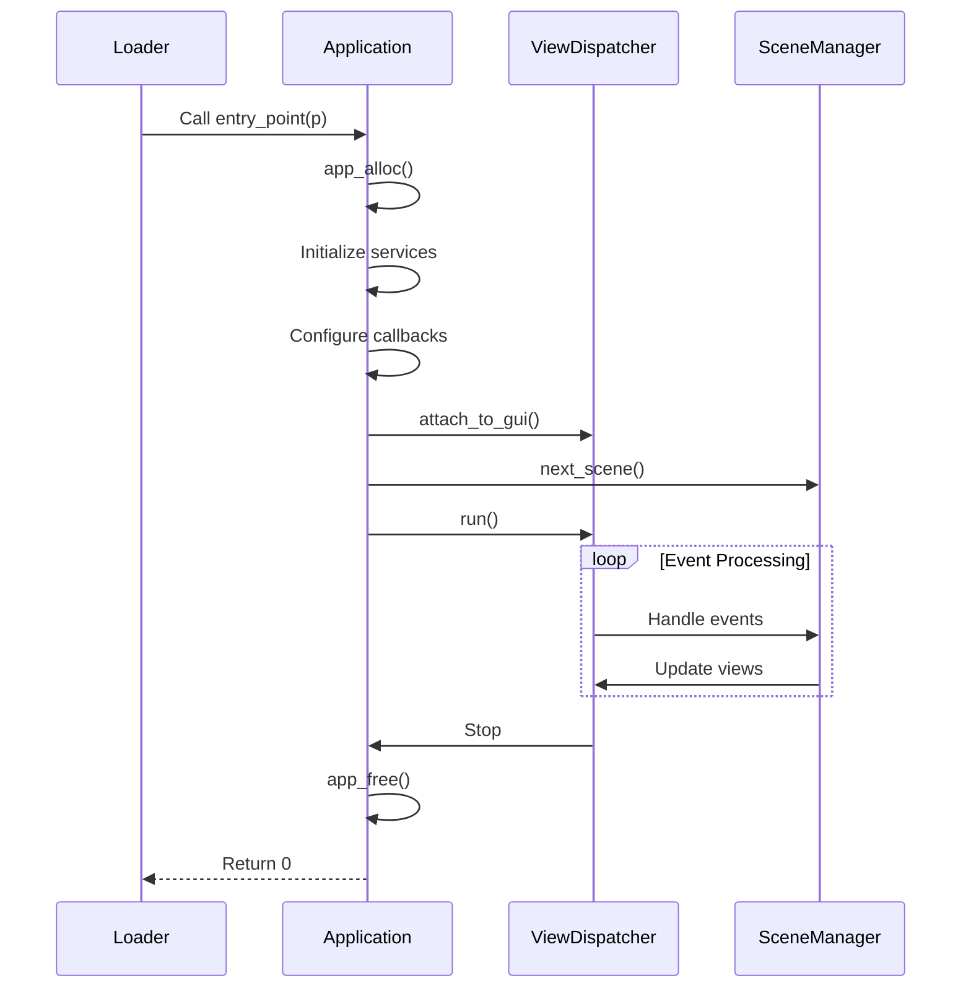

# Application Structure

<cite>
**Referenced Files in This Document**   
- [nfc_app.c](file://applications/main/nfc/nfc_app.c)
- [subghz.c](file://applications/main/subghz/subghz.c)
- [u2f_app.c](file://applications/main/u2f/u2f_app.c)
- [archive.c](file://applications/main/archive/archive.c)
- [application.fam](file://applications/main/nfc/application.fam)
- [appmanifest.py](file://scripts/fbt/appmanifest.py)
- [flipper_application.h](file://lib/flipper_application/flipper_application.h)
</cite>

## Table of Contents
1. [Application Manifest](#application-manifest)
2. [Entry Points and Lifecycle Management](#entry-points-and-lifecycle-management)
3. [Application State Management](#application-state-management)
4. [Resource Initialization Patterns](#resource-initialization-patterns)
5. [Application Registration via FlipperApplication API](#application-registration-via-flipperapplication-api)
6. [Memory Management and Cleanup](#memory-management-and-cleanup)
7. [Code Organization Best Practices](#code-organization-best-practices)

## Application Manifest

The application manifest is a critical component of every Flipper Zero application, serving as the metadata descriptor that defines application properties, dependencies, and build configuration. Manifests are defined in YAML format with the `.fam` extension and are processed during the build system execution.

The structure of the application manifest includes essential fields such as:
- **appid**: Unique identifier following the pattern `^[a-z0-9_]+$`
- **apptype**: Classification of the application type (e.g., `App`, `Debug`, `Plugin`)
- **name**: Display name for the application
- **entry_point**: Function name serving as the application's entry point
- **stack_size**: Memory allocation for the application thread
- **icon**: Path to the application icon asset
- **requires**: List of required system services or dependencies
- **fap_version**: Version identifier in major.minor format
- **fap_category**: User-facing category classification
- **fap_description**: Brief description of the application's purpose

```yaml
appid: nfc
apptype: App
name: NFC
entry_point: nfc_app
stack_size: 2048
icon: icons/nfc_10px.png
requires: 
  - gui
  - notification
  - storage
  - dialogs
fap_version: "0.1"
fap_category: Utility
fap_description: NFC tag reading and emulation
fap_author: Flipper Devices
```

The build system processes these manifests through the `appmanifest.py` module, which validates the manifest structure and converts it into appropriate build configurations and runtime metadata.

**Section sources**
- [appmanifest.py](file://scripts/fbt/appmanifest.py#L34-L123)
- [application.fam](file://applications/main/nfc/application.fam)

## Entry Points and Lifecycle Management

Flipper Zero applications follow a standardized lifecycle model managed by the system loader. Each application implements an entry point function that serves as the main execution context.

### Entry Point Function Signature
```c
int32_t application_name_app(void* p);
```

The entry point receives command-line style arguments through the `p` parameter, which can include:
- File paths for direct loading
- RPC session identifiers
- Launch configuration flags

### Lifecycle Callbacks
Applications implement lifecycle management through initialization and cleanup functions rather than explicit `on_start`/`on_stop` callbacks. The lifecycle pattern follows:

1. **Allocation Function**: `app_alloc()` - Initializes application state and resources
2. **Entry Point**: `app_app()` - Orchestrates application flow and scene management
3. **Free Function**: `app_free()` - Releases all allocated resources

For example, the NFC application implements:
- `nfc_app_alloc()` - Creates the `NfcApp` structure and initializes subsystems
- `nfc_app()` - Main entry point that processes arguments and starts the dispatcher
- `nfc_app_free()` - Cleans up all allocated resources



**Diagram sources**
- [nfc_app.c](file://applications/main/nfc/nfc_app.c#L200-L533)
- [subghz.c](file://applications/main/subghz/subghz.c#L200-L440)

**Section sources**
- [nfc_app.c](file://applications/main/nfc/nfc_app.c#L0-L199)
- [subghz.c](file://applications/main/subghz/subghz.c#L0-L199)
- [u2f_app.c](file://applications/main/u2f/u2f_app.c#L0-L94)

## Application State Management

Application state is managed through a dedicated application context structure that encapsulates all runtime data. This structure follows the Handle-Body pattern, with private implementation details hidden from external access.

### State Structure Pattern
Each application defines a private structure (e.g., `NfcApp`, `SubGhz`) that contains:
- **View Dispatcher**: Central controller for UI navigation
- **Scene Manager**: State machine for managing application scenes
- **Hardware Interfaces**: References to NFC, Sub-GHz, or other radio modules
- **UI Components**: Submenu, popup, text input, and other view elements
- **Data Buffers**: Temporary storage for protocol data and user input
- **File Paths**: Current file operations and directory context
- **Configuration**: User preferences and runtime settings

### Example: NFC Application State
```c
typedef struct {
    ViewDispatcher* view_dispatcher;
    SceneManager* scene_manager;
    Nfc* nfc;
    NfcDevice* nfc_device;
    FuriString* file_path;
    FuriString* file_name;
    char text_store[128];
    Gui* gui;
    NotificationApp* notifications;
    Storage* storage;
    DialogsApp* dialogs;
    // ... additional components
} NfcApp;
```

The state structure is allocated on the heap during application startup and freed during shutdown, ensuring proper memory isolation between application instances.



**Diagram sources**
- [nfc_app.c](file://applications/main/nfc/nfc_app.c#L0-L199)
- [subghz.c](file://applications/main/subghz/subghz.c#L0-L199)
- [u2f_app.c](file://applications/main/u2f/u2f_app.c#L0-L94)

**Section sources**
- [nfc_app.c](file://applications/main/nfc/nfc_app.c#L0-L199)
- [subghz.c](file://applications/main/subghz/subghz.c#L0-L199)
- [u2f_app.c](file://applications/main/u2f/u2f_app.c#L0-L94)

## Resource Initialization Patterns

Applications follow a consistent pattern for resource initialization, ensuring proper dependency ordering and error handling.

### Initialization Sequence
1. **Memory Allocation**: Allocate the application context structure
2. **String Initialization**: Initialize FuriString objects for path management
3. **Service Records**: Open system records (GUI, Notifications, Storage, Dialogs)
4. **View Dispatcher**: Create and configure the view dispatcher
5. **Scene Manager**: Initialize the scene state machine
6. **UI Components**: Allocate and register all view components
7. **Hardware Subsystems**: Initialize radio modules and protocol handlers
8. **Configuration Loading**: Restore user preferences and last settings

### Example: SubGHz Initialization
```c
SubGhz* subghz_alloc(bool alloc_for_tx_only) {
    SubGhz* subghz = malloc(sizeof(SubGhz));
    
    // Initialize strings
    subghz->file_path = furi_string_alloc();
    subghz->file_path_tmp = furi_string_alloc();
    
    // Open service records
    subghz->gui = furi_record_open(RECORD_GUI);
    subghz->notifications = furi_record_open(RECORD_NOTIFICATION);
    subghz->dialogs = furi_record_open(RECORD_DIALOGS);
    
    // Initialize view system
    subghz->view_dispatcher = view_dispatcher_alloc();
    subghz->scene_manager = scene_manager_alloc(&subghz_scene_handlers, subghz);
    
    // Configure callbacks
    view_dispatcher_set_event_callback_context(subghz->view_dispatcher, subghz);
    view_dispatcher_set_custom_event_callback(subghz->view_dispatcher, subghz_custom_event_callback);
    view_dispatcher_set_navigation_event_callback(subghz->view_dispatcher, subghz_back_event_callback);
    
    // Allocate UI components
    subghz->submenu = submenu_alloc();
    view_dispatcher_add_view(subghz->view_dispatcher, SubGhzViewIdMenu, submenu_get_view(subghz->submenu));
    
    // Initialize hardware
    subghz->txrx = subghz_txrx_alloc();
    
    // Load configuration
    subghz->last_settings = subghz_last_settings_alloc();
    subghz_last_settings_load(subghz->last_settings, 0);
    
    return subghz;
}
```

**Section sources**
- [subghz.c](file://applications/main/subghz/subghz.c#L0-L199)
- [nfc_app.c](file://applications/main/nfc/nfc_app.c#L0-L199)

## Application Registration via FlipperApplication API

Applications are registered with the system through the FlipperApplication API, which provides the infrastructure for application loading, execution, and lifecycle management.

### Registration Process
The registration is handled by the build system, which processes the application manifest and generates the necessary metadata for the loader. The `FlipperApplication` structure in the build system defines all application properties:

```python
@dataclass
class FlipperApplication:
    appid: str
    apptype: FlipperAppType
    name: Optional[str]
    entry_point: Optional[str]
    stack_size: int
    icon: Optional[str]
    fap_version: Union[str, Tuple[int]]
    fap_category: str
    fap_description: str
    # ... additional fields
```

### Runtime Registration
At runtime, the loader uses the `flipper_application.h` interface to manage applications:

```c
typedef struct FlipperApplication FlipperApplication;
```

The system loader reads the application metadata, validates dependencies, allocates the required stack space, and invokes the entry point function in a dedicated thread context.

### Example: U2F Application Registration
The U2F application registers with the following manifest properties:
- **appid**: `u2f`
- **apptype**: `App`
- **entry_point**: `u2f_app`
- **stack_size**: Default (2048 bytes)
- **requires**: `gui`, `notification`, `storage`

The entry point `u2f_app()` is called by the loader, which passes any command-line arguments for processing.



**Diagram sources**
- [flipper_application.h](file://lib/flipper_application/flipper_application.h#L46)
- [u2f_app.c](file://applications/main/u2f/u2f_app.c#L0-L94)

**Section sources**
- [appmanifest.py](file://scripts/fbt/appmanifest.py#L34-L123)
- [flipper_application.h](file://lib/flipper_application/flipper_application.h#L46)
- [u2f_app.c](file://applications/main/u2f/u2f_app.c#L0-L94)

## Memory Management and Cleanup

Proper memory management is critical to prevent leaks and ensure system stability. Applications must follow strict cleanup procedures during shutdown.

### Cleanup Pattern
The cleanup function (`app_free()`) must:
1. **Release RPC Resources**: Clear RPC callbacks and send exit notifications
2. **Stop Hardware Operations**: Halt radio transmission and put modules to sleep
3. **Remove Views**: Unregister all views from the dispatcher
4. **Free Components**: Deallocate UI components and data structures
5. **Close Records**: Release system service references
6. **Free Context**: Deallocate the application structure

### Example: NFC Cleanup
```c
void nfc_app_free(NfcApp* instance) {
    // Release RPC resources
    if(instance->rpc_ctx) {
        rpc_system_app_send_exited(instance->rpc_ctx);
        rpc_system_app_set_callback(instance->rpc_ctx, NULL, NULL);
    }
    
    // Free hardware components
    nfc_free(instance->nfc);
    nfc_device_free(instance->nfc_device);
    
    // Remove and free views
    view_dispatcher_remove_view(instance->view_dispatcher, NfcViewMenu);
    submenu_free(instance->submenu);
    
    // Close service records
    furi_record_close(RECORD_DIALOGS);
    furi_record_close(RECORD_STORAGE);
    furi_record_close(RECORD_NOTIFICATION);
    furi_record_close(RECORD_GUI);
    
    // Free strings
    furi_string_free(instance->file_path);
    furi_string_free(instance->file_name);
    
    // Free main structure
    free(instance);
}
```

### Common Issues and Best Practices
- **Memory Leaks**: Ensure every `alloc()` has a corresponding `free()` in the cleanup path
- **Resource Conflicts**: Always stop hardware operations before releasing resources
- **Order Dependency**: Clean up in reverse order of initialization
- **Null Checks**: Always check pointers before dereferencing in cleanup functions
- **Thread Safety**: Ensure no background operations continue after cleanup begins

**Section sources**
- [nfc_app.c](file://applications/main/nfc/nfc_app.c#L200-L533)
- [subghz.c](file://applications/main/subghz/subghz.c#L200-L440)
- [u2f_app.c](file://applications/main/u2f/u2f_app.c#L0-L94)

## Code Organization Best Practices

Effective code organization enhances maintainability and collaboration. Flipper Zero applications follow several best practices:

### Directory Structure
```
applications/main/app_name/
├── helpers/        # Utility functions and protocol helpers
├── scenes/         # Scene handler implementations
├── views/          # Custom view components
├── app_name.c      # Main application logic
├── app_name.h      # Public API declarations
└── app_name_i.h    # Private internal declarations
```

### Modular Design Principles
1. **Separation of Concerns**: Isolate UI, business logic, and hardware interaction
2. **Scene-Based Navigation**: Use the scene manager for state transitions
3. **Event-Driven Architecture**: Handle user input through callback mechanisms
4. **Resource Management**: Centralize allocation and cleanup in dedicated functions
5. **Configuration Persistence**: Store user preferences and last states

### Compatibility Considerations
- **API Stability**: Use documented public APIs rather than internal implementation details
- **Versioning**: Specify compatible firmware versions in the application manifest
- **Feature Detection**: Check for optional features at runtime rather than compile time
- **Graceful Degradation**: Provide fallback behavior when features are unavailable

These practices ensure applications remain maintainable, stable, and compatible across firmware updates.

**Section sources**
- [nfc_app.c](file://applications/main/nfc/nfc_app.c)
- [subghz.c](file://applications/main/subghz/subghz.c)
- [u2f_app.c](file://applications/main/u2f/u2f_app.c)
- [archive.c](file://applications/main/archive/archive.c)