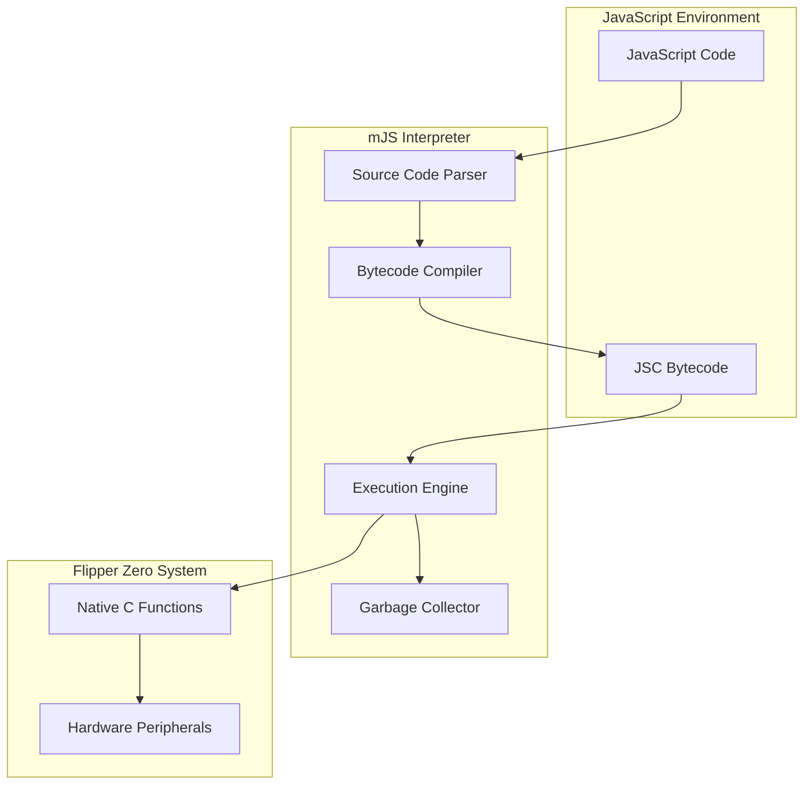
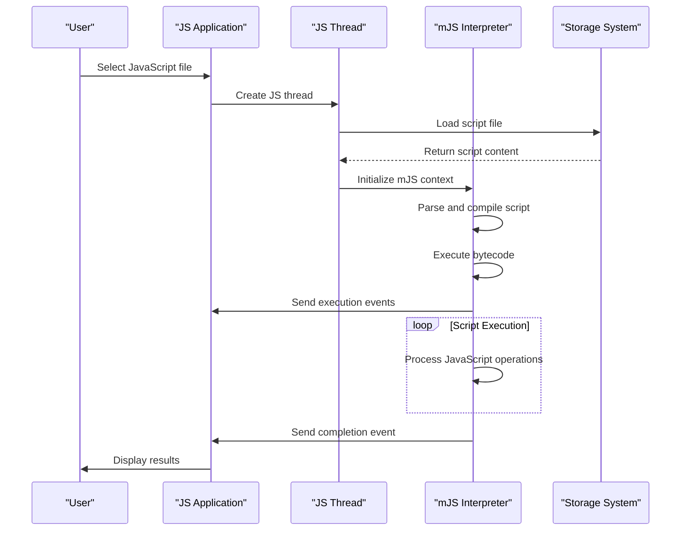
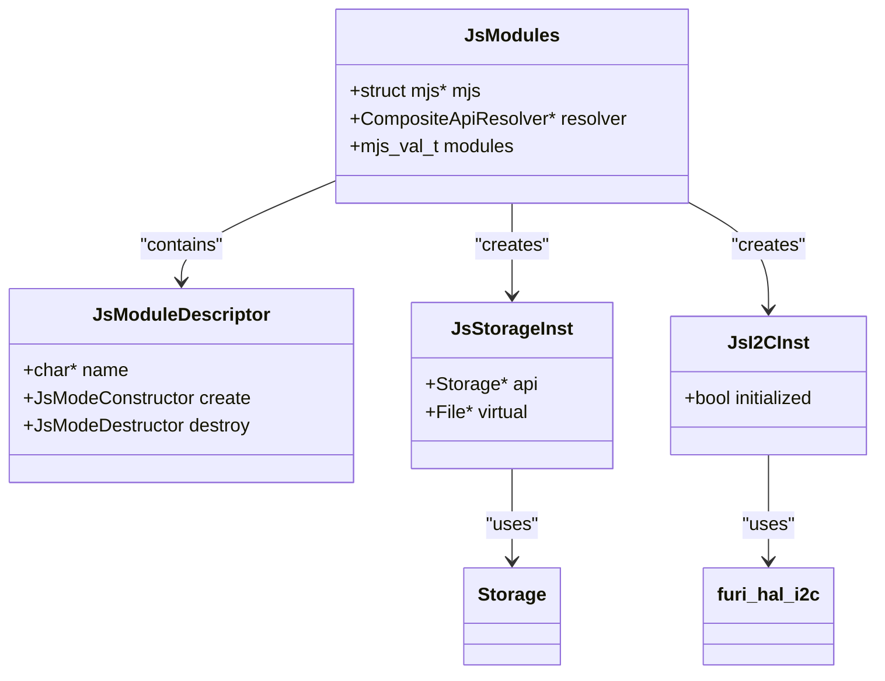
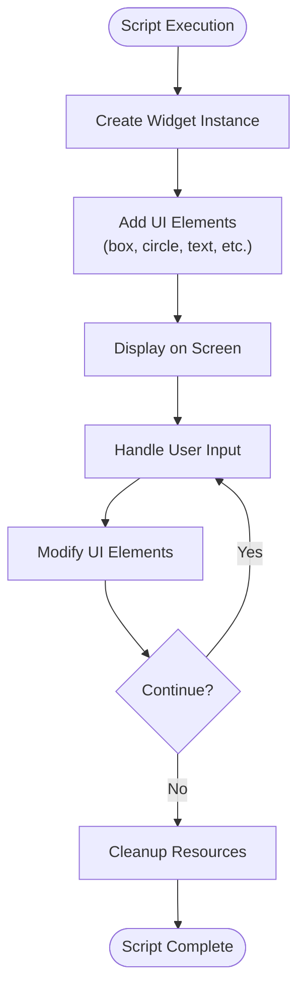

# JavaScript Application Development

<cite>
**Referenced Files in This Document**   
- [js_app.c](file://applications/system/js_app/js_app.c)
- [js_thread.c](file://applications/system/js_app/js_thread.c)
- [js_thread.h](file://applications/system/js_app/js_thread.h)
- [js_modules.h](file://applications/system/js_app/js_modules.h)
- [mjs_exec.c](file://lib/mjs/mjs_exec.c)
- [mjs_builtin.c](file://lib/mjs/mjs_builtin.c)
- [mjs_core.c](file://lib/mjs/mjs_core.c)
- [js_storage.c](file://applications/system/js_app/modules/js_storage.c)
- [js_i2c.c](file://applications/system/js_app/modules/js_i2c.c)
- [js_widget.c](file://applications/system/js_app/modules/js_widget.c)
- [JavaScript.md](file://documentation/JavaScript.md)
- [console_view.c](file://applications/system/js_app/views/console_view.c)
- [mjs_features.h](file://lib/mjs/mjs_features.h)
</cite>

## Table of Contents
1. [Introduction](#introduction)
2. [mJS Interpreter Integration](#mjs-interpreter-integration)
3. [JavaScript Execution Model](#javascript-execution-model)
4. [JavaScript API Implementation](#javascript-api-implementation)
5. [Hardware and System Access](#hardware-and-system-access)
6. [User Interface Components](#user-interface-components)
7. [Security Model and Limitations](#security-model-and-limitations)
8. [Performance and Memory Considerations](#performance-and-memory-considerations)
9. [Debugging JavaScript on Flipper Zero](#debugging-javascript-on-flipper-zero)
10. [Common Use Cases and Examples](#common-use-cases-and-examples)

## Introduction

JavaScript application development on the Flipper Zero platform enables users to create scripts that interact with hardware peripherals, system services, and user interface components. The platform utilizes the mJS JavaScript interpreter, a lightweight engine designed for embedded systems, allowing JavaScript code to run directly on the device. This documentation provides a comprehensive guide to developing JavaScript applications on Flipper Zero, covering the integration of the mJS interpreter, execution model, API implementation, and best practices for creating effective scripts.

The Flipper Zero's JavaScript environment supports a subset of JavaScript features, with specific APIs exposed for interacting with the device's capabilities. Developers can create automation scripts, UI interactions, and hardware control applications using familiar JavaScript syntax while working within the constraints of an embedded system.

**Section sources**
- [JavaScript.md](file://documentation/JavaScript.md#L1-L151)

## mJS Interpreter Integration

The mJS interpreter is integrated into the Flipper Zero firmware as a lightweight JavaScript engine optimized for embedded systems. The integration allows JavaScript code to be loaded from files, executed in a sandboxed environment, and interact with native C functions through a foreign function interface (FFI). The mJS engine is initialized within the JavaScript application context, providing a runtime environment for script execution.

The integration follows a modular architecture where the mJS core is extended with Flipper Zero-specific functionality. When a JavaScript application is launched, the interpreter is initialized with a global object that contains built-in functions and API modules. The interpreter maintains a stack-based execution model, managing variables, function calls, and control flow according to JavaScript semantics while operating within the memory constraints of the embedded platform.

The mJS engine supports precompilation of JavaScript code to bytecode (.jsc files), which can be memory-mapped to reduce RAM usage. This feature is particularly important for the Flipper Zero's limited memory environment, allowing scripts to be executed without loading the entire source code into memory.

**Diagram sources**
- [mjs_exec.c](file://lib/mjs/mjs_exec.c#L1-L1171)
- [mjs_core.c](file://lib/mjs/mjs_core.c#L402-L422)
- [mjs_features.h](file://lib/mjs/mjs_features.h#L1-L33)

## JavaScript Execution Model

JavaScript execution on the Flipper Zero follows a single-threaded, event-driven model with specific adaptations for the embedded environment. When a script is executed, it runs in a dedicated thread with controlled access to system resources. The execution process begins with loading the JavaScript source code from a file, parsing it into an abstract syntax tree, and compiling it to bytecode for efficient execution.

The execution model includes a comprehensive error handling system that captures JavaScript exceptions and converts them to meaningful error messages for the user interface. When an error occurs during script execution, the system provides a stack trace that helps identify the source of the problem. The interpreter also supports debugging features such as logging and console output, which are routed through the Flipper Zero's UI system.

Scripts can be executed through multiple entry points: via the JavaScript application interface, through the command-line interface (CLI), or programmatically from other applications. The execution context maintains state information, including global variables and module imports, for the duration of the script's execution. When the script completes or is terminated, the execution context is cleaned up, and resources are released back to the system.

**Diagram sources**
- [js_app.c](file://applications/system/js_app/js_app.c#L102-L135)
- [js_thread.c](file://applications/system/js_app/js_thread.c#L411-L427)
- [js_thread.h](file://applications/system/js_app/js_thread.h#L5-L16)

## JavaScript API Implementation

The JavaScript API on Flipper Zero is implemented as a collection of modules that expose native functionality to scripts. Each module is implemented as a C extension to the mJS interpreter, using the foreign function interface to bridge JavaScript calls with native C functions. The API follows a require-based module system, allowing scripts to import specific functionality as needed.

The implementation uses a descriptor pattern where each module is defined by a structure containing the module name, constructor function, and destructor function. When a script calls require() with a module name, the system locates the appropriate descriptor and instantiates the module. The constructor function sets up the module's JavaScript interface by creating an object with methods that correspond to native functions.

Module methods are implemented as C functions that extract arguments from the mJS stack, validate them, call the appropriate native API, and return results back to JavaScript. The implementation includes comprehensive error checking to handle invalid arguments and system errors gracefully. Return values are converted to appropriate JavaScript types, such as numbers, booleans, strings, or ArrayBuffers for binary data.

**Diagram sources**
- [js_modules.h](file://applications/system/js_app/js_modules.h#L1-L25)
- [js_storage.c](file://applications/system/js_app/modules/js_storage.c#L4-L7)
- [js_i2c.c](file://applications/system/js_app/modules/js_i2c.c#L264-L278)

## Hardware and System Access

JavaScript scripts on Flipper Zero can access various hardware peripherals and system services through dedicated API modules. These modules provide controlled access to device capabilities while maintaining system stability and security. The API design follows a principle of least privilege, exposing only necessary functionality with appropriate safeguards.

The storage module allows scripts to read from and write to the file system, with methods for file operations such as reading, writing, appending, and checking existence. The implementation uses the Flipper Zero's storage API with proper error handling and resource management. Scripts can work with both text and binary data, with binary data represented as ArrayBuffers for efficient memory usage.

Hardware communication interfaces like I2C are exposed through specialized modules that provide methods for device detection, data transmission, and reception. These modules handle the low-level protocol details while presenting a simplified interface to JavaScript code. The implementation includes timeout handling and error recovery to prevent system hangs when communicating with external devices.

System information and control functions are available through modules that expose device properties like model, name, and battery charge level. These read-only properties allow scripts to adapt their behavior based on the specific device configuration and current state.

**Section sources**
- [JavaScript.md](file://documentation/JavaScript.md#L135-L145)
- [js_storage.c](file://applications/system/js_app/modules/js_storage.c#L50-L268)
- [js_i2c.c](file://applications/system/js_app/modules/js_i2c.c#L42-L278)

## User Interface Components

The JavaScript environment on Flipper Zero includes support for creating interactive user interfaces through specialized modules. The widget system allows scripts to create custom UI elements and manage their display on the device's screen. This enables developers to build applications with visual feedback and user interaction capabilities.

The widget module provides methods for adding various graphical elements such as boxes, circles, discs, dots, frames, lines, and text. Each element is assigned a unique identifier, allowing scripts to modify or remove elements dynamically. The implementation uses the Flipper Zero's graphics library to render elements efficiently on the monochrome display.

UI components are managed through a view system that handles the display lifecycle, including rendering, input handling, and cleanup. When a widget is created, it is associated with a view that manages its visual representation. The system automatically handles screen updates and refresh cycles, ensuring smooth UI performance.

Dialog modules enable scripts to display system dialogs for user interaction, such as message boxes and file pickers. These modules integrate with the Flipper Zero's standard UI components, providing a consistent user experience across different applications.

**Diagram sources**
- [js_widget.c](file://applications/system/js_app/modules/js_widget.c#L813-L881)
- [js_widget.c](file://applications/system/js_app/modules/js_widget.c#L197-L394)

## Security Model and Limitations

The JavaScript execution environment on Flipper Zero implements a security model designed to prevent malicious or erroneous scripts from compromising system stability. The model is based on several key principles: sandboxing, resource limits, and API restrictions.

Scripts run in a sandboxed environment with limited access to system resources. They cannot directly access memory or hardware peripherals outside of the approved API modules. All file system access is restricted to specific directories, preventing scripts from modifying critical system files. The interpreter enforces these restrictions through the module system, which controls what native functions are exposed to JavaScript code.

The environment has several limitations due to the constraints of the embedded platform and the design choices of the mJS interpreter. Many standard JavaScript features are not available, such as setTimeout, DOM manipulation, and advanced object methods. The documentation explicitly notes these limitations to set proper expectations for developers.

Memory usage is strictly controlled to prevent scripts from consuming excessive resources. The garbage collector runs periodically to reclaim unused memory, and scripts that exceed memory limits are terminated. The system also limits script execution time to prevent infinite loops from freezing the device.

API access is carefully curated to expose only safe functionality. Sensitive operations like firmware updates or low-level hardware configuration are not available through the JavaScript interface. This ensures that scripts cannot accidentally or intentionally damage the device or compromise its security.

**Section sources**
- [JavaScript.md](file://documentation/JavaScript.md#L2-L9)
- [mjs_features.h](file://lib/mjs/mjs_features.h#L1-L33)

## Performance and Memory Considerations

JavaScript execution on the Flipper Zero is subject to significant performance and memory constraints due to the embedded nature of the platform. The mJS interpreter is optimized for low memory usage, but developers must still be mindful of resource consumption when writing scripts.

Memory management is a critical consideration, as the device has limited RAM available for script execution. The interpreter uses a mark-and-sweep garbage collector to automatically manage memory, but developers should avoid creating large data structures or holding references to unused objects. The system provides a gc() function to manually trigger garbage collection when needed.

Performance is affected by several factors, including script complexity, API call frequency, and hardware interaction. CPU-intensive operations like complex calculations or data processing should be minimized or broken into smaller chunks to maintain system responsiveness. The interpreter's bytecode execution is efficient, but JavaScript code will always be slower than equivalent native C code.

Scripts that perform frequent file I/O or hardware communication may experience performance bottlenecks. These operations should be optimized by batching requests and minimizing round trips. The system provides asynchronous patterns where possible, but the single-threaded nature of JavaScript means that long-running operations will block other script execution.

Developers should test their scripts thoroughly to ensure they perform well under real-world conditions. The platform provides tools for monitoring script execution and identifying performance issues, helping developers optimize their code for the target environment.

**Section sources**
- [mjs_core.c](file://lib/mjs/mjs_core.c#L420-L422)
- [mjs_exec.c](file://lib/mjs/mjs_exec.c#L1074-L1075)

## Debugging JavaScript on Flipper Zero

Debugging JavaScript on the Flipper Zero platform is supported through several mechanisms designed to help developers identify and fix issues in their scripts. The system provides comprehensive error reporting that captures JavaScript exceptions and presents them in a user-friendly format.

The console API allows scripts to output diagnostic information using familiar methods like console.log(), console.warn(), and console.error(). These messages are displayed in the JavaScript application's console view, providing real-time feedback during script execution. The implementation routes these messages through the system's logging infrastructure for consistent presentation.

When a script encounters an error, the system generates a stack trace that shows the call sequence leading to the error. This trace is processed to make it more readable by removing full file paths and showing only relevant information. The compacted trace helps developers quickly identify the source of problems without being overwhelmed by technical details.

The command-line interface (CLI) provides an alternative execution environment for testing scripts with detailed output. When running scripts through the CLI, error messages and console output are displayed directly in the terminal, making it easier to analyze script behavior. This mode is particularly useful for debugging scripts that don't require user interaction.

Scripts can also be tested using the file browser interface, which allows users to select and run JavaScript files directly from the device's storage. This provides a convenient way to test scripts in the same environment where they will be used, ensuring that file paths and resources are correctly configured.

**Section sources**
- [js_app.c](file://applications/system/js_app/js_app.c#L28-L67)
- [js_thread.c](file://applications/system/js_app/js_thread.c#L385-L396)
- [js_thread.c](file://applications/system/js_app/js_thread.c#L44-L83)
- [console.js](file://applications/system/js_app/examples/apps/Scripts/console.js#L1-L5)

## Common Use Cases and Examples

JavaScript on the Flipper Zero platform supports various practical use cases that leverage the device's unique capabilities. These use cases demonstrate how scripts can automate tasks, interact with hardware, and enhance the user experience.

One common use case is automation of repetitive tasks, such as configuring device settings or performing diagnostic checks. Scripts can combine multiple API calls to create workflows that would otherwise require manual interaction. For example, a script might check battery level, read system information, and generate a status report with a single command.

Hardware interaction is another important use case, with scripts able to control peripherals like GPIO pins, I2C devices, and RF modules. This enables the creation of custom sensors, communication protocols, and experimental hardware projects. The BadUSB module allows scripts to emulate USB devices and automate keyboard input, useful for penetration testing and accessibility applications.

User interface customization is possible through the widget and dialog modules, enabling developers to create specialized applications with custom layouts and interactions. This could include data visualization tools, interactive tutorials, or custom control panels for specific tasks.

The platform's examples provide concrete demonstrations of these use cases, showing how to implement various functionalities in practice. These examples serve as starting points for developers creating their own scripts, illustrating best practices and common patterns.

**Section sources**
- [JavaScript.md](file://documentation/JavaScript.md#L11-L151)
- [examples directory](file://applications/system/js_app/examples/apps/Scripts/)