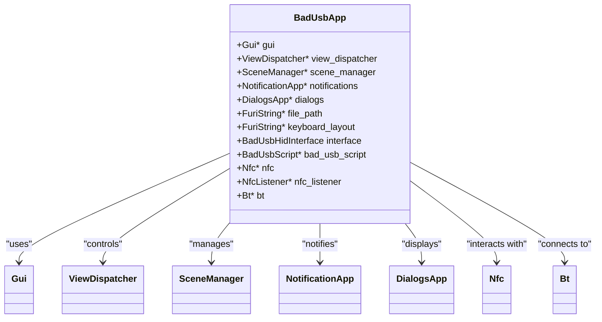
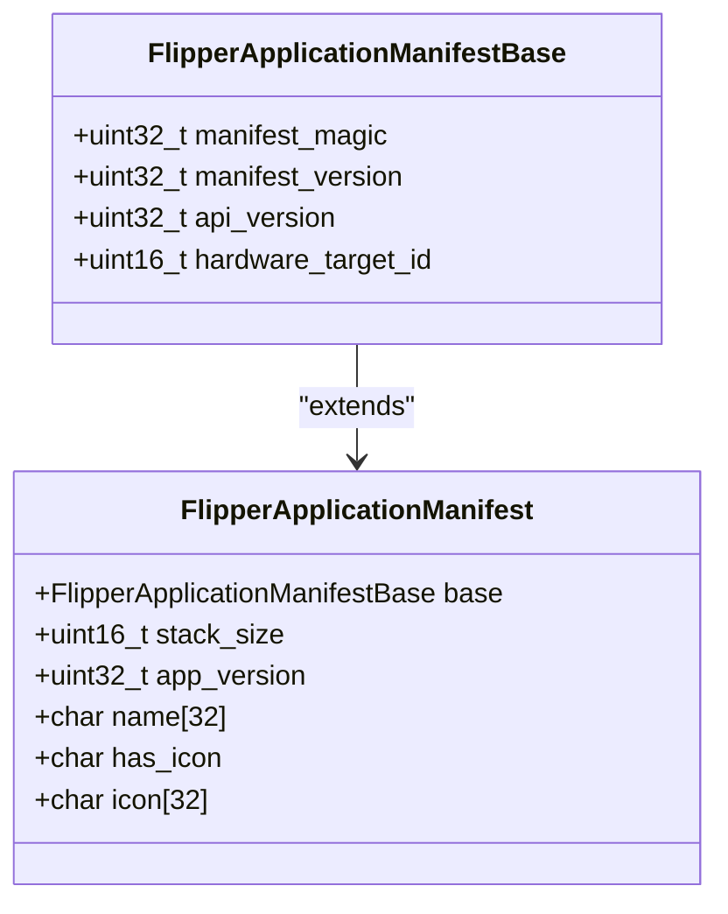
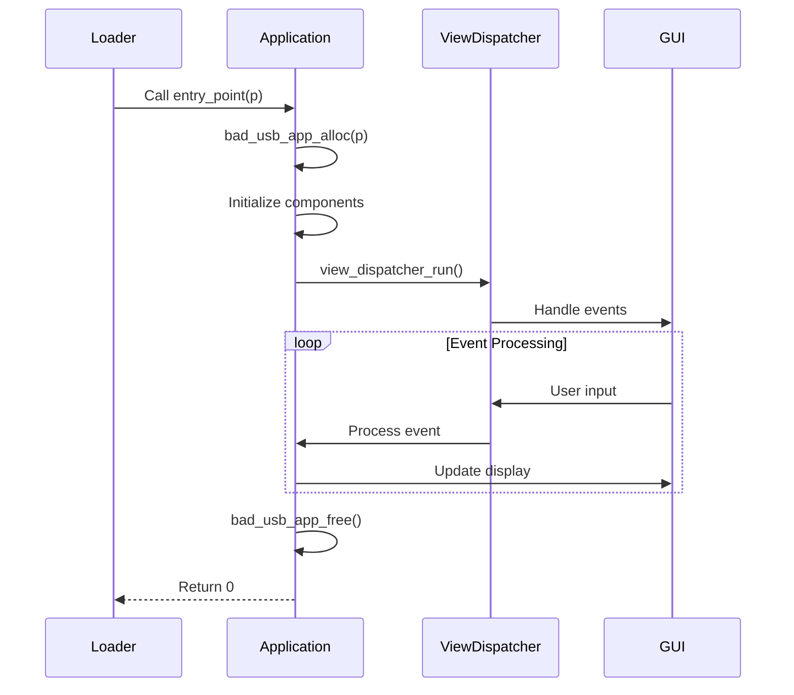
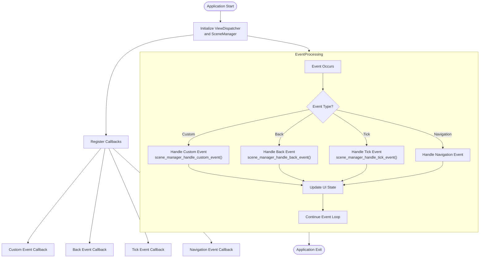
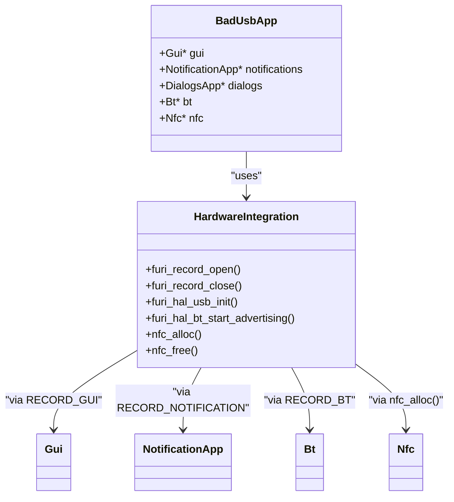
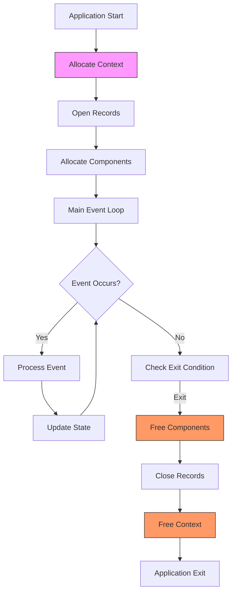

# Native Application Development

<cite>
**Referenced Files in This Document**   
- [bad_usb_app.c](file://applications/main/bad_usb/bad_usb_app.c)
- [nfc_app.c](file://applications/main/nfc/nfc_app.c)
- [application.fam](file://applications/main/bad_usb/application.fam)
- [application_manifest.h](file://lib/flipper_application/application_manifest.h)
- [application_manifest.c](file://lib/flipper_application/application_manifest.c)
- [flipper_application.c](file://lib/flipper_application/flipper_application.c)
- [bad_usb_app_i.h](file://applications/main/bad_usb/bad_usb_app_i.h)
- [nfc_app_i.h](file://applications/main/nfc/nfc_app_i.h)
</cite>

## Table of Contents
1. [Introduction](#introduction)
2. [Application Structure](#application-structure)
3. [Application Manifest System](#application-manifest-system)
4. [Application Lifecycle Management](#application-lifecycle-management)
5. [Event Handling and User Interface](#event-handling-and-user-interface)
6. [Resource Management and Hardware Integration](#resource-management-and-hardware-integration)
7. [Memory Management and Thread Safety](#memory-management-and-thread-safety)
8. [Troubleshooting Common Issues](#troubleshooting-common-issues)
9. [Conclusion](#conclusion)

## Introduction
This document provides comprehensive guidance for developing native C/C++ applications on the Flipper Zero platform. The Flipper Zero is a versatile multi-tool device that supports various wireless protocols and hardware interfaces, making it ideal for security research, hardware hacking, and embedded development. Native applications on this platform are developed using C/C++ and follow a structured architecture that emphasizes modularity, resource efficiency, and hardware integration.

The documentation covers the complete application development lifecycle, from initial setup and manifest configuration to advanced topics like hardware resource management and thread safety. Special attention is given to practical examples from the codebase, particularly the BadUSB and NFC applications, which demonstrate real-world implementation patterns and best practices. The content is designed to be accessible to beginners while providing sufficient technical depth for experienced developers to create complex applications with custom hardware interactions.

By following the guidelines in this document, developers can create robust, efficient applications that leverage the full capabilities of the Flipper Zero platform while adhering to its architectural constraints and design principles.

## Application Structure
Native applications on the Flipper Zero platform follow a consistent structure that facilitates modularity and code reuse. Each application typically consists of several key components: the main application file, header files for interface definitions, scene management for UI flow, and view components for user interface elements. The structure is exemplified by applications like BadUSB and NFC, which demonstrate the standard patterns used throughout the firmware.

The core of an application is typically implemented in a main C file (e.g., `bad_usb_app.c`) that contains the application's entry point and primary logic. This file includes the necessary headers for Flipper Zero's API, such as `furi.h`, `furi_hal.h`, and various GUI components. The application structure centers around a context structure (e.g., `BadUsbApp`) that holds all the application's state, including references to GUI components, view dispatchers, scene managers, and hardware interfaces.

**Diagram sources**
- [bad_usb_app_i.h](file://applications/main/bad_usb/bad_usb_app_i.h#L37-L73)

**Section sources**
- [bad_usb_app_i.h](file://applications/main/bad_usb/bad_usb_app_i.h#L37-L88)
- [nfc_app_i.h](file://applications/main/nfc/nfc_app_i.h#L127-L180)

## Application Manifest System
The application manifest system on the Flipper Zero platform is a crucial component that defines metadata, configuration, and resource information for each application. Implemented through `.fam` files, the manifest system provides a declarative way to specify application properties that are used by the firmware's loader and application manager. This system ensures that applications are properly integrated into the platform's ecosystem and can be correctly loaded and executed.

The manifest structure is defined in the `application_manifest.h` header file, which specifies the binary format of the manifest data embedded in compiled application files. The manifest contains essential information such as the application ID, display name, entry point function, stack size, icon reference, and category. For example, the BadUSB application's manifest (in `application.fam`) specifies its appid as "bad_usb", its display name as "Bad USB", and its entry point as "bad_usb_app", along with other configuration parameters.

**Diagram sources**
- [application_manifest.h](file://lib/flipper_application/application_manifest.h#L23-L45)

The manifest system also supports additional features such as resource declarations, library dependencies, and icon specifications. For instance, the BadUSB application manifest includes `fap_libs=["ble_profile"]` to declare its dependency on the BLE profile library, and `fap_icon="images/badusb_10px.png"` to specify its icon file. These declarations are processed by the build system to ensure that all required resources are included and properly linked.

The manifest validation process, implemented in `application_manifest.c`, checks several critical aspects before loading an application: manifest validity, API version compatibility, and hardware target compatibility. This ensures that only properly configured and compatible applications are loaded, preventing runtime errors and system instability. The validation functions (`flipper_application_manifest_is_valid`, `flipper_application_manifest_is_too_old`, `flipper_application_manifest_is_too_new`, and `flipper_application_manifest_is_target_compatible`) work together to verify that the application meets all requirements before execution.

**Section sources**
- [application.fam](file://applications/main/bad_usb/application.fam#L1-L15)
- [application_manifest.h](file://lib/flipper_application/application_manifest.h#L15-L90)
- [application_manifest.c](file://lib/flipper_application/application_manifest.c#L6-L50)

## Application Lifecycle Management
Application lifecycle management on the Flipper Zero platform is handled through a well-defined sequence of initialization, execution, and cleanup phases. This lifecycle is orchestrated by the firmware's application loader and managed through specific entry point functions and callback mechanisms. Understanding this lifecycle is essential for developing robust applications that properly manage resources and respond to system events.

The lifecycle begins with the application's entry point function, typically named after the application (e.g., `bad_usb_app` for the BadUSB application). This function serves as the main thread for the application and follows a standard pattern: allocate the application context, initialize components, run the main event loop, and clean up resources before returning. The entry point function signature `int32_t app_name(void* p)` is consistent across all native applications, with the parameter `p` containing optional startup arguments.

**Diagram sources**
- [bad_usb_app.c](file://applications/main/bad_usb/bad_usb_app.c#L578-L585)
- [nfc_app.c](file://applications/main/nfc/nfc_app.c#L496-L533)

The allocation function (e.g., `bad_usb_app_alloc`) is responsible for creating and initializing the application context structure. This includes allocating memory for the context, opening required records (such as GUI, notifications, and storage), creating the view dispatcher and scene manager, and adding views to the dispatcher. The function also handles startup arguments and initializes the initial scene based on whether a file path was provided.

Resource cleanup is performed in the free function (e.g., `bad_usb_app_free`), which systematically releases all allocated resources in reverse order of allocation. This includes removing views from the dispatcher, freeing view components, closing records, and finally freeing the application context structure itself. Proper cleanup is essential to prevent memory leaks and ensure system stability, especially when applications are frequently launched and closed.

**Section sources**
- [bad_usb_app.c](file://applications/main/bad_usb/bad_usb_app.c#L434-L576)
- [nfc_app.c](file://applications/main/nfc/nfc_app.c#L43-L142)

## Event Handling and User Interface
Event handling and user interface management on the Flipper Zero platform are implemented through a sophisticated system of view dispatchers, scene managers, and callback functions. This architecture enables applications to respond to user input, system events, and hardware interrupts in a structured and efficient manner. The system is designed to support complex user interfaces while maintaining responsiveness and low resource usage.

The core of the event handling system is the ViewDispatcher, which manages the display and input for different views within an application. Each application typically has multiple views (e.g., main work view, configuration view, text input view) that are managed by the dispatcher. The Scene Manager works in conjunction with the ViewDispatcher to handle navigation between different logical states or "scenes" within the application. This separation of concerns allows for clean, modular code organization.

**Diagram sources**
- [bad_usb_app.c](file://applications/main/bad_usb/bad_usb_app.c#L19-L30)
- [nfc_app.c](file://applications/main/nfc/nfc_app.c#L10-L20)

The system employs several types of event callbacks:
- **Custom event callback**: Handles application-specific events, typically forwarded to the scene manager for processing
- **Back event callback**: Handles the back button press, allowing for navigation and state management
- **Tick event callback**: Called periodically (e.g., every 250ms) for time-based updates and monitoring
- **Navigation event callback**: Handles navigation events within the application

These callbacks are registered with the ViewDispatcher during application initialization, establishing the event handling pipeline. For example, in the BadUSB application, the tick event callback is used to monitor Bluetooth connection status and automatically start or stop NFC pairing emulation accordingly.

**Section sources**
- [bad_usb_app.c](file://applications/main/bad_usb/bad_usb_app.c#L19-L30)
- [nfc_app.c](file://applications/main/nfc/nfc_app.c#L10-L20)

## Resource Management and Hardware Integration
Resource management and hardware integration are critical aspects of native application development on the Flipper Zero platform. Applications must carefully manage system resources such as memory, file handles, and hardware peripherals while ensuring proper integration with the device's various hardware components. The platform provides a comprehensive API for accessing hardware features, but developers must follow specific patterns to avoid conflicts and ensure reliable operation.

Hardware integration is achieved through the use of "records," which are named services that provide access to specific hardware or system functions. Applications open these records during initialization and close them during cleanup. Common records include `RECORD_GUI` for graphical user interface access, `RECORD_NOTIFICATION` for notification system access, `RECORD_STORAGE` for file system access, and `RECORD_BT` for Bluetooth functionality. The BadUSB application, for example, opens records for GUI, notifications, dialogs, and Bluetooth services.

**Diagram sources**
- [bad_usb_app.c](file://applications/main/bad_usb/bad_usb_app.c#L450-L454)
- [nfc_app.c](file://applications/main/nfc/nfc_app.c#L73-L82)

File system access is managed through the Storage record, which provides functions for file operations such as opening, reading, writing, and deleting files. Applications typically use predefined paths (e.g., `EXT_PATH("badusb")` for BadUSB scripts) and follow consistent patterns for file operations. The NFC application, for instance, uses the `nfc_load_file` and `nfc_save_file` functions to manage NFC tag data files, with specific handling for shadow files that store additional metadata.

Hardware-specific initialization and cleanup are also critical. The BadUSB application, for example, manages NFC pairing emulation by allocating and freeing NFC components (`nfc_alloc`, `nfc_listener_alloc`) and starting/stopping the NFC listener as needed. Similarly, the application manages USB HID functionality through the `furi_hal_usb_init` and related functions, ensuring proper initialization and cleanup of the USB interface.

**Section sources**
- [bad_usb_app.c](file://applications/main/bad_usb/bad_usb_app.c#L449-L454)
- [nfc_app.c](file://applications/main/nfc/nfc_app.c#L55-L56)
- [bad_usb_app.c](file://applications/main/bad_usb/bad_usb_app.c#L31-L43)

## Memory Management and Thread Safety
Memory management and thread safety are paramount in native application development for the Flipper Zero platform, given its constrained resources and real-time requirements. The platform employs a combination of static allocation, dynamic memory management, and careful resource tracking to ensure efficient and safe operation. Developers must follow strict guidelines to prevent memory leaks, dangling pointers, and race conditions that could compromise system stability.

The platform's memory management is built around the FURI (Flipper Utility and Runtime Infrastructure) framework, which provides functions for memory allocation, string handling, and data structure management. Applications typically allocate their main context structure using `malloc` during initialization and free it with `free` during cleanup. All other resources, such as strings, buffers, and GUI components, are allocated individually and must be properly freed to prevent memory leaks.

**Diagram sources**
- [bad_usb_app.c](file://applications/main/bad_usb/bad_usb_app.c#L434-L576)

Thread safety is ensured through the platform's event-driven architecture and careful management of shared resources. The main application thread runs the view dispatcher's event loop, processing events sequentially and preventing race conditions. For time-critical operations, the platform provides timer callbacks that run on a separate thread but are designed to be non-blocking and quick to execute.

The BadUSB application demonstrates proper memory management practices by systematically allocating and freeing all components in its `bad_usb_app_alloc` and `bad_usb_app_free` functions. Each GUI component (widget, popup, variable item list, text input, byte input, loading) is allocated during initialization and removed from the view dispatcher and freed during cleanup. Records opened with `furi_record_open` are properly closed with `furi_record_close` to release system resources.

**Section sources**
- [bad_usb_app.c](file://applications/main/bad_usb/bad_usb_app.c#L434-L576)
- [nfc_app.c](file://applications/main/nfc/nfc_app.c#L144-L228)

## Troubleshooting Common Issues
Developing native applications for the Flipper Zero platform may present several common issues that developers should be aware of and know how to resolve. These issues typically fall into categories such as application loading failures, resource conflicts, memory management problems, and hardware integration challenges. Understanding these common pitfalls and their solutions is essential for creating stable and reliable applications.

One frequent issue is application loading failure due to manifest validation errors. The platform's loader performs several checks on the application manifest, including API version compatibility and hardware target compatibility. If an application was compiled against a different API version or for a different hardware target, it will fail to load with specific error messages. Developers should ensure they are using the correct SDK version and target configuration when building their applications.

Resource conflicts can occur when multiple applications or system components attempt to access the same hardware resource simultaneously. For example, the NFC and Bluetooth radios share some underlying hardware, so applications must properly manage their usage and release resources when not in use. The BadUSB application demonstrates proper resource management by stopping NFC pairing emulation when a Bluetooth connection is established, preventing conflicts between these wireless interfaces.

Memory management issues, such as leaks or double-free errors, can be particularly problematic on a resource-constrained device like the Flipper Zero. Developers should ensure that every allocated resource is properly freed, following the pattern of allocating in the init function and freeing in the cleanup function. The use of tools like the platform's logging system (`FURI_LOG_I`, `FURI_LOG_E`) can help identify memory-related issues by providing visibility into the application's execution flow.

Hardware integration challenges may arise when working with specific peripherals or protocols. For instance, NFC tag emulation requires careful timing and proper initialization of the NFC hardware. Developers should study existing applications like the BadUSB and NFC applications to understand the correct patterns for hardware initialization, operation, and cleanup. Additionally, consulting the platform's documentation and example code can provide valuable insights into best practices for hardware integration.

**Section sources**
- [bad_usb_app.c](file://applications/main/bad_usb/bad_usb_app.c#L228-L247)
- [nfc_app.c](file://applications/main/nfc/nfc_app.c#L463-L478)
- [flipper_application.c](file://lib/flipper_application/flipper_application.c#L277-L296)

## Conclusion
Developing native C/C++ applications for the Flipper Zero platform requires a comprehensive understanding of its architecture, lifecycle management, and resource handling patterns. This document has covered the essential aspects of application development, from the structure and manifest system to event handling, resource management, and troubleshooting common issues. By following the patterns demonstrated in core applications like BadUSB and NFC, developers can create robust, efficient applications that integrate seamlessly with the platform.

The key to successful development lies in adhering to the established patterns for application initialization, event handling, and resource cleanup. The manifest system provides a powerful way to declare application metadata and dependencies, while the scene manager and view dispatcher enable sophisticated user interfaces with clean navigation. Proper memory management and thread safety practices are essential for maintaining system stability, particularly given the device's constrained resources.

As the Flipper Zero ecosystem continues to evolve, developers should stay informed about updates to the API and best practices. Contributing to the community by sharing knowledge, reporting issues, and submitting improvements can help advance the platform for all users. With the foundation provided in this documentation, developers are well-equipped to create innovative applications that leverage the full potential of the Flipper Zero platform.