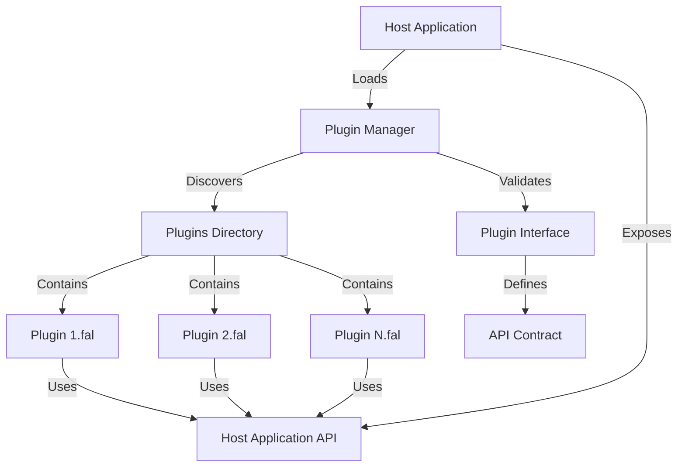
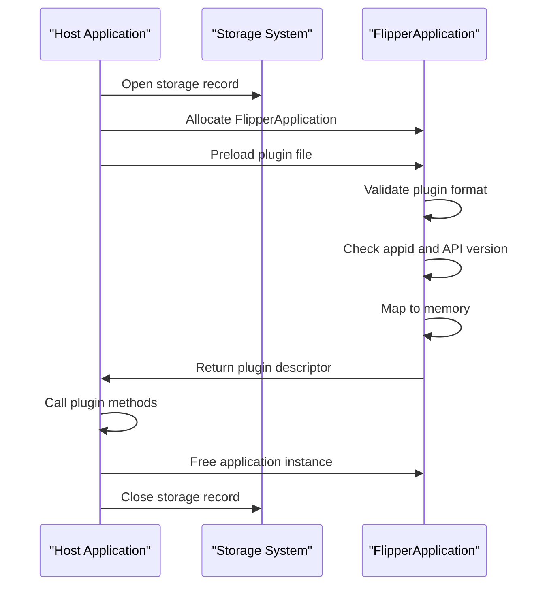
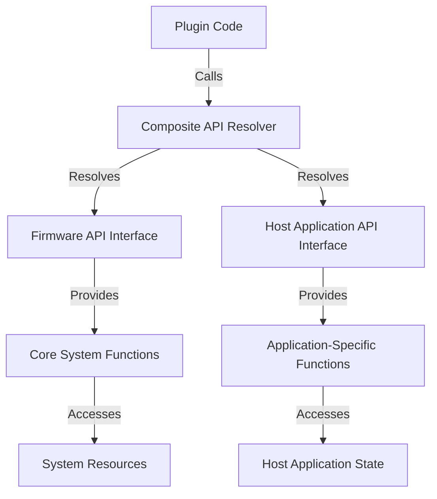

# Plugin System

<cite>
**Referenced Files in This Document**   
- [plugin_interface.h](file://applications/examples/example_plugins/plugin_interface.h#L1-L16)
- [example_plugins.c](file://applications/examples/example_plugins/example_plugins.c#L1-L72)
- [plugin1.c](file://applications/examples/example_plugins/plugin1.c#L1-L37)
- [example_plugins_advanced.c](file://applications/examples/example_plugins_advanced/example_advanced_plugins.c#L1-L51)
- [app_api_interface.h](file://applications/examples/example_plugins_advanced/app_api_interface.h#L1-L9)
- [app_api_table.cpp](file://applications/examples/example_plugins_advanced/app_api_table.cpp#L1-L27)
- [app_api_table_i.h](file://applications/examples/example_plugins_advanced/app_api_table_i.h#L1-L13)
- [app_api.c](file://applications/examples/example_plugins_advanced/app_api.c#L1-L25)
- [plugin1.c](file://applications/examples/example_plugins_advanced/plugin1.c#L1-L43)
</cite>

## Table of Contents
1. [Introduction](#introduction)
2. [Plugin Architecture Overview](#plugin-architecture-overview)
3. [Plugin Interface and Contract](#plugin-interface-and-contract)
4. [Plugin Loading and Initialization](#plugin-loading-and-initialization)
5. [Advanced Plugin Patterns](#advanced-plugin-patterns)
6. [Communication Between Plugins and Host Applications](#communication-between-plugins-and-host-applications)
7. [Plugin Registration and Integration](#plugin-registration-and-integration)
8. [Error Handling and Compatibility](#error-handling-and-compatibility)
9. [Best Practices for Plugin Development](#best-practices-for-plugin-development)
10. [Plugin Distribution and Versioning](#plugin-distribution-and-versioning)

## Introduction
The Flipper Zero plugin system enables external applications to extend the device's functionality through a well-defined interface. This document provides a comprehensive analysis of the plugin architecture, detailing how plugins are structured, loaded, and integrated with core applications. The system supports both simple plugin patterns for basic extensions and advanced patterns that allow deep integration with host application functionality. By examining concrete examples from the firmware repository, this documentation explains the complete lifecycle of plugin development, deployment, and execution.

## Plugin Architecture Overview
The Flipper Zero plugin system is designed as a modular extension framework that allows dynamic loading of external code. The architecture separates concerns between plugin providers and host applications through well-defined interfaces. Plugins are implemented as separate compilation units that adhere to specific API contracts, enabling them to be loaded at runtime and integrated seamlessly with the main application.

The system follows a host-plugin pattern where the main application acts as a host that discovers, loads, and executes plugin code. This design promotes loose coupling between the core system and extended functionality, allowing for flexible extension without modifying the base firmware. The architecture supports both single-plugin and multi-plugin scenarios, with mechanisms for managing dependencies and resolving symbols between the host and plugins.



**Diagram sources**
- [example_plugins.c](file://applications/examples/example_plugins/example_plugins.c#L1-L72)
- [example_advanced_plugins.c](file://applications/examples/example_plugins_advanced/example_advanced_plugins.c#L1-L51)

**Section sources**
- [example_plugins.c](file://applications/examples/example_plugins/example_plugins.c#L1-L72)
- [example_advanced_plugins.c](file://applications/examples/example_plugins_advanced/example_advanced_plugins.c#L1-L51)

## Plugin Interface and Contract
The plugin system relies on a strict interface contract between the host application and plugins. This contract is defined through header files that specify the expected structure and behavior of plugins. The interface ensures compatibility and provides a clear API for communication between components.

The basic plugin interface is defined in `plugin_interface.h` and includes an application ID, API version, and a structure containing function pointers that represent the plugin's capabilities. This approach uses a virtual function table pattern, allowing the host application to call plugin methods without knowing their internal implementation.

```c
#define PLUGIN_APP_ID      "example_plugins"
#define PLUGIN_API_VERSION 1

typedef struct {
    const char* name;
    int (*method1)(void);
    int (*method2)(int, int);
} ExamplePlugin;
```

This interface pattern enables type-safe communication while maintaining flexibility. The host application verifies both the application ID and API version during loading to ensure compatibility. Plugins must implement all methods defined in the interface, as the host application will call them through the function pointers in the structure.

**Section sources**
- [plugin_interface.h](file://applications/examples/example_plugins/plugin_interface.h#L1-L16)
- [plugin1.c](file://applications/examples/example_plugins/plugin1.c#L1-L37)

## Plugin Loading and Initialization
The plugin loading process follows a structured sequence of operations that ensures safe and reliable execution of external code. The host application uses the FlipperApplication API to manage the loading lifecycle, which includes preloading, validation, memory mapping, and final initialization.

The loading process begins with opening a storage reference and allocating a FlipperApplication instance. The host then preloads the plugin file from a specified path, typically in the plugins directory. During preloading, the system validates that the file is a proper plugin library and checks its compatibility with the expected application ID and API version.



**Diagram sources**
- [example_plugins.c](file://applications/examples/example_plugins/example_plugins.c#L1-L72)
- [plugin1.c](file://applications/examples/example_plugins/plugin1.c#L1-L37)

**Section sources**
- [example_plugins.c](file://applications/examples/example_plugins/example_plugins.c#L1-L72)
- [plugin1.c](file://applications/examples/example_plugins/plugin1.c#L1-L37)

## Advanced Plugin Patterns
The Flipper Zero plugin system supports advanced integration patterns through the use of composite API resolvers and plugin managers. These mechanisms enable plugins to access both firmware APIs and private host application functionality, creating a powerful extension system.

The advanced pattern uses a `CompositeApiResolver` that combines multiple API interfaces, allowing plugins to resolve symbols from different sources. This approach enables plugins to use both standard firmware APIs and application-specific functions. The `PluginManager` class provides higher-level functionality for managing multiple plugins, including bulk loading and centralized error handling.

```c
CompositeApiResolver* resolver = composite_api_resolver_alloc();
composite_api_resolver_add(resolver, firmware_api_interface);
composite_api_resolver_add(resolver, application_api_interface);

PluginManager* manager = plugin_manager_alloc(
    PLUGIN_APP_ID, PLUGIN_API_VERSION, composite_api_resolver_get(resolver));

plugin_manager_load_all(manager, APP_ASSETS_PATH("plugins"));
```

This pattern allows for sophisticated plugin ecosystems where multiple plugins can interact with each other and the host application through shared state and functionality. The composite resolver ensures that plugins can access the necessary symbols while maintaining security boundaries.

**Section sources**
- [example_advanced_plugins.c](file://applications/examples/example_plugins_advanced/example_advanced_plugins.c#L1-L51)
- [app_api_interface.h](file://applications/examples/example_plugins_advanced/app_api_interface.h#L1-L9)

## Communication Between Plugins and Host Applications
Communication between plugins and host applications occurs through well-defined interfaces and shared state mechanisms. The system supports both direct function calls from plugins to the host and indirect communication through data structures passed between components.

In the advanced plugin pattern, the host application exposes its functionality through a symbol table implemented as a sorted array of function pointers. This table is generated at compile time and made available to plugins through the composite API resolver. The `app_api_table_i.h` file defines the exposed functions using a macro-based system that creates entries for each method.

```c
static constexpr auto app_api_table = sort(create_array_t<sym_entry>(
    API_METHOD(app_api_accumulator_set, void, (uint32_t)),
    API_METHOD(app_api_accumulator_get, uint32_t, ()),
    API_METHOD(app_api_accumulator_add, void, (uint32_t)),
    API_METHOD(app_api_accumulator_sub, void, (uint32_t)),
    API_METHOD(app_api_accumulator_mul, void, (uint32_t))));
```

Plugins can then call these functions as if they were local, enabling tight integration with the host application's state and functionality. This approach provides a secure way to expose internal application features to plugins while maintaining control over what functionality is available.



**Diagram sources**
- [app_api_table.cpp](file://applications/examples/example_plugins_advanced/app_api_table.cpp#L1-L27)
- [app_api.c](file://applications/examples/example_plugins_advanced/app_api.c#L1-L25)

**Section sources**
- [app_api_table_i.h](file://applications/examples/example_plugins_advanced/app_api_table_i.h#L1-L13)
- [app_api.c](file://applications/examples/example_plugins_advanced/app_api.c#L1-L25)
- [plugin1.c](file://applications/examples/example_plugins_advanced/plugin1.c#L1-L43)

## Plugin Registration and Integration
Plugin registration follows a standardized pattern that ensures all plugins are properly initialized and available to the host application. Each plugin must implement an entry point function that returns a pointer to a `FlipperAppPluginDescriptor` structure containing metadata and a reference to the plugin implementation.

The descriptor includes the application ID, API version, and a pointer to the entry point structure that implements the plugin interface. This registration mechanism allows the host application to validate the plugin before execution and establish the communication interface.

```c
static const FlipperAppPluginDescriptor example_plugin1_descriptor = {
    .appid = PLUGIN_APP_ID,
    .ep_api_version = PLUGIN_API_VERSION,
    .entry_point = &example_plugin1,
};

const FlipperAppPluginDescriptor* example_plugin1_ep(void) {
    return &example_plugin1_descriptor;
}
```

Integration with the main application menu and user interface is typically handled by the host application, which discovers available plugins and adds them to the appropriate menu structures. This approach maintains a consistent user experience while allowing for dynamic extension of functionality.

**Section sources**
- [plugin1.c](file://applications/examples/example_plugins/plugin1.c#L1-L37)
- [plugin1.c](file://applications/examples/example_plugins_advanced/plugin1.c#L1-L43)

## Error Handling and Compatibility
The plugin system incorporates comprehensive error handling to manage failures during the loading and execution process. The host application checks multiple conditions to ensure plugin compatibility and safety before allowing execution.

Key error conditions include:
- Failed preloading of the plugin file
- Invalid plugin format (not a library)
- Memory mapping failures
- Application ID mismatch
- API version incompatibility

The system uses a do-while(false) pattern to create a structured exception handling mechanism, allowing for clean error recovery and resource cleanup. Each step in the loading process returns a status code that is checked before proceeding to the next step.

```c
do {
    FlipperApplicationPreloadStatus preload_res =
        flipper_application_preload(app, APP_DATA_PATH("plugins/example_plugin1.fal"));

    if(preload_res != FlipperApplicationPreloadStatusSuccess) {
        FURI_LOG_E(TAG, "Failed to preload plugin");
        break;
    }

    if(!flipper_application_is_plugin(app)) {
        FURI_LOG_E(TAG, "Plugin file is not a library");
        break;
    }

    FlipperApplicationLoadStatus load_status = flipper_application_map_to_memory(app);
    if(load_status != FlipperApplicationLoadStatusSuccess) {
        FURI_LOG_E(TAG, "Failed to load plugin file");
        break;
    }
    // Additional checks and processing
} while(false);
```

This approach ensures that resources are properly cleaned up even when errors occur, preventing memory leaks and system instability.

**Section sources**
- [example_plugins.c](file://applications/examples/example_plugins/example_plugins.c#L1-L72)
- [example_advanced_plugins.c](file://applications/examples/example_plugins_advanced/example_advanced_plugins.c#L1-L51)

## Best Practices for Plugin Development
Developing secure and stable plugins for the Flipper Zero requires adherence to several best practices:

1. **Interface Compliance**: Strictly follow the defined plugin interface contract, ensuring all required methods are implemented and function signatures match exactly.

2. **Error Checking**: Implement comprehensive error checking in plugin code, particularly when calling host application APIs or accessing system resources.

3. **Memory Management**: Follow the host application's memory management patterns and avoid allocating large amounts of memory that could impact system performance.

4. **Thread Safety**: Ensure plugin code is thread-safe when accessing shared resources or calling host application functions that may be used by multiple components.

5. **Version Compatibility**: Design plugins to be forward-compatible with future API versions when possible, using feature detection rather than hard dependencies.

6. **Security Considerations**: Avoid exposing sensitive functionality through plugin interfaces and validate all inputs to prevent security vulnerabilities.

7. **Resource Cleanup**: Always clean up allocated resources in plugin termination paths to prevent memory leaks.

8. **Logging**: Use the provided logging system appropriately, avoiding excessive log output that could impact performance.

**Section sources**
- [plugin1.c](file://applications/examples/example_plugins/plugin1.c#L1-L37)
- [plugin1.c](file://applications/examples/example_plugins_advanced/plugin1.c#L1-L43)

## Plugin Distribution and Versioning
Plugin distribution and versioning are critical aspects of maintaining a healthy plugin ecosystem. The Flipper Zero system uses a combination of application IDs and API versions to manage compatibility between plugins and host applications.

The versioning system follows a simple integer scheme where the `PLUGIN_API_VERSION` defines the interface version. Host applications should maintain backward compatibility with previous API versions when possible, allowing older plugins to continue functioning.

Distribution typically occurs through the device's file system, with plugins stored in designated directories such as `plugins/`. The host application discovers plugins by scanning these directories and loading compatible files.

Best practices for versioning include:
- Incrementing the API version only when breaking changes are introduced
- Maintaining multiple API versions in the host application when possible
- Providing clear documentation of API changes between versions
- Including version information in plugin metadata for debugging purposes

This approach enables a robust plugin ecosystem where developers can release updates while maintaining compatibility with existing installations.

**Section sources**
- [plugin_interface.h](file://applications/examples/example_plugins/plugin_interface.h#L1-L16)
- [example_plugins.c](file://applications/examples/example_plugins/example_plugins.c#L1-L72)
- [example_advanced_plugins.c](file://applications/examples/example_plugins_advanced/example_advanced_plugins.c#L1-L51)