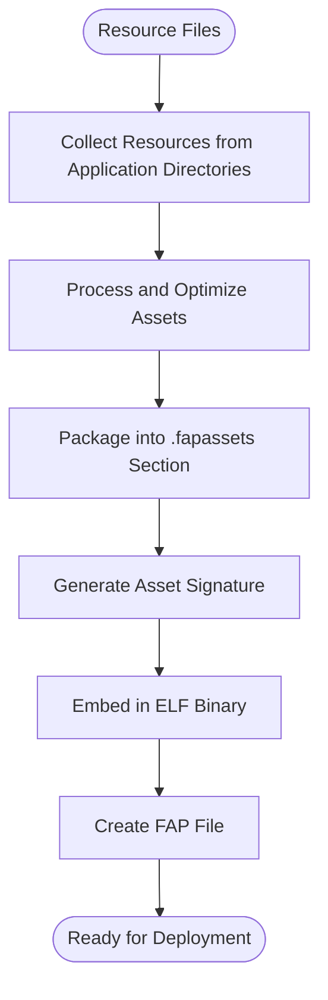
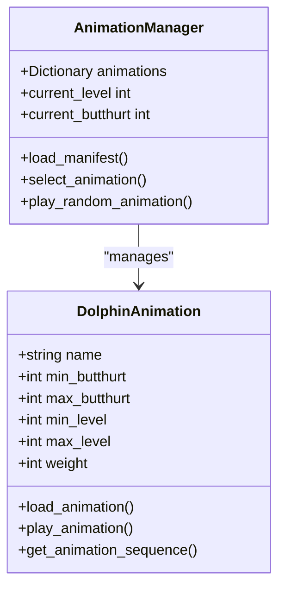
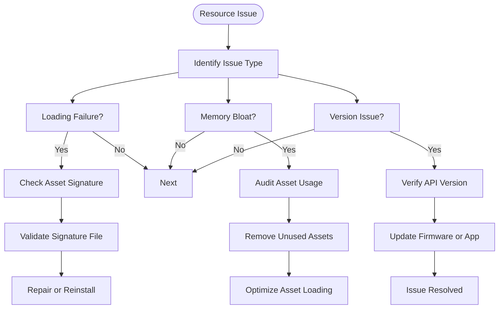

# Resource Management

<cite>
**Referenced Files in This Document**   
- [application_assets.h](file://lib/flipper_application/application_assets.h)
- [application_assets.c](file://lib/flipper_application/application_assets.c)
- [flipper_application.h](file://lib/flipper_application/flipper_application.h)
- [flipper_application.c](file://lib/flipper_application/flipper_application.c)
- [manifest.txt](file://assets/dolphin/blocking/manifest.txt)
- [manifest.txt](file://assets/dolphin/internal/manifest.txt)
- [example_images.c](file://applications/examples/example_images/example_images.c)
- [subghz_setting.h](file://lib/subghz/subghz_setting.h)
- [subghz_setting.c](file://lib/subghz/subghz_setting.c)
</cite>

## Table of Contents
1. [Resource Management Overview](#resource-management-overview)
2. [Asset Bundling Process](#asset-bundling-process)
3. [Runtime Resource Access](#runtime-resource-access)
4. [Dolphin Animation System](#dolphin-animation-system)
5. [SubGhz Frequency Presets](#subghz-frequency-presets)
6. [Archive Application Icons](#archive-application-icons)
7. [Common Resource Issues](#common-resource-issues)
8. [Best Practices](#best-practices)

## Resource Management Overview

The Flipper Zero firmware implements a comprehensive resource management system that handles application assets such as icons, animations, configuration files, and other binary data. Resources are embedded within application packages (FAP files) and managed through the Flipper Application API, which provides mechanisms for loading, accessing, and organizing assets efficiently.

The resource system follows a structured approach where assets are bundled with applications during compilation, stored in a standardized format, and accessed at runtime through dedicated API functions. This design ensures consistent resource handling across different application types while optimizing memory usage and performance.

**Section sources**
- [flipper_application.h](file://lib/flipper_application/flipper_application.h#L1-L160)
- [application_assets.h](file://lib/flipper_application/application_assets.h#L1-L17)

## Asset Bundling Process

During the compilation process, application resources are bundled into FAP (Flipper Application Package) files using a specialized asset embedding mechanism. The build system packages resources into dedicated sections of the ELF binary format, specifically the `.fapassets` section, which contains compressed and organized asset data.

The asset bundling process begins with resource collection from application-specific directories. Image files (PNG format), animation sequences, and configuration data are processed and packaged according to the Flipper Application Manifest specification. The manifest defines metadata such as resource names, sizes, and organizational structure.



**Diagram sources**
- [application_assets.c](file://lib/flipper_application/application_assets.c#L1-L361)
- [flipper_application.c](file://lib/flipper_application/flipper_application.c#L191-L391)

**Section sources**
- [application_assets.c](file://lib/flipper_application/application_assets.c#L1-L361)

## Runtime Resource Access

Applications access embedded resources at runtime through the Flipper Application API, which provides functions for loading and retrieving assets. The `flipper_application_load_name_and_icon` function demonstrates the primary mechanism for accessing manifest-embedded resources such as application icons and names.

When an application is loaded, the system first validates the FAP file and processes the `.fapmeta` section containing the application manifest. If the manifest indicates the presence of an icon (`has_icon` flag), the icon data is copied directly from the manifest to the provided buffer. This approach minimizes memory overhead by storing small assets like icons directly in the manifest.

For larger assets or those requiring file system storage, the `.fapassets` section is processed by the `flipper_application_assets_load` function. This function reads the asset header, validates the asset signature, and extracts directories and files to the appropriate location in the device's file system.

```c
bool flipper_application_load_name_and_icon(
    FuriString* path,
    Storage* storage,
    uint8_t** icon_ptr,
    FuriString* item_name) {
    // Implementation details from flipper_application.c
    FlipperApplication* app = flipper_application_alloc(storage, firmware_api_interface);
    FlipperApplicationPreloadStatus preload_res = 
        flipper_application_preload_manifest(app, furi_string_get_cstr(path));
    
    if(preload_res == FlipperApplicationPreloadStatusSuccess) {
        const FlipperApplicationManifest* manifest = 
            flipper_application_get_manifest(app);
        if(manifest->has_icon) {
            memcpy(*icon_ptr, manifest->icon, FAP_MANIFEST_MAX_ICON_SIZE);
        }
        furi_string_set(item_name, manifest->name);
    }
    flipper_application_free(app);
    return true;
}
```

**Section sources**
- [flipper_application.c](file://lib/flipper_application/flipper_application.c#L300-L391)

## Dolphin Animation System

The Dolphin animation system manages user engagement metrics and visual feedback through a collection of animated sequences stored in the assets directory. Animations are organized in subdirectories such as `dolphin/blocking` and `dolphin/internal`, each containing animation frames and manifest files that define animation properties.

The manifest files (manifest.txt) use a structured format to define animation parameters including name, butthurt thresholds, level requirements, and weight values. These parameters determine when and how animations are displayed based on the device's current state and user interaction metrics.



**Diagram sources**
- [manifest.txt](file://assets/dolphin/blocking/manifest.txt#L1-L42)
- [manifest.txt](file://assets/dolphin/internal/manifest.txt#L1-L27)

**Section sources**
- [manifest.txt](file://assets/dolphin/blocking/manifest.txt#L1-L42)
- [manifest.txt](file://assets/dolphin/internal/manifest.txt#L1-L27)

## SubGhz Frequency Presets

The SubGhz application manages frequency configuration through a preset system that stores commonly used frequency values and modulation settings. These presets are defined in the `subghz_setting` module and provide a convenient way for users to access standard frequency bands without manual entry.

Frequency presets are implemented as structured data within the application, with each preset containing parameters such as frequency value, name, and applicable regions. The system supports both built-in presets and user-defined configurations, allowing for flexibility in different operational environments.

The preset management system includes functions for loading, saving, and validating frequency configurations. Presets are stored in the device's non-volatile memory and can be accessed quickly during operation, reducing setup time for common use cases.

```c
// Example structure from subghz_setting.h
typedef struct {
    uint32_t frequency;
    const char* name;
    uint8_t region;
} SubGhzPreset;
```

**Section sources**
- [subghz_setting.h](file://lib/subghz/subghz_setting.h#L1-L20)
- [subghz_setting.c](file://lib/subghz/subghz_setting.c#L1-L100)

## Archive Application Icons

The Archive application uses a standardized icon system to represent different file types and application categories. Icons are embedded in the application manifest and loaded at runtime using the `flipper_application_load_name_and_icon` function. This approach ensures consistent icon display across the user interface while minimizing memory usage.

Application icons are typically 10x10 pixels in size and stored in PNG format during development. During the build process, these images are converted to binary format and embedded in the application manifest. The icon data is then extracted and displayed in the Archive interface when browsing applications and files.

The icon system supports both built-in application icons and user-installed application icons, providing a unified visual experience. When an application does not provide a custom icon, the system displays a default icon based on the application type.

**Section sources**
- [flipper_application.c](file://lib/flipper_application/flipper_application.c#L300-L350)
- [example_images.c](file://applications/examples/example_images/example_images.c#L1-L50)

## Common Resource Issues

Several common issues can occur in the resource management system, affecting application functionality and user experience:

### Resource Loading Failures
Resource loading can fail due to corrupted FAP files, insufficient storage space, or signature validation errors. The asset loading system includes signature verification to prevent loading modified or corrupted assets, but this can also cause legitimate loading failures if the signature file becomes corrupted.

### Memory Bloat from Unused Assets
Applications that bundle large numbers of unused assets can contribute to memory bloat, particularly when assets are loaded into RAM unnecessarily. The current system loads all assets from the `.fapassets` section during application preload, which can impact overall system performance.

### Version Compatibility Problems
Changes to the asset format or API can create version compatibility issues between firmware versions and applications. The manifest includes API version checking to prevent loading incompatible applications, but this can prevent legitimate applications from running on older or newer firmware versions.



**Diagram sources**
- [application_assets.c](file://lib/flipper_application/application_assets.c#L150-L200)
- [flipper_application.c](file://lib/flipper_application/flipper_application.c#L100-L150)

**Section sources**
- [application_assets.c](file://lib/flipper_application/application_assets.c#L1-L361)

## Best Practices

To optimize resource management in Flipper Zero applications, developers should follow these best practices:

### Optimize Asset Size
Minimize the size of embedded assets by using appropriate compression and optimization techniques. For images, use the smallest resolution that maintains acceptable quality. For animations, remove redundant frames and optimize color palettes.

### Organize Resources Logically
Structure asset directories in a logical hierarchy that reflects the application's functionality. Use consistent naming conventions and organize assets by type (icons, images, animations) and purpose.

### Handle Missing Resources Gracefully
Implement fallback mechanisms for missing resources, such as default icons or error messages. Applications should continue to function even when specific assets cannot be loaded.

### Use Efficient Loading Patterns
Load resources on-demand rather than preloading all assets at application startup. This approach reduces memory usage and improves application launch times.

### Implement Proper Error Handling
Include comprehensive error handling for resource loading operations, with clear error messages and recovery options. Log resource loading failures for debugging purposes while maintaining a good user experience.

**Section sources**
- [application_assets.c](file://lib/flipper_application/application_assets.c#L1-L361)
- [flipper_application.c](file://lib/flipper_application/flipper_application.c#L1-L391)