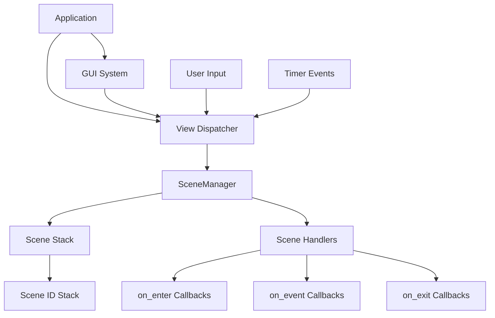
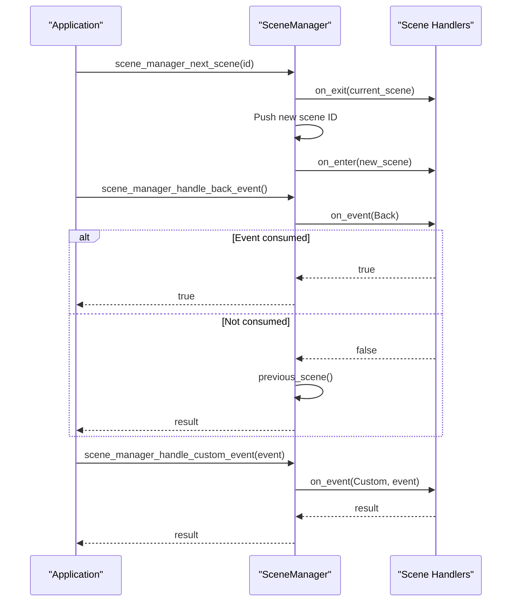
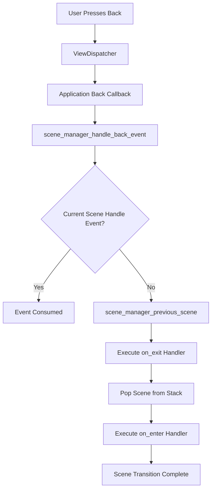

# Scene Management

<cite>
**Referenced Files in This Document**   
- [scene_manager.h](file://applications/services/gui/scene_manager.h)
- [scene_manager.c](file://applications/services/gui/scene_manager.c)
- [scene_manager_i.h](file://applications/services/gui/scene_manager_i.h)
- [archive.c](file://applications/main/archive/archive.c)
- [archive_i.h](file://applications/main/archive/archive_i.h)
- [archive_scene.h](file://applications/main/archive/scenes/archive_scene.h)
- [archive_scene_config.h](file://applications/main/archive/scenes/archive_scene_config.h)
- [lfrfid.c](file://applications/main/lfrfid/lfrfid.c)
- [lfrfid_scene.h](file://applications/main/lfrfid/scenes/lfrfid_scene.h)
- [lfrfid_scene_config.h](file://applications/main/lfrfid/scenes/lfrfid_scene_config.h)
- [nfc_app.c](file://applications/main/nfc/nfc_app.c)
- [subghz.c](file://applications/main/subghz/subghz.c)
</cite>

## Table of Contents
1. [Introduction](#introduction)
2. [Core Architecture](#core-architecture)
3. [Scene Handler Implementation](#scene-handler-implementation)
4. [SceneManager API](#scene-manager-api)
5. [Application Integration Patterns](#application-integration-patterns)
6. [Navigation and Event Flow](#navigation-and-event-flow)
7. [State Management](#state-management)
8. [Common Scene Patterns](#common-scene-patterns)
9. [Memory Management](#memory-management)
10. [Best Practices](#best-practices)

## Introduction

The Scene Management system in Flipper Zero firmware provides a structured navigation framework for applications, enabling organized user interface flows through discrete scene states. This system implements a stack-based navigation model where each scene represents a distinct user interface state with defined entry, event handling, and exit behaviors. The architecture supports various navigation patterns including menu systems, wizard flows, and modal dialogs across different applications such as archive, lfrfid, nfc, and subghz. The system is designed to maintain application state consistency while enabling efficient memory usage and responsive user interactions.

**Section sources**
- [scene_manager.h](file://applications/services/gui/scene_manager.h#L1-L189)
- [scene_manager.c](file://applications/services/gui/scene_manager.c#L0-L199)

## Core Architecture

The Scene Management system is built around the SceneManager data structure that maintains a navigation stack of scene identifiers and coordinates transitions between scenes. The architecture follows a controller pattern where the SceneManager routes events to appropriate scene handlers based on the current navigation state.



**Diagram sources**
- [scene_manager.h](file://applications/services/gui/scene_manager.h#L1-L189)
- [scene_manager_i.h](file://applications/services/gui/scene_manager_i.h#L1-L22)

**Section sources**
- [scene_manager_i.h](file://applications/services/gui/scene_manager_i.h#L1-L22)
- [scene_manager.h](file://applications/services/gui/scene_manager.h#L1-L189)

## Scene Handler Implementation

The scene management system implements three primary handler types for each scene: on_enter, on_event, and on_exit. These handlers manage the lifecycle of scene transitions and state changes.

### Handler Types

**on_enter**: Executed when transitioning to a scene, responsible for initializing the scene's UI elements, setting up view bindings, and preparing any required data structures.

**on_event**: Handles various event types including custom events, back navigation, and periodic tick events. Returns a boolean indicating whether the event was consumed.

**on_exit**: Called when leaving a scene, responsible for cleaning up resources, saving state, and releasing UI elements.

```mermaid
classDiagram
class SceneManager {
+SceneManagerIdStack_t scene_id_stack
+const SceneManagerHandlers* scene_handlers
+void* context
+AppScene scene[]
}
class SceneManagerHandlers {
+const AppSceneOnEnterCallback* on_enter_handlers
+const AppSceneOnEventCallback* on_event_handlers
+const AppSceneOnExitCallback* on_exit_handlers
+const uint32_t scene_num
}
class SceneManagerEvent {
+SceneManagerEventType type
+uint32_t event
}
class AppScene {
+uint32_t state
}
enum SceneManagerEventType {
SceneManagerEventTypeCustom
SceneManagerEventTypeBack
SceneManagerEventTypeTick
}
SceneManager --> SceneManagerHandlers : "uses"
SceneManager --> AppScene : "contains"
SceneManager --> SceneManagerEvent : "processes"
```

**Diagram sources**
- [scene_manager.h](file://applications/services/gui/scene_manager.h#L1-L189)
- [scene_manager_i.h](file://applications/services/gui/scene_manager_i.h#L1-L22)

**Section sources**
- [scene_manager.h](file://applications/services/gui/scene_manager.h#L1-L189)
- [scene_manager.c](file://applications/services/gui/scene_manager.c#L0-L199)

## SceneManager API

The SceneManager provides a comprehensive API for managing scene navigation and state. The API is designed to be application-agnostic while providing the necessary flexibility for different navigation patterns.

### Core Functions

**scene_manager_alloc**: Initializes a new SceneManager instance with specified scene handlers and context. Allocates memory for the scene stack and initializes internal data structures.

**scene_manager_free**: Cleans up and deallocates a SceneManager instance, including clearing the scene stack.

**scene_manager_next_scene**: Transitions to a new scene by first calling the on_exit handler of the current scene, pushing the new scene ID onto the stack, and calling the on_enter handler.

**scene_manager_previous_scene**: Returns to the previous scene by popping the current scene from the stack and transitioning to the previous one.

**scene_manager_handle_custom_event**: Routes custom events to the current scene's on_event handler.

**scene_manager_handle_back_event**: Handles back navigation events, first attempting to let the current scene handle the event, then automatically navigating back if not consumed.



**Diagram sources**
- [scene_manager.h](file://applications/services/gui/scene_manager.h#L1-L189)
- [scene_manager.c](file://applications/services/gui/scene_manager.c#L0-L199)

**Section sources**
- [scene_manager.h](file://applications/services/gui/scene_manager.h#L1-L189)
- [scene_manager.c](file://applications/services/gui/scene_manager.c#L0-L199)

## Application Integration Patterns

The scene management system is integrated into Flipper Zero applications through a consistent pattern that combines the SceneManager with the ViewDispatcher to manage both navigation state and UI rendering.

### Archive Application Example

The archive application demonstrates a typical implementation pattern with a file browser interface and supporting scenes for operations like renaming, deleting, and creating directories.

```c
static ArchiveApp* archive_alloc(void) {
    ArchiveApp* archive = malloc(sizeof(ArchiveApp));
    
    // Initialize GUI components
    archive->gui = furi_record_open(RECORD_GUI);
    archive->loader = furi_record_open(RECORD_LOADER);
    
    // Initialize scene manager with handlers and context
    archive->scene_manager = scene_manager_alloc(&archive_scene_handlers, archive);
    archive->view_dispatcher = view_dispatcher_alloc();
    
    // Configure view dispatcher callbacks
    view_dispatcher_set_event_callback_context(archive->view_dispatcher, archive);
    view_dispatcher_set_custom_event_callback(view_dispatcher, archive_custom_event_callback);
    view_dispatcher_set_navigation_event_callback(view_dispatcher, archive_back_event_callback);
    view_dispatcher_set_tick_event_callback(view_dispatcher, archive_tick_event_callback, 100);
    
    // Add views for different UI components
    view_dispatcher_add_view(view_dispatcher, ArchiveViewTextInput, text_input_get_view(archive->text_input));
    view_dispatcher_add_view(archive->view_dispatcher, ArchiveViewWidget, widget_get_view(archive->widget));
    view_dispatcher_add_view(archive->view_dispatcher, ArchiveViewStack, view_stack_get_view(archive->view_stack));
    view_dispatcher_add_view(archive->view_dispatcher, ArchiveViewBrowser, archive_browser_get_view(archive->browser));
    
    return archive;
}
```

**Section sources**
- [archive.c](file://applications/main/archive/archive.c#L0-L150)
- [archive_i.h](file://applications/main/archive/archive_i.h#L0-L51)

### Scene Definition Pattern

Applications use a macro-based pattern to define scenes consistently across the codebase. This approach generates both the scene enumeration and handler declarations automatically.

```c
// archive_scene_config.h
ADD_SCENE(archive, browser, Browser)
ADD_SCENE(archive, new_dir, NewDir)
ADD_SCENE(archive, rename, Rename)
ADD_SCENE(archive, delete, Delete)
ADD_SCENE(archive, search, Search)
ADD_SCENE(archive, info, Info)
```

This configuration file is included multiple times with different macro definitions to generate:
- Scene enumeration values
- on_enter handler declarations
- on_event handler declarations  
- on_exit handler declarations

**Section sources**
- [archive_scene.h](file://applications/main/archive/scenes/archive_scene.h#L0-L29)
- [archive_scene_config.h](file://applications/main/archive/scenes/archive_scene_config.h#L0-L6)

## Navigation and Event Flow

The scene management system implements a sophisticated event routing mechanism that handles various types of user interactions and system events.

### Event Handling Process

When a navigation event occurs (such as a back button press), the process follows these steps:

1. The ViewDispatcher receives the navigation event
2. It calls the application's back event callback
3. The callback invokes scene_manager_handle_back_event()
4. The SceneManager routes the event to the current scene's on_event handler
5. If the event is not consumed, the SceneManager automatically navigates to the previous scene



**Diagram sources**
- [scene_manager.c](file://applications/services/gui/scene_manager.c#L100-L150)
- [archive.c](file://applications/main/archive/archive.c#L20-L40)

**Section sources**
- [scene_manager.c](file://applications/services/gui/scene_manager.c#L100-L150)
- [archive.c](file://applications/main/archive/archive.c#L20-L40)

## State Management

The scene management system provides mechanisms for maintaining state across scene transitions, allowing applications to preserve user context and data.

### Scene State Storage

Each scene can maintain its own state through the scene_manager_set_scene_state() and scene_manager_get_scene_state() functions. This allows scenes to store transient data that persists across navigation.

```c
// Set scene state
scene_manager_set_scene_state(archive->scene_manager, ArchiveAppSceneInfo, false);

// Get scene state
uint32_t state = scene_manager_get_scene_state(archive->scene_manager, ArchiveAppSceneInfo);
```

The state is stored in an array within the SceneManager structure, with one state value per scene. This lightweight approach enables efficient state management without significant memory overhead.

**Section sources**
- [scene_manager.h](file://applications/services/gui/scene_manager.h#L50-L70)
- [archive.c](file://applications/main/archive/archive.c#L100-L110)

## Common Scene Patterns

The Flipper Zero firmware implements several common UI patterns using the scene management system across different applications.

### Menu Navigation (Archive Application)

The archive application uses a straightforward menu navigation pattern where scenes represent different operations on files and directories:

- **Browser**: Main file browsing interface
- **NewDir**: Create new directory dialog
- **Rename**: File/directory renaming interface  
- **Delete**: Confirmation dialog for deletion
- **Search**: File search functionality
- **Info**: File information display

This pattern follows a linear flow where users navigate from the main browser to operation-specific scenes and back.

### Wizard Flow (lfrfid Application)

The lfrfid application implements a wizard-like flow for reading and writing RFID tags:

```c
// lfrfid_scene_config.h
ADD_SCENE(lfrfid, start, Start)
ADD_SCENE(lfrfid, read, Read)
ADD_SCENE(lfrfid, read_success, ReadSuccess)
ADD_SCENE(lfrfid, write, Write)
ADD_SCENE(lfrfid, write_success, WriteSuccess)
ADD_SCENE(lfrfid, emulate, Emulate)
```

This creates a guided workflow where users progress through a sequence of scenes to complete RFID operations, with appropriate success and error handling scenes.

### Modal Dialogs

Several applications use scenes for modal dialogs that temporarily interrupt the main flow:

- **Confirmation dialogs**: Before destructive operations
- **Input dialogs**: For collecting user input
- **Progress indicators**: During long-running operations
- **Success/error notifications**: After operation completion

These modal scenes typically return to their calling scene after completion, maintaining the previous navigation context.

**Section sources**
- [lfrfid_scene_config.h](file://applications/main/lfrfid/scenes/lfrfid_scene_config.h#L0-L39)
- [archive_scene_config.h](file://applications/main/archive/scenes/archive_scene_config.h#L0-L6)

## Memory Management

The scene management system is designed with careful consideration for memory usage in the resource-constrained Flipper Zero environment.

### Memory Allocation Strategy

The SceneManager uses a single allocation strategy to minimize heap fragmentation:

```c
SceneManager* scene_manager_alloc(const SceneManagerHandlers* app_scene_handlers, void* context) {
    SceneManager* scene_manager =
        malloc(sizeof(SceneManager) + (sizeof(AppScene) * app_scene_handlers->scene_num));
    // ... initialization
    return scene_manager;
}
```

This approach allocates the base SceneManager structure along with space for all AppScene state structures in a single memory block, reducing allocation overhead and fragmentation.

### Resource Cleanup

Proper resource cleanup is essential to prevent memory leaks. Applications must:

1. Free the SceneManager with scene_manager_free()
2. Remove all views from the ViewDispatcher
3. Close any opened records
4. Free allocated strings and buffers

The archive_free() function demonstrates this comprehensive cleanup pattern.

**Section sources**
- [scene_manager.c](file://applications/services/gui/scene_manager.c#L20-L30)
- [archive.c](file://applications/main/archive/archive.c#L50-L100)

## Best Practices

Based on the analysis of multiple applications, several best practices emerge for effective scene management implementation.

### Consistent Scene Design

Applications should follow a consistent naming convention and structure for scenes:
- Use descriptive scene names
- Group related scenes together
- Maintain a logical navigation flow
- Provide clear back navigation paths

### Efficient Event Handling

Optimize event handling by:
- Only consuming events that are actually handled
- Using custom events for application-specific actions
- Implementing tick events sparingly to conserve power
- Properly handling back events to maintain navigation consistency

### State Preservation

Effectively use the scene state mechanism to:
- Store transient UI state
- Preserve user context across navigation
- Avoid unnecessary data reloading
- Maintain wizard progress

### Memory Efficiency

Follow memory-efficient practices:
- Allocate resources in on_enter, free in on_exit
- Use the context pointer for shared data
- Minimize global variables
- Reuse UI components when possible

These practices ensure responsive, reliable, and memory-efficient applications within the Flipper Zero ecosystem.

**Section sources**
- [archive.c](file://applications/main/archive/archive.c#L0-L150)
- [lfrfid.c](file://applications/main/lfrfid/lfrfid.c#L0-L199)
- [scene_manager.c](file://applications/services/gui/scene_manager.c#L0-L199)