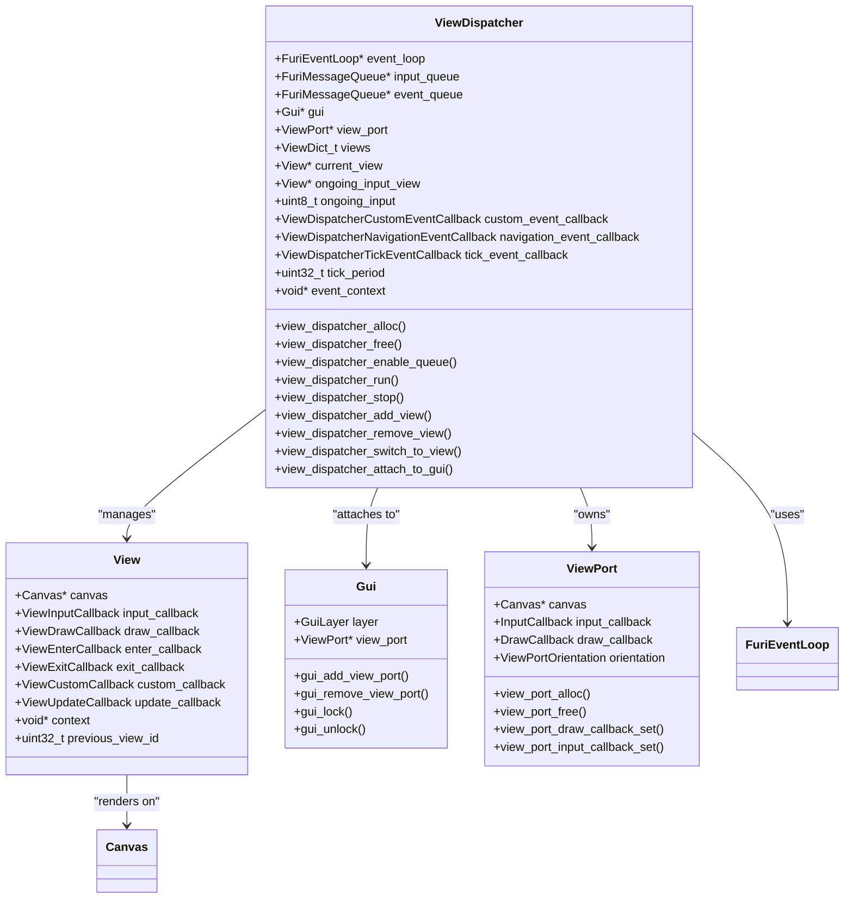
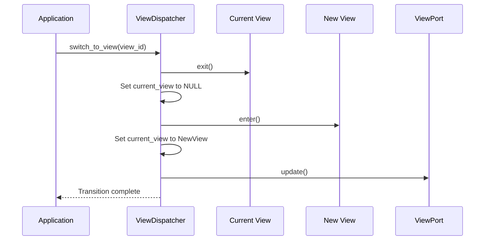
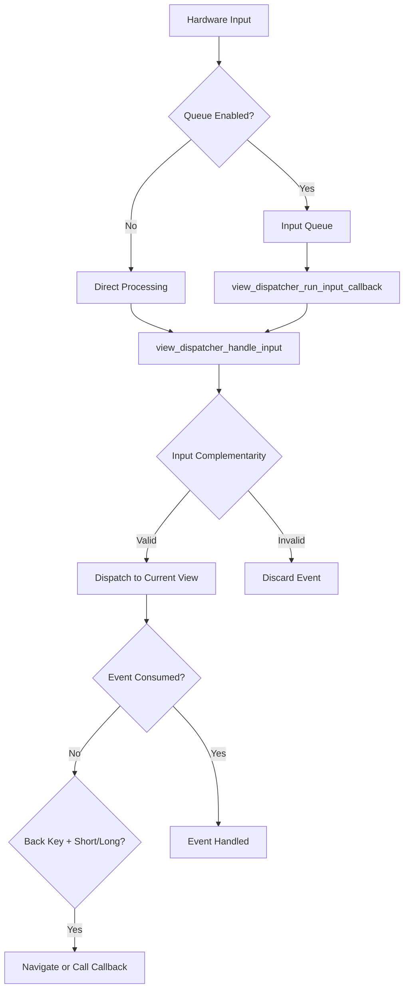
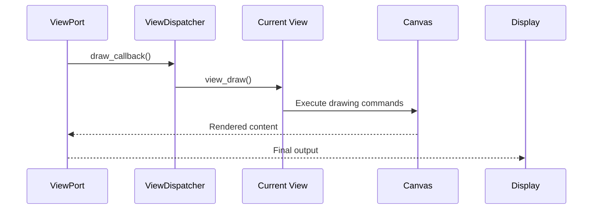
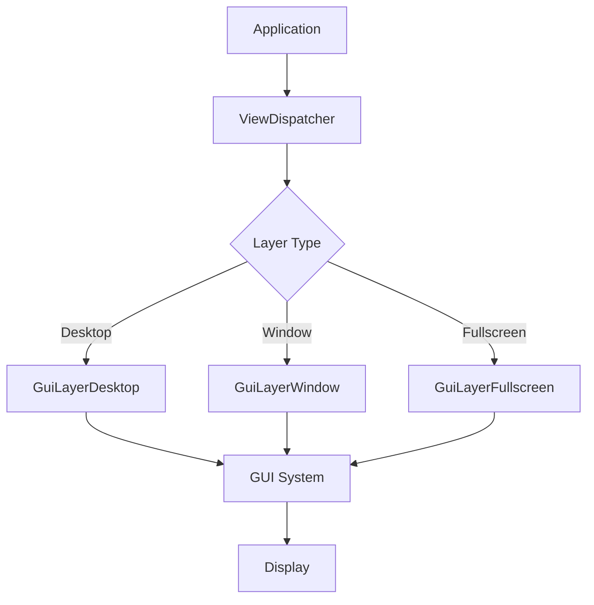

# View Dispatcher

<cite>
**Referenced Files in This Document**   
- [view_dispatcher.h](file://applications/services/gui/view_dispatcher.h)
- [view_dispatcher_i.h](file://applications/services/gui/view_dispatcher_i.h)
- [view_dispatcher.c](file://applications/services/gui/view_dispatcher.c)
- [archive.c](file://applications/main/archive/archive.c)
- [lfrfid_debug.c](file://applications/debug/lfrfid_debug/lfrfid_debug.c)
- [nfc_debug_app.c](file://applications/debug/nfc_debug_app/nfc_debug_app.c)
- [subghz_test_app.c](file://applications/debug/subghz_test/subghz_test_app.c)
</cite>

## Table of Contents
1. [Introduction](#introduction)
2. [Core Architecture](#core-architecture)
3. [View Lifecycle Management](#view-lifecycle-management)
4. [Input Event Handling](#input-event-handling)
5. [Rendering and Drawing System](#rendering-and-drawing-system)
6. [Integration with GUI System](#integration-with-gui-system)
7. [Application Examples](#application-examples)
8. [Common Issues and Best Practices](#common-issues-and-best-practices)
9. [Performance Optimization](#performance-optimization)

## Introduction

The View Dispatcher is a central component in the Flipper Zero firmware's graphical user interface (GUI) system, responsible for managing view-based UI architecture. It serves as the intermediary between hardware input events, application logic, and screen rendering, providing a structured approach to UI development. The View Dispatcher enables applications to create responsive, event-driven interfaces by managing view creation, input processing, and rendering callbacks.

This document provides a comprehensive analysis of the View Dispatcher system, covering its architecture, functionality, and integration patterns. It examines how views are managed throughout their lifecycle, how input events are processed and routed, and how rendering is coordinated with the underlying GUI system. The documentation includes concrete examples from various applications including the archive browser, LF RFID reader, NFC scanner, and Sub-GHz analyzer to illustrate different usage patterns and best practices.

**Section sources**
- [view_dispatcher.h](file://applications/services/gui/view_dispatcher.h#L1-L184)
- [view_dispatcher.c](file://applications/services/gui/view_dispatcher.c#L1-L407)

## Core Architecture

The View Dispatcher implements a view-based UI architecture that separates concerns between view management, input processing, and rendering. At its core, the View Dispatcher maintains a collection of views and manages transitions between them based on user input and application events.



**Diagram sources**
- [view_dispatcher_i.h](file://applications/services/gui/view_dispatcher_i.h#L15-L34)
- [view_dispatcher.h](file://applications/services/gui/view_dispatcher.h#L24-L24)

The View Dispatcher structure contains several key components:
- **Event Loop**: Manages asynchronous events and callbacks
- **Input Queue**: Buffers hardware input events for processing
- **Event Queue**: Handles custom application events
- **GUI Reference**: Connects to the main GUI system
- **ViewPort**: Represents the rendering surface and input receiver
- **Views Dictionary**: Stores all registered views by ID
- **Current View**: Tracks the active view being displayed
- **Callback Handlers**: For custom, navigation, and tick events

The View Dispatcher operates in a run-loop model where it processes input events, dispatches them to the appropriate views, and handles rendering updates. When enabled with queue support, it integrates with the FuriEventLoop system to handle asynchronous events efficiently.

**Section sources**
- [view_dispatcher_i.h](file://applications/services/gui/view_dispatcher_i.h#L15-L62)
- [view_dispatcher.c](file://applications/services/gui/view_dispatcher.c#L1-L407)

## View Lifecycle Management

The View Dispatcher provides a comprehensive system for managing the lifecycle of views, from creation and registration to activation and cleanup. This lifecycle management ensures proper resource handling and smooth transitions between different UI states.

### View Creation and Registration

Views are created and registered with the View Dispatcher through a well-defined process:

```c
// Allocate ViewDispatcher instance
ViewDispatcher* view_dispatcher = view_dispatcher_alloc();

// Enable event queue for asynchronous processing
view_dispatcher_enable_queue(view_dispatcher);

// Create and add views to the dispatcher
View* text_input_view = text_input_get_view(text_input);
view_dispatcher_add_view(view_dispatcher, ArchiveViewTextInput, text_input_view);

View* browser_view = archive_browser_get_view(browser);
view_dispatcher_add_view(view_dispatcher, ArchiveViewBrowser, browser_view);
```

The `view_dispatcher_add_view()` function registers a view with a specific ID, allowing it to be referenced later. During registration, the View Dispatcher sets up update callbacks and ensures thread safety by locking the GUI when necessary.

### View Activation and Switching

View switching is managed through the `view_dispatcher_switch_to_view()` function, which handles the transition between views:



**Diagram sources**
- [view_dispatcher.c](file://applications/services/gui/view_dispatcher.c#L250-L265)

When switching views, the View Dispatcher follows these steps:
1. Validates the target view ID
2. Calls the exit callback on the current view
3. Updates the current view pointer
4. Calls the enter callback on the new view
5. Enables the ViewPort if transitioning to a valid view
6. Updates the display through the ViewPort

The `view_dispatcher_set_current_view()` function handles the core logic, including orientation changes and proper event sequencing.

### View Cleanup and Removal

Proper cleanup is essential to prevent memory leaks and ensure system stability:

```c
// Remove view from dispatcher
view_dispatcher_remove_view(view_dispatcher, ArchiveViewTextInput);

// Free the view resources
text_input_free(text_input);

// Free the dispatcher when no longer needed
view_dispatcher_free(view_dispatcher);
```

During view removal, the system:
- Locks the GUI to prevent race conditions
- Removes the view from the internal dictionary
- Clears update callbacks
- Handles cases where the removed view is currently active
- Unlocks the GUI after cleanup

The `view_dispatcher_free()` function performs comprehensive cleanup, ensuring all resources are properly released and checking for potential memory leaks.

**Section sources**
- [view_dispatcher.c](file://applications/services/gui/view_dispatcher.c#L100-L150)
- [view_dispatcher.c](file://applications/services/gui/view_dispatcher.c#L152-L180)

## Input Event Handling

The View Dispatcher implements a sophisticated input event handling system that routes hardware input to the appropriate views while maintaining proper event ordering and complementarity.

### Input Processing Pipeline



**Diagram sources**
- [view_dispatcher.c](file://applications/services/gui/view_dispatcher.c#L300-L380)

### Input Complementarity System

The View Dispatcher enforces input complementarity to prevent inconsistent input states:

```c
void view_dispatcher_handle_input(ViewDispatcher* view_dispatcher, InputEvent* event) {
    // Track ongoing input states
    uint8_t key_bit = (1 << event->key);
    if(event->type == InputTypePress) {
        view_dispatcher->ongoing_input |= key_bit;
    } else if(event->type == InputTypeRelease) {
        view_dispatcher->ongoing_input &= ~key_bit;
    } else if(!(view_dispatcher->ongoing_input & key_bit)) {
        // Discard non-complementary input
        return;
    }
    
    // Process valid input events
    if(view_dispatcher->current_view && 
       view_dispatcher->ongoing_input_view == view_dispatcher->current_view) {
        bool is_consumed = view_input(view_dispatcher->current_view, event);
        
        // Handle navigation if not consumed
        if(!is_consumed && (event->key == InputKeyBack) &&
           (event->type == InputTypeShort || event->type == InputTypeLong)) {
            uint32_t view_id = view_previous(view_dispatcher->current_view);
            if(view_id != VIEW_IGNORE) {
                view_dispatcher_switch_to_view(view_dispatcher, view_id);
            } else if(view_dispatcher->navigation_event_callback) {
                if(!view_dispatcher->navigation_event_callback(view_dispatcher->event_context)) {
                    view_dispatcher_stop(view_dispatcher);
                }
            }
        }
    }
}
```

The complementarity system ensures that:
- Press events are followed by corresponding release events
- Events are not processed out of sequence
- Input state is tracked per key
- Invalid input sequences are discarded

### Event Routing and Consumption

Input events follow a specific routing pattern:
1. Hardware generates input event
2. Event is queued or processed directly
3. Complementarity is verified
4. Event is dispatched to the current view
5. If not consumed, navigation events are processed
6. Custom event callbacks are invoked if needed

Views can consume events by returning `true` from their input callback, preventing further processing. This allows views to handle complex input sequences like key combinations or gestures.

**Section sources**
- [view_dispatcher.c](file://applications/services/gui/view_dispatcher.c#L300-L380)
- [view_dispatcher.h](file://applications/services/gui/view_dispatcher.h#L150-L160)

## Rendering and Drawing System

The View Dispatcher coordinates the rendering process between views and the display system through a well-defined drawing callback mechanism.

### Drawing Callback Architecture



**Diagram sources**
- [view_dispatcher.c](file://applications/services/gui/view_dispatcher.c#L280-L290)

The drawing system operates as follows:
1. The ViewPort triggers the draw callback when rendering is needed
2. The View Dispatcher invokes the draw callback on the current view
3. The view executes drawing commands on the canvas
4. The rendered content is displayed on the screen

### Update Mechanism

Views signal the need for redrawing through the update callback system:

```c
void view_dispatcher_update(View* view, void* context) {
    ViewDispatcher* view_dispatcher = context;
    
    if(view_dispatcher->current_view == view) {
        view_port_update(view_dispatcher->view_port);
    }
}
```

When a view needs to be redrawn, it calls its update callback, which triggers a ViewPort update if the view is currently active. This ensures that only visible views consume rendering resources.

### Canvas Management

The Canvas abstraction provides a consistent drawing interface:

- **Primitive Drawing**: Lines, rectangles, circles, text
- **Font Support**: Multiple font sizes and styles
- **Inversion**: Screen inversion for highlighting
- **Clipping**: Region-based drawing limits

Views are responsible for their own rendering logic, while the View Dispatcher ensures proper timing and coordination with the display refresh cycle.

**Section sources**
- [view_dispatcher.c](file://applications/services/gui/view_dispatcher.c#L280-L290)
- [view_dispatcher.c](file://applications/services/gui/view_dispatcher.c#L390-L400)

## Integration with GUI System

The View Dispatcher integrates with the broader GUI system through well-defined attachment and layering mechanisms.

### GUI Attachment Process

```c
// Attach ViewDispatcher to GUI with specific layer type
view_dispatcher_attach_to_gui(
    view_dispatcher,
    gui,
    ViewDispatcherTypeFullscreen);
```

The attachment process supports three layer types:
- **Desktop**: Fullscreen with status bar
- **Window**: With status bar
- **Fullscreen**: Without status bar



**Diagram sources**
- [view_dispatcher.c](file://applications/services/gui/view_dispatcher.c#L270-L280)

### Layer Management

The View Dispatcher can be sent to different positions in the display stack:

```c
// Bring to front
view_dispatcher_send_to_front(view_dispatcher);

// Send to back  
view_dispatcher_send_to_back(view_dispatcher);
```

This allows applications to manage z-ordering of UI elements, such as modal dialogs or overlays.

### Event Loop Integration

When queue support is enabled, the View Dispatcher integrates with the FuriEventLoop:

```c
// Enable queue for asynchronous operation
view_dispatcher_enable_queue(view_dispatcher);

// Get event loop for additional subscriptions
FuriEventLoop* event_loop = view_dispatcher_get_event_loop(view_dispatcher);

// Run the dispatcher's event loop
view_dispatcher_run(view_dispatcher);
```

The event loop handles:
- Input events from the hardware
- Custom application events
- Periodic tick events
- Asynchronous callbacks

**Section sources**
- [view_dispatcher.h](file://applications/services/gui/view_dispatcher.h#L100-L120)
- [view_dispatcher.c](file://applications/services/gui/view_dispatcher.c#L50-L80)

## Application Examples

### Archive Browser Application

The archive browser demonstrates a typical application structure using the View Dispatcher:

```c
static ArchiveApp* archive_alloc(void) {
    ArchiveApp* archive = malloc(sizeof(ArchiveApp));
    
    // Initialize core components
    archive->gui = furi_record_open(RECORD_GUI);
    archive->scene_manager = scene_manager_alloc(&archive_scene_handlers, archive);
    archive->view_dispatcher = view_dispatcher_alloc();
    
    // Configure event handling
    view_dispatcher_enable_queue(archive->view_dispatcher);
    view_dispatcher_set_event_callback_context(archive->view_dispatcher, archive);
    view_dispatcher_set_custom_event_callback(archive->view_dispatcher, archive_custom_event_callback);
    view_dispatcher_set_navigation_event_callback(archive->view_dispatcher, archive_back_event_callback);
    view_dispatcher_set_tick_event_callback(archive->view_dispatcher, archive_tick_event_callback, 100);
    
    // Add various view types
    archive->text_input = text_input_alloc();
    view_dispatcher_add_view(archive->view_dispatcher, ArchiveViewTextInput, text_input_get_view(archive->text_input));
    
    archive->widget = widget_alloc();
    view_dispatcher_add_view(archive->view_dispatcher, ArchiveViewWidget, widget_get_view(archive->widget));
    
    archive->view_stack = view_stack_alloc();
    view_dispatcher_add_view(archive->view_dispatcher, ArchiveViewStack, view_stack_get_view(archive->view_stack));
    
    archive->browser = browser_alloc();
    view_dispatcher_add_view(archive->view_dispatcher, ArchiveViewBrowser, archive_browser_get_view(archive->browser));
    
    return archive;
}
```

Key patterns in the archive application:
- Multiple view types (text input, widget, view stack, browser)
- Scene manager integration for navigation
- Tick callback for periodic updates
- Proper resource cleanup in `archive_free()`

**Section sources**
- [archive.c](file://applications/main/archive/archive.c#L1-L151)

### LF RFID Reader Application

The LF RFID debug application shows specialized view usage:

```c
// Example pattern from lfrfid_debug.c
view_dispatcher_add_view(view_dispatcher, LfRfidDebugViewRead, lfrfid_debug_view_read_get());
view_dispatcher_add_view(view_dispatcher, LfRfidDebugViewEmulate, lfrfid_debug_view_emulate_get());
view_dispatcher_add_view(view_dispatcher, LfRfidDebugViewSaveName, text_input_get_view(app->text_input));
```

This application uses:
- Specialized views for different RFID operations
- Text input view for naming saved data
- Direct view switching between modes

### NFC Scanner Application

The NFC application demonstrates event-driven UI patterns:

```c
// Example pattern from nfc_debug_app.c
view_dispatcher_set_custom_event_callback(view_dispatcher, nfc_debug_custom_event_callback);
view_dispatcher_set_navigation_event_callback(view_dispatcher, nfc_debug_back_event_callback);
```

Key characteristics:
- Custom event handling for NFC detection
- Navigation callbacks for back button handling
- Multiple view states for different NFC operations

### Sub-GHz Analyzer Application

The Sub-GHz test application shows complex view management:

```c
// Example pattern from subghz_test_app.c
view_dispatcher_add_view(view_dispatcher, SubGhzTestViewMain, subghz_test_view_main_get());
view_dispatcher_add_view(view_dispatcher, SubGhzTestViewTransmit, subghz_test_view_transmit_get());
view_dispatcher_add_view(view_dispatcher, SubGhzTestViewReceiver, subghz_test_view_receiver_get());
```

Features:
- Multiple specialized views for transmission and reception
- Complex state management between modes
- Integration with radio hardware through event callbacks

**Section sources**
- [lfrfid_debug.c](file://applications/debug/lfrfid_debug/lfrfid_debug.c#L1-L500)
- [nfc_debug_app.c](file://applications/debug/nfc_debug_app/nfc_debug_app.c#L1-L400)
- [subghz_test_app.c](file://applications/debug/subghz_test/subghz_test_app.c#L1-L300)

## Common Issues and Best Practices

### Input Lag

Input lag can occur due to several factors:

**Causes:**
- Heavy processing in view input callbacks
- Long-running operations on the GUI thread
- Excessive view switching
- Inefficient drawing operations

**Solutions:**
```c
// Move heavy processing to separate threads
void heavy_operation_callback(void* context) {
    // Perform intensive calculations
    // Use custom events to update UI
    view_dispatcher_send_custom_event(view_dispatcher, EVENT_UPDATE_COMPLETE);
}
```

Best practices:
- Keep input callbacks lightweight
- Use worker threads for intensive operations
- Debounce rapid input events
- Optimize event handling logic

### Screen Flickering

Screen flickering typically results from improper rendering:

**Causes:**
- Frequent unnecessary updates
- Inconsistent drawing logic
- Race conditions in multi-threaded environments

**Solutions:**
```c
// Only update when necessary
if(should_update_display()) {
    view_dispatcher_update(view, context);
}
```

Best practices:
- Minimize update frequency
- Use double buffering when available
- Ensure consistent drawing state
- Avoid rapid view switching

### View Cleanup Issues

Improper cleanup can lead to memory leaks and crashes:

**Common mistakes:**
- Forgetting to remove views before freeing
- Not closing records properly
- Leaving threads running during cleanup

**Proper cleanup pattern:**
```c
void archive_free(ArchiveApp* archive) {
    // Join and free threads
    if(archive->info_thread) {
        furi_thread_join(archive->info_thread);
        furi_thread_free(archive->info_thread);
    }
    
    // Remove views before freeing dispatcher
    view_dispatcher_remove_view(view_dispatcher, ArchiveViewTextInput);
    text_input_free(archive->text_input);
    
    // Free dispatcher last
    view_dispatcher_free(archive->view_dispatcher);
}
```

**Section sources**
- [archive.c](file://applications/main/archive/archive.c#L50-L100)
- [view_dispatcher.c](file://applications/services/gui/view_dispatcher.c#L20-L40)

## Performance Optimization

### View Management Optimization

Efficient view management is crucial for responsive UI:

**Best practices:**
- Pre-allocate views during application startup
- Reuse views instead of creating/destroying frequently
- Use view stacks for hierarchical navigation
- Minimize the number of active views

```c
// Pre-allocate all views at startup
void app_init_views(App* app) {
    app->view1 = view_alloc();
    app->view2 = view_alloc(); 
    app->view3 = view_alloc();
    
    view_dispatcher_add_view(dispatcher, VIEW_ID_1, app->view1);
    view_dispatcher_add_view(dispatcher, VIEW_ID_2, app->view2);
    view_dispatcher_add_view(dispatcher, VIEW_ID_3, app->view3);
}
```

### Input Processing Optimization

Optimize input handling for responsiveness:

**Techniques:**
- Use event batching when appropriate
- Implement input filtering
- Prioritize critical input events
- Use efficient data structures for event queues

```c
// Optimize input queue size
view_dispatcher->input_queue = furi_message_queue_alloc(16, sizeof(InputEvent));
```

### Rendering Performance

Maximize rendering efficiency:

**Strategies:**
- Only redraw changed regions
- Use simple drawing primitives when possible
- Cache frequently used graphical elements
- Minimize font rendering operations

```c
// Optimize drawing by only updating when needed
void my_view_draw(Canvas* canvas, void* model) {
    if(model->dirty) {
        // Perform drawing operations
        model->dirty = false;
    }
}
```

### Memory Management

Efficient memory usage patterns:

**Guidelines:**
- Allocate view resources during initialization
- Use object pooling for frequently created/destroyed elements
- Free resources promptly during view removal
- Monitor memory usage with diagnostic tools

The View Dispatcher system, when used according to these best practices, enables the creation of responsive, efficient, and maintainable user interfaces for the Flipper Zero platform.

**Section sources**
- [view_dispatcher.c](file://applications/services/gui/view_dispatcher.c#L1-L407)
- [archive.c](file://applications/main/archive/archive.c#L1-L151)