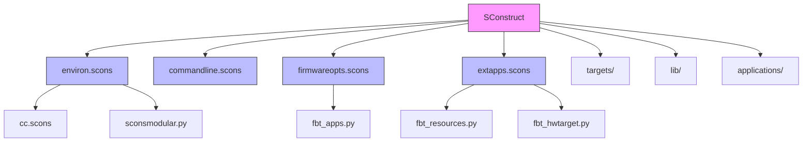
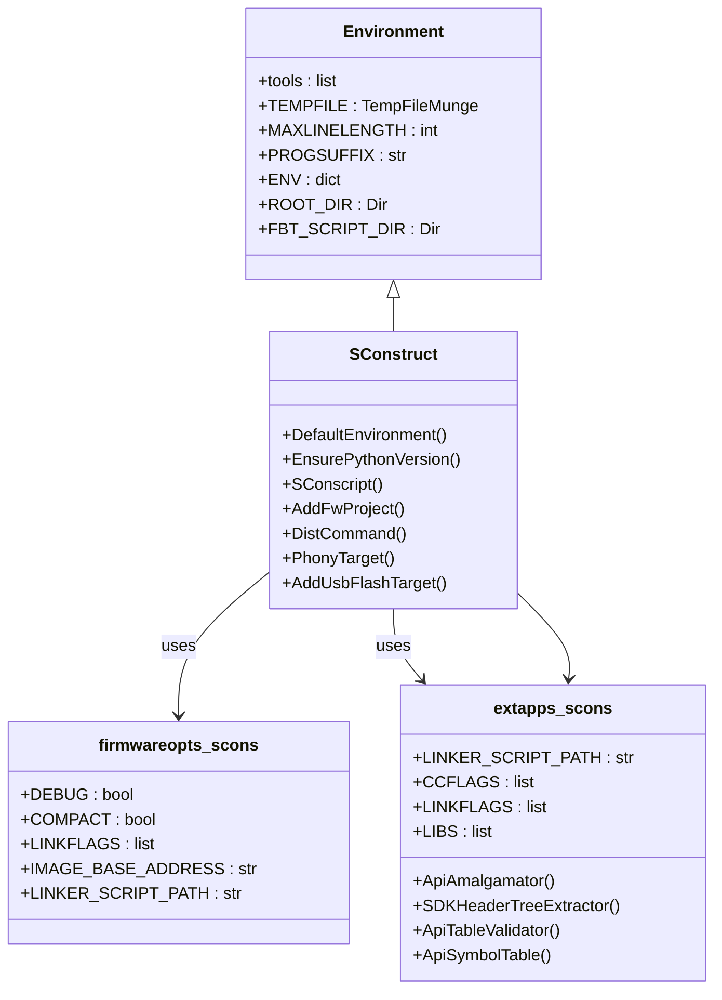
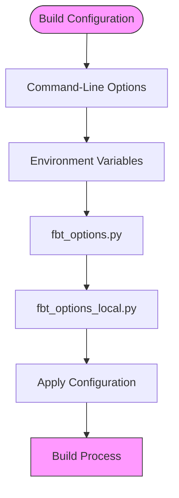
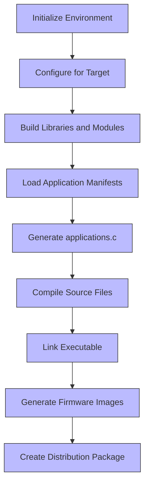
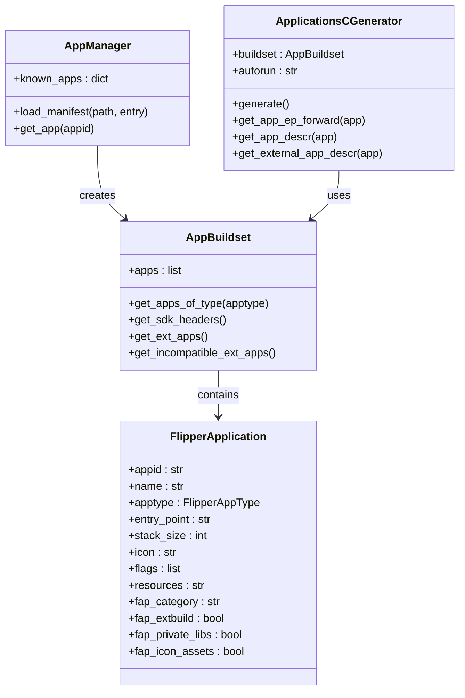
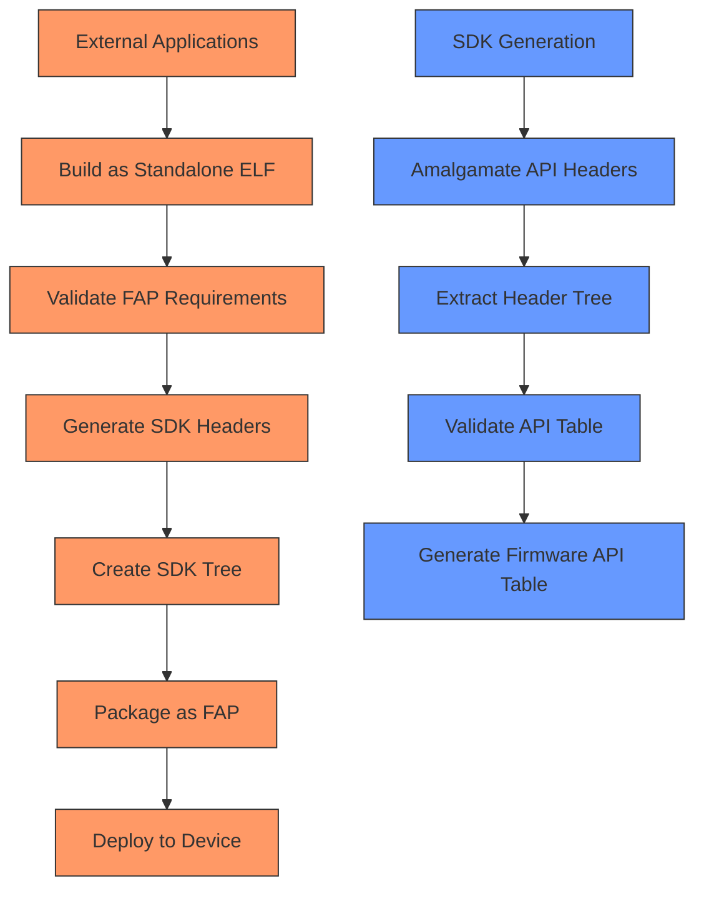
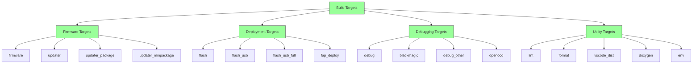
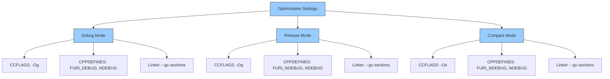
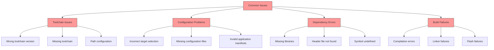

# Build System

<cite>
**Referenced Files in This Document**   
- [SConstruct](file://SConstruct)
- [firmware.scons](file://firmware.scons)
- [fbt_options.py](file://fbt_options.py)
- [site_scons/environ.scons](file://site_scons/environ.scons)
- [site_scons/commandline.scons](file://site_scons/commandline.scons)
- [site_scons/firmwareopts.scons](file://site_scons/firmwareopts.scons)
- [site_scons/extapps.scons](file://site_scons/extapps.scons)
- [site_scons/site_init.py](file://site_scons/site_init.py)
- [scripts/fbt_tools/sconsmodular.py](file://scripts/fbt_tools/sconsmodular.py)
- [scripts/fbt_tools/fbt_apps.py](file://scripts/fbt_tools/fbt_apps.py)
- [scripts/fbt_tools/fbt_resources.py](file://scripts/fbt_tools/fbt_resources.py)
- [scripts/fbt_tools/fbt_hwtarget.py](file://scripts/fbt_tools/fbt_hwtarget.py)
- [applications/main/application.fam](file://applications/main/application.fam)
- [applications/services/application.fam](file://applications/services/application.fam)
- [targets/f7/target.json](file://targets/f7/target.json)
</cite>

## Table of Contents
1. [Introduction](#introduction)
2. [Build System Architecture](#build-system-architecture)
3. [Core Components](#core-components)
4. [Configuration and Customization](#configuration-and-customization)
5. [Build Process Implementation](#build-process-implementation)
6. [Application Management](#application-management)
7. [External Applications and SDK](#external-applications-and-sdk)
8. [Build Targets and Commands](#build-targets-and-commands)
9. [Performance and Optimization](#performance-and-optimization)
10. [Common Issues and Troubleshooting](#common-issues-and-troubleshooting)

## Introduction

The Flipper Zero firmware build system is a sophisticated SCons-based framework designed to manage the compilation, linking, and packaging of firmware for the Flipper Zero device. This system provides a modular, configurable, and extensible approach to building firmware images, supporting various hardware targets, firmware configurations, and application sets. The build system is orchestrated through the `fbt` (Flipper Build Tool) command-line interface, which leverages SCons as the underlying build engine.

The architecture is designed to handle complex dependencies, support multiple build configurations, and facilitate the integration of external applications (FAPs - Flipper Application Packages). It incorporates features for code optimization, debugging, firmware distribution, and development environment setup. The system is structured to be both developer-friendly and production-ready, with comprehensive tooling for linting, formatting, documentation generation, and debugging.

**Section sources**
- [SConstruct](file://SConstruct#L1-L488)
- [firmware.scons](file://firmware.scons#L1-L328)

## Build System Architecture

The Flipper Zero build system follows a layered architecture with clear separation of concerns. At its core is the SCons build engine, extended with custom tools and configurations specific to the Flipper Zero platform. The architecture can be understood as a hierarchy of environments and configurations that progressively specialize the build process.

The system starts with a base environment configured in `site_scons/environ.scons`, which sets up fundamental build parameters, toolchain configuration, and cross-compilation settings for the ARM Cortex-M4 processor. This environment is then extended and specialized through various SCons scripts that handle specific aspects of the build process.



**Diagram sources**
- [SConstruct](file://SConstruct#L1-L488)
- [site_scons/environ.scons](file://site_scons/environ.scons#L1-L80)
- [site_scons/commandline.scons](file://site_scons/commandline.scons#L1-L286)
- [site_scons/firmwareopts.scons](file://site_scons/firmwareopts.scons#L1-L63)
- [site_scons/extapps.scons](file://site_scons/extapps.scons#L1-L135)

The build process begins with `SConstruct`, the main entry point that orchestrates the entire build. It first loads command-line options and environment variables, then creates a core environment with essential tools and settings. This core environment is used to construct specialized environments for different build targets, such as the base firmware and updater firmware.

A key architectural feature is the modular design, where different components of the system are built independently and then linked together. This is achieved through the `BuildModules` method in `sconsmodular.py`, which allows for the incremental construction of the build environment by processing individual modules like libraries, assets, targets, and FURI (Flipper User Runtime Interface) components.

The system also implements a sophisticated configuration management approach, where build parameters can be specified at multiple levels: default values in `fbt_options.py`, command-line overrides, and environment variables. This flexibility allows developers to customize the build process for different scenarios, from development to production.

**Section sources**
- [SConstruct](file://SConstruct#L1-L488)
- [site_scons/environ.scons](file://site_scons/environ.scons#L1-L80)
- [scripts/fbt_tools/sconsmodular.py](file://scripts/fbt_tools/sconsmodular.py#L1-L59)

## Core Components

The build system comprises several core components that work together to transform source code into executable firmware. These components include the environment configuration, module builders, application managers, and target-specific configurators.

The environment configuration is established in `environ.scons`, which creates the foundational build environment with appropriate toolchain settings, compiler flags, and system paths. This environment is designed for cross-compilation to the ARM Cortex-M4 architecture, with specific optimizations for embedded systems.



**Diagram sources**
- [site_scons/environ.scons](file://site_scons/environ.scons#L1-L80)
- [SConstruct](file://SConstruct#L1-L488)
- [site_scons/firmwareopts.scons](file://site_scons/firmwareopts.scons#L1-L63)
- [site_scons/extapps.scons](file://site_scons/extapps.scons#L1-L135)

The module building system, implemented in `sconsmodular.py`, provides methods for constructing individual components of the firmware. The `BuildModule` function handles the construction of a single module by locating its SConscript file and executing it in a variant directory. The `BuildModules` function extends this capability to process multiple modules sequentially, allowing for the incremental assembly of the complete build environment.

Another critical component is the hardware target configuration system, implemented in `fbt_hwtarget.py`. This component loads target-specific configuration from JSON files (like `targets/f7/target.json`) and applies the appropriate settings for the selected hardware platform. It handles inheritance between targets, allowing for a layered configuration approach where common settings can be shared across multiple hardware variants.

The build system also incorporates error handling and status reporting through `site_init.py`, which registers an at-exit handler to display build status and errors in a user-friendly format. This improves the developer experience by providing clear feedback on build failures.

**Section sources**
- [site_scons/environ.scons](file://site_scons/environ.scons#L1-L80)
- [scripts/fbt_tools/sconsmodular.py](file://scripts/fbt_tools/sconsmodular.py#L1-L59)
- [scripts/fbt_tools/fbt_hwtarget.py](file://scripts/fbt_tools/fbt_hwtarget.py#L1-L139)
- [site_scons/site_init.py](file://site_scons/site_init.py#L1-L41)

## Configuration and Customization

The Flipper Zero build system offers extensive configuration options that allow developers to customize the build process for different scenarios. These options are managed through a hierarchy of configuration sources, with command-line arguments taking precedence over environment variables, which in turn override default values in configuration files.

The primary configuration file is `fbt_options.py`, which contains default values for various build parameters. This file defines key settings such as the target hardware platform (`TARGET_HW`), optimization level (`COMPACT`), debug mode (`DEBUG`), and firmware origin (`FIRMWARE_ORIGIN`). Developers can override these defaults either through command-line options or by creating a `fbt_options_local.py` file that gets automatically loaded if it exists.



**Diagram sources**
- [fbt_options.py](file://fbt_options.py#L1-L98)
- [site_scons/commandline.scons](file://site_scons/commandline.scons#L1-L286)

The build system supports multiple hardware targets, currently including target 7 (f7) and target 18 (f18), with target 7 being the default. The target-specific configuration is stored in JSON files within the `targets/` directory, such as `targets/f7/target.json`. These files specify include paths, SDK header paths, linker scripts, and other target-specific settings.

Firmware configuration is managed through the `FIRMWARE_APPS` dictionary in `fbt_options.py`, which defines different application sets that can be included in the firmware. The default configuration includes basic services, main applications, and settings applications. Alternative configurations like "unit_tests" include additional test applications for development and debugging purposes.

Developers can also customize the build process through various command-line options:
- `--with-updater`: Enables building updater-related targets
- `--extra-int-apps`: Adds additional applications to the firmware's built-ins
- `--extra-ext-apps`: Forces specific applications to be built as standalone .elf files
- `--proxy-env`: Specifies additional environment variables to pass to child SCons processes

The build system also supports conditional compilation through preprocessor definitions that are automatically generated based on the build configuration. For example, when building in debug mode, the `FURI_DEBUG` macro is defined, while in release mode, `FURI_NDEBUG` is defined instead.

**Section sources**
- [fbt_options.py](file://fbt_options.py#L1-L98)
- [site_scons/commandline.scons](file://site_scons/commandline.scons#L1-L286)
- [targets/f7/target.json](file://targets/f7/target.json#L1-L60)

## Build Process Implementation

The build process in the Flipper Zero firmware system follows a well-defined sequence of steps that transform source code into executable firmware images. This process is orchestrated through the `firmware.scons` script, which coordinates the compilation, linking, and packaging of the firmware.

The build process begins with the creation of a core environment that includes essential tools, compiler settings, and system paths. This environment is then specialized for firmware building by adding firmware-specific tools and configurations. The process can be visualized as a pipeline with several distinct phases:



**Diagram sources**
- [firmware.scons](file://firmware.scons#L1-L328)
- [SConstruct](file://SConstruct#L1-L488)

The first phase involves configuring the build environment for the selected target hardware. This is accomplished by the `ConfigureForTarget` method in `fbt_hwtarget.py`, which loads target-specific settings from JSON configuration files and applies them to the build environment. This includes setting appropriate include paths, linker scripts, and other target-specific parameters.

Next, the system builds the core libraries and modules through the `BuildModules` function. This processes each module (such as libraries, assets, targets, and FURI components) by executing their respective SConscript files. Each module is built in its own variant directory to prevent conflicts and enable parallel builds.

A critical step in the process is the generation of `applications.c`, a source file that contains the application registry for the firmware. This file is generated dynamically based on the application manifests found in the `applications/` directory. The `ApplicationsCGenerator` class in `fbt_apps.py` creates this file by iterating through the selected applications and generating the appropriate C code to register each application with the system.

After the application registry is generated, the system compiles all source files and links them into a single executable (ELF file). The linking process uses target-specific linker scripts (like `stm32wb55xx_flash.ld` for target f7) to place code and data in the appropriate memory regions. The linker also applies various optimizations, such as garbage collection of unused sections (`--gc-sections`) and specification of nano-formatted C library (`-specs=nano.specs`).

Finally, the system generates multiple firmware image formats from the ELF file, including HEX, BIN, and DFU formats. These images are then packaged into distribution bundles that can be flashed to the device. The build process also generates additional artifacts like map files, size reports, and compilation databases for debugging and analysis.

**Section sources**
- [firmware.scons](file://firmware.scons#L1-L328)
- [scripts/fbt_tools/fbt_apps.py](file://scripts/fbt_tools/fbt_apps.py#L1-L220)
- [scripts/fbt_tools/fbt_hwtarget.py](file://scripts/fbt_tools/fbt_hwtarget.py#L1-L139)

## Application Management

The Flipper Zero build system implements a sophisticated application management system that handles the discovery, configuration, and integration of applications into the firmware. This system is centered around application manifest files (`.fam` files) that describe each application's properties and dependencies.

Application manifests are Python scripts that use a domain-specific language to define application metadata. For example, the `applications/main/application.fam` file defines a metapackage that groups several main applications together:

```python
App(
    appid="main_apps",
    name="Basic applications for main menu",
    apptype=FlipperAppType.METAPACKAGE,
    provides=[
        "dab_timer",
        "subghz",
        "subghz_remote_refactored",
        # ... other applications
    ],
)
```

These manifests are processed by the `AppManager` class in `fbt_apps.py`, which loads all manifests from the application directories specified in the `APPDIRS` variable. The system searches for manifests in multiple directories, including `applications`, `applications/services`, `applications/main`, and others, allowing for a logical organization of applications by type and function.



**Diagram sources**
- [applications/main/application.fam](file://applications/main/application.fam#L1-L38)
- [applications/services/application.fam](file://applications/services/application.fam#L1-L17)
- [scripts/fbt_tools/fbt_apps.py](file://scripts/fbt_tools/fbt_apps.py#L1-L220)

The application management system supports different application types, defined by the `FlipperAppType` enumeration:
- `SERVICE`: Core system services that run in the background
- `SYSTEM`: System applications that provide essential functionality
- `APP`: Regular applications accessible from the main menu
- `DEBUG`: Applications for debugging and testing
- `SETTINGS`: Settings applications
- `STARTUP`: On-start hooks that execute during system initialization
- `METAPACKAGE`: Virtual packages that group other applications
- `MENUEXTERNAL`: External applications accessible from the main menu
- `EXTSETTINGS`: External settings applications

During the build process, the system creates an `AppBuildset` that contains the subset of applications selected for the current configuration. This is determined by the `FIRMWARE_APPS` setting in `fbt_options.py` and any command-line overrides. The build set is then used to generate the `applications.c` file, which registers all selected applications with the system.

The system also performs validation to ensure compatibility between applications and the firmware configuration. For example, it prevents applications that use FAP-specific features from being built into the base firmware, as indicated by the sanity check in `firmware.scons` that raises an error if such applications are detected.

**Section sources**
- [applications/main/application.fam](file://applications/main/application.fam#L1-L38)
- [applications/services/application.fam](file://applications/services/application.fam#L1-L17)
- [scripts/fbt_tools/fbt_apps.py](file://scripts/fbt_tools/fbt_apps.py#L1-L220)

## External Applications and SDK

The Flipper Zero build system includes comprehensive support for external applications (FAPs) and provides an SDK for developing these applications. This functionality is implemented in `extapps.scons`, which handles the building of external applications and the generation of SDK artifacts.

The external application system allows developers to create standalone applications that can be loaded onto the device without modifying the base firmware. These applications are built as separate ELF files and packaged into FAP files, which can be installed on the device's SD card.



**Diagram sources**
- [site_scons/extapps.scons](file://site_scons/extapps.scons#L1-L135)
- [scripts/fbt_tools/fbt_resources.py](file://scripts/fbt_tools/fbt_resources.py#L1-L120)

The SDK generation process begins with the `ApiAmalgamator` builder, which combines all SDK headers into a single amalgamated file. This file serves as the source for extracting the SDK header tree, which is organized into a directory structure that mirrors the API organization. The extracted headers are placed in the build directory under `sdk_headers`, making them available for external application development.

An important aspect of the SDK system is API validation. The `ApiTableValidator` builder checks that the amalgamated API headers match the expected API symbols defined in the `api_symbols.csv` file for the target hardware. This ensures that external applications use only the officially supported API functions and prevents compatibility issues.

The system also generates a firmware API table (`firmware_api_table.h`) that contains symbol information for the firmware's exported functions. This table is used by external applications to access firmware functionality through a stable ABI (Application Binary Interface).

For resource management, the `fbt_resources.py` module handles the deployment of application resources to the firmware image. It copies resources from application directories to the appropriate locations in the resources root directory, ensuring that icons, sounds, and other assets are included in the final firmware package.

The build system provides several targets for working with external applications:
- `faps`: Builds all external applications
- `fap_dist`: Copies built FAPs to the distribution directory
- `fap_deploy`: Deploys FAPs to a connected device
- `sdk_tree`: Generates the SDK header tree
- `api_check`: Validates the API table
- `api_table`: Generates the firmware API table

**Section sources**
- [site_scons/extapps.scons](file://site_scons/extapps.scons#L1-L135)
- [scripts/fbt_tools/fbt_resources.py](file://scripts/fbt_tools/fbt_resources.py#L1-L120)

## Build Targets and Commands

The Flipper Zero build system provides a comprehensive set of build targets and commands that enable developers to perform various build, deployment, and debugging operations. These targets are defined in the `SConstruct` file and can be invoked through the `fbt` command-line tool.

The primary build targets include:
- `firmware`: Builds the base firmware image
- `updater`: Builds the updater firmware image
- `flash`: Flashes the firmware to a connected device
- `jflash`: Flashes the firmware using J-Flash
- `debug`: Starts a debugging session with GDB
- `cli`: Starts the Flipper CLI interface
- `dist`: Creates a distribution package
- `fap_dist`: Builds and packages external applications
- `sdk_tree`: Generates the SDK for external application development



**Diagram sources**
- [SConstruct](file://SConstruct#L1-L488)

Firmware targets are responsible for compiling and linking the firmware images. The `firmware` target builds the base firmware ELF file and generates additional formats like HEX, BIN, and DFU. The `updater` target builds the updater firmware, which is used for over-the-air updates. Specialized targets like `updater_package` and `updater_minpackage` create self-update packages with different levels of functionality.

Deployment targets facilitate transferring firmware and applications to the device. The `flash` target uses OpenOCD to flash the firmware to a connected device via ST-Link. The `flash_usb` target creates a USB flashable package that can be installed through the device's USB interface. The `fap_deploy` target copies external applications to the device's SD card, making them available for use.

Debugging targets provide various options for debugging the firmware. The `debug` target starts a GDB session with the firmware, allowing for source-level debugging. The `blackmagic` target supports debugging with a Black Magic Probe. The `openocd` target starts an OpenOCD server, enabling connection with other debugging tools. The `debug_other` target allows debugging of pre-built ELF files.

Utility targets offer additional functionality for development and maintenance. The `lint` and `format` targets run code analysis and formatting tools to ensure code quality. The `vscode_dist` target configures the development environment for Visual Studio Code. The `doxygen` target generates documentation from source code comments. The `env` target displays the path to the environment setup script.

The build system also supports parallel execution of independent targets, improving build efficiency. For example, building libraries, assets, and target-specific code can occur simultaneously, reducing overall build time.

**Section sources**
- [SConstruct](file://SConstruct#L1-L488)

## Performance and Optimization

The Flipper Zero build system incorporates several performance optimizations and build configuration options to balance compilation speed, firmware size, and debugging capabilities. These optimizations are particularly important given the resource-constrained nature of the embedded platform and the need for efficient development workflows.

The system provides multiple optimization levels controlled by the `DEBUG` and `COMPACT` flags in `fbt_options.py`. When `DEBUG` is enabled, the system uses the `-Og` optimization level, which enables debugging-friendly optimizations while still providing reasonable performance. When `COMPACT` is enabled, the system uses `-Os` (optimize for size), which prioritizes minimizing the firmware footprint over execution speed.



**Diagram sources**
- [firmware.scons](file://firmware.scons#L1-L328)
- [site_scons/firmwareopts.scons](file://site_scons/firmwareopts.scons#L1-L63)

The linker is configured with several optimizations to reduce the final firmware size:
- `--gc-sections`: Removes unused code and data sections
- `--wrap`: Wraps malloc and related functions to provide custom implementations
- `-specs=nano.specs`: Uses the nano version of the C library, which is optimized for embedded systems
- `-Map=${TARGET}.map`: Generates a map file for analyzing memory usage

The build system also supports ccache, a compiler cache that speeds up subsequent builds by reusing previously compiled object files. This is particularly beneficial during development when frequent rebuilds are necessary.

For large projects, the system can be configured to use multiple CPU cores for parallel compilation. This is controlled by the `num_jobs` option, which defaults to the number of CPU cores available on the build machine. Parallel builds can significantly reduce compilation time, especially for clean builds.

The build process also includes size reporting through the `fwsize.py` script, which is executed as a post-action after building the firmware. This provides immediate feedback on the firmware size, helping developers monitor the impact of their changes on the overall footprint.

To further optimize build times, the system uses variant directories for each module, allowing for incremental builds where only changed components are recompiled. The dependency tracking system ensures that changes to header files trigger recompilation of dependent source files, maintaining build integrity while minimizing unnecessary work.

**Section sources**
- [firmware.scons](file://firmware.scons#L1-L328)
- [site_scons/firmwareopts.scons](file://site_scons/firmwareopts.scons#L1-L63)

## Common Issues and Troubleshooting

Developers working with the Flipper Zero build system may encounter various issues during the build process. Understanding these common problems and their solutions can help streamline development and reduce debugging time.

One frequent issue is toolchain version incompatibility. The build system specifies supported toolchain versions in `FBT_TOOLCHAIN_VERSIONS` in `fbt_options.py`. Using an unsupported version can lead to compilation errors or unexpected behavior. The solution is to ensure the correct version of the ARM GCC toolchain is installed and available in the system PATH.



**Diagram sources**
- [fbt_options.py](file://fbt_options.py#L1-L98)
- [SConstruct](file://SConstruct#L1-L488)

Configuration problems are another common source of issues. These can include selecting an incorrect target hardware (`TARGET_HW`), using an invalid application set (`FIRMWARE_APP_SET`), or having syntax errors in application manifests. The build system provides detailed error messages for manifest parsing issues, helping developers identify and fix problems quickly.

Dependency resolution problems can occur when required libraries or header files are missing. The build system uses SCons' dependency tracking to automatically detect and resolve dependencies between source files. However, issues can arise if header search paths are incorrectly configured or if required modules are excluded from the build. The `CPPPATH` variable in the build environment controls the header search paths, and ensuring it includes all necessary directories is crucial for successful compilation.

Build failures can manifest in several ways:
- Compilation errors: Typically caused by syntax errors, type mismatches, or missing includes
- Linker failures: Often due to undefined symbols, missing libraries, or incompatible object files
- Flash failures: Usually related to hardware connectivity, incorrect flashing procedures, or corrupted firmware images

The build system includes several tools to help diagnose these issues:
- The `lint` target runs static analysis tools to catch potential problems before compilation
- The `format` target ensures consistent code style, reducing the likelihood of syntax errors
- The `vscode_dist` target configures IDE integration for real-time error detection
- The `doxygen` target generates documentation that can help understand API usage

When troubleshooting build issues, it's recommended to:
1. Check the build output for specific error messages
2. Verify the toolchain version and installation
3. Ensure all required dependencies are present
4. Validate configuration files for syntax errors
5. Clean the build directory and perform a fresh build if necessary

The build system's modular design also facilitates troubleshooting by allowing developers to isolate and test individual components independently.

**Section sources**
- [fbt_options.py](file://fbt_options.py#L1-L98)
- [SConstruct](file://SConstruct#L1-L488)