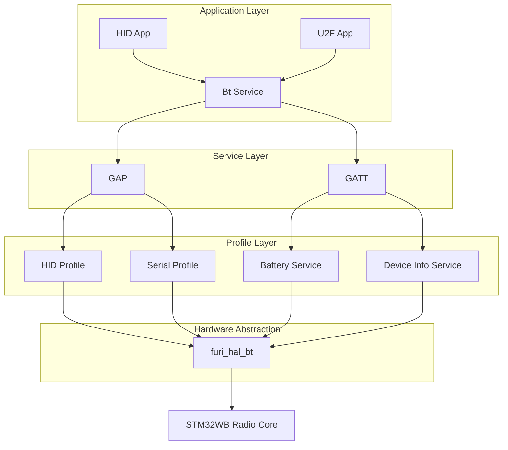
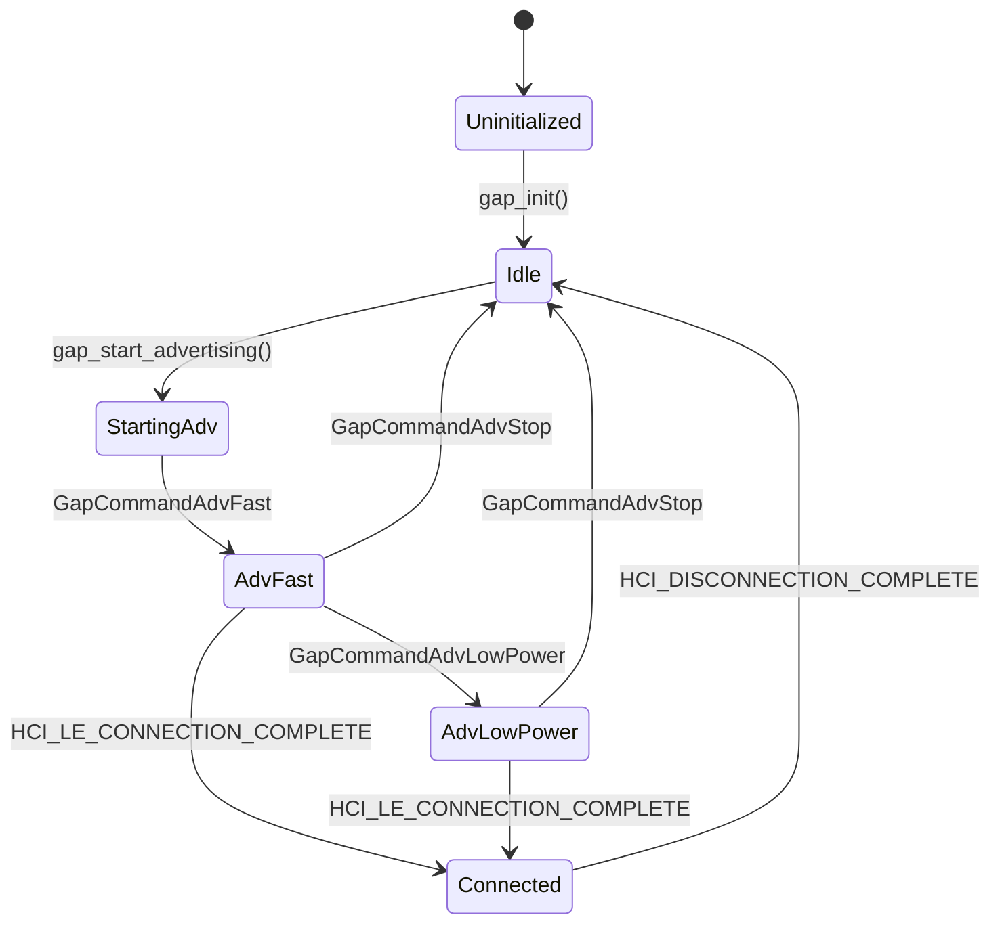
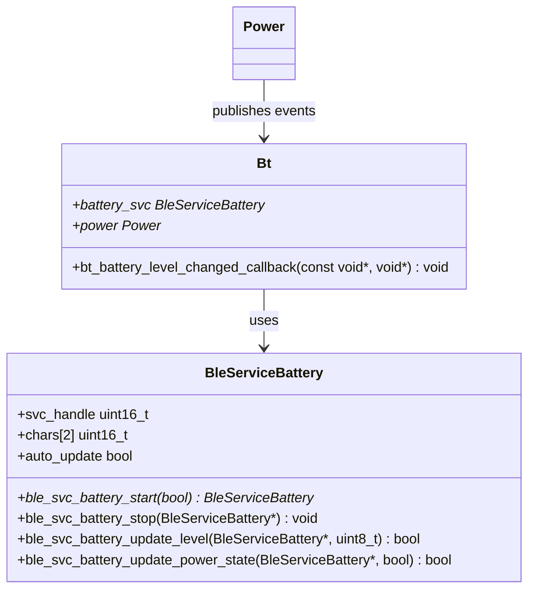
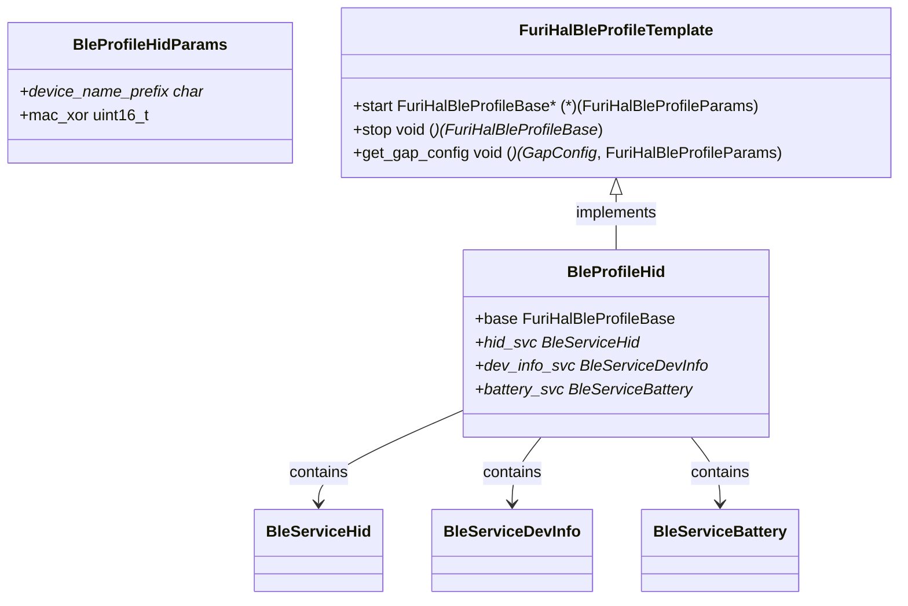
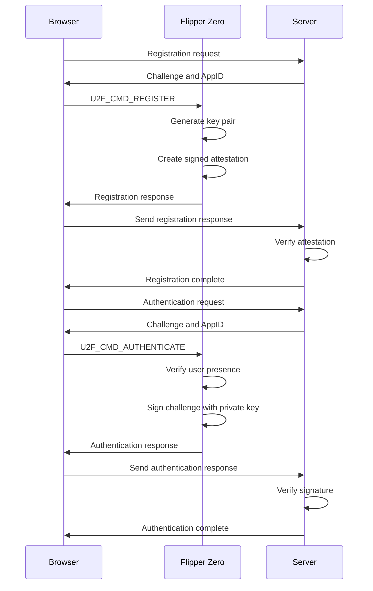
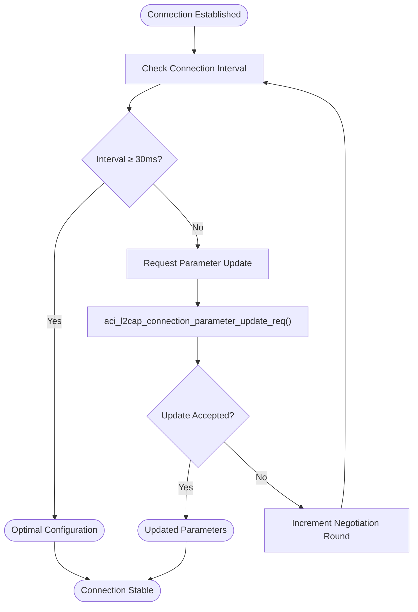
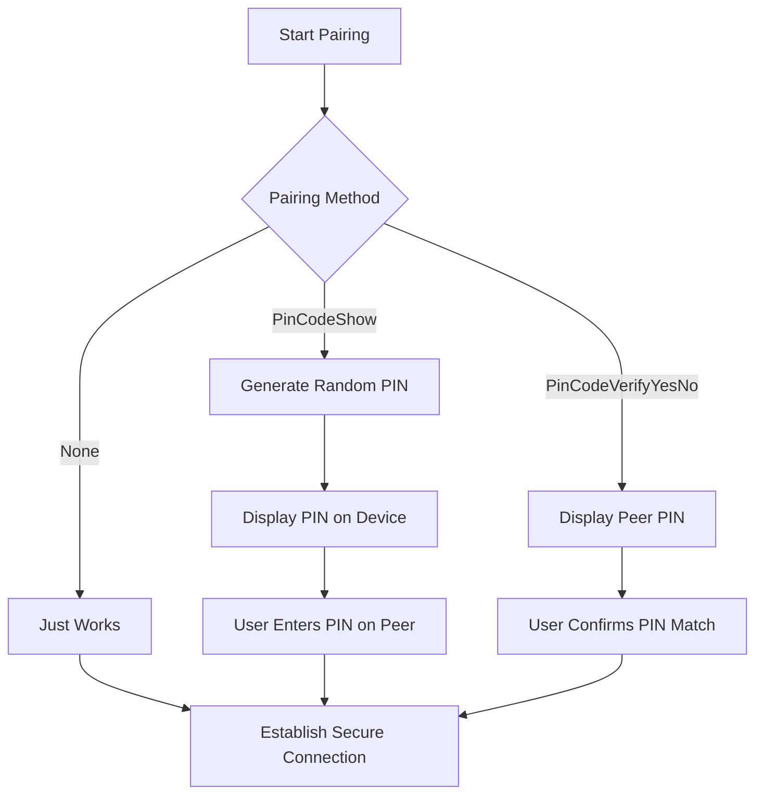

# Bluetooth Protocols

<cite>
**Referenced Files in This Document**   
- [gap.c](file://targets/f7/ble_glue/gap.c)
- [gap.h](file://targets/f7/ble_glue/gap.h)
- [hid.c](file://applications/external/hid_app/hid.c)
- [hid_profile.h](file://lib/ble_profile/extra_profiles/hid_profile.h)
- [bt.c](file://applications/services/bt/bt_service/bt.c)
- [bt_i.h](file://applications/services/bt/bt_service/bt_i.h)
- [serial_profile.c](file://targets/f7/ble_glue/profiles/serial_profile.c)
- [app_conf.h](file://targets/f7/ble_glue/app_conf.h)
- [u2f.c](file://applications/main/u2f/u2f.c)
- [battery_service.c](file://targets/f7/ble_glue/services/battery_service.c)
- [bt_settings_app.h](file://applications/settings/bt_settings_app/bt_settings_app.h)
</cite>

## Table of Contents
1. [Introduction](#introduction)
2. [BLE Stack Architecture](#ble-stack-architecture)
3. [GAP Implementation](#gap-implementation)
4. [GATT Services and Profiles](#gatt-services-and-profiles)
5. [HID Profile Implementation](#hid-profile-implementation)
6. [U2F Security Key Emulation](#u2f-security-key-emulation)
7. [Advertising and Connection Management](#advertising-and-connection-management)
8. [Configuration and Security Options](#configuration-and-security-options)
9. [Performance and Power Considerations](#performance-and-power-considerations)
10. [Troubleshooting Common Issues](#troubleshooting-common-issues)

## Introduction
The Flipper Zero firmware implements a comprehensive Bluetooth Low Energy (BLE) stack that enables the device to emulate various peripheral devices such as keyboards, mice, and U2F security keys. This documentation provides a detailed analysis of the BLE implementation, focusing on the Generic Access Profile (GAP), Generic Attribute Profile (GATT), and specific service implementations. The system is designed to provide flexible peripheral emulation capabilities while maintaining power efficiency and connection reliability.

## BLE Stack Architecture
The Bluetooth implementation in Flipper Zero follows a layered architecture with clear separation between the hardware abstraction layer, protocol stack, and application services. The core components are organized across multiple directories in the firmware structure, with the BLE stack primarily located in the `targets/f7/ble_glue` directory.



**Diagram sources**
- [gap.c](file://targets/f7/ble_glue/gap.c)
- [bt.c](file://applications/services/bt/bt_service/bt.c)
- [hid.c](file://applications/external/hid_app/hid.c)

**Section sources**
- [gap.c](file://targets/f7/ble_glue/gap.c)
- [bt.c](file://applications/services/bt/bt_service/bt.c)

## GAP Implementation
The Generic Access Profile (GAP) implementation in Flipper Zero manages device discovery, advertising, and connection establishment. The core functionality is implemented in `gap.c` and exposed through a well-defined API in `gap.h`.

The GAP layer supports multiple advertising modes with different intervals for power optimization:
- Fast advertising mode: 80-100ms intervals for initial discovery
- Low power advertising mode: 1-2.5s intervals for extended battery life



The connection parameter negotiation process ensures optimal performance by requesting appropriate connection intervals based on the application requirements. The system implements adaptive connection parameter management that adjusts based on the security state and previous negotiation attempts.

**Diagram sources**
- [gap.c](file://targets/f7/ble_glue/gap.c#L430-L482)
- [gap.h](file://targets/f7/ble_glue/gap.h#L42-L49)

**Section sources**
- [gap.c](file://targets/f7/ble_glue/gap.c#L1-L663)
- [gap.h](file://targets/f7/ble_glue/gap.h#L1-L102)

## GATT Services and Profiles
The Generic Attribute Profile (GATT) implementation provides the framework for service and characteristic definition, discovery, and data exchange. The system includes several standard services that can be combined to create composite profiles.

### Standard Services
The following standard GATT services are implemented:

| Service | UUID | Purpose | Source |
|--------|------|-------|--------|
| Battery Service | 0x180F | Reports battery level and charging status | [battery_service.c](file://targets/f7/ble_glue/services/battery_service.c) |
| Device Information Service | 0x180A | Provides device manufacturer, model, and firmware information | [dev_info_service.h](file://targets/f7/ble_glue/services/dev_info_service.h) |
| Serial Service | 0x3080 | Enables RPC communication over BLE | [serial_profile.c](file://targets/f7/ble_glue/profiles/serial_profile.c) |

The Battery Service implementation includes automatic update functionality that subscribes to power state changes and propagates battery level updates to connected clients without requiring explicit application intervention.



**Diagram sources**
- [battery_service.c](file://targets/f7/ble_glue/services/battery_service.c#L81-L114)
- [bt.c](file://applications/services/bt/bt_service/bt.c#L110-L148)

**Section sources**
- [battery_service.c](file://targets/f7/ble_glue/services/battery_service.c)
- [battery_service.h](file://targets/f7/ble_glue/services/battery_service.h)

## HID Profile Implementation
The Human Interface Device (HID) profile implementation enables Flipper Zero to emulate various input devices including keyboards, mice, and media controllers. The HID functionality is primarily implemented in the external HID application.

### HID Profile Architecture
The HID profile is structured as an extension of the base BLE profile system, providing specific functions for different types of input devices:



The HID profile provides a comprehensive API for emulating different input devices:

- Keyboard emulation with support for standard HID keyboard reports
- Mouse movement and button press/release functionality
- Consumer control keys (media playback, volume, etc.)
- Mouse wheel scrolling

**Section sources**
- [hid_profile.h](file://lib/ble_profile/extra_profiles/hid_profile.h#L1-L106)
- [hid.c](file://applications/external/hid_app/hid.c#L1-L374)

## U2F Security Key Emulation
The U2F (Universal 2nd Factor) implementation allows Flipper Zero to function as a security key for two-factor authentication systems. The U2F application is located in the main applications directory and implements the U2F protocol specification.

### U2F Protocol Flow
The U2F authentication process follows a standard cryptographic challenge-response pattern:



The implementation uses ECDSA with the secp256r1 curve for cryptographic operations and includes secure storage for the device private key and counter value to prevent replay attacks.

**Section sources**
- [u2f.c](file://applications/main/u2f/u2f.c#L1-L271)
- [u2f_data.h](file://applications/main/u2f/u2f_data.h#L1-L35)

## Advertising and Connection Management
The advertising and connection management system implements sophisticated strategies for device discovery and connection stability. The configuration options are defined in the application configuration header file.

### Advertising Configuration
The advertising parameters are configured in `app_conf.h` with the following key settings:

```c
#define CFG_TX_POWER (0x19) /* +0dBm */
#define CFG_IDENTITY_ADDRESS GAP_PUBLIC_ADDR
#define CFG_IO_CAPABILITY IO_CAP_DISPLAY_YES_NO
#define CFG_SC_SUPPORT SC_PAIRING_OPTIONAL
#define CFG_BLE_NUM_LINK 2
#define CFG_BLE_NUM_GATT_SERVICES 8
```

The system supports multiple advertising data types:
- Complete local name
- Service UUIDs (16-bit, 32-bit, or 128-bit)
- Manufacturer-specific data
- Appearance characteristic

### Connection Parameter Optimization
The connection parameter negotiation process is designed to balance power consumption and responsiveness:



The system implements a negotiation algorithm that adapts its requests based on previous attempts, starting with more restrictive parameters and relaxing them if the peer device rejects the initial request.

**Section sources**
- [gap.c](file://targets/f7/ble_glue/gap.c#L66-L120)
- [app_conf.h](file://targets/f7/ble_glue/app_conf.h#L1-L49)
- [serial_profile.c](file://targets/f7/ble_glue/profiles/serial_profile.c#L44-L81)

## Configuration and Security Options
The Bluetooth system provides configurable security options to balance convenience and protection. The pairing methods are defined in the GapPairing enumeration:

```c
typedef enum {
    GapPairingNone,
    GapPairingPinCodeShow,
    GapPairingPinCodeVerifyYesNo,
    GapPairingCount,
} GapPairing;
```

### Security Configuration
The security configuration is implemented with the following options:

| Pairing Method | MITM Protection | User Interaction | Use Case |
|---------------|----------------|------------------|---------|
| None ("Just Works") | Not Required | None | iOS devices, trusted environments |
| PinCodeShow | Required | Display 6-digit PIN | Most secure, requires user verification |
| PinCodeVerifyYesNo | Required | Verify displayed PIN | Alternative secure method |

The system also supports bonding to remember trusted devices and automatically reconnect to them without requiring repeated pairing.



**Section sources**
- [gap.h](file://targets/f7/ble_glue/gap.h#L51-L56)
- [gap.c](file://targets/f7/ble_glue/gap.c#L399-L425)

## Performance and Power Considerations
The Bluetooth implementation includes several power optimization strategies to maximize battery life during peripheral emulation scenarios.

### Power Management Strategies
The system employs adaptive advertising to balance discoverability and power consumption:

- Fast advertising mode (80-100ms intervals) for the first 30 seconds after startup
- Low power advertising mode (1-2.5s intervals) after initial discovery period
- Automatic transition between modes based on connection state

The connection interval optimization ensures that the device can enter low-power states when possible while maintaining responsive communication.

### Battery Life Optimization
Key strategies for maximizing battery life include:

1. **Adaptive Advertising**: Reducing advertising frequency after initial discovery
2. **Connection Parameter Optimization**: Negotiating appropriate connection intervals
3. **Sleep Mode Integration**: Coordinating with the system's deep sleep functionality
4. **Event-driven Processing**: Minimizing CPU usage during idle periods

The Battery Service automatically updates connected clients with the current battery level and charging state, allowing host devices to optimize their behavior based on the Flipper Zero's power status.

**Section sources**
- [gap.c](file://targets/f7/ble_glue/gap.c#L14-L15)
- [gap.c](file://targets/f7/ble_glue/gap.c#L437-L443)
- [bt.c](file://applications/services/bt/bt_service/bt.c#L110-L136)

## Troubleshooting Common Issues
This section addresses common issues encountered with Bluetooth peripheral emulation and provides solutions based on the implementation details.

### Connection Stability Issues
Common causes and solutions:

1. **Intermittent Connections**
   - Cause: Incompatible connection parameters
   - Solution: Implement adaptive connection parameter negotiation as shown in the gap_verify_connection_parameters function

2. **Device Discovery Problems**
   - Cause: Insufficient advertising power or intervals
   - Solution: Ensure advertising is properly configured with appropriate intervals and TX power

3. **Pairing Failures**
   - Cause: Incompatible security capabilities between devices
   - Solution: Implement fallback pairing methods and verify IO capabilities

### Power Consumption Optimization
Strategies for reducing power consumption:

1. **Optimize Advertising Intervals**: Use adaptive advertising that starts with fast intervals and transitions to low-power mode
2. **Minimize Connection Interval**: Negotiate the longest acceptable connection interval for the use case
3. **Leverage Slave Latency**: Allow the peripheral to skip connection events when no data is pending
4. **Implement Proper Sleep States**: Ensure the radio and processor enter low-power states during idle periods

The system's implementation of connection parameter verification and adaptive advertising provides a solid foundation for addressing these common issues while maintaining reliable operation.

**Section sources**
- [gap.c](file://targets/f7/ble_glue/gap.c#L66-L120)
- [gap.c](file://targets/f7/ble_glue/gap.c#L430-L482)
- [bt.c](file://applications/services/bt/bt_service/bt.c#L110-L136)