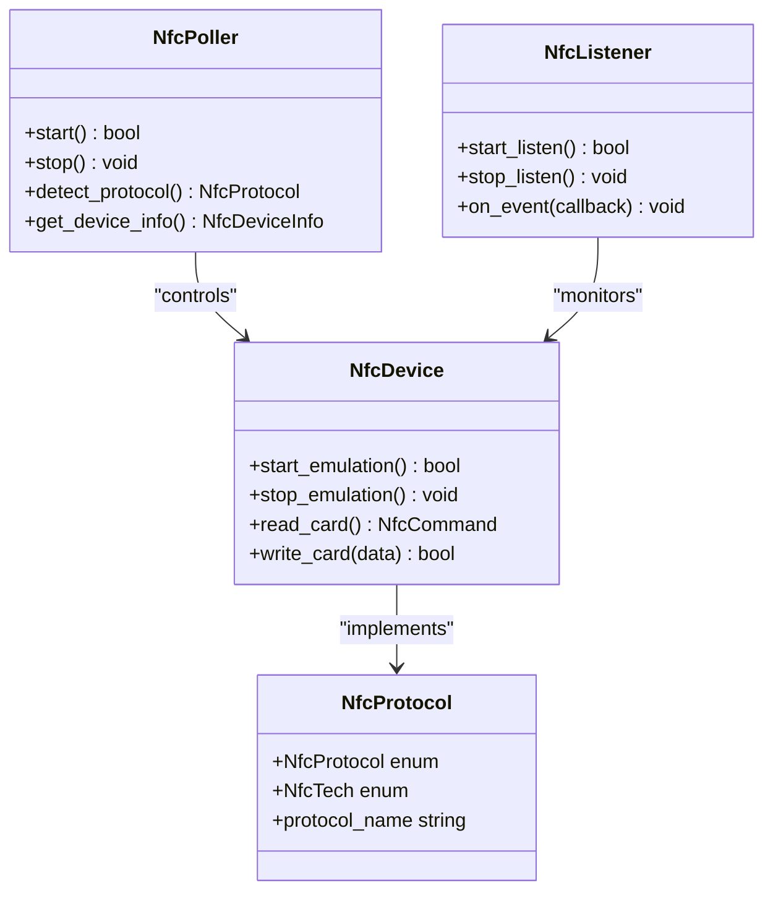
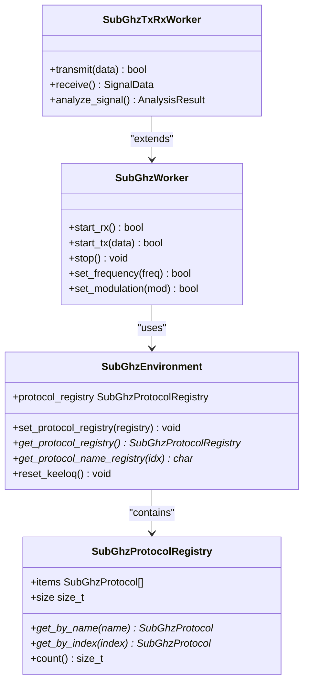
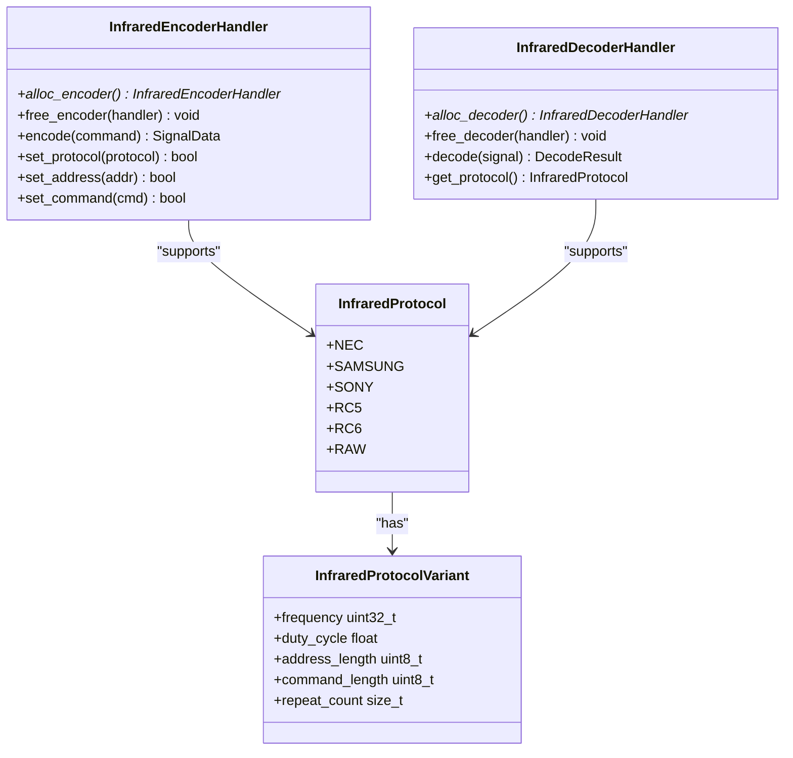
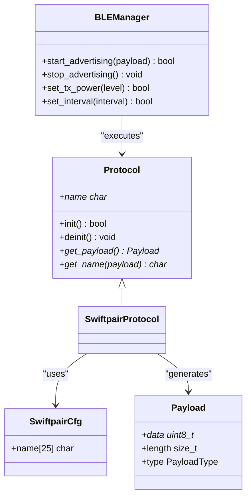
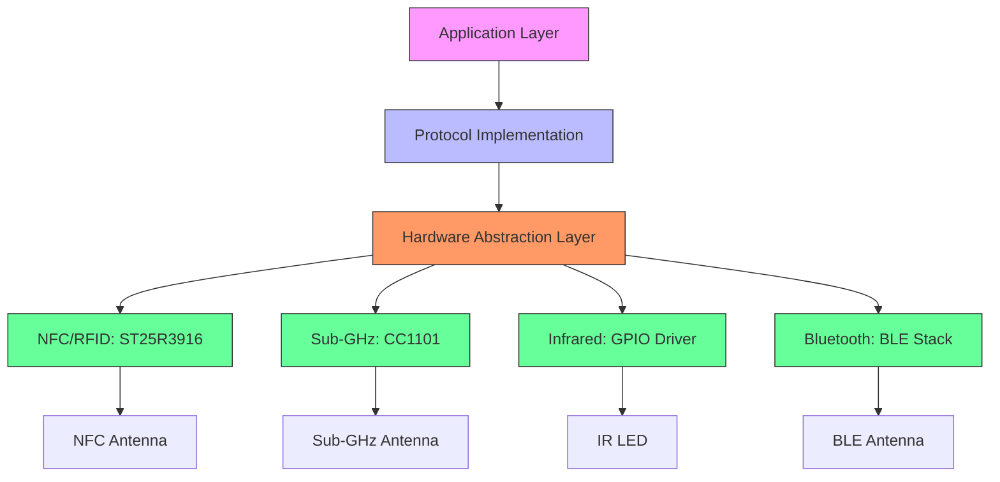
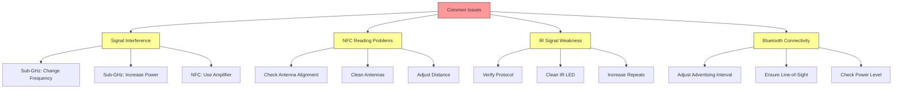
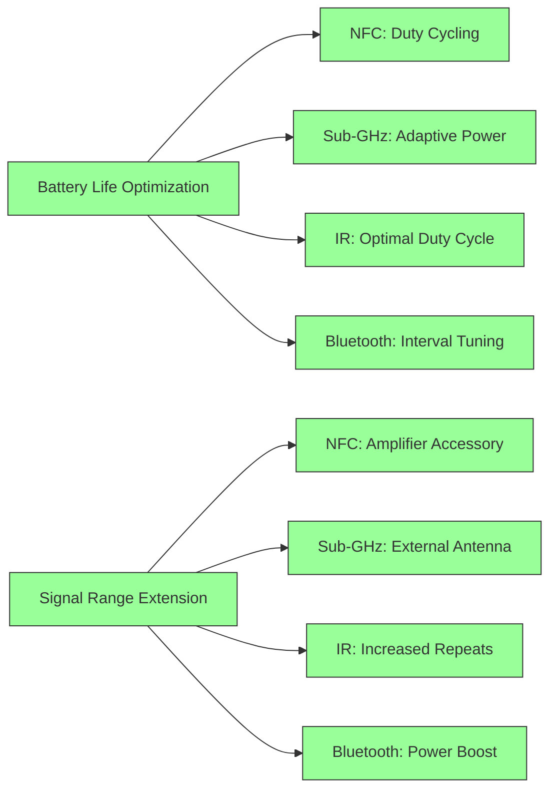
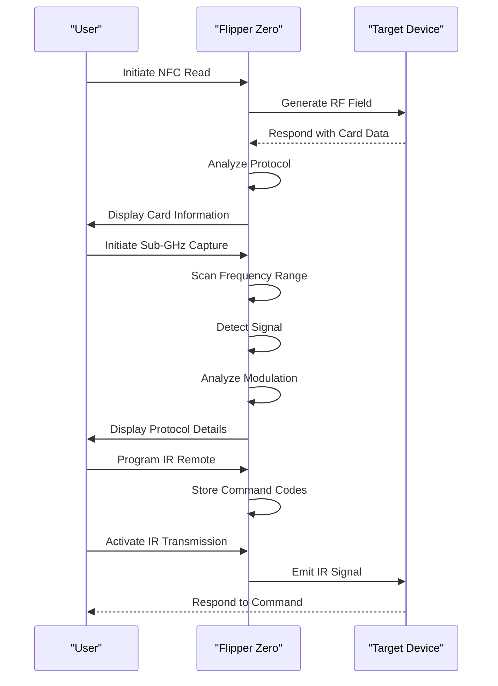

# Communication Protocols

<cite>
**Referenced Files in This Document**   
- [nfc_protocol.h](file://lib/nfc/protocols/nfc_protocol.h)
- [iso15693_3.h](file://applications/main/nfc/helpers/protocol_support/iso15693_3/iso15693_3.h)
- [registry.h](file://lib/subghz/registry.h)
- [environment.h](file://lib/subghz/environment.h)
- [infrared.h](file://lib/infrared/encoder_decoder/infrared.h)
- [infrared.c](file://lib/infrared/encoder_decoder/infrared.c)
- [swiftpair.h](file://applications/external/ble_spam/protocols/swiftpair.h)
- [swiftpair.c](file://applications/external/ble_spam/protocols/swiftpair.c)
- [furi_hal_nfc.h](file://targets/furi_hal_include/furi_hal_nfc.h)
- [furi_hal_subghz.h](file://targets/f7/furi_hal/furi_hal_subghz.h)
- [furi_hal_infrared.h](file://targets/furi_hal_include/furi_hal_infrared.h)
- [st25r3916.h](file://lib/drivers/st25r3916.h)
- [cc1101.h](file://lib/drivers/cc1101.h)
</cite>

## Table of Contents
1. [Introduction](#introduction)
2. [NFC/RFID Protocol Implementation](#nfcrfid-protocol-implementation)
3. [Sub-GHz Protocol Architecture](#sub-ghz-protocol-architecture)
4. [Infrared Communication System](#infrared-communication-system)
5. [Bluetooth Protocol Support](#bluetooth-protocol-support)
6. [Hardware Interface Architecture](#hardware-interface-architecture)
7. [Protocol Configuration and Transmission Parameters](#protocol-configuration-and-transmission-parameters)
8. [Common Issues and Solutions](#common-issues-and-solutions)
9. [Performance Considerations](#performance-considerations)
10. [Practical Use Cases](#practical-use-cases)

## Introduction
The Flipper Zero is a versatile multi-tool device with comprehensive wireless communication capabilities. This document details the implementation and architecture of its four primary wireless protocols: NFC/RFID, Sub-GHz, Infrared, and Bluetooth. Each protocol is implemented with a modular architecture that allows for extensibility and efficient hardware interfacing. The system is designed to support both reading and emulating various wireless communication standards, making it a powerful tool for security research, access control analysis, and IoT device interaction.

## NFC/RFID Protocol Implementation

The NFC/RFID subsystem in Flipper Zero is designed with a hierarchical architecture that supports multiple NFC technologies and protocols. The implementation is organized around the NfcTech enumeration which defines supported NFC technologies, and the NfcProtocol enumeration which identifies specific protocol implementations.

The protocol architecture follows a parent-child relationship model where base protocols can serve as foundations for more specialized child protocols. This design allows for code reuse and consistent implementation patterns across different NFC standards. The system supports various NFC technologies including ISO15693, with specific implementations like ISO15693-3 providing extended functionality.

Protocol implementations are structured in a dedicated directory hierarchy that separates core functionality from specific protocol variants. Each protocol typically includes header files defining the interface and constants, along with implementation files containing the encoding, decoding, and communication logic.

**Diagram sources**
- [nfc_protocol.h](file://lib/nfc/protocols/nfc_protocol.h#L1-L38)
- [iso15693_3.h](file://applications/main/nfc/helpers/protocol_support/iso15693_3/iso15693_3.h#L1-L5)

**Section sources**
- [nfc_protocol.h](file://lib/nfc/protocols/nfc_protocol.h#L1-L38)
- [iso15693_3.h](file://applications/main/nfc/helpers/protocol_support/iso15693_3/iso15693_3.h#L1-L5)

## Sub-GHz Protocol Architecture

The Sub-GHz communication system in Flipper Zero employs a registry-based architecture that allows dynamic registration and management of various wireless protocols operating in the sub-gigahertz frequency range. The core of this system is the SubGhzProtocolRegistry structure, which maintains a collection of supported protocols and provides lookup functionality by name or index.

Each protocol implementation follows a consistent interface defined by the SubGhzProtocol structure, ensuring uniform access patterns across different modulation schemes and encoding methods. The environment subsystem manages protocol selection and configuration, with functions to set and retrieve the active protocol registry.

The architecture supports a wide range of modulation techniques including ASK/OOK and FSK, with configurable parameters for frequency, bandwidth, and data encoding. Protocol implementations are designed to be extensible, allowing new wireless standards to be added through the registration system without modifying core communication code.

**Diagram sources**
- [registry.h](file://lib/subghz/registry.h#L1-L48)
- [environment.h](file://lib/subghz/environment.h#L91-L124)

**Section sources**
- [registry.h](file://lib/subghz/registry.h#L1-L48)
- [environment.h](file://lib/subghz/environment.h#L91-L124)

## Infrared Communication System

The infrared communication subsystem in Flipper Zero provides comprehensive support for various IR protocols used in consumer electronics and industrial control systems. The implementation is centered around the InfraredProtocol enumeration which defines supported protocol types, with functions to query protocol-specific parameters.

Key protocol characteristics such as frequency, duty cycle, address length, and command length are stored in protocol variant structures and accessed through dedicated getter functions. The system supports common IR modulation frequencies including 36kHz, 38kHz, 40kHz, and 56kHz, with configurable duty cycles typically ranging from 30% to 50%.

The architecture includes separate encoder and decoder handlers that manage signal generation and analysis. Each protocol implementation specifies the minimum number of signal repeats required for reliable transmission, accounting for the inherent variability in IR receiver sensitivity.

**Diagram sources**
- [infrared.h](file://lib/infrared/encoder_decoder/infrared.h#L109-L219)
- [infrared.c](file://lib/infrared/encoder_decoder/infrared.c#L337-L355)

**Section sources**
- [infrared.h](file://lib/infrared/encoder_decoder/infrared.h#L109-L219)
- [infrared.c](file://lib/infrared/encoder_decoder/infrared.c#L337-L355)

## Bluetooth Protocol Support

The Bluetooth capabilities in Flipper Zero are implemented through external application modules that extend the device's functionality to include Bluetooth Low Energy (BLE) communication. The architecture follows a plugin-based model where specific Bluetooth protocols are implemented as separate modules.

One example is the SwiftPair protocol implementation, which demonstrates the pattern for adding new Bluetooth functionality. Protocol implementations include configuration structures that define parameters such as device name and advertising data, with a consistent interface for payload generation and transmission.

The system leverages the underlying BLE stack to handle connection management, advertising, and data transmission, while application-level protocols define the specific data formats and interaction patterns. This separation allows for rapid development of new Bluetooth applications without modifying the core communication infrastructure.

**Diagram sources**
- [swiftpair.h](file://applications/external/ble_spam/protocols/swiftpair.h#L1-L11)
- [swiftpair.c](file://applications/external/ble_spam/protocols/swiftpair.c#L1-L16)

**Section sources**
- [swiftpair.h](file://applications/external/ble_spam/protocols/swiftpair.h#L1-L11)
- [swiftpair.c](file://applications/external/ble_spam/protocols/swiftpair.c#L1-L16)

## Hardware Interface Architecture

The wireless communication protocols in Flipper Zero interface with hardware through a layered architecture that abstracts physical layer details while providing efficient access to radio peripherals. The system uses dedicated hardware components for each communication domain, with the ST25R3916 chip handling NFC/RFID operations and the CC1101 transceiver managing Sub-GHz communications.

The hardware abstraction layer (HAL) provides a consistent interface for protocol implementations, hiding low-level register manipulation and timing requirements. For NFC/RFID, the furi_hal_nfc module manages the ST25R3916 driver, handling tasks such as field generation, modulation, and demodulation. The Sub-GHz system uses furi_hal_subghz to control the CC1101 transceiver, configuring frequency, modulation type, and output power.

Infrared communication is handled through direct GPIO control with precise timing, using the furi_hal_infrared module to manage the IR LED driver circuit. The HAL ensures proper signal timing and duty cycle control to maintain compatibility with various IR receiver types.

**Diagram sources**
- [furi_hal_nfc.h](file://targets/furi_hal_include/furi_hal_nfc.h)
- [furi_hal_subghz.h](file://targets/f7/furi_hal/furi_hal_subghz.h)
- [furi_hal_infrared.h](file://targets/furi_hal_include/furi_hal_infrared.h)
- [st25r3916.h](file://lib/drivers/st25r3916.h)
- [cc1101.h](file://lib/drivers/cc1101.h)

**Section sources**
- [furi_hal_nfc.h](file://targets/furi_hal_include/furi_hal_nfc.h)
- [furi_hal_subghz.h](file://targets/f7/furi_hal/furi_hal_subghz.h)
- [furi_hal_infrared.h](file://targets/furi_hal_include/furi_hal_infrared.h)
- [st25r3916.h](file://lib/drivers/st25r3916.h)
- [cc1101.h](file://lib/drivers/cc1101.h)

## Protocol Configuration and Transmission Parameters

Each wireless protocol in Flipper Zero supports configurable transmission parameters that can be adjusted to optimize performance for specific use cases. These parameters include frequency settings, modulation schemes, data encoding methods, and transmission power levels.

For Sub-GHz communications, users can configure the operating frequency within regulatory limits, select between ASK/OOK and FSK modulation, and adjust data encoding parameters such as pulse width and gap timing. The system supports frequency ranges from 300MHz to 930MHz, with channel spacing typically set to 25-50kHz depending on the protocol.

NFC/RFID parameters include field strength control, data rate selection (106kbps, 212kbps, 424kbps), and modulation index adjustment. Infrared settings allow configuration of carrier frequency (36-56kHz), duty cycle (30-50%), and repeat count (1-50 times). Bluetooth parameters include advertising interval, TX power level (-30dBm to +10dBm), and connection parameters.

```mermaid
flowchart TD
Start([Configure Protocol]) --> SelectProtocol["Select Protocol Type"]
SelectProtocol --> NFC{"NFC/RFID?"}
SelectProtocol --> SubGHz{"Sub-GHz?"}
SelectProtocol --> IR{"Infrared?"}
SelectProtocol --> BT{"Bluetooth?"}
NFC --> NFCFreq["Set Frequency: 13.56MHz"]
NFC --> NFCDataRate["Set Data Rate: 106/212/424kbps"]
NFC --> NFCModulation["Set Modulation Index"]
NFC --> NFCTxPower["Set Field Strength"]
SubGHz --> SubGHzFreq["Set Frequency: 300-930MHz"]
SubGHz --> SubGHzMod["Set Modulation: ASK/FSK"]
SubGHz --> SubGHzEncoding["Set Encoding: PWM/Manchester"]
SubGHz --> SubGHzBandwidth["Set Bandwidth"]
SubGHz --> SubGHzTxPower["Set Output Power"]
IR --> IRFreq["Set Carrier: 36-56kHz"]
IR --> IRDuty["Set Duty Cycle: 30-50%"]
IR --> IRRepeat["Set Repeat Count: 1-50"]
IR --> IRProtocol["Select Protocol"]
BT --> BTInterval["Set Advertising Interval"]
BT --> BTTxPower["Set TX Power: -30 to +10dBm"]
BT --> BTName["Set Device Name"]
BT --> BTService["Select Service UUID"]
NFCFreq --> End([Parameters Set])
NFCDataRate --> End
NFCModulation --> End
NFCTxPower --> End
SubGHzFreq --> End
SubGHzMod --> End
SubGHzEncoding --> End
SubGHzBandwidth --> End
SubGHzTxPower --> End
IRFreq --> End
IRDuty --> End
IRRepeat --> End
IRProtocol --> End
BTInterval --> End
BTTxPower --> End
BTName --> End
BTService --> End
```

**Section sources**
- [registry.h](file://lib/subghz/registry.h)
- [environment.h](file://lib/subghz/environment.h)
- [infrared.h](file://lib/infrared/encoder_decoder/infrared.h)
- [furi_hal_nfc.h](file://targets/furi_hal_include/furi_hal_nfc.h)
- [furi_hal_subghz.h](file://targets/f7/furi_hal/furi_hal_subghz.h)

## Common Issues and Solutions

Users of Flipper Zero may encounter several common issues when working with wireless protocols. Signal interference is a frequent challenge, particularly in environments with multiple RF sources. For Sub-GHz communications, interference can be mitigated by selecting less congested frequencies, using frequency hopping techniques, or increasing transmission power within regulatory limits.

NFC/RFID reading issues often stem from misalignment between the Flipper Zero antenna and the target card. Solutions include ensuring proper positioning, cleaning both antennas, and adjusting the reading distance. For cards with weak signals, using the NFC amplifier accessory can improve detection reliability.

Infrared communication problems typically involve incorrect protocol selection or insufficient signal strength. Users should verify the target device's protocol specification and ensure the IR LED is clean and unobstructed. Increasing the repeat count can improve reliability for distant targets.

Bluetooth connectivity issues may arise from advertising interval conflicts or signal attenuation. Adjusting the advertising interval to avoid conflicts with other devices and ensuring clear line-of-sight can resolve most connection problems.

**Section sources**
- [furi_hal_nfc.h](file://targets/furi_hal_include/furi_hal_nfc.h)
- [furi_hal_subghz.h](file://targets/f7/furi_hal/furi_hal_subghz.h)
- [furi_hal_infrared.h](file://targets/furi_hal_include/furi_hal_infrared.h)

## Performance Considerations

Optimizing battery life and signal range is crucial for portable operation of Flipper Zero. The device employs several power management strategies across its wireless protocols. For NFC/RFID operations, the system uses duty cycling to minimize power consumption during polling, activating the RF field only when needed for communication.

Sub-GHz transmissions are optimized through adaptive power control, using the minimum necessary output power for reliable communication. The system also supports sleep modes between transmissions, particularly in scanning and monitoring applications.

Infrared communication efficiency is maximized by optimizing the duty cycle and using the minimum required repeat count. The system automatically adjusts these parameters based on protocol requirements and user settings.

Signal range extension techniques include antenna optimization, with external antenna options available for Sub-GHz communications. For NFC, using the amplifier accessory can significantly increase read range. The system also supports signal boosting through repeated transmissions and error correction coding where applicable.

**Section sources**
- [furi_hal_nfc.h](file://targets/furi_hal_include/furi_hal_nfc.h)
- [furi_hal_subghz.h](file://targets/f7/furi_hal/furi_hal_subghz.h)
- [furi_hal_infrared.h](file://targets/furi_hal_include/furi_hal_infrared.h)
- [environment.h](file://lib/subghz/environment.h)

## Practical Use Cases

The wireless protocols in Flipper Zero enable various practical applications across security research, home automation, and device testing. NFC/RFID cloning allows users to duplicate access cards for authorized use, following a process of reading the original card, analyzing its data structure, and programming a blank card with the same information.

Sub-GHz signal analysis is valuable for reverse engineering wireless devices such as garage door openers, weather stations, and IoT sensors. The process involves capturing signals, analyzing modulation characteristics, and creating protocol definitions for emulation.

Infrared remote control emulation enables users to consolidate multiple remotes into a single device. By capturing and analyzing IR signals from existing remotes, users can program Flipper Zero to replicate their functionality.

Bluetooth applications include device spoofing for testing security systems and creating custom advertising beacons for proximity-based services.

**Section sources**
- [nfc_protocol.h](file://lib/nfc/protocols/nfc_protocol.h)
- [registry.h](file://lib/subghz/registry.h)
- [infrared.h](file://lib/infrared/encoder_decoder/infrared.h)