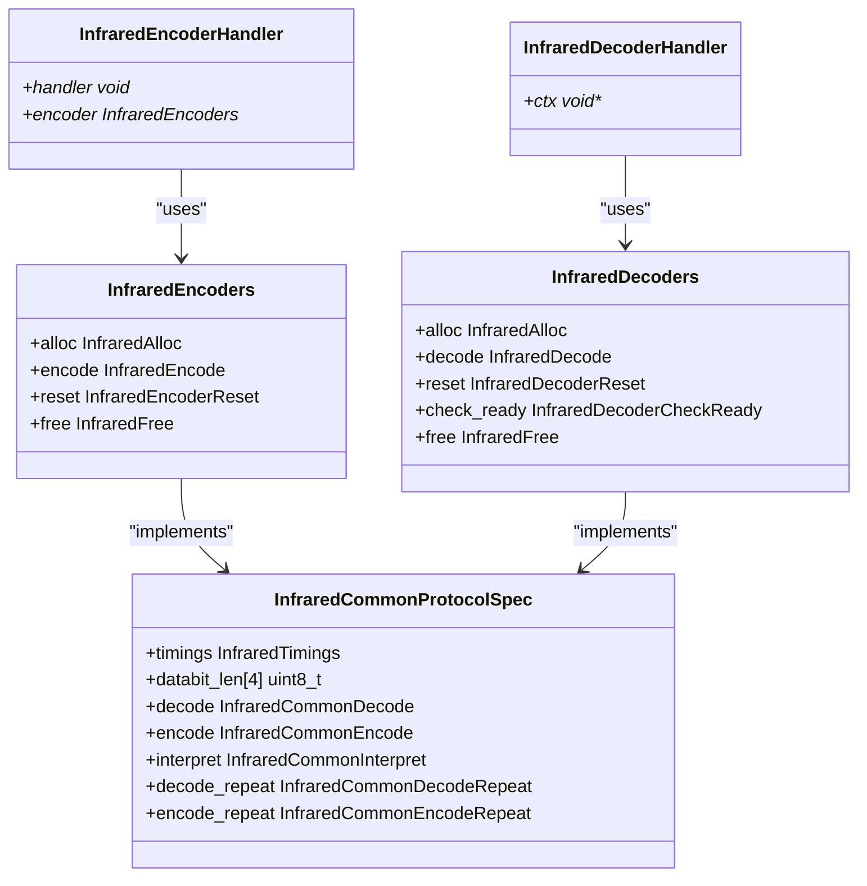
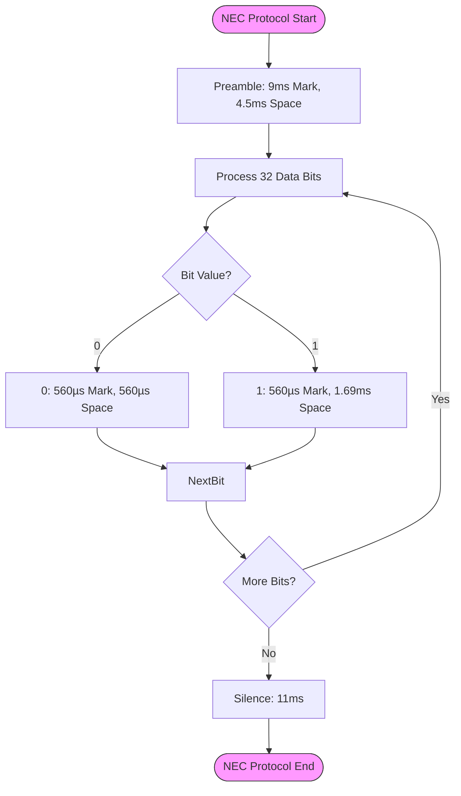
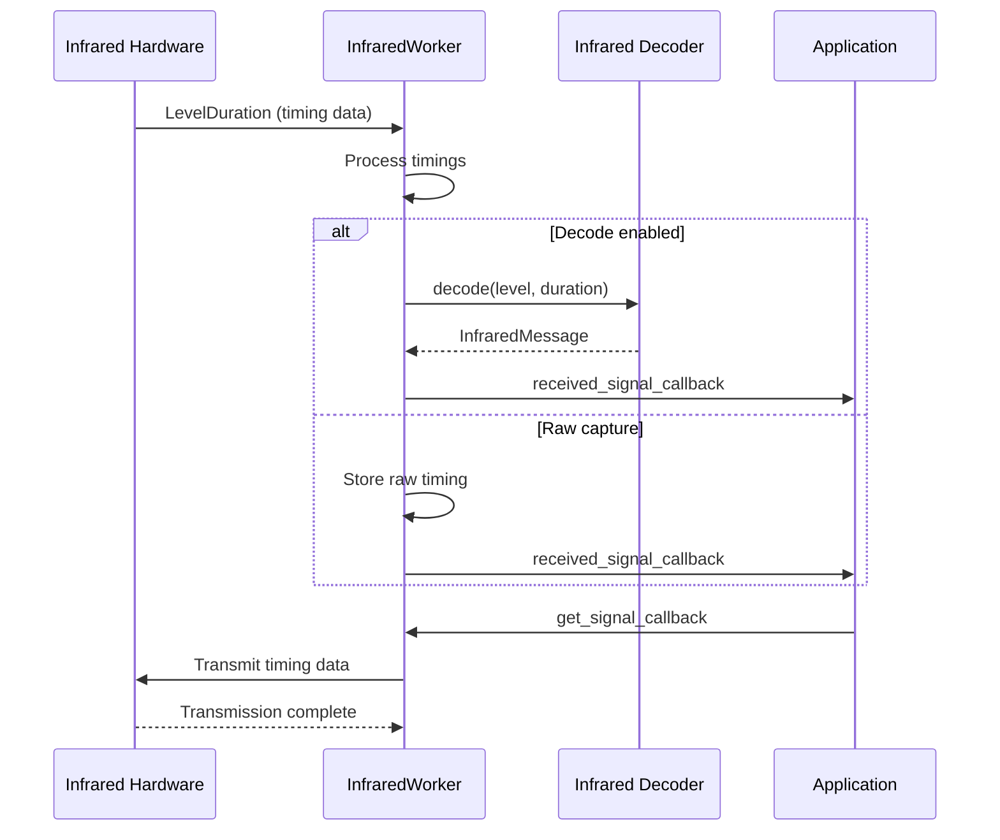

# Infrared Protocols

<cite>
**Referenced Files in This Document**   
- [infrared_protocol_nec.c](file://lib/infrared/encoder_decoder/nec/infrared_protocol_nec.c)
- [infrared_protocol_sirc.c](file://lib/infrared/encoder_decoder/sirc/infrared_protocol_sirc.c)
- [infrared_protocol_rc5.c](file://lib/infrared/encoder_decoder/rc5/infrared_protocol_rc5.c)
- [infrared_protocol_rc6.c](file://lib/infrared/encoder_decoder/rc6/infrared_protocol_rc6.c)
- [infrared_protocol_samsung.c](file://lib/infrared/encoder_decoder/samsung/infrared_protocol_samsung.c)
- [infrared_protocol_kaseikyo.c](file://lib/infrared/encoder_decoder/kaseikyo/infrared_protocol_kaseikyo.c)
- [infrared_protocol_rca.c](file://lib/infrared/encoder_decoder/rca/infrared_protocol_rca.c)
- [infrared.c](file://lib/infrared/encoder_decoder/infrared.c)
- [infrared_worker.c](file://lib/infrared/worker/infrared_worker.c)
- [infrared.h](file://lib/infrared/encoder_decoder/infrared.h)
- [infrared_i.h](file://lib/infrared/encoder_decoder/infrared_i.h)
- [infrared_common_i.h](file://lib/infrared/encoder_decoder/common/infrared_common_i.h)
- [infrared_protocol_nec_i.h](file://lib/infrared/encoder_decoder/nec/infrared_protocol_nec_i.h)
- [infrared_protocol_samsung_i.h](file://lib/infrared/encoder_decoder/samsung/infrared_protocol_samsung_i.h)
- [infrared_protocol_rc5_i.h](file://lib/infrared/encoder_decoder/rc5/infrared_protocol_rc5_i.h)
- [infrared_protocol_rc6_i.h](file://lib/infrared/encoder_decoder/rc6/infrared_protocol_rc6_i.h)
- [infrared_protocol_sirc.h](file://lib/infrared/encoder_decoder/sirc/infrared_protocol_sirc.h)
- [InfraredCaptures.md](file://documentation/InfraredCaptures.md)
</cite>

## Table of Contents
1. [Introduction](#introduction)
2. [Infrared Signal Fundamentals](#infrared-signal-fundamentals)
3. [Encoder-Decoder Framework Architecture](#encoder-decoder-framework-architecture)
4. [Protocol-Specific Implementations](#protocol-specific-implementations)
   - [NEC Protocol](#nec-protocol)
   - [Sony SIRC Protocol](#sony-sirc-protocol)
   - [RC5 and RC6 Protocols](#rc5-and-rc6-protocols)
   - [Samsung Protocol](#samsung-protocol)
   - [Kaseikyo and RCA Protocols](#kaseikyo-and-rca-protocols)
5. [Signal Processing and Timing Parameters](#signal-processing-and-timing-parameters)
6. [Hardware Integration and Signal Capture](#hardware-integration-and-signal-capture)
7. [Configuration and Detection Algorithms](#configuration-and-detection-algorithms)
8. [Performance Considerations](#performance-considerations)
9. [Troubleshooting Common Issues](#troubleshooting-common-issues)
10. [Conclusion](#conclusion)

## Introduction

The Flipper Zero infrared subsystem provides a comprehensive framework for generating, decoding, and transmitting infrared signals across multiple protocols. This document details the implementation of IR signal generation and decoding, focusing on carrier frequencies, modulation techniques, and protocol-specific timing parameters. The system supports major infrared protocols including NEC, Samsung, RC5, RC6, and Sony SIRC, each with their unique start pulses, bit encoding schemes, and repeat codes. The architecture is designed to handle both decoded protocol messages and raw signal captures, providing flexibility for various use cases from universal remote functionality to signal analysis and replay.

**Section sources**
- [infrared.c](file://lib/infrared/encoder_decoder/infrared.c#L1-L148)
- [infrared_worker.c](file://lib/infrared/worker/infrared_worker.c#L136-L412)

## Infrared Signal Fundamentals

Infrared communication relies on modulated light signals in the 36-40kHz range to transmit data between devices. The Flipper Zero infrared system implements carrier frequencies within this standard range, with specific protocols using different frequencies: NEC and Samsung protocols typically use 38kHz, RC5 and RC6 use 36kHz, and Pioneer uses 40kHz. The system employs two primary modulation techniques: pulse distance modulation (PDM) and pulse width modulation (PWM), with some protocols using Manchester encoding.

The infrared signal structure consists of a preamble followed by data bits and a silence period. The preamble, typically a long mark (carrier on) followed by a space (carrier off), serves to synchronize the receiver. Data bits are encoded using specific timing patterns where the duration of the mark and space represents binary values. For example, in pulse distance modulation, the mark duration remains constant while the space duration varies to represent 1s and 0s, whereas in pulse width modulation, the space duration remains constant while the mark duration varies.

The system handles signal gaps and silence periods to distinguish between complete messages and repeated transmissions. The minimum split time parameter determines when a signal should be considered as a new transmission rather than a continuation of the previous one. This is crucial for accurately capturing and replaying infrared commands, especially for protocols that send repeated signals when a button is held down.

**Section sources**
- [infrared_protocol_nec_i.h](file://lib/infrared/encoder_decoder/nec/infrared_protocol_nec_i.h#L5-L20)
- [infrared_protocol_rc5_i.h](file://lib/infrared/encoder_decoder/rc5/infrared_protocol_rc5_i.h#L5-L16)
- [infrared_protocol_rc6_i.h](file://lib/infrared/encoder_decoder/rc6/infrared_protocol_rc6_i.h#L5-L16)
- [infrared_protocol_samsung_i.h](file://lib/infrared/encoder_decoder/samsung/infrared_protocol_samsung_i.h#L5-L26)

## Encoder-Decoder Framework Architecture

The infrared subsystem employs a modular encoder-decoder framework that provides a consistent interface for handling multiple protocols. The architecture is implemented through a set of function pointers and protocol specifications that allow the system to dynamically switch between different infrared protocols. At the core of this framework are the `InfraredEncoders` and `InfraredDecoders` structures, which define the allocation, encoding/decoding, reset, and free functions for each protocol.

**Diagram sources**
- [infrared.c](file://lib/infrared/encoder_decoder/infrared.c#L17-L30)
- [infrared_i.h](file://lib/infrared/encoder_decoder/infrared_i.h#L30-L39)

The framework uses a registration pattern where each protocol implementation registers its encoder and decoder functions in a global array. This allows the system to support multiple protocols without requiring changes to the core infrared handling code. When a specific protocol is selected, the corresponding encoder or decoder is instantiated through the allocation function, and subsequent operations use the function pointers defined in the protocol's encoder or decoder structure.

The common protocol specification structure (`InfraredCommonProtocolSpec`) contains timing parameters, data bit lengths, and function pointers for encoding, decoding, and repeat handling. This structure serves as the foundation for all protocol implementations, ensuring consistency in how timing tolerances, preamble detection, and bit encoding are handled across different protocols.

**Section sources**
- [infrared.c](file://lib/infrared/encoder_decoder/infrared.c#L17-L148)
- [infrared_i.h](file://lib/infrared/encoder_decoder/infrared_i.h#L6-L48)
- [infrared_common_i.h](file://lib/infrared/encoder_decoder/common/infrared_common_i.h#L18-L27)

## Protocol-Specific Implementations

### NEC Protocol

The NEC protocol implementation follows the standard 38kHz carrier frequency with a 33% duty cycle. The protocol uses pulse distance modulation with a 9ms preamble mark followed by a 4.5ms space. Data bits are encoded with a 560µs mark followed by either a 1.69ms space for a logical 1 or a 560µs space for a logical 0. The NEC protocol transmits 32 bits of data consisting of 8 bits of address, 8 bits of address inverse, 8 bits of command, and 8 bits of command inverse for error checking.

**Diagram sources**
- [infrared_protocol_nec.c](file://lib/infrared/encoder_decoder/nec/infrared_protocol_nec.c#L3-L23)
- [infrared_protocol_nec_i.h](file://lib/infrared/encoder_decoder/nec/infrared_protocol_nec_i.h#L5-L20)

The NEC protocol supports extended variants (NECext, NEC42, NEC42ext) with different address and command bit lengths. The repeat code for NEC consists of a 9ms mark followed by a 2.25ms space, with a minimum silence period of 4ms between repeats. The implementation includes tolerance values of ±200µs for preamble detection and ±120µs for bit timing to accommodate variations in signal transmission and reception.

**Section sources**
- [infrared_protocol_nec.c](file://lib/infrared/encoder_decoder/nec/infrared_protocol_nec.c#L3-L74)
- [infrared_protocol_nec_i.h](file://lib/infrared/encoder_decoder/nec/infrared_protocol_nec_i.h#L5-L30)

### Sony SIRC Protocol

The Sony SIRC protocol uses a 40kHz carrier frequency with a 33% duty cycle and employs pulse width modulation. The protocol features a 2.4ms preamble mark followed by a 600µs space. Data bits are encoded with a 600µs space followed by either a 600µs mark for a logical 0 or a 1.2ms mark for a logical 1. SIRC supports three variants: SIRC (12 bits), SIRC15 (15 bits), and SIRC20 (20 bits), with varying address and command bit lengths.

The SIRC protocol does not have a dedicated repeat code; instead, the entire message is retransmitted when a button is held down. The implementation handles this by detecting the silence period between messages and treating each complete transmission as a separate command. The minimum silence time is set to 45ms to distinguish between repeated transmissions and new commands.

**Section sources**
- [infrared_protocol_sirc.c](file://lib/infrared/encoder_decoder/sirc/infrared_protocol_sirc.c#L3-L63)
- [infrared_protocol_sirc.h](file://lib/infrared/encoder_decoder/sirc/infrared_protocol_sirc.h#L5-L24)

### RC5 and RC6 Protocols

The RC5 and RC6 protocols use Manchester encoding with a 36kHz carrier frequency. RC5 employs a differential Manchester encoding scheme where each bit period is divided into two halves, with a transition at the midpoint. A logical 0 is represented by a high-to-low transition, while a logical 1 is represented by a low-to-high transition. The protocol has no preamble; instead, it uses two start bits followed by a toggle bit that changes state with each new button press.

RC6 is an extension of RC5 that adds a mode bit and uses a modified Manchester encoding scheme. It includes a 2.666ms preamble mark followed by an 889µs space. The encoding uses a 444µs bit period with transitions at the bit boundaries. RC6 supports various modes with different command bit lengths, allowing for more complex command structures.

**Section sources**
- [infrared_protocol_rc5.c](file://lib/infrared/encoder_decoder/rc5/infrared_protocol_rc5.c#L3-L50)
- [infrared_protocol_rc5_i.h](file://lib/infrared/encoder_decoder/rc5/infrared_protocol_rc5_i.h#L5-L21)
- [infrared_protocol_rc6.c](file://lib/infrared/encoder_decoder/rc6/infrared_protocol_rc6.c#L3-L40)
- [infrared_protocol_rc6_i.h](file://lib/infrared/encoder_decoder/rc6/infrared_protocol_rc6_i.h#L5-L29)

### Samsung Protocol

The Samsung protocol uses a 38kHz carrier frequency with pulse distance modulation similar to NEC but with different timing parameters. The preamble consists of a 4.5ms mark followed by a 4.5ms space. Data bits are encoded with a 550µs mark followed by either a 1.65ms space for a logical 1 or a 550µs space for a logical 0. The protocol transmits 32 bits of data with 8 bits for address and 8 bits for command, similar to NEC.

The Samsung repeat code uses the same preamble as the initial transmission (4.5ms mark, 4.5ms space) with specific pause times between repeats (46ms or 97ms). The implementation includes special handling for these pause times to correctly identify repeat sequences and prevent misinterpretation of the signal.

**Section sources**
- [infrared_protocol_samsung.c](file://lib/infrared/encoder_decoder/samsung/infrared_protocol_samsung.c#L3-L40)
- [infrared_protocol_samsung_i.h](file://lib/infrared/encoder_decoder/samsung/infrared_protocol_samsung_i.h#L5-L36)

### Kaseikyo and RCA Protocols

The Kaseikyo protocol, used by various Japanese manufacturers, employs pulse distance modulation with a 38kHz carrier frequency. It features a complex 48-bit data structure with 26 bits for address and 10 bits for command. The protocol uses a 9ms preamble mark followed by a 4.5ms space, similar to NEC, but with different bit encoding timings.

The RCA protocol uses pulse distance modulation with a 38kHz carrier frequency and transmits 24 bits of data with 4 bits for address and 8 bits for command. The preamble consists of a 3.7ms mark followed by a 1.85ms space. Unlike other protocols, RCA does not have a dedicated repeat code; instead, the entire message is retransmitted.

**Section sources**
- [infrared_protocol_kaseikyo.c](file://lib/infrared/encoder_decoder/kaseikyo/infrared_protocol_kaseikyo.c#L3-L40)
- [infrared_protocol_rca.c](file://lib/infrared/encoder_decoder/rca/infrared_protocol_rca.c#L3-L40)

## Signal Processing and Timing Parameters

The infrared subsystem implements precise timing parameters for accurate signal generation and decoding. Each protocol defines specific timing values for preamble, bit encoding, and silence periods, along with tolerance values to accommodate signal variations. The timing parameters are defined in microseconds and include:

- **Preamble mark and space**: The initial synchronization pulse that identifies the start of a transmission
- **Bit 1 and bit 0 marks and spaces**: The timing patterns that encode binary data
- **Preamble and bit tolerances**: Allowable variations in timing for reliable detection
- **Silence time**: The minimum period of inactivity that separates complete messages
- **Minimum split time**: The threshold for distinguishing between message fragments

The system uses a tolerance-based matching algorithm to compare received signal timings against expected values. The `MATCH_TIMING` macro checks if a received duration falls within the acceptable range defined by the nominal value plus or minus the tolerance. This approach allows the system to handle variations in signal transmission due to distance, angle, or environmental factors.

For Manchester-encoded protocols like RC5 and RC6, the system implements specialized decoding that tracks the state transitions within each bit period. The decoder monitors the timing of level changes and interprets the bit value based on the direction of the transition, providing robust handling of the differential encoding scheme.

**Section sources**
- [infrared_common_i.h](file://lib/infrared/encoder_decoder/common/infrared_common_i.h#L7-L8)
- [infrared_protocol_nec_i.h](file://lib/infrared/encoder_decoder/nec/infrared_protocol_nec_i.h#L19-L20)
- [infrared_protocol_rc5_i.h](file://lib/infrared/encoder_decoder/rc5/infrared_protocol_rc5_i.h#L11-L12)
- [infrared_protocol_rc6_i.h](file://lib/infrared/encoder_decoder/rc6/infrared_protocol_rc6_i.h#L11-L12)

## Hardware Integration and Signal Capture

The infrared hardware integration is managed through the `InfraredWorker` component, which handles the low-level signal capture and transmission. The worker operates in a separate thread and interfaces with the hardware abstraction layer to receive timing data from the infrared receiver and send timing data to the infrared transmitter.

**Diagram sources**
- [infrared_worker.c](file://lib/infrared/worker/infrared_worker.c#L136-L201)
- [infrared_worker.h](file://lib/infrared/worker/infrared_worker.h#L79-L114)

The signal capture process begins when the infrared receiver detects a signal, generating interrupts that are processed by the hardware abstraction layer. The timing data is packaged as `LevelDuration` structures containing the signal level (mark or space) and duration in microseconds. This data is passed to the `InfraredWorker` through a stream buffer, which ensures reliable delivery even at high data rates.

For signal replay, the application provides a callback function that supplies the signal data to be transmitted. The worker processes this data and sends timing information to the infrared transmitter hardware, which modulates the carrier signal according to the specified durations and levels. The system supports both decoded protocol messages and raw timing data for transmission, providing flexibility for different use cases.

**Section sources**
- [infrared_worker.c](file://lib/infrared/worker/infrared_worker.c#L136-L412)
- [infrared_worker.h](file://lib/infrared/worker/infrared_worker.h#L79-L114)

## Configuration and Detection Algorithms

The infrared subsystem includes configurable parameters for carrier frequency tolerance, signal gap detection, and auto-detection algorithms. These settings allow the system to adapt to different environmental conditions and signal characteristics. The carrier frequency tolerance is typically set to ±200µs for preamble detection and ±120µs for bit timing, providing robust signal recognition while filtering out noise.

The auto-detection algorithm analyzes incoming signals to determine the most likely protocol based on timing patterns and preamble characteristics. When a signal is received, the system attempts to decode it using multiple protocol decoders in parallel, selecting the one that successfully interprets the complete message. This approach allows the Flipper Zero to automatically identify unknown infrared signals and determine their protocol type.

Signal gap detection is implemented through the minimum split time parameter, which determines when a pause in the signal should be considered as the end of a transmission. This is particularly important for protocols that send repeated signals when a button is held down, as it allows the system to distinguish between a single long press and multiple rapid presses.

**Section sources**
- [infrared_protocol_nec_i.h](file://lib/infrared/encoder_decoder/nec/infrared_protocol_nec_i.h#L19-L20)
- [infrared_protocol_samsung_i.h](file://lib/infrared/encoder_decoder/samsung/infrared_protocol_samsung_i.h#L25-L26)
- [infrared_protocol_rc5_i.h](file://lib/infrared/encoder_decoder/rc5/infrared_protocol_rc5_i.h#L11-L12)
- [infrared_protocol_rc6_i.h](file://lib/infrared/encoder_decoder/rc6/infrared_protocol_rc6_i.h#L11-L12)

## Performance Considerations

The infrared subsystem is designed with performance considerations for both signal capture accuracy and power consumption. The sampling rate for signal capture is optimized to accurately represent the 36-40kHz carrier frequencies while minimizing processor load. The system uses hardware timers and interrupts to achieve precise timing measurements, ensuring accurate signal representation.

For continuous IR transmission, power consumption is a critical consideration. The infrared transmitter draws significant current when active, so the system implements power-saving measures such as automatic shutdown after transmission completion and configurable transmission power levels. The duty cycle of the carrier signal is also optimized to balance signal strength with power efficiency.

The memory usage of the infrared subsystem is carefully managed, with dynamic allocation of decoder and encoder contexts only when needed. The raw signal buffer has a fixed maximum size to prevent memory exhaustion during extended signal capture, with overrun detection to alert the user when the buffer is full.

**Section sources**
- [infrared_worker.c](file://lib/infrared/worker/infrared_worker.c#L154-L162)
- [infrared_common_i.h](file://lib/infrared/encoder_decoder/common/infrared_common_i.h#L52-L65)
- [infrared.h](file://lib/infrared/encoder_decoder/infrared.h#L163-L197)

## Troubleshooting Common Issues

Common issues in infrared communication include ambient light interference, signal range limitations, and timing inaccuracies. Ambient light interference can be mitigated through adaptive threshold detection, where the system dynamically adjusts the signal detection threshold based on ambient light levels. The Flipper Zero's infrared receiver includes automatic gain control to handle varying light conditions.

Signal range limitations are addressed through optimal carrier frequency selection and transmission power adjustment. The system supports multiple carrier frequencies to match the target device's receiver characteristics, improving reliability at longer distances. For weak signals, the auto-detection algorithm can apply signal processing techniques to extract data from noisy receptions.

Timing inaccuracies can occur due to clock drift or signal distortion. The system's tolerance-based matching algorithm accommodates minor timing variations, while the preamble detection logic filters out spurious signals. For problematic devices, users can adjust the tolerance settings or capture raw signals for manual analysis and replay.

**Section sources**
- [infrared_worker.c](file://lib/infrared/worker/infrared_worker.c#L148-L162)
- [infrared_common_i.h](file://lib/infrared/encoder_decoder/common/infrared_common_i.h#L7-L8)
- [InfraredCaptures.md](file://documentation/InfraredCaptures.md#L35-L47)

## Conclusion

The Flipper Zero infrared subsystem provides a comprehensive and flexible framework for handling multiple infrared protocols with precise timing control and robust signal processing. The modular encoder-decoder architecture allows for easy addition of new protocols while maintaining a consistent interface for applications. The system's support for both decoded protocol messages and raw signal capture enables a wide range of use cases from universal remote functionality to signal analysis and security research.

The implementation demonstrates careful attention to the specific requirements of each protocol, with accurate timing parameters and specialized handling for unique features like repeat codes and Manchester encoding. The hardware integration through the `InfraredWorker` component ensures reliable signal capture and transmission, while the configuration options and auto-detection algorithms provide adaptability to different environments and use cases.

Future enhancements could include support for additional protocols, improved auto-detection algorithms using machine learning techniques, and enhanced signal processing for better performance in challenging environments. The current implementation provides a solid foundation for infrared communication that balances accuracy, flexibility, and power efficiency.