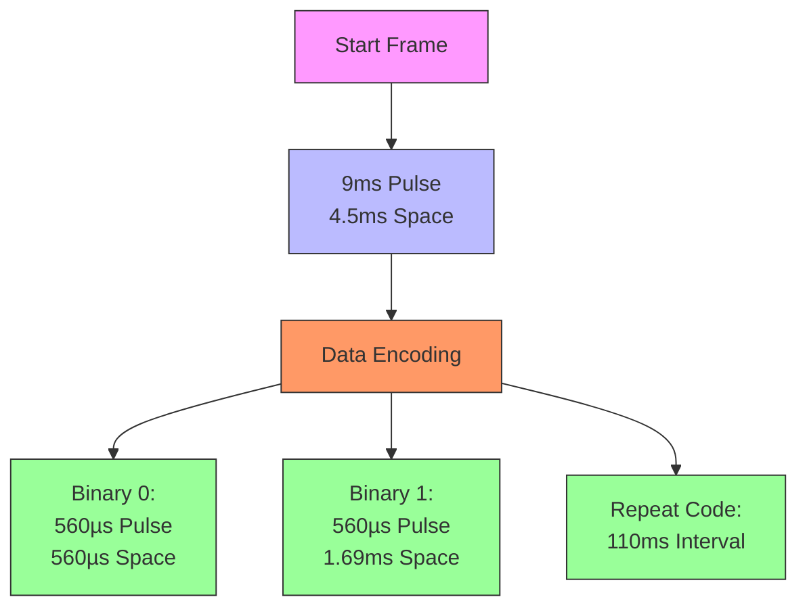
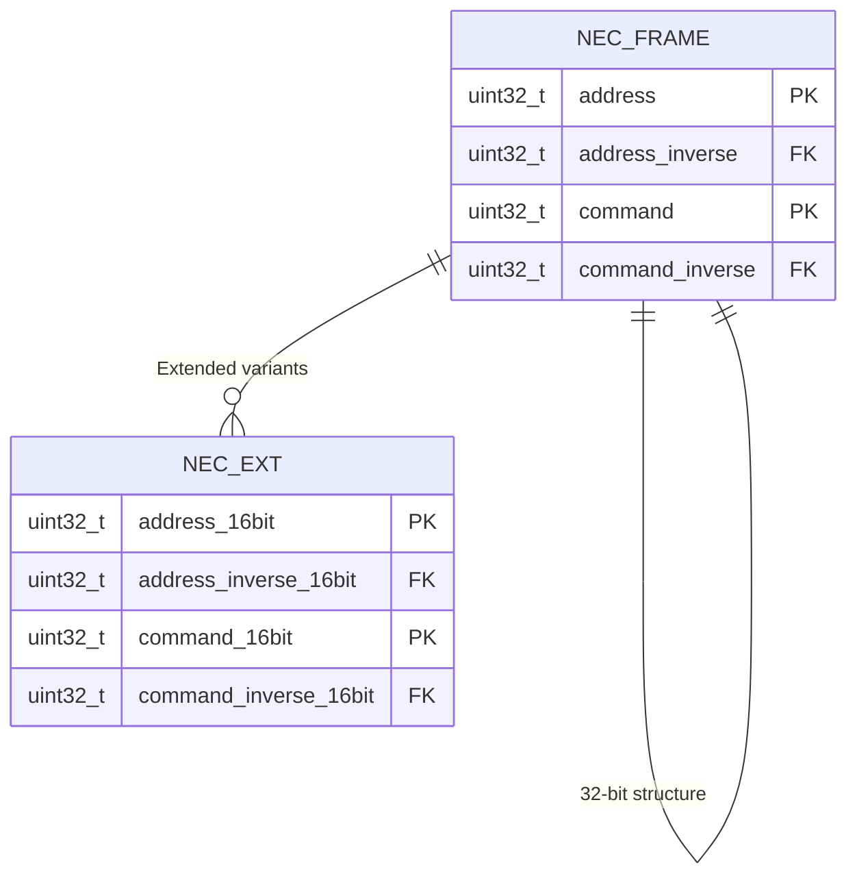
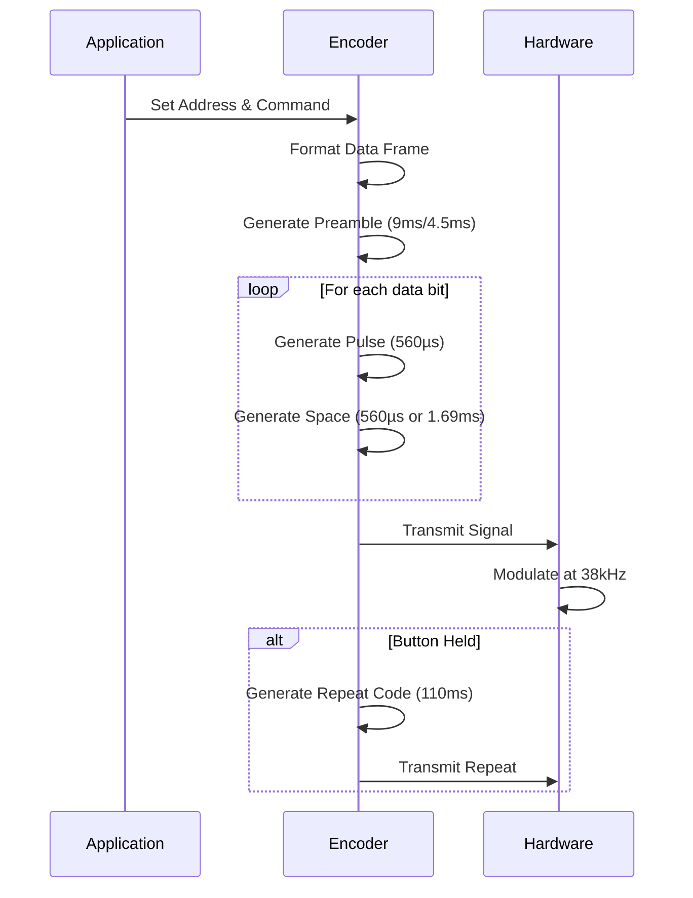
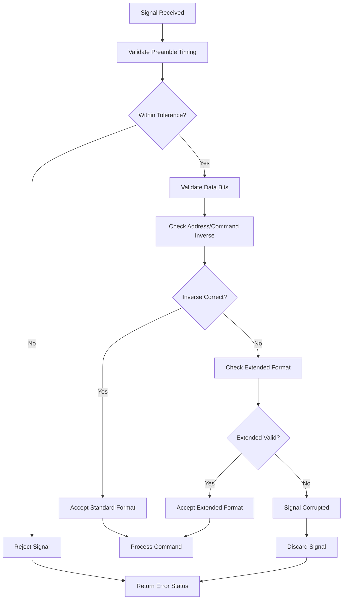
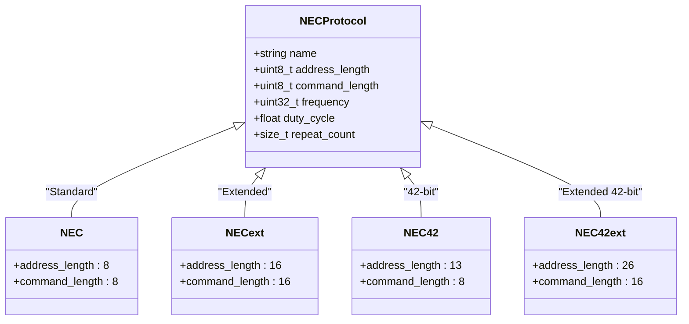

# NEC Protocol

<cite>
**Referenced Files in This Document**   
- [infrared_protocol_nec.h](file://lib/infrared/encoder_decoder/nec/infrared_protocol_nec.h)
- [infrared_protocol_nec.c](file://lib/infrared/encoder_decoder/nec/infrared_protocol_nec.c)
- [infrared_encoder_nec.c](file://lib/infrared/encoder_decoder/nec/infrared_encoder_nec.c)
- [infrared_decoder_nec.c](file://lib/infrared/encoder_decoder/nec/infrared_decoder_nec.c)
- [infrared_protocol_nec_i.h](file://lib/infrared/encoder_decoder/nec/infrared_protocol_nec_i.h)
- [infrared_common_i.h](file://lib/infrared/encoder_decoder/common/infrared_common_i.h)
- [infrared.h](file://lib/infrared/encoder_decoder/infrared.h)
- [infrared_worker.h](file://lib/infrared/worker/infrared_worker.h)
- [fans.ir](file://applications/main/infrared/resources/infrared/assets/fans.ir)
- [tv.ir](file://applications/main/infrared/resources/infrared/assets/tv.ir)
</cite>

## Table of Contents
1. [Introduction](#introduction)
2. [NEC Protocol Overview](#nec-protocol-overview)
3. [Timing Parameters](#timing-parameters)
4. [Frame Structure](#frame-structure)
5. [Encoder Implementation](#encoder-implementation)
6. [Decoder Implementation](#decoder-implementation)
7. [Configuration Options](#configuration-options)
8. [Error Handling and Validation](#error-handling-and-validation)
9. [Common Issues and Solutions](#common-issues-and-solutions)
10. [Performance Considerations](#performance-considerations)
11. [NEC Protocol Variants](#nec-protocol-variants)

## Introduction
The NEC infrared protocol is a widely used standard for remote control communication that has been implemented in the Flipper Zero firmware. This document provides a comprehensive analysis of the NEC protocol implementation, focusing on the 38kHz carrier frequency, pulse distance modulation scheme, and the 32-bit frame structure. The implementation supports various NEC protocol variants including standard NEC, NECext, NEC42, and NEC42ext, each with different address and command field configurations. The documentation covers the timing parameters, encoding and decoding processes, configuration options, and performance considerations for reliable infrared communication.

## NEC Protocol Overview
The NEC protocol implementation in the Flipper Zero firmware follows the standard infrared communication specifications with a 38kHz carrier frequency and pulse distance modulation. The protocol uses a specific timing structure with a 9ms leading pulse and 4.5ms space for the start frame, followed by 32 bits of data consisting of address and command fields. The implementation supports both standard NEC protocol with 8-bit address and command fields, as well as extended variants with 16-bit fields. The protocol uses command inversion for error checking, where the command and its inverse are transmitted to validate data integrity. The Flipper Zero implementation provides a robust framework for both transmitting and receiving NEC protocol signals with proper timing accuracy and error handling.

**Section sources**
- [infrared_protocol_nec.h](file://lib/infrared/encoder_decoder/nec/infrared_protocol_nec.h#L5-L17)
- [infrared.h](file://lib/infrared/encoder_decoder/infrared.h#L11-L12)
- [infrared_protocol_nec_i.h](file://lib/infrared/encoder_decoder/nec/infrared_protocol_nec_i.h#L5-L19)

## Timing Parameters
The NEC protocol implementation in the Flipper Zero firmware adheres to precise timing specifications to ensure compatibility with standard NEC devices. The timing parameters are defined with specific tolerance values to accommodate minor variations in signal transmission and reception. The implementation uses a 38kHz carrier frequency with a 33% duty cycle, which is the standard for NEC protocol communication. The timing structure begins with a 9ms leading pulse followed by a 4.5ms space, which serves as the start frame indicator. For data transmission, a binary 1 is encoded with a 560µs pulse followed by a 1.69ms space, while a binary 0 is encoded with a 560µs pulse followed by a 560µs space. The repeat code interval is set to 110ms, allowing for proper signal repetition when buttons are held down. The implementation includes tolerance settings of 200µs for preamble timing and 120µs for bit timing to handle minor timing variations.



**Diagram sources**
- [infrared_protocol_nec_i.h](file://lib/infrared/encoder_decoder/nec/infrared_protocol_nec_i.h#L5-L19)
- [infrared_protocol_nec.c](file://lib/infrared/encoder_decoder/nec/infrared_protocol_nec.c#L3-L16)

## Frame Structure
The NEC protocol implementation supports multiple frame structures, with the standard 32-bit frame consisting of 16-bit address and 16-bit command fields. The 32-bit frame is divided into four 8-bit segments: address, address inverse, command, and command inverse. This structure provides error checking through the inverse fields, ensuring data integrity during transmission. The address field identifies the target device, while the command field specifies the action to be performed. The extended NEC protocol (NECext) supports 16-bit address and 16-bit command fields, providing a larger address space for more complex systems. The implementation also supports NEC42 and NEC42ext variants with 13-bit and 26-bit address fields respectively, accommodating specialized use cases. The frame structure is designed to be compatible with the pulse distance modulation scheme, with each bit transmitted sequentially following the start frame.



**Diagram sources**
- [infrared_protocol_nec.c](file://lib/infrared/encoder_decoder/nec/infrared_protocol_nec.c#L26-L60)
- [infrared_encoder_nec.c](file://lib/infrared/encoder_decoder/nec/infrared_encoder_nec.c#L23-L52)
- [infrared_decoder_nec.c](file://lib/infrared/encoder_decoder/nec/infrared_decoder_nec.c#L13-L32)

## Encoder Implementation
The NEC protocol encoder implementation in the Flipper Zero firmware generates proper timing sequences for infrared transmission. The encoder is responsible for converting the address and command values into the appropriate pulse and space durations according to the NEC protocol specification. The implementation uses a common encoder framework that handles the preamble, data bits, and repeat codes. For standard NEC protocol, the encoder combines the address with its inverse and the command with its inverse to form the 32-bit data frame. The extended NEC protocol (NECext) directly uses the 16-bit address and command values without inversion. The encoder generates the 9ms leading pulse and 4.5ms space for the start frame, followed by the encoded data bits using pulse distance modulation. The repeat code generation is handled separately, with a 9ms pulse, 2.25ms space, and 560µs pulse to indicate repeated button presses.



**Diagram sources**
- [infrared_encoder_nec.c](file://lib/infrared/encoder_decoder/nec/infrared_encoder_nec.c#L14-L53)
- [infrared_protocol_nec.c](file://lib/infrared/encoder_decoder/nec/infrared_protocol_nec.c#L20-L23)
- [infrared_protocol_nec_i.h](file://lib/infrared/encoder_decoder/nec/infrared_protocol_nec_i.h#L6-L10)

## Decoder Implementation
The NEC protocol decoder implementation in the Flipper Zero firmware handles address and command validation, error checking, and repeat code detection. The decoder processes incoming infrared signals by measuring pulse and space durations and comparing them to the expected timing values with appropriate tolerances. The implementation uses a state machine to track the decoding process, starting with detection of the 9ms pulse and 4.5ms space of the start frame. After the preamble, the decoder processes each bit by measuring the space duration following the 560µs pulse to determine if it represents a binary 0 or 1. The decoder performs address and command validation by checking that the inverse fields match the bitwise complement of the original values. For repeat code detection, the decoder looks for a 4ms to 150ms pause followed by a 9ms pulse, 2.25ms space, and 560µs pulse sequence. The implementation supports multiple NEC variants, automatically detecting whether a signal uses the standard or extended format based on the data content.

```mermaid
flowchart TD
Start["Signal Received"] --> PreambleCheck["Check 9ms Pulse\n4.5ms Space"]
PreambleCheck --> BitProcessing["Process 32 Data Bits"]
BitProcessing --> DurationMeasurement["Measure Space Duration"]
DurationMeasurement --> BinaryDecision{"Space > 1.125ms?"}
BinaryDecision --> |Yes| Binary1["Bit = 1"]
BinaryDecision --> |No| Binary0["Bit = 0"]
Binary1 --> NextBit
Binary0 --> NextBit
NextBit --> MoreBits{"More Bits?"}
MoreBits --> |Yes| BitProcessing
MoreBits --> |No| Validation["Validate Address/Command"]
Validation --> InverseCheck["Check Inverse Fields"]
InverseCheck --> Valid{"Fields Valid?"}
Valid --> |Yes| Success["Return Decoded Message"]
Valid --> |No| ExtendedFormat["Check Extended Format"]
ExtendedFormat --> Success
ExtendedFormat --> |No| Error["Return Error"]
alt Repeat Code
PreambleCheck --> RepeatCheck["Check 4-150ms Pause"]
RepeatCheck --> RepeatPattern["9ms/2.25ms/560µs"]
RepeatPattern --> Success
end
```

**Diagram sources**
- [infrared_decoder_nec.c](file://lib/infrared/encoder_decoder/nec/infrared_decoder_nec.c#L8-L57)
- [infrared_decoder_nec.c](file://lib/infrared/encoder_decoder/nec/infrared_decoder_nec.c#L59-L80)
- [infrared_protocol_nec.c](file://lib/infrared/encoder_decoder/nec/infrared_protocol_nec.c#L19-L22)

## Configuration Options
The NEC protocol implementation in the Flipper Zero firmware provides several configuration options to accommodate different device requirements and environmental conditions. The address masking feature allows for partial address matching, which can be useful when working with devices that use variable address bits. Command inversion can be enabled or disabled depending on the specific device requirements, as some implementations may not use the standard inversion for error checking. The timing tolerance settings can be adjusted to account for variations in infrared receiver sensitivity and environmental interference. The implementation supports configurable repeat count settings, allowing users to specify how many times a signal should be repeated when a button is held down. Additionally, the carrier frequency and duty cycle can be adjusted within certain limits to optimize transmission power and receiver compatibility. These configuration options provide flexibility for working with a wide range of NEC-compatible devices.

**Section sources**
- [infrared_protocol_nec_i.h](file://lib/infrared/encoder_decoder/nec/infrared_protocol_nec_i.h#L18-L19)
- [infrared.h](file://lib/infrared/encoder_decoder/infrared.h#L215-L216)
- [infrared_protocol_nec.c](file://lib/infrared/encoder_decoder/nec/infrared_protocol_nec.c#L32-L42)

## Error Handling and Validation
The NEC protocol implementation includes comprehensive error handling and validation mechanisms to ensure reliable communication. The decoder performs multiple validation checks on received signals to prevent incorrect command execution. The primary validation mechanism is the address and command inverse check, where the received inverse fields are compared to the bitwise complement of the original values. If the inverse fields do not match, the implementation attempts to interpret the signal as an extended format message without inversion. The timing validation uses tolerance settings of 200µs for preamble timing and 120µs for bit timing to account for minor variations while rejecting signals with significant timing errors. The implementation also includes protection against signal corruption from multiple button presses by requiring proper frame validation before accepting a command. Repeat code detection is carefully implemented to distinguish between intentional repeats and signal interference. The error handling system returns appropriate status codes to the application layer, allowing for proper recovery from communication errors.



**Diagram sources**
- [infrared_decoder_nec.c](file://lib/infrared/encoder_decoder/nec/infrared_decoder_nec.c#L13-L32)
- [infrared_protocol_nec_i.h](file://lib/infrared/encoder_decoder/nec/infrared_protocol_nec_i.h#L18-L19)
- [infrared_common_i.h](file://lib/infrared/encoder_decoder/common/infrared_common_i.h#L7-L8)

## Common Issues and Solutions
The NEC protocol implementation addresses several common issues encountered in infrared communication. Signal corruption from multiple button presses is mitigated through proper frame validation and timing recovery mechanisms. The implementation uses a state machine approach to ensure that only complete and valid frames are processed, preventing partial or corrupted signals from executing unintended commands. Environmental interference from ambient light sources is minimized by using the 38kHz carrier frequency and appropriate duty cycle settings. The timing recovery system automatically resets the decoder state when invalid timing sequences are detected, preventing lock-up conditions. For devices with varying sensitivity, the implementation provides configurable tolerance settings to optimize reception. The repeat code handling prevents unintended multiple executions by properly detecting and processing repeat sequences. These solutions ensure reliable operation in various environmental conditions and with different types of NEC-compatible devices.

**Section sources**
- [infrared_decoder_nec.c](file://lib/infrared/encoder_decoder/nec/infrared_decoder_nec.c#L67-L80)
- [infrared_protocol_nec_i.h](file://lib/infrared/encoder_decoder/nec/infrared_protocol_nec_i.h#L13-L15)
- [infrared_common_i.h](file://lib/infrared/encoder_decoder/common/infrared_common_i.h#L42-L53)

## Performance Considerations
The NEC protocol implementation in the Flipper Zero firmware includes several performance optimizations for transmission power consumption and receiver sensitivity. The 38kHz carrier frequency with 33% duty cycle provides a balance between transmission range and power efficiency. The implementation uses hardware-level pulse generation to minimize CPU usage during transmission, allowing the processor to enter low-power states when possible. For reception, the implementation optimizes sensitivity settings to detect weak signals while filtering out noise. The timing tolerance settings are carefully calibrated to accommodate variations in receiver quality without compromising reliability. The buffer management system efficiently handles incoming signal data, preventing overflow during extended reception periods. The power consumption is further optimized by automatically disabling the infrared transmitter when not in use and using sleep modes during idle periods. These performance considerations ensure reliable operation while maximizing battery life in portable applications.

**Section sources**
- [infrared.h](file://lib/infrared/encoder_decoder/infrared.h#L11-L12)
- [infrared_worker.h](file://lib/infrared/worker/infrared_worker.h#L10-L196)
- [infrared_protocol_nec_i.h](file://lib/infrared/encoder_decoder/nec/infrared_protocol_nec_i.h#L18-L19)

## NEC Protocol Variants
The Flipper Zero firmware implementation supports multiple variants of the NEC protocol to ensure compatibility with a wide range of devices. The standard NEC protocol uses 8-bit address and 8-bit command fields with inverted values for error checking. The NECext variant extends this to 16-bit address and 16-bit command fields, providing a larger address space for more complex systems. The NEC42 variant uses a 13-bit address field and 8-bit command field, while NEC42ext extends this to 26-bit address and 16-bit command fields. Each variant maintains the same basic timing structure with the 9ms leading pulse, 4.5ms space, and pulse distance modulation scheme. The implementation automatically detects the appropriate variant based on the received data structure and timing characteristics. This flexibility allows the Flipper Zero to work with various NEC-compatible devices, from simple consumer electronics to more sophisticated industrial control systems.



**Diagram sources**
- [infrared_protocol_nec.c](file://lib/infrared/encoder_decoder/nec/infrared_protocol_nec.c#L26-L60)
- [infrared.h](file://lib/infrared/encoder_decoder/infrared.h#L24-L27)
- [infrared_protocol_nec.h](file://lib/infrared/encoder_decoder/nec/infrared_protocol_nec.h#L26-L30)