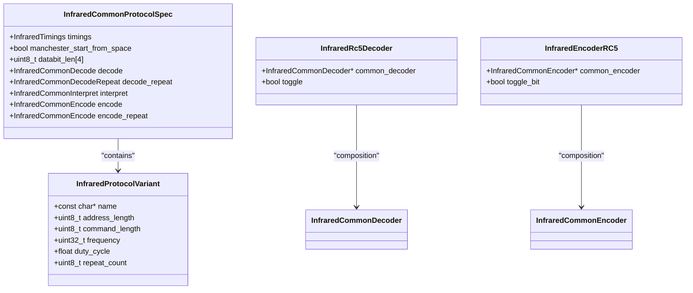
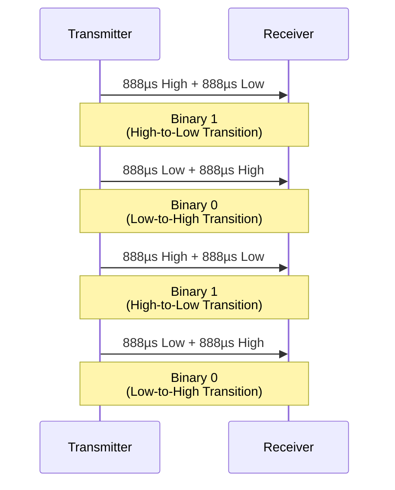
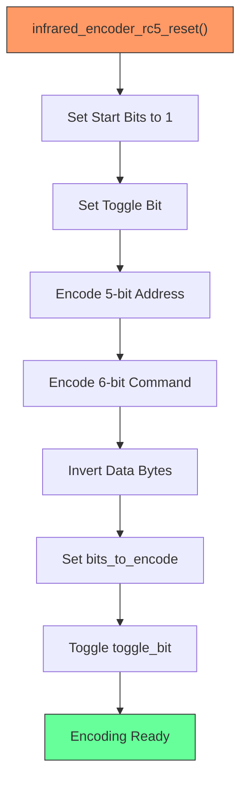
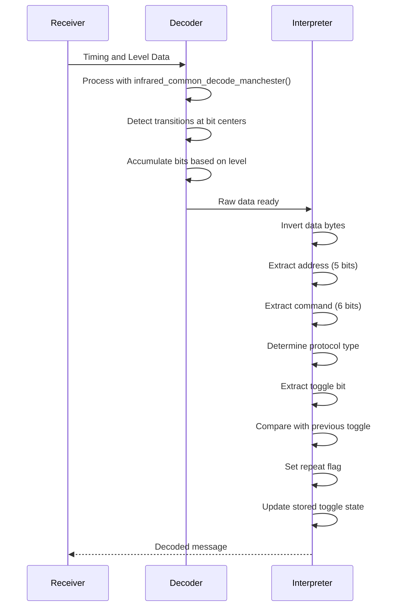
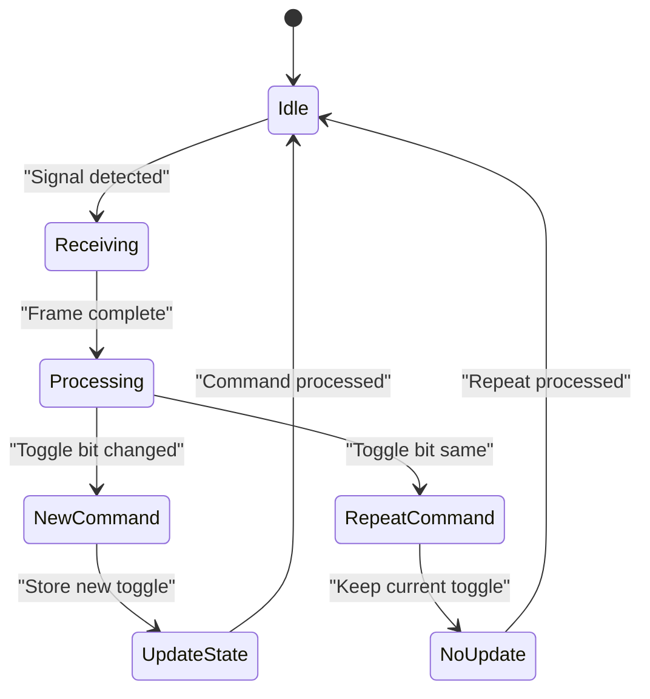
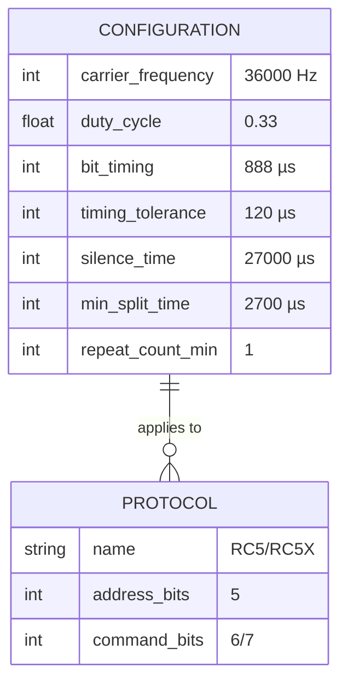

# RC5 Protocol

<cite>
**Referenced Files in This Document**   
- [infrared_protocol_rc5.h](file://lib/infrared/encoder_decoder/rc5/infrared_protocol_rc5.h)
- [infrared_protocol_rc5.c](file://lib/infrared/encoder_decoder/rc5/infrared_protocol_rc5.c)
- [infrared_protocol_rc5_i.h](file://lib/infrared/encoder_decoder/rc5/infrared_protocol_rc5_i.h)
- [infrared_encoder_rc5.c](file://lib/infrared/encoder_decoder/rc5/infrared_encoder_rc5.c)
- [infrared_decoder_rc5.c](file://lib/infrared/encoder_decoder/rc5/infrared_decoder_rc5.c)
- [infrared_common_i.h](file://lib/infrared/encoder_decoder/common/infrared_common_i.h)
- [infrared_common_decoder.c](file://lib/infrared/encoder_decoder/common/infrared_common_decoder.c)
- [infrared_common_encoder.c](file://lib/infrared/encoder_decoder/common/infrared_common_encoder.c)
- [manchester_encoder.c](file://lib/toolbox/manchester_encoder.c)
- [manchester_decoder.c](file://lib/toolbox/manchester_decoder.c)
- [test_rc5.irtest](file://applications/debug/unit_tests/resources/unit_tests/infrared/test_rc5.irtest)
- [test_rc5x.irtest](file://applications/debug/unit_tests/resources/unit_tests/infrared/test_rc5x.irtest)
</cite>

## Table of Contents
1. [Introduction](#introduction)
2. [RC5 Protocol Overview](#rc5-protocol-overview)
3. [Frame Structure](#frame-structure)
4. [Manchester Modulation](#manchester-modulation)
5. [Encoder Implementation](#encoder-implementation)
6. [Decoder Implementation](#decoder-implementation)
7. [Toggle Bit Logic](#toggle-bit-logic)
8. [Configuration Options](#configuration-options)
9. [Performance Considerations](#performance-considerations)
10. [Troubleshooting Guide](#troubleshooting-guide)

## Introduction

The RC5 infrared protocol is a widely used standard for remote control communication, developed by Philips. This document provides a comprehensive analysis of the RC5 protocol implementation in the Flipper Zero firmware, focusing on the 36kHz carrier frequency, bi-phase (Manchester) modulation scheme, and the 14-bit frame structure. The implementation supports both standard RC5 and extended RC5X protocols, with detailed handling of the toggle bit for reliable button press detection.

**Section sources**
- [infrared_protocol_rc5.h](file://lib/infrared/encoder_decoder/rc5/infrared_protocol_rc5.h#L5-L25)
- [infrared_protocol_rc5_i.h](file://lib/infrared/encoder_decoder/rc5/infrared_protocol_rc5_i.h#L5-L17)

## RC5 Protocol Overview

The RC5 protocol implementation in the Flipper Zero firmware operates at a 36kHz carrier frequency with a 33% duty cycle. The protocol uses Manchester (bi-phase) modulation to encode data, with a bit period of 1.778ms, where each bit is represented by a 888µs half-period. The implementation supports both the standard RC5 protocol with a 6-bit command field and the extended RC5X protocol with a 7-bit command field.

The protocol specification is defined in the `infrared_protocol_rc5` structure, which contains timing parameters, data bit lengths, and function pointers for encoding, decoding, and interpretation. The implementation handles both RC5 and RC5X variants through the `infrared_protocol_rc5_get_variant` function, which returns the appropriate protocol variant based on the specified protocol type.

**Diagram sources**
- [infrared_protocol_rc5.c](file://lib/infrared/encoder_decoder/rc5/infrared_protocol_rc5.c#L3-L22)
- [infrared_protocol_rc5_i.h](file://lib/infrared/encoder_decoder/rc5/infrared_protocol_rc5_i.h#L5-L17)
- [infrared_decoder_rc5.c](file://lib/infrared/encoder_decoder/rc5/infrared_decoder_rc5.c#L6-L9)
- [infrared_encoder_rc5.c](file://lib/infrared/encoder_decoder/rc5/infrared_encoder_rc5.c#L6-L9)

**Section sources**
- [infrared_protocol_rc5.c](file://lib/infrared/encoder_decoder/rc5/infrared_protocol_rc5.c#L3-L50)
- [infrared_protocol_rc5_i.h](file://lib/infrared/encoder_decoder/rc5/infrared_protocol_rc5_i.h#L5-L17)

## Frame Structure

The RC5 protocol frame consists of 14 bits with the following structure:
- 2 start bits (always 1)
- 1 toggle bit (changes state with each button press)
- 5-bit system address
- 6-bit command (7-bit for RC5X)

The frame structure is defined in the `infrared_protocol_rc5` specification with a total data bit length of 14 bits (1+1+1+5+6). For RC5X, the command field extends to 7 bits, allowing for a larger command set. The start bits are always set to 1, providing frame synchronization for the receiver.

The implementation handles both RC5 and RC5X variants through the `infrared_protocol_variant_rc5` and `infrared_protocol_variant_rc5x` structures, which specify the address length (5 bits), command length (6 or 7 bits), carrier frequency (36kHz), and duty cycle (33%).

**Diagram sources**
- [infrared_protocol_rc5.h](file://lib/infrared/encoder_decoder/rc5/infrared_protocol_rc5.h#L14-L24)
- [infrared_protocol_rc5.c](file://lib/infrared/encoder_decoder/rc5/infrared_protocol_rc5.c#L24-L40)

**Section sources**
- [infrared_protocol_rc5.h](file://lib/infrared/encoder_decoder/rc5/infrared_protocol_rc5.h#L14-L24)
- [infrared_protocol_rc5.c](file://lib/infrared/encoder_decoder/rc5/infrared_protocol_rc5.c#L24-L40)

## Manchester Modulation

The RC5 protocol uses Manchester (bi-phase) modulation with a bit period of 1.778ms, where each bit is represented by two 888µs half-periods. In this implementation, a high-to-low transition represents binary 1, and a low-to-high transition represents binary 0. The modulation starts with a space timing, which is handled by the `manchester_start_from_space` flag in the protocol specification.

The Manchester encoding and decoding is implemented in the common infrared library functions `infrared_common_encode_manchester` and `infrared_common_decode_manchester`. These functions handle the phase encoding by tracking the state of the signal and generating or interpreting the appropriate transitions. The timing tolerance is set to 120µs, allowing for variations in the signal while maintaining reliable decoding.

**Diagram sources**
- [infrared_protocol_rc5_i.h](file://lib/infrared/encoder_decoder/rc5/infrared_protocol_rc5_i.h#L10-L12)
- [infrared_common_decoder.c](file://lib/infrared/encoder_decoder/common/infrared_common_decoder.c#L151-L192)
- [infrared_common_encoder.c](file://lib/infrared/encoder_decoder/common/infrared_common_encoder.c#L35-L57)

**Section sources**
- [infrared_protocol_rc5_i.h](file://lib/infrared/encoder_decoder/rc5/infrared_protocol_rc5_i.h#L10-L12)
- [infrared_common_decoder.c](file://lib/infrared/encoder_decoder/common/infrared_common_decoder.c#L151-L192)
- [infrared_common_encoder.c](file://lib/infrared/encoder_decoder/common/infrared_common_encoder.c#L35-L57)

## Encoder Implementation

The RC5 encoder implementation is contained in the `infrared_encoder_rc5.c` file and follows a structured approach to generate the Manchester-encoded signal. The encoder is initialized with `infrared_encoder_rc5_alloc`, which allocates memory for the encoder structure and initializes the common encoder with the RC5 protocol specification.

The encoding process begins with `infrared_encoder_rc5_reset`, which prepares the encoder for a new transmission by:
1. Resetting the common encoder state
2. Setting the start bits (always 1)
3. Setting the toggle bit based on the current state
4. Encoding the 5-bit address and 6-bit command fields
5. Inverting the data bytes for Manchester encoding
6. Setting the number of bits to encode
7. Toggling the toggle bit for the next transmission

The actual signal generation is handled by `infrared_common_encode_manchester`, which produces the timing pulses and polarity changes required for Manchester encoding. The function tracks the current bit being encoded and alternates between mark and space periods based on the bit value and timing position.

**Diagram sources**
- [infrared_encoder_rc5.c](file://lib/infrared/encoder_decoder/rc5/infrared_encoder_rc5.c#L11-L33)
- [infrared_common_encoder.c](file://lib/infrared/encoder_decoder/common/infrared_common_encoder.c#L35-L57)

**Section sources**
- [infrared_encoder_rc5.c](file://lib/infrared/encoder_decoder/rc5/infrared_encoder_rc5.c#L11-L54)
- [infrared_common_encoder.c](file://lib/infrared/encoder_decoder/common/infrared_common_encoder.c#L35-L57)

## Decoder Implementation

The RC5 decoder implementation is contained in the `infrared_decoder_rc5.c` file and follows a state-based approach to decode the Manchester-encoded signal. The decoder is initialized with `infrared_decoder_rc5_alloc`, which allocates memory for the decoder structure and initializes the common decoder with the RC5 protocol specification.

The decoding process is handled by `infrared_common_decode_manchester`, which processes the incoming signal timing and level information to extract the data bits. The function uses a `switch_detect` flag to track the position within the bit period and accumulates bits when a level transition is detected in the middle of the time quantum.

After the raw bits are decoded, the `infrared_decoder_rc5_interpret` function processes the data to extract the protocol fields:
1. Inverts the data bytes (due to Manchester encoding)
2. Extracts the 5-bit address from the first data byte
3. Extracts the 6-bit command from the second data byte
4. Determines the protocol type (RC5 or RC5X) based on the second start bit
5. Extracts the toggle bit value
6. Sets the repeat flag based on toggle bit comparison
7. Updates the stored toggle state for the next comparison

**Diagram sources**
- [infrared_decoder_rc5.c](file://lib/infrared/encoder_decoder/rc5/infrared_decoder_rc5.c#L16-L55)
- [infrared_common_decoder.c](file://lib/infrared/encoder_decoder/common/infrared_common_decoder.c#L151-L192)

**Section sources**
- [infrared_decoder_rc5.c](file://lib/infrared/encoder_decoder/rc5/infrared_decoder_rc5.c#L16-L80)
- [infrared_common_decoder.c](file://lib/infrared/encoder_decoder/common/infrared_common_decoder.c#L151-L192)

## Toggle Bit Logic

The toggle bit is a critical feature of the RC5 protocol that enables reliable button press detection and prevents unintended repeat commands. The toggle bit changes state (0 to 1 or 1 to 0) with each button press, allowing the receiver to distinguish between a new button press and a repeat transmission.

In the Flipper Zero implementation, the toggle bit logic is handled in the `infrared_decoder_rc5_interpret` function. When a complete frame is received, the function:
1. Extracts the toggle bit from the received data
2. Compares it with the previously stored toggle state
3. Sets the `repeat` flag to true if the toggle bit matches the previous state
4. Updates the stored toggle state to the current value

This logic ensures that consecutive identical commands are properly identified as repeats, while new button presses (even for the same command) are recognized as distinct events. The toggle bit state is maintained in the `InfraredRc5Decoder` structure, ensuring persistence across multiple transmissions.

**Diagram sources**
- [infrared_decoder_rc5.c](file://lib/infrared/encoder_decoder/rc5/infrared_decoder_rc5.c#L33-L47)
- [infrared_encoder_rc5.c](file://lib/infrared/encoder_decoder/rc5/infrared_encoder_rc5.c#L32)

**Section sources**
- [infrared_decoder_rc5.c](file://lib/infrared/encoder_decoder/rc5/infrared_decoder_rc5.c#L33-L47)
- [infrared_encoder_rc5.c](file://lib/infrared/encoder_decoder/rc5/infrared_encoder_rc5.c#L32)

## Configuration Options

The RC5 protocol implementation provides several configuration options through compile-time constants defined in `infrared_protocol_rc5_i.h`:

- **Carrier Frequency**: Configured at 36kHz (`INFRARED_RC5_CARRIER_FREQUENCY`)
- **Duty Cycle**: Set to 33% (`INFRARED_RC5_DUTY_CYCLE`)
- **Bit Timing**: Half-period of 888µs (`INFRARED_RC5_BIT`)
- **Timing Tolerance**: ±120µs (`INFRARED_RC5_BIT_TOLERANCE`)
- **Silence Time**: 27,000µs between transmissions (`INFRARED_RC5_SILENCE`)
- **Minimum Split Time**: 2,700µs (`INFRARED_RC5_MIN_SPLIT_TIME`)
- **Repeat Count**: Minimum of 1 repeat (`INFRARED_RC5_REPEAT_COUNT_MIN`)

These configuration options can be adjusted to accommodate variations in receiver sensitivity or to optimize for specific use cases. The timing parameters are particularly important for reliable communication, as they determine the receiver's ability to correctly interpret the Manchester-encoded signal.

**Diagram sources**
- [infrared_protocol_rc5_i.h](file://lib/infrared/encoder_decoder/rc5/infrared_protocol_rc5_i.h#L5-L16)
- [infrared_protocol_rc5.c](file://lib/infrared/encoder_decoder/rc5/infrared_protocol_rc5.c#L24-L40)

**Section sources**
- [infrared_protocol_rc5_i.h](file://lib/infrared/encoder_decoder/rc5/infrared_protocol_rc5_i.h#L5-L16)
- [infrared_protocol_rc5.c](file://lib/infrared/encoder_decoder/rc5/infrared_protocol_rc5.c#L24-L40)

## Performance Considerations

The RC5 protocol implementation includes several performance optimizations for reliable toggle bit handling and optimal receiver filtering:

1. **State Tracking**: The toggle bit state is stored in the decoder structure, ensuring proper tracking across multiple transmissions without requiring external state management.

2. **Timing Tolerance**: The ±120µs timing tolerance accommodates variations in transmitter and receiver clocks while maintaining reliable decoding.

3. **Noise Filtering**: The minimum split time of 2,700µs helps filter out short-duration noise that might otherwise be misinterpreted as valid signal transitions.

4. **Silence Period**: The 27ms silence period between transmissions prevents overlapping signals and allows the receiver to reset between commands.

5. **Manchester Decoding**: The implementation correctly handles the Manchester encoding starting from a space timing, which is critical for proper synchronization.

6. **Error Handling**: The decoder returns error status for invalid timing sequences, preventing the processing of corrupted data.

These performance considerations ensure reliable operation in real-world conditions with potential signal interference and timing variations.

**Section sources**
- [infrared_protocol_rc5_i.h](file://lib/infrared/encoder_decoder/rc5/infrared_protocol_rc5_i.h#L10-L15)
- [infrared_common_decoder.c](file://lib/infrared/encoder_decoder/common/infrared_common_decoder.c#L151-L192)
- [infrared_decoder_rc5.c](file://lib/infrared/encoder_decoder/rc5/infrared_decoder_rc5.c#L33-L47)

## Troubleshooting Guide

Common issues with RC5 protocol implementation and their solutions:

### Toggle Bit Misinterpretation
**Issue**: The receiver incorrectly identifies new button presses as repeats or vice versa.
**Solution**: Ensure proper state tracking by maintaining the toggle bit state between transmissions. Verify that the toggle bit is correctly updated after each transmission.

### Signal Decoding Failures
**Issue**: Valid RC5 signals are not being decoded correctly.
**Solution**: Check the timing tolerance settings and adjust if necessary. Verify that the carrier frequency (36kHz) and bit timing (888µs) match the transmitter specifications.

### Noise Interference
**Issue**: Spurious commands are being detected due to environmental noise.
**Solution**: Increase the minimum split time to filter out short-duration noise. Ensure proper shielding of the receiver circuit.

### Synchronization Issues
**Issue**: The receiver fails to synchronize with the incoming signal.
**Solution**: Verify that the Manchester encoding starts from a space timing as specified in the protocol. Check that the start bits are correctly identified.

### Range Limitations
**Issue**: Short transmission range.
**Solution**: Ensure the duty cycle (33%) and carrier frequency (36kHz) are optimized for the transmitter and receiver. Check the signal strength and consider increasing the transmission power if possible.

**Section sources**
- [infrared_decoder_rc5.c](file://lib/infrared/encoder_decoder/rc5/infrared_decoder_rc5.c#L33-L47)
- [infrared_protocol_rc5_i.h](file://lib/infrared/encoder_decoder/rc5/infrared_protocol_rc5_i.h#L10-L15)
- [infrared_common_decoder.c](file://lib/infrared/encoder_decoder/common/infrared_common_decoder.c#L151-L192)