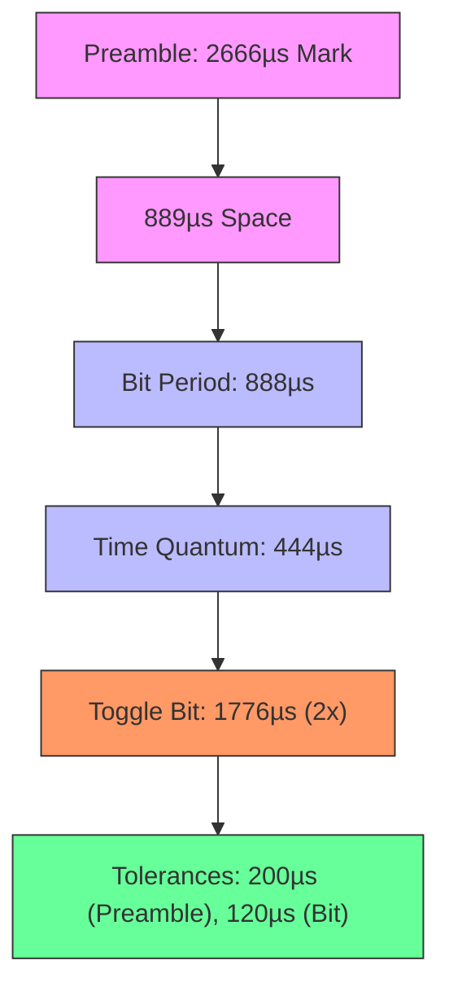
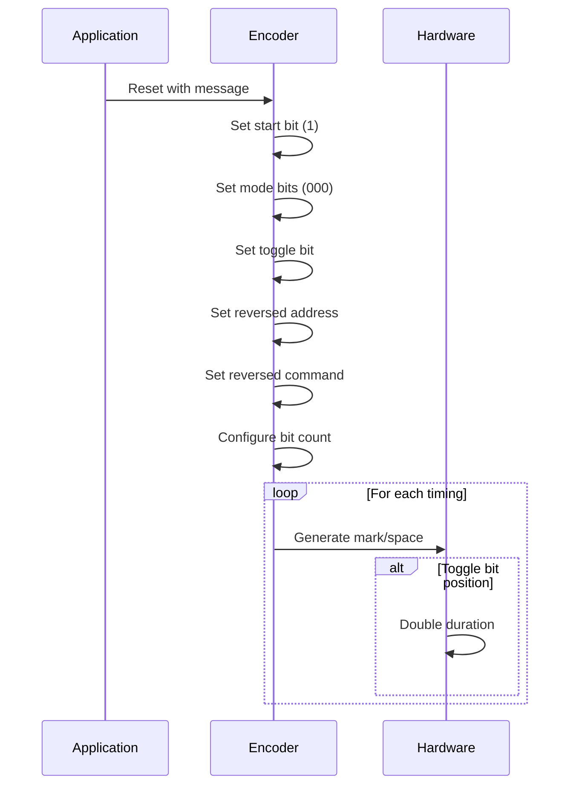
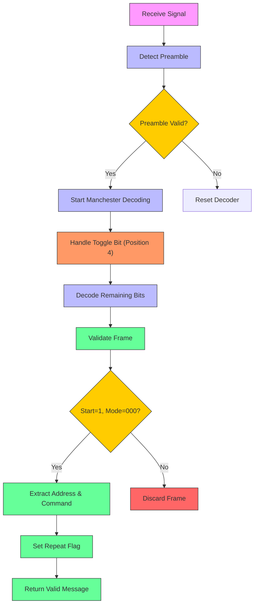

# RC6 Protocol

<cite>
**Referenced Files in This Document**   
- [infrared_protocol_rc6.c](file://lib/infrared/encoder_decoder/rc6/infrared_protocol_rc6.c)
- [infrared_protocol_rc6.h](file://lib/infrared/encoder_decoder/rc6/infrared_protocol_rc6.h)
- [infrared_protocol_rc6_i.h](file://lib/infrared/encoder_decoder/rc6/infrared_protocol_rc6_i.h)
- [infrared_encoder_rc6.c](file://lib/infrared/encoder_decoder/rc6/infrared_encoder_rc6.c)
- [infrared_decoder_rc6.c](file://lib/infrared/encoder_decoder/rc6/infrared_decoder_rc6.c)
- [infrared_common_encoder.c](file://lib/infrared/encoder_decoder/common/infrared_common_encoder.c)
- [infrared_common_decoder.c](file://lib/infrared/encoder_decoder/common/infrared_common_decoder.c)
- [infrared.h](file://lib/infrared/encoder_decoder/infrared.h)
- [infrared_protocol_rc5.h](file://lib/infrared/encoder_decoder/rc5/infrared_protocol_rc5.h)
</cite>

## Table of Contents
1. [Introduction](#introduction)
2. [RC6 Protocol Specifications](#rc6-protocol-specifications)
3. [Frame Structure Analysis](#frame-structure-analysis)
4. [Timing Parameters](#timing-parameters)
5. [Encoder Implementation](#encoder-implementation)
6. [Decoder Implementation](#decoder-implementation)
7. [Mode Bit Handling and Variants](#mode-bit-handling-and-variants)
8. [Configuration and Compatibility](#configuration-and-compatibility)
9. [Error Handling and Validation](#error-handling-and-validation)
10. [Performance Considerations](#performance-considerations)

## Introduction
The RC6 infrared protocol implementation in the Flipper Zero firmware provides a robust system for transmitting and receiving infrared signals using the RC6 standard. This document details the complete implementation of the RC6 protocol, focusing on its 36kHz carrier frequency, bi-phase modulation scheme, and enhanced 20-bit frame structure. The implementation supports various RC6 variants through mode bit configuration and maintains backward compatibility with similar protocols. The system is designed for reliable transmission and accurate decoding across different device types, with comprehensive error checking and validation mechanisms.

## RC6 Protocol Specifications
The RC6 protocol implementation in the Flipper Zero firmware adheres to the standard RC6 specification with specific enhancements for improved reliability and compatibility. The protocol operates at a carrier frequency of 36kHz with a duty cycle of 33%, optimized for efficient infrared transmission. The implementation supports the full 20-bit frame structure including the special 3-bit start sequence, mode bits, toggle bit, system address, and command fields.

The protocol is registered within the infrared subsystem with the identifier `InfraredProtocolRC6` and is configured with specific timing parameters that ensure accurate signal generation and decoding. The implementation follows the Manchester/biphase modulation scheme with modifications to accommodate the toggle bit's extended duration.

**Section sources**
- [infrared_protocol_rc6.c](file://lib/infrared/encoder_decoder/rc6/infrared_protocol_rc6.c#L3-39)
- [infrared.h](file://lib/infrared/encoder_decoder/infrared.h#L29)
- [infrared_protocol_rc6_i.h](file://lib/infrared/encoder_decoder/rc6/infrared_protocol_rc6_i.h#L5)

## Frame Structure Analysis
The RC6 protocol implements an enhanced 20-bit frame structure that consists of several distinct components arranged in a specific sequence. The frame begins with a 3-bit start sequence (111), followed by 3 mode bits, a toggle bit, an 8-bit system address, and an 8-bit command field.

The frame structure is defined in the protocol specification with the following layout:
- Start bit: Always set to 1
- Mode bits (3 bits): Determine the RC6 variant (000 for standard RC6)
- Toggle bit: Changes state with each button press, with twice the normal bit duration
- System address (8 bits): Identifies the target device
- Command (8 bits): Specifies the operation to be performed

This structure allows for 256 possible addresses and 256 possible commands, providing extensive control capabilities. The mode bits enable support for different RC6 variants (0, 1, 2, 3) by modifying the interpretation of the frame.

**Diagram sources**
- [infrared_protocol_rc6.h](file://lib/infrared/encoder_decoder/rc6/infrared_protocol_rc6.h#L12-18)
- [infrared_protocol_rc6.c](file://lib/infrared/encoder_decoder/rc6/infrared_protocol_rc6.c#L14-16)

**Section sources**
- [infrared_protocol_rc6.h](file://lib/infrared/encoder_decoder/rc6/infrared_protocol_rc6.h#L12-24)
- [infrared_protocol_rc6.c](file://lib/infrared/encoder_decoder/rc6/infrared_protocol_rc6.c#L14-16)

## Timing Parameters
The RC6 protocol implementation uses precise timing parameters to ensure reliable signal transmission and reception. The fundamental bit period is 888µs, with each bit divided into two 444µs time quanta as defined by the Manchester encoding scheme. The 36kHz carrier frequency with 33% duty cycle provides optimal signal characteristics for infrared transmission.

Key timing parameters include:
- Preamble mark: 2666µs
- Preamble space: 889µs
- Bit time quantum: 444µs (half of the 888µs bit period)
- Preamble tolerance: 200µs
- Bit tolerance: 120µs
- Silence time: 27,000µs (10 times the minimum split time)

The toggle bit, which occurs at the fourth position in the frame, has a duration twice that of a normal bit (1776µs), requiring special handling during both encoding and decoding. The timing tolerances allow for variations in signal generation and reception while maintaining reliable communication.

**Diagram sources**
- [infrared_protocol_rc6_i.h](file://lib/infrared/encoder_decoder/rc6/infrared_protocol_rc6_i.h#L8-12)
- [infrared_protocol_rc6.c](file://lib/infrared/encoder_decoder/rc6/infrared_protocol_rc6.c#L6-10)

**Section sources**
- [infrared_protocol_rc6_i.h](file://lib/infrared/encoder_decoder/rc6/infrared_protocol_rc6_i.h#L5-16)
- [infrared_protocol_rc6.c](file://lib/infrared/encoder_decoder/rc6/infrared_protocol_rc6.c#L6-12)

## Encoder Implementation
The RC6 encoder implementation follows a structured approach to generate the complete frame with proper timing and bit sequencing. The encoder is implemented as a state machine that manages the preamble, data encoding, and silence periods according to the protocol specification.

The encoding process begins with the allocation of an encoder instance, which initializes the common encoder structure with the RC6 protocol parameters. The reset function prepares the encoder for a new transmission by setting up the data buffer with the start bit, mode bits (set to 000 for standard RC6), toggle bit, reversed address, and reversed command. The address and command values are bit-reversed to ensure proper MSB-first transmission.

A key aspect of the encoder implementation is the special handling of the toggle bit, which occurs at the fourth position in the frame and has twice the normal bit duration. This is achieved by modifying the duration after the standard Manchester encoding process. The toggle bit state is maintained between transmissions and toggled with each new frame to indicate button presses.

**Diagram sources**
- [infrared_encoder_rc6.c](file://lib/infrared/encoder_decoder/rc6/infrared_encoder_rc6.c#L11-27)
- [infrared_encoder_rc6.c](file://lib/infrared/encoder_decoder/rc6/infrared_encoder_rc6.c#L49-59)

**Section sources**
- [infrared_encoder_rc6.c](file://lib/infrared/encoder_decoder/rc6/infrared_encoder_rc6.c#L6-47)
- [infrared_common_encoder.c](file://lib/infrared/encoder_decoder/common/infrared_common_encoder.c#L85-136)

## Decoder Implementation
The RC6 decoder implementation processes incoming infrared signals and reconstructs the original data frame according to the RC6 protocol specification. The decoder follows a multi-stage process that includes preamble detection, Manchester decoding with special toggle bit handling, and frame validation.

The decoding process begins with preamble detection, where the system verifies the initial 2666µs mark followed by 889µs space. After successful preamble detection, the decoder proceeds with Manchester/biphase decoding of the data bits. Special handling is required for the fourth bit (toggle bit), which has twice the normal duration. The decoder distinguishes between single, double, and triple timing events to properly interpret the toggle bit and subsequent bits.

Frame validation occurs in the interpretation stage, where the decoder checks that the start bit is set to 1 and the mode bits are 000 (for standard RC6). The address and command values are extracted from the data buffer, bit-reversed to restore their original values, and stored in the message structure. The repeat flag is set based on whether the toggle bit matches the previous transmission.

**Diagram sources**
- [infrared_decoder_rc6.c](file://lib/infrared/encoder_decoder/rc6/infrared_decoder_rc6.c#L54-85)
- [infrared_decoder_rc6.c](file://lib/infrared/encoder_decoder/rc6/infrared_decoder_rc6.c#L16-46)

**Section sources**
- [infrared_decoder_rc6.c](file://lib/infrared/encoder_decoder/rc6/infrared_decoder_rc6.c#L6-113)
- [infrared_common_decoder.c](file://lib/infrared/encoder_decoder/common/infrared_common_decoder.c#L151-192)

## Mode Bit Handling and Variants
The RC6 protocol implementation supports multiple variants through the use of mode bits, allowing for backward compatibility and extended functionality. The three mode bits (m0-m2) in the frame structure determine the specific RC6 variant being used, with 000 indicating standard RC6.

The implementation handles mode bits in both encoding and decoding processes. During encoding, the mode bits are set to 000 for standard RC6 transmission, but the framework allows for configuration of different mode values to support RC6 variants. The decoder validates the mode bits as part of frame validation, ensuring that only frames with the expected mode are accepted.

The mode bit system enables support for RC6 variants 0, 1, 2, and 3, each with potentially different frame structures or timing parameters. This flexibility allows the Flipper Zero to communicate with a wide range of devices that may implement different RC6 variants. The mode bit handling is integrated into the protocol's variant system, which can return different configuration parameters based on the detected mode.

**Section sources**
- [infrared_protocol_rc6.h](file://lib/infrared/encoder_decoder/rc6/infrared_protocol_rc6.h#L19-20)
- [infrared_decoder_rc6.c](file://lib/infrared/encoder_decoder/rc6/infrared_decoder_rc6.c#L26-28)
- [infrared_protocol_rc6.c](file://lib/infrared/encoder_decoder/rc6/infrared_protocol_rc6.c#L25-32)

## Configuration and Compatibility
The RC6 implementation provides configuration options for mode selection, address customization, and backward compatibility with RC5 devices. The system is designed to be flexible while maintaining strict adherence to the RC6 protocol specification.

Configuration parameters include:
- Mode bit settings for different RC6 variants
- System address customization for targeting specific devices
- Command field configuration for various operations
- Toggle bit management for proper repeat detection

The implementation maintains backward compatibility with RC5 devices through shared infrastructure and similar encoding principles, though the protocols are distinct in their timing and frame structure. The RC6 and RC5 protocols both use Manchester/biphase modulation but differ in carrier frequency, bit timing, and frame format.

The configuration system allows users to customize transmissions for specific devices by setting the appropriate address and command values. The toggle bit is automatically managed by the encoder to ensure proper repeat behavior, while the decoder correctly interprets repeat signals based on toggle bit state changes.

**Section sources**
- [infrared_protocol_rc6.c](file://lib/infrared/encoder_decoder/rc6/infrared_protocol_rc6.c#L25-32)
- [infrared_encoder_rc6.c](file://lib/infrared/encoder_decoder/rc6/infrared_encoder_rc6.c#L18-23)
- [infrared_protocol_rc5.h](file://lib/infrared/encoder_decoder/rc5/infrared_protocol_rc5.h#L5-25)

## Error Handling and Validation
The RC6 implementation includes comprehensive error handling and validation mechanisms to ensure reliable communication and prevent incorrect signal interpretation. The system employs multiple layers of validation at both the encoding and decoding stages.

During decoding, the system performs several validation checks:
- Preamble validation to ensure the signal starts with the correct 2666µs mark and 889µs space
- Manchester decoding validation with timing tolerance checks
- Frame structure validation including start bit (must be 1) and mode bits (must be 000 for RC6)
- Toggle bit consistency checking for repeat detection

Error conditions trigger appropriate responses, such as decoder reset or frame rejection. The system uses status codes (InfraredStatusError, InfraredStatusOk, InfraredStatusDone, InfraredStatusReady) to communicate the state of the decoding process. Timing tolerances (200µs for preamble, 120µs for bits) allow for reasonable variations in signal generation while maintaining reliable detection.

The validation process ensures that only properly formatted RC6 frames are accepted, preventing misinterpretation of noise or signals from other protocols. This robust error handling contributes to the overall reliability of the infrared communication system.

**Section sources**
- [infrared_decoder_rc6.c](file://lib/infrared/encoder_decoder/rc6/infrared_decoder_rc6.c#L28-43)
- [infrared_common_decoder.c](file://lib/infrared/encoder_decoder/common/infrared_common_decoder.c#L34-64)
- [infrared_protocol_rc6_i.h](file://lib/infrared/encoder_decoder/rc6/infrared_protocol_rc6_i.h#L11-12)

## Performance Considerations
The RC6 protocol implementation is optimized for performance and reliability in real-world conditions. Several factors contribute to the efficient operation of the system:

Timing precision is critical for reliable RC6 communication, with the 36kHz carrier frequency and precise bit timing (888µs period) requiring accurate hardware timing. The implementation uses optimized algorithms for Manchester decoding and encoding to minimize processing overhead.

The system balances transmission reliability with power efficiency by using appropriate silence periods between transmissions and minimizing unnecessary signal generation. The 27,000µs silence time allows for proper signal separation while conserving power.

For accurate mode detection, the system employs robust validation of the mode bits and frame structure, preventing misidentification of RC6 variants or other protocols. The tolerance settings (200µs for preamble, 120µs for bits) are carefully chosen to accommodate signal variations while maintaining reliable detection.

The implementation is designed to work reliably across various device types by adhering strictly to the RC6 specification while providing the flexibility needed for different use cases. The combination of precise timing, robust error handling, and efficient processing ensures reliable infrared communication in diverse environments.

**Section sources**
- [infrared_protocol_rc6_i.h](file://lib/infrared/encoder_decoder/rc6/infrared_protocol_rc6_i.h#L13-15)
- [infrared_common_encoder.c](file://lib/infrared/encoder_decoder/common/infrared_common_encoder.c#L85-136)
- [infrared_common_decoder.c](file://lib/infrared/encoder_decoder/common/infrared_common_decoder.c#L72-114)