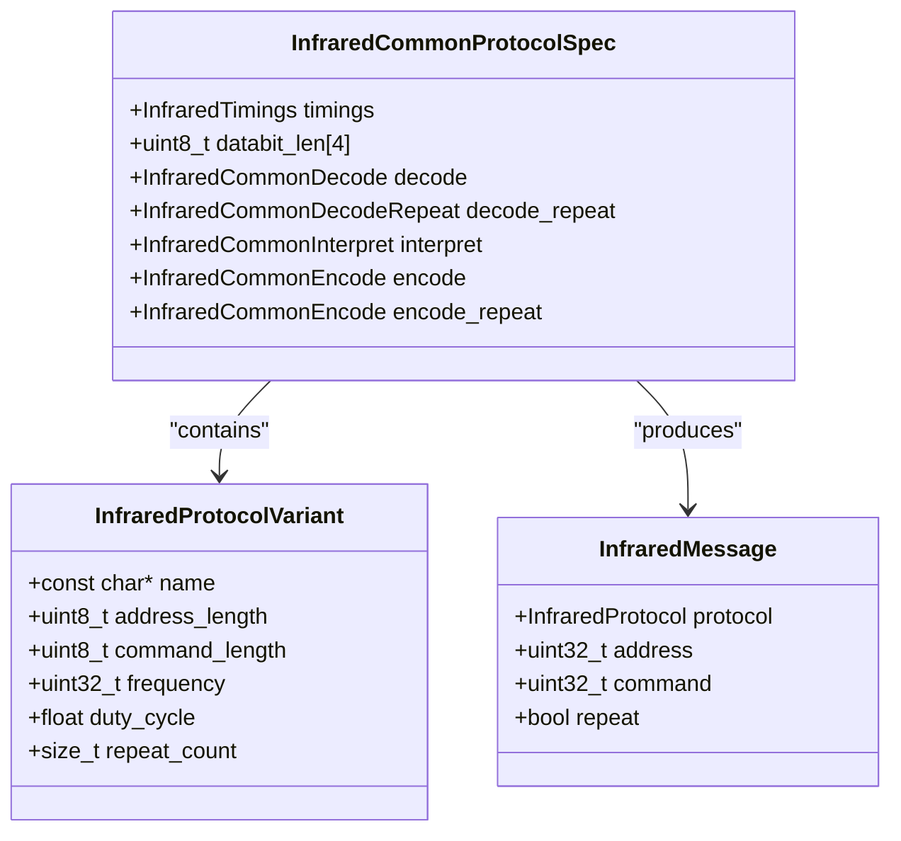
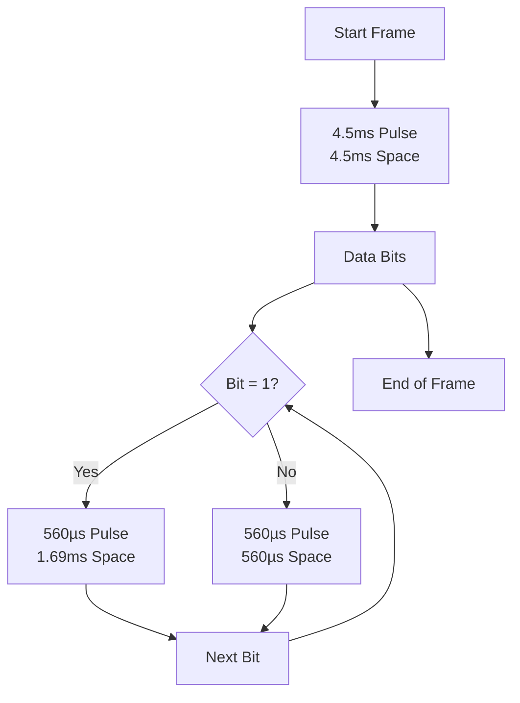
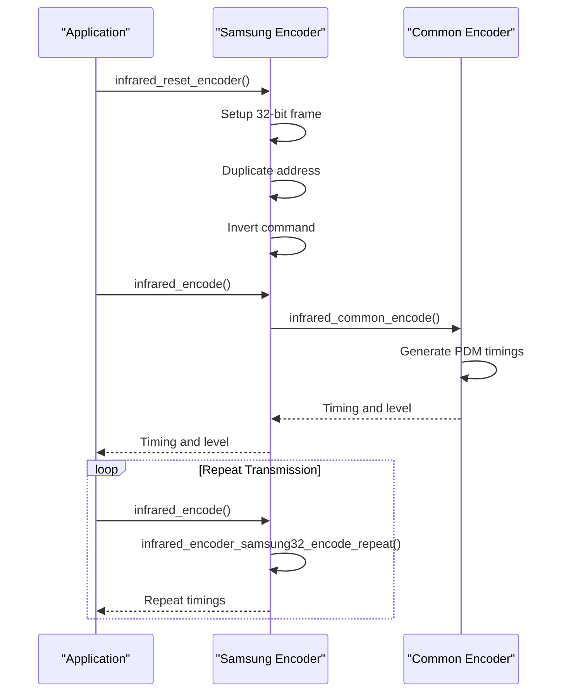
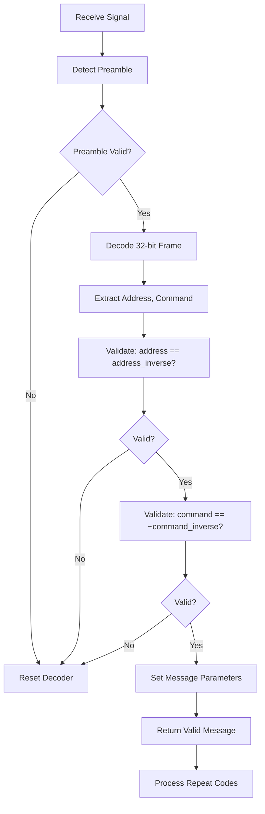

# Samsung Protocol

<cite>
**Referenced Files in This Document**   
- [infrared_protocol_samsung.c](file://lib/infrared/encoder_decoder/samsung/infrared_protocol_samsung.c)
- [infrared_protocol_samsung.h](file://lib/infrared/encoder_decoder/samsung/infrared_protocol_samsung.h)
- [infrared_protocol_samsung_i.h](file://lib/infrared/encoder_decoder/samsung/infrared_protocol_samsung_i.h)
- [infrared_decoder_samsung.c](file://lib/infrared/encoder_decoder/samsung/infrared_decoder_samsung.c)
- [infrared_encoder_samsung.c](file://lib/infrared/encoder_decoder/samsung/infrared_encoder_samsung.c)
- [infrared.c](file://lib/infrared/encoder_decoder/infrared.c)
- [infrared.h](file://lib/infrared/encoder_decoder/infrared.h)
- [infrared_common_i.h](file://lib/infrared/encoder_decoder/common/infrared_common_i.h)
- [infrared_worker.c](file://lib/infrared/worker/infrared_worker.c)
- [Samsung.ir](file://applications/main/infrared/resources/infrared/Samsung.ir)
- [test_samsung32.irtest](file://applications/debug/unit_tests/resources/unit_tests/infrared/test_samsung32.irtest)
</cite>

## Table of Contents
1. [Introduction](#introduction)
2. [Protocol Overview](#protocol-overview)
3. [Timing Parameters](#timing-parameters)
4. [Frame Structure](#frame-structure)
5. [Encoder Implementation](#encoder-implementation)
6. [Decoder Implementation](#decoder-implementation)
7. [Configuration Options](#configuration-options)
8. [Compatibility and Error Handling](#compatibility-and-error-handling)
9. [Performance Considerations](#performance-considerations)
10. [Troubleshooting Guide](#troubleshooting-guide)

## Introduction
The Samsung infrared protocol implementation in the Flipper Zero firmware provides comprehensive support for Samsung's 38kHz infrared remote control systems. This document details the technical specifications, implementation architecture, and operational characteristics of the Samsung32 protocol as implemented in the firmware. The protocol is designed to handle the unique pulse width modulation scheme and 32-bit frame structure used by Samsung devices, enabling reliable transmission and reception of infrared commands for various Samsung television, audio, and home entertainment products.

**Section sources**
- [infrared_protocol_samsung.c](file://lib/infrared/encoder_decoder/samsung/infrared_protocol_samsung.c#L1-L39)
- [infrared_protocol_samsung.h](file://lib/infrared/encoder_decoder/samsung/infrared_protocol_samsung.h#L1-L31)

## Protocol Overview
The Samsung infrared protocol operates at a carrier frequency of 38kHz with a duty cycle of approximately 33%, as defined by the constants `INFRARED_COMMON_CARRIER_FREQUENCY` and `INFRARED_COMMON_DUTY_CYCLE` in the infrared header file. The protocol uses pulse distance modulation (PDM) encoding, where binary data is represented by varying the length of the space (off) period following a fixed pulse (on) period. This implementation supports the Samsung32 variant, which utilizes a 32-bit frame structure consisting of 8-bit address, 8-bit command, 8-bit inverse command, and 8-bit inverse address fields.

The protocol specification is defined in the `infrared_protocol_samsung32` structure, which contains timing parameters, data bit length, and function pointers for encoding, decoding, and repeat handling. The protocol variant structure specifies the address and command lengths, frequency, duty cycle, and minimum repeat count. This modular design allows the firmware to support multiple infrared protocols simultaneously while maintaining code reusability through common encoding and decoding functions.



**Diagram sources**
- [infrared_protocol_samsung.c](file://lib/infrared/encoder_decoder/samsung/infrared_protocol_samsung.c#L3-L23)
- [infrared.h](file://lib/infrared/encoder_decoder/infrared.h#L42-L47)
- [infrared_protocol_samsung_i.h](file://lib/infrared/encoder_decoder/samsung/infrared_protocol_samsung_i.h#L5-L26)

**Section sources**
- [infrared_protocol_samsung.c](file://lib/infrared/encoder_decoder/samsung/infrared_protocol_samsung.c#L3-L39)
- [infrared.h](file://lib/infrared/encoder_decoder/infrared.h#L11-L12)
- [infrared_protocol_samsung_i.h](file://lib/infrared/encoder_decoder/samsung/infrared_protocol_samsung_i.h#L5-L26)

## Timing Parameters
The Samsung32 protocol employs specific timing parameters for reliable signal transmission and reception. The start frame begins with a leading pulse of 4.5ms followed by a 4.5ms space, defined by the constants `INFRARED_SAMSUNG_PREAMBLE_MARK` and `INFRARED_SAMSUNG_PREAMBLE_SPACE`. For data encoding, a binary 1 is represented by a 560µs pulse followed by a 1.69ms space, while a binary 0 is represented by a 560µs pulse followed by a 560µs space. These values are defined as `INFRARED_SAMSUNG_BIT1_MARK`, `INFRARED_SAMSUNG_BIT1_SPACE`, `INFRARED_SAMSUNG_BIT0_MARK`, and `INFRARED_SAMSUNG_BIT0_SPACE` in the protocol header file.

The protocol includes tolerance values to accommodate timing variations in real-world conditions. The preamble tolerance is set to 200µs (`INFRARED_SAMSUNG_PREAMBLE_TOLERANCE`), while the bit timing tolerance is 120µs (`INFRARED_SAMSUNG_BIT_TOLERANCE`). These tolerances allow the decoder to successfully interpret signals even with minor timing deviations caused by distance, battery level, or environmental factors. The repeat code interval is defined with a minimum pause of 30ms and maximum pause of 140ms, with specific repeat pause values of 46ms and 97ms used in the transmission sequence.



**Diagram sources**
- [infrared_protocol_samsung_i.h](file://lib/infrared/encoder_decoder/samsung/infrared_protocol_samsung_i.h#L5-L10)
- [infrared_protocol_samsung_i.h](file://lib/infrared/encoder_decoder/samsung/infrared_protocol_samsung_i.h#L25-L26)

**Section sources**
- [infrared_protocol_samsung_i.h](file://lib/infrared/encoder_decoder/samsung/infrared_protocol_samsung_i.h#L5-L26)

## Frame Structure
The Samsung32 protocol utilizes a 32-bit frame structure that provides device-specific addressing and command encoding. The frame consists of four 8-bit fields: address, address inverse, command, and command inverse. This structure is implemented in the encoder function `infrared_encoder_samsung32_reset`, where the address is duplicated in the first two bytes, the command is placed in the third byte, and the inverse of the command is placed in the fourth byte. This redundancy enhances error detection capabilities, as the decoder verifies that the received command matches the inverse of the received inverse command.

The address field (8 bits) identifies the target device type or model, allowing multiple Samsung devices to coexist without interference. The command field (8 bits) specifies the specific function to be executed, such as power on/off, volume control, or channel selection. The use of inverse fields provides a simple checksum mechanism, where the decoder validates that `command == ~command_inverse` and `address == address_inverse`. This error detection method helps prevent erroneous commands from being executed due to transmission errors or interference.

```mermaid
erDiagram
FRAME {
uint8_t address PK
uint8_t address_inverse
uint8_t command
uint8_t command_inverse
}
FRAME ||--o{ DEVICE : "controls"
FRAME ||--o{ COMMAND : "executes"
class FRAME "32-bit Frame Structure"
class DEVICE "Samsung Devices"
class COMMAND "Remote Commands"
```

**Diagram sources**
- [infrared_encoder_samsung.c](file://lib/infrared/encoder_decoder/samsung/infrared_encoder_samsung.c#L21-L29)
- [infrared_decoder_samsung.c](file://lib/infrared/encoder_decoder/samsung/infrared_decoder_samsung.c#L12-L24)

**Section sources**
- [infrared_encoder_samsung.c](file://lib/infrared/encoder_decoder/samsung/infrared_encoder_samsung.c#L21-L29)
- [infrared_decoder_samsung.c](file://lib/infrared/encoder_decoder/samsung/infrared_decoder_samsung.c#L12-L24)

## Encoder Implementation
The Samsung protocol encoder is implemented in the `infrared_encoder_samsung.c` file and follows a state-based approach for generating infrared signals. The encoder initialization function `infrared_encoder_samsung32_alloc` allocates memory for the encoder structure by calling the common encoder allocation function with the Samsung protocol specification. The reset function `infrared_encoder_samsung32_reset` prepares the encoder for transmission by setting up the 32-bit data frame based on the provided message's address and command values.

The encoding process is handled by the `infrared_encoder_samsung32_encode` function, which delegates to the common encoding function `infrared_common_encode`. This function generates the timing sequence for the carrier signal according to the pulse distance modulation scheme. For repeat transmissions, the `infrared_encoder_samsung32_encode_repeat` function manages the specific timing sequence required for Samsung repeat codes, which includes a 4.5ms pulse, 4.5ms space, followed by the first bit of the data frame. The repeat timing array contains the specific durations for the repeat sequence, ensuring compatibility with Samsung device expectations.



**Diagram sources**
- [infrared_encoder_samsung.c](file://lib/infrared/encoder_decoder/samsung/infrared_encoder_samsung.c#L15-L69)
- [infrared_protocol_samsung.c](file://lib/infrared/encoder_decoder/samsung/infrared_protocol_samsung.c#L22-L23)

**Section sources**
- [infrared_encoder_samsung.c](file://lib/infrared/encoder_decoder/samsung/infrared_encoder_samsung.c#L15-L69)
- [infrared_protocol_samsung.c](file://lib/infrared/encoder_decoder/samsung/infrared_protocol_samsung.c#L22-L23)

## Decoder Implementation
The Samsung protocol decoder implementation provides robust frame synchronization and error detection capabilities. The decoder initialization function `infrared_decoder_samsung32_alloc` allocates memory for the decoder structure by calling the common decoder allocation function with the Samsung protocol specification. The core decoding process is managed by the `infrared_common_decode` function, which handles the state machine for preamble detection, bit decoding, and frame completion.

The `infrared_decoder_samsung32_interpret` function performs the critical validation of the received frame by checking that the address fields match and that the command field is the inverse of the command inverse field. This validation ensures data integrity and prevents erroneous commands from being processed. The function sets the message fields accordingly and returns true if the validation passes, indicating a valid message has been received. For repeat code detection, the `infrared_decoder_samsung32_decode_repeat` function analyzes the timing sequence following a message to determine if it represents a repeat command, using specific timing thresholds for the pause, mark, and space durations.



**Diagram sources**
- [infrared_decoder_samsung.c](file://lib/infrared/encoder_decoder/samsung/infrared_decoder_samsung.c#L8-L27)
- [infrared_decoder_samsung.c](file://lib/infrared/encoder_decoder/samsung/infrared_decoder_samsung.c#L30-L53)
- [infrared_common_decoder.c](file://lib/infrared/encoder_decoder/common/infrared_common_decoder.c#L220-L276)

**Section sources**
- [infrared_decoder_samsung.c](file://lib/infrared/encoder_decoder/samsung/infrared_decoder_samsung.c#L8-L53)
- [infrared_common_decoder.c](file://lib/infrared/encoder_decoder/common/infrared_common_decoder.c#L220-L276)

## Configuration Options
The Samsung protocol implementation provides several configuration options to support device customization and adapt to varying environmental conditions. Device code customization is achieved through the address field in the infrared message, allowing users to target specific Samsung device models or types. Command mapping is handled through the command field, with predefined command codes for common functions like power, volume, and navigation.

Timing tolerance adjustments are implemented through the preamble and bit tolerance constants, which can be modified to improve reliability under different conditions. The `INFRARED_SAMSUNG_PREAMBLE_TOLERANCE` and `INFRARED_SAMSUNG_BIT_TOLERANCE` values allow the decoder to accept timing variations within specified ranges, accommodating differences in transmitter quality, battery levels, and transmission distances. The minimum repeat count, defined by `INFRARED_SAMSUNG_REPEAT_COUNT_MIN`, determines how many times a command is transmitted to ensure reliable reception.

Additional configuration parameters include the silence time (`INFRARED_SAMSUNG_SILENCE`) and minimum split time (`INFRARED_SAMSUNG_MIN_SPLIT_TIME`), which control the timing between consecutive transmissions and help prevent signal collisions. These parameters can be adjusted to optimize performance for specific use cases or to improve compatibility with particular Samsung device variants that may have slightly different timing requirements.

**Section sources**
- [infrared_protocol_samsung_i.h](file://lib/infrared/encoder_decoder/samsung/infrared_protocol_samsung_i.h#L11-L22)
- [infrared_protocol_samsung.c](file://lib/infrared/encoder_decoder/samsung/infrared_protocol_samsung.c#L31-L32)

## Compatibility and Error Handling
The Samsung protocol implementation addresses compatibility issues with different Samsung device variants through adaptive timing detection and robust error handling mechanisms. The protocol's tolerance parameters allow it to work with a range of Samsung devices that may have slight variations in their expected timing parameters. The preamble tolerance of 200µs and bit tolerance of 120µs accommodate manufacturing differences between remote controls and receiver units.

Error detection is implemented through multiple mechanisms. The frame validation in the decoder checks both the address redundancy (address == address_inverse) and command integrity (command == ~command_inverse), providing protection against transmission errors. The common decoder infrastructure includes overrun detection and timeout handling, which reset the decoder state when invalid or incomplete signals are received. The unit test file `test_samsung32.irtest` contains test cases that verify the decoder's ability to correctly interpret various command sequences and handle repeat codes.

For problematic devices or challenging environments, the implementation provides solutions such as adaptive timing detection through the tolerance parameters and configurable repeat counts. The worker thread infrastructure in `infrared_worker.c` manages transmission and reception in separate threads, preventing timing issues that could arise from blocking operations. The notification system provides visual feedback during transmission, helping users diagnose alignment or distance issues that might affect signal reliability.

**Section sources**
- [infrared_decoder_samsung.c](file://lib/infrared/encoder_decoder/samsung/infrared_decoder_samsung.c#L18-L24)
- [infrared_worker.c](file://lib/infrared/worker/infrared_worker.c#L119-L134)
- [test_samsung32.irtest](file://applications/debug/unit_tests/resources/unit_tests/infrared/test_samsung32.irtest#L1-L536)

## Performance Considerations
Signal reliability across different transmission distances is influenced by several factors in the Samsung protocol implementation. The 38kHz carrier frequency provides a good balance between range and power consumption, while the 33% duty cycle optimizes battery life in the transmitting device. At close range (within 5 meters), the signal typically achieves high reliability with minimal errors. As distance increases, signal attenuation and interference become more significant, potentially requiring multiple transmissions to ensure command delivery.

Battery-saving transmission modes are implemented through the repeat count mechanism, where the minimum repeat count is set to 1 but can be increased for challenging conditions. The firmware optimizes power usage by only activating the infrared transmitter during signal transmission and using efficient encoding algorithms that minimize processing overhead. The worker thread design allows for non-blocking transmission, enabling the main application to continue operating while infrared signals are being sent.

Environmental factors such as ambient light, physical obstructions, and electromagnetic interference can affect signal reliability. The implementation mitigates these issues through the use of appropriate timing tolerances and error detection mechanisms. For critical applications, users can improve reliability by ensuring clear line-of-sight between the transmitter and receiver, minimizing background infrared noise, and maintaining adequate battery levels in both the Flipper Zero device and the target Samsung appliance.

**Section sources**
- [infrared_transmit.c](file://lib/infrared/worker/infrared_transmit.c#L97-L117)
- [infrared_worker.c](file://lib/infrared/worker/infrared_worker.c#L338-L648)
- [infrared.h](file://lib/infrared/encoder_decoder/infrared.h#L11-L12)

## Troubleshooting Guide
Common issues with Samsung protocol implementation typically relate to signal reception, device compatibility, and configuration errors. When experiencing unreliable signal transmission, verify that the address and command codes match those expected by the target Samsung device. Consult the `Samsung.ir` file in the resources directory for examples of valid command mappings for various Samsung products.

If commands are not being recognized by the target device, check the following:
- Ensure the Flipper Zero's infrared LED is properly aligned with the Samsung device's receiver
- Verify that the battery level in the Flipper Zero is sufficient for reliable transmission
- Confirm that no bright light sources are interfering with the infrared signal
- Test with increased repeat counts to improve reception reliability

For decoding issues, ensure that the receiving device is within the optimal range (typically 3-5 meters) and that there are no physical obstructions. The unit test file `test_samsung32.irtest` can be used to verify the correctness of the implementation by comparing actual behavior against expected results. If specific Samsung device variants are not responding correctly, consider adjusting the timing tolerance parameters to accommodate potential differences in the device's receiver specifications.

**Section sources**
- [Samsung.ir](file://applications/main/infrared/resources/infrared/Samsung.ir#L77-L164)
- [test_samsung32.irtest](file://applications/debug/unit_tests/resources/unit_tests/infrared/test_samsung32.irtest#L1-L536)
- [infrared_worker.c](file://lib/infrared/worker/infrared_worker.c#L261-L294)