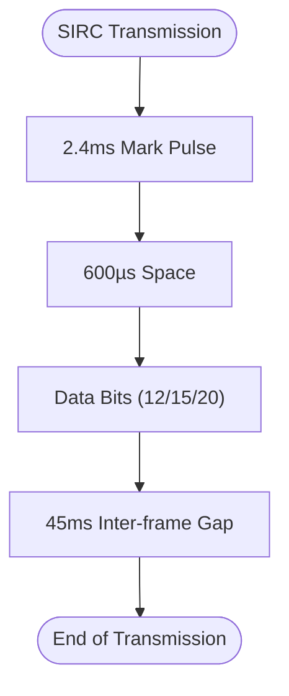
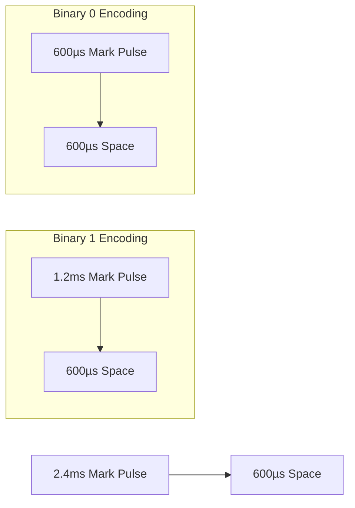
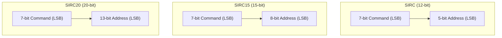
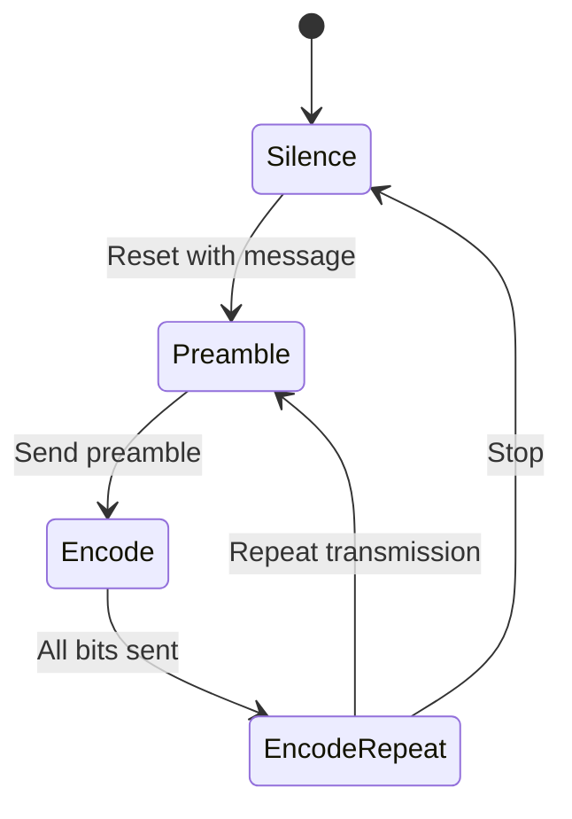
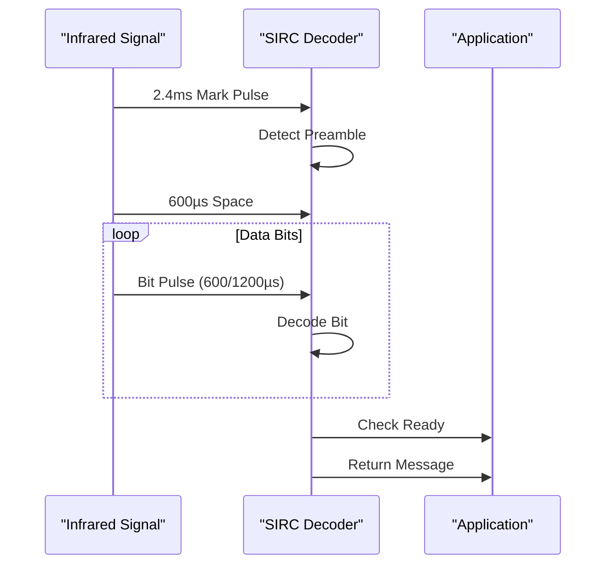

# Sony SIRC Protocol

<cite>
**Referenced Files in This Document**   
- [infrared_protocol_sirc.h](file://lib/infrared/encoder_decoder/sirc/infrared_protocol_sirc.h)
- [infrared_protocol_sirc.c](file://lib/infrared/encoder_decoder/sirc/infrared_protocol_sirc.c)
- [infrared_protocol_sirc_i.h](file://lib/infrared/encoder_decoder/sirc/infrared_protocol_sirc_i.h)
- [infrared_encoder_sirc.c](file://lib/infrared/encoder_decoder/sirc/infrared_encoder_sirc.c)
- [infrared_decoder_sirc.c](file://lib/infrared/encoder_decoder/sirc/infrared_decoder_sirc.c)
- [infrared_common_i.h](file://lib/infrared/encoder_decoder/common/infrared_common_i.h)
- [infrared.h](file://lib/infrared/encoder_decoder/infrared.h)
- [infrared_i.h](file://lib/infrared/encoder_decoder/infrared_i.h)
</cite>

## Table of Contents
1. [Introduction](#introduction)
2. [Protocol Overview](#protocol-overview)
3. [Timing Parameters](#timing-parameters)
4. [Frame Structure](#frame-structure)
5. [Encoder Implementation](#encoder-implementation)
6. [Decoder Implementation](#decoder-implementation)
7. [Configuration Options](#configuration-options)
8. [Signal Interference and Solutions](#signal-interference-and-solutions)
9. [Performance Considerations](#performance-considerations)
10. [Conclusion](#conclusion)

## Introduction
The Sony SIRC (Sony Infrared Remote Control) protocol is a pulse width modulation (PWM) based infrared communication standard used in Sony consumer electronics. This document provides a comprehensive technical analysis of the SIRC protocol implementation in the Flipper Zero firmware, covering its timing parameters, frame structure, encoding and decoding mechanisms, and configuration options. The implementation supports three variants of the protocol with different bit lengths: SIRC (12-bit), SIRC15 (15-bit), and SIRC20 (20-bit).

**Section sources**
- [infrared_protocol_sirc.h](file://lib/infrared/encoder_decoder/sirc/infrared_protocol_sirc.h#L5-L24)
- [infrared.h](file://lib/infrared/encoder_decoder/infrared.h#L32-L34)

## Protocol Overview
The Sony SIRC protocol operates at a carrier frequency of 40kHz with a duty cycle of approximately 33%. It uses pulse width modulation for data encoding, where binary values are represented by different pulse widths. The protocol features a variable-length frame structure that can be 12, 15, or 20 bits long, providing flexibility for different device addressing schemes. Each transmission begins with a leading pulse followed by the data bits and concludes with a 45ms inter-frame gap before the next transmission can begin.

The implementation in the Flipper Zero firmware follows a modular design pattern, with separate encoder and decoder components that adhere to a common infrared protocol interface. The protocol supports automatic detection of the frame length variant during decoding, allowing the system to handle all three SIRC variants seamlessly.

**Diagram sources **
- [infrared_protocol_sirc_i.h](file://lib/infrared/encoder_decoder/sirc/infrared_protocol_sirc_i.h#L7-L8)
- [infrared_protocol_sirc.h](file://lib/infrared/encoder_decoder/sirc/infrared_protocol_sirc.h#L13-L19)

**Section sources**
- [infrared_protocol_sirc_i.h](file://lib/infrared/encoder_decoder/sirc/infrared_protocol_sirc_i.h#L5-L6)
- [infrared_protocol_sirc.c](file://lib/infrared/encoder_decoder/sirc/infrared_protocol_sirc.c#L27-L52)

## Timing Parameters
The SIRC protocol employs precise timing parameters for reliable communication. The transmission begins with a 2.4ms mark pulse (carrier active) followed by a 600µs space (no carrier). For data encoding, binary 1 is represented by a 1.2ms mark pulse followed by a 600µs space, while binary 0 is represented by a 600µs mark pulse followed by a 600µs space. This pulse width modulation scheme allows for robust data transmission with good noise immunity.

The inter-frame gap is set to 45ms, which serves as a delimiter between consecutive transmissions. The implementation includes tolerance values for timing detection: 200µs for preamble detection and 120µs for bit detection, allowing for minor variations in timing due to hardware differences or environmental factors.

**Diagram sources **
- [infrared_protocol_sirc_i.h](file://lib/infrared/encoder_decoder/sirc/infrared_protocol_sirc_i.h#L9-L12)
- [infrared_protocol_sirc_i.h](file://lib/infrared/encoder_decoder/sirc/infrared_protocol_sirc_i.h#L13-L14)

**Section sources**
- [infrared_protocol_sirc_i.h](file://lib/infrared/encoder_decoder/sirc/infrared_protocol_sirc_i.h#L7-L14)
- [infrared_protocol_sirc.c](file://lib/infrared/encoder_decoder/sirc/infrared_protocol_sirc.c#L6-L13)

## Frame Structure
The SIRC protocol features a variable-length frame structure with three supported variants: 12-bit, 15-bit, and 20-bit. All variants share the same basic structure consisting of a command field and an address field, but differ in the address field length. The command field is always 7 bits long and contains the operation to be performed, while the address field identifies the target device.

In the 12-bit variant (SIRC), the address field is 5 bits long, allowing for 32 unique device addresses. The 15-bit variant (SIRC15) extends the address field to 8 bits, supporting 256 unique addresses. The 20-bit variant (SIRC20) further extends the address field to 13 bits, providing support for 8,192 unique addresses. All data is transmitted with the least significant bit (LSB) first.

**Diagram sources **
- [infrared_protocol_sirc.h](file://lib/infrared/encoder_decoder/sirc/infrared_protocol_sirc.h#L16-L19)
- [infrared_protocol_sirc.c](file://lib/infrared/encoder_decoder/sirc/infrared_protocol_sirc.c#L29-L30)

**Section sources**
- [infrared_protocol_sirc.h](file://lib/infrared/encoder_decoder/sirc/infrared_protocol_sirc.h#L16-L19)
- [infrared_protocol_sirc.c](file://lib/infrared/encoder_decoder/sirc/infrared_protocol_sirc.c#L27-L52)

## Encoder Implementation
The SIRC encoder implementation in the Flipper Zero firmware follows a state machine pattern with four states: silence, preamble, encode, and encode repeat. When initializing the encoder with a message, the system determines the appropriate variant (SIRC, SIRC15, or SIRC20) based on the protocol field in the message structure. The encoder then packs the command and address fields into a data buffer according to the specified bit length.

The encoding process begins with the 2.4ms preamble mark pulse, followed by the 600µs space. Data bits are then transmitted using pulse width modulation, with the bit length and timing controlled by the common infrared encoding functions. After transmitting all data bits, the encoder enters the repeat state, where it generates the 45ms inter-frame gap before potentially repeating the transmission.

**Diagram sources **
- [infrared_encoder_sirc.c](file://lib/infrared/encoder_decoder/sirc/infrared_encoder_sirc.c#L4-L27)
- [infrared_common_i.h](file://lib/infrared/encoder_decoder/common/infrared_common_i.h#L36-L40)

**Section sources**
- [infrared_encoder_sirc.c](file://lib/infrared/encoder_decoder/sirc/infrared_encoder_sirc.c#L4-L68)
- [infrared_protocol_sirc.c](file://lib/infrared/encoder_decoder/sirc/infrared_protocol_sirc.c#L21-L22)

## Decoder Implementation
The SIRC decoder implementation features automatic format detection and frame validation. The decoder uses a common pulse distance decoding algorithm that measures the duration of mark and space pulses to determine binary values. When a valid preamble is detected (2.4ms mark followed by 600µs space), the decoder enters the data reception phase.

The decoder counts the number of received bits and uses this count to determine which SIRC variant is being received (12, 15, or 20 bits). After receiving all data bits, the decoder waits for a silence period to confirm the end of transmission. The received data is then interpreted according to the detected variant, with the command and address fields extracted and stored in the message structure.

**Diagram sources **
- [infrared_decoder_sirc.c](file://lib/infrared/encoder_decoder/sirc/infrared_decoder_sirc.c#L8-L39)
- [infrared_common_i.h](file://lib/infrared/encoder_decoder/common/infrared_common_i.h#L29-L33)

**Section sources**
- [infrared_decoder_sirc.c](file://lib/infrared/encoder_decoder/sirc/infrared_decoder_sirc.c#L8-L39)
- [infrared_protocol_sirc.c](file://lib/infrared/encoder_decoder/sirc/infrared_protocol_sirc.c#L20-L21)

## Configuration Options
The SIRC protocol implementation provides several configuration options through the infrared protocol variant structure. The bit length selection is determined by the protocol field in the InfraredMessage structure, which can be set to InfraredProtocolSIRC, InfraredProtocolSIRC15, or InfraredProtocolSIRC20. The address mapping is handled automatically based on the selected protocol variant, with the appropriate number of bits extracted for the address field.

The timing parameters are defined as constants in the implementation, but could be adjusted for different Sony device models by modifying the preamble and bit timing values. The minimum repeat count is set to 3 for all variants, reflecting the typical behavior of Sony remotes which send multiple transmissions for reliability. The carrier frequency (40kHz) and duty cycle (33%) are fixed in the implementation but could be modified to support variations in different Sony products.

**Section sources**
- [infrared_protocol_sirc.c](file://lib/infrared/encoder_decoder/sirc/infrared_protocol_sirc.c#L27-L52)
- [infrared_protocol_sirc_i.h](file://lib/infrared/encoder_decoder/sirc/infrared_protocol_sirc_i.h#L5-L6)

## Signal Interference and Solutions
The 40kHz carrier frequency used by the SIRC protocol can be susceptible to interference from certain types of artificial lighting, particularly fluorescent lights which may emit electromagnetic noise in the same frequency range. The implementation addresses this issue through several mechanisms. The preamble detection includes a tolerance of 200µs, allowing for minor timing variations caused by interference.

The pulse distance decoding algorithm is inherently more robust against noise than other modulation schemes, as it relies on the relative timing between pulses rather than absolute signal levels. For severe interference conditions, the system could implement adaptive threshold detection by analyzing the signal quality and adjusting the timing tolerance values dynamically. Additionally, the requirement for multiple consecutive transmissions (minimum of 3 repeats) provides inherent error detection, as corrupted frames are unlikely to be consistently received across multiple transmissions.

**Section sources**
- [infrared_protocol_sirc_i.h](file://lib/infrared/encoder_decoder/sirc/infrared_protocol_sirc_i.h#L13-L14)
- [infrared_protocol_sirc.c](file://lib/infrared/encoder_decoder/sirc/infrared_protocol_sirc.c#L33-L34)

## Performance Considerations
The SIRC protocol implementation includes several performance optimizations for battery efficiency and transmission reliability. During extended transmission sequences, the encoder minimizes power consumption by only activating the infrared emitter during the mark pulses, with the duty cycle limited to approximately 33% of the total transmission time.

The receiver gain settings are optimized for maximum range by using the common infrared receiver functions which include automatic gain control. The 45ms inter-frame gap provides sufficient time for the receiver to reset and prepare for the next transmission, reducing the likelihood of missed frames during rapid button presses. For applications requiring high transmission rates, the implementation could be optimized by reducing the inter-frame gap, though this would need to be balanced against the increased power consumption and potential for transmission errors.

**Section sources**
- [infrared_protocol_sirc_i.h](file://lib/infrared/encoder_decoder/sirc/infrared_protocol_sirc_i.h#L6-L7)
- [infrared_protocol_sirc_i.h](file://lib/infrared/encoder_decoder/sirc/infrared_protocol_sirc_i.h#L17-L18)

## Conclusion
The Sony SIRC protocol implementation in the Flipper Zero firmware provides a robust and flexible solution for controlling Sony devices via infrared. The support for three frame length variants (12, 15, and 20 bits) ensures compatibility with a wide range of Sony products, while the automatic format detection simplifies the user experience. The precise timing parameters and pulse width modulation scheme enable reliable communication, and the modular design allows for easy integration with the broader infrared functionality of the device. With proper configuration and consideration of environmental factors like signal interference, the implementation delivers excellent performance and range for controlling Sony devices.