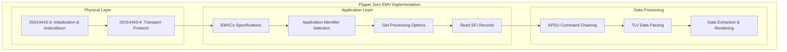
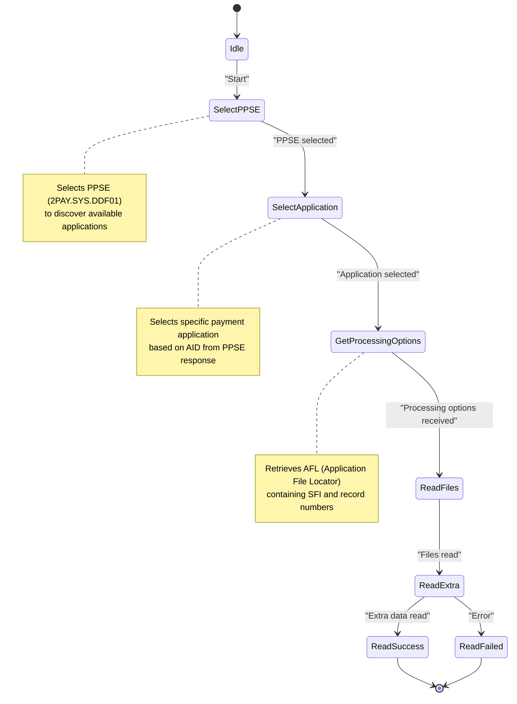
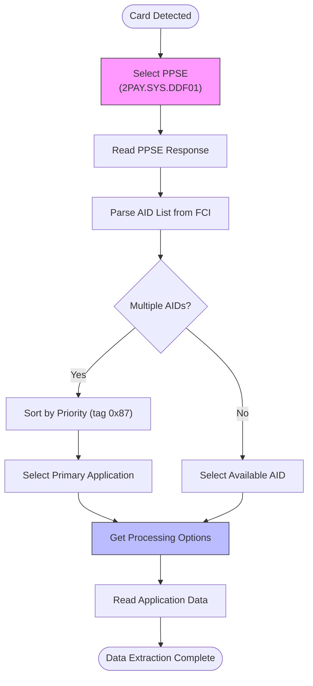
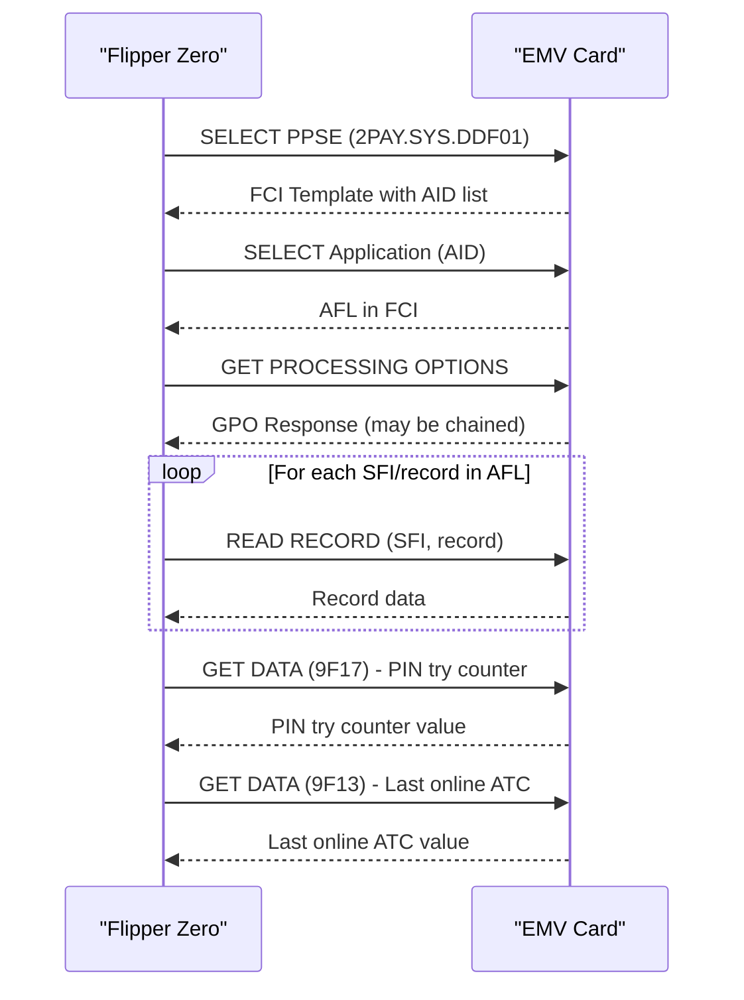
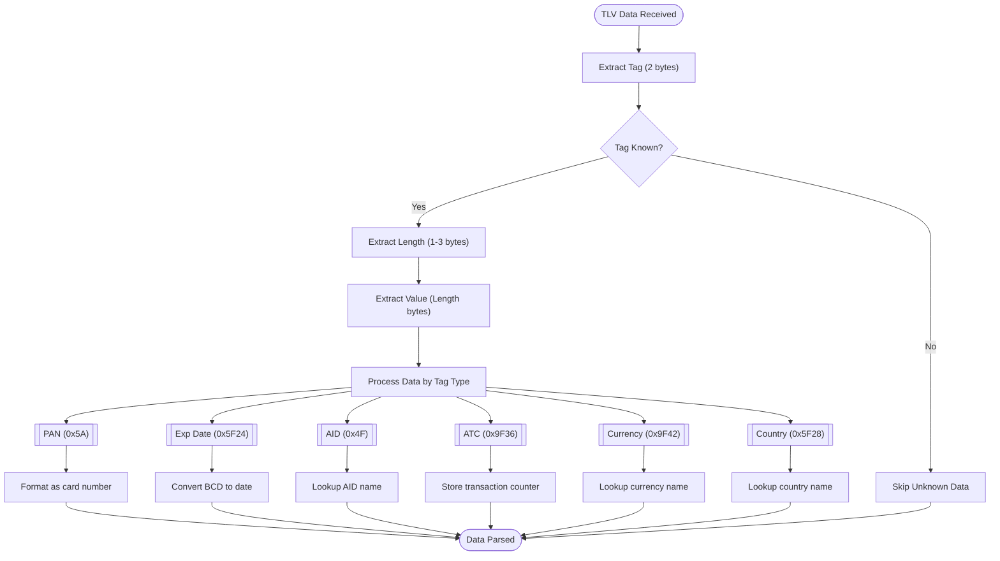

# EMV Protocol

<cite>
**Referenced Files in This Document**   
- [emv.h](file://lib/nfc/protocols/emv/emv.h)
- [emv.c](file://lib/nfc/protocols/emv/emv.c)
- [emv_poller.h](file://lib/nfc/protocols/emv/emv_poller.h)
- [emv_poller.c](file://lib/nfc/protocols/emv/emv_poller.c)
- [emv_poller_i.h](file://lib/nfc/protocols/emv/emv_poller_i.h)
- [nfc_emv_parser.h](file://applications/main/nfc/helpers/nfc_emv_parser.h)
- [nfc_emv_parser.c](file://applications/main/nfc/helpers/nfc_emv_parser.c)
- [emv.c](file://applications/main/nfc/plugins/supported_cards/emv.c)
- [emv.apduscr](file://applications/external/nfc_apdu_runner/apdu_script/emv.apduscr)
</cite>

## Table of Contents
1. [Introduction](#introduction)
2. [Protocol Stack Architecture](#protocol-stack-architecture)
3. [Transaction Flow](#transaction-flow)
4. [AID Selection Process](#aid-selection-process)
5. [APDU Command Chaining](#apdu-command-chaining)
6. [TLV Data Parsing](#tlv-data-parsing)
7. [Card Data Extraction](#card-data-extraction)
8. [Security Considerations](#security-considerations)

## Introduction
The Flipper Zero implements the EMV contactless payment protocol to read data from contactless credit and debit cards. This implementation follows the EMVCo specifications at the application layer while utilizing ISO14443-3/4 standards at the physical layer for communication with payment cards. The system is designed to extract non-sensitive card information such as card numbers, expiration dates, and transaction counters through read-only access, ensuring compliance with security standards while providing useful functionality for users.

**Section sources**
- [emv.h](file://lib/nfc/protocols/emv/emv.h#L1-L153)
- [emv.c](file://lib/nfc/protocols/emv/emv.c#L1-L217)

## Protocol Stack Architecture
The EMV implementation in Flipper Zero follows a layered architecture that adheres to international standards. At the physical layer, the system implements ISO14443-3/4 protocols for communication with contactless cards. The ISO14443-4 standard provides the transport protocol for half-duplex block transmission, while ISO14443-3 handles the initialization and anticollision procedures.

At the application layer, the implementation follows EMVCo specifications for payment applications. The core data structure `EmvData` contains both the ISO14443-4A base data and EMV-specific application data. The `EmvApplication` structure stores parsed card information including application identifiers, cardholder data, and transaction details.

The protocol implementation is organized into distinct components:
- Device driver layer for NFC communication
- Protocol-specific poller for EMV card detection
- Application layer for data parsing and rendering
- Storage system for reference data lookup



**Diagram sources**
- [emv.h](file://lib/nfc/protocols/emv/emv.h#L3-L153)
- [emv_poller.h](file://lib/nfc/protocols/emv/emv_poller.h#L1-L60)

**Section sources**
- [emv.h](file://lib/nfc/protocols/emv/emv.h#L3-L153)
- [emv_poller.h](file://lib/nfc/protocols/emv/emv_poller.h#L1-L60)

## Transaction Flow
The transaction flow for EMV contactless card reading follows a standardized sequence of operations defined by EMVCo specifications. The process begins with card detection and proceeds through application selection, data reading, and cryptographic authentication.

The transaction flow is implemented as a state machine in the `EmvPoller` structure, with states defined in `EmvPollerState` enumeration. The flow begins with the `EmvPollerStateIdle` state and progresses through the following stages:

1. **PPSE Selection**: The poller selects the Payment System Environment (PPSE) application using the `emv_poller_select_ppse` function
2. **Application Selection**: The appropriate payment application is selected using `emv_poller_select_application`
3. **Processing Options**: The Get Processing Options (GPO) command retrieves the Application File Locator (AFL)
4. **File Reading**: The system reads records specified in the AFL using `emv_poller_read_afl`
5. **Additional Data**: Extra information such as PIN try counter and last online ATC are retrieved
6. **Completion**: The transaction completes with either success or failure

The state transitions are handled by the `emv_poller_read_handler` array, which maps each state to its corresponding handler function. This design ensures a systematic approach to card data extraction while maintaining compliance with EMVCo timing requirements.



**Diagram sources**
- [emv_poller.c](file://lib/nfc/protocols/emv/emv_poller.c#L1-L207)
- [emv_poller_i.h](file://lib/nfc/protocols/emv/emv_poller_i.h#L1-L53)

**Section sources**
- [emv_poller.c](file://lib/nfc/protocols/emv/emv_poller.c#L1-L207)
- [emv_poller_i.h](file://lib/nfc/protocols/emv/emv_poller_i.h#L1-L53)

## AID Selection Process
The Application Identifier (AID) selection process allows the Flipper Zero to handle multiple payment applications on a single card. The system implements a hierarchical selection process that follows EMVCo standards for application discovery and selection.

The process begins with the selection of the Payment System Environment (PPSE) using the well-known AID "2PAY.SYS.DDF01". The PPSE response contains a list of available payment applications, each identified by its unique AID. The system parses the response to extract AID information and application priorities.

The `EmvApplication` structure stores the selected AID in the `aid` field along with its length in `aid_len`. The selection process considers the priority indicator (tag 0x87) to determine the preferred application when multiple options are available. The implementation supports both primary and secondary selection criteria as defined in EMVCo specifications.

For cards with multiple applications, the system can iterate through available AIDs to extract data from each application. The AID-to-name mapping is handled by the `nfc_emv_parser_get_aid_name` function, which uses a lookup table stored in the device's filesystem to convert AID values to human-readable names.



**Diagram sources**
- [emv_poller.c](file://lib/nfc/protocols/emv/emv_poller.c#L59-L70)
- [nfc_emv_parser.c](file://applications/main/nfc/helpers/nfc_emv_parser.c#L35-L52)

**Section sources**
- [emv_poller.c](file://lib/nfc/protocols/emv/emv_poller.c#L59-L70)
- [nfc_emv_parser.c](file://applications/main/nfc/helpers/nfc_emv_parser.c#L35-L52)

## APDU Command Chaining
The APDU (Application Protocol Data Unit) command chaining implementation in Flipper Zero enables the reading of large data objects that exceed the maximum transmission unit of the contactless interface. The system follows ISO7816-4 standards for APDU structure and EMVCo specifications for command sequences.

APDU commands are structured with a 4-byte header (CLA, INS, P1, P2) followed by optional command data and length fields. The implementation uses the `APDU` structure to represent commands and responses, with a maximum length defined by `MAX_APDU_LEN` (255 bytes).

The command chaining process is handled transparently by the EMV poller, which automatically manages segmented responses. When a response exceeds the maximum length, the reader sends additional GET RESPONSE commands to retrieve the remaining data. This is particularly important for reading large data objects such as transaction logs or public key certificates.

Key APDU commands implemented include:
- SELECT (0x00A4): Application selection
- GET PROCESSING OPTIONS (0x80A8): Retrieval of AFL
- READ RECORD (0x00B2): Reading SFI records
- GET DATA (0x80CA): Retrieving specific data objects

The implementation handles both single and chained responses, ensuring complete data extraction from the card.



**Diagram sources**
- [emv.h](file://lib/nfc/protocols/emv/emv.h#L11-L15)
- [emv_poller.c](file://lib/nfc/protocols/emv/emv_poller.c#L41-L57)

**Section sources**
- [emv.h](file://lib/nfc/protocols/emv/emv.h#L11-L15)
- [emv_poller.c](file://lib/nfc/protocols/emv/emv_poller.c#L41-L57)

## TLV Data Parsing
The TLV (Tag-Length-Value) data parsing implementation extracts structured information from EMV card responses according to ISO7816-4 standards. The system uses a comprehensive set of tag definitions to identify and extract relevant card data.

The implementation defines numerous EMV-specific tags in the `emv.h` header file, including:
- EMV_TAG_PAN (0x5A): Primary Account Number
- EMV_TAG_EXP_DATE (0x5F24): Expiration date
- EMV_TAG_AID (0x4F): Application Identifier
- EMV_TAG_AFL (0x94): Application File Locator
- EMV_TAG_ATC (0x9F36): Application Transaction Counter

The parsing process is implemented in the `emv_parse` function, which extracts data from the `EmvApplication` structure and formats it for display. The parser handles various data formats including:
- Binary-coded decimal (BCD) for dates and numbers
- ASCII text for cardholder names
- Hexadecimal for cryptographic data

The system also implements external data lookup for translating codes to human-readable names. The `nfc_emv_parser_get_country_name` and `nfc_emv_parser_get_currency_name` functions use lookup tables stored in the device's filesystem to convert country and currency codes to their corresponding names.



**Diagram sources**
- [emv.h](file://lib/nfc/protocols/emv/emv.h#L15-L48)
- [emv.c](file://applications/main/nfc/plugins/supported_cards/emv.c#L67-L184)

**Section sources**
- [emv.h](file://lib/nfc/protocols/emv/emv.h#L15-L48)
- [emv.c](file://applications/main/nfc/plugins/supported_cards/emv.c#L67-L184)

## Card Data Extraction
The card data extraction process in Flipper Zero retrieves specific information from contactless payment cards, including card numbers, expiration dates, and transaction counters. The implementation follows a systematic approach to extract non-sensitive data while respecting privacy and security constraints.

Card numbers (PAN) are extracted from the track data or directly from the card's data objects. The PAN is stored in the `pan` field of the `EmvApplication` structure with its length in `pan_len`. The system handles padding characters (typically 'F') in the PAN data and removes them for display purposes.

Expiration dates are retrieved from the card's data objects using tag 0x5F24. The date is stored in BCD format with separate fields for year, month, and day. The implementation converts these values to a human-readable format using the system's locale settings.

Transaction counters, including the Application Transaction Counter (ATC) and Last Online ATC, are extracted using GET DATA commands. The ATC (tag 0x9F36) represents the number of transactions performed on the card, while the Last Online ATC (tag 0x9F13) indicates the counter value at the last online transaction.

The PIN try counter (tag 0x9F17) is also extracted when available, indicating the number of remaining PIN attempts before the card locks. This information is valuable for assessing card status.

```mermaid
table
title "EMV Data Elements and Corresponding Tags"
heading Data Element, EMV Tag, Description, Example
row Primary Account Number, 0x5A, "Card number (PAN)", "4123 5678 9012 3456"
row Expiration Date, 0x5F24, "Card expiration date", "03/28"
row Application AID, 0x4F, "Application Identifier", "A0000000031010"
row Application Label, 0x50, "Application name", "VISA"
row Cardholder Name, 0x5F20, "Name on card", "JOHN DOE"
row ATC, 0x9F36, "Application Transaction Counter", "1,234"
row Last Online ATC, 0x9F13, "Last online transaction counter", "1,200"
row PIN Try Counter, 0x9F17, "Remaining PIN attempts", "3"
row Country Code, 0x5F28, "Card issuing country", "840 (USA)"
row Currency Code, 0x9F42, "Transaction currency", "840 (USD)"
```

**Diagram sources**
- [emv.h](file://lib/nfc/protocols/emv/emv.h#L36-L38)
- [emv.c](file://applications/main/nfc/plugins/supported_cards/emv.c#L71-L172)

**Section sources**
- [emv.h](file://lib/nfc/protocols/emv/emv.h#L36-L38)
- [emv.c](file://applications/main/nfc/plugins/supported_cards/emv.c#L71-L172)

## Security Considerations
The EMV implementation in Flipper Zero incorporates several security and privacy protections to prevent unauthorized scanning and ensure responsible use of the technology. The system is designed with read-only access to payment cards, preventing any modification of card data or fraudulent transactions.

Privacy protections include:
- **Proximity detection**: The device requires deliberate user action to initiate card reading, preventing accidental or unauthorized scanning
- **No sensitive data access**: The implementation cannot access sensitive authentication data such as CVV, PIN, or full track data
- **Limited transaction capability**: The device cannot initiate payment transactions or generate valid payment credentials

The read-only nature of the implementation means that while card numbers and expiration dates can be read, this information alone is insufficient for most fraudulent activities, especially with modern security measures like tokenization and dynamic CVV.

The system also respects card security protocols that may limit the number of read attempts or require additional authentication for certain data elements. The implementation follows EMVCo specifications for error handling and timeout management to prevent denial-of-service conditions on cards.

Additionally, the device's firmware includes safeguards against misuse, with clear documentation about legal and ethical usage guidelines. Users are expected to only read cards they own or have explicit permission to access.

**Section sources**
- [emv_poller.c](file://lib/nfc/protocols/emv/emv_poller.c#L114-L116)
- [emv.c](file://applications/main/nfc/plugins/supported_cards/emv.c#L1-L205)