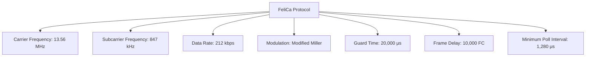
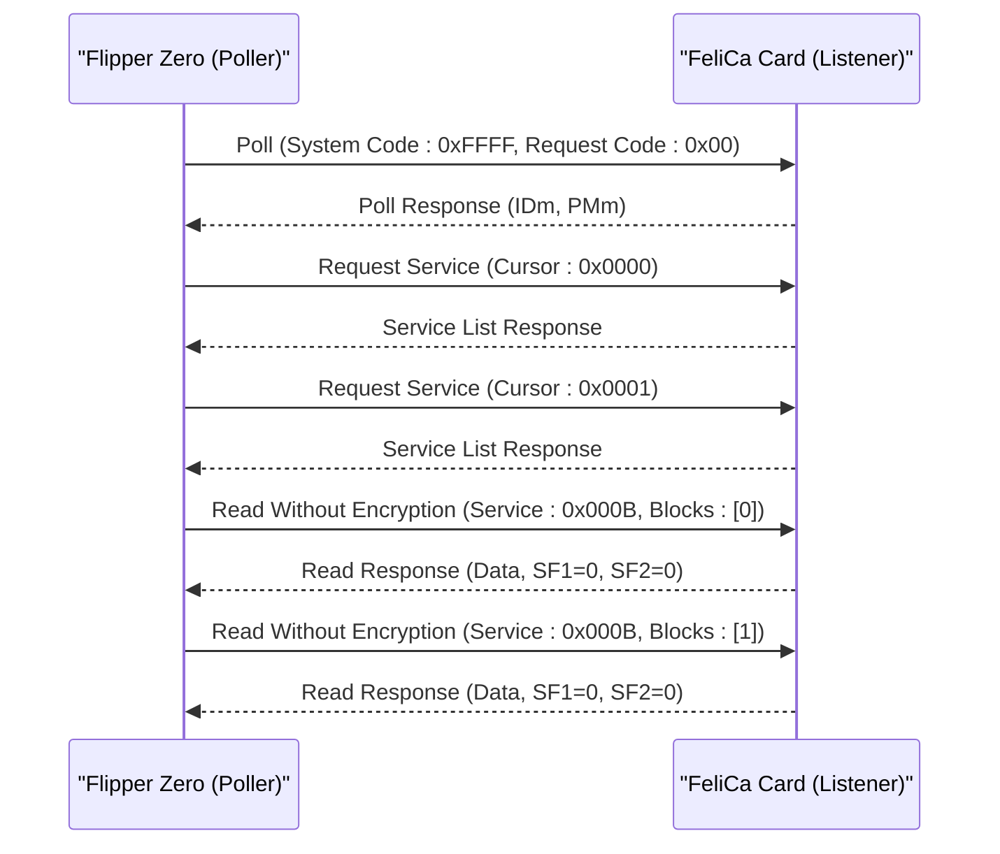
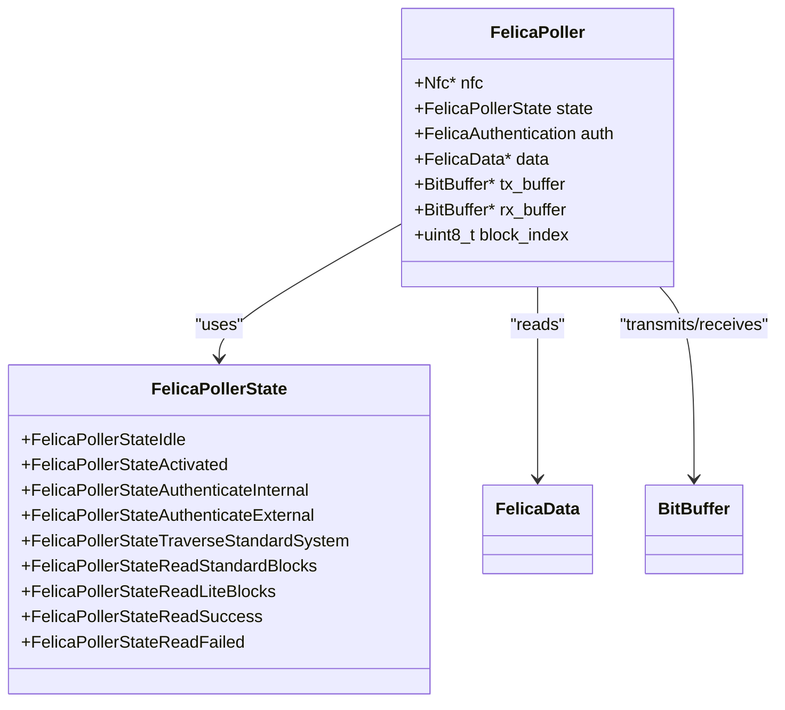
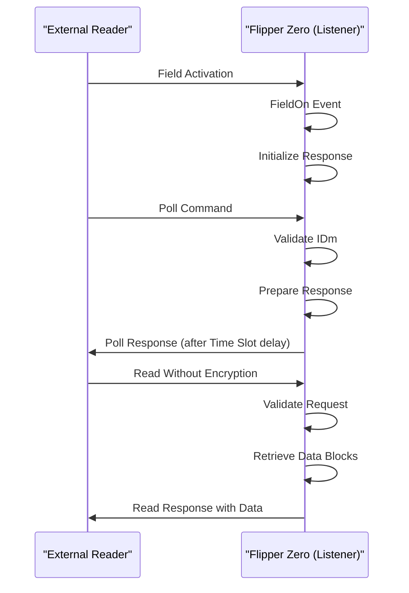
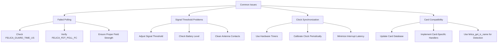

# FeliCa Protocol

<cite>
**Referenced Files in This Document**   
- [felica.h](file://lib/nfc/protocols/felica/felica.h)
- [felica.c](file://lib/nfc/protocols/felica/felica.c)
- [felica_poller.c](file://lib/nfc/protocols/felica/felica_poller.c)
- [felica_poller_i.h](file://lib/nfc/protocols/felica/felica_poller_i.h)
- [felica_listener.c](file://lib/nfc/protocols/felica/felica_listener.c)
- [felica_listener_i.h](file://lib/nfc/protocols/felica/felica_listener_i.h)
- [nfc.h](file://lib/nfc/nfc.h)
- [felica_crc.c](file://lib/nfc/helpers/felica_crc.c)
- [felica_crc.h](file://lib/nfc/helpers/felica_crc.h)
</cite>

## Table of Contents
1. [Introduction](#introduction)
2. [Technical Specifications](#technical-specifications)
3. [Communication Flow](#communication-flow)
4. [Frame Structure](#frame-structure)
5. [Poller Implementation](#poller-implementation)
6. [Listener Implementation](#listener-implementation)
7. [Data Reading Examples](#data-reading-examples)
8. [Common Issues and Solutions](#common-issues-and-solutions)
9. [Conclusion](#conclusion)

## Introduction
The FeliCa protocol is a contactless smart card system developed by Sony that operates at 13.56 MHz with a data rate of 212 kbps. This document details the implementation of the FeliCa protocol in the Flipper Zero device, focusing on the technical specifications, communication flow, frame structure, and implementation details. The Flipper Zero's NFC subsystem provides comprehensive support for FeliCa operations, enabling both polling (reading) and listening (emulation) modes for interacting with FeliCa-compatible cards such as Suica and PASMO transit cards.

**Section sources**
- [felica.h](file://lib/nfc/protocols/felica/felica.h#L1-L325)
- [nfc.h](file://lib/nfc/nfc.h#L1-L404)

## Technical Specifications
The FeliCa protocol implementation in Flipper Zero adheres to the standard technical specifications while providing optimized performance for the hardware platform. The protocol operates at a carrier frequency of 13.56 MHz with a subcarrier frequency of 847 kHz, achieving a data rate of 212 kbps for communication between the reader and card.

The modulation scheme employs modified Miller encoding for data transmission, which provides robust error detection capabilities and efficient bandwidth utilization. The implementation uses amplitude modulation with a modulation index of 10% for the subcarrier, ensuring reliable signal detection while maintaining compatibility with standard FeliCa readers.

Timing parameters are precisely controlled to ensure protocol compliance. The guard time between frames is set to 20,000 microseconds (FELICA_GUARD_TIME_US), while the frame delay time for polling operations is configured to 10,000 carrier cycles (FELICA_FDT_POLL_FC). The minimum polling interval is maintained at 1,280 microseconds (FELICA_POLL_POLL_MIN_US) to prevent excessive field activation.

The protocol supports two main card types: FeliCa Standard and FeliCa Lite, with the implementation capable of detecting and handling both variants. The system code for standard FeliCa operations is set to 0xFFFF (FELICA_SYSTEM_CODE_CODE), while specialized system codes are used for NDEF and Lite-S modes.



**Diagram sources**
- [felica.h](file://lib/nfc/protocols/felica/felica.h#L40-L44)
- [nfc.h](file://lib/nfc/nfc.h#L159-L186)

**Section sources**
- [felica.h](file://lib/nfc/protocols/felica/felica.h#L40-L44)
- [nfc.h](file://lib/nfc/nfc.h#L159-L186)

## Communication Flow
The FeliCa communication protocol follows a structured sequence of commands and responses that enable secure data exchange between the reader (poller) and card (listener). The primary communication flow begins with the Poll command, followed by various data access commands including Request Service, Request Response, and Read Without Encryption.

The Poll command (FELICA_CMD_POLLING) initiates communication by sending a polling request with a system code and request code. The system code identifies the type of service requested, with 0xFFFF indicating a standard polling operation. The request code specifies the type of information requested, such as system code information (0x01) or performance information (0x02). The response includes the card's IDm (Identification Manager) and PMm (Product Manager) values, which are essential for subsequent communication.

Following successful polling, the reader can issue a Request Service command to enumerate available services on the card. This command uses a cursor-based approach to traverse all available services, with each response containing service code information and attributes. The service attributes indicate whether the service supports unauthenticated reading, is read-only, or has other access restrictions.

The Read Without Encryption command (FELICA_CMD_READ_WITHOUT_ENCRYPTION) allows the reader to access data blocks from services that permit unauthenticated access. The command specifies the service code and a list of block numbers to read, with the response containing the requested data along with status flags (SF1 and SF2) indicating the success or failure of the operation.



**Diagram sources**
- [felica_poller.c](file://lib/nfc/protocols/felica/felica_poller.c#L85-L117)
- [felica_listener.c](file://lib/nfc/protocols/felica/felica_listener.c#L265-L280)

**Section sources**
- [felica.h](file://lib/nfc/protocols/felica/felica.h#L16-L17)
- [felica_poller.c](file://lib/nfc/protocols/felica/felica_poller.c#L85-L117)
- [felica_listener.c](file://lib/nfc/protocols/felica/felica_listener.c#L265-L280)

## Frame Structure
The FeliCa protocol employs a standardized frame structure for all communication, ensuring reliable data transmission and error detection. Each frame consists of a length byte, command/response code, IDm identifier, and payload data, with a 16-bit CRC-16 verification appended to ensure data integrity.

The frame begins with a length byte that specifies the total number of bytes in the frame, excluding the length byte itself. This is followed by a command or response code that identifies the type of operation being performed. The IDm (8 bytes) serves as the unique identifier for the FeliCa card and is included in all frames to ensure communication with the correct device.

Data transfer occurs in 16-byte blocks (FELICA_DATA_BLOCK_SIZE), which is the fundamental unit of data storage and transmission in the FeliCa system. Each block can contain user data or system information, depending on its address. The block structure includes status flags SF1 and SF2 that indicate the result of operations, followed by the 16 bytes of data.

The CRC-16 verification uses the polynomial x^16 + x^12 + x^5 + 1 (0x1021) with an initial value of 0x0000. The CRC is calculated over all bytes in the frame except the CRC itself, and is appended in little-endian byte order. The implementation provides helper functions for CRC calculation, appending, checking, and trimming that are used throughout the protocol stack.

```mermaid
flowchart TD
A[Frame Structure] --> B[Length Byte (1 byte)]
A --> C[Command/Response Code (1 byte)]
A --> D[IDm Identifier (8 bytes)]
A --> E[Payload Data]
E --> F[Status Flags SF1, SF2]
E --> G[16-byte Data Block]
A --> H[CRC-16 Verification (2 bytes)]
style A fill:#f9f,stroke:#333
style B fill:#bbf,stroke:#333
style C fill:#bbf,stroke:#333
style D fill:#bbf,stroke:#333
style E fill:#bbf,stroke:#333
style H fill:#bbf,stroke:#333
```

**Diagram sources**
- [felica.h](file://lib/nfc/protocols/felica/felica.h#L12-L14)
- [felica_crc.c](file://lib/nfc/helpers/felica_crc.c#L5-L25)
- [felica_listener.c](file://lib/nfc/protocols/felica/felica_listener.c#L79-L84)

**Section sources**
- [felica.h](file://lib/nfc/protocols/felica/felica.h#L12-L14)
- [felica_crc.c](file://lib/nfc/helpers/felica_crc.c#L5-L25)
- [felica_listener.c](file://lib/nfc/protocols/felica/felica_listener.c#L79-L84)

## Poller Implementation
The FeliCa poller implementation in Flipper Zero provides a state machine-based approach to card detection and data reading. The poller operates through a series of states that handle card activation, authentication, service enumeration, and data retrieval.

The poller initialization begins with allocating memory for the poller instance and configuring the NFC hardware for FeliCa operations. The nfc_config function sets the operating mode to NfcModePoller with NfcTechFelica technology, while timing parameters are configured using nfc_set_guard_time_us, nfc_set_fdt_poll_fc, and nfc_set_fdt_poll_poll_us functions.

The state machine progresses through several key states:
- **Idle**: Initial state where the poller waits for activation
- **Activated**: Card has been detected and activated
- **AuthenticateInternal**: Performs internal authentication if required
- **AuthenticateExternal**: Performs external authentication if required
- **TraverseStandardSystem**: Enumerates services and areas on standard cards
- **ReadStandardBlocks**: Reads data from services with unauthenticated access
- **ReadLiteBlocks**: Reads data from FeliCa Lite cards
- **ReadSuccess**: Operation completed successfully
- **ReadFailed**: Operation failed

For FeliCa Standard cards, the poller first traverses the system to identify all available services and areas by sending Request Service commands with incrementing cursors. Once the service structure is mapped, it reads data from services that support unauthenticated access (indicated by the FELICA_SERVICE_ATTRIBUTE_UNAUTH_READ attribute).

For FeliCa Lite cards, the implementation reads all 28 blocks (FELICA_BLOCKS_TOTAL_COUNT) sequentially, starting from block 0x0E (FELICA_BLOCK_INDEX_REG) and continuing through the reserved blocks.



**Diagram sources**
- [felica_poller.c](file://lib/nfc/protocols/felica/felica_poller.c#L28-L46)
- [felica_poller_i.h](file://lib/nfc/protocols/felica/felica_poller_i.h#L18-L29)

**Section sources**
- [felica_poller.c](file://lib/nfc/protocols/felica/felica_poller.c#L25-L61)
- [felica_poller_i.h](file://lib/nfc/protocols/felica/felica_poller_i.h#L18-L29)

## Listener Implementation
The FeliCa listener implementation enables the Flipper Zero to emulate a FeliCa card, responding to commands from external readers. The listener operates in a passive mode, detecting field activation and responding to incoming commands according to the FeliCa protocol specification.

The listener initialization configures the NFC hardware for listener mode using nfc_config with NfcModeListener and NfcTechFelica parameters. The collision resolution parameters are set using nfc_felica_listener_set_sensf_res_data, which configures the hardware with the card's IDm, PMm, and system code values.

The listener state machine handles several key events:
- **FieldOn**: Detected when a reader's electromagnetic field is present
- **ListenerActivated**: Triggered when the listener has been successfully activated by a reader
- **FieldOff**: Occurs when the reader's field is removed
- **RxEnd**: Fired when a complete frame has been received

When a Poll command is received, the listener responds with its IDm and PMm values. For time slot management, the implementation uses nfc_felica_listener_timer_anticol_start to delay transmission until the specified time slot, supporting the 64-slot time division scheme. Currently, the implementation responds at Time Slot 0, but the framework supports other slots.

The listener processes Read Without Encryption commands by validating the request, checking the IDm, and retrieving the requested data blocks. Different handler functions are used for different block types, allowing customized behavior for system blocks versus user data blocks. The response includes appropriate status flags (SF1 and SF2) to indicate success or failure.



**Diagram sources**
- [felica_listener.c](file://lib/nfc/protocols/felica/felica_listener.c#L238-L292)
- [nfc.h](file://lib/nfc/nfc.h#L392-L399)

**Section sources**
- [felica_listener.c](file://lib/nfc/protocols/felica/felica_listener.c#L24-L45)
- [nfc.h](file://lib/nfc/nfc.h#L392-L399)

## Data Reading Examples
The FeliCa implementation in Flipper Zero supports reading data from common transit cards such as Suica and PASMO. These cards use the FeliCa protocol and store information in specific service areas that can be accessed without authentication.

For Suica and PASMO cards, the balance information is typically stored in service code 0x000B (FELICA_SERVICE_RO_ACCESS), which allows read-only access without authentication. The balance is usually stored in the first data block (block index 0) of this service, represented as a 32-bit integer in JPY cents.

Transaction history is stored in subsequent blocks of the same service or in dedicated service areas. Each transaction record typically includes the date, time, transaction type (entry, exit, charge), location, and amount. The exact format varies between card types and issuers.

The implementation parses this data and presents it in a human-readable format. For example, balance information is converted from cents to yen with proper formatting, while transaction dates are converted from the card's internal format to standard date representations.

The card type is identified by examining the PMm (Product Manager) data, specifically the IC type field. Different values correspond to different card models and generations, allowing the software to apply appropriate parsing rules for each card type.

```mermaid
flowchart TD
A[Read Suica/PASMO Card] --> B[Detect FeliCa Protocol]
B --> C[Send Poll Command]
C --> D[Receive IDm and PMm]
D --> E[Request Service Enumeration]
E --> F[Identify Service 0x000B]
F --> G[Read Block 0 from Service 0x000B]
G --> H[Parse Balance: 32-bit integer]
H --> I[Convert to JPY: divide by 100]
I --> J[Display: "Balance: 1,234 JPY"]
F --> K[Read Blocks 1-3 from Service 0x000B]
K --> L[Parse Transaction Records]
L --> M[Extract Date, Time, Location, Amount]
M --> N[Display Transaction History]
```

**Diagram sources**
- [felica.c](file://lib/nfc/protocols/felica/felica.c#L720-L802)
- [felica_poller.c](file://lib/nfc/protocols/felica/felica_poller.c#L331-L362)

**Section sources**
- [felica.c](file://lib/nfc/protocols/felica/felica.c#L720-L802)
- [felica_poller.c](file://lib/nfc/protocols/felica/felica_poller.c#L331-L362)

## Common Issues and Solutions
Several common issues can occur when working with FeliCa cards on the Flipper Zero, primarily related to timing, signal quality, and protocol compliance. Understanding these issues and their solutions is crucial for reliable operation.

One frequent issue is failed polling due to timing inaccuracies. This can occur when the guard time or frame delay parameters are not properly configured, causing the card to miss the polling request. The solution involves ensuring that FELICA_GUARD_TIME_US (20,000 μs) and FELICA_FDT_POLL_FC (10,000 carrier cycles) are correctly set in the NFC configuration.

Signal threshold issues can also cause communication failures, particularly with cards that have weak antennas or when the Flipper Zero's battery is low. Adjusting the signal threshold in the NFC hardware configuration can improve detection reliability. The implementation automatically handles some of these adjustments, but optimal performance may require fine-tuning based on specific card types.

Clock synchronization problems can occur when the Flipper Zero's internal clock drifts, affecting the precise timing required for FeliCa communication. The solution involves periodic clock calibration and using the hardware timer functions (nfc_felica_listener_timer_anticol_start) for time-critical operations.

Card-specific compatibility issues may arise with certain FeliCa variants or custom implementations. The software addresses this by maintaining a database of known card types and their specific behaviors, accessed through the felica_get_ic_name function, which uses the PMm data to identify the card model and apply appropriate handling.



**Diagram sources**
- [felica.h](file://lib/nfc/protocols/felica/felica.h#L40-L43)
- [nfc.h](file://lib/nfc/nfc.h#L392-L399)
- [felica.c](file://lib/nfc/protocols/felica/felica.c#L714-L713)

**Section sources**
- [felica.h](file://lib/nfc/protocols/felica/felica.h#L40-L43)
- [nfc.h](file://lib/nfc/nfc.h#L392-L399)
- [felica.c](file://lib/nfc/protocols/felica/felica.c#L714-L713)

## Conclusion
The FeliCa protocol implementation in Flipper Zero provides comprehensive support for reading and emulating FeliCa-compatible cards. The system leverages the device's NFC capabilities to implement the full protocol stack, from low-level signal processing to high-level data parsing.

Key technical aspects include the 212 kbps data rate, 847 kHz subcarrier, and modified Miller encoding that define the physical layer communication. The protocol implementation handles the complete communication flow, including Poll, Request Service, and Read Without Encryption commands, with proper frame structure and 16-bit CRC-16 verification.

The architecture separates poller and listener functionality into distinct components, each with specialized state machines for handling their respective roles. The poller implementation efficiently reads data from cards like Suica and PASMO, parsing balance information and transaction history, while the listener implementation allows the device to emulate a FeliCa card.

Common issues such as timing inaccuracies and signal threshold problems are addressed through careful configuration of timing parameters and signal processing, ensuring reliable operation across various card types and environmental conditions.

**Section sources**
- [felica.h](file://lib/nfc/protocols/felica/felica.h#L1-L325)
- [felica.c](file://lib/nfc/protocols/felica/felica.c#L1-L890)
- [felica_poller.c](file://lib/nfc/protocols/felica/felica_poller.c#L1-L519)
- [felica_listener.c](file://lib/nfc/protocols/felica/felica_listener.c#L1-L303)