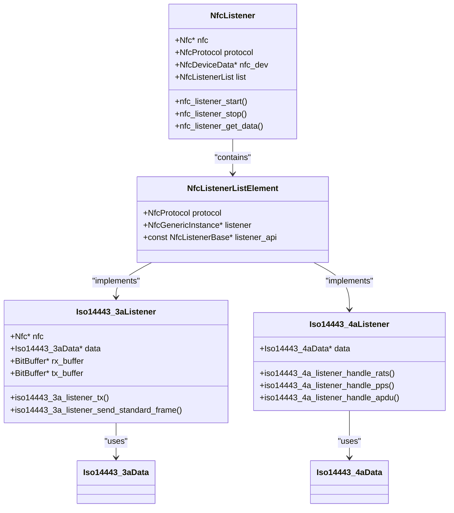

# ISO14443 Protocols

<cite>
**Referenced Files in This Document**   
- [iso14443_3a.c](file://lib/nfc/protocols/iso14443_3a/iso14443_3a.c)
- [iso14443_3a.h](file://lib/nfc/protocols/iso14443_3a/iso14443_3a.h)
- [iso14443_3a_poller.h](file://lib/nfc/protocols/iso14443_3a/iso14443_3a_poller.h)
- [iso14443_3a_poller_i.h](file://lib/nfc/protocols/iso14443_3a/iso14443_3a_poller_i.h)
- [iso14443_3b.c](file://lib/nfc/protocols/iso14443_3b/iso14443_3b.c)
- [iso14443_3b.h](file://lib/nfc/protocols/iso14443_3b/iso14443_3b.h)
- [iso14443_4a.c](file://lib/nfc/protocols/iso14443_4a/iso14443_4a.c)
- [iso14443_4a.h](file://lib/nfc/protocols/iso14443_4a/iso14443_4a.h)
- [iso14443_4a_i.h](file://lib/nfc/protocols/iso14443_4a/iso14443_4a_i.h)
- [iso14443_4a_poller.h](file://lib/nfc/protocols/iso14443_4a/iso14443_4a_poller.h)
- [iso14443_4b.c](file://lib/nfc/protocols/iso14443_4b/iso14443_4b.c)
- [iso14443_4b.h](file://lib/nfc/protocols/iso14443_4b/iso14443_4b.h)
- [nfc_poller.c](file://lib/nfc/nfc_poller.c)
- [nfc_listener.c](file://lib/nfc/nfc_listener.c)
- [nfc_mock.c](file://lib/nfc/nfc_mock.c)
- [furi_hal_nfc.c](file://applications/external/esubghz_chat/lib/nfclegacy/furi_hal_nfc.c)
- [rfal_nfca.c](file://applications/external/esubghz_chat/lib/nfclegacy/ST25RFAL002/source/rfal_nfca.c)
- [rfal_nfca.h](file://applications/external/esubghz_chat/lib/nfclegacy/ST25RFAL002/include/rfal_nfca.h)
- [iso14443_crc.h](file://lib/nfc/helpers/iso14443_crc.h)
</cite>

## Table of Contents
1. [Introduction](#introduction)
2. [ISO14443 Protocol Variants](#iso14443-protocol-variants)
3. [Modulation and Encoding Schemes](#modulation-and-encoding-schemes)
4. [Initialization and Anti-Collision Procedures](#initialization-and-anti-collision-procedures)
5. [Protocol Activation and Speed Negotiation](#protocol-activation-and-speed-negotiation)
6. [ISO/IEC 14443-4 Transport Protocol](#isoiec-14443-4-transport-protocol)
7. [NFC Poller Implementation](#nfc-poller-implementation)
8. [NFC Listener Implementation](#nfc-listener-implementation)
9. [Signal Collision and Time Slotting](#signal-collision-and-time-slotting)
10. [Configuration and Performance Considerations](#configuration-and-performance-considerations)
11. [Conclusion](#conclusion)

## Introduction
The ISO/IEC 14443 standard defines the identification cards for proximity cards operating at 13.56 MHz. This document provides a comprehensive analysis of the ISO14443 protocol implementation in the Flipper Zero firmware, focusing on the differences between Type A and Type B variants, initialization sequences, anti-collision procedures, and transport protocols. The implementation supports both reader (poller) and card (listener) modes, enabling comprehensive NFC analysis and emulation capabilities.

**Section sources**
- [iso14443_3a.c](file://lib/nfc/protocols/iso14443_3a/iso14443_3a.c#L1-L193)
- [iso14443_3b.c](file://lib/nfc/protocols/iso14443_3b/iso14443_3b.c#L1-L229)
- [iso14443_4a.c](file://lib/nfc/protocols/iso14443_4a/iso14443_4a.c#L1-L314)

## ISO14443 Protocol Variants
The ISO/IEC 14443 standard defines two main variants: Type A and Type B, which differ in their modulation schemes, coding techniques, and protocol initialization procedures. The Flipper Zero firmware implements both variants through dedicated protocol handlers that manage the specific requirements of each type.

### Type A Implementation
ISO14443 Type A uses 100% amplitude shift keying (ASK) modulation for the reader-to-card communication and Miller coding for data encoding. The implementation in the Flipper Zero firmware is located in the `iso14443_3a` module, which handles the initialization request (REQA/WUPA), anti-collision procedures, and protocol activation.

The Type A protocol implementation includes support for multiple cascade levels, allowing the identification of cards with extended UID lengths. The anti-collision procedure follows the standard three-cascade level approach, where each level handles a portion of the UID.

### Type B Implementation
ISO14443 Type B uses 10% amplitude shift keying (ASK) modulation for the reader-to-card communication and Manchester coding for data encoding. The implementation in the Flipper Zero firmware is located in the `iso14443_3b` module, which manages the initialization request (REQB), slot marker anti-collision, and protocol activation.

Type B cards typically have a fixed UID length of 4 bytes and use a different anti-collision mechanism based on time slotting rather than cascade levels. The protocol supports higher data rates and more complex application data exchange.

**Section sources**
- [iso14443_3a.c](file://lib/nfc/protocols/iso14443_3a/iso14443_3a.c#L1-L193)
- [iso14443_3b.c](file://lib/nfc/protocols/iso14443_3b/iso14443_3b.c#L1-L229)
- [iso14443_3a.h](file://lib/nfc/protocols/iso14443_3a/iso14443_3a.h#L1-L108)
- [iso14443_3b.h](file://lib/nfc/protocols/iso14443_3b/iso14443_3b.h#L1-L84)

## Modulation and Encoding Schemes
The ISO14443 standard defines different modulation and encoding schemes for Type A and Type B variants, which are implemented in the Flipper Zero firmware to ensure compatibility with various NFC cards and readers.

### Type A Modulation (100% ASK)
ISO14443 Type A uses 100% amplitude shift keying for the reader-to-card communication. In this scheme, the carrier wave is completely turned off to represent a logic 0 and maintained at full amplitude for a logic 1. This modulation scheme provides good signal integrity and is widely used in contactless smart cards.

The Flipper Zero firmware implements 100% ASK modulation through the ST25R3916 NFC controller, which handles the analog signal generation and detection. The digital signal processing layer abstracts the modulation details, providing a clean interface for higher-level protocol implementation.

### Type B Modulation (10% ASK)
ISO14443 Type B uses 10% amplitude shift keying for the reader-to-card communication. In this scheme, the carrier wave is reduced by 90% to represent a logic 0 and maintained at full amplitude for a logic 1. This partial modulation reduces electromagnetic interference and allows for coexistence with other wireless technologies.

The 10% ASK implementation in the Flipper Zero firmware provides better noise immunity compared to 100% ASK, making it suitable for environments with high electromagnetic interference. The modulation depth is precisely controlled by the NFC controller to ensure compliance with the ISO standard.

### Data Encoding: Miller vs Manchester
The two variants use different data encoding schemes for reliable data transmission:

- **Type A (Miller Coding)**: Uses Miller coding for data encoding, where each bit period is divided into two halves. A logic 0 is represented by no transition in the first half and a transition in the second half, while a logic 1 has a transition in the first half and no transition in the second half. This encoding provides good clock recovery and error detection capabilities.

- **Type B (Manchester Coding)**: Uses Manchester coding for data encoding, where each bit period has a transition in the middle. A logic 0 is represented by a high-to-low transition, and a logic 1 by a low-to-high transition. This encoding ensures self-clocking and provides excellent noise immunity.

The Flipper Zero firmware implements both encoding schemes in the digital signal processing layer, allowing seamless switching between Type A and Type B protocols based on the detected card type.

**Section sources**
- [iso14443_3a.c](file://lib/nfc/protocols/iso14443_3a/iso14443_3a.c#L1-L193)
- [iso14443_3b.c](file://lib/nfc/protocols/iso14443_3b/iso14443_3b.c#L1-L229)
- [iso14443_crc.h](file://lib/nfc/helpers/iso14443_crc.h#L1-L50)

## Initialization and Anti-Collision Procedures
The ISO14443 standard defines specific initialization and anti-collision procedures for both Type A and Type B variants, which are implemented in the Flipper Zero firmware to ensure reliable card detection and identification.

### Initialization Sequence (REQA/WUPA and REQB)
The initialization sequence begins with the reader sending a request command to detect nearby cards:

- **Type A (REQA/WUPA)**: The reader sends a REQA (Request Type A) or WUPA (Wake-Up Type A) command to detect Type A cards. The command is a single byte (0x26 for REQA, 0x52 for WUPA) transmitted using 100% ASK modulation and Miller coding. Cards within range respond with their ATQA (Answer To Request Type A) containing information about their capabilities.

- **Type B (REQB)**: The reader sends a REQB (Request Type B) command to detect Type B cards. The command includes a command code, application family identifier, and number of slots. Type B cards respond with their ATQB (Answer To Request Type B) containing their UID and protocol information.

The Flipper Zero firmware implements both initialization sequences through the NFC poller, which automatically detects the card type based on the response and proceeds with the appropriate anti-collision procedure.

### Anti-Collision Using UID
The anti-collision procedure ensures that multiple cards in the reader's field can be uniquely identified and accessed:

- **Type A Anti-Collision**: Uses a cascade-based anti-collision procedure where the reader iteratively selects cards based on their UID. The procedure involves three main steps: SENS_REQ to detect cards, SDD (Select) commands to perform anti-collision at each cascade level, and SEL_REQ/SEL_RES to select a specific card. The cascade levels allow handling of UIDs of different lengths (4, 7, or 10 bytes).

- **Type B Anti-Collision**: Uses a slot-based anti-collision procedure where the reader allocates time slots for cards to respond. The reader sends a REQB command with a specified number of slots, and each card randomly selects a slot to transmit its UID. If multiple cards select the same slot (collision), the reader increases the number of slots and repeats the procedure.

The Flipper Zero firmware implements both anti-collision methods, allowing it to work with a wide range of NFC cards. The implementation handles edge cases such as partial UID collisions and provides mechanisms for card selection and deselection.

**Section sources**
- [iso14443_3a.c](file://lib/nfc/protocols/iso14443_3a/iso14443_3a.c#L1-L193)
- [iso14443_3a_poller.c](file://lib/nfc/protocols/iso14443_3a/iso14443_3a_poller.c#L1-L286)
- [rfal_nfca.c](file://applications/external/esubghz_chat/lib/nfclegacy/ST25RFAL002/source/rfal_nfca.c#L218-L606)
- [rfal_nfca.h](file://applications/external/esubghz_chat/lib/nfclegacy/ST25RFAL002/include/rfal_nfca.h#L325-L357)

## Protocol Activation and Speed Negotiation
After successful anti-collision, the reader activates the selected card and negotiates the communication parameters, including data rate and frame size.

### Activation at 106 kbps and Higher Speeds
The ISO14443 standard defines a default data rate of 106 kbps, but supports higher speeds for improved performance:

- **106 kbps (Default)**: Both Type A and Type B cards support the default data rate of 106 kbps. This rate provides reliable communication and is widely supported by existing infrastructure.

- **Higher Speeds (212, 424, 848 kbps)**: The standard allows for higher data rates, which are negotiated during the activation phase. Type A cards use the TA(1) byte in the ATS (Answer To Select) to indicate supported bit rates, while Type B cards use the protocol information parameter in their ATQB response.

The Flipper Zero firmware supports all standard data rates and automatically negotiates the highest mutually supported rate during card activation. The implementation includes proper timing adjustments and error handling for higher-speed communication.

### Frame Timing and Guard Times
The protocol defines specific timing parameters to ensure reliable communication:

- **Frame Delay Time (FDT)**: Specifies the minimum time between frames, which varies based on the data rate and direction of communication.
- **Guard Time**: Provides a minimum time between consecutive bits to ensure proper signal recovery.
- **Start of Frame and End of Frame**: Defined patterns that mark the beginning and end of data frames.

The firmware implementation carefully manages these timing parameters to ensure compliance with the ISO standard and reliable communication with various card types.

**Section sources**
- [iso14443_3a.c](file://lib/nfc/protocols/iso14443_3a/iso14443_3a.c#L1-L193)
- [iso14443_4a.c](file://lib/nfc/protocols/iso14443_4a/iso14443_4a.c#L1-L314)
- [iso14443_3a.h](file://lib/nfc/protocols/iso14443_3a/iso14443_3a.h#L1-L108)

## ISO/IEC 14443-4 Transport Protocol
ISO/IEC 14443-4 defines the transport protocol for exchanging application data between the reader and card, including RATS, PPS, and APDU mechanisms.

### RATS (Request for Answer To Select)
The RATS command initiates the ISO/IEC 14443-4 protocol activation:

- Sent by the reader after successful anti-collision
- Requests the card to send its ATS (Answer To Select) response
- Contains a CID (Card Identifier) to identify the communication session

The ATS response includes information about the card's capabilities, such as supported data rates, frame sizes, and protocol features. The Flipper Zero firmware implements RATS handling in the `iso14443_4a_poller_read_ats` function, which sends the RATS command and parses the ATS response.

### PPS (Protocol and Parameter Selection)
The PPS command allows the reader and card to negotiate communication parameters:

- Exchanged after successful RATS
- Allows selection of data rate, frame size, and other protocol parameters
- Includes error detection through CRC

The PPS procedure ensures that both parties agree on the communication parameters before exchanging application data. The Flipper Zero firmware supports PPS negotiation, allowing optimal performance based on the capabilities of both the reader and card.

### APDU Exchange Mechanisms
Application Protocol Data Units (APDUs) are used for exchanging application data:

- **Command APDU**: Sent by the reader to the card, containing the instruction and parameters
- **Response APDU**: Sent by the card to the reader, containing the result and data

The APDU structure follows the ISO/IEC 7816-4 standard, with a command header (CLA, INS, P1, P2) and optional data fields. The Flipper Zero firmware implements APDU exchange through the ISO14443-4A protocol handler, providing a complete interface for smart card applications.

**Section sources**
- [iso14443_4a.c](file://lib/nfc/protocols/iso14443_4a/iso14443_4a.c#L1-L314)
- [iso14443_4a.h](file://lib/nfc/protocols/iso14443_4a/iso14443_4a.h#L1-L60)
- [iso14443_4a_i.h](file://lib/nfc/protocols/iso14443_4a/iso14443_4a_i.h#L1-L27)
- [iso14443_4a_poller.h](file://lib/nfc/protocols/iso14443_4a/iso14443_4a_poller.h#L139-L155)

## NFC Poller Implementation
The NFC poller implementation in the Flipper Zero firmware manages the reader-side operations for ISO14443 communication.

### Poller Architecture
The poller follows a hierarchical architecture with multiple protocol layers:

```mermaid
classDiagram
class NfcPoller {
+Nfc* nfc
+NfcProtocol protocol
+NfcPollerList list
+NfcPollerSessionState session_state
+NfcGenericCallbackEx callback
+void* context
+nfc_poller_alloc()
+nfc_poller_free()
+nfc_poller_start()
+nfc_poller_stop()
+nfc_poller_detect()
}
class NfcPollerListElement {
+NfcProtocol protocol
+NfcGenericInstance* poller
+const NfcPollerBase* poller_api
+NfcPollerListElement* child
}
class Iso14443_3aPoller {
+Nfc* nfc
+Iso14443_3aPollerState state
+Iso14443_3aPollerColRes col_res
+Iso14443_3aData* data
+BitBuffer* tx_buffer
+BitBuffer* rx_buffer
+iso14443_3a_poller_activate()
+iso14443_3a_poller_halt()
+iso14443_3a_poller_txrx()
}
class Iso14443_4aPoller {
+Iso14443_4aData* data
+iso14443_4a_poller_read_ats()
+iso14443_4a_poller_pps()
}
NfcPoller --> NfcPollerListElement : "contains"
NfcPollerListElement --> Iso14443_3aPoller : "implements"
NfcPollerListElement --> Iso14443_4aPoller : "implements"
Iso14443_3aPoller --> Iso14443_3aData : "uses"
Iso14443_4aPoller --> Iso14443_4aData : "uses"
```

**Diagram sources**
- [nfc_poller.c](file://lib/nfc/nfc_poller.c#L1-L286)
- [iso14443_3a_poller.h](file://lib/nfc/protocols/iso14443_3a/iso14443_3a_poller.h#L1-L146)
- [iso14443_4a_poller.h](file://lib/nfc/protocols/iso14443_4a/iso14443_4a_poller.h#L1-L50)

### Cascade Level Handling
The poller handles multiple cascade levels for Type A cards:

- Manages the state machine for anti-collision across cascade levels
- Tracks partial UIDs and collision positions
- Implements backtracking when needed
- Supports both single and multiple card detection

The implementation follows the ISO/IEC 14443-3 standard for cascade procedures, ensuring compatibility with various card types and manufacturers.

**Section sources**
- [nfc_poller.c](file://lib/nfc/nfc_poller.c#L1-L286)
- [iso14443_3a_poller.c](file://lib/nfc/protocols/iso14443_3a/iso14443_3a_poller.c#L1-L286)
- [rfal_nfca.c](file://applications/external/esubghz_chat/lib/nfclegacy/ST25RFAL002/source/rfal_nfca.c#L218-L606)

## NFC Listener Implementation
The NFC listener implementation in the Flipper Zero firmware manages the card-side operations for ISO14443 communication.

### Listener Architecture
The listener follows a modular architecture that handles incoming frames and generates appropriate responses:

**Diagram sources**
- [nfc_listener.c](file://lib/nfc/nfc_listener.c#L81-L130)
- [nfc_listener.h](file://lib/nfc/nfc_listener.h#L79-L94)
- [iso14443_3a_listener.h](file://lib/nfc/protocols/iso14443_3a/iso14443_3a_listener.h#L1-L73)

### Raw Frame Capture
The listener captures raw frames from the NFC field and processes them according to the ISO14443 protocol:

- Uses the ST25R3916 NFC controller to receive modulated signals
- Demodulates and decodes the received data
- Validates frame integrity using CRC
- Handles timing and synchronization

The implementation includes support for both Type A and Type B frame formats, allowing the Flipper Zero to emulate various card types.

**Section sources**
- [nfc_listener.c](file://lib/nfc/nfc_listener.c#L81-L130)
- [nfc_mock.c](file://lib/nfc/nfc_mock.c#L375-L419)
- [furi_hal_nfc.c](file://applications/external/esubghz_chat/lib/nfclegacy/furi_hal_nfc.c#L304-L334)

## Signal Collision and Time Slotting
Signal collision during anti-collision is a common issue in NFC systems, which is addressed through various techniques including time slotting.

### Signal Collision During Anti-Collision
When multiple cards respond simultaneously, their signals interfere, causing data corruption:

- **Type A**: Collision occurs when multiple cards have the same prefix in their UID
- **Type B**: Collision occurs when multiple cards select the same time slot

The Flipper Zero firmware detects collisions through CRC errors and incomplete responses, triggering appropriate recovery procedures.

### Time Slotting Solutions
Time slotting is used in Type B anti-collision to reduce the probability of collisions:

- Reader divides time into discrete slots
- Each card randomly selects a slot to respond
- Reader repeats the procedure with more slots if collisions occur
- Binary tree search can be used for efficient collision resolution

The implementation in the Flipper Zero firmware follows the ISO/IEC 14443-3 Type B standard for time slotting, ensuring compatibility with existing infrastructure.

**Section sources**
- [rfal_nfca.c](file://applications/external/esubghz_chat/lib/nfclegacy/ST25RFAL002/source/rfal_nfca.c#L218-L606)
- [iso14443_3a_poller.c](file://lib/nfc/protocols/iso14443_3a/iso14443_3a_poller.c#L1-L286)
- [iso14443_3b.c](file://lib/nfc/protocols/iso14443_3b/iso14443_3b.c#L1-L229)

## Configuration and Performance Considerations
The ISO14443 implementation in the Flipper Zero firmware includes various configuration options and performance optimizations.

### Field Strength and Timing Parameters
Configurable parameters allow optimization for different use cases:

- **Field Strength**: Adjustable to balance detection range and power consumption
- **Timing Parameters**: Configurable guard times and frame delays for compatibility
- **Sensitivity**: Adjustable receiver sensitivity for different environments

These parameters can be tuned through the firmware configuration to optimize performance for specific applications.

### Battery Usage During Prolonged Scanning
Prolonged scanning sessions can significantly impact battery life:

- **Power Management**: The NFC controller includes power-saving modes
- **Duty Cycling**: Scanning can be performed in intervals to reduce average power
- **Adaptive Scanning**: Detection sensitivity can be adjusted based on usage patterns

The implementation includes optimizations to minimize power consumption while maintaining reliable detection performance.

**Section sources**
- [nfc_poller.c](file://lib/nfc/nfc_poller.c#L1-L286)
- [nfc_listener.c](file://lib/nfc/nfc_listener.c#L81-L130)
- [furi_hal_nfc.c](file://applications/external/esubghz_chat/lib/nfclegacy/furi_hal_nfc.c#L304-L334)

## Conclusion
The ISO14443 protocol implementation in the Flipper Zero firmware provides comprehensive support for both Type A and Type B variants, including initialization, anti-collision, and transport protocols. The modular architecture allows for flexible configuration and optimization, making it suitable for a wide range of NFC applications. The implementation follows the ISO/IEC standards while providing practical features for real-world usage, including power management and collision handling.