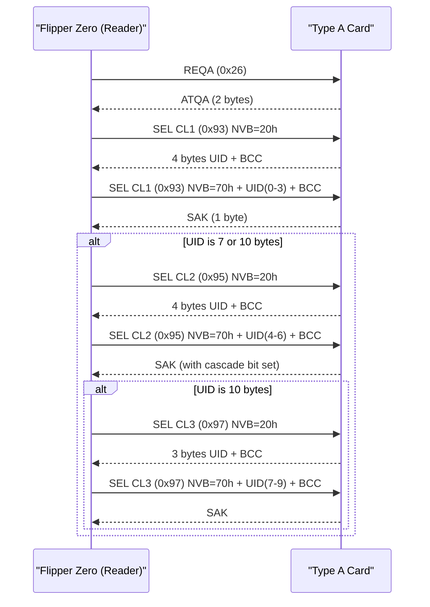
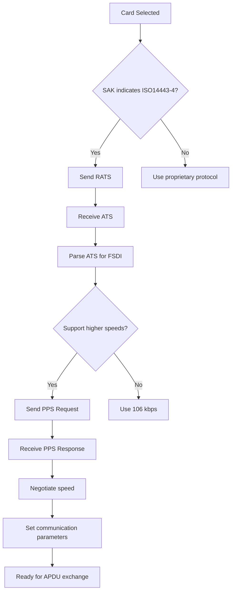
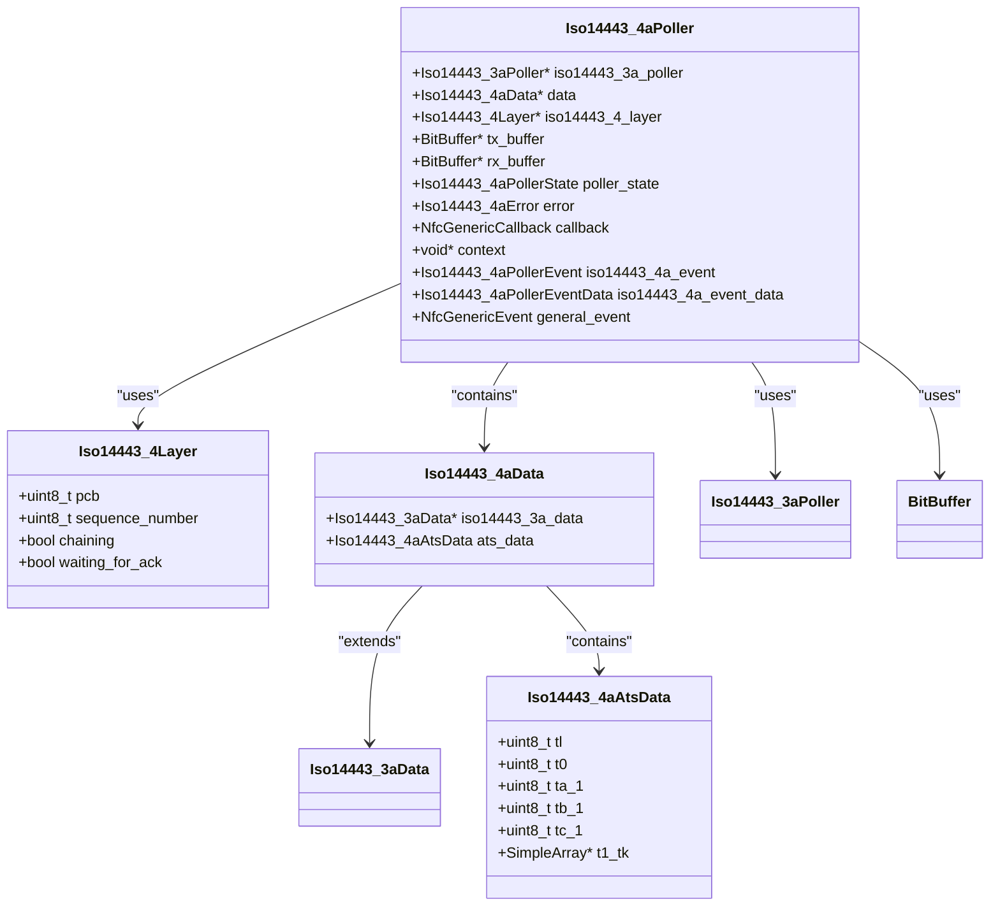
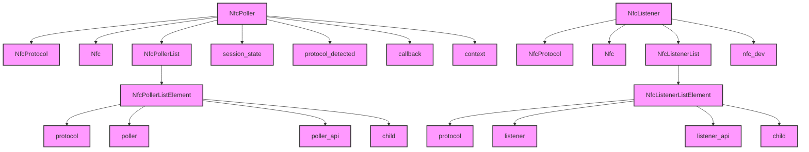

# ISO14443 Type A

<cite>
**Referenced Files in This Document**   
- [iso14443_3a_poller.c](file://lib/nfc/protocols/iso14443_3a/iso14443_3a_poller.c)
- [iso14443_3a_poller_i.c](file://lib/nfc/protocols/iso14443_3a/iso14443_3a_poller_i.c)
- [iso14443_4a_poller.c](file://lib/nfc/protocols/iso14443_4a/iso14443_4a_poller.c)
- [iso14443_4a_poller_i.c](file://lib/nfc/protocols/iso14443_4a/iso14443_4a_poller_i.c)
- [iso14443_3a.h](file://lib/nfc/protocols/iso14443_3a/iso14443_3a.h)
- [iso14443_4a.h](file://lib/nfc/protocols/iso14443_4a/iso14443_4a.h)
- [nfc_poller.c](file://lib/nfc/nfc_poller.c)
- [nfc_listener.c](file://lib/nfc/nfc_listener.c)
- [iso14443_3a_listener.c](file://lib/nfc/protocols/iso14443_3a/iso14443_3a_listener.c)
- [iso14443_4a_listener.c](file://lib/nfc/protocols/iso14443_4a/iso14443_4a_listener.c)
</cite>

## Table of Contents
1. [Introduction](#introduction)
2. [100% ASK Modulation and Miller Encoding](#100-ask-modulation-and-miller-encoding)
3. [Initialization Sequence and Anti-Collision Procedures](#initialization-sequence-and-anti-collision-procedures)
4. [Protocol Activation and Speed Negotiation](#protocol-activation-and-speed-negotiation)
5. [ISO/IEC 14443-4A Transport Protocol Implementation](#isoiec-14443-4a-transport-protocol-implementation)
6. [NFC Poller and Listener Implementation](#nfc-poller-and-listener-implementation)
7. [Configuration Options and Performance Considerations](#configuration-options-and-performance-considerations)

## Introduction
The ISO14443 Type A protocol implementation in the Flipper Zero firmware provides comprehensive support for contactless smart card communication. This document details the implementation of the ISO14443 Type A standard, covering the physical layer modulation scheme, initialization procedures, anti-collision mechanisms, and higher-level transport protocols. The implementation follows the ISO/IEC 14443-3 and ISO/IEC 14443-4 standards for Type A cards, enabling the Flipper Zero to act as both a reader (poller) and a card (listener) in NFC communication scenarios.

The firmware architecture separates the protocol implementation into distinct layers, with the nfc_poller and nfc_listener components handling the state machines for reader and card operations respectively. The implementation supports the full range of Type A features including REQA/WUPA commands, UID cascade levels, and ISO/IEC 14443-4A transport protocols with RATS, PPS, and APDU exchange mechanisms.

**Section sources**
- [iso14443_3a_poller.c](file://lib/nfc/protocols/iso14443_3a/iso14443_3a_poller.c#L1-L129)
- [iso14443_4a_poller.c](file://lib/nfc/protocols/iso14443_4a/iso14443_4a_poller.c#L1-L154)

## 100% ASK Modulation and Miller Encoding
The ISO14443 Type A protocol uses 100% Amplitude Shift Keying (ASK) modulation for communication from the reader to the card (downlink). In this modulation scheme, the carrier signal is completely turned on and off to represent binary data. A logical "1" is represented by the presence of the carrier signal, while a logical "0" is represented by the absence of the carrier. This 100% modulation depth provides a clear distinction between the two states, making it robust against noise and interference.

For the downlink communication, the Flipper Zero implements Miller subcarrier encoding as specified in ISO/IEC 14443-3. In Miller encoding, a logical "0" is represented by a subcarrier pulse at the beginning of the bit period, while a logical "1" is represented by the absence of a subcarrier pulse. The subcarrier frequency is 847 kHz, which is 1/16 of the 13.56 MHz carrier frequency. This encoding scheme provides self-clocking capabilities and helps maintain synchronization between the reader and card.

For the uplink communication (card to reader), the card uses a modified Miller encoding scheme with load modulation. The card modulates the load on the reader's electromagnetic field to transmit data back to the reader. The implementation in the Flipper Zero firmware supports both the standard and modified Miller encoding schemes for uplink communication, allowing it to communicate with a wide range of Type A cards.

The timing parameters for the ASK modulation and Miller encoding are carefully controlled to meet the ISO/IEC 14443-3 specifications. The guard time between frames is set to 5000 microseconds (ISO14443_3A_GUARD_TIME_US), and the frame delay time for polling is set to 1620 carrier cycles (ISO14443_3A_FDT_POLL_FC). These parameters ensure reliable communication while minimizing power consumption.

**Section sources**
- [iso14443_3a.h](file://lib/nfc/protocols/iso14443_3a/iso14443_3a.h#L15-L19)
- [iso14443_3a_poller_i.c](file://lib/nfc/protocols/iso14443_3a/iso14443_3a_poller_i.c#L21-L61)

## Initialization Sequence and Anti-Collision Procedures
The initialization sequence for ISO14443 Type A communication begins with the reader sending a REQA (Request Type A) command to detect the presence of Type A cards in the field. The REQA command is a single byte (0x26) that triggers all Type A cards in the field to respond with their ATQA (Answer to Request Type A) data. The ATQA contains information about the card's capabilities, including its bit rate capabilities and protocol type.

If no cards respond to the REQA command, the reader may send a WUPA (Wake-Up Type A) command (0x52) to activate cards that may be in a low-power state. The WUPA command serves the same purpose as REQA but is specifically designed to wake up cards that have been previously halted.

The anti-collision procedure is implemented using a cascade selection mechanism that handles cards with different UID (Unique Identifier) lengths. The process begins with the reader sending a SEL (Select) command for cascade level 1 (0x93) with a parameter byte indicating the number of valid bits (NVB) in the UID. Cards respond with their first 4 bytes of UID and a BCC (Block Check Character) calculated from these bytes.

When multiple cards respond simultaneously, causing a collision, the reader uses the collision detection capabilities of the ST25R3916 NFC frontend to identify the position of the first differing bit. The reader then continues the selection process by specifying more bits of the UID until a single card is selected. For cards with longer UIDs (7 or 10 bytes), the process repeats with cascade levels 2 (SEL command 0x95) and 3 (SEL command 0x97) respectively.

The implementation in the Flipper Zero firmware handles the complete anti-collision sequence automatically. The `iso14443_3a_poller_activate` function in the iso14443_3a_poller_i.c file manages the state machine for the anti-collision procedure, progressing through the cascade levels until a single card is selected or all cascade levels have been processed.

**Diagram sources**
- [iso14443_3a_poller_i.c](file://lib/nfc/protocols/iso14443_3a/iso14443_3a_poller_i.c#L104-L246)
- [iso14443_3a.h](file://lib/nfc/protocols/iso14443_3a/iso14443_3a.h#L32-L57)

**Section sources**
- [iso14443_3a_poller_i.c](file://lib/nfc/protocols/iso14443_3a/iso14443_3a_poller_i.c#L104-L246)
- [iso14443_3a.h](file://lib/nfc/protocols/iso14443_3a/iso14443_3a.h#L10-L13)

## Protocol Activation and Speed Negotiation
After successful anti-collision and selection of a specific card, the Flipper Zero firmware proceeds with protocol activation at 106 kbps, which is the default communication speed for ISO14443 Type A cards. The activation process begins with the reader verifying that the selected card supports ISO/IEC 14443-4 by checking the SAK (Select Acknowledge) byte returned by the card. If the SAK indicates ISO/IEC 14443-4 compliance, the reader can proceed with higher-level protocol operations.

The speed negotiation process is handled through the PPS (Protocol and Parameter Selection) mechanism defined in ISO/IEC 14443-4. The reader sends a PPS request to the card, specifying the desired communication parameters including the bit rate for both directions. The PPS request consists of a PPSS byte (0xD0) followed by a PPS0 byte that indicates whether a PPS1 byte is present, and a PPS1 byte that specifies the data rates.

The PPS1 byte uses bit fields to specify the communication speeds: bits 0-1 for the card-to-reader direction (DSI) and bits 2-3 for the reader-to-card direction (DRI). The values 0, 1, 2, and 3 correspond to 106 kbps, 212 kbps, 424 kbps, and 848 kbps respectively. The implementation in the Flipper Zero firmware supports all four speed options, allowing for faster communication when both the reader and card support higher data rates.

The timing parameters for communication are adjusted based on the selected speed. The Frame Waiting Time (FWT) is calculated as (256 × 16/fc) × 2FWI, where fc is the carrier frequency (13.56 MHz) and FWI is the Frame Waiting Integer obtained from the ATS (Answer to Select) response. The firmware implements these timing calculations to ensure reliable communication at the negotiated speed.

**Diagram sources**
- [iso14443_4a_poller.c](file://lib/nfc/protocols/iso14443_4a/iso14443_4a_poller.c#L57-L67)
- [iso14443_4a_poller_i.c](file://lib/nfc/protocols/iso14443_4a/iso14443_4a_poller_i.c#L26-L57)

**Section sources**
- [iso14443_4a.h](file://lib/nfc/protocols/iso14443_4a/iso14443_4a.h#L19-L27)
- [iso14443_4a_poller_i.c](file://lib/nfc/protocols/iso14443_4a/iso14443_4a_poller_i.c#L26-L57)

## ISO/IEC 14443-4A Transport Protocol Implementation
The ISO/IEC 14443-4A transport protocol implementation in the Flipper Zero firmware provides a complete stack for communicating with Type A cards that support the ISO/IEC 14443-4 standard. The implementation follows the state machine defined in the standard, handling the various protocol states and transitions.

The protocol initialization begins with the RATS (Request for Answer to Select) command, which is sent by the reader to request the card's ATS (Answer to Select) data. The ATS contains information about the card's communication capabilities, including the maximum frame size, supported bit rates, and protocol features. The `iso14443_4a_poller_read_ats` function in the iso14443_4a_poller_i.c file handles the RATS command transmission and ATS response parsing.

After receiving the ATS, the reader may send a PPS (Protocol and Parameter Selection) command to negotiate communication parameters such as data rate and frame size. The PPS mechanism allows both the reader and card to agree on the optimal communication settings for their specific capabilities.

The core of the transport protocol is the block exchange mechanism, which uses three types of blocks: I-blocks (Information), R-blocks (Receiver), and S-blocks (Supervisory). I-blocks carry application data, R-blocks provide acknowledgments and negative acknowledgments, and S-blocks handle protocol control functions such as deactivation and WTX (Waiting Time eXtension).

The implementation in the Flipper Zero firmware handles the complete block exchange protocol, including sequence number management, error detection, and retransmission. The `iso14443_4a_poller_send_block` function manages the transmission and reception of protocol blocks, handling the various response types and protocol states.

For application-level communication, the firmware supports APDU (Application Protocol Data Unit) exchange, which is the standard format for commands and responses in smart card applications. APDUs consist of a 4-byte header (CLA, INS, P1, P2) followed by optional command data and a 2-byte status word in the response.

**Diagram sources**
- [iso14443_4a_poller.c](file://lib/nfc/protocols/iso14443_4a/iso14443_4a_poller.c#L19-L34)
- [iso14443_4a.h](file://lib/nfc/protocols/iso14443_4a/iso14443_4a.h#L43-L46)
- [iso14443_4a_i.h](file://lib/nfc/protocols/iso14443_4a/iso14443_4a_i.h#L5-L24)

**Section sources**
- [iso14443_4a_poller.c](file://lib/nfc/protocols/iso14443_4a/iso14443_4a_poller.c#L1-L154)
- [iso14443_4a_poller_i.c](file://lib/nfc/protocols/iso14443_4a/iso14443_4a_poller_i.c#L1-L198)
- [iso14443_4a.h](file://lib/nfc/protocols/iso14443_4a/iso14443_4a.h#L1-L89)

## NFC Poller and Listener Implementation
The NFC poller and listener implementation in the Flipper Zero firmware provides a flexible and extensible architecture for handling various NFC protocols. The implementation is based on a hierarchical state machine that allows for protocol nesting and inheritance.

The nfc_poller component acts as the reader, initiating communication with NFC cards. It is implemented as a linked list of protocol handlers, with each protocol potentially building on a parent protocol. For ISO14443 Type A, the poller hierarchy consists of the iso14443_3a_poller as the base and the iso14443_4a_poller as the extension for ISO/IEC 14443-4 compliant cards.

The poller state machine is managed by the `nfc_poller_run` function in nfc_poller.c, which processes events and transitions between states. For ISO14443 Type A, the state machine handles the initialization, anti-collision, protocol activation, and data exchange phases. The `iso14443_3a_poller_run` function specifically manages the Type A poller states, including idle, activated, and error states.

The nfc_listener component acts as a card, responding to commands from an external reader. It implements the same protocol hierarchy as the poller, allowing the Flipper Zero to emulate various types of NFC cards. The listener state machine is simpler than the poller's, primarily handling command reception and response generation.

Both the poller and listener use a callback mechanism to notify the application layer of events such as protocol detection, data reception, and errors. This allows for asynchronous operation and integration with the Flipper Zero's event-driven architecture.

The implementation also includes error handling and recovery mechanisms. For example, the `iso14443_3a_poller_halt` function sends a HALT command to put a card into a low-power state, and the `iso14443_4a_poller_halt` function resets the 14443-4A protocol state. These functions ensure proper cleanup and prevent communication conflicts when switching between different NFC operations.

**Diagram sources**
- [nfc_poller.c](file://lib/nfc/nfc_poller.c#L25-L34)
- [nfc_listener.c](file://lib/nfc/nfc_listener.c#L20-L25)

**Section sources**
- [nfc_poller.c](file://lib/nfc/nfc_poller.c#L1-L286)
- [nfc_listener.c](file://lib/nfc/nfc_listener.c#L1-L145)
- [iso14443_3a_listener.c](file://lib/nfc/protocols/iso14443_3a/iso14443_3a_listener.c)
- [iso14443_4a_listener.c](file://lib/nfc/protocols/iso14443_4a/iso14443_4a_listener.c)

## Configuration Options and Performance Considerations
The ISO14443 Type A implementation in the Flipper Zero firmware includes several configuration options that affect both functionality and performance. These options are primarily related to field strength, timing parameters, and power management.

The field strength is controlled by the NFC frontend (ST25R3916) and can be adjusted to optimize for different use cases. For example, a stronger field may be used for reading cards at a greater distance, while a weaker field may be used to conserve battery power during prolonged scanning sessions. The field strength settings are managed through the furi_hal_nfc component, which provides an abstraction layer for the NFC hardware.

Timing parameters such as the guard time (ISO14443_3A_GUARD_TIME_US) and frame delay time (ISO14443_3A_FDT_POLL_FC) can be adjusted to optimize communication reliability and speed. These parameters are defined as constants in the iso14443_3a.h header file and can be modified to fine-tune the communication characteristics for specific card types or environmental conditions.

Performance considerations for battery usage are particularly important for a portable device like the Flipper Zero. During prolonged scanning sessions, the NFC subsystem consumes significant power, especially when actively polling for cards. The firmware implements several power-saving measures, including automatic low-power mode when no cards are detected and optimized polling intervals.

The anti-collision procedure can be a significant source of power consumption, especially in environments with multiple cards. To mitigate this, the implementation includes optimizations such as early termination of the cascade selection process when a unique card is identified, and efficient handling of collision detection to minimize unnecessary retransmissions.

For applications requiring high reliability, the firmware provides mechanisms for error detection and recovery. The CRC (Cyclic Redundancy Check) is used to verify the integrity of transmitted data, and the implementation includes retry logic for failed transmissions. The maximum number of retries and timeout values can be configured to balance reliability and performance.

Additionally, the implementation supports various debugging and diagnostic features that can be enabled to troubleshoot communication issues. These include detailed logging of protocol events, raw frame capture, and timing analysis. While these features are useful for development and troubleshooting, they should be disabled in production to minimize their impact on performance and battery life.

**Section sources**
- [iso14443_3a.h](file://lib/nfc/protocols/iso14443_3a/iso14443_3a.h#L15-L19)
- [furi_hal_nfc.c](file://targets/f7/furi_hal/furi_hal_nfc.c)
- [iso14443_3a_poller_i.c](file://lib/nfc/protocols/iso14443_3a/iso14443_3a_poller_i.c#L63-L85)