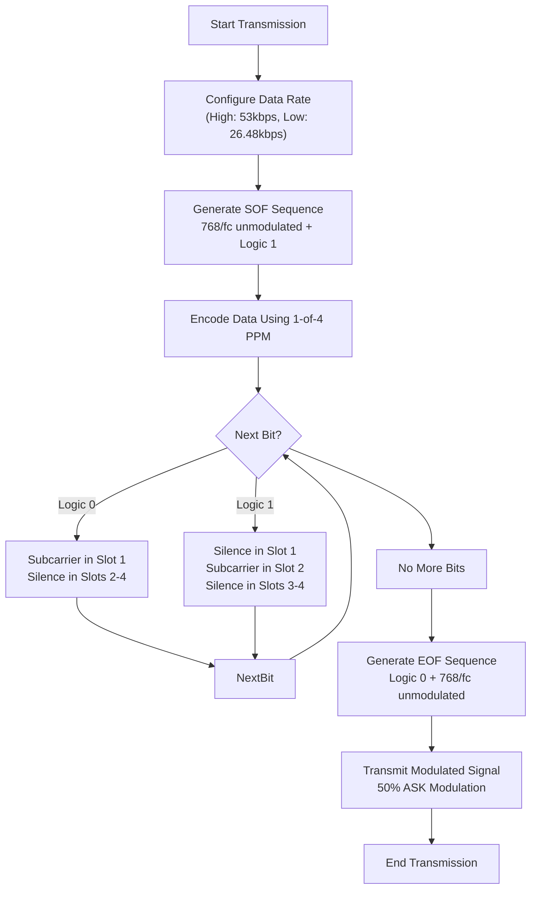

# ISO15693 Protocol

<cite>
**Referenced Files in This Document**   
- [iso15693_3.h](file://lib/nfc/protocols/iso15693_3/iso15693_3.h)
- [iso15693_3.c](file://lib/nfc/protocols/iso15693_3/iso15693_3.c)
- [iso15693_3_poller.h](file://lib/nfc/protocols/iso15693_3/iso15693_3_poller.h)
- [iso15693_3_poller.c](file://lib/nfc/protocols/iso15693_3/iso15693_3_poller.c)
- [iso15693_3_listener.c](file://lib/nfc/protocols/iso15693_3/iso15693_3_listener.c)
- [iso15693_signal.h](file://lib/digital_signal/presets/nfc/iso15693_signal.h)
- [iso15693_signal.c](file://lib/digital_signal/presets/nfc/iso15693_signal.c)
- [nfc_poller.c](file://lib/nfc/nfc_poller.c)
- [iso15693_3_render.c](file://applications/main/nfc/helpers/protocol_support/iso15693_3/iso15693_3_render.c)
</cite>

## Table of Contents
1. [Introduction](#introduction)
2. [Technical Specifications](#technical-specifications)
3. [Command Set](#command-set)
4. [Anticollision Algorithm](#anticollision-algorithm)
5. [Modulation Implementation](#modulation-implementation)
6. [Tag Reading Examples](#tag-reading-examples)
7. [Common Issues and Troubleshooting](#common-issues-and-troubleshooting)
8. [Conclusion](#conclusion)

## Introduction
The ISO15693 protocol implementation in the Flipper Zero provides comprehensive support for proximity cards operating at 13.56MHz. This document details the technical specifications, command set, anticollision algorithm, and implementation specifics of the ISO15693 protocol as implemented in the Flipper Zero firmware. The protocol supports various data rates and modulation schemes, enabling communication with a wide range of tags including ICODE and Tag-it HF-I. The implementation includes both polling (reader) and listening (emulation) modes, allowing the Flipper Zero to interact with and emulate ISO15693-compliant devices.

**Section sources**
- [iso15693_3.h](file://lib/nfc/protocols/iso15693_3/iso15693_3.h#L1-L164)
- [iso15693_3.c](file://lib/nfc/protocols/iso15693_3/iso15693_3.c#L1-L375)

## Technical Specifications
The ISO15693 protocol implementation in the Flipper Zero adheres to the ISO/IEC 15693-3 standard, operating at the standard 13.56MHz carrier frequency. The protocol supports two data rates: low speed (26.48 kbps) and high speed (53 kbps), selectable through the request flags in command frames. The physical layer uses 1-of-4 pulse position modulation (PPM) for data encoding, where each bit period is divided into four time slots, with the subcarrier burst occurring in one of these slots to represent the data.

The implementation defines specific timing parameters for communication:
- Guard time: 5000 microseconds
- Frame delay time (poll): 4202 carrier cycles
- Frame delay time (listen): 4320 carrier cycles
- Minimum poll-to-poll time: 1500 microseconds

These timing parameters ensure reliable communication with ISO15693 tags while maintaining compatibility with the standard. The protocol also supports both single subcarrier and dual subcarrier configurations, allowing for different communication scenarios and tag types.

**Section sources**
- [iso15693_3.h](file://lib/nfc/protocols/iso15693_3/iso15693_3.h#L13-L17)
- [iso15693_signal.c](file://lib/digital_signal/presets/nfc/iso15693_signal.c#L16-L19)

## Command Set
The ISO15693 protocol implementation in the Flipper Zero supports the complete set of mandatory and optional commands defined in the ISO/IEC 15693-3 standard. The command set is organized into mandatory commands (starting at 0x01) and optional commands (starting at 0x20).

### Mandatory Commands
The mandatory command set includes:
- **Inventory (0x01)**: Used for anticollision and tag detection
- **Stay Quiet (0x02)**: Puts a tag into silent mode

### Optional Commands
The optional command set includes:
- **Read Single Block (0x20)**: Reads data from a specific block
- **Write Single Block (0x21)**: Writes data to a specific block
- **Lock Block (0x22)**: Permanently locks a block from further writing
- **Read Multiple Blocks (0x23)**: Reads consecutive blocks
- **Write Multiple Blocks (0x24)**: Writes to consecutive blocks
- **Select (0x25)**: Selects a specific tag
- **Reset to Ready (0x26)**: Resets a tag to ready state
- **Write AFI (0x27)**: Writes the Application Family Identifier
- **Lock AFI (0x28)**: Locks the AFI value
- **Write DSFID (0x29)**: Writes the Data Storage Format Identifier
- **Lock DSFID (0x2A)**: Locks the DSFID value
- **Get System Information (0x2B)**: Retrieves tag system information
- **Get Multiple Block Security (0x2C)**: Gets security status of multiple blocks

The implementation provides specific functions for each command, such as `iso15693_3_poller_read_block()` for reading a single block and `iso15693_3_poller_write_block()` for writing to a block. Error handling is comprehensive, with specific error codes for different failure conditions such as block unavailable, block already locked, or write errors.

**Section sources**
- [iso15693_3.h](file://lib/nfc/protocols/iso15693_3/iso15693_3.h#L51-L71)
- [iso15693_3_poller.h](file://lib/nfc/protocols/iso15693_3/iso15693_3_poller.h#L109-L145)

## Anticollision Algorithm
The anticollision algorithm in the ISO15693 implementation utilizes the Inventory command with Application Family Identifier (AFI) and Data Storage Format Identifier (DSFID) filtering. The algorithm follows the binary tree traversal method specified in ISO/IEC 15693-3, allowing the Flipper Zero to identify and communicate with individual tags in an environment with multiple tags present.

The anticollision process begins with the Inventory command, which can include an AFI value to limit the response to tags belonging to a specific application family. The request flags in the command frame determine the number of slots used in the anticollision procedure (1 slot or 16 slots). The implementation in the Flipper Zero supports both options, selectable through the `ISO15693_3_REQ_FLAG_T5_N_SLOTS_1` and `ISO15693_3_REQ_FLAG_T5_N_SLOTS_16` flags.

When multiple tags respond to the same slot, the reader sends a Select command with additional bits from the UID to narrow down the selection. This process continues until a single tag responds, at which point normal communication can proceed. The implementation handles UID mismatches through the `iso15693_3_listener_process_uid_mismatch()` function, which manages the anticollision state machine.

**Section sources**
- [iso15693_3.h](file://lib/nfc/protocols/iso15693_3/iso15693_3.h#L30-L33)
- [iso15693_3_poller.c](file://lib/nfc/protocols/iso15693_3/iso15693_3_poller.c#L107-L109)
- [iso15693_3_listener.c](file://lib/nfc/protocols/iso15693_3/iso15693_3_listener.c#L83-L84)

## Modulation Implementation
The ISO15693 modulation implementation in the Flipper Zero is handled through the digital signal processing subsystem, specifically designed to generate the required 1-of-4 pulse position modulation with 50% ASK modulation.

### Subcarrier Modulation in Receiver Path
The receiver path handles subcarrier modulation through the NFC hardware abstraction layer. When receiving data, the implementation uses the `iso13239_crc_check()` function to verify the integrity of received frames. The subcarrier detection is handled by the underlying NFC hardware (ST25R3916), with the firmware processing the demodulated data stream.

The receiver processes incoming data by first checking for valid CRC using ISO13239 CRC-16, then trimming the CRC from the buffer before processing the command. The implementation distinguishes between different response types based on the flags in the response frame, with error responses indicated by the `ISO15693_3_RESP_FLAG_ERROR` flag.

### 50% ASK Modulation Generation in Transmission
The transmission path generates 50% ASK modulation through the digital signal preset system. The `iso15693_signal_tx()` function in the `iso15693_signal.c` module handles the generation of properly modulated signals. The implementation uses a DigitalSequence to pre-generate the modulation pattern, which is then transmitted through the NFC frontend.

The 1-of-4 PPM encoding is implemented by dividing each bit period into four time slots. For a logic 0, the subcarrier is transmitted in the first slot, while for a logic 1, it is transmitted in the second slot. The subcarrier itself is generated at 423.75 kHz (13.56MHz ÷ 32) for low data rate and 423.75 kHz for high data rate, maintaining the 50% duty cycle required by the standard.

The Start of Frame (SOF) and End of Frame (EOF) sequences are specially encoded with extended subcarrier bursts to ensure reliable frame detection. The SOF consists of a 768/fc unmodulated period followed by a logic 1 bit, while the EOF consists of a logic 0 bit followed by a 768/fc unmodulated period.

**Diagram sources**
- [iso15693_signal.c](file://lib/digital_signal/presets/nfc/iso15693_signal.c#L37-L80)
- [iso15693_signal.h](file://lib/digital_signal/presets/nfc/iso15693_signal.h#L22-L26)

**Section sources**
- [iso15693_signal.c](file://lib/digital_signal/presets/nfc/iso15693_signal.c#L1-L205)
- [iso15693_signal.h](file://lib/digital_signal/presets/nfc/iso15693_signal.h#L1-L74)

## Tag Reading Examples
The ISO15693 implementation in the Flipper Zero supports reading various tag types including ICODE and Tag-it HF-I, handling different block sizes and security states appropriately.

### Reading ICODE Tags
ICODE tags typically have a block size of 4 bytes and support various security features. The Flipper Zero reads ICODE tags by first sending an Inventory command to detect the tag and obtain its UID, then using the Get System Information command to determine the block size and count. The implementation automatically adapts to the detected block size when reading data.

For ICODE SLI tags, which have 16 blocks of 4 bytes each, the process involves:
1. Sending Inventory command to detect the tag
2. Reading system information to confirm block size (4 bytes) and count (16 blocks)
3. Reading individual blocks using Read Single Block command
4. Checking security status using Get Multiple Block Security command

### Reading Tag-it HF-I Tags
Tag-it HF-I tags have different characteristics, typically with larger block sizes (8 or 16 bytes). The implementation handles these tags by first determining the block size through the Get System Information command, then adjusting the read operations accordingly.

The security state handling is implemented through the block_security array in the Iso15693_3Data structure. Locked blocks are marked in this array, and the `iso15693_3_is_block_locked()` function provides an interface to check the lock status of any block. When attempting to read a locked block, the implementation returns appropriate error codes rather than the actual data.

The file format for storing ISO15693 tag data includes fields for DSFID, AFI, IC Reference, block count, block size, data content, and security status, ensuring all relevant information is preserved when saving tag data to the Flipper Zero's storage.

**Section sources**
- [iso15693_3.c](file://lib/nfc/protocols/iso15693_3/iso15693_3.c#L140-L211)
- [iso15693_3.h](file://lib/nfc/protocols/iso15693_3/iso15693_3.h#L114-L123)
- [iso15693_3_render.c](file://applications/main/nfc/helpers/protocol_support/iso15693_3/iso15693_3_render.c)

## Common Issues and Troubleshooting
Several common issues can affect ISO15693 communication on the Flipper Zero, primarily related to read range limitations and interference from environmental factors.

### Read Range Limitations
The read range for ISO15693 tags is typically limited to 5-10 cm, depending on tag type and environmental conditions. Factors affecting read range include:
- Tag antenna size and quality
- Flipper Zero battery level
- Interference from nearby electronic devices
- Orientation of the tag relative to the Flipper Zero

To maximize read range:
1. Ensure the Flipper Zero battery is fully charged
2. Position the tag flat against the Flipper Zero's NFC antenna area
3. Avoid using the device near other electronic devices that may cause interference
4. Try different orientations of the tag

### Interference from Metallic Objects
Metallic objects near the communication path can significantly degrade ISO15693 performance by detuning the antenna and absorbing RF energy. This is particularly problematic when reading tags attached to metal surfaces.

Troubleshooting steps for metallic interference:
1. Increase the distance between the Flipper Zero and any metallic objects
2. Use a spacer between the tag and metal surface if possible
3. Try reading the tag at different angles
4. Ensure no metal objects (keys, coins, etc.) are in the Flipper Zero's case

### Antenna Positioning
The NFC antenna in the Flipper Zero is located in the upper half of the device. For optimal performance:
- Position the tag over the upper half of the Flipper Zero
- Ensure full contact between the tag and device
- Avoid covering the antenna area with fingers or other objects

### Power Settings
The Flipper Zero automatically manages NFC power levels, but performance can be affected by overall system power. If experiencing read issues:
1. Charge the device fully
2. Close other applications that may be using system resources
3. Restart the device to clear any temporary issues

The implementation includes error handling for common issues such as timeout errors, CRC errors, and field detection errors, providing feedback through the user interface to help diagnose problems.

**Section sources**
- [iso15693_3.h](file://lib/nfc/protocols/iso15693_3/iso15693_3.h#L80-L97)
- [iso15693_3_poller.c](file://lib/nfc/protocols/iso15693_3/iso15693_3_poller.c#L73-L84)

## Conclusion
The ISO15693 protocol implementation in the Flipper Zero provides comprehensive support for proximity cards operating at 13.56MHz. The implementation adheres to the ISO/IEC 15693-3 standard, supporting both mandatory and optional commands, various data rates, and the full anticollision algorithm. The modulation system correctly implements 1-of-4 pulse position modulation with 50% ASK modulation, ensuring compatibility with a wide range of tags including ICODE and Tag-it HF-I.

The architecture separates concerns effectively, with distinct modules for data handling, polling, listening, and signal generation. This modular design allows for reliable operation in both reader and emulator modes. The implementation handles various tag configurations, including different block sizes and security states, making it versatile for different use cases.

While the system performs well under normal conditions, users should be aware of limitations related to read range and interference from metallic objects. Following the troubleshooting guidelines can help overcome most common issues. The comprehensive error handling and user feedback mechanisms make the system robust and user-friendly.