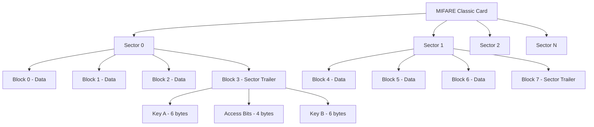
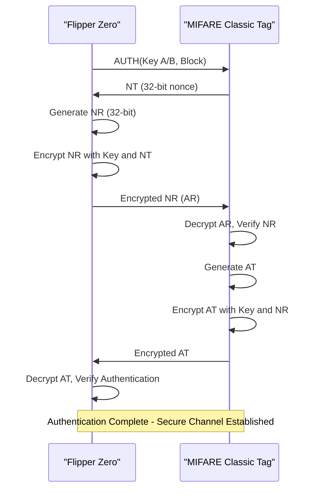
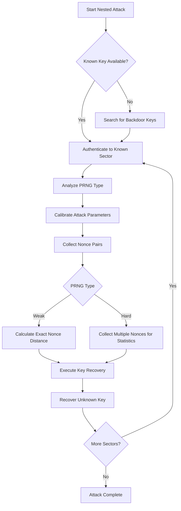
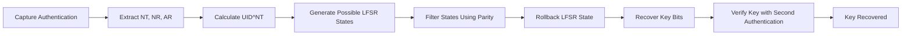
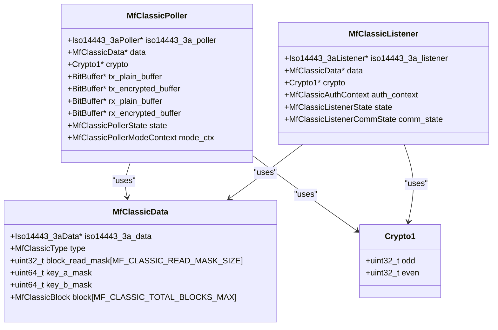
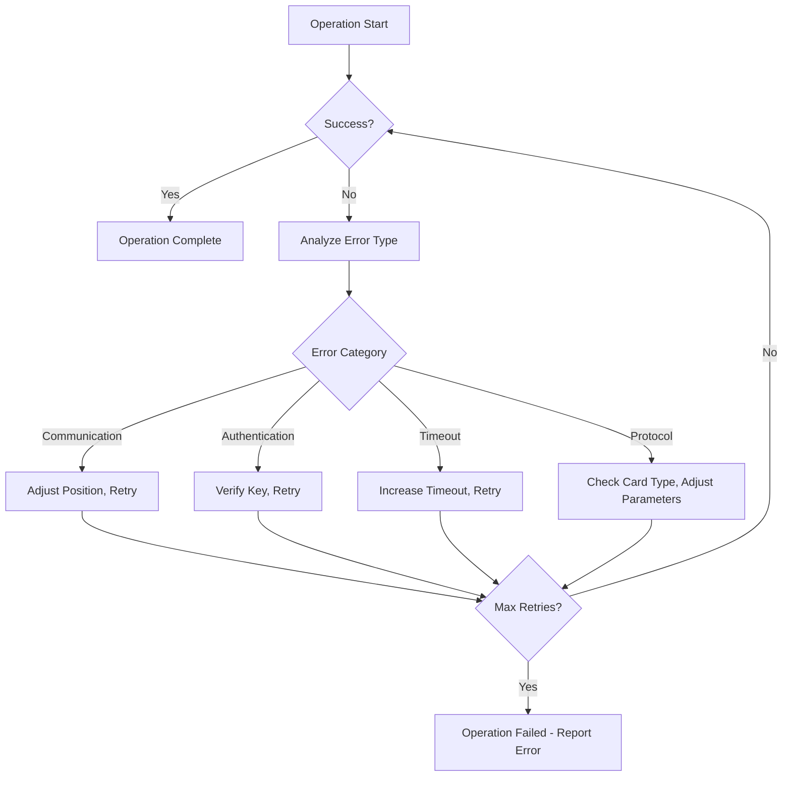

# MIFARE Classic

<cite>
**Referenced Files in This Document**   
- [mf_classic.h](file://lib/nfc/protocols/mf_classic/mf_classic.h)
- [mf_classic.c](file://lib/nfc/protocols/mf_classic/mf_classic.c)
- [mf_classic_poller.c](file://lib/nfc/protocols/mf_classic/mf_classic_poller.c)
- [crypto1.h](file://lib/nfc/helpers/crypto1.h)
- [crypto1.c](file://lib/nfc/helpers/crypto1.c)
- [mfkey.c](file://applications/external/mfkey/mfkey.c)
- [mfkey.h](file://applications/external/mfkey/mfkey.h)
- [mf_classic_listener.c](file://lib/nfc/protocols/mf_classic/mf_classic_listener.c)
</cite>

## Table of Contents
1. [Introduction](#introduction)
2. [Memory Organization](#memory-organization)
3. [Crypto-1 Stream Cipher Authentication](#crypto-1-stream-cipher-authentication)
4. [Nested Authentication Attacks](#nested-authentication-attacks)
5. [Key Recovery Techniques](#key-recovery-techniques)
6. [Flipper Zero Implementation](#flipper-zero-implementation)
7. [Common Issues and Solutions](#common-issues-and-solutions)
8. [Security Analysis](#security-analysis)
9. [Conclusion](#conclusion)

## Introduction

The MIFARE Classic protocol is a widely used contactless smart card technology developed by NXP Semiconductors. It employs a proprietary security mechanism based on the Crypto-1 stream cipher for authentication and data protection. The Flipper Zero device implements comprehensive support for interacting with MIFARE Classic cards, including reading, writing, authentication, and advanced key recovery techniques. This document details the technical implementation of MIFARE Classic protocol in the Flipper Zero firmware, focusing on the cryptographic mechanisms, memory structure, attack methodologies, and practical usage considerations.

**Section sources**
- [mf_classic.h](file://lib/nfc/protocols/mf_classic/mf_classic.h#L1-L249)

## Memory Organization

MIFARE Classic cards organize their memory into a hierarchical structure of sectors and blocks. The memory architecture varies by card type, with three primary variants: Mini (0.3K), 1K, and 4K, referring to their approximate memory capacities. Each card type has a specific number of sectors and blocks as defined in the firmware:

- **MIFARE Classic Mini**: 5 sectors, 20 blocks total
- **MIFARE Classic 1K**: 16 sectors, 64 blocks total  
- **MIFARE Classic 4K**: 40 sectors, 256 blocks total

Each sector consists of multiple blocks, with the final block in each sector designated as a Sector Trailer. The Sector Trailer contains two 48-bit keys (Key A and Key B) and access condition bits that control permissions for reading and writing operations. Data blocks store user data, while the Sector Trailer manages security parameters.

Each block is 16 bytes in size, and access to blocks is governed by access bits stored in the Sector Trailer. These access bits determine whether operations like read, write, increment, or decrement are permitted for Key A, Key B, or both. The access conditions are encoded in a complex bit pattern that defines different permission levels for data blocks and the Sector Trailer itself.

**Diagram sources**
- [mf_classic.h](file://lib/nfc/protocols/mf_classic/mf_classic.h#L128-L129)
- [mf_classic.c](file://lib/nfc/protocols/mf_classic/mf_classic.c#L19-L41)

**Section sources**
- [mf_classic.h](file://lib/nfc/protocols/mf_classic/mf_classic.h#L27-L33)
- [mf_classic.c](file://lib/nfc/protocols/mf_classic/mf_classic.c#L19-L41)

## Crypto-1 Stream Cipher Authentication

The MIFARE Classic authentication mechanism relies on the proprietary Crypto-1 stream cipher, a 48-bit Linear Feedback Shift Register (LFSR) based encryption algorithm. The authentication process follows a 48-bit challenge-response protocol between the reader (Flipper Zero) and the tag (MIFARE Classic card).

The authentication sequence begins when the reader sends an authentication command (0x60 for Key A, 0x61 for Key B) followed by the block address. The tag responds with a 32-bit random number (Nonce NT) generated by its internal pseudo-random number generator (PRNG). The reader then generates its own 32-bit random number (NR) and encrypts it using the shared secret key and the tag's nonce. This encrypted response (AR) is sent to the tag, which decrypts it and verifies the value. If valid, the tag encrypts a response (AT) which the reader decrypts to complete mutual authentication.

The Crypto-1 cipher maintains two 24-bit shift registers (odd and even) that are initialized with the 48-bit key. During authentication, the cipher processes data in 32-bit words, with each bit operation involving feedback from both registers. The cipher's output is used to encrypt communication after successful authentication, ensuring data confidentiality during read and write operations.

**Diagram sources**
- [mf_classic.h](file://lib/nfc/protocols/mf_classic/mf_classic.h#L9-L18)
- [crypto1.c](file://lib/nfc/helpers/crypto1.c#L34-L42)

**Section sources**
- [crypto1.h](file://lib/nfc/helpers/crypto1.h#L10-L13)
- [crypto1.c](file://lib/nfc/helpers/crypto1.c#L28-L42)

## Nested Authentication Attacks

Nested authentication attacks exploit the MIFARE Classic protocol's vulnerability when multiple sectors on the same card use the same key. This attack methodology allows an attacker to recover unknown keys by leveraging knowledge of at least one sector's key. The Flipper Zero implements sophisticated nested authentication attack capabilities that systematically collect nonce pairs to facilitate key recovery.

The attack process begins with the Flipper Zero authenticating to a known sector using a recovered key. After successful authentication, it performs a series of nested authentication attempts to target sectors with unknown keys. During these attempts, the device collects encrypted nonces (NT_ENC) from the tag. The PRNG predictability in MIFARE Classic tags allows the Flipper Zero to analyze the relationship between consecutive nonces and determine the distance between them based on parity bits.

For weak PRNG implementations (common in older tags), the Flipper Zero can collect multiple nonce pairs at known distances, which significantly reduces the key search space. For tags with stronger PRNGs (hardnested), the attack relies on collecting numerous nonce samples to perform statistical analysis. The firmware implements different attack strategies based on the detected PRNG type, optimizing the key recovery process for both weak and hard variants.

The nested attack controller in the Flipper Zero firmware manages the entire process, transitioning through phases including PRNG analysis, calibration, nonce collection, and dictionary attack execution. This systematic approach maximizes the chances of successful key recovery while minimizing the time and computational resources required.

**Diagram sources**
- [mf_classic_poller.c](file://lib/nfc/protocols/mf_classic/mf_classic_poller.c#L1859-L2174)
- [mf_classic_poller.c](file://lib/nfc/protocols/mf_classic/mf_classic_poller.c#L1375-L1558)

**Section sources**
- [mf_classic_poller.c](file://lib/nfc/protocols/mf_classic/mf_classic_poller.c#L1375-L1558)
- [mf_classic_poller.c](file://lib/nfc/protocols/mf_classic/mf_classic_poller.c#L1859-L2174)

## Key Recovery Techniques

The Flipper Zero implements several advanced key recovery techniques that exploit weaknesses in the MIFARE Classic protocol and its implementations. The primary method is the mfkey32 algorithm, which recovers keys from single authentication attempts by leveraging the predictable nature of the tag's PRNG. This attack works by analyzing the relationship between the tag nonce (NT), reader challenge (NR), and reader response (AR) to reverse-engineer the Crypto-1 state.

The mfkey tool in the Flipper Zero firmware implements a highly optimized key recovery algorithm that uses a time-memory trade-off approach. It pre-computes possible LFSR states and uses filtering techniques to eliminate impossible states efficiently. The algorithm exploits the fact that the Crypto-1 filter function has a non-uniform output distribution, allowing it to eliminate large portions of the key search space quickly.

For static encrypted tags (a variant with additional security), the Flipper Zero implements specialized recovery techniques that account for the modified authentication protocol. These tags use a fixed nonce encryption scheme that requires different attack parameters but is still vulnerable due to the underlying PRNG weaknesses.

The key recovery process is optimized for the Flipper Zero's hardware constraints, using memory-efficient data structures and algorithms that balance computational complexity with available RAM. The implementation includes features like key buffering and batch processing to minimize I/O operations and improve performance during dictionary attacks.

**Diagram sources**
- [mfkey.c](file://applications/external/mfkey/mfkey.c#L620-L901)
- [crypto1.h](file://applications/external/mfkey/crypto1.h#L16-L32)

**Section sources**
- [mfkey.c](file://applications/external/mfkey/mfkey.c#L620-L901)
- [mfkey.h](file://applications/external/mfkey/mfkey.h#L62-L96)

## Flipper Zero Implementation

The Flipper Zero's MIFARE Classic implementation is structured as a comprehensive NFC protocol handler with distinct components for polling, listening, and key recovery. The core functionality is organized in the `mf_classic` module, which provides data structures and utility functions for managing MIFARE Classic cards, while specialized poller and listener components handle active and passive operations respectively.

The poller component (`mf_classic_poller.c`) implements the reader functionality, managing the authentication state machine, handling read/write operations, and executing advanced attacks like nested authentication. It maintains a cryptographic context for each authentication session and interfaces with the lower-level ISO14443-3A protocol handler for raw NFC communication.

The listener component (`mf_classic_listener.c`) enables the Flipper Zero to emulate a MIFARE Classic tag, responding to reader commands with appropriate authentication sequences and data. This is useful for testing reader devices and understanding protocol interactions.

Key recovery functionality is implemented as a separate plugin (`mfkey`) that processes captured authentication attempts and recovers cryptographic keys. This modular design allows the key recovery process to run independently of the NFC communication layer, enabling offline analysis of captured authentication data.

The implementation includes robust error handling and retry mechanisms to address the challenges of NFC communication, such as field disturbances and timing issues. It also provides comprehensive feedback through the user interface, displaying progress information during lengthy operations like key recovery.

**Diagram sources**
- [mf_classic.h](file://lib/nfc/protocols/mf_classic/mf_classic.h#L137-L144)
- [mf_classic_poller.c](file://lib/nfc/protocols/mf_classic/mf_classic_poller.c#L29-L88)
- [mf_classic_listener.c](file://lib/nfc/protocols/mf_classic/mf_classic_listener.c#L18-L39)

**Section sources**
- [mf_classic.h](file://lib/nfc/protocols/mf_classic/mf_classic.h#L137-L144)
- [mf_classic_poller.c](file://lib/nfc/protocols/mf_classic/mf_classic_poller.c#L29-L88)
- [mf_classic_listener.c](file://lib/nfc/protocols/mf_classic/mf_classic_listener.c#L18-L39)

## Common Issues and Solutions

Several common issues can occur when working with MIFARE Classic cards using the Flipper Zero, primarily related to NFC communication reliability and authentication failures. The most frequent issue is failed authentications due to field disturbances, which can be caused by suboptimal positioning, electromagnetic interference, or power fluctuations in the tag.

To address these issues, the Flipper Zero firmware implements several solutions. The primary approach is the use of retry strategies, where authentication attempts are automatically repeated upon failure. The number of retries and timing between attempts are optimized based on the specific operation being performed.

Signal optimization is another critical aspect, with the firmware adjusting transmission parameters to maximize coupling efficiency. This includes tuning the NFC field strength and timing parameters to match the characteristics of different tag types and environmental conditions.

For key recovery operations, the system implements progress tracking and checkpointing to allow resumption of interrupted operations. This is particularly important for lengthy attacks like hardnested key recovery, which can take significant time to complete.

The user interface provides detailed feedback about operation status, including success rates, error types, and estimated time to completion. This information helps users diagnose issues and adjust their approach, such as repositioning the device or selecting different attack parameters.

**Diagram sources**
- [mf_classic_poller.c](file://lib/nfc/protocols/mf_classic/mf_classic_poller.c#L123-L155)
- [mf_classic_poller.c](file://lib/nfc/protocols/mf_classic/mf_classic_poller.c#L1859-L2174)

**Section sources**
- [mf_classic_poller.c](file://lib/nfc/protocols/mf_classic/mf_classic_poller.c#L123-L155)
- [mf_classic_poller.c](file://lib/nfc/protocols/mf_classic/mf_classic_poller.c#L1859-L2174)

## Security Analysis

The MIFARE Classic protocol has well-documented security vulnerabilities that make it susceptible to cloning and unauthorized access. The primary weakness lies in the proprietary Crypto-1 stream cipher, which has been reverse-engineered and shown to have significant cryptographic flaws. The 48-bit key length, while substantial when the protocol was introduced, is now vulnerable to brute-force attacks given modern computational capabilities.

The predictable PRNG implementation in most MIFARE Classic tags is another critical vulnerability. The linear feedback shift register used to generate nonces has a relatively small state space and predictable behavior, enabling attacks like the nested authentication and mfkey32 that can recover keys from observed authentication attempts.

The access control system, while providing some level of security through access bits, is limited in its flexibility and can be bypassed when keys are recovered. Once an attacker obtains a single key for a sector, they can potentially access or modify the access bits to gain broader permissions.

The Flipper Zero's implementation highlights these vulnerabilities by providing tools that automate the exploitation of these weaknesses. However, this also serves an important security research purpose, allowing system administrators and security professionals to assess the vulnerability of existing MIFARE Classic installations and plan appropriate upgrades to more secure alternatives.

Despite these vulnerabilities, MIFARE Classic remains in widespread use due to its low cost and established infrastructure. The security analysis suggests that organizations using MIFARE Classic should implement additional security layers, regularly rotate keys, and plan for migration to more secure protocols like MIFARE DESFire or modern cryptographic standards.

**Section sources**
- [mf_classic.h](file://lib/nfc/protocols/mf_classic/mf_classic.h#L39-L46)
- [crypto1.c](file://lib/nfc/helpers/crypto1.c#L44-L52)
- [mfkey.c](file://applications/external/mfkey/mfkey.c#L620-L901)

## Conclusion

The Flipper Zero provides a comprehensive implementation of the MIFARE Classic protocol, enabling users to interact with these cards for both legitimate purposes and security research. The system's architecture effectively separates concerns between data representation, communication handling, and cryptographic operations, resulting in a robust and maintainable codebase.

The implementation demonstrates sophisticated understanding of the MIFARE Classic protocol's strengths and weaknesses, providing tools that leverage the cryptographic vulnerabilities for key recovery while maintaining compatibility with standard operations like reading and writing data. The nested authentication attacks and mfkey32 algorithm represent state-of-the-art techniques for exploiting the protocol's weaknesses in a practical, user-friendly manner.

For security professionals, the Flipper Zero serves as an excellent tool for assessing the security of MIFARE Classic installations and demonstrating the importance of upgrading to more secure alternatives. The detailed implementation also provides valuable educational insights into NFC security, cryptographic protocols, and attack methodologies.

As contactless technology continues to evolve, understanding the limitations of legacy systems like MIFARE Classic remains crucial for developing more secure solutions and protecting existing infrastructure from exploitation.