# MIFARE DESFire

<cite>
**Referenced Files in This Document**   
- [mf_desfire.h](file://lib/nfc/protocols/mf_desfire/mf_desfire.h)
- [mf_desfire.c](file://lib/nfc/protocols/mf_desfire/mf_desfire.c)
- [mf_desfire_i.h](file://lib/nfc/protocols/mf_desfire/mf_desfire_i.h)
- [mf_desfire_i.c](file://lib/nfc/protocols/mf_desfire/mf_desfire_i.c)
- [mf_desfire_poller.h](file://lib/nfc/protocols/mf_desfire/mf_desfire_poller.h)
- [mf_desfire_poller.c](file://lib/nfc/protocols/mf_desfire/mf_desfire_poller.c)
- [nfc_scene_mf_desfire_app.c](file://applications/main/nfc/scenes/nfc_scene_mf_desfire_app.c)
- [mf_desfire_render.c](file://applications/main/nfc/helpers/protocol_support/mf_desfire/mf_desfire_render.c)
- [iso14443_4a.h](file://lib/nfc/protocols/iso14443_4a/iso14443_4a.h)
</cite>

## Table of Contents
1. [Introduction](#introduction)
2. [Protocol Architecture](#protocol-architecture)
3. [Hierarchical File System](#hierarchical-file-system)
4. [Security Features](#security-features)
5. [Authentication Process](#authentication-process)
6. [Cryptographic Algorithms](#cryptographic-algorithms)
7. [Secure Messaging and MAC Verification](#secure-messaging-and-mac-verification)
8. [Application Management](#application-management)
9. [Use Cases](#use-cases)
10. [Advantages Over Other MIFARE Variants](#advantages-over-other-mifare-variants)

## Introduction
The MIFARE DESFire protocol implementation in the Flipper Zero provides advanced security features for contactless smart card applications. This document details the implementation of ISO/IEC 14443-4 compliant communication, support for multiple cryptographic algorithms including DES, 3DES, and AES, and secure messaging with Message Authentication Code (MAC) verification. The Flipper Zero's implementation enables users to interact with MIFARE DESFire cards used in high-security environments such as electronic passports and banking systems.

## Protocol Architecture
The MIFARE DESFire implementation in Flipper Zero follows a layered architecture that ensures compliance with ISO/IEC 14443-4 standards while providing a robust interface for application development.

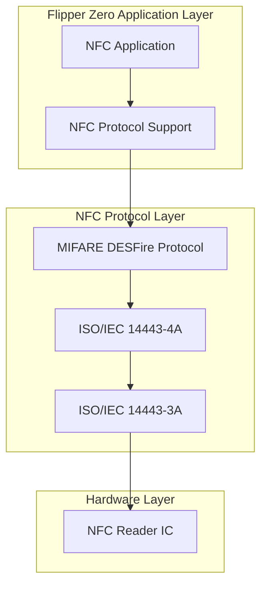

**Diagram sources**
- [mf_desfire.h](file://lib/nfc/protocols/mf_desfire/mf_desfire.h#L3-225)
- [iso14443_4a.h](file://lib/nfc/protocols/iso14443_4a/iso14443_4a.h#L1-42)

**Section sources**
- [mf_desfire.h](file://lib/nfc/protocols/mf_desfire/mf_desfire.h#L3-225)
- [mf_desfire.c](file://lib/nfc/protocols/mf_desfire/mf_desfire.c#L1-420)

## Hierarchical File System
MIFARE DESFire cards implement a hierarchical file system structure consisting of applications, files, and diversified keys. This structure provides a secure and organized way to store and manage data.

### Application Structure
The application structure in MIFARE DESFire is defined by the `MfDesfireApplication` struct, which contains key settings, key versions, file IDs, file settings, and file data.

```mermaid
classDiagram
class MfDesfireApplication {
+MfDesfireKeySettings key_settings
+SimpleArray* key_versions
+SimpleArray* file_ids
+SimpleArray* file_settings
+SimpleArray* file_data
}
class MfDesfireFileSettings {
+MfDesfireFileType type
+MfDesfireFileCommunicationSettings comm
+MfDesfireFileAccessRights access_rights[14]
+uint8_t access_rights_len
+union { data, value, record, transaction_mac }
}
class MfDesfireFileData {
+SimpleArray* data
}
class MfDesfireApplicationId {
+uint8_t data[3]
}
MfDesfireApplication --> MfDesfireFileSettings : "contains"
MfDesfireApplication --> MfDesfireFileData : "contains"
MfDesfireApplication --> MfDesfireApplicationId : "identified by"
```

**Diagram sources**
- [mf_desfire.h](file://lib/nfc/protocols/mf_desfire/mf_desfire.h#L151-161)
- [mf_desfire.h](file://lib/nfc/protocols/mf_desfire/mf_desfire.h#L119-145)

**Section sources**
- [mf_desfire.h](file://lib/nfc/protocols/mf_desfire/mf_desfire.h#L119-161)
- [mf_desfire_i.c](file://lib/nfc/protocols/mf_desfire/mf_desfire_i.c#L327-332)

### File Types
MIFARE DESFire supports multiple file types, each designed for specific use cases:

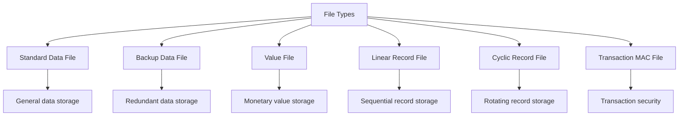

**Diagram sources**
- [mf_desfire.h](file://lib/nfc/protocols/mf_desfire/mf_desfire.h#L101-108)

**Section sources**
- [mf_desfire.h](file://lib/nfc/protocols/mf_desfire/mf_desfire.h#L101-108)

## Security Features
The MIFARE DESFire implementation in Flipper Zero incorporates multiple advanced security features to protect against various attack vectors.

### Communication Settings
Files can be configured with different communication settings to control the level of security:

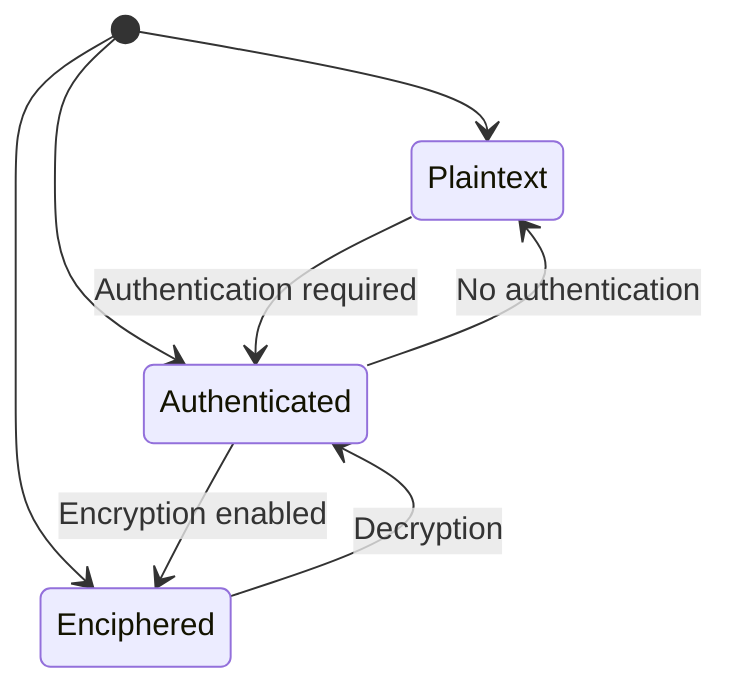

**Diagram sources**
- [mf_desfire.h](file://lib/nfc/protocols/mf_desfire/mf_desfire.h#L110-114)

**Section sources**
- [mf_desfire.h](file://lib/nfc/protocols/mf_desfire/mf_desfire.h#L110-114)

### Key Management
The key management system supports up to 14 keys per application with version tracking:

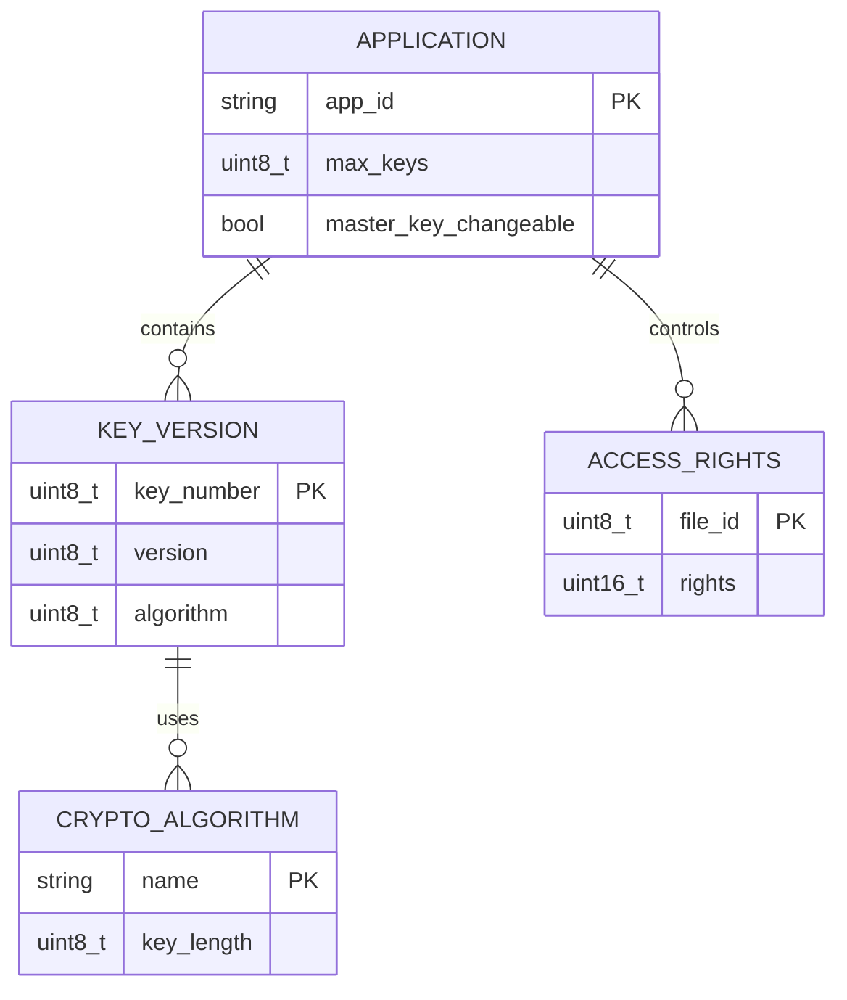

**Diagram sources**
- [mf_desfire.h](file://lib/nfc/protocols/mf_desfire/mf_desfire.h#L89-97)
- [mf_desfire.h](file://lib/nfc/protocols/mf_desfire/mf_desfire.h#L99)

**Section sources**
- [mf_desfire.h](file://lib/nfc/protocols/mf_desfire/mf_desfire.h#L89-99)
- [mf_desfire_i.c](file://lib/nfc/protocols/mf_desfire/mf_desfire_i.c#L84-92)

## Authentication Process
The authentication process in MIFARE DESFire involves establishing a secure channel through a challenge-response mechanism using diversified keys.

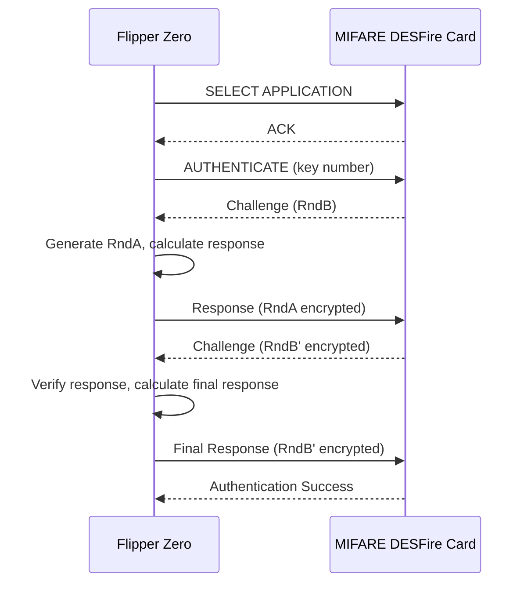

**Diagram sources**
- [mf_desfire_poller.c](file://lib/nfc/protocols/mf_desfire/mf_desfire_poller.c#L1-272)
- [mf_desfire.c](file://lib/nfc/protocols/mf_desfire/mf_desfire.c#L63-83)

**Section sources**
- [mf_desfire_poller.c](file://lib/nfc/protocols/mf_desfire/mf_desfire_poller.c#L1-272)
- [mf_desfire.c](file://lib/nfc/protocols/mf_desfire/mf_desfire.c#L63-83)

## Cryptographic Algorithms
The Flipper Zero's MIFARE DESFire implementation supports multiple cryptographic algorithms for secure communication.

### Supported Algorithms
The system supports the following cryptographic algorithms:

| Algorithm | Key Length | Security Level | Use Case |
|---------|-----------|--------------|---------|
| DES | 56 bits | Basic | Legacy systems |
| 3DES | 112/168 bits | High | Secure transactions |
| AES | 128/192/256 bits | Very High | High-security applications |

**Section sources**
- [mf_desfire.h](file://lib/nfc/protocols/mf_desfire/mf_desfire.h#L110-114)
- [mf_desfire_poller.h](file://lib/nfc/protocols/mf_desfire/mf_desfire_poller.h#L1-290)

### Algorithm Selection
The cryptographic algorithm is determined by the key settings and file communication settings:

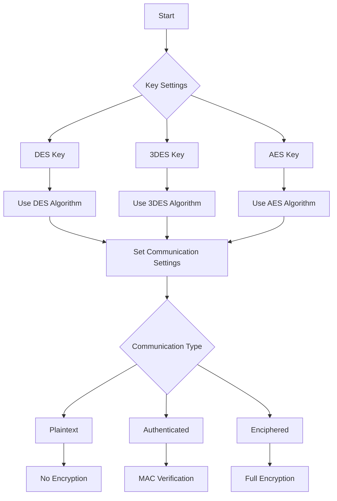

**Diagram sources**
- [mf_desfire.h](file://lib/nfc/protocols/mf_desfire/mf_desfire.h#L110-114)
- [mf_desfire_i.c](file://lib/nfc/protocols/mf_desfire/mf_desfire_i.c#L84-92)

**Section sources**
- [mf_desfire.h](file://lib/nfc/protocols/mf_desfire/mf_desfire.h#L110-114)
- [mf_desfire_i.c](file://lib/nfc/protocols/mf_desfire/mf_desfire_i.c#L84-92)

## Secure Messaging and MAC Verification
Secure messaging in MIFARE DESFire ensures data integrity and authenticity through Message Authentication Code (MAC) verification.

### MAC Verification Process
The MAC verification process ensures that data has not been tampered with during transmission:

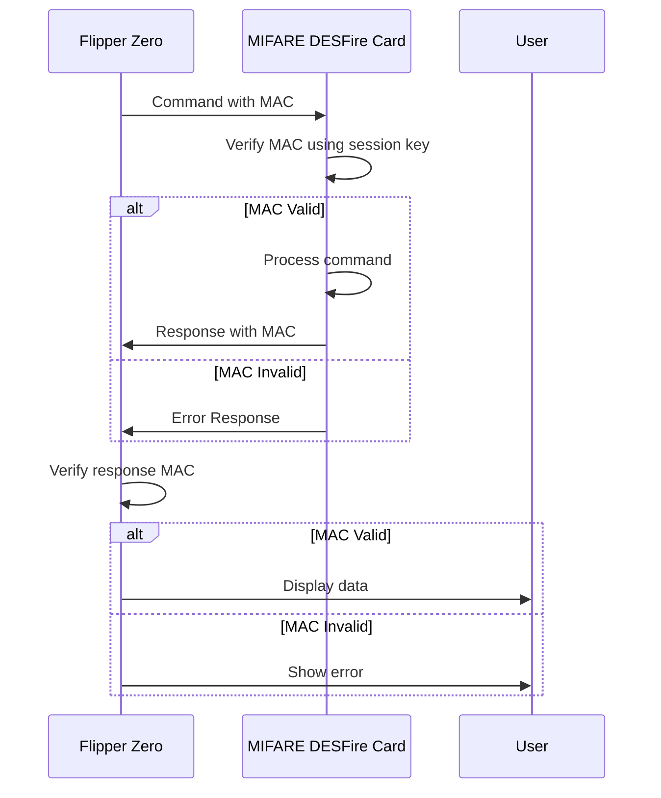

**Diagram sources**
- [mf_desfire_poller.c](file://lib/nfc/protocols/mf_desfire/mf_desfire_poller.c#L1-272)
- [mf_desfire_i.c](file://lib/nfc/protocols/mf_desfire/mf_desfire_i.c#L1-800)

**Section sources**
- [mf_desfire_poller.c](file://lib/nfc/protocols/mf_desfire/mf_desfire_poller.c#L1-272)
- [mf_desfire_i.c](file://lib/nfc/protocols/mf_desfire/mf_desfire_i.c#L1-800)

### Secure Channel Establishment
The secure channel establishment process creates a protected communication path:

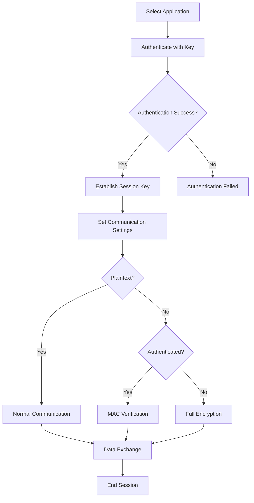

**Diagram sources**
- [mf_desfire_poller.c](file://lib/nfc/protocols/mf_desfire/mf_desfire_poller.c#L1-272)
- [mf_desfire.c](file://lib/nfc/protocols/mf_desfire/mf_desfire.c#L63-83)

**Section sources**
- [mf_desfire_poller.c](file://lib/nfc/protocols/mf_desfire/mf_desfire_poller.c#L1-272)
- [mf_desfire.c](file://lib/nfc/protocols/mf_desfire/mf_desfire.c#L63-83)

## Application Management
The Flipper Zero provides comprehensive tools for managing MIFARE DESFire applications, including creating applications, reading transaction logs, and managing access rights.

### Application Creation
Creating a new application on a MIFARE DESFire card:

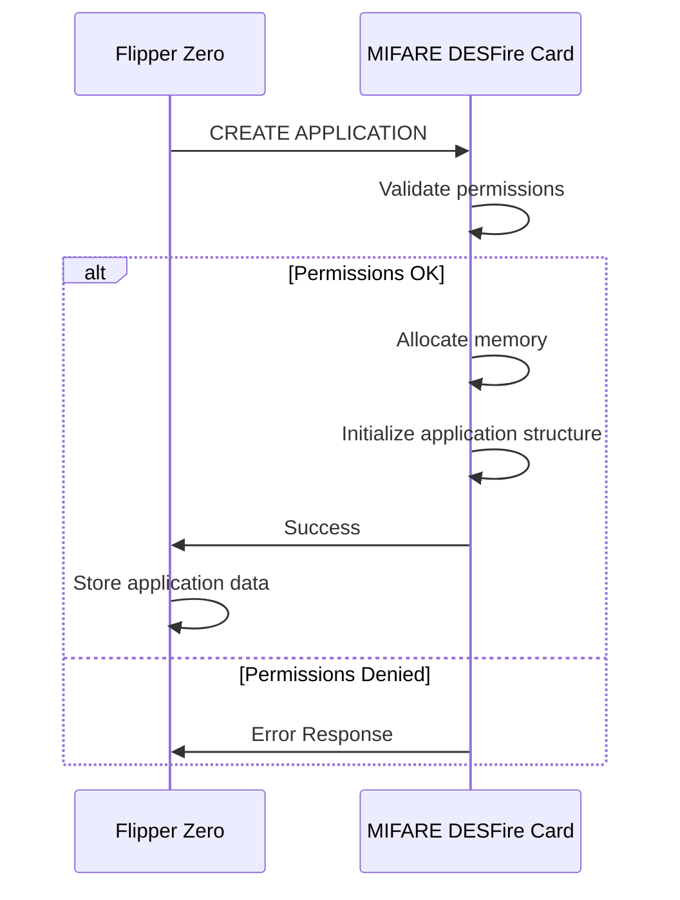

**Diagram sources**
- [mf_desfire.h](file://lib/nfc/protocols/mf_desfire/mf_desfire.h#L20-26)
- [mf_desfire_poller.c](file://lib/nfc/protocols/mf_desfire/mf_desfire_poller.c#L1-272)

**Section sources**
- [mf_desfire.h](file://lib/nfc/protocols/mf_desfire/mf_desfire.h#L20-26)
- [mf_desfire_poller.c](file://lib/nfc/protocols/mf_desfire/mf_desfire_poller.c#L1-272)

### Reading Transaction Logs
Accessing transaction logs from a MIFARE DESFire card:

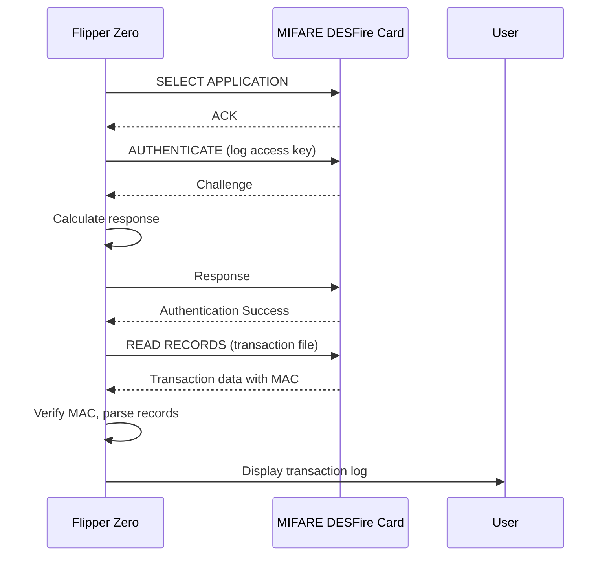

**Diagram sources**
- [mf_desfire_poller.h](file://lib/nfc/protocols/mf_desfire/mf_desfire_poller.h#L236-242)
- [nfc_scene_mf_desfire_app.c](file://applications/main/nfc/scenes/nfc_scene_mf_desfire_app.c#L1-110)

**Section sources**
- [mf_desfire_poller.h](file://lib/nfc/protocols/mf_desfire/mf_desfire_poller.h#L236-242)
- [nfc_scene_mf_desfire_app.c](file://applications/main/nfc/scenes/nfc_scene_mf_desfire_app.c#L1-110)

### Access Rights Management
Managing access rights for files within an application:

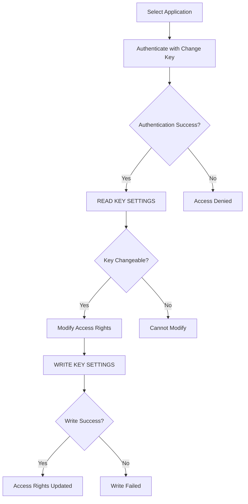

**Diagram sources**
- [mf_desfire.h](file://lib/nfc/protocols/mf_desfire/mf_desfire.h#L89-97)
- [mf_desfire_poller.h](file://lib/nfc/protocols/mf_desfire/mf_desfire_poller.h#L91-93)

**Section sources**
- [mf_desfire.h](file://lib/nfc/protocols/mf_desfire/mf_desfire.h#L89-97)
- [mf_desfire_poller.h](file://lib/nfc/protocols/mf_desfire/mf_desfire_poller.h#L91-93)

## Use Cases
The MIFARE DESFire implementation in Flipper Zero has several high-security use cases.

### Electronic Passports
Electronic passports use MIFARE DESFire for secure storage of biometric data:

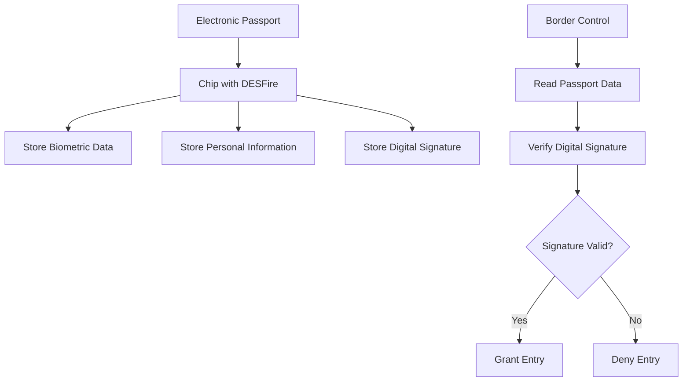

**Section sources**
- [mf_desfire.h](file://lib/nfc/protocols/mf_desfire/mf_desfire.h#L1-225)
- [mf_desfire_poller.h](file://lib/nfc/protocols/mf_desfire/mf_desfire_poller.h#L1-290)

### Banking Applications
Banking applications use MIFARE DESFire for secure financial transactions:

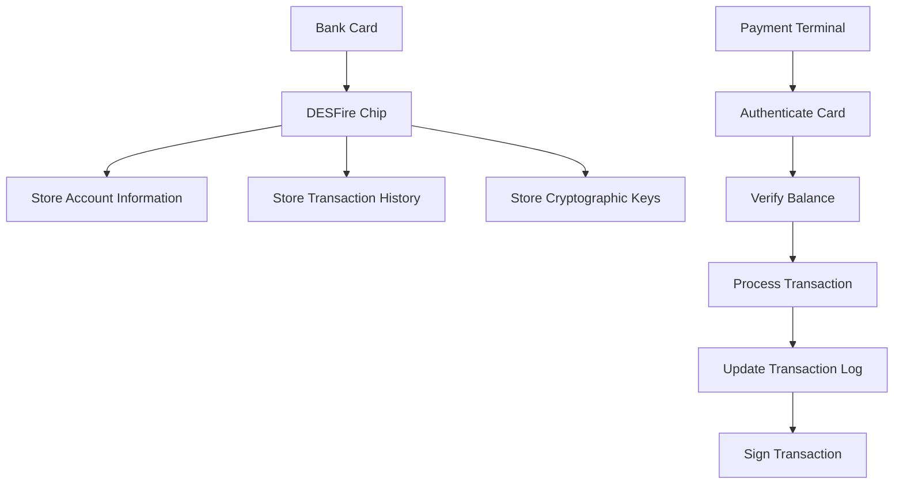

**Section sources**
- [mf_desfire.h](file://lib/nfc/protocols/mf_desfire/mf_desfire.h#L1-225)
- [mf_desfire_poller.h](file://lib/nfc/protocols/mf_desfire/mf_desfire_poller.h#L1-290)

## Advantages Over Other MIFARE Variants
The MIFARE DESFire protocol offers several advantages over other MIFARE variants like MIFARE Classic.

### Security Comparison
Comparing security features across MIFARE variants:

| Feature | MIFARE Classic | MIFARE DESFire | Advantage |
|-------|---------------|---------------|---------|
| Cryptographic Algorithm | Proprietary Crypto1 | DES, 3DES, AES | Stronger encryption |
| Key Management | Static keys | Diversified keys | Better key security |
| Authentication | One-way | Mutual authentication | Enhanced security |
| File System | Flat | Hierarchical | Better organization |
| Memory Protection | None | Access rights per file | Granular control |
| Transaction Security | None | MAC verification | Data integrity |

**Section sources**
- [mf_desfire.h](file://lib/nfc/protocols/mf_desfire/mf_desfire.h#L1-225)
- [mf_desfire_poller.h](file://lib/nfc/protocols/mf_desfire/mf_desfire_poller.h#L1-290)

### Performance Comparison
Performance characteristics of MIFARE variants:

| Characteristic | MIFARE Classic | MIFARE DESFire | Advantage |
|--------------|---------------|---------------|---------|
| Data Transfer Rate | 106 kbps | Up to 848 kbps | Faster communication |
| Memory Capacity | 716 bytes | Up to 32 KB | More storage |
| File Operations | Limited | Comprehensive | More functionality |
| Power Consumption | Low | Moderate | Trade-off for security |
| Transaction Speed | Fast | Moderate | Security vs. speed |

**Section sources**
- [mf_desfire.h](file://lib/nfc/protocols/mf_desfire/mf_desfire.h#L50-59)
- [mf_desfire_poller.h](file://lib/nfc/protocols/mf_desfire/mf_desfire_poller.h#L1-290)