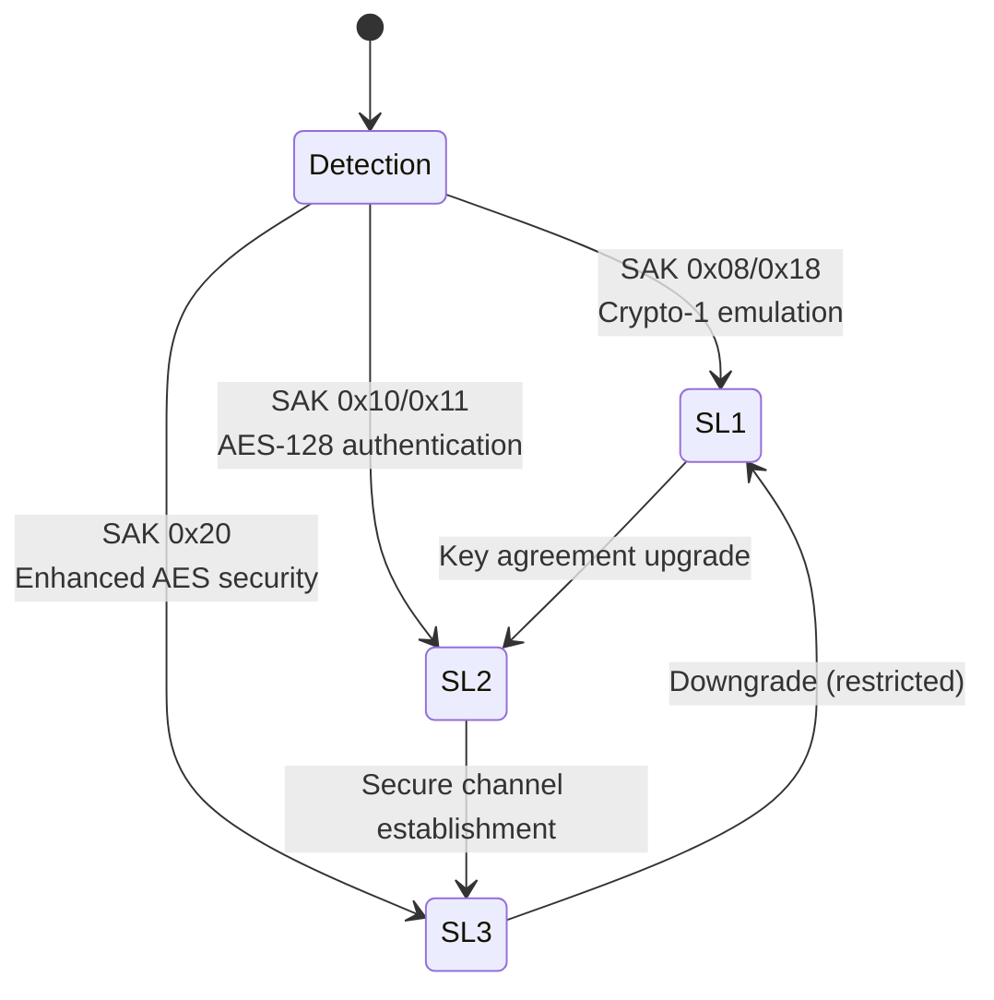
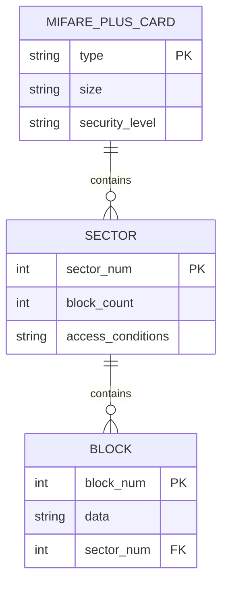
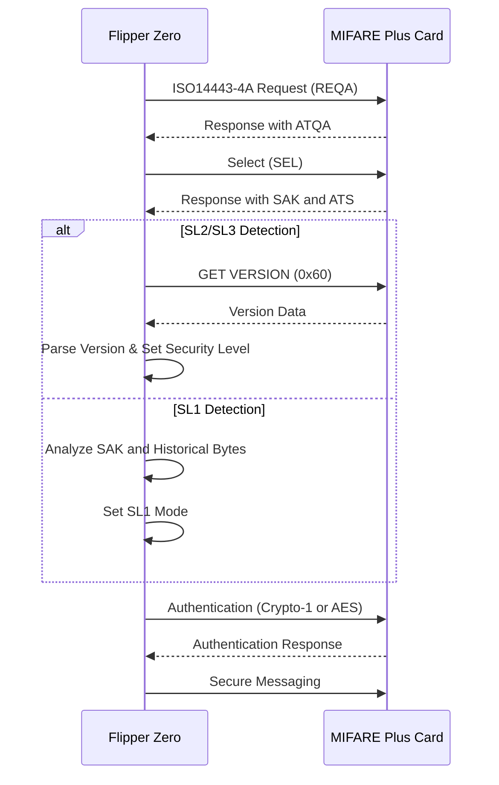
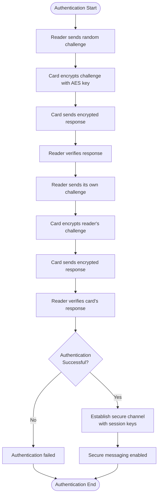
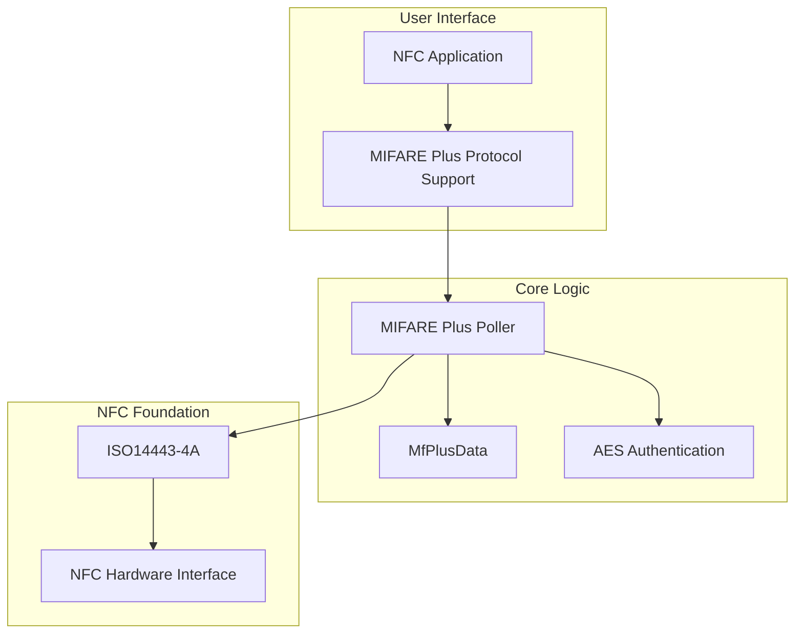
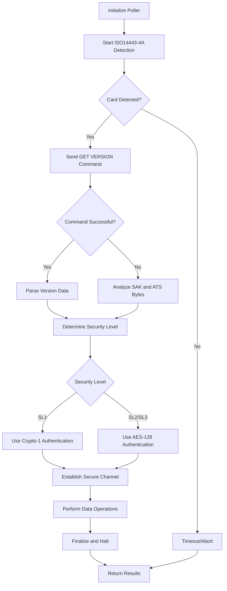

# MIFARE Plus

<cite>
**Referenced Files in This Document**   
- [mf_plus.h](file://lib/nfc/protocols/mf_plus/mf_plus.h)
- [mf_plus.c](file://lib/nfc/protocols/mf_plus/mf_plus.c)
- [mf_plus_i.c](file://lib/nfc/protocols/mf_plus/mf_plus_i.c)
- [mf_plus_poller.c](file://lib/nfc/protocols/mf_plus/mf_plus_poller.c)
- [mf_plus_poller_i.c](file://lib/nfc/protocols/mf_plus/mf_plus_poller_i.c)
- [mf_classic.h](file://lib/nfc/protocols/mf_classic/mf_classic.h)
- [mf_classic.c](file://lib/nfc/protocols/mf_classic/mf_classic.c)
- [crypto1.c](file://applications/external/esubghz_chat/lib/nfclegacy/protocols/crypto1.c)
- [nfc_protocol_support_mf_plus.h](file://applications/main/nfc/helpers/protocol_support/mf_plus/mf_plus.h)
- [nfc_protocol_support_mf_plus.c](file://applications/main/nfc/helpers/protocol_support/mf_plus/mf_plus.c)
</cite>

## Table of Contents
1. [Introduction](#introduction)
2. [MIFARE Plus Security Levels](#mifare-plus-security-levels)
3. [Memory Organization and Backward Compatibility](#memory-organization-and-backward-compatibility)
4. [Security Level Detection and Transition](#security-level-detection-and-transition)
5. [AES Authentication and Secure Messaging](#aes-authentication-and-secure-messaging)
6. [Migration from MIFARE Classic](#migration-from-mifare-classic)
7. [Implementation Architecture](#implementation-architecture)
8. [Code Flow Analysis](#code-flow-analysis)
9. [Security Improvements Over Crypto-1](#security-improvements-over-crypto-1)

## Introduction
The MIFARE Plus protocol implementation in the Flipper Zero provides a secure, drop-in replacement for MIFARE Classic cards while maintaining backward compatibility with existing infrastructure. This document details how the Flipper Zero handles MIFARE Plus cards across their various security levels, with enhanced security through AES-128 authentication in SL2 and SL3 modes, while preserving the familiar memory organization of MIFARE Classic (1K/2K/4K variants). The implementation supports the backward compatibility mode (SL1) that emulates the vulnerable Crypto-1 algorithm for legacy systems, enabling seamless migration scenarios from Classic to Plus cards.

**Section sources**
- [mf_plus.h](file://lib/nfc/protocols/mf_plus/mf_plus.h#L1-L116)
- [mf_classic.h](file://lib/nfc/protocols/mf_classic/mf_classic.h#L1-L100)

## MIFARE Plus Security Levels
MIFARE Plus implements a tiered security model with three distinct security levels (SL1, SL2, and SL3) that provide progressive security enhancements while maintaining compatibility with existing MIFARE Classic infrastructure. Security Level 1 (SL1) operates in backward compatibility mode, emulating the Crypto-1 authentication protocol used by MIFARE Classic cards. This allows MIFARE Plus cards to function in legacy systems designed for Classic cards without requiring infrastructure changes.

Security Level 2 (SL2) introduces AES-128 authentication, replacing the vulnerable Crypto-1 algorithm with a much stronger cryptographic foundation. This level provides significantly improved protection against cloning and unauthorized access while maintaining the same command structure and memory organization as Classic cards. Security Level 3 (SL3) offers the highest level of security with additional countermeasures against side-channel attacks and advanced cryptographic protocols.

The Flipper Zero firmware detects the security level through analysis of the card's SAK (Select Acknowledge) value and historical bytes in the ATS (Answer to Select) response. Different SAK values indicate different security levels: SAK 0x08/0x18 for SL1, SAK 0x10/0x11 for SL2, and SAK 0x20 for SL3. The historical bytes in the ATS response contain manufacturer-specific identifiers that further confirm the card type and security capabilities.

**Diagram sources**
- [mf_plus_i.c](file://lib/nfc/protocols/mf_plus/mf_plus_i.c#L94-L223)
- [mf_plus.h](file://lib/nfc/protocols/mf_plus/mf_plus.h#L45-L53)

**Section sources**
- [mf_plus.h](file://lib/nfc/protocols/mf_plus/mf_plus.h#L45-L53)
- [mf_plus_i.c](file://lib/nfc/protocols/mf_plus/mf_plus_i.c#L94-L223)

## Memory Organization and Backward Compatibility
MIFARE Plus maintains identical memory organization to MIFARE Classic cards, preserving the 1K, 2K, and 4K variants with the same sector and block structure. This backward compatibility is crucial for migration scenarios, as it allows existing systems to read and write data to MIFARE Plus cards without modification. The memory is organized into sectors, with each sector containing multiple blocks that can be individually accessed based on access conditions defined in the sector trailer.

For 1K cards, there are 16 sectors with 4 blocks each (total 64 blocks), while 4K cards have 40 sectors with varying block counts (16 sectors of 4 blocks and 24 sectors of 16 blocks). The 2K variant follows a similar pattern. This structure is identical to MIFARE Classic, ensuring that applications designed for Classic cards can interact with Plus cards in SL1 mode without any changes.

The Flipper Zero leverages this compatibility to enable seamless transitions between security levels. When operating in SL1 mode, the device emulates the exact memory layout and access patterns of a MIFARE Classic card, allowing it to function as a direct replacement. This is particularly valuable for system administrators who want to upgrade security without disrupting existing workflows or requiring hardware changes across their infrastructure.

**Diagram sources**
- [mf_classic.c](file://lib/nfc/protocols/mf_classic/mf_classic.c#L19-L41)
- [mf_plus.c](file://lib/nfc/protocols/mf_plus/mf_plus.c#L8-L23)

**Section sources**
- [mf_classic.c](file://lib/nfc/protocols/mf_classic/mf_classic.c#L19-L41)
- [mf_plus.c](file://lib/nfc/protocols/mf_plus/mf_plus.c#L8-L23)

## Security Level Detection and Transition
The Flipper Zero implements a sophisticated detection mechanism to identify the security level of MIFARE Plus cards and transition between modes as needed. The detection process begins with the ISO14443-4A identification, where the device reads the card's ATQA and SAK values to determine basic compatibility. For MIFARE Plus cards, the firmware then performs additional checks by sending the GET VERSION command (0x60) to retrieve the card's hardware and software version information.

When the GET VERSION command fails (indicating SL1 mode or non-compliant cards), the system falls back to analyzing the ATS historical bytes and SAK value to determine the card type and security level. The historical bytes contain specific patterns that identify MIFARE Plus variants (S, X, SE) and their capabilities. This two-stage detection process ensures accurate identification of the card's security capabilities.

Transition between security levels is handled through key agreement protocols. When upgrading from SL1 to SL2, the system establishes a secure channel using AES-128 authentication with pre-shared keys. The Flipper Zero can emulate this process in both reader and card roles, allowing it to test and interact with MIFARE Plus cards across all security levels. The transition preserves the card's memory content while enhancing the security of subsequent communications.

**Diagram sources**
- [mf_plus_poller.c](file://lib/nfc/protocols/mf_plus/mf_plus_poller.c#L60-L84)
- [mf_plus_i.c](file://lib/nfc/protocols/mf_plus/mf_plus_i.c#L228-L238)

**Section sources**
- [mf_plus_poller.c](file://lib/nfc/protocols/mf_plus/mf_plus_poller.c#L60-L84)
- [mf_plus_i.c](file://lib/nfc/protocols/mf_plus/mf_plus_i.c#L228-L238)

## AES Authentication and Secure Messaging
In Security Levels 2 and 3, MIFARE Plus employs AES-128 authentication to secure communications between the reader and card, replacing the vulnerable Crypto-1 algorithm used in Classic cards and SL1 mode. The Flipper Zero implements this authentication protocol to establish secure channels for data exchange, providing robust protection against eavesdropping, cloning, and relay attacks.

The AES authentication process begins with a mutual authentication sequence where both the reader and card prove their knowledge of a shared secret key without transmitting the key itself. This is achieved through challenge-response protocols that use AES encryption to generate response tokens. Once authenticated, all subsequent communications are encrypted using session keys derived from the authentication process, ensuring confidentiality and integrity of data transfers.

The Flipper Zero's implementation supports key management operations that allow users to configure and manage AES keys for different applications. This includes the ability to store multiple keys, perform key diversification, and handle key rotation. The secure messaging layer provides transparent encryption and decryption of data blocks, allowing applications to interact with the card using familiar read/write commands while benefiting from the underlying security.

**Diagram sources**
- [mf_plus_poller_i.c](file://lib/nfc/protocols/mf_plus/mf_plus_poller_i.c#L22-L44)
- [mf_plus.h](file://lib/nfc/protocols/mf_plus/mf_plus.h#L12-L13)

**Section sources**
- [mf_plus_poller_i.c](file://lib/nfc/protocols/mf_plus/mf_plus_poller_i.c#L22-L44)
- [mf_plus.h](file://lib/nfc/protocols/mf_plus/mf_plus.h#L12-L13)

## Migration from MIFARE Classic
The Flipper Zero facilitates migration from MIFARE Classic to MIFARE Plus cards by supporting both protocols and enabling seamless transitions between them. This capability is essential for organizations looking to enhance security without disrupting existing systems that rely on Classic card infrastructure. The device can read Classic cards, extract their data and configuration, and write this information to Plus cards while upgrading the security level.

The migration process preserves the card's UID, memory content, and access conditions, ensuring compatibility with existing systems. However, it upgrades the authentication mechanism from Crypto-1 to AES-128 when operating in SL2 or SL3 modes. This allows the migrated card to function in both legacy systems (using SL1 mode) and newer, more secure systems (using SL2/SL3 modes).

For administrators, this means they can gradually upgrade their card fleet and reader infrastructure at their own pace. They can deploy MIFARE Plus cards immediately, knowing these cards will work with their existing readers, while planning a phased upgrade of readers to support the enhanced security features. The Flipper Zero serves as a valuable tool in this process, allowing testing and verification of both Classic and Plus cards throughout the migration.

**Section sources**
- [mf_classic.c](file://lib/nfc/protocols/mf_classic/mf_classic.c#L8-L41)
- [mf_plus.c](file://lib/nfc/protocols/mf_plus/mf_plus.c#L6-L47)

## Implementation Architecture
The MIFARE Plus implementation in the Flipper Zero follows a modular architecture that separates protocol handling, security operations, and user interface components. At the core is the NFC protocol stack, which provides the foundation for all contactless communication. The MIFARE Plus protocol module builds on ISO14443-4A functionality, adding specialized handling for Plus-specific commands and security features.

The architecture employs a poller-listener pattern, where the poller component handles active communication with cards (reader role), while the listener component manages emulation of cards (card role). This separation allows the Flipper Zero to function as both a reader and a card, providing flexibility for testing and security research. The protocol support system integrates with the main NFC application, providing specialized rendering and interaction flows for MIFARE Plus cards.

Key components include the data model (MfPlusData structure), which encapsulates all card information including UID, version, type, size, and security level; the poller implementation, which handles the detection and reading process; and the protocol support plugin, which integrates with the user interface. This modular design enables easy maintenance and extension of the functionality.

**Diagram sources**
- [mf_plus.c](file://lib/nfc/protocols/mf_plus/mf_plus.c#L33-L47)
- [nfc_protocol_support_mf_plus.c](file://applications/main/nfc/helpers/protocol_support/mf_plus/mf_plus.c#L94-L145)

**Section sources**
- [mf_plus.c](file://lib/nfc/protocols/mf_plus/mf_plus.c#L33-L47)
- [nfc_protocol_support_mf_plus.c](file://applications/main/nfc/helpers/protocol_support/mf_plus/mf_plus.c#L94-L145)

## Code Flow Analysis
The code flow for MIFARE Plus operation in the Flipper Zero follows a state machine pattern, with clear transitions between detection, authentication, and data exchange phases. The process begins with the poller initialization, where the ISO14443-4A poller is configured and the MIFARE Plus poller is allocated. The state machine then progresses through idle, version reading, version parsing, and finalization states.

In the version reading state, the GET VERSION command is sent to the card. If successful, the response is parsed to extract hardware and software version information, which determines the card type and security capabilities. If the GET VERSION command fails, the system falls back to ATS-based detection using the historical bytes and SAK value. This dual-path approach ensures robust detection across all MIFARE Plus variants and security levels.

Once the card is identified, the state machine transitions to the appropriate authentication flow based on the detected security level. For SL1, Crypto-1 authentication is used; for SL2 and SL3, AES-128 authentication is employed. After successful authentication, the system enables secure messaging and proceeds with any requested data operations, such as reading or writing blocks.

**Diagram sources**
- [mf_plus_poller.c](file://lib/nfc/protocols/mf_plus/mf_plus_poller.c#L127-L134)
- [mf_plus_i.c](file://lib/nfc/protocols/mf_plus/mf_plus_i.c#L81-L226)

**Section sources**
- [mf_plus_poller.c](file://lib/nfc/protocols/mf_plus/mf_plus_poller.c#L127-L134)
- [mf_plus_i.c](file://lib/nfc/protocols/mf_plus/mf_plus_i.c#L81-L226)

## Security Improvements Over Crypto-1
The transition from MIFARE Classic's Crypto-1 algorithm to MIFARE Plus's AES-128 authentication represents a significant security enhancement. Crypto-1, a proprietary stream cipher with a 48-bit key, has been extensively analyzed and is vulnerable to various attacks, including nested authentication attacks, dark side attacks, and side-channel attacks. These vulnerabilities allow attackers to recover secret keys with relatively low effort, compromising the entire security of Classic-based systems.

MIFARE Plus addresses these weaknesses by implementing AES-128, a globally recognized and extensively vetted encryption standard with a 128-bit key space. This provides exponential security improvement over Crypto-1's 48-bit keys, making brute force attacks computationally infeasible. The AES implementation in SL2 and SL3 includes additional protections against side-channel attacks, such as power analysis and timing attacks, which have been used to break Crypto-1 implementations.

The Flipper Zero's support for both protocols allows security researchers and system administrators to compare the security characteristics of Classic and Plus cards directly. This capability is valuable for assessing the security posture of existing systems and planning migration strategies. By demonstrating the vulnerabilities of Crypto-1 and the robustness of AES-128, the Flipper Zero serves as an educational tool for understanding modern RFID security principles.

**Section sources**
- [crypto1.c](file://applications/external/esubghz_chat/lib/nfclegacy/protocols/crypto1.c#L1-L47)
- [mf_plus.h](file://lib/nfc/protocols/mf_plus/mf_plus.h#L45-L53)