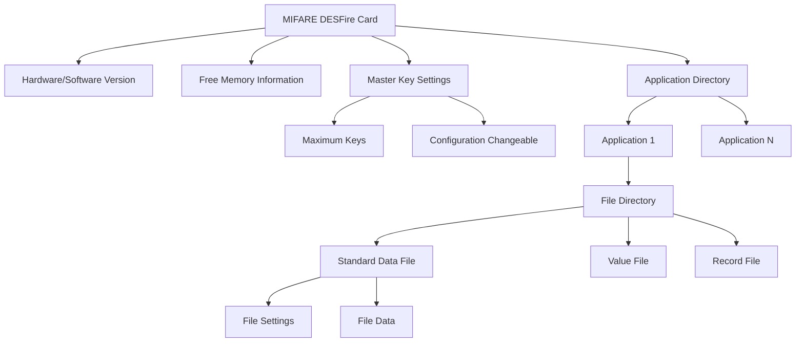
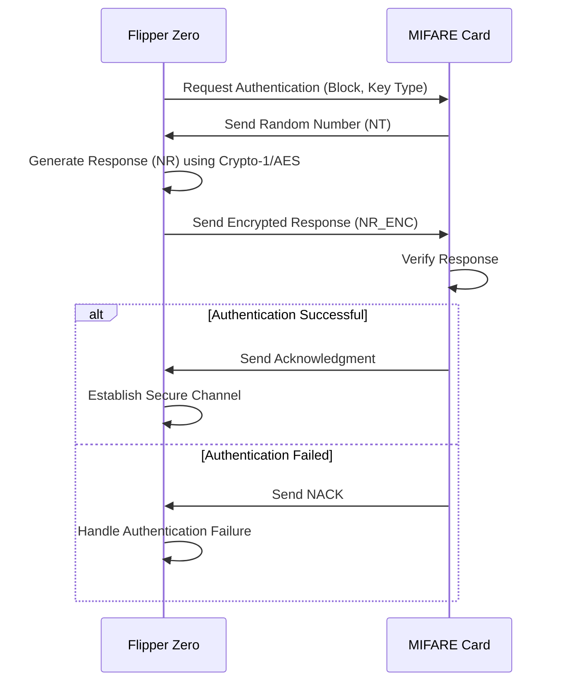
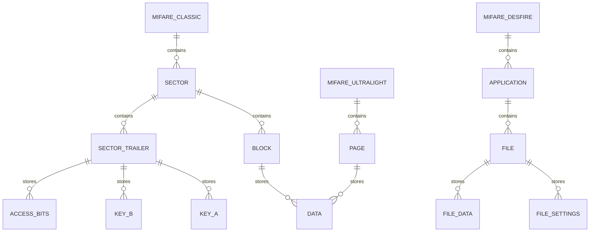
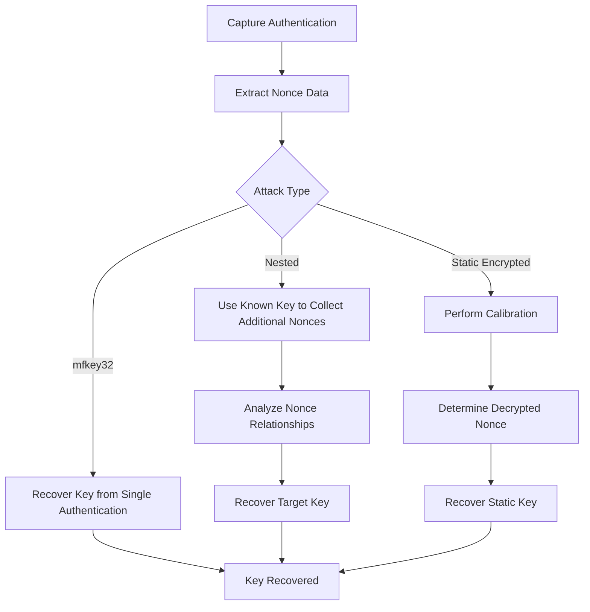

# MIFARE Protocols

<cite>
**Referenced Files in This Document**   
- [mf_classic_poller.c](file://lib\nfc\protocols\mf_classic\mf_classic_poller.c)
- [mf_classic_poller_i.c](file://lib\nfc\protocols\mf_classic\mf_classic_poller_i.c)
- [mf_classic.c](file://lib\nfc\protocols\mf_classic\mf_classic.c)
- [mf_classic.h](file://lib\nfc\protocols\mf_classic\mf_classic.h)
- [mf_ultralight.c](file://lib\nfc\protocols\mf_ultralight\mf_ultralight.c)
- [mf_ultralight.h](file://lib\nfc\protocols\mf_ultralight\mf_ultralight.h)
- [mf_ultralight_poller.c](file://lib\nfc\protocols\mf_ultralight\mf_ultralight_poller.c)
- [mf_plus.c](file://lib\nfc\protocols\mf_plus\mf_plus.c)
- [mf_plus_i.c](file://lib\nfc\protocols\mf_plus\mf_plus_i.c)
- [mf_desfire.c](file://lib\nfc\protocols\mf_desfire\mf_desfire.c)
- [mf_desfire.h](file://lib\nfc\protocols\mf_desfire\mf_desfire.h)
- [mf_desfire_poller.c](file://lib\nfc\protocols\mf_desfire\mf_desfire_poller.c)
- [mfkey.c](file://applications\external\mfkey\mfkey.c)
- [crypto1.h](file://applications\external\mfkey\crypto1.h)
- [crypto1.c](file://applications\external\esubghz_chat\lib\nfclegacy\protocols\crypto1.c)
</cite>

## Table of Contents
1. [MIFARE Classic Protocol](#mifare-classic-protocol)
2. [MIFARE Ultralight Protocol](#mifare-ultralight-protocol)
3. [MIFARE Plus Protocol](#mifare-plus-protocol)
4. [MIFARE DESFire Protocol](#mifare-desfire-protocol)
5. [Authentication Mechanisms](#authentication-mechanisms)
6. [Card Memory Structures](#card-memory-structures)
7. [Key Recovery and mfkey Tool](#key-recovery-and-mfkey-tool)
8. [Error Handling and Signal Optimization](#error-handling-and-signal-optimization)

## MIFARE Classic Protocol

The MIFARE Classic protocol implementation in Flipper Zero supports three card types: Mini (0.3K), 1K, and 4K, differentiated by their memory capacity and sector organization. The protocol uses a proprietary Crypto-1 stream cipher for authentication and data encryption, which has been subject to various security vulnerabilities. The implementation follows the ISO/IEC 14443 Type A standard for communication, with specific commands for authentication (0x60 for Key A, 0x61 for Key B), reading blocks (0x30), and writing blocks (0xA0). The card's memory is organized into sectors, each containing data blocks and a sector trailer that stores access conditions and cryptographic keys. The Flipper Zero implementation includes support for backdoor authentication methods that exploit known vulnerabilities in certain card manufacturers' implementations.

**Section sources**
- [mf_classic.h](file://lib\nfc\protocols\mf_classic\mf_classic.h#L39-L54)
- [mf_classic.c](file://lib\nfc\protocols\mf_classic\mf_classic.c#L19-L41)
- [mf_classic_poller.c](file://lib\nfc\protocols\mf_classic\mf_classic_poller.c#L18-L25)

## MIFARE Ultralight Protocol

The MIFARE Ultralight protocol implementation supports multiple variants including the original Ultralight, Ultralight C, NTAG213/215/216, and NTAG I2C series. These cards use a simpler memory structure compared to Classic cards, with memory organized into 4-byte pages accessible through read (0x30) and write (0xA2) commands. The implementation includes support for enhanced security features in Ultralight C and EV1 variants, which use 3DES encryption for authentication. Key features include password protection, read/write counters with tearing detection, and signature verification. The NTAG I2C variants integrate an I2C interface alongside the NFC interface, allowing for dual-mode operation. The Flipper Zero implementation handles the different command sets and memory layouts for each variant, providing a unified interface for reading and writing data.

**Section sources**
- [mf_ultralight.h](file://lib\nfc\protocols\mf_ultralight\mf_ultralight.h#L51-L74)
- [mf_ultralight.c](file://lib\nfc\protocols\mf_ultralight\mf_ultralight.c#L6-L24)
- [mf_ultralight_poller.c](file://lib\nfc\protocols\mf_ultralight\mf_ultralight_poller.c#L12-L138)

## MIFARE Plus Protocol

The MIFARE Plus protocol serves as a transitional solution between the legacy MIFARE Classic and the more secure MIFARE DESFire, maintaining backward compatibility while enhancing security. The implementation in Flipper Zero supports multiple variants including Plus S, X, SE, EV1, and EV2, each with different security levels (SL1, SL2, SL3). Security Level 1 maintains Crypto-1 compatibility with MIFARE Classic, while higher levels transition to AES-128 encryption. The cards can operate in different modes: compatibility mode for MIFARE Classic readers, and native mode for full security features. The implementation detects the card type and security level through analysis of the ATS (Answer to Select) historical bytes and SAK (Select Acknowledge) values, allowing the Flipper Zero to adapt its communication strategy accordingly.

**Section sources**
- [mf_plus.c](file://lib\nfc\protocols\mf_plus\mf_plus.c#L8-L31)
- [mf_plus_i.c](file://lib\nfc\protocols\mf_plus\mf_plus_i.c#L22-L226)
- [mf_plus.h](file://lib\nfc\protocols\mf_plus\mf_plus.h#L1-L47)

## MIFARE DESFire Protocol

The MIFARE DESFire protocol implementation supports the full range of DESFire cards including EV1, EV2, EV2 XL, and EV3 variants with storage capacities from 2K to 32K. Unlike the sector-based organization of Classic cards, DESFire uses a file system architecture with applications containing various file types: standard data files, backup data files, value files, linear/cyclic record files, and transaction MAC files. Authentication is based on AES-128 encryption, with support for multiple keys per application and sophisticated key versioning. The implementation follows the ISO/IEC 14443 Type A standard with a layered command structure, where commands are encapsulated in APDUs (Application Protocol Data Units). The Flipper Zero implementation can read card information including hardware and software versions, free memory, master key settings, application IDs, and detailed file structures.

**Diagram sources**
- [mf_desfire.h](file://lib\nfc\protocols\mf_desfire\mf_desfire.h#L39-L181)
- [mf_desfire.c](file://lib\nfc\protocols\mf_desfire\mf_desfire.c#L29-L117)
- [mf_desfire_poller.c](file://lib\nfc\protocols\mf_desfire\mf_desfire_poller.c#L49-L199)

**Section sources**
- [mf_desfire.h](file://lib\nfc\protocols\mf_desfire\mf_desfire.h#L39-L181)
- [mf_desfire.c](file://lib\nfc\protocols\mf_desfire\mf_desfire.c#L29-L117)
- [mf_desfire_poller.c](file://lib\nfc\protocols\mf_desfire\mf_desfire_poller.c#L49-L199)

## Authentication Mechanisms

The Flipper Zero implements authentication mechanisms for all MIFARE variants, with distinct approaches for each protocol. For MIFARE Classic, the authentication process follows the proprietary Crypto-1 challenge-response protocol, where the reader and card exchange nonces that are encrypted with a shared key. The implementation supports standard authentication with Key A and Key B, as well as backdoor authentication methods that exploit known vulnerabilities in certain card implementations. For MIFARE Ultralight C and EV1, authentication uses 3DES encryption with a challenge-response protocol involving random number generation and encrypted responses. MIFARE DESFire employs AES-128 based authentication with multiple key versions and sophisticated key derivation functions. The authentication state machine in the Flipper Zero firmware manages the various states including idle, authentication request, challenge generation, response verification, and session establishment.

**Diagram sources**
- [mf_classic_poller_i.c](file://lib\nfc\protocols\mf_classic\mf_classic_poller_i.c#L135-L176)
- [mf_ultralight_poller.c](file://lib\nfc\protocols\mf_ultralight\mf_ultralight_poller.c#L597-L655)
- [mf_desfire_poller.c](file://lib\nfc\protocols\mf_desfire\mf_desfire_poller.c#L280-L340)

**Section sources**
- [mf_classic_poller_i.c](file://lib\nfc\protocols\mf_classic\mf_classic_poller_i.c#L135-L176)
- [mf_ultralight_poller.c](file://lib\nfc\protocols\mf_ultralight\mf_ultralight_poller.c#L597-L655)
- [mf_desfire_poller.c](file://lib\nfc\protocols\mf_desfire\mf_desfire_poller.c#L280-L340)

## Card Memory Structures

The memory structures of MIFARE cards vary significantly between variants, with the Flipper Zero implementation providing unified access to these different organizations. MIFARE Classic cards organize memory into sectors, with 16 sectors for 1K cards and 40 sectors for 4K cards. Each sector contains data blocks and a sector trailer that stores two cryptographic keys (A and B) and access condition bits. MIFARE Ultralight cards use a flat memory model with 4-byte pages, typically 168 pages for standard Ultralight and up to 237 pages for NTAG216. MIFARE DESFire employs a hierarchical file system with applications containing various file types, each with specific access conditions and communication settings. The Flipper Zero firmware abstracts these different memory organizations through a common data structure that can represent the specific characteristics of each card type while providing a consistent interface for applications.

**Diagram sources**
- [mf_classic.h](file://lib\nfc\protocols\mf_classic\mf_classic.h#L78-L144)
- [mf_ultralight.h](file://lib\nfc\protocols\mf_ultralight\mf_ultralight.h#L95-L188)
- [mf_desfire.h](file://lib\nfc\protocols\mf_desfire\mf_desfire.h#L119-L181)

**Section sources**
- [mf_classic.h](file://lib\nfc\protocols\mf_classic\mf_classic.h#L78-L144)
- [mf_ultralight.h](file://lib\nfc\protocols\mf_ultralight\mf_ultralight.h#L95-L188)
- [mf_desfire.h](file://lib\nfc\protocols\mf_desfire\mf_desfire.h#L119-L181)

## Key Recovery and mfkey Tool

The mfkey tool implementation in Flipper Zero provides advanced key recovery capabilities for MIFARE Classic cards by exploiting vulnerabilities in the Crypto-1 cipher and random number generator. The tool implements the mfkey32 attack, which recovers cryptographic keys from partial nonce information obtained during authentication attempts. It also supports nested authentication attacks, where knowledge of one key in a sector allows recovery of other keys through analysis of nonce relationships. The implementation includes optimizations such as precomputed lookup tables, efficient state space reduction, and parallel processing to accelerate key recovery. For static encrypted tags, the tool can calibrate the random number generator by performing nested authentication to determine the decrypted nonce, enabling recovery of keys even when direct authentication attempts are blocked.

**Diagram sources**
- [mfkey.c](file://applications\external\mfkey\mfkey.c#L112-L761)
- [crypto1.h](file://applications\external\mfkey\crypto1.h#L1-L246)
- [mf_classic_poller.c](file://lib\nfc\protocols\mf_classic\mf_classic_poller.c#L1197-L1230)

**Section sources**
- [mfkey.c](file://applications\external\mfkey\mfkey.c#L112-L761)
- [crypto1.h](file://applications\external\mfkey\crypto1.h#L1-L246)
- [mf_classic_poller.c](file://lib\nfc\protocols\mf_classic\mf_classic_poller.c#L1197-L1230)

## Error Handling and Signal Optimization

The Flipper Zero implementation includes comprehensive error handling and signal optimization mechanisms to ensure reliable communication with MIFARE cards under various conditions. The firmware detects and handles common errors such as authentication failures, protocol violations, timeout conditions, and field disturbances. For authentication failures due to field disturbances, the implementation employs retry strategies with adaptive timing and signal strength optimization. The reader adjusts its communication parameters based on card response characteristics, including frame waiting time (FWT) and bit rate. For challenging environments, the firmware implements signal optimization techniques such as field strength adjustment, timing calibration, and error correction. The state machine architecture ensures proper recovery from error conditions, with mechanisms to reinitialize communication and attempt alternative authentication methods when initial attempts fail.

**Section sources**
- [mf_classic_poller.c](file://lib\nfc\protocols\mf_classic\mf_classic_poller.c#L754-L762)
- [mf_ultralight_poller.c](file://lib\nfc\protocols\mf_ultralight\mf_ultralight_poller.c#L656-L670)
- [mf_desfire_poller.c](file://lib\nfc\protocols\mf_desfire\mf_desfire_poller.c#L74-L180)