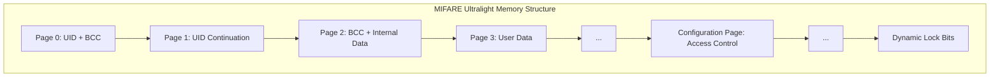
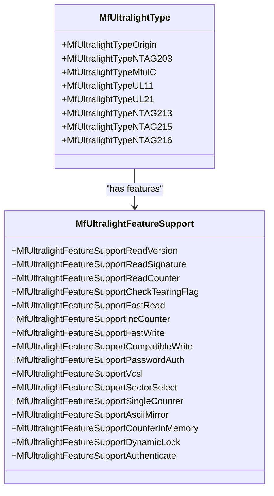
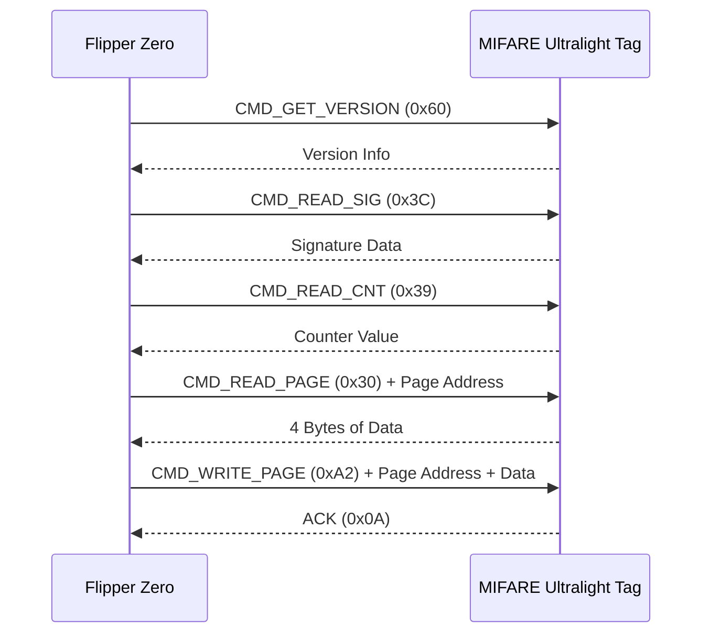
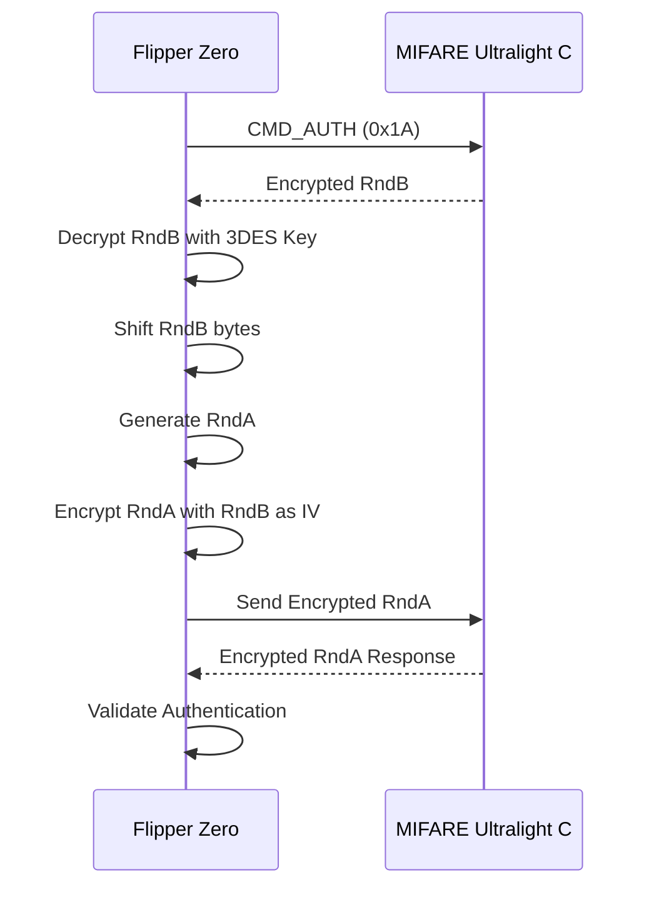
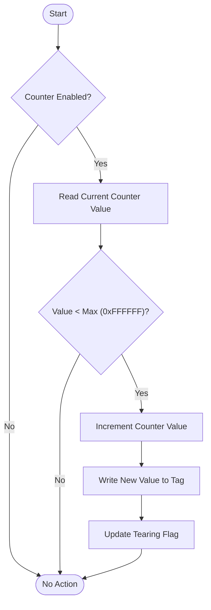
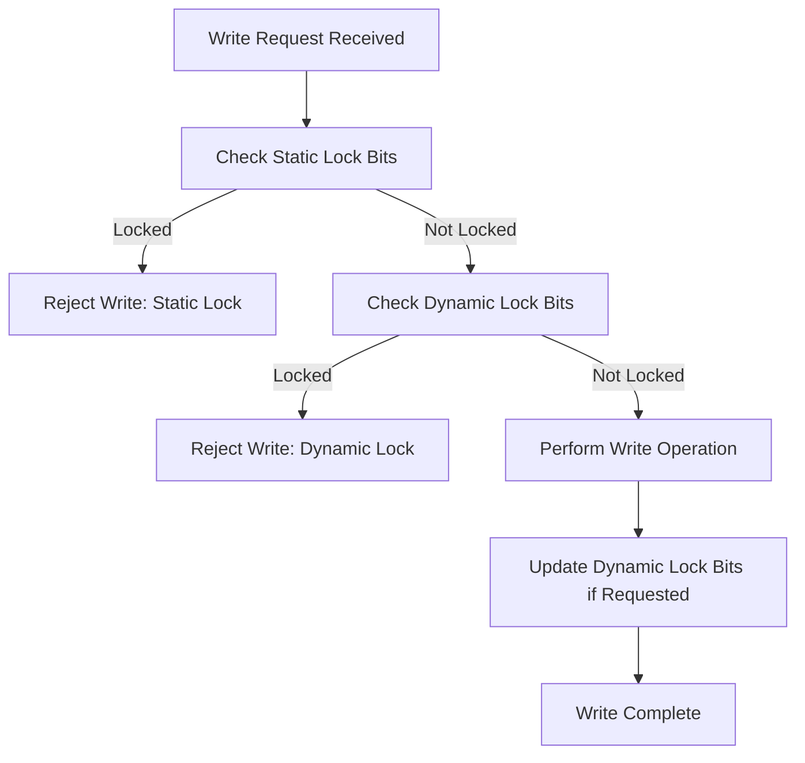

# MIFARE Ultralight

<cite>
**Referenced Files in This Document**   
- [mf_ultralight.c](file://lib\nfc\protocols\mf_ultralight\mf_ultralight.c)
- [mf_ultralight.h](file://lib\nfc\protocols\mf_ultralight\mf_ultralight.h)
- [mf_ultralight_poller.c](file://lib\nfc\protocols\mf_ultralight\mf_ultralight_poller.c)
- [mf_ultralight_poller_i.c](file://lib\nfc\protocols\mf_ultralight\mf_ultralight_poller_i.c)
- [mf_ultralight_listener.c](file://lib\nfc\protocols\mf_ultralight\mf_ultralight_listener.c)
- [mf_ultralight_listener_i.c](file://lib\nfc\protocols\mf_ultralight\mf_ultralight_listener_i.c)
</cite>

## Table of Contents
1. [Introduction](#introduction)
2. [Memory Structure](#memory-structure)
3. [Protocol Variants](#protocol-variants)
4. [Read/Write Operations](#readwrite-operations)
5. [Authentication Mechanisms](#authentication-mechanisms)
6. [Counter Functionality](#counter-functionality)
7. [Page Locking Mechanism](#page-locking-mechanism)
8. [One-Time Programmable Bits](#one-time-programmable-bits)
9. [Use Cases](#use-cases)
10. [Limitations](#limitations)

## Introduction
The MIFARE Ultralight protocol implementation in the Flipper Zero provides comprehensive support for various Ultralight-based NFC tags, including Ultralight, Ultralight C, and Ultralight EV1 variants. This document details the technical implementation, memory structure, and operational characteristics of these protocols as implemented in the Flipper Zero firmware. The system enables reading, writing, and emulation of MIFARE Ultralight tags, with specific support for authentication, counter functionality, and access control mechanisms.

**Section sources**
- [mf_ultralight.c](file://lib\nfc\protocols\mf_ultralight\mf_ultralight.c#L6-L18)
- [mf_ultralight.h](file://lib\nfc\protocols\mf_ultralight\mf_ultralight.h#L6-L26)

## Memory Structure
The MIFARE Ultralight memory structure is organized into pages of 4 bytes each, with different variants supporting different total page counts. The basic MIFARE Ultralight card has 16 pages (64 bytes) of memory, while extended variants like NTAG213, NTAG215, and NTAG216 support 45, 135, and 231 pages respectively. The memory is divided into manufacturer blocks (pages 0-2) which are typically read-only, and user-accessible pages (starting from page 3). Page 0 contains the UID and BCC (Block Check Character), page 1 contains the continuation of UID, and page 2 contains the BCC and internal data. The configuration page, which varies by tag type, contains access control bits, password protection settings, and other configuration parameters that govern read/write permissions and security features.

**Diagram sources**
- [mf_ultralight.c](file://lib\nfc\protocols\mf_ultralight\mf_ultralight.c#L28-L153)
- [mf_ultralight.h](file://lib\nfc\protocols\mf_ultralight\mf_ultralight.h#L95-L176)

**Section sources**
- [mf_ultralight.c](file://lib\nfc\protocols\mf_ultralight\mf_ultralight.c#L28-L153)
- [mf_ultralight.h](file://lib\nfc\protocols\mf_ultralight\mf_ultralight.h#L95-L176)

## Protocol Variants
The Flipper Zero supports multiple MIFARE Ultralight variants, each with distinct security and functional characteristics. The basic MIFARE Ultralight provides simple read/write functionality without cryptographic protection. MIFARE Ultralight C enhances security with 3DES authentication, requiring a 16-byte key for access to protected memory areas. MIFARE Ultralight EV1 implements password protection and session-based access control, with configurable access conditions for different memory pages. The implementation distinguishes between these variants through the MfUltralightType enumeration, which includes types such as MfUltralightTypeOrigin (basic Ultralight), MfUltralightTypeMfulC (Ultralight C), and various NTAG types (NTAG213, NTAG215, NTAG216) that represent different EV1 implementations with varying memory capacities and feature sets.

**Diagram sources**
- [mf_ultralight.h](file://lib\nfc\protocols\mf_ultralight\mf_ultralight.h#L60-L74)
- [mf_ultralight.h](file://lib\nfc\protocols\mf_ultralight\mf_ultralight.h#L76-L93)

**Section sources**
- [mf_ultralight.c](file://lib\nfc\protocols\mf_ultralight\mf_ultralight.c#L28-L153)
- [mf_ultralight.h](file://lib\nfc\protocols\mf_ultralight\mf_ultralight.h#L60-L93)

## Read/Write Operations
The Flipper Zero implements standard MIFARE Ultralight read and write operations through dedicated poller functions. Read operations are performed using the MF_ULTRALIGHT_CMD_READ_PAGE command (0x30), which retrieves 4 bytes of data from a specified page address. Write operations use the MF_ULTRALIGHT_CMD_WRITE_PAGE command (0xA2), allowing writing 4 bytes to a specified page. The implementation includes fast read (MF_ULTRALIGHT_CMD_FAST_READ, 0x3A) and fast write (MF_ULTRALIGHT_CMD_FAST_WRITE, 0xA6) commands for bulk operations. Before any write operation, the system checks access permissions, static lock bits, and dynamic lock bits to ensure the target page is writable. The read process follows a state machine pattern, progressing through stages of version detection, signature reading, counter reading, and page reading until all accessible data is retrieved.

**Diagram sources**
- [mf_ultralight_poller.c](file://lib\nfc\protocols\mf_ultralight\mf_ultralight_poller.c#L791-L816)
- [mf_ultralight_listener.c](file://lib\nfc\protocols\mf_ultralight\mf_ultralight_listener.c#L801-L817)

**Section sources**
- [mf_ultralight_poller.c](file://lib\nfc\protocols\mf_ultralight\mf_ultralight_poller.c#L791-L816)
- [mf_ultralight_listener.c](file://lib\nfc\protocols\mf_ultralight\mf_ultralight_listener.c#L801-L817)

## Authentication Mechanisms
The Flipper Zero implements authentication mechanisms for MIFARE Ultralight C and EV1 variants. For Ultralight C, 3DES authentication is used, requiring a 16-byte key for access to protected memory areas. The authentication process follows a challenge-response protocol where the reader sends an authentication command, receives an encrypted random number (RndB), decrypts it with the 3DES key, shifts the bytes, and sends back an encrypted response containing the reader's random number (RndA). For Ultralight EV1 variants, password-based authentication is implemented using the MF_ULTRALIGHT_CMD_PWD_AUTH command (0x1B), where a 4-byte password is sent to the tag and validated against stored credentials. The implementation includes support for authentication attempt counting and card locking after a configurable number of failed attempts.

**Diagram sources**
- [mf_ultralight_poller_i.c](file://lib\nfc\protocols\mf_ultralight\mf_ultralight_poller_i.c#L116-L157)
- [mf_ultralight_listener.c](file://lib\nfc\protocols\mf_ultralight\mf_ultralight_listener.c#L592-L621)

**Section sources**
- [mf_ultralight_poller_i.c](file://lib\nfc\protocols\mf_ultralight\mf_ultralight_poller_i.c#L116-L157)
- [mf_ultralight_listener.c](file://lib\nfc\protocols\mf_ultralight\mf_ultralight_listener.c#L592-L621)

## Counter Functionality
The MIFARE Ultralight implementation includes support for counter functionality with protection against decrement-only attacks. The counter is a 24-bit value that can only be incremented, preventing unauthorized reduction of value in applications like transportation tickets. The counter is protected by a tearing flag mechanism that detects incomplete write operations, ensuring data integrity. The implementation supports reading counter values using the MF_ULTRALIGHT_CMD_READ_CNT command (0x39) and incrementing counters with the MF_ULTRALIGHT_CMD_INCR_CNT command (0xA5). For tags with single counter functionality (like NTAG213/215/216), the counter is located in a dedicated configuration area and can be enabled or disabled through access control bits. The tearing flag is updated after a successful counter increment operation and can be checked using the MF_ULTRALIGHT_CMD_CHECK_TEARING command (0x3E).

**Diagram sources**
- [mf_ultralight_poller.c](file://lib\nfc\protocols\mf_ultralight\mf_ultralight_poller.c#L330-L371)
- [mf_ultralight_listener.c](file://lib\nfc\protocols\mf_ultralight\mf_ultralight_listener.c#L316-L350)

**Section sources**
- [mf_ultralight_poller.c](file://lib\nfc\protocols\mf_ultralight\mf_ultralight_poller.c#L330-L371)
- [mf_ultralight_listener.c](file://lib\nfc\protocols\mf_ultralight\mf_ultralight_listener.c#L316-L350)

## Page Locking Mechanism
The MIFARE Ultralight implementation includes both static and dynamic page locking mechanisms to prevent unauthorized modification of critical data. Static lock bits are located in page 2 and can permanently lock pages 0-2 when set. Dynamic lock bits provide more granular control, allowing individual pages or groups of pages to be locked after writing. The dynamic lock mechanism is implemented through a dedicated lock page that contains bits corresponding to groups of memory pages. Once a lock bit is set, the corresponding pages cannot be modified. The implementation checks both static and dynamic lock status before any write operation and rejects writes to locked pages. The locking mechanism is irreversible, providing permanent protection for critical data such as configuration settings, access control parameters, and application-specific information.

**Diagram sources**
- [mf_ultralight_listener.c](file://lib\nfc\protocols\mf_ultralight\mf_ultralight_listener.c#L79-L97)
- [mf_ultralight_listener_i.c](file://lib\nfc\protocols\mf_ultralight\mf_ultralight_listener_i.c#L531-L545)

**Section sources**
- [mf_ultralight_listener.c](file://lib\nfc\protocols\mf_ultralight\mf_ultralight_listener.c#L79-L97)
- [mf_ultralight_listener_i.c](file://lib\nfc\protocols\mf_ultralight\mf_ultralight_listener_i.c#L531-L545)

## One-Time Programmable Bits
The MIFARE Ultralight implementation supports one-time programmable (OTP) bits through the static lock mechanism in page 2. These bits, when set, permanently lock specific memory pages, making them read-only for the lifetime of the tag. The OTP functionality is implemented by writing to the lock bytes in page 2, which control access to pages 0-2. Once these bits are set, they cannot be reset, providing a permanent write protection mechanism. This feature is particularly useful for applications requiring tamper-proof data storage, such as ticketing systems where fare information must be protected from modification after issuance. The implementation ensures that OTP operations are irreversible and provides feedback on the success or failure of lock operations.

**Section sources**
- [mf_ultralight_listener.c](file://lib\nfc\protocols\mf_ultralight\mf_ultralight_listener.c#L83-L84)
- [mf_ultralight_listener_i.c](file://lib\nfc\protocols\mf_ultralight\mf_ultralight_listener_i.c#L499-L501)

## Use Cases
The MIFARE Ultralight implementation in the Flipper Zero supports various practical applications, particularly in transportation and access control systems. For transportation tickets, the counter functionality with tearing flag protection provides a secure mechanism for tracking rides or journeys, while the limited memory capacity makes it suitable for simple fare systems. Event access control systems can utilize the read/write capabilities to store ticket information, entry permissions, and attendance records. The password protection in Ultralight EV1 variants enables secure access to sensitive data, while the compact form factor and low cost make these tags ideal for disposable applications. The Flipper Zero's ability to read, write, and emulate these tags makes it a valuable tool for testing, debugging, and interacting with existing Ultralight-based systems.

**Section sources**
- [ventra.c](file://applications\main\nfc\plugins\supported_cards\ventra.c#L1-L170)
- [charliecard.c](file://applications\main\nfc\plugins\supported_cards\charliecard.c#L205-L231)

## Limitations
The MIFARE Ultralight protocol has several inherent limitations, particularly in security and functionality. The basic Ultralight variant lacks strong cryptographic protection, making it vulnerable to cloning and unauthorized access. The 3DES authentication in Ultralight C provides improved security but is still considered weak by modern standards. Memory capacity is limited to a maximum of 231 pages (924 bytes) in the largest NTAG variants, restricting the amount of data that can be stored. The write operations are relatively slow compared to other NFC technologies, and the irreversible nature of lock bits means that errors in configuration cannot be corrected. Additionally, the lack of mutual authentication in some variants makes them susceptible to relay attacks and other security threats.

**Section sources**
- [mf_ultralight.c](file://lib\nfc\protocols\mf_ultralight\mf_ultralight.c#L558-L564)
- [mf_ultralight.h](file://lib\nfc\protocols\mf_ultralight\mf_ultralight.h#L51-L57)