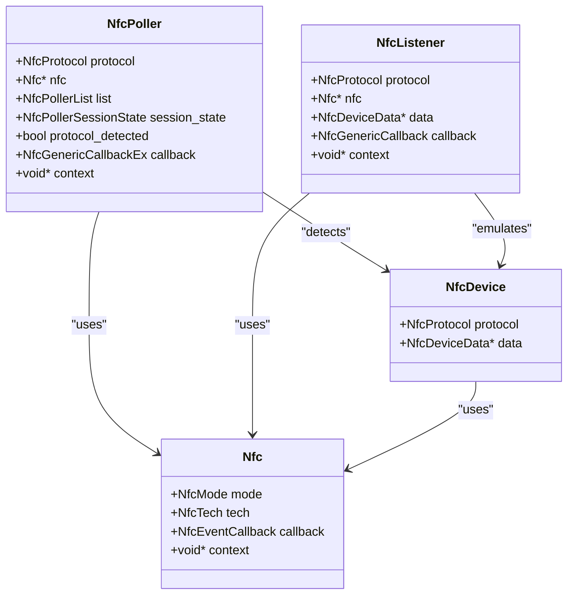
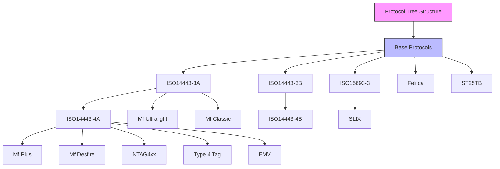
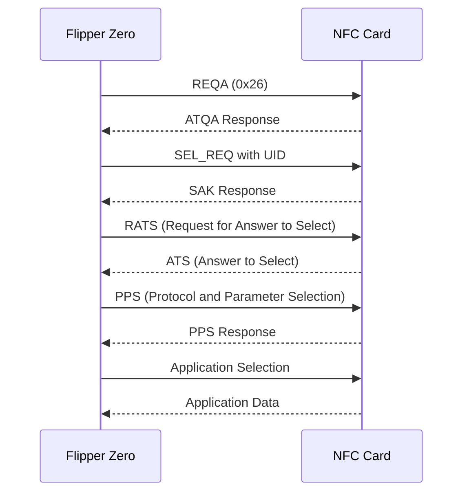
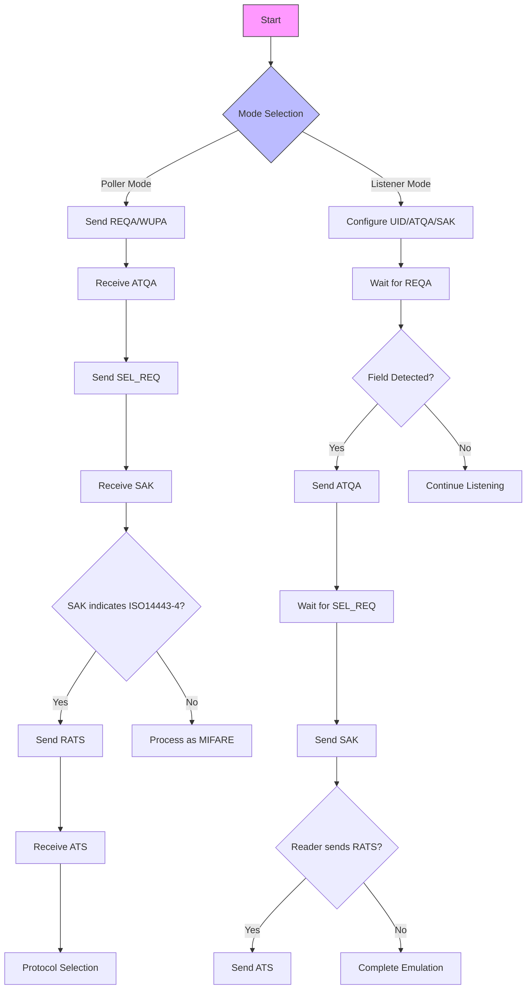
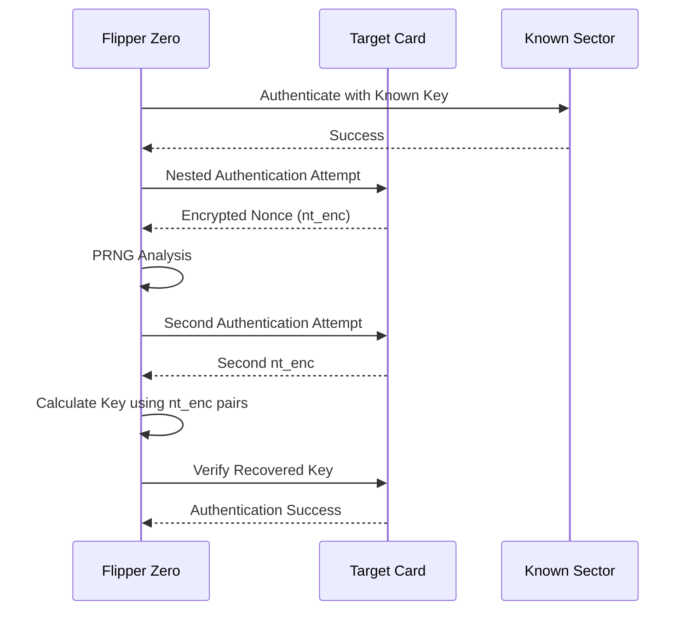

# NFC/RFID Protocols

<cite>
**Referenced Files in This Document**   
- [nfc_protocol.c](file://lib\nfc\protocols\nfc_protocol.c)
- [nfc.h](file://lib\nfc\nfc.h)
- [nfc_poller.c](file://lib\nfc\nfc_poller.c)
- [nfc_listener.h](file://lib\nfc\nfc_listener.h)
- [furi_hal_nfc.h](file://targets\furi_hal_include\furi_hal_nfc.h)
- [mf_classic_poller.c](file://lib\nfc\protocols\mf_classic\mf_classic_poller.c)
- [iso14443_3a.h](file://lib\nfc\protocols\iso14443_3a\iso14443_3a.h)
- [iso15693_3.h](file://lib\nfc\protocols\iso15693_3\iso15693_3.h)
- [felica.h](file://lib\nfc\protocols\felica\felica.h)
- [emv.h](file://lib\nfc\protocols\emv\emv.h)
</cite>

## Table of Contents
1. [Introduction](#introduction)
2. [NFC Subsystem Architecture](#nfc-subsystem-architecture)
3. [Supported NFC/RFID Protocols](#supported-nfc-rfid-protocols)
4. [Modulation and Encoding Schemes](#modulation-and-encoding-schemes)
5. [Protocol Implementation Details](#protocol-implementation-details)
6. [Card Emulation and Tag Reading](#card-emulation-and-tag-reading)
7. [Security Analysis and Attacks](#security-analysis-and-attacks)
8. [Configuration and Tuning](#configuration-and-tuning)
9. [Troubleshooting and Performance](#troubleshooting-and-performance)
10. [Conclusion](#conclusion)

## Introduction
The Flipper Zero supports a comprehensive range of NFC/RFID protocols through its sophisticated software architecture. This document details the implementation of NFC/RFID protocols on the Flipper Zero platform, covering the architectural design, protocol support, technical specifications, and practical applications. The system operates at the standard 13.56MHz frequency and supports various modulation schemes including ASK (Amplitude Shift Keying) and PSK (Phase Shift Keying), with data encoding methods such as Miller and Manchester coding. The architecture is designed to support both card reading (poller mode) and card emulation (listener mode) across multiple protocol families.

**Section sources**
- [nfc_protocol.c](file://lib\nfc\protocols\nfc_protocol.c#L1-L153)
- [nfc.h](file://lib\nfc\nfc.h#L1-L404)

## NFC Subsystem Architecture
The NFC subsystem in Flipper Zero is structured around three primary layers: poller, listener, and device. The poller layer handles card detection and reading operations, implementing the initiator role in NFC communications. The listener layer manages card emulation functionality, allowing the Flipper Zero to act as a contactless smart card. The device layer provides protocol-specific implementations and data structures for different NFC/RFID standards.

The architecture follows a hierarchical protocol tree structure where base protocols serve as parents to more specific implementations. For example, ISO14443-3A serves as the parent protocol for ISO14443-4A, MIFARE Ultralight, and MIFARE Classic. This hierarchical design enables code reuse and simplifies the addition of new protocols. The poller implementation uses a linked list structure to manage protocol instances, with each protocol having access to its parent and child protocols in the hierarchy.

**Diagram sources **
- [nfc_poller.c](file://lib\nfc\nfc_poller.c#L25-L34)
- [nfc_listener.h](file://lib\nfc\nfc_listener.h#L27-L28)
- [nfc.h](file://lib\nfc\nfc.h#L29-L30)

**Section sources**
- [nfc_poller.c](file://lib\nfc\nfc_poller.c#L1-L285)
- [nfc_listener.h](file://lib\nfc\nfc_listener.h#L1-L95)
- [nfc.h](file://lib\nfc\nfc.h#L1-L404)

## Supported NFC/RFID Protocols
The Flipper Zero supports a wide range of NFC/RFID protocols organized in a hierarchical tree structure. The primary base protocols include ISO14443-3A, ISO14443-3B, ISO15693-3, FeliCa, and ST25TB. ISO14443-3A serves as the foundation for several widely used protocols including ISO14443-4A, MIFARE Ultralight, and MIFARE Classic. ISO14443-4A further extends to support MIFARE Plus, MIFARE DESFire, NTAG4xx, Type 4 Tag, and EMV protocols.

ISO15693-3 supports the Slix protocol family, while ISO14443-3B provides the basis for ISO14443-4B. Each protocol is implemented as a distinct module with specific data structures and operational parameters. The protocol hierarchy enables efficient detection and identification of cards, as the system can traverse from general to specific protocols during the identification process.

**Diagram sources **
- [nfc_protocol.c](file://lib\nfc\protocols\nfc_protocol.c#L15-L28)

**Section sources**
- [nfc_protocol.c](file://lib\nfc\protocols\nfc_protocol.c#L1-L153)

## Modulation and Encoding Schemes
The Flipper Zero implements standard NFC modulation and encoding schemes at 13.56MHz carrier frequency. For ISO14443-3A compliant cards, the system uses 100% ASK modulation with Manchester encoding for data transmission. The modulation depth and signal parameters are configurable through the hardware abstraction layer to ensure compatibility with various card types.

For ISO15693 communication, the device supports both 1-out-of-4 and 1-out-of-256 coding schemes, with the ability to auto-detect the appropriate mode. FeliCa protocol implementation uses 10% ASK modulation with modified Miller encoding. The system provides configuration options for guard time, frame delay time, and polling intervals to optimize communication reliability across different environments and card types.

**Section sources**
- [furi_hal_nfc.h](file://targets\furi_hal_include\furi_hal_nfc.h#L31)
- [iso14443_3a.h](file://lib\nfc\protocols\iso14443_3a\iso14443_3a.h#L15-L20)
- [iso15693_3.h](file://lib\nfc\protocols\iso15693_3\iso15693_3.h#L13-L16)

## Protocol Implementation Details
Each NFC protocol is implemented with specific timing parameters, command sets, and data structures. ISO14443-3A defines guard time of 5000μs, frame delay time of 1620 carrier cycles for polling, and 1172 carrier cycles for listening. The protocol supports standard commands including REQA (0x26) for request commands and WUPA (0x52) for wake-up operations.

ISO15693-3 implements a guard time of 5000μs, frame delay time of 4202 carrier cycles for polling, and 4320 carrier cycles for listening. The protocol supports mandatory commands such as Inventory (0x01) and Stay Quiet (0x02), along with optional commands including Read Block (0x20), Write Block (0x21), and Lock Block (0x22). FeliCa protocol uses a guard time of 20000μs and frame delay time of 10000 carrier cycles, supporting commands like Read Without Encryption (0x06) and Write Without Encryption (0x08).

EMV protocol implementation builds upon ISO14443-4A, supporting application selection and data retrieval commands. The system can parse EMV data objects including AID (Application Identifier), PAN (Primary Account Number), expiration date, and transaction logs. MIFARE Classic implementation includes support for authentication commands (0x60 for Key A, 0x61 for Key B), read/write operations, and value block management.

**Diagram sources **
- [iso14443_3a.h](file://lib\nfc\protocols\iso14443_3a\iso14443_3a.h#L15-L20)
- [iso15693_3.h](file://lib\nfc\protocols\iso15693_3\iso15693_3.h#L13-L16)
- [felica.h](file://lib\nfc\protocols\felica\felica.h#L40-L42)

**Section sources**
- [iso14443_3a.h](file://lib\nfc\protocols\iso14443_3a\iso14443_3a.h#L1-L108)
- [iso15693_3.h](file://lib\nfc\protocols\iso15693_3\iso15693_3.h#L1-L164)
- [felica.h](file://lib\nfc\protocols\felica\felica.h#L1-L325)
- [emv.h](file://lib\nfc\protocols\emv\emv.h#L1-L153)

## Card Emulation and Tag Reading
The Flipper Zero supports both card reading (poller mode) and card emulation (listener mode) for various NFC protocols. In poller mode, the device actively scans for nearby NFC tags and reads their data through a structured detection process. The system first sends request commands (REQA/WUPA) to detect ISO14443-3A compliant cards, followed by collision resolution and UID selection. For MIFARE Classic cards, the system can perform authentication using known keys and read sector data.

In listener mode, the Flipper Zero can emulate various card types by responding to reader commands with appropriate data. The emulation process involves configuring the NFC hardware with the target card's UID, ATQA, and SAK values. For MIFARE Classic emulation, the device can simulate sector trailers and data blocks, responding to authentication attempts and read/write commands. The system supports both full card emulation and partial emulation for specific applications.

**Diagram sources **
- [nfc_poller.c](file://lib\nfc\nfc_poller.c#L77-L88)
- [nfc_listener.h](file://lib\nfc\nfc_listener.h#L40-L41)
- [furi_hal_nfc.h](file://targets\furi_hal_include\furi_hal_nfc.h#L163-L164)

**Section sources**
- [nfc_poller.c](file://lib\nfc\nfc_poller.c#L77-L285)
- [nfc_listener.h](file://lib\nfc\nfc_listener.h#L1-L95)

## Security Analysis and Attacks
The Flipper Zero includes advanced security analysis capabilities, particularly for MIFARE Classic cards. The system implements nested authentication attacks to recover unknown keys by exploiting the PRNG (Pseudo-Random Number Generator) weaknesses in MIFARE Classic implementations. The attack process involves first authenticating to a known sector, then performing nested authentication to a target sector with unknown keys.

The system supports dictionary attacks using precomputed rainbow tables and can perform static encrypted tag calibration. For EMV cards, the device can perform passive analysis of transaction data and extract card information such as PAN, expiration date, and transaction history. The security analysis features are implemented in the MIFARE Classic poller module, which includes state machines for different attack phases including PRNG analysis, calibration, and key recovery.

**Diagram sources **
- [mf_classic_poller.c](file://lib\nfc\protocols\mf_classic\mf_classic_poller.c#L1197-L2015)

**Section sources**
- [mf_classic_poller.c](file://lib\nfc\protocols\mf_classic\mf_classic_poller.c#L1197-L2015)

## Configuration and Tuning
The NFC subsystem provides various configuration options for optimizing performance and reliability. Reader sensitivity can be adjusted through the NFC hardware registers, affecting the detection range and power consumption. Modulation depth parameters can be tuned to improve communication reliability with specific card types. The system supports configuration of protocol-specific parameters such as guard time, frame delay time, and polling intervals.

Antenna tuning is supported through the AAT (Automatic Antenna Tuning) functionality, which adjusts the serial and parallel capacitors in the antenna matching circuit to optimize performance. The system allows configuration of polling intervals for continuous scanning operations, balancing between detection speed and power consumption. These configuration options are accessible through the hardware abstraction layer and can be adjusted based on the specific use case and environmental conditions.

**Section sources**
- [furi_hal_nfc.h](file://targets\furi_hal_include\furi_hal_nfc.h#L85-L94)
- [st25r3916_aat.h](file://applications\external\esubghz_chat\lib\nfclegacy\ST25RFAL002\source\st25r3916\st25r3916_aat.h#L85-L109)

## Troubleshooting and Performance
Common issues with NFC/RFID operations include antenna tuning problems, signal collision, and power consumption concerns. Antenna tuning issues can be addressed by using the automatic antenna tuning feature or manually adjusting the matching circuit components. Signal collision during multi-card environments can be mitigated by optimizing the polling strategy and using proper anti-collision procedures.

Power consumption during continuous scanning can be optimized by adjusting the polling interval and using sleep modes when not actively scanning. The system provides performance monitoring through event callbacks that can track field detection, transmission/reception events, and error conditions. Optimal polling intervals depend on the specific use case, with shorter intervals providing faster detection at the cost of higher power consumption.

**Section sources**
- [furi_hal_nfc.h](file://targets\furi_hal_include\furi_hal_nfc.h#L41-L57)
- [nfc.h](file://lib\nfc\nfc.h#L36-L47)

## Conclusion
The Flipper Zero's NFC/RFID subsystem provides comprehensive support for multiple protocols through a well-structured architecture. The hierarchical protocol design enables efficient code reuse and simplifies the addition of new protocols. The system supports both card reading and emulation across various standards including ISO14443, ISO15693, FeliCa, and EMV. Advanced security analysis features, particularly for MIFARE Classic cards, make the device a powerful tool for security research and penetration testing. The configurable parameters and tuning options allow optimization for different use cases and environmental conditions.