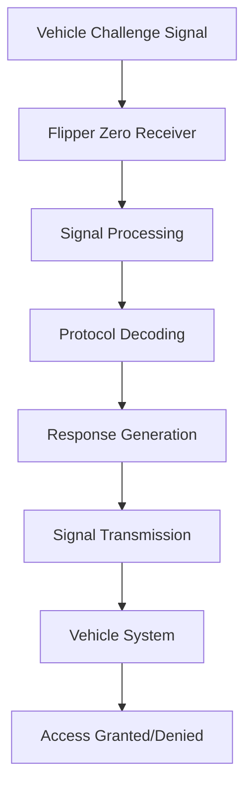
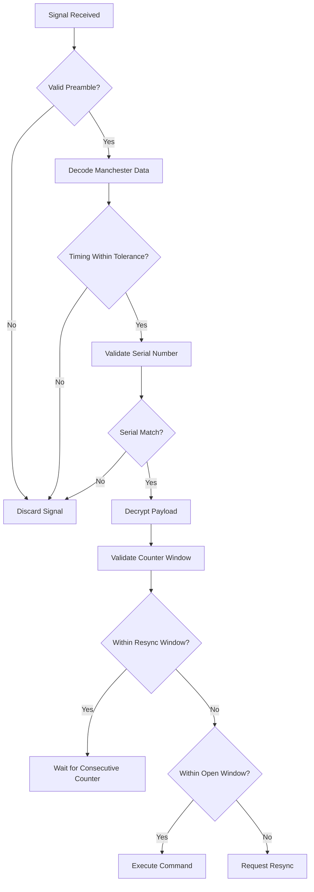
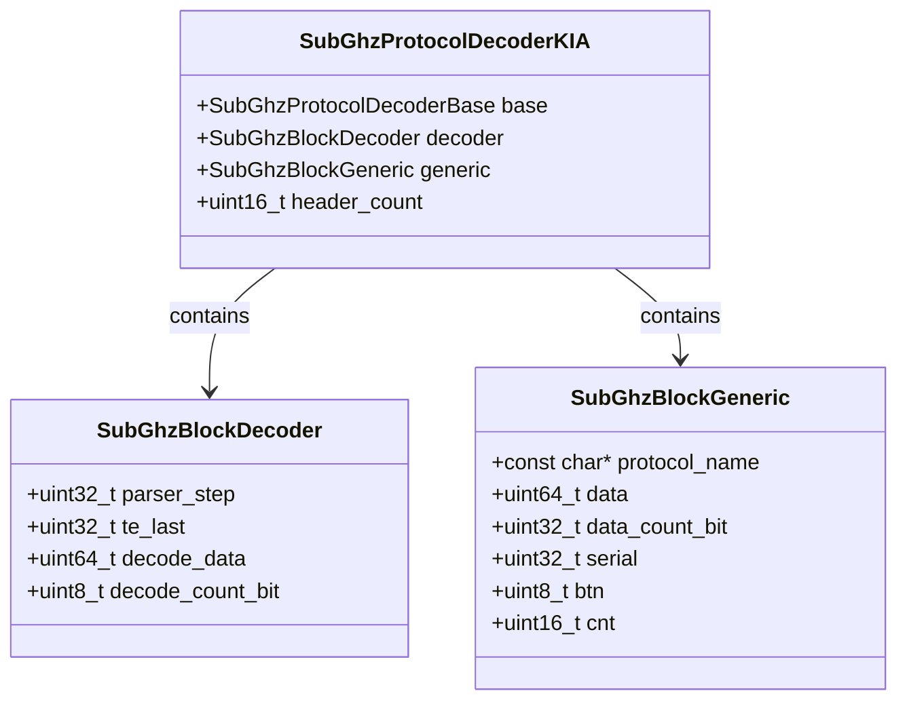
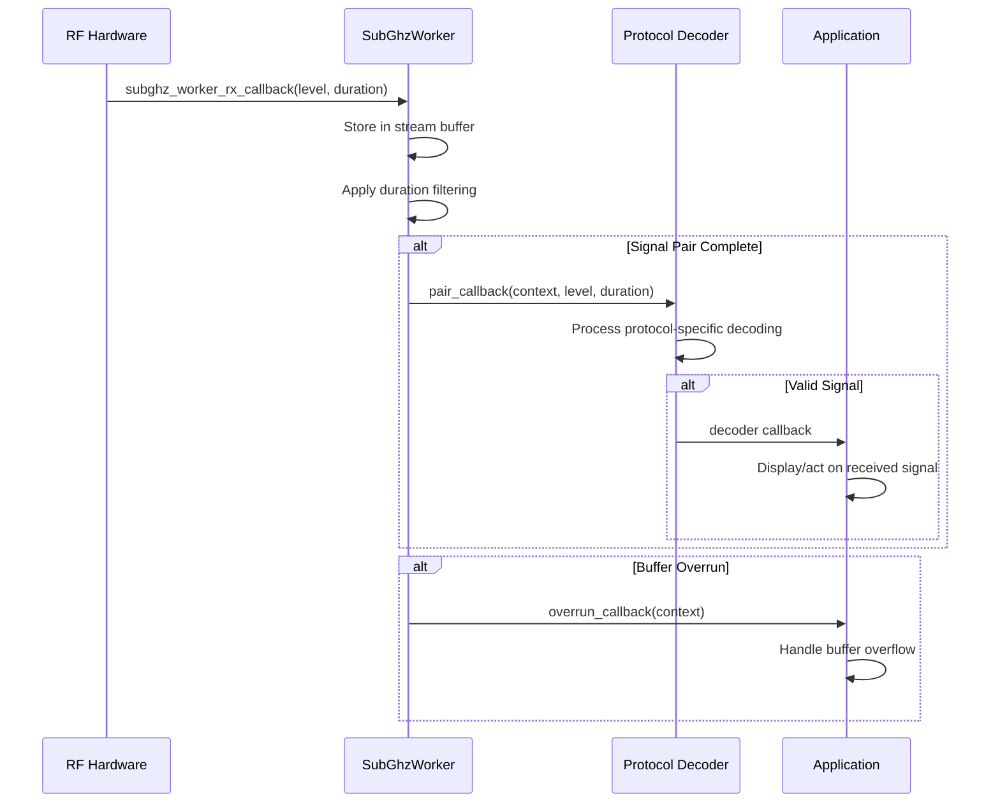

# Bidirectional Protocols

<cite>
**Referenced Files in This Document**   
- [kia.c](file://lib/subghz/protocols/kia.c)
- [kia.h](file://lib/subghz/protocols/kia.h)
- [receiver.c](file://lib/subghz/receiver.c)
- [transmitter.c](file://lib/subghz/transmitter.c)
- [subghz_worker.c](file://lib/subghz/subghz_worker.c)
- [subghz_worker.h](file://lib/subghz/subghz_worker.h)
- [blocks/decoder.h](file://lib/subghz/blocks/decoder.h)
- [blocks/encoder.h](file://lib/subghz/blocks/encoder.h)
- [nfc_protocol.c](file://lib/nfc/protocols/nfc_protocol.c)
- [power.c](file://applications/services/power/power_service/power.c)
- [Code-Hopper-Decoder.md](file://documentation/SubGHz/Code-Hopper-Decoder.md)
- [Rolling Flaws.txt](file://documentation/Rolling Flaws.txt)
</cite>

## Table of Contents
1. [Introduction](#introduction)
2. [Two-Way Communication Architecture](#two-way-communication-architecture)
3. [Signal Timing and Synchronization](#signal-timing-and-synchronization)
4. [Automotive Protocol Implementation](#automotive-protocol-implementation)
5. [Flipper Zero Communication Workflow](#flipper-zero-communication-workflow)
6. [Configuration Options](#configuration-options)
7. [Common Issues and Solutions](#common-issues-and-solutions)
8. [Performance Considerations](#performance-considerations)
9. [Conclusion](#conclusion)

## Introduction

Modern vehicle systems utilize bidirectional communication protocols to enable secure and reliable wireless interactions between remote controls and vehicle receivers. These protocols implement challenge-response mechanisms, precise timing requirements, and synchronization windows to prevent replay attacks and ensure system integrity. The Flipper Zero device provides capabilities to analyze and interact with these protocols, particularly in the Sub-GHz frequency range used by automotive keyless entry systems. This document details the bidirectional communication architecture, focusing on protocols like Kia with their specific implementation characteristics.

**Section sources**
- [kia.c](file://lib/subghz/protocols/kia.c#L1-L276)
- [Code-Hopper-Decoder.md](file://documentation/SubGHz/Code-Hopper-Decoder.md#L12-L175)

## Two-Way Communication Architecture

Bidirectional communication in modern vehicle systems follows a challenge-response model where the vehicle transmits a challenge signal that the remote must correctly respond to within strict timing constraints. The Flipper Zero implements this architecture through its Sub-GHz module, which can both receive and transmit signals on various frequencies.

The communication architecture consists of three main components: the receiver, transmitter, and protocol decoder/encoder. The receiver captures incoming signals and processes them through various decoders, while the transmitter generates appropriate responses. The protocol implementation handles the specific encoding and decoding requirements of different automotive systems.

**Diagram sources **
- [receiver.c](file://lib/subghz/receiver.c#L1-L135)
- [transmitter.c](file://lib/subghz/transmitter.c#L1-L65)

**Section sources**
- [receiver.c](file://lib/subghz/receiver.c#L1-L135)
- [transmitter.c](file://lib/subghz/transmitter.c#L1-L65)

## Signal Timing and Synchronization

Signal timing is critical in bidirectional automotive communication protocols. The Kia protocol implementation demonstrates specific timing requirements with short and long pulse durations that must be precisely maintained. The protocol uses Manchester encoding with defined timing parameters:

- Short pulse duration: 250μs
- Long pulse duration: 500μs
- Timing delta tolerance: 100μs
- Minimum bit count for valid detection: 61 bits

Synchronization windows are implemented to handle timing variations and prevent desynchronization between the remote and vehicle systems. The protocol includes multiple validation steps to ensure proper synchronization:

1. Serial number verification against stored values
2. Decryption of the received transmission
3. Discrimination value comparison
4. Synchronization counter validation within resynchronization window
5. Open window checking for normal operation

When resynchronization is necessary, the system waits for a second transmission with a consecutive synchronization counter before updating the stored counter value.

**Diagram sources **
- [kia.c](file://lib/subghz/protocols/kia.c#L11-L16)
- [Code-Hopper-Decoder.md](file://documentation/SubGHz/Code-Hopper-Decoder.md#L26-L45)

**Section sources**
- [kia.c](file://lib/subghz/protocols/kia.c#L11-L16)
- [Code-Hopper-Decoder.md](file://documentation/SubGHz/Code-Hopper-Decoder.md#L26-L45)

## Automotive Protocol Implementation

The Kia protocol implementation in the Flipper Zero firmware demonstrates the specific requirements of modern automotive bidirectional communication systems. The protocol uses a CRC-8 checksum with polynomial 0x7F and initial value 0x08 to ensure data integrity. The data structure includes:

- 4-bit button identifier
- 12-bit counter value
- 28-bit serial number
- 8-bit CRC checksum

The protocol decoder processes incoming signals through a state machine with four main steps:
1. Reset state
2. Preamble detection
3. Duration saving
4. Duration validation

The implementation includes a custom CRC8 function that processes the data to verify transmission integrity before accepting the command.

**Diagram sources **
- [kia.c](file://lib/subghz/protocols/kia.c#L18-L32)
- [kia.c](file://lib/subghz/protocols/kia.c#L196-L208)

**Section sources**
- [kia.c](file://lib/subghz/protocols/kia.c#L18-L32)
- [kia.c](file://lib/subghz/protocols/kia.c#L196-L208)

## Flipper Zero Communication Workflow

The Flipper Zero implements bidirectional communication through a multi-threaded architecture that separates signal reception from processing. The subghz_worker module handles the low-level signal processing with the following components:

- A dedicated thread for signal processing
- A stream buffer for received signal data
- Callback mechanisms for overrun and pair detection
- Configurable filtering for short duration signals

The workflow begins with the hardware capturing signal levels and durations, which are then passed to the worker thread through a callback function. The worker processes these level-duration pairs, applying filtering to remove noise and combining short pulses. When a complete signal pair is detected, it triggers the pair callback for higher-level protocol processing.

The system also includes overrun detection to handle buffer overflow conditions, ensuring reliable operation even under high signal load conditions.

**Diagram sources **
- [subghz_worker.c](file://lib/subghz/subghz_worker.c#L28-L39)
- [subghz_worker.c](file://lib/subghz/subghz_worker.c#L46-L78)

**Section sources**
- [subghz_worker.c](file://lib/subghz/subghz_worker.c#L1-L150)
- [subghz_worker.h](file://lib/subghz/subghz_worker.h#L1-L81)

## Configuration Options

The Flipper Zero provides several configuration options for bidirectional communication that affect receive window timing, frequency agility, and power management:

### Receive Window Timing
The system allows configuration of the receive window timing through the filter_duration parameter in the SubGhzWorker. This setting determines the minimum duration that will be processed as a separate signal, with a default value of 30μs. Setting this to 0 disables the filter entirely.

### Frequency Agility
The device can operate across multiple frequency bands, with frequency validation handled by the region-specific functions. The system checks if a frequency is allowed before transmission, ensuring compliance with regional regulations.

### Power Management
During active listening periods, the device implements power management strategies to conserve battery life:

- Dynamic power adjustment based on signal strength
- Configurable sleep modes between reception attempts
- Automatic shutdown after idle periods
- Battery level monitoring and display

The power management system balances the need for responsive communication with battery conservation, particularly important during prolonged bidirectional communication attempts.

**Section sources**
- [subghz_worker.c](file://lib/subghz/subghz_worker.c#L92-L93)
- [power.c](file://applications/services/power/power_service/power.c#L52-L70)
- [targets/f7/furi_hal/furi_hal_region_i.h](file://targets/f7/furi_hal/furi_hal_region_i.h#L1-L5)

## Common Issues and Solutions

Several common issues can occur during bidirectional communication attempts, particularly related to timing errors and synchronization problems:

### Missed Challenges Due to Timing Errors
Missed challenges often occur when the receive window is not properly aligned with the transmitted signal. Solutions include:

- Adaptive window sizing based on signal analysis
- Increasing the receive buffer size to handle signal bursts
- Implementing predictive timing based on previous signal patterns

### Synchronization Window Issues
The Rolling Flaws documentation describes scenarios where synchronization windows can be exploited:

- **Window-next attacks**: When a signal with a counter within the "next" window is accepted
- **Future attacks**: When two sequential signals resynchronize the receiver to a future counter value

Solutions include implementing tighter window constraints and requiring additional validation steps before accepting out-of-sequence counters.

### Signal Interference
Environmental interference can cause signal corruption. The system addresses this through:

- Signal filtering to remove noise
- Multiple reception attempts
- Error detection and correction mechanisms

**Section sources**
- [Rolling Flaws.txt](file://documentation/Rolling Flaws.txt#L524-L569)
- [subghz_worker.c](file://lib/subghz/subghz_worker.c#L31-L38)

## Performance Considerations

Battery consumption is a critical consideration during prolonged bidirectional communication attempts. The Flipper Zero implements several strategies to optimize power usage:

### Active Listening Power Management
During active listening periods, the device consumes significantly more power than in standby mode. The power management system implements:

- Duty cycling between active and sleep states
- Dynamic adjustment of receive sensitivity
- Automatic shutdown after configurable idle periods

### Transmission Power Optimization
The device adjusts transmission power based on distance and signal conditions, reducing power when full power is not required. This extends battery life while maintaining reliable communication.

### Processing Efficiency
The multi-threaded architecture ensures that signal processing does not block other system operations, maintaining overall device responsiveness even during intensive communication sessions.

### Battery Monitoring
The system continuously monitors battery level and can adjust communication parameters based on available power, prioritizing critical functions when battery is low.

**Section sources**
- [power.c](file://applications/services/power/power_service/power.c#L228-L642)
- [subghz_worker.c](file://lib/subghz/subghz_worker.c#L8-L20)

## Conclusion

The bidirectional communication protocols used in modern vehicle systems represent sophisticated security mechanisms that balance convenience with protection against unauthorized access. The Flipper Zero's implementation demonstrates the complexity of these systems, from precise timing requirements to advanced synchronization mechanisms. Understanding these protocols is essential for both security research and legitimate troubleshooting of vehicle communication systems. The device's architecture provides a flexible platform for analyzing and interacting with these protocols while implementing power management strategies to ensure practical usability.