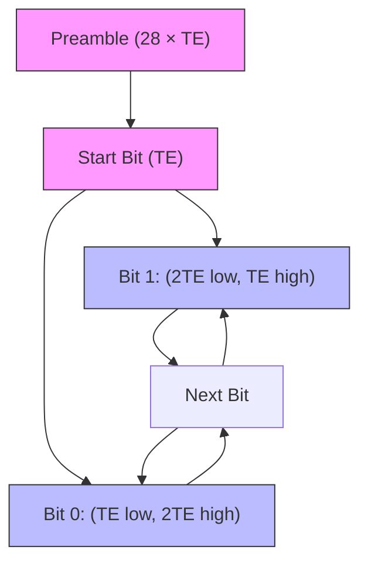
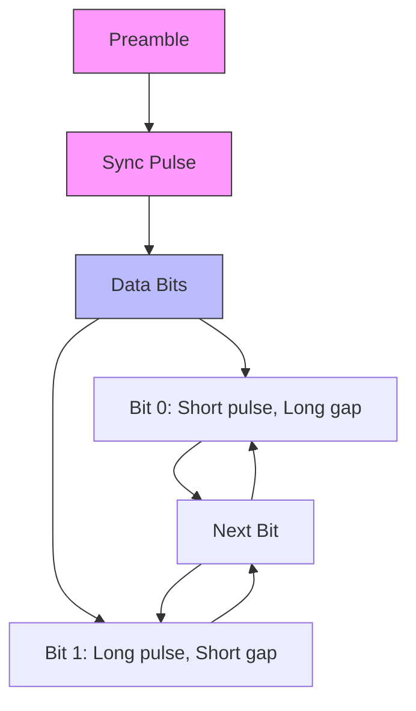
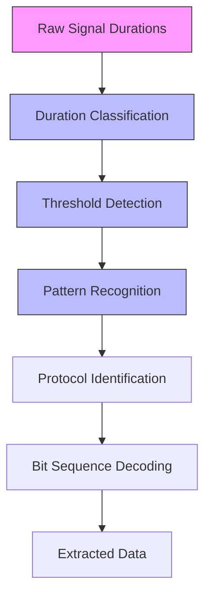
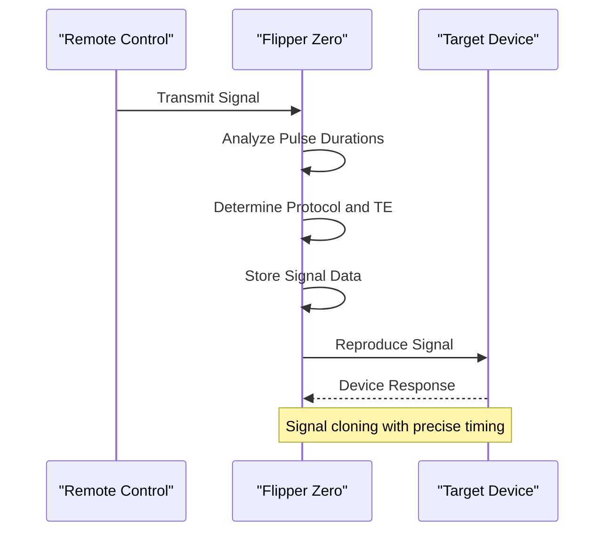
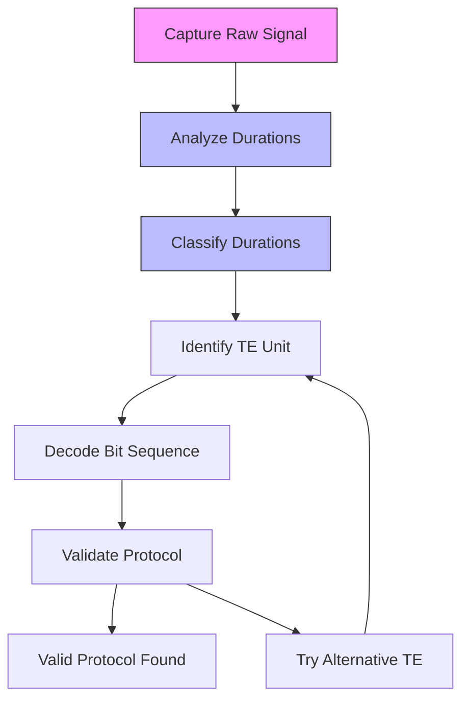
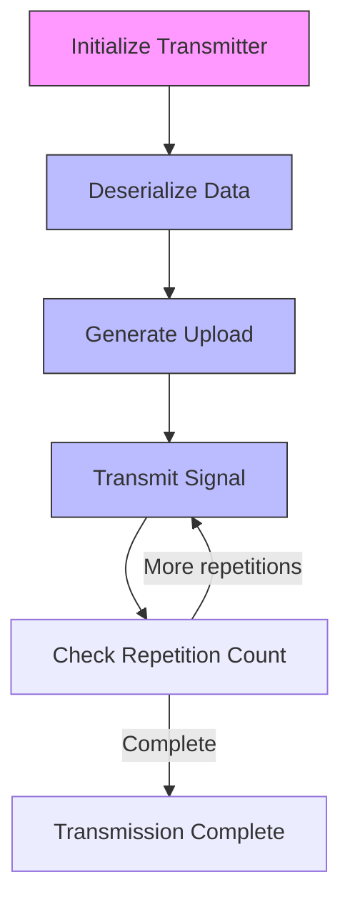
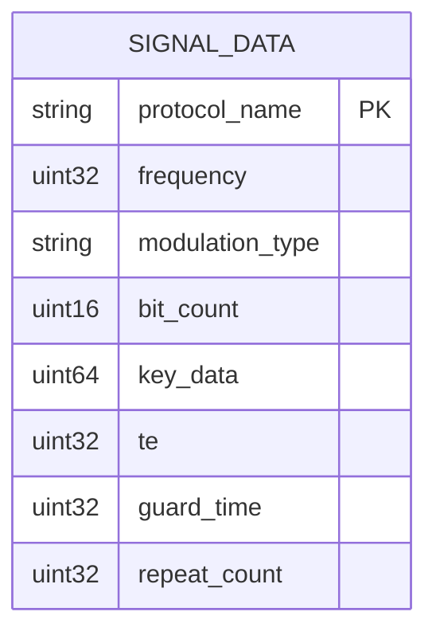
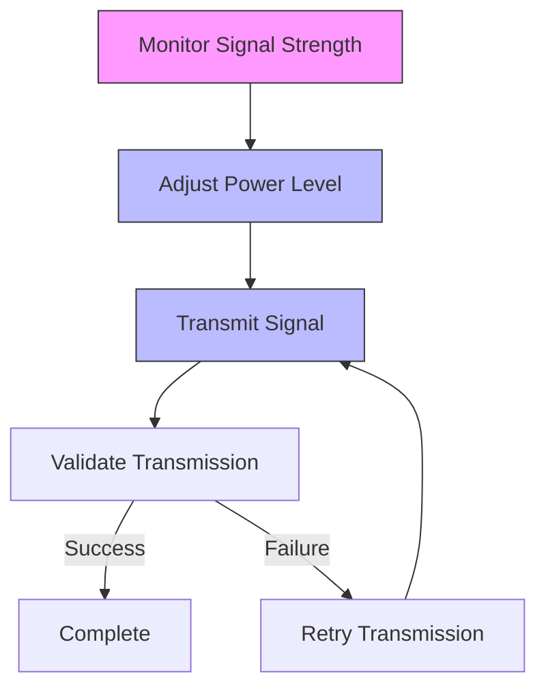
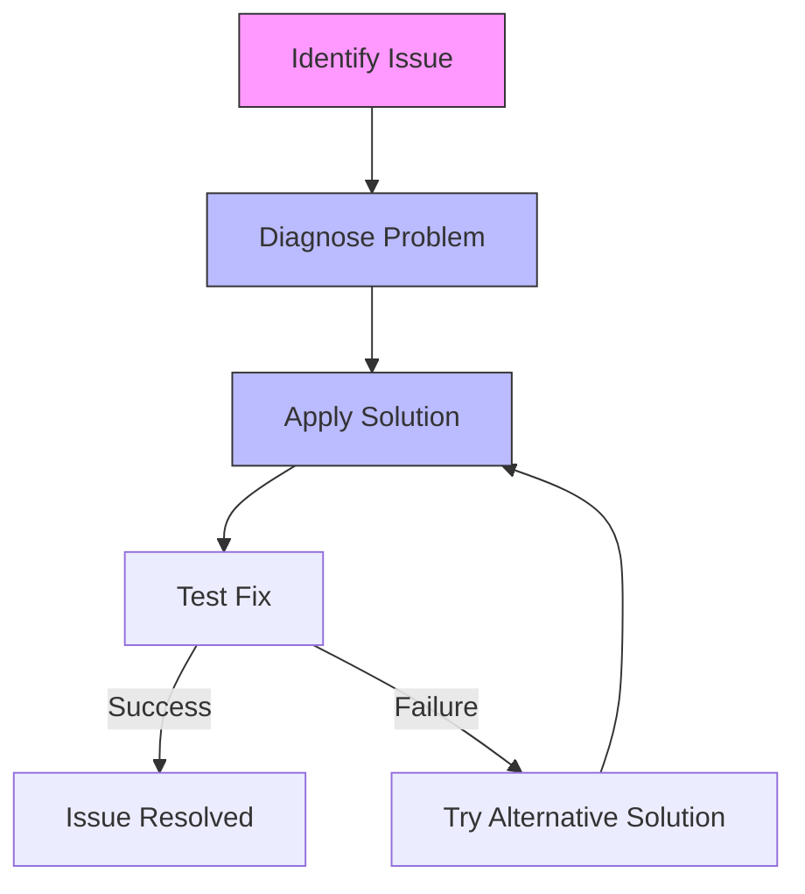
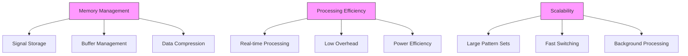

# Fixed Code Protocols

<cite>
**Referenced Files in This Document**   
- [holtek_ht12x.c](file://lib/subghz/protocols/holtek_ht12x.c)
- [holtek_ht12x.h](file://lib/subghz/protocols/holtek_ht12x.h)
- [princeton.c](file://lib/subghz/protocols/princeton.c)
- [princeton.h](file://lib/subghz/protocols/princeton.h)
- [bin_raw.c](file://lib/subghz/protocols/bin_raw.c)
- [raw.c](file://lib/subghz/protocols/raw.c)
- [generic.c](file://lib/subghz/blocks/generic.c)
- [transmitter.c](file://lib/subghz/transmitter.c)
- [subghz_tx_rx_worker.c](file://lib/subghz/subghz_tx_rx_worker.c)
- [subghz_setting.c](file://lib/subghz/subghz_setting.c)
</cite>

## Table of Contents
1. [Introduction](#introduction)
2. [Signal Structure](#signal-structure)
3. [Pulse Width Modulation Analysis](#pulse-width-modulation-analysis)
4. [Signal Cloning and Reproduction](#signal-cloning-and-reproduction)
5. [Brute Force Techniques](#brute-force-techniques)
6. [Transmission Workflow](#transmission-workflow)
7. [Configuration Options](#configuration-options)
8. [Signal Optimization](#signal-optimization)
9. [Common Issues and Solutions](#common-issues-and-solutions)
10. [Performance Considerations](#performance-considerations)
11. [Conclusion](#conclusion)

## Introduction
The Flipper Zero device implements a comprehensive system for analyzing, capturing, and reproducing fixed code signals used in simple remote controls. This documentation details the protocols, signal analysis techniques, and implementation details that enable the device to work with various fixed code systems. The firmware supports multiple protocol types including Holtek HT12X, Princeton, and raw signal formats, providing users with tools for signal analysis, cloning, and brute force attacks on unknown protocols.

**Section sources**
- [holtek_ht12x.c](file://lib/subghz/protocols/holtek_ht12x.c#L1-L410)
- [princeton.c](file://lib/subghz/protocols/princeton.c#L1-L588)

## Signal Structure
Fixed code protocols used in simple remote controls typically follow a standardized structure consisting of preamble, address bits, command bits, and error checking mechanisms. The Flipper Zero firmware supports various fixed code protocols, each with specific timing characteristics and data structures.

### Holtek HT12X Protocol
The Holtek HT12X protocol uses a specific signal structure with defined timing parameters:
- **Preamble**: 28 times the short pulse duration (TE)
- **Start bit**: One short pulse duration (TE)
- **Data encoding**: Each bit consists of two pulses - either (2TE, TE) for bit 1 or (TE, 2TE) for bit 0
- **Address bits**: 8 bits for device identification
- **Data/command bits**: 4 bits for button press information
- **Timing parameters**: 
  - Short pulse duration (TE): 320μs
  - Long pulse duration: 640μs
  - Timing delta: 200μs

**Diagram sources**
- [holtek_ht12x.c](file://lib/subghz/protocols/holtek_ht12x.c#L23-L28)
- [holtek_ht12x.c](file://lib/subghz/protocols/holtek_ht12x.c#L239-L254)

### Princeton Protocol
The Princeton protocol implements a different signal structure:
- **Short pulse duration (TE)**: 390μs
- **Long pulse duration**: 1170μs
- **Timing delta**: 300μs
- **Minimum bit count for detection**: 24 bits
- **Guard time**: 30 × TE (configurable between 15-72 × TE)

The protocol uses pulse width modulation where:
- Bit 0: Short pulse followed by long gap
- Bit 1: Long pulse followed by short gap

**Diagram sources**
- [princeton.c](file://lib/subghz/protocols/princeton.c#L22-L27)
- [princeton.c](file://lib/subghz/protocols/princeton.c#L294-L307)

**Section sources**
- [holtek_ht12x.c](file://lib/subghz/protocols/holtek_ht12x.c#L23-L28)
- [princeton.c](file://lib/subghz/protocols/princeton.c#L22-L27)

## Pulse Width Modulation Analysis
The Flipper Zero implements sophisticated pulse width modulation analysis to decode fixed code signals with high precision. The system analyzes the timing characteristics of received signals to determine the appropriate protocol and extract the encoded data.

### Signal Classification
The firmware uses a classification algorithm to identify signal patterns:
- **Duration classification**: Signals are classified based on their duration into different categories
- **Threshold-based detection**: Uses adaptive thresholds to distinguish between signal and noise
- **Pattern recognition**: Identifies repeating patterns in the signal to determine protocol type

The analysis process involves:
1. Capturing raw signal durations
2. Classifying durations into short, medium, and long categories
3. Determining the base timing unit (TE) from the most common duration
4. Decoding the bit sequence based on pulse width ratios

**Diagram sources**
- [bin_raw.c](file://lib/subghz/protocols/bin_raw.c#L404-L482)
- [bin_raw.c](file://lib/subghz/protocols/bin_raw.c#L448-L452)

**Section sources**
- [bin_raw.c](file://lib/subghz/protocols/bin_raw.c#L404-L482)

## Signal Cloning and Reproduction
The Flipper Zero provides robust signal cloning capabilities, allowing users to capture and reproduce fixed code signals with precise timing accuracy.

### Capture Process
The signal capture process involves:
1. Receiving the raw signal through the sub-GHz radio
2. Analyzing the pulse durations and patterns
3. Determining the protocol type and timing parameters
4. Storing the signal data in a structured format

### Reproduction Process
The signal reproduction process uses the transmitter module:
1. Loading the stored signal data
2. Generating the appropriate pulse sequence
3. Transmitting the signal with precise timing
4. Repeating the transmission according to the configured repetition count

**Diagram sources**
- [transmitter.c](file://lib/subghz/transmitter.c#L11-L65)
- [subghz_tx_rx_worker.c](file://lib/subghz/subghz_tx_rx_worker.c#L1-L20)

**Section sources**
- [transmitter.c](file://lib/subghz/transmitter.c#L11-L65)
- [subghz_tx_rx_worker.c](file://lib/subghz/subghz_tx_rx_worker.c#L1-L20)

## Brute Force Techniques
For unknown protocols, the Flipper Zero implements brute force techniques to discover valid signal patterns.

### Raw Signal Analysis
The bin_raw protocol analyzer performs comprehensive signal analysis:
- **Duration classification**: Analyzes signal durations to identify potential timing units
- **Gap detection**: Identifies gaps in the signal that may indicate packet boundaries
- **Pattern repetition**: Detects repeating patterns that may indicate valid data sequences

### Implementation Details
The brute force approach involves:
1. Capturing raw signal data with high precision
2. Analyzing the signal for repeating patterns
3. Testing different timing assumptions to decode potential protocols
4. Validating decoded data against known protocol structures

**Diagram sources**
- [bin_raw.c](file://lib/subghz/protocols/bin_raw.c#L404-L800)
- [bin_raw.c](file://lib/subghz/protocols/bin_raw.c#L448-L452)

**Section sources**
- [bin_raw.c](file://lib/subghz/protocols/bin_raw.c#L404-L800)

## Transmission Workflow
The transmission workflow in the Flipper Zero firmware follows a structured process to ensure reliable signal reproduction.

### Transmission Sequence
1. **Protocol initialization**: Allocate and initialize the transmitter for the selected protocol
2. **Data deserialization**: Load the stored signal data from file format
3. **Upload generation**: Convert the data into a sequence of level and duration pairs
4. **Signal transmission**: Send the signal through the sub-GHz radio
5. **Repetition handling**: Repeat the transmission according to the configured count

### Key Components
- **Transmitter module**: Manages the transmission process
- **Protocol encoder**: Converts data into the appropriate pulse sequence
- **DMA buffer**: Stores the level and duration pairs for transmission
- **Radio driver**: Controls the physical transmission

**Diagram sources**
- [transmitter.c](file://lib/subghz/transmitter.c#L11-L65)
- [subghz_tx_rx_worker.c](file://lib/subghz/subghz_tx_rx_worker.c#L1-L20)

**Section sources**
- [transmitter.c](file://lib/subghz/transmitter.c#L11-L65)
- [subghz_tx_rx_worker.c](file://lib/subghz/subghz_tx_rx_worker.c#L1-L20)

## Configuration Options
The Flipper Zero provides various configuration options for fine-tuning signal transmission.

### Pulse Duration Settings
- **TE (Time Unit)**: Configurable base timing unit for the protocol
- **Guard time**: Adjustable gap between signal repetitions
- **Pulse width**: Configurable for different protocol requirements

### Repetition Control
- **Repeat count**: Number of times to transmit the signal
- **Transmission delay**: Adjustable delay between repetitions
- **Power settings**: Configurable transmission power levels

### Storage Format
Signal data is stored in a structured format that includes:
- Protocol name
- Frequency
- Modulation type
- Bit count
- Key data
- Timing parameters (TE)
- Guard time
- Repeat count

**Diagram sources**
- [generic.c](file://lib/subghz/blocks/generic.c#L88-L127)
- [princeton.c](file://lib/subghz/protocols/princeton.c#L530-L549)

**Section sources**
- [generic.c](file://lib/subghz/blocks/generic.c#L88-L127)
- [princeton.c](file://lib/subghz/protocols/princeton.c#L530-L549)

## Signal Optimization
The Flipper Zero implements several techniques to optimize signal transmission and reception.

### Adaptive Power Adjustment
- **Signal strength monitoring**: Measures received signal strength
- **Power level adjustment**: Automatically adjusts transmission power based on distance
- **Battery optimization**: Reduces power consumption when possible

### Timing Precision
- **High-resolution timing**: Uses microsecond precision for pulse generation
- **Clock synchronization**: Ensures accurate timing between capture and reproduction
- **Jitter reduction**: Minimizes timing variations in signal generation

### Error Handling
- **Signal validation**: Verifies signal integrity before transmission
- **Retransmission**: Automatically retransmits failed signals
- **Error detection**: Identifies and reports transmission errors

**Diagram sources**
- [subghz_setting.c](file://lib/subghz/subghz_setting.c#L1-L20)
- [subghz_tx_rx_worker.c](file://lib/subghz/subghz_tx_rx_worker.c#L1-L20)

**Section sources**
- [subghz_setting.c](file://lib/subghz/subghz_setting.c#L1-L20)
- [subghz_tx_rx_worker.c](file://lib/subghz/subghz_tx_rx_worker.c#L1-L20)

## Common Issues and Solutions
Users may encounter various issues when working with fixed code protocols, and the Flipper Zero provides solutions for common problems.

### Signal Interference
- **Problem**: Other devices operating on the same frequency band
- **Solution**: Use frequency hopping or switch to less congested frequencies
- **Implementation**: The device can scan for clear frequencies before transmission

### Weak Transmission Range
- **Problem**: Insufficient signal strength to reach the target device
- **Solution**: Adaptive power adjustment and antenna optimization
- **Implementation**: The device automatically increases power when needed

### Protocol Incompatibility
- **Problem**: Unknown or unsupported protocol
- **Solution**: Raw signal analysis and brute force techniques
- **Implementation**: The bin_raw analyzer can decode unknown protocols

**Diagram sources**
- [subghz_setting.c](file://lib/subghz/subghz_setting.c#L1-L20)
- [bin_raw.c](file://lib/subghz/protocols/bin_raw.c#L404-L800)

**Section sources**
- [subghz_setting.c](file://lib/subghz/subghz_setting.c#L1-L20)
- [bin_raw.c](file://lib/subghz/protocols/bin_raw.c#L404-L800)

## Performance Considerations
The Flipper Zero firmware is optimized for efficient memory usage and performance when handling fixed code protocols.

### Memory Usage
- **Signal storage**: Optimized data structures for storing signal patterns
- **Buffer management**: Efficient use of memory buffers for signal processing
- **Compression**: Optional compression for storing large numbers of patterns

### Processing Efficiency
- **Real-time processing**: Optimized algorithms for real-time signal analysis
- **Low overhead**: Minimal processing overhead for signal reproduction
- **Power efficiency**: Optimized for battery-powered operation

### Scalability
- **Large pattern sets**: Capable of storing and managing large numbers of fixed code patterns
- **Fast switching**: Quick switching between different protocols and signals
- **Background processing**: Non-blocking operations for improved responsiveness

**Diagram sources**
- [bin_raw.c](file://lib/subghz/protocols/bin_raw.c#L17-L26)
- [generic.c](file://lib/subghz/blocks/generic.c#L1-L21)
- [transmitter.c](file://lib/subghz/transmitter.c#L11-L65)

**Section sources**
- [bin_raw.c](file://lib/subghz/protocols/bin_raw.c#L17-L26)
- [generic.c](file://lib/subghz/blocks/generic.c#L1-L21)
- [transmitter.c](file://lib/subghz/transmitter.c#L11-L65)

## Conclusion
The Flipper Zero implements a comprehensive system for working with fixed code protocols in simple remote controls. Through sophisticated pulse width modulation analysis, precise signal reproduction, and advanced techniques for handling unknown protocols, the device provides users with powerful tools for signal analysis and cloning. The system's modular design, efficient memory usage, and robust error handling make it suitable for a wide range of applications, from legitimate device control to security research. The combination of hardware capabilities and firmware features enables reliable operation with various fixed code protocols while maintaining optimal performance and power efficiency.