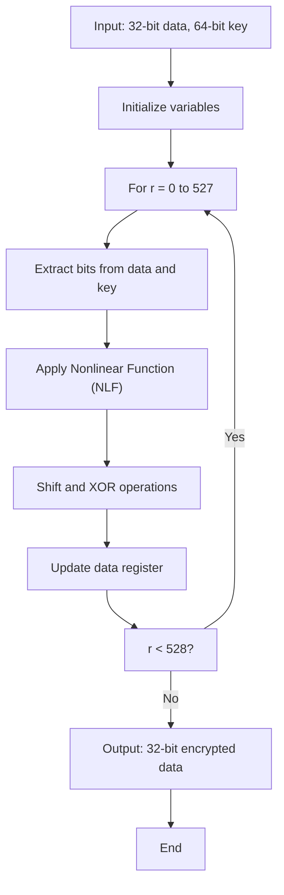
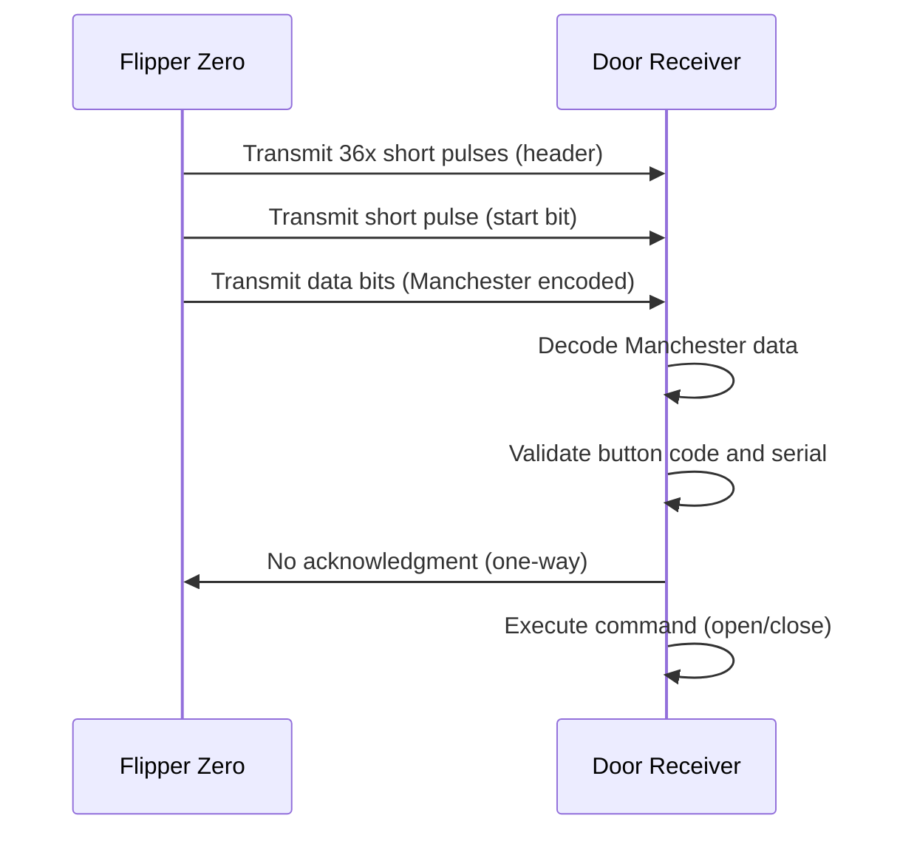
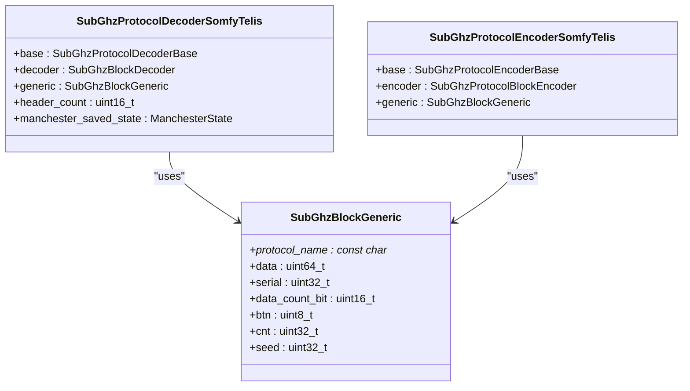
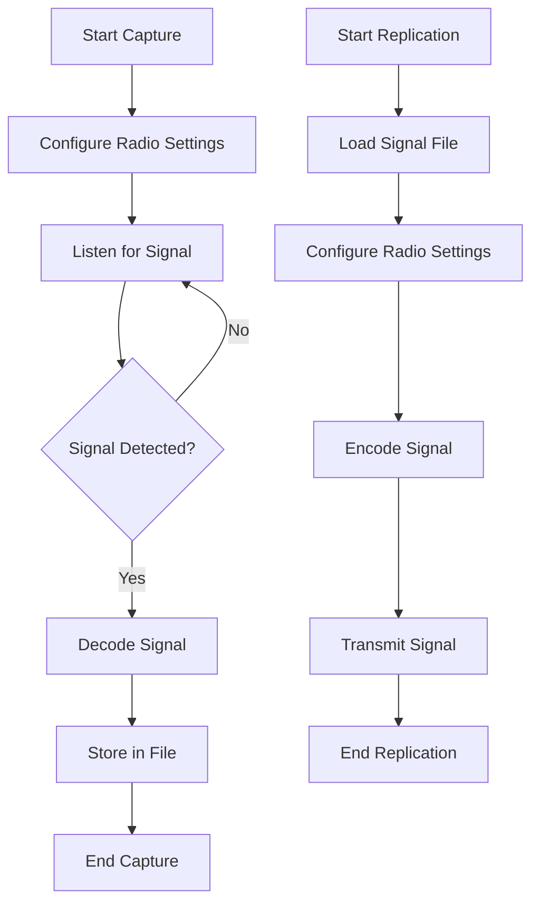
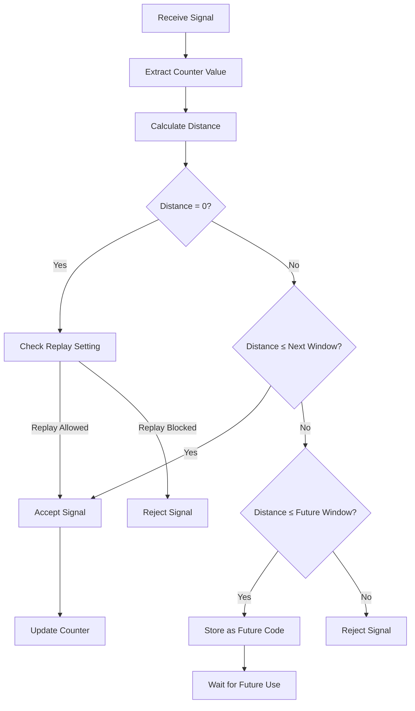

# Rolling Code Protocols

<cite>
**Referenced Files in This Document**   
- [keeloq.c](file://lib/subghz/protocols/keeloq.c)
- [keeloq_common.c](file://lib/subghz/protocols/keeloq_common.c)
- [nice_flo.c](file://lib/subghz/protocols/nice_flo.c)
- [somfy_telis.c](file://lib/subghz/protocols/somfy_telis.c)
- [rolling_flaws.c](file://applications/external/rolling_flaws/rolling_flaws.c)
- [rolling_flaws_keeloq.c](file://applications/external/rolling_flaws/rolling_flaws_keeloq.c)
- [subghz_keystore.h](file://lib/subghz/subghz_keystore.h)
- [generic.h](file://lib/subghz/blocks/generic.h)
</cite>

## Table of Contents
1. [Introduction](#introduction)
2. [Cryptographic Principles of Rolling Codes](#cryptographic-principles-of-rolling-codes)
3. [KeeLoq Protocol Implementation](#keeloq-protocol-implementation)
4. [Nice Flo Protocol Implementation](#nice-flo-protocol-implementation)
5. [Somfy Telis Protocol Implementation](#somfy-telis-protocol-implementation)
6. [Flipper Zero Code Capture and Replication](#flipper-zero-code-capture-and-replication)
7. [Learning Process and Synchronization](#learning-process-and-synchronization)
8. [Code Prediction and Desynchronization Handling](#code-prediction-and-desynchronization-handling)
9. [Performance and Security Considerations](#performance-and-security-considerations)
10. [Conclusion](#conclusion)

## Introduction
Rolling code protocols are security mechanisms used in wireless access control systems to prevent replay attacks by ensuring each transmitted code is unique. The Flipper Zero device implements support for various rolling code protocols including KeeLoq, Nice Flo, and Somfy Telis, allowing users to capture, analyze, and replicate these signals. This document details the cryptographic principles behind rolling codes and the specific implementation of these protocols in the Flipper Zero firmware, with a focus on seed-based generation, counter synchronization, and replay attack prevention.

## Cryptographic Principles of Rolling Codes

Rolling code systems use cryptographic algorithms to generate unique codes for each transmission, preventing attackers from recording and replaying previous signals. The core principles include seed-based generation, counter synchronization, and replay attack prevention mechanisms.

### Seed-Based Generation
Seed-based generation uses a shared secret key (seed) between the transmitter and receiver to generate codes. In the KeeLoq protocol, the seed is a 64-bit manufacturing key stored in the keystore system. The `subghz_keystore_t` structure manages these keys, allowing for secure storage and retrieval of manufacturing keys used in encryption and decryption processes.

### Counter Synchronization
Counter synchronization ensures the transmitter and receiver remain in sync despite missed transmissions. The system maintains a rolling counter that increments with each button press. The receiver accepts codes within a window of acceptable counter values, allowing for a limited number of missed transmissions. This is implemented through the `cnt` field in the `SubGhzBlockGeneric` structure, which tracks the rolling code counter value.

### Replay Attack Prevention
Replay attack prevention is achieved by ensuring each transmitted code can only be used once. The receiver maintains the last accepted counter value and rejects any codes with equal or lower counter values. The system also implements window-based validation, where codes within a future window are stored for later use, while codes outside this window are rejected. This mechanism is evident in the rolling_flaws application's validation logic, which checks the distance between current and received counter values.

**Section sources**
- [keeloq.c](file://lib/subghz/protocols/keeloq.c#L1-L1482)
- [keeloq_common.c](file://lib/subghz/protocols/keeloq_common.c#L1-L143)
- [generic.h](file://lib/subghz/blocks/generic.h#L1-L73)

## KeeLoq Protocol Implementation

The KeeLoq protocol is a widely used rolling code system that employs a 64-bit encryption algorithm to secure wireless communications. The Flipper Zero implements this protocol with support for various learning modes and encryption types.

### Encryption Algorithm
The KeeLoq encryption algorithm is implemented in the `subghz_protocol_keeloq_common_encrypt` function, which performs 528 rounds of bit manipulation on a 32-bit data block using a 64-bit key. The algorithm uses a nonlinear function (NLF) to introduce complexity into the encryption process, making it resistant to simple cryptanalysis.



**Diagram sources**
- [keeloq_common.c](file://lib/subghz/protocols/keeloq_common.c#L16-L22)

### Learning Modes
The KeeLoq implementation supports multiple learning modes, including Simple Learning, Normal Learning, Secure Learning, and various magic learning types. These modes determine how the manufacturing key is derived from the serial number and seed values. The learning mode is specified in the `type` field of the `SubGhzKey` structure, which is part of the keystore system.

### Counter Management
The KeeLoq protocol implements sophisticated counter management with multiple modes, including sequential increment, overflow handling, and fixed increment patterns. The counter mode can be configured through the signal file, allowing for compatibility with different manufacturer implementations. The counter is stored in the `cnt` field of the `SubGhzBlockGeneric` structure and is incremented according to the selected counter mode.

**Section sources**
- [keeloq.c](file://lib/subghz/protocols/keeloq.c#L1-L1482)
- [keeloq_common.c](file://lib/subghz/protocols/keeloq_common.c#L1-L143)
- [subghz_keystore.h](file://lib/subghz/subghz_keystore.h#L1-L83)

## Nice Flo Protocol Implementation

The Nice Flo protocol is a fixed-code system that uses Manchester encoding for data transmission. Unlike rolling code systems, Nice Flo transmits the same code for each button press, making it vulnerable to replay attacks but simpler to implement.

### Timing Parameters
The Nice Flo protocol uses specific timing parameters for signal encoding:
- Short pulse duration: 700 microseconds
- Long pulse duration: 1,400 microseconds
- Timing delta: 200 microseconds
- Minimum bit count for detection: 12 bits

These parameters are defined in the `subghz_protocol_nice_flo_const` structure and are used by the decoder to accurately interpret incoming signals.

### Signal Structure
The Nice Flo signal structure consists of:
1. A header with a 36x short pulse duration
2. A start bit with a short pulse duration
3. Data bits encoded using Manchester encoding
4. No explicit stop bit

The data is transmitted in a fixed format, with the button code and serial number encoded in the data bits. The protocol supports both 12-bit and 24-bit data lengths, providing flexibility for different device configurations.



**Diagram sources**
- [nice_flo.c](file://lib/subghz/protocols/nice_flo.c#L1-L338)

## Somfy Telis Protocol Implementation

The Somfy Telis protocol is a rolling code system used in garage door openers and gate controllers. It employs Manchester encoding with a complex frame structure and checksum validation.

### Frame Structure
The Somfy Telis protocol uses a sophisticated frame structure consisting of:
1. Wake-up pulse: 9,415 microseconds high, 89,565 microseconds low
2. Hardware synchronization: Two pulses of 2,560 microseconds each
3. Software synchronization: 4,550 microseconds high, 640 microseconds low
4. Data frame: 56 bits of Manchester-encoded data
5. Inter-frame silence: 30,415 microseconds

The data frame itself contains:
- 4-bit button code
- 4-bit checksum
- 16-bit rolling counter (big-endian)
- 24-bit serial number (little-endian)

### Checksum Calculation
The Somfy Telis protocol implements a 4-bit checksum for data validation. The checksum is calculated by XORing all bytes of the frame with their right-shifted counterparts:

```
checksum = 0
for i in 0 to 6:
    checksum = checksum ^ frame[i] ^ (frame[i] >> 4)
checksum = checksum & 0xF
```

The checksum is then incorporated into the second byte of the frame, ensuring data integrity during transmission.

### Counter Synchronization
The Somfy Telis protocol uses a 16-bit rolling counter that increments with each button press. The receiver accepts codes within a window of acceptable counter values, allowing for missed transmissions. The counter is stored in the `cnt` field of the `SubGhzBlockGeneric` structure and is managed by the protocol encoder and decoder.



**Diagram sources**
- [somfy_telis.c](file://lib/subghz/protocols/somfy_telis.c#L1-L769)
- [generic.h](file://lib/subghz/blocks/generic.h#L1-L73)

## Flipper Zero Code Capture and Replication

The Flipper Zero device captures and replicates rolling code sequences through its SubGHz module, which supports various protocols and modulation schemes.

### Signal Capture Process
The signal capture process involves:
1. Configuring the SubGHz radio for the appropriate frequency and modulation
2. Listening for incoming signals using the receiver module
3. Decoding the signal using the appropriate protocol decoder
4. Storing the decoded data in a file for later use

The capture process is implemented in the `subghz_protocol_decoder_*_feed` functions, which process incoming signal data and extract the relevant protocol information.

### Code Replication
Code replication involves:
1. Loading a previously captured signal file
2. Configuring the SubGHz radio for transmission
3. Encoding the signal data using the appropriate protocol encoder
4. Transmitting the signal at the specified frequency

The replication process is managed by the `subghz_protocol_encoder_*_yield` functions, which generate the level and duration pairs needed to transmit the signal.



**Section sources**
- [keeloq.c](file://lib/subghz/protocols/keeloq.c#L1-L1482)
- [nice_flo.c](file://lib/subghz/protocols/nice_flo.c#L1-L338)
- [somfy_telis.c](file://lib/subghz/protocols/somfy_telis.c#L1-L769)

## Learning Process and Synchronization

The learning process for pairing the Flipper Zero with existing remotes involves capturing the rolling code sequence and synchronizing the counter values.

### Pairing Process
The pairing process typically involves:
1. Putting the receiver device into learning mode
2. Capturing a signal from the original remote
3. Extracting the serial number, button code, and current counter value
4. Storing this information for future use

The rolling_flaws application implements a synchronization feature that captures a signal and extracts the necessary information for replication. The `decode_keeloq` function in rolling_flaws_keeloq.c processes incoming KeeLoq signals and updates the model with the captured data.

### Code Hopping Algorithms
Code hopping algorithms ensure that each transmitted code is unique. The Flipper Zero implements these algorithms through the protocol encoders, which increment the counter value according to the specific protocol requirements. For KeeLoq, the counter increment is handled in the `subghz_protocol_keeloq_gen_data` function, which supports various counter modes including sequential, overflow, and fixed increment patterns.

### Synchronization Patterns
Synchronization patterns vary by protocol:
- KeeLoq: Uses a 16-bit counter with window-based validation
- Nice Flo: No synchronization needed (fixed code)
- Somfy Telis: Uses a 16-bit counter with Manchester encoding and checksum validation

The synchronization process ensures that the Flipper Zero can maintain alignment with the receiver device even after multiple transmissions.

**Section sources**
- [rolling_flaws.c](file://applications/external/rolling_flaws/rolling_flaws.c#L1-L473)
- [rolling_flaws_keeloq.c](file://applications/external/rolling_flaws/rolling_flaws_keeloq.c#L1-L227)
- [keeloq.c](file://lib/subghz/protocols/keeloq.c#L1-L1482)

## Code Prediction and Desynchronization Handling

Code prediction and desynchronization handling are critical for maintaining reliable communication with rolling code systems.

### Code Prediction
Code prediction involves calculating future code values based on the current counter and increment pattern. The Flipper Zero implements code prediction through the protocol encoders, which can generate the next code in the sequence. For KeeLoq, the prediction is handled in the `subghz_protocol_keeloq_gen_data` function, which increments the counter according to the selected mode.

### Desynchronization Handling
Desynchronization occurs when the transmitter and receiver counters become misaligned, typically due to multiple failed transmission attempts. The Flipper Zero handles desynchronization through:

1. **Code Range Scanning**: The device can scan through a range of counter values to find the current code. This is implemented in the rolling_flaws application through the window-based validation system.

2. **Future Code Storage**: The receiver can store future codes for later use, allowing it to remain synchronized even if some transmissions are missed. The `future_count` field in the RollingFlawsModel structure tracks these future codes.

3. **Counter Reset**: In cases of severe desynchronization, the counter can be reset to zero. This is implemented in the rolling_flaws application through the "Reset count to zero" menu option.

The validation logic in the `is_open` function of rolling_flaws_keeloq.c demonstrates the desynchronization handling process, checking the distance between current and received counter values against configurable window sizes.



**Section sources**
- [rolling_flaws_keeloq.c](file://applications/external/rolling_flaws/rolling_flaws_keeloq.c#L1-L227)
- [keeloq.c](file://lib/subghz/protocols/keeloq.c#L1-L1482)

## Performance and Security Considerations

### Battery Usage
Battery usage during extended code learning sessions is influenced by several factors:
- Transmission power level
- Number of retransmissions
- Duty cycle of signal monitoring
- Screen backlight usage

The rolling_flaws application includes an option to keep the backlight continuously on, which significantly impacts battery life. For extended learning sessions, it's recommended to disable this feature to conserve power.

### Security Implications
Rolling code vulnerabilities include:
- **Replay Attacks**: Prevented by the rolling counter mechanism
- **Brute Force Attacks**: Mitigated by the large key space (2^64 for KeeLoq)
- **Cloning Attacks**: Possible if the manufacturing key is extracted
- **Rolljam Attacks**: Where an attacker captures multiple codes to extend the valid window

The Flipper Zero's implementation includes several security features to mitigate these risks:
- Keystore encryption for manufacturing keys
- Window-based validation to limit the number of acceptable future codes
- Counter overflow protection to prevent predictable patterns

### Optimization Recommendations
To optimize performance and security:
1. Use the minimum necessary transmission power
2. Limit the future code window size
3. Regularly synchronize with the receiver device
4. Store manufacturing keys securely
5. Monitor for unexpected code patterns that may indicate an attack

**Section sources**
- [rolling_flaws.c](file://applications/external/rolling_flaws/rolling_flaws.c#L1-L473)
- [keeloq.c](file://lib/subghz/protocols/keeloq.c#L1-L1482)

## Conclusion
The Flipper Zero provides comprehensive support for rolling code protocols, enabling users to capture, analyze, and replicate signals from various security systems. The implementation of KeeLoq, Nice Flo, and Somfy Telis protocols demonstrates sophisticated cryptographic principles, including seed-based generation, counter synchronization, and replay attack prevention. The device's ability to handle code prediction, desynchronization, and various learning modes makes it a powerful tool for security research and testing. However, users should be aware of the security implications and battery usage considerations when working with these protocols.