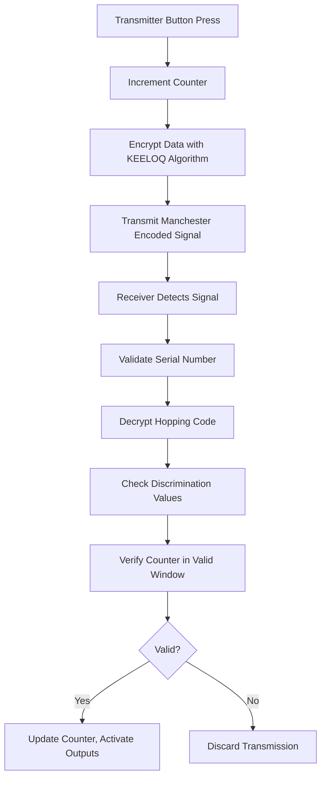
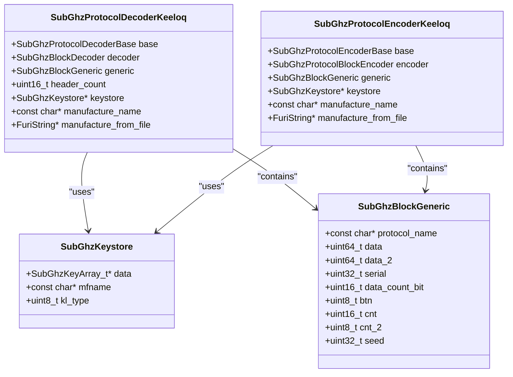
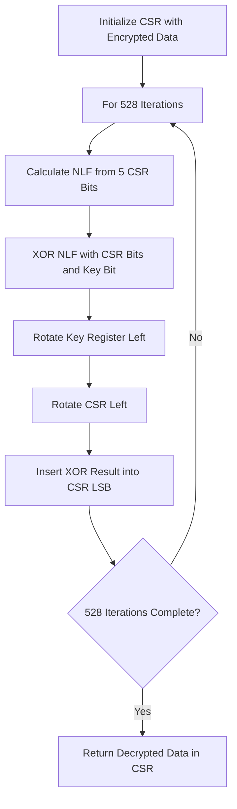
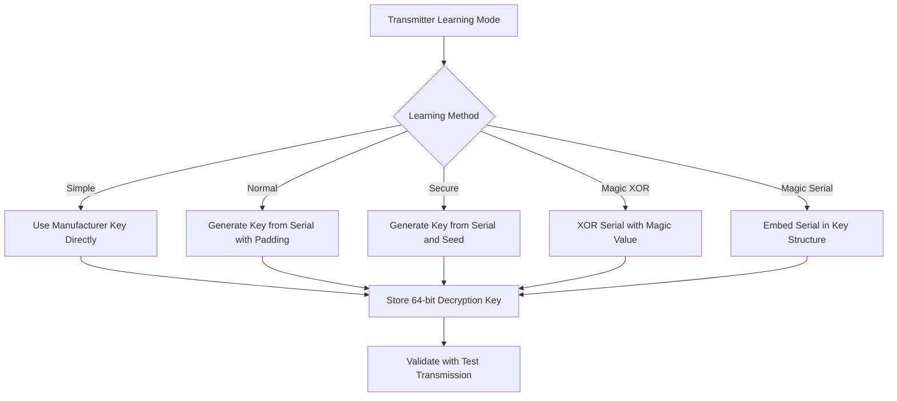
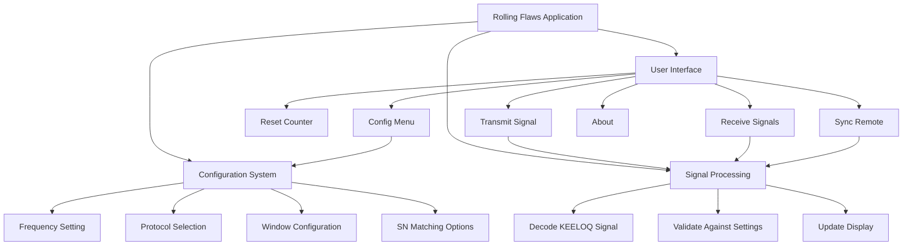

# KEELOQ Code-Hopping Decoder

<cite>
**Referenced Files in This Document**   
- [keeloq.c](file://lib\subghz\protocols\keeloq.c)
- [keeloq.h](file://lib\subghz\protocols\keeloq.h)
- [keeloq_common.c](file://lib\subghz\protocols\keeloq_common.c)
- [keeloq_common.h](file://lib\subghz\protocols\keeloq_common.h)
- [subghz_keystore.c](file://lib\subghz\subghz_keystore.c)
- [subghz_keystore.h](file://lib\subghz\subghz_keystore.h)
- [generic.h](file://lib\subghz\blocks\generic.h)
- [rolling_flaws.c](file://applications\external\rolling_flaws\rolling_flaws.c)
- [Code-Hopper-Decoder.md](file://documentation\SubGHz\Code-Hopper-Decoder.md)
- [keeloqcode.docx.txt](file://documentation\SubGHz\keeloqcode.docx.txt)
- [unlockingkeeloq.docx.txt](file://documentation\SubGHz\unlockingkeeloq.docx.txt)
</cite>

## Table of Contents
1. [Introduction](#introduction)
2. [KEELOQ Protocol Overview](#keeloq-protocol-overview)
3. [Core Components](#core-components)
4. [KEELOQ Decryption Algorithm](#keeloq-decryption-algorithm)
5. [Key Learning Methods](#key-learning-methods)
6. [Rolling Flaws Application](#rolling-flaws-application)
7. [Security Considerations](#security-considerations)
8. [Conclusion](#conclusion)

## Introduction

The KEELOQ Code-Hopping Decoder is a security system implemented in the Flipper Zero firmware that decodes rolling code transmissions from various remote control devices. This document provides a comprehensive analysis of the KEELOQ protocol implementation, focusing on the code-hopping mechanism, decryption algorithms, and key learning methods. The system is designed to work with various manufacturers' remotes that use the KEELOQ encryption standard, including HCS200, HCS201, HCS300, HCS301, HCS360, HCS361, and HCS410 encoders.

The implementation in the Flipper Zero firmware provides both decoding and encoding capabilities, allowing users to analyze, clone, and transmit signals from compatible remote controls. The system includes advanced features such as automatic baud rate detection, automatic encoder type detection, and support for multiple learning methods.

**Section sources**
- [Code-Hopper-Decoder.md](file://documentation\SubGHz\Code-Hopper-Decoder.md#L1-L254)
- [keeloqcode.docx.txt](file://documentation\SubGHz\keeloqcode.docx.txt#L1-L100)
- [unlockingkeeloq.docx.txt](file://documentation\SubGHz\unlockingkeeloq.docx.txt#L1-L50)

## KEELOQ Protocol Overview

The KEELOQ protocol is a rolling code system that uses a 64-bit encryption key to secure communications between a transmitter (remote control) and receiver. Each transmission contains a fixed portion (FIX) with the button code and serial number, and a hopping portion (HOP) containing encrypted data including the synchronization counter and discrimination values.

The protocol uses Manchester encoding with specific timing parameters:
- Short pulse duration: 400 microseconds
- Long pulse duration: 800 microseconds
- Timing delta: 140 microseconds
- Minimum bit count for detection: 64 bits

The synchronization mechanism prevents replay attacks by maintaining a counter that increments with each transmission. The receiver accepts codes within specific windows:
- **Open window**: Accepts codes with counters 1-16 higher than the stored value
- **Resynchronization window**: Allows resynchronization with two consecutive transmissions when the counter is more than 16 above the stored value but within 32,768 counts

**Diagram sources**
- [keeloq.c](file://lib\subghz\protocols\keeloq.c#L18-L23)
- [Code-Hopper-Decoder.md](file://documentation\SubGHz\Code-Hopper-Decoder.md#L62-L79)

**Section sources**
- [keeloq.c](file://lib\subghz\protocols\keeloq.c#L18-L23)
- [Code-Hopper-Decoder.md](file://documentation\SubGHz\Code-Hopper-Decoder.md#L62-L79)

## Core Components

The KEELOQ implementation in the Flipper Zero firmware consists of several core components that work together to decode and encode signals. The main components include the protocol decoder, encoder, key store, and common utility functions.

The `SubGhzProtocolDecoderKeeloq` structure contains the decoder state, including the base decoder, block decoder, generic block, header count, key store reference, manufacturer name, and a string for manufacturer data from files. Similarly, the `SubGhzProtocolEncoderKeeloq` structure contains the encoder state with similar components.

The key store system manages manufacturer keys and learning types, allowing the system to support multiple manufacturers and learning methods. The generic block structure contains protocol-specific data including the protocol name, raw data, serial number, bit count, button code, counter, and seed value.

**Diagram sources**
- [keeloq.c](file://lib\subghz\protocols\keeloq.c#L25-L48)
- [generic.h](file://lib\subghz\blocks\generic.h#L18-L28)
- [subghz_keystore.h](file://lib\subghz\subghz_keystore.h#L11-L15)

**Section sources**
- [keeloq.c](file://lib\subghz\protocols\keeloq.c#L25-L48)
- [generic.h](file://lib\subghz\blocks\generic.h#L18-L28)

## KEELOQ Decryption Algorithm

The KEELOQ decryption algorithm is a 528-round block cipher that operates on a 32-bit code shift register (CSR) using a 64-bit decryption key. The algorithm is implemented in the `subghz_protocol_keeloq_common_decrypt` function, which performs the following steps:

1. Initialize the 32-bit CSR with the encrypted data
2. For each of 528 iterations:
   - Calculate a non-linear function (NLF) using 5 bits from the CSR
   - Combine the NLF output with two CSR bits and a key bit using XOR
   - Rotate the key register left by one bit
   - Rotate the CSR left by one bit
   - Insert the XOR result into the LSB of the CSR

The non-linear function uses a lookup table (KEELOQ_NLF = 0x3A5C742E) to obscure linear relationships in the encrypted output. The five input bits for the NLF are selected from specific positions in the CSR: CSR[3,6], CSR[3,1], CSR[2,3], CSR[1,0], and CSR[0,0].

The decryption process requires the receiver to have the correct 64-bit decryption key, which is typically derived from the transmitter's serial number and a manufacturer's code using one of several key learning methods.

**Diagram sources**
- [keeloq_common.c](file://lib\subghz\protocols\keeloq_common.c#L30-L35)
- [Code-Hopper-Decoder.md](file://documentation\SubGHz\Code-Hopper-Decoder.md#L140-L147)

**Section sources**
- [keeloq_common.c](file://lib\subghz\protocols\keeloq_common.c#L30-L35)

## Key Learning Methods

The KEELOQ system supports multiple key learning methods to accommodate different manufacturer implementations. These methods determine how the 64-bit decryption key is generated from the transmitter's serial number and other parameters.

The main learning methods supported are:

| Learning Method | Description | Key Generation Process |
|----------------|-------------|------------------------|
| **Simple Learning** | Direct decryption using manufacturer key | `decrypt = decrypt(hop, key)` |
| **Normal Learning** | Two-step key generation with different padding | `key = decrypt(serial \| 0x20000000, key) \| (decrypt(serial \| 0x60000000, key) << 32)` |
| **Secure Learning** | Uses seed value transmitted during learning | `key = decrypt(serial, key) \| (decrypt(seed, key) << 32)` |
| **Magic XOR Type 1** | XORs serial number with magic value | `key = (serial << 32 \| serial) ^ xor_value` |
| **Magic Serial Type 1** | Embeds serial in manufacturer key | `key = (man & 0xFFFFFFFF) \| (serial << 40) \| (((serial & 0xff) + ((serial >> 8) & 0xFF)) & 0xFF) << 32)` |

The system also supports several specialized learning methods for specific manufacturers, including BFT, Aprimatic, and Dea_Mio, each with their own unique key generation algorithms.

**Diagram sources**
- [keeloq_common.c](file://lib\subghz\protocols\keeloq_common.c#L43-L142)
- [keeloq.c](file://lib\subghz\protocols\keeloq.c#L349-L404)

**Section sources**
- [keeloq_common.c](file://lib\subghz\protocols\keeloq_common.c#L43-L142)

## Rolling Flaws Application

The Rolling Flaws application is a testing tool that simulates various KEELOQ receiver behaviors to demonstrate potential security flaws in rolling code systems. The application allows users to configure receiver parameters and test various attack scenarios, including replay attacks, future attacks, rollback attacks, and manufacturer key attacks.

Key features of the Rolling Flaws application include:
- Configurable frequency (typically 433.92 MHz)
- Selectable protocols (KL (DH), KL (All), KL (Custom))
- Adjustable window sizes for next, future, and gap codes
- Support for SN00 and SN bits matching
- Count 0 opens functionality

The application provides a user interface with options to configure settings, reset the counter, transmit signals, receive signals, sync with a remote, and view application information. It uses the underlying KEELOQ protocol implementation to decode incoming signals and determine if they should be accepted based on the configured parameters.

**Diagram sources**
- [rolling_flaws.c](file://applications\external\rolling_flaws\rolling_flaws.c#L42-L57)
- [README.md](file://applications\external\rolling_flaws\README.md#L167-L185)

**Section sources**
- [rolling_flaws.c](file://applications\external\rolling_flaws\rolling_flaws.c#L42-L57)

## Security Considerations

The KEELOQ protocol, while providing protection against simple replay attacks, has several potential security vulnerabilities that have been identified and exploited:

1. **Replay Attacks**: If the receiver does not properly validate that the counter has incremented, an attacker can replay a captured signal to gain access.

2. **Future Attacks**: By capturing two consecutive signals far in the future, an attacker can resynchronize the receiver to a future counter value, potentially bypassing intermediate codes.

3. **Rollback Attacks**: Some receivers accept past codes as part of a large future window, allowing attackers to replay old signals.

4. **Manufacturer Key Attacks**: Universal receivers that try multiple manufacturer keys may be vulnerable to attacks using different manufacturer keys with matching FIX portions.

5. **Overflow Bit Issues**: When the 16-bit counter overflows, some implementations clear overflow bits, which can cause validation failures if not properly handled.

The Flipper Zero implementation includes countermeasures for some of these issues, such as the use of multiple window sizes and proper counter validation. However, the security of the overall system depends on the specific receiver implementation and its configuration parameters.

**Section sources**
- [Code-Hopper-Decoder.md](file://documentation\SubGHz\Code-Hopper-Decoder.md#L38-L45)
- [README.md](file://applications\external\rolling_flaws\README.md#L222-L788)

## Conclusion

The KEELOQ Code-Hopping Decoder implementation in the Flipper Zero firmware provides a comprehensive system for working with rolling code security devices. The system supports multiple learning methods, manufacturer keys, and protocol variations, making it compatible with a wide range of remote control devices.

The core of the system is the 528-round KEELOQ decryption algorithm, which provides strong encryption when properly implemented. However, the security of the overall system depends on proper implementation of the receiver logic, including counter validation and window management.

The inclusion of the Rolling Flaws application demonstrates the importance of proper security configuration and highlights potential vulnerabilities in rolling code systems. This educational tool allows users to understand and test various attack scenarios in a controlled environment.

For developers and security researchers, the KEELOQ implementation provides a well-documented example of a rolling code system with multiple learning methods and security features. The modular design allows for easy extension to support additional manufacturers and protocols.

**Section sources**
- [keeloq.c](file://lib\subghz\protocols\keeloq.c#L1-L1482)
- [Code-Hopper-Decoder.md](file://documentation\SubGHz\Code-Hopper-Decoder.md#L1-L254)
- [README.md](file://applications\external\rolling_flaws\README.md#L1-L957)