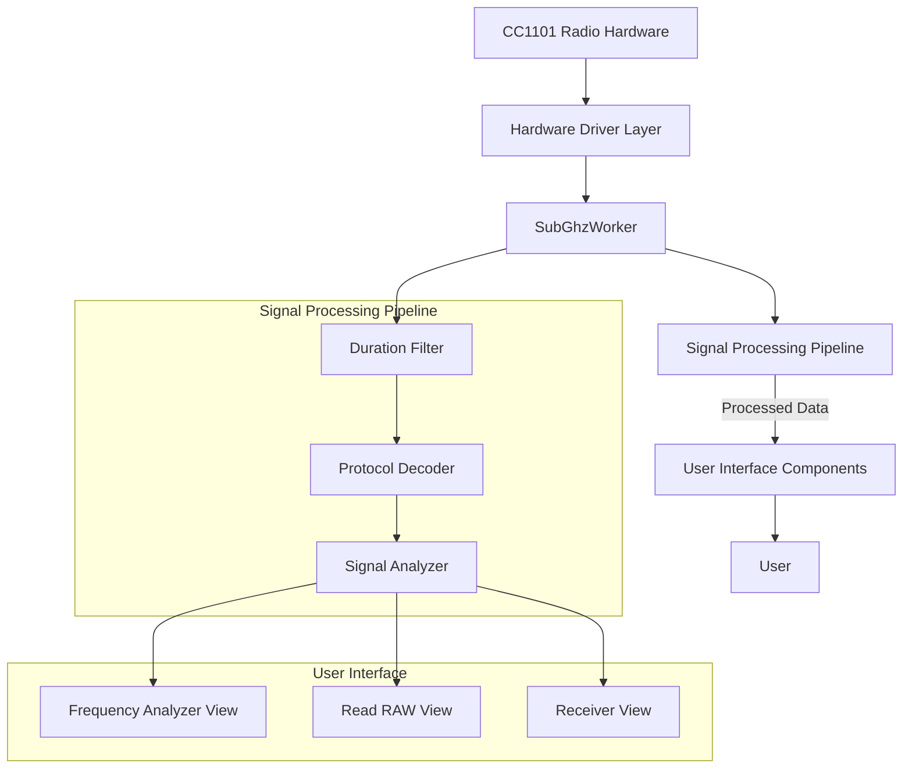
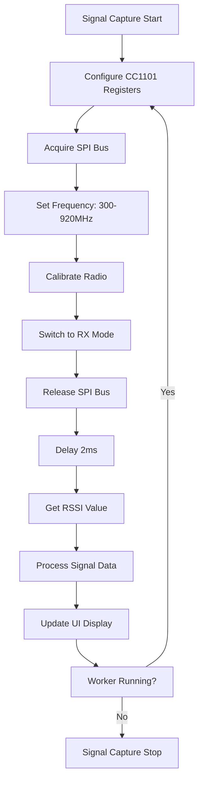
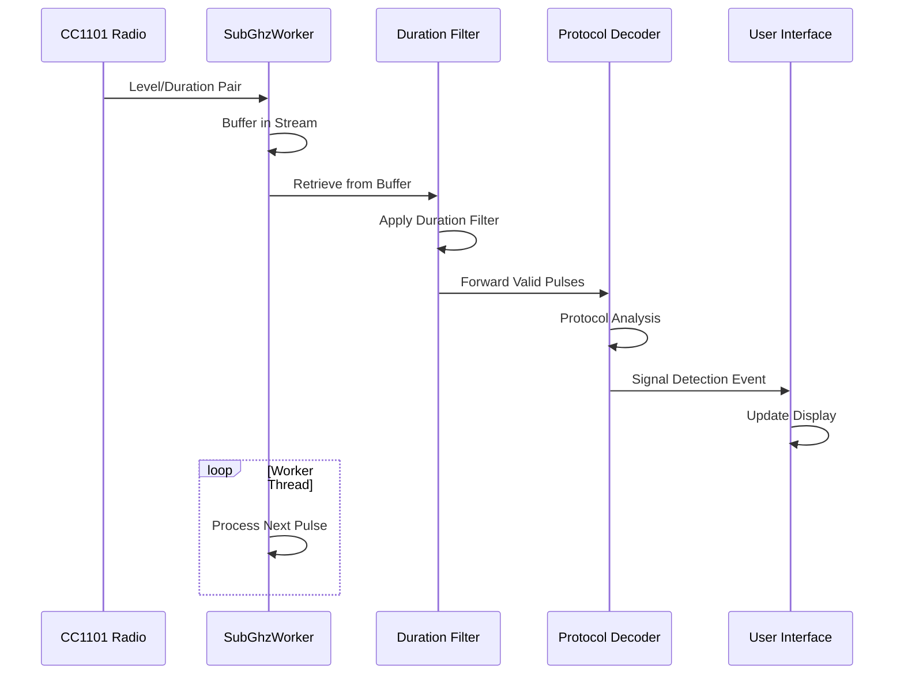
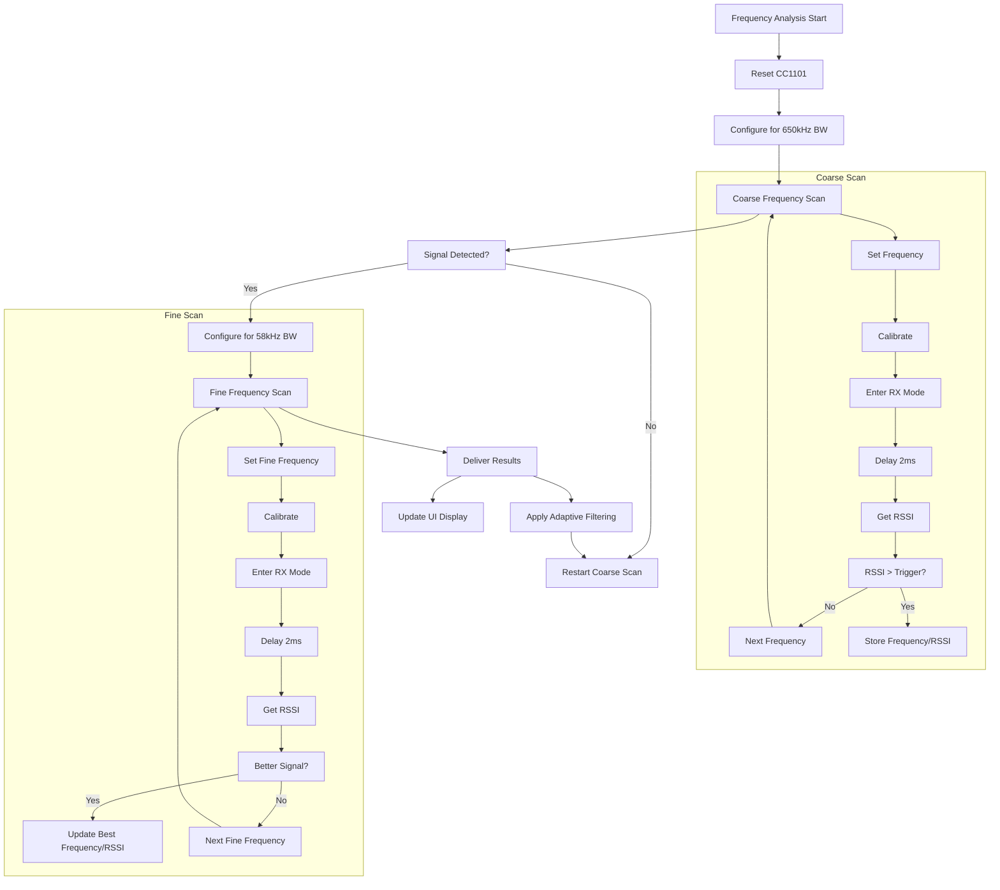
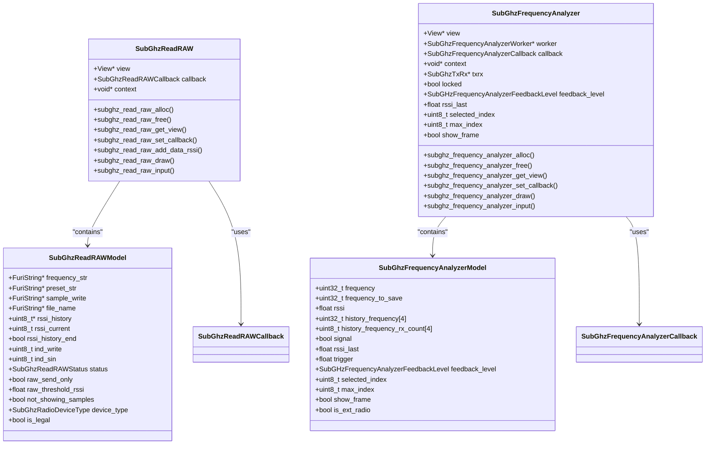
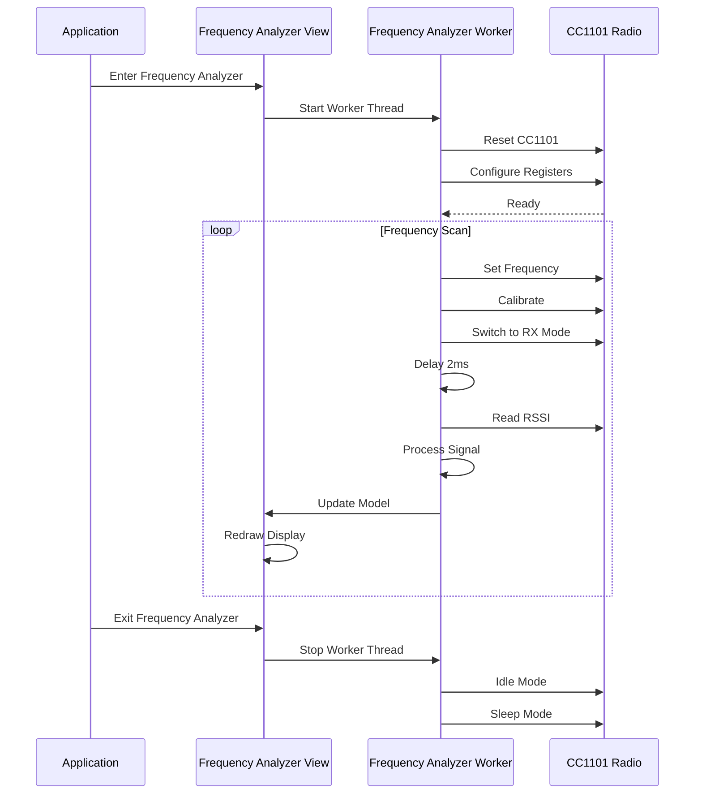
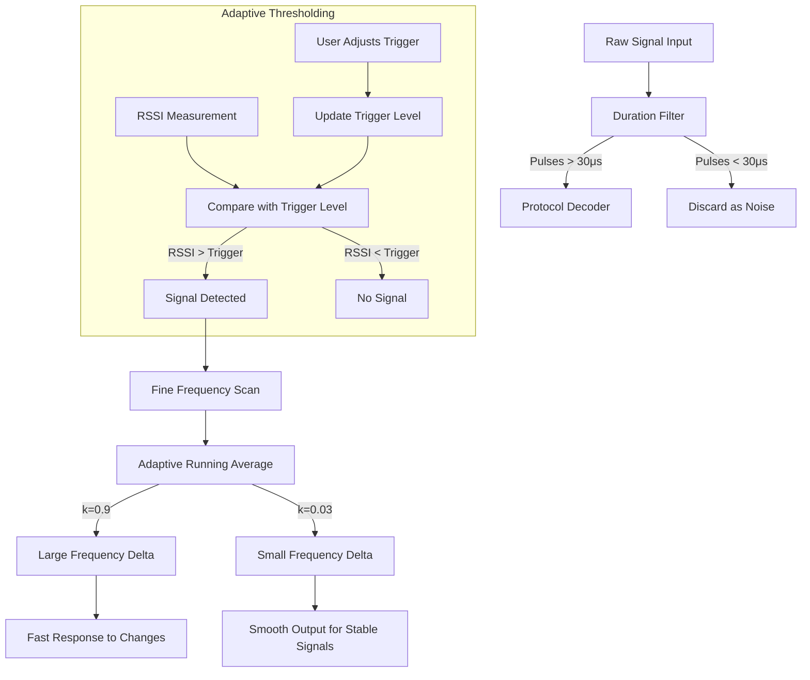
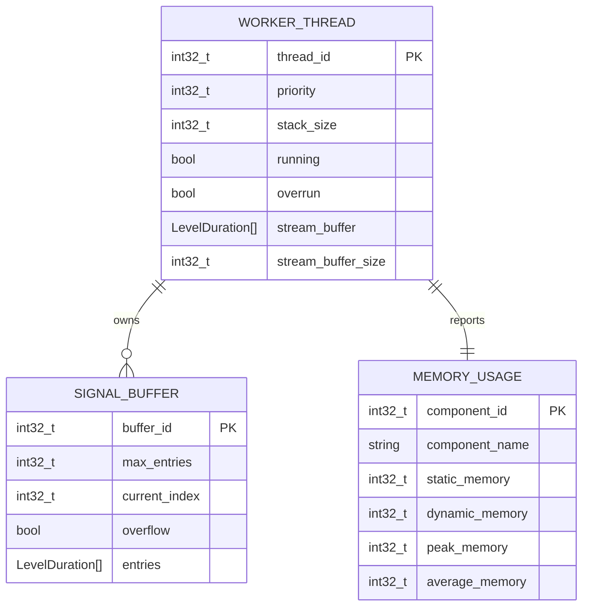

# Signal Analysis Tools

<cite>
**Referenced Files in This Document**   
- [subghz_frequency_analyzer.c](file://applications/main/subghz/views/subghz_frequency_analyzer.c)
- [subghz_frequency_analyzer.h](file://applications/main/subghz/views/subghz_frequency_analyzer.h)
- [subghz_frequency_analyzer_worker.c](file://applications/main/subghz/helpers/subghz_frequency_analyzer_worker.c)
- [subghz_read_raw.c](file://applications/main/subghz/views/subghz_read_raw.c)
- [subghz_read_raw.h](file://applications/main/subghz/views/subghz_read_raw.h)
- [subghz_worker.c](file://lib/subghz/subghz_worker.c)
- [subghz_worker.h](file://lib/subghz/subghz_worker.h)
- [subghz.c](file://applications/main/subghz/subghz.c)
- [receiver.c](file://lib/subghz/receiver.c)
</cite>

## Table of Contents
1. [Introduction](#introduction)
2. [Signal Analysis Architecture](#signal-analysis-architecture)
3. [Real-Time Signal Visualization](#real-time-signal-visualization)
4. [Pulse Width Measurement and Processing](#pulse-width-measurement-and-processing)
5. [Frequency Analysis and Spectrum Scanning](#frequency-analysis-and-spectrum-scanning)
6. [Signal Debugger Implementation](#signal-debugger-implementation)
7. [Hardware Integration and Signal Capture](#hardware-integration-and-signal-capture)
8. [Noise Filtering and Signal Distortion Solutions](#noise-filtering-and-signal-distortion-solutions)
9. [Performance Considerations](#performance-considerations)
10. [Conclusion](#conclusion)

## Introduction
The Sub-GHz signal analysis tools in the Flipper Zero firmware provide comprehensive capabilities for capturing, analyzing, and visualizing radio frequency signals in the sub-gigahertz spectrum. These tools enable users to explore wireless signals through real-time visualization, precise pulse width measurement, and detailed frequency analysis. The system integrates hardware sampling with sophisticated signal processing algorithms and intuitive UI rendering to create a powerful debugging and analysis platform for RF signals. This document details the implementation of these features, focusing on the integration between hardware, signal processing, and user interface components.

## Signal Analysis Architecture
The Sub-GHz signal analysis system follows a layered architecture that separates hardware abstraction, signal processing, and user interface concerns. The core components work together to capture raw signal data, process it through various analysis stages, and present the results to the user in an intuitive format.

**Diagram sources** 
- [subghz_worker.c](file://lib/subghz/subghz_worker.c#L7-150)
- [receiver.c](file://lib/subghz/receiver.c#L7-135)
- [subghz_frequency_analyzer.c](file://applications/main/subghz/views/subghz_frequency_analyzer.c#L27-568)

**Section sources**
- [subghz.c](file://applications/main/subghz/subghz.c#L99-441)
- [subghz_i.h](file://applications/main/subghz/subghz_i.h#L48-138)

## Real-Time Signal Visualization
The Sub-GHz system provides real-time visualization of captured signals through multiple dedicated views that render signal characteristics in both time and frequency domains. The primary visualization components are the Frequency Analyzer and Read RAW views, which offer complementary perspectives on signal behavior.

The Frequency Analyzer view displays signal strength (RSSI) as a vertical bar graph alongside the detected frequency, providing immediate feedback on active signals in the environment. The visualization updates continuously as the frequency scanner sweeps through the spectrum, with color-coded indicators showing signal presence and strength.

**Diagram sources** 
- [subghz_frequency_analyzer_worker.c](file://applications/main/subghz/helpers/subghz_frequency_analyzer_worker.c#L69-266)
- [subghz_frequency_analyzer.c](file://applications/main/subghz/views/subghz_frequency_analyzer.c#L518-568)

**Section sources**
- [subghz_frequency_analyzer.c](file://applications/main/subghz/views/subghz_frequency_analyzer.c#L1-568)
- [subghz_frequency_analyzer.h](file://applications/main/subghz/views/subghz_frequency_analyzer.h#L1-35)

## Pulse Width Measurement and Processing
Pulse width measurement is a fundamental capability of the Sub-GHz signal analysis tools, enabling the system to decode various modulation schemes and protocol formats. The implementation uses a dedicated worker thread that processes raw signal data and extracts pulse duration information.

The pulse processing pipeline begins with hardware-level signal capture through the CC1101 radio chip, which provides level and duration information for each signal transition. This raw data is passed through a filtering stage that removes very short pulses (configurable down to 30μs) to eliminate noise and glitches. The filtered pulse data is then made available to protocol decoders and visualization components.

**Diagram sources** 
- [subghz_worker.c](file://lib/subghz/subghz_worker.c#L28-80)
- [receiver.c](file://lib/subghz/receiver.c#L61-72)

**Section sources**
- [subghz_worker.c](file://lib/subghz/subghz_worker.c#L1-150)
- [subghz_worker.h](file://lib/subghz/subghz_worker.h#L1-81)

## Frequency Analysis and Spectrum Scanning
The frequency analysis system implements a two-stage scanning approach that combines coarse and fine frequency sweeps to efficiently detect and analyze signals across the sub-GHz spectrum. This approach balances speed and precision, allowing the system to quickly identify active frequencies and then perform detailed analysis on promising candidates.

The coarse scan operates with a wide receiver bandwidth (650kHz) to rapidly sweep through all configured frequencies in the 300-920MHz range. When a signal above the threshold RSSI level is detected, the system performs a fine scan using a narrower bandwidth (58kHz) centered on the detected frequency. This fine scan provides higher resolution analysis and more accurate frequency determination.

**Diagram sources** 
- [subghz_frequency_analyzer_worker.c](file://applications/main/subghz/helpers/subghz_frequency_analyzer_worker.c#L105-258)
- [subghz_frequency_analyzer.c](file://applications/main/subghz/views/subghz_frequency_analyzer.c#L444-488)

**Section sources**
- [subghz_frequency_analyzer_worker.c](file://applications/main/subghz/helpers/subghz_frequency_analyzer_worker.c#L1-360)
- [subghz_frequency_analyzer_worker.h](file://applications/main/subghz/helpers/subghz_frequency_analyzer_worker.h#L1-46)

## Signal Debugger Implementation
The signal debugger implementation provides comprehensive tools for analyzing signals in both time and frequency domains. The system includes specialized views for different analysis tasks, each optimized for specific types of signal investigation.

The Read RAW view offers time-domain analysis with a scrolling display of RSSI values, showing signal strength over time. This view includes a threshold indicator that helps users identify valid signal transitions versus noise. The visualization uses a circular buffer to maintain a continuous history of signal strength, with special rendering for the current signal position.

**Diagram sources** 
- [subghz_read_raw.c](file://applications/main/subghz/views/subghz_read_raw.c#L14-673)
- [subghz_read_raw.h](file://applications/main/subghz/views/subghz_read_raw.h#L1-51)
- [subghz_frequency_analyzer.c](file://applications/main/subghz/views/subghz_frequency_analyzer.c#L27-568)
- [subghz_frequency_analyzer.h](file://applications/main/subghz/views/subghz_frequency_analyzer.h#L1-35)

**Section sources**
- [subghz_read_raw.c](file://applications/main/subghz/views/subghz_read_raw.c#L1-673)
- [subghz_read_raw.h](file://applications/main/subghz/views/subghz_read_raw.h#L1-51)

## Hardware Integration and Signal Capture
The signal capture system integrates tightly with the CC1101 radio hardware to provide reliable and accurate signal data. The implementation uses direct SPI communication with the radio chip to configure its operating parameters and retrieve signal information.

Hardware initialization begins with resetting the CC1101 chip and configuring critical registers for optimal signal reception. Key configuration parameters include the data rate (symbol rate), AGC (Automatic Gain Control) settings, and filter bandwidth. The system uses different preset configurations for coarse and fine frequency scanning, optimizing the receiver characteristics for each task.

The signal capture process follows a precise timing sequence to ensure reliable measurements. After setting a frequency, the system calibrates the radio, switches to receive mode, waits for a brief stabilization period (2ms), and then reads the RSSI value. This sequence is repeated for each frequency in the scan range, with careful attention to SPI bus management and timing constraints.

**Diagram sources** 
- [subghz_frequency_analyzer_worker.c](file://applications/main/subghz/helpers/subghz_frequency_analyzer_worker.c#L79-102)
- [subghz_frequency_analyzer.c](file://applications/main/subghz/views/subghz_frequency_analyzer.c#L444-488)

**Section sources**
- [subghz_frequency_analyzer_worker.c](file://applications/main/subghz/helpers/subghz_frequency_analyzer_worker.c#L1-360)
- [subghz_worker.c](file://lib/subghz/subghz_worker.c#L1-150)

## Noise Filtering and Signal Distortion Solutions
The Sub-GHz signal analysis tools implement several techniques to address noise filtering and signal distortion challenges. These solutions operate at multiple levels of the signal processing pipeline, from hardware configuration to algorithmic processing.

The primary noise filtering mechanism is the duration filter implemented in the SubGhzWorker component. This filter eliminates very short pulses (configurable down to 30μs) that are typically caused by electrical noise or interference. The filter works by accumulating short durations of the same signal level, effectively "gluing" them together into a single longer pulse, while ignoring isolated short pulses that don't meet the minimum duration threshold.

For frequency analysis, the system employs adaptive thresholding through the trigger level mechanism. Users can adjust the RSSI threshold that determines when a signal is considered valid, allowing them to filter out weak signals and noise while capturing stronger, more relevant transmissions. The Frequency Analyzer view provides visual feedback on the current trigger level, helping users optimize this setting for their specific environment.

**Diagram sources** 
- [subghz_worker.c](file://lib/subghz/subghz_worker.c#L61-74)
- [subghz_frequency_analyzer_worker.c](file://applications/main/subghz/helpers/subghz_frequency_analyzer_worker.c#L48-62)
- [subghz_frequency_analyzer.c](file://applications/main/subghz/views/subghz_frequency_analyzer.c#L228-240)

**Section sources**
- [subghz_worker.c](file://lib/subghz/subghz_worker.c#L1-150)
- [subghz_frequency_analyzer_worker.c](file://applications/main/subghz/helpers/subghz_frequency_analyzer_worker.c#L1-360)

## Performance Considerations
The Sub-GHz signal analysis tools are designed with careful attention to performance constraints, particularly regarding real-time processing requirements and memory usage during extended capture sessions.

The system employs a multi-threaded architecture to separate time-critical signal processing from user interface updates. The SubGhzWorker runs in a dedicated thread with high priority, ensuring that signal data is processed promptly without missing transitions. This worker uses a fixed-size stream buffer (4096 LevelDuration entries) to handle incoming signal data, providing a balance between memory usage and protection against data loss during processing delays.

For extended signal capture sessions, the system implements efficient memory management through circular buffers and streaming processing. The Read RAW view uses a fixed-size history buffer (100 samples) that automatically overwrites old data when full, preventing unbounded memory growth during continuous recording. Similarly, the frequency analyzer maintains a limited history of detected frequencies (4 entries) to minimize memory footprint while still providing useful context.

**Diagram sources** 
- [subghz_worker.c](file://lib/subghz/subghz_worker.c#L88-89)
- [subghz_read_raw.c](file://applications/main/subghz/views/subghz_read_raw.c#L11-11)
- [subghz_frequency_analyzer.c](file://applications/main/subghz/views/subghz_frequency_analyzer.c#L18-18)

**Section sources**
- [subghz_worker.c](file://lib/subghz/subghz_worker.c#L1-150)
- [subghz_read_raw.c](file://applications/main/subghz/views/subghz_read_raw.c#L1-673)

## Conclusion
The Sub-GHz signal analysis tools in the Flipper Zero firmware provide a comprehensive suite of capabilities for capturing, analyzing, and visualizing radio frequency signals. The system integrates hardware sampling through the CC1101 radio chip with sophisticated signal processing algorithms and intuitive user interface components to create a powerful debugging platform.

Key features include real-time signal visualization through both time-domain and frequency-domain displays, precise pulse width measurement with configurable filtering, and efficient frequency scanning with adaptive thresholding. The architecture separates concerns between hardware abstraction, signal processing, and user interface layers, enabling maintainable and extensible code.

The implementation addresses common challenges such as noise filtering and signal distortion through techniques like duration filtering, adaptive thresholding, and optimized hardware configuration. Performance considerations are carefully balanced, with dedicated worker threads for time-critical processing and efficient memory management for extended capture sessions.

These tools enable users to explore and understand wireless signals in their environment, making the Flipper Zero a valuable instrument for RF analysis, security research, and educational purposes.