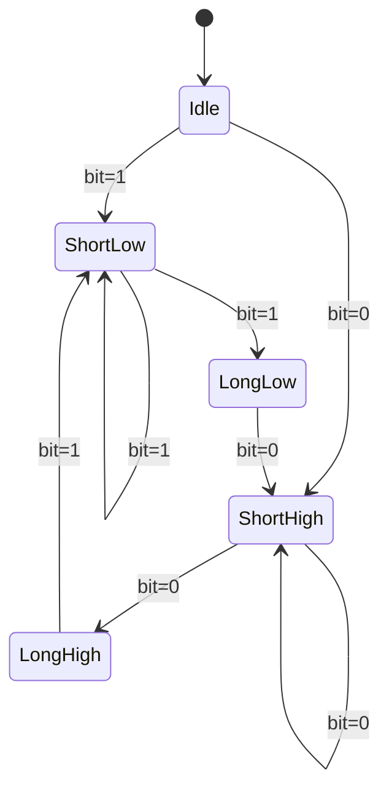
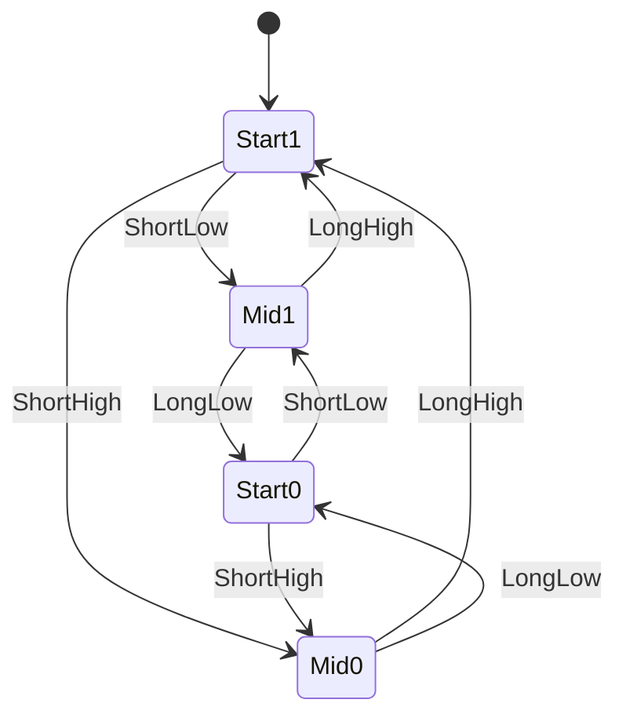
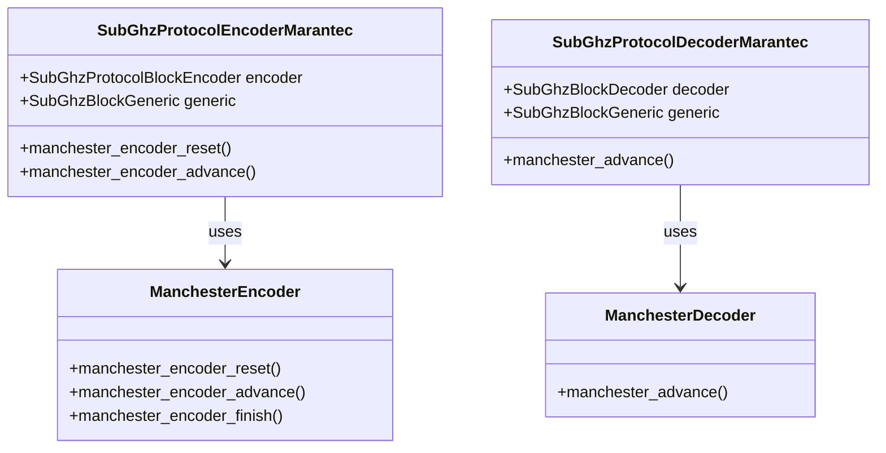

# Manchester Encoding

<cite>
**Referenced Files in This Document**   
- [manchester_encoder.h](file://lib/toolbox/manchester_encoder.h)
- [manchester_encoder.c](file://lib/toolbox/manchester_encoder.c)
- [manchester_decoder.h](file://lib/toolbox/manchester_decoder.h)
- [manchester_decoder.c](file://lib/toolbox/manchester_decoder.c)
- [marantec.c](file://lib/subghz/protocols/marantec.c)
- [marantec.h](file://lib/subghz/protocols/marantec.h)
- [documentation/SubGHz/Manchester.docx.md](file://documentation/SubGHz/Manchester.docx.md)
</cite>

## Table of Contents
1. [Introduction](#introduction)
2. [Core Components](#core-components)
3. [Encoder Implementation](#encoder-implementation)
4. [Decoder Implementation](#decoder-implementation)
5. [Protocol Integration](#protocol-integration)
6. [Manchester Encoding Principles](#manchester-encoding-principles)
7. [Conclusion](#conclusion)

## Introduction
Manchester encoding is a physical layer data encoding scheme used in various wireless communication protocols. This document provides a comprehensive analysis of the Manchester encoding implementation in the Flipper Zero firmware, focusing on its encoder and decoder components, integration with Sub-GHz protocols, and underlying principles. The implementation is designed to provide self-synchronizing data transmission that allows receivers to accurately determine bit boundaries through voltage transitions.

## Core Components

The Manchester encoding functionality in the Flipper Zero firmware consists of two primary components: an encoder and a decoder. These components are implemented as separate modules with distinct state machines and processing logic. The encoder converts digital data bits into Manchester-encoded waveforms, while the decoder performs the reverse process, extracting data bits from received Manchester-encoded signals. Both components are designed to be protocol-agnostic, allowing integration with various wireless communication standards that utilize Manchester encoding.

**Section sources**
- [manchester_encoder.h](file://lib/toolbox/manchester_encoder.h#L1-L33)
- [manchester_decoder.h](file://lib/toolbox/manchester_decoder.h#L1-L32)

## Encoder Implementation

### Encoder State Machine
The Manchester encoder operates as a finite state machine that processes input bits and generates corresponding Manchester-encoded output. The encoder state is defined by the ManchesterEncoderState structure, which contains two fields: prev_bit (the previous bit processed) and step (the current state of the encoding process).

**Diagram sources**
- [manchester_encoder.c](file://lib/toolbox/manchester_encoder.c#L16-L50)
- [manchester_encoder.h](file://lib/toolbox/manchester_encoder.h#L9-L12)

### Encoding Process
The encoding process is implemented in the manchester_encoder_advance function, which takes the current state, the input bit, and produces a ManchesterEncoderResult. The encoding follows a three-step process:

1. **Initial Transition**: When processing a new bit, the encoder generates a short transition (low for logic 1, high for logic 0)
2. **Mid-bit Decision**: The encoder determines the second half of the bit period based on the relationship between the current and previous bits
3. **Final State**: The encoder updates its state for the next bit processing cycle

The encoder produces four possible output states:
- ShortLow: Short pulse at logic low
- LongLow: Long pulse at logic low  
- LongHigh: Long pulse at logic high
- ShortHigh: Short pulse at logic high

These output states correspond to the duration and level of the signal that will be transmitted.

**Section sources**
- [manchester_encoder.c](file://lib/toolbox/manchester_encoder.c#L9-L52)
- [manchester_encoder.h](file://lib/toolbox/manchester_encoder.h#L14-L19)

## Decoder Implementation

### Decoder State Machine
The Manchester decoder operates as a state machine that processes incoming signal events and extracts the original data bits. The decoder state is represented by the ManchesterState enum with four possible states:
- ManchesterStateStart1: Starting state for logic 1
- ManchesterStateMid1: Mid-bit state for logic 1
- ManchesterStateMid0: Mid-bit state for logic 0
- ManchesterStateStart0: Starting state for logic 0

**Diagram sources**
- [manchester_decoder.c](file://lib/toolbox/manchester_decoder.c#L7-L34)
- [manchester_decoder.h](file://lib/toolbox/manchester_decoder.h#L16-L21)

### Decoding Process
The decoding process is implemented in the manchester_advance function, which takes the current state, an event (representing a signal transition), and produces the next state and extracted data bit. The decoder uses a lookup table (transitions array) to determine state transitions based on input events.

The decoding process works as follows:
1. **Event Processing**: The decoder receives events representing signal transitions (short/long, low/high)
2. **State Transition**: Using the current state and input event, the decoder determines the next state
3. **Data Extraction**: When transitioning through Mid0 or Mid1 states, the decoder extracts a data bit (0 or 1 respectively)
4. **Reset Handling**: If the decoder detects an invalid state transition, it resets to a known state

The decoder is designed to be robust against noise and timing variations, with built-in reset mechanisms to recover from synchronization errors.

**Section sources**
- [manchester_decoder.c](file://lib/toolbox/manchester_decoder.c#L7-L34)
- [manchester_decoder.h](file://lib/toolbox/manchester_decoder.h#L8-L27)

## Protocol Integration

### Marantec Protocol Implementation
The Manchester encoding components are integrated into the Marantec Sub-GHz protocol implementation. The Marantec protocol uses Manchester encoding for wireless communication with garage door openers and other access control systems.

**Diagram sources**
- [marantec.c](file://lib/subghz/protocols/marantec.c#L1-L148)
- [marantec.h](file://lib/subghz/protocols/marantec.h#L1-L118)

### Integration Details
The Marantec protocol implementation uses the Manchester encoder and decoder components as follows:

1. **Encoding Process**:
   - The encoder initializes the Manchester encoder state using manchester_encoder_reset
   - For each data bit, it calls manchester_encoder_advance to generate the encoded output
   - The encoded results are converted to signal durations using protocol-specific timing constants
   - The final encoded signal is transmitted via the Sub-GHz radio

2. **Decoding Process**:
   - The decoder receives raw signal data (level and duration)
   - It converts signal durations to Manchester events (short/long, low/high)
   - The manchester_advance function processes these events to extract data bits
   - Extracted bits are assembled into the complete data packet

The integration demonstrates how the generic Manchester encoding components can be adapted to specific protocol requirements through timing configuration and data formatting.

**Section sources**
- [marantec.c](file://lib/subghz/protocols/marantec.c#L96-L148)
- [marantec.h](file://lib/subghz/protocols/marantec.h#L1-L118)

## Manchester Encoding Principles

### Encoding Logic
Manchester encoding is a self-synchronizing physical layer encoding scheme that represents data bits through voltage transitions in the middle of each bit period. The encoding follows these rules:
- **Logic 0**: Positive transition (low to high)
- **Logic 1**: Negative transition (high to low)

This encoding ensures that every bit period contains a transition, allowing the receiver to synchronize with the transmitter by detecting these transitions. The self-synchronizing nature eliminates the need for a separate clock signal and prevents ambiguity between data and no-signal states.

### Advantages
Manchester encoding provides several advantages for wireless communication:
- **Self-synchronization**: Receivers can synchronize with transmitters using the mid-bit transitions
- **DC balance**: The equal number of high and low periods maintains DC balance in the signal
- **Error detection**: Missing transitions indicate transmission errors
- **Density**: Provides the densest coding per unit frequency

### Timing Parameters
The implementation uses configurable timing parameters for different protocols:
- **te_short**: Duration of short pulses
- **te_long**: Duration of long pulses  
- **te_delta**: Tolerance for timing variations
- **min_count_bit_for_found**: Minimum bits required to identify a valid signal

These parameters allow the same encoding/decoding engine to support multiple protocols with different timing requirements.

**Section sources**
- [documentation/SubGHz/Manchester.docx.md](file://documentation/SubGHz/Manchester.docx.md#L1-L73)
- [marantec.c](file://lib/subghz/protocols/marantec.c#L12-L17)

## Conclusion
The Manchester encoding implementation in the Flipper Zero firmware provides a robust and flexible solution for wireless communication protocols. The encoder and decoder components are designed as modular, reusable modules that can be integrated into various protocols. The implementation follows established principles of Manchester encoding while providing the flexibility needed for different timing requirements. The integration with the Marantec protocol demonstrates how these components can be adapted to specific use cases, making them valuable tools for reverse engineering and analyzing wireless communication systems.