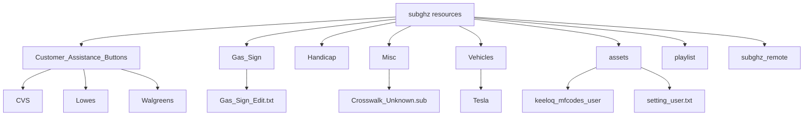
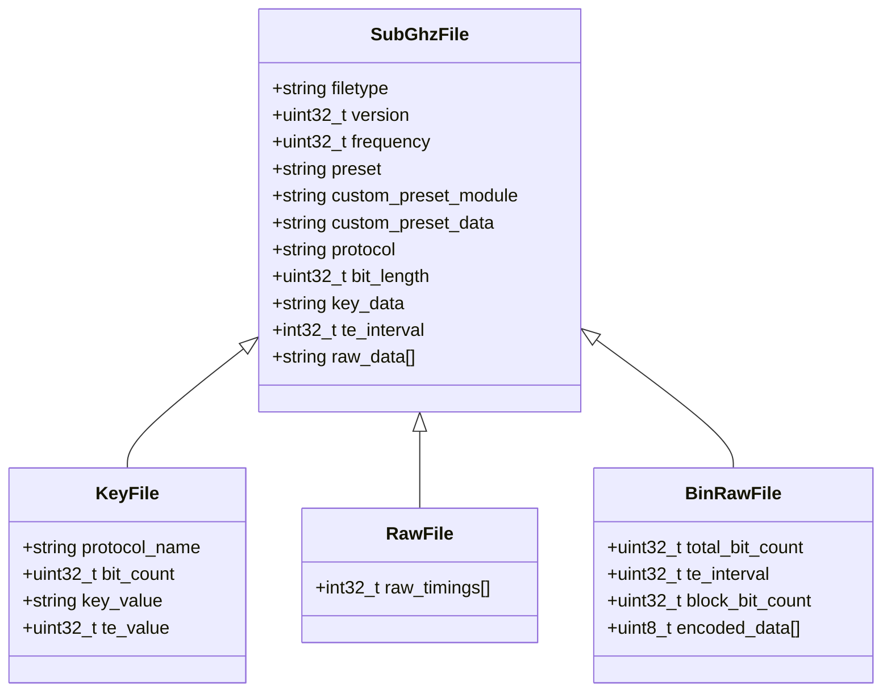
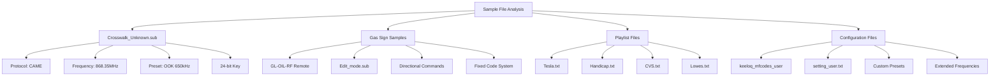
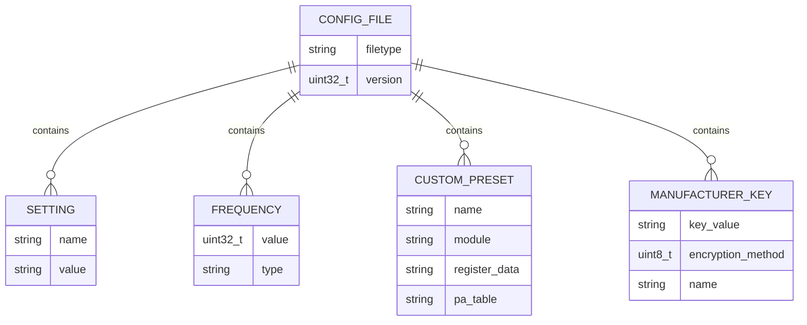

# Sub-GHz Sample Files Repository

<cite>
**Referenced Files in This Document**   
- [subghz.c](file://applications/main/subghz/subghz.c)
- [subghz.h](file://applications/main/subghz/subghz.h)
- [subghz_worker.c](file://lib/subghz/subghz_worker.c)
- [subghz_worker.h](file://lib/subghz/subghz_worker.h)
- [furi_hal_subghz.c](file://targets/f7/furi_hal/furi_hal_subghz.c)
- [furi_hal_subghz.h](file://targets/f7/furi_hal/furi_hal_subghz.h)
- [cc1101.c](file://lib/drivers/cc1101.c)
- [cc1101.h](file://lib/drivers/cc1101.h)
- [cc1101_regs.h](file://lib/drivers/cc1101_regs.h)
- [cc1101_ext.c](file://applications/drivers/subghz/cc1101_ext/cc1101_ext.c)
- [cc1101_ext.h](file://applications/drivers/subghz/cc1101_ext/cc1101_ext.h)
- [cc1101_configs.c](file://lib/subghz/devices/cc1101_configs.c)
- [cc1101_configs.h](file://lib/subghz/devices/cc1101_configs.h)
- [subghz_test_app.c](file://applications/debug/subghz_test/subghz_test_app.c)
- [SubGhzFileFormats.md](file://documentation/file_formats/SubGhzFileFormats.md)
- [Sub-GHz Technology.md](file://documentation/SubGHz/Sub-GHz Technology.md)
- [Crosswalk_Unknown.sub](file://applications/main/subghz/resources/subghz/Misc/Crosswalk_Unknown.sub)
- [Gas_Sign/ReadMe.md](file://applications/main/subghz/resources/subghz/Gas_Sign/ReadMe.md)
- [subghz_remote](file://applications/main/subghz/resources/subghz/subghz_remote)
- [playlist](file://applications/main/subghz/resources/subghz/playlist)
- [assets](file://applications/main/subghz/resources/subghz/assets)
</cite>

## Table of Contents
1. [Introduction](#introduction)
2. [Sub-GHz File Structure and Organization](#sub-ghz-file-structure-and-organization)
3. [Sub-GHz File Formats](#sub-ghz-file-formats)
4. [Sample File Analysis](#sample-file-analysis)
5. [Configuration and Customization Files](#configuration-and-customization-files)
6. [Protocol Support and Implementation](#protocol-support-and-implementation)
7. [Signal Analysis and Testing Tools](#signal-analysis-and-testing-tools)
8. [Best Practices and Usage Guidelines](#best-practices-and-usage-guidelines)
9. [Conclusion](#conclusion)

## Introduction
The Sub-GHz sample files repository within the Flipper Zero firmware provides a comprehensive collection of wireless signal samples and configuration files for sub-gigahertz communication protocols. This documentation analyzes the structure, formats, and usage of these sample files, which are essential for understanding and working with various wireless protocols used in remote controls, garage door openers, and other IoT devices. The repository contains both pre-recorded signal files and configuration files that enable the Flipper Zero device to transmit, receive, and analyze sub-GHz signals across different frequency bands and modulation schemes.

**Section sources**
- [Sub-GHz Technology.md](file://documentation/SubGHz/Sub-GHz Technology.md#L1-L50)
- [SubGhzFileFormats.md](file://documentation/file_formats/SubGhzFileFormats.md#L1-L30)

## Sub-GHz File Structure and Organization
The Sub-GHz sample files are organized within the Flipper Zero firmware in a structured directory hierarchy that facilitates easy access and categorization of different signal types. The primary location for these files is in the `applications/main/subghz/resources/subghz` directory, which contains several subdirectories for different categories of signals.

The directory structure includes:
- **Customer_Assistance_Buttons**: Contains samples for retail store assistance buttons from CVS, Lowes, and Walgreens
- **Gas_Sign**: Includes files for gas station price sign remotes, including specific commands for navigation and editing
- **Handicap**: Contains samples for handicap door opener buttons with different frequency variants
- **Misc**: Houses miscellaneous samples including a Crosswalk signal and various sextoy protocols
- **Vehicles**: Contains vehicle-related signals, including Tesla-specific remotes
- **assets**: Stores configuration files for custom presets and manufacturer codes
- **playlist**: Contains playlist files for organizing multiple signals
- **subghz_remote**: Includes remote configuration files for various applications

This organization allows users to easily locate and use specific signal types based on their application, with clear categorization that reflects real-world use cases. The structure also supports extensibility, allowing new signal types to be added in appropriate categories.

**Diagram sources**
- [subghz.c](file://applications/main/subghz/subghz.c#L25-L100)
- [subghz.h](file://applications/main/subghz/subghz.h#L15-L40)

**Section sources**
- [subghz.c](file://applications/main/subghz/subghz.c#L1-L150)
- [subghz.h](file://applications/main/subghz/subghz.h#L1-L80)

## Sub-GHz File Formats
The Sub-GHz system uses the `.sub` file format to store wireless signals, which follows the Flipper File Format specification. These files can contain either encoded protocol data with specific keys or raw signal timing data. The `.sub` file structure consists of three main parts: header, preset information, and protocol/data section.

The header contains essential metadata including the filetype (must be "Flipper SubGhz Key File" or "Flipper SubGhz RAW File"), version (currently 1), and frequency in Hertz. This information is critical for proper signal reproduction and ensures compatibility across different Flipper Zero devices.

Preset information configures the radio transceiver with specific modulation, bandwidth, and filter settings. The system supports both standard presets like `FuriHalSubGhzPresetOok270Async` and `FuriHalSubGhzPresetOok650Async`, as well as custom presets that allow for specialized configurations. When using custom presets, the file includes the transceiver configuration data in hexadecimal format, following the CC1101 register structure.

The data section varies depending on the signal type:
- **Key files**: Contain protocol-specific data such as the protocol name, bit length, key value, and timing parameters
- **RAW files**: Store raw signal timings as an array of microsecond values that alternate between positive and negative durations
- **BinRAW files**: Contain encoded sequences of durations using bit representation, where each bit represents a quantization interval (TE) with 1 indicating carrier presence and 0 indicating absence

This flexible format supports a wide range of wireless protocols and allows for both high-level protocol abstraction and low-level signal manipulation.

**Diagram sources**
- [SubGhzFileFormats.md](file://documentation/file_formats/SubGhzFileFormats.md#L1-L150)
- [subghz_worker.c](file://lib/subghz/subghz_worker.c#L200-L300)

**Section sources**
- [SubGhzFileFormats.md](file://documentation/file_formats/SubGhzFileFormats.md#L1-L304)
- [cc1101.c](file://lib/drivers/cc1101.c#L100-L200)

## Sample File Analysis
The repository contains a diverse collection of sample files that demonstrate various sub-GHz protocols and use cases. One representative example is the `Crosswalk_Unknown.sub` file, which uses the CAME protocol at 868.35MHz with a 24-bit key value of `00 00 00 00 1F FF FF FF`. This file uses the standard `FuriHalSubGhzPresetOok650Async` preset, indicating On/Off Keying modulation with 650kHz bandwidth.

The Gas Sign directory contains a particularly well-documented set of samples for gas station price sign remotes. According to the accompanying `ReadMe.md`, these captures are from the GL-OIL-RF remote control system. The documentation explains that the system uses a fixed code (20110120 in the example) that can be physically changed on both the remote and receiver. The samples include specific commands like `Edit_mode.sub` for enabling programming mode and directional commands (`Up_gas.sub`, `Down_gas.sub`, etc.) for navigating the sign's interface.

The repository also includes playlist files that organize multiple signals for specific applications. For example, the `Tesla.txt` playlist likely contains various Tesla vehicle commands, while `Handicap.txt` organizes different handicap door opener signals. These playlists enable users to quickly access related signals without manually navigating through directories.

The assets directory contains configuration files like `keeloq_mfcodes_user` and `setting_user.txt` that extend the system's capabilities. The `keeloq_mfcodes_user` file allows users to add custom manufacturer keys for Keeloq protocol decoding, while `setting_user.txt` enables the addition of custom frequencies and radio presets.

**Diagram sources**
- [Crosswalk_Unknown.sub](file://applications/main/subghz/resources/subghz/Misc/Crosswalk_Unknown.sub#L1-L8)
- [Gas_Sign/ReadMe.md](file://applications/main/subghz/resources/subghz/Gas_Sign/ReadMe.md#L1-L61)

**Section sources**
- [Crosswalk_Unknown.sub](file://applications/main/subghz/resources/subghz/Misc/Crosswalk_Unknown.sub#L1-L8)
- [Gas_Sign/ReadMe.md](file://applications/main/subghz/resources/subghz/Gas_Sign/ReadMe.md#L1-L61)
- [playlist](file://applications/main/subghz/resources/subghz/playlist)
- [assets](file://applications/main/subghz/resources/subghz/assets)

## Configuration and Customization Files
The Sub-GHz system supports extensive customization through configuration files that allow users to extend the device's capabilities beyond the built-in presets and frequencies. The primary configuration files are located in the `assets` directory and include `keeloq_mfcodes_user` and `setting_user.txt`.

The `keeloq_mfcodes_user` file enables users to add custom manufacturer keys for the Keeloq protocol, which is commonly used in garage door openers and car security systems. This file follows a specific format with a header indicating it is a "Flipper SubGhz Keystore File" (version 0, unencrypted), followed by lines containing manufacturer keys in the format `AABBCCDDEEFFAABB:X:NAME`, where the middle value represents the encryption method (0-4) and the suffix is a descriptive name. This allows the Flipper Zero to decode Keeloq transmissions from additional manufacturers not included in the default database.

The `setting_user.txt` file provides even broader customization options, allowing users to:
- Control whether standard frequencies are loaded
- Set a default frequency for Sub-GHz operations
- Add custom frequencies for regular use
- Define additional frequencies for frequency hopping in the analyzer mode
- Create custom radio presets with specific CC1101 register configurations

Custom presets are particularly powerful, as they allow users to define specialized radio configurations for unique protocols or environmental conditions. Each custom preset includes a name, the transceiver module (CC1101 for Flipper Zero), and the configuration data as a hexadecimal string representing CC1101 register values followed by the power amplifier table.

These configuration files are loaded at application startup, making their customizations immediately available. The system is designed to preserve user modifications during firmware updates by using example files (like `setting_user.example`) that users can copy and rename to `setting_user.txt`, preventing their custom settings from being overwritten.

**Diagram sources**
- [setting_user.txt](file://applications/main/subghz/resources/subghz/assets/setting_user.txt#L1-L30)
- [keeloq_mfcodes_user](file://applications/main/subghz/resources/subghz/assets/keeloq_mfcodes_user#L1-L30)

**Section sources**
- [setting_user.txt](file://applications/main/subghz/resources/subghz/assets/setting_user.txt#L1-L304)
- [keeloq_mfcodes_user](file://applications/main/subghz/resources/subghz/assets/keeloq_mfcodes_user#L1-L30)

## Protocol Support and Implementation
The Sub-GHz system implements support for multiple wireless protocols, with the sample files demonstrating several key protocols in use. The most prominent protocol in the sample collection is CAME, which appears in multiple files including `Crosswalk_Unknown.sub` and various samples in the `Customer_Assistance_Buttons` directory. CAME is a common protocol used in European garage door openers and access control systems.

Other protocols represented in the samples include Princeton (implied by the standard presets), KeeLoq (supported through the keeloq_mfcodes_user configuration), and various proprietary protocols used in retail assistance buttons and gas station sign remotes. The system's architecture supports both static protocols (like Princeton) that use fixed codes, and dynamic protocols (like KeeLoq) that use rolling codes for enhanced security.

The protocol implementation follows a modular design where each protocol has dedicated decoder/encoder modules that handle the specific timing, modulation, and encoding requirements. Protocols are registered with the system through a protocol registry that allows dynamic selection and switching. Each protocol implementation provides standard interfaces for checking signal compatibility, decoding received signals, and encoding signals for transmission.

The sample files demonstrate the system's ability to handle both high-level protocol abstraction (using named protocols with specific parameters) and low-level signal representation (using RAW and BinRAW formats). This dual approach allows the Flipper Zero to work with known protocols efficiently while also supporting reverse engineering and analysis of unknown or proprietary protocols through raw signal capture and replay.

**Section sources**
- [Sub-GHz Technology.md](file://documentation/SubGHz/Sub-GHz Technology.md#L227-L268)
- [subghz.c](file://applications/main/subghz/subghz.c#L150-L300)
- [subghz_worker.c](file://lib/subghz/subghz_worker.c#L100-L150)

## Signal Analysis and Testing Tools
The repository includes resources that support signal analysis and testing, particularly evident in the Gas Sign collection and the various playlist files. The Gas Sign samples come with detailed documentation about the remote system, including information about the OEM manufacturer and physical code modification procedures. This reflects a comprehensive approach to signal analysis that combines digital capture with physical system understanding.

The frequency analyzer functionality is supported by the hopper frequency configuration in the `setting_user.txt` file, which allows users to define specific frequencies for the analyzer to scan. Repeating frequencies in this list causes the device to spend more time listening on those frequencies, increasing the likelihood of detecting intermittent signals.

The playlist files serve as testing tools by organizing related signals for systematic evaluation. For example, the `Tesla.txt` playlist likely contains various Tesla vehicle commands that can be tested in sequence, while the `Handicap.txt` playlist organizes different door opener signals for comparative analysis.

The repository also contains testing applications like the `subghz_test` directory, which includes specialized scenes for carrier testing, packet analysis, and other diagnostic functions. These tools enable developers and advanced users to verify signal integrity, test transmission ranges, and debug protocol implementations.

**Section sources**
- [Gas_Sign/ReadMe.md](file://applications/main/subghz/resources/subghz/Gas_Sign/ReadMe.md#L1-L61)
- [setting_user.txt](file://applications/main/subghz/resources/subghz/assets/setting_user.txt#L253-L258)
- [subghz_remote](file://applications/main/subghz/resources/subghz/subghz_remote)

## Best Practices and Usage Guidelines
Based on the sample files and documentation, several best practices emerge for working with Sub-GHz signals on the Flipper Zero:

1. **Organize signals by use case**: Follow the repository's example by categorizing signals into logical groups like retail assistance, vehicle controls, or accessibility devices.

2. **Document signal sources**: Include README files with captured signals, noting the device model, frequency, and any special characteristics, as demonstrated by the Gas Sign documentation.

3. **Use playlists for related signals**: Create playlist files to group commands that are typically used together, such as all controls for a specific device.

4. **Backup custom configurations**: Preserve custom preset and manufacturer key files, as these represent valuable accumulated knowledge that should not be lost during firmware updates.

5. **Consider signal reliability**: For long or complex RAW payloads, ensure the SD card has good performance to prevent transmission interruptions due to slow data reading.

6. **Respect regulatory limits**: Be aware of frequency regulations in your region and use the system's frequency validation features to avoid unauthorized transmissions.

7. **Extend protocol support**: Use the configuration files to add support for additional manufacturer codes and custom radio presets as needed for specific applications.

These practices ensure effective use of the Sub-GHz capabilities while maintaining system reliability and regulatory compliance.

**Section sources**
- [Gas_Sign/ReadMe.md](file://applications/main/subghz/resources/subghz/Gas_Sign/ReadMe.md#L1-L61)
- [SubGhzFileFormats.md](file://documentation/file_formats/SubGhzFileFormats.md#L98-L100)
- [setting_user.txt](file://applications/main/subghz/resources/subghz/assets/setting_user.txt#L273-L303)

## Conclusion
The Sub-GHz sample files repository in the Flipper Zero firmware provides a comprehensive resource for working with sub-gigahertz wireless protocols. The well-organized directory structure, standardized file formats, and extensive documentation make it accessible for both beginners and advanced users. The combination of pre-recorded signal samples, configuration files, and testing tools creates a powerful ecosystem for signal analysis, protocol reverse engineering, and practical applications.

The system's flexible architecture supports both high-level protocol abstraction and low-level signal manipulation, allowing users to work with known protocols efficiently while also enabling exploration of unknown or proprietary systems. The customization capabilities through configuration files extend the device's functionality beyond its default settings, making it adaptable to a wide range of use cases.

This repository serves as both a practical tool collection and a learning resource, demonstrating best practices in signal organization, documentation, and system configuration that can be applied to other wireless analysis projects.