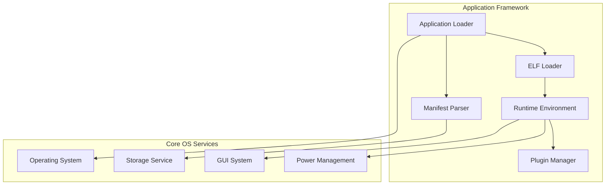
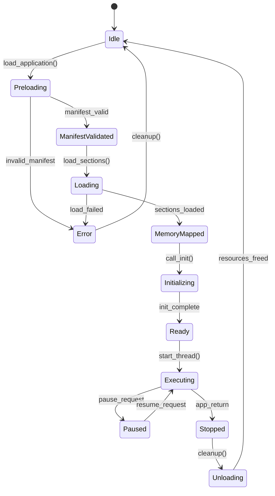
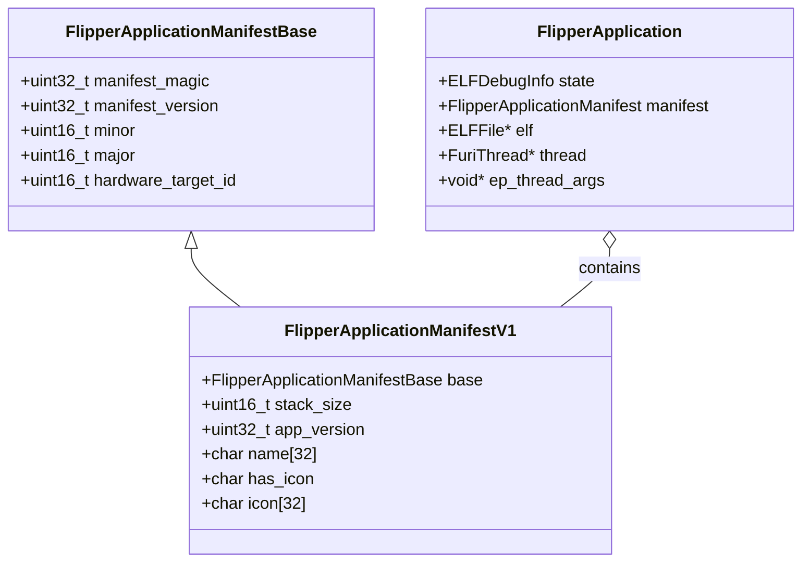
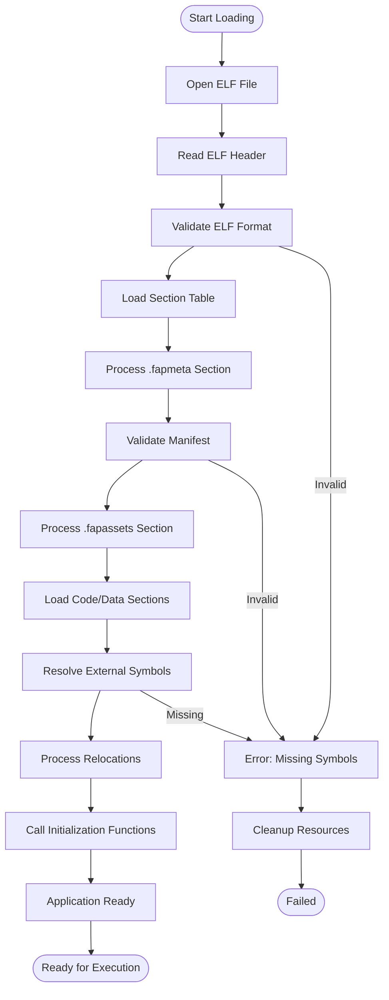
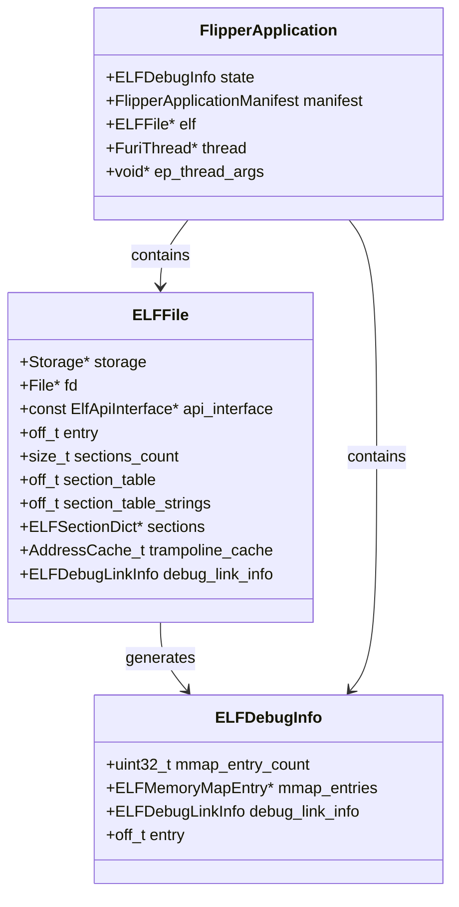
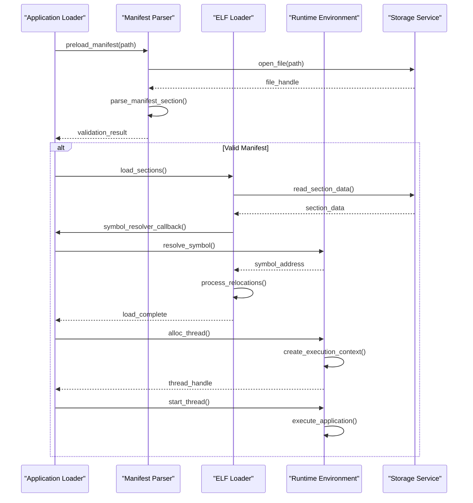
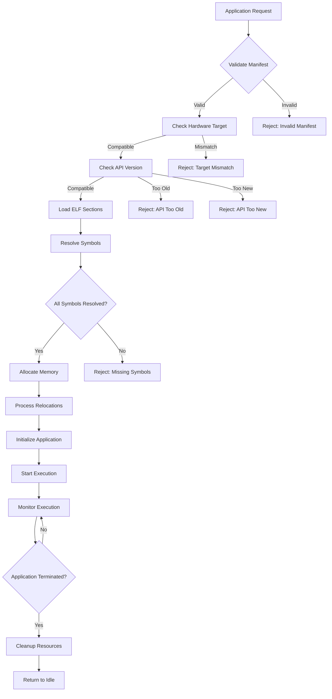
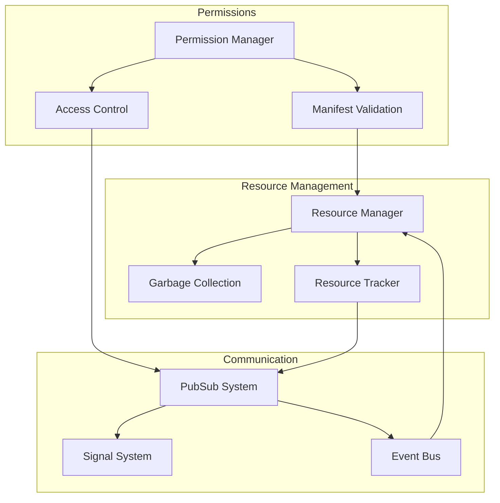

# Application Framework

<cite>
**Referenced Files in This Document**   
- [application_manifest.h](file://lib/flipper_application/application_manifest.h)
- [application_manifest.c](file://lib/flipper_application/application_manifest.c)
- [elf_file.h](file://lib/flipper_application/elf/elf_file.h)
- [elf_file.c](file://lib/flipper_application/elf/elf_file.c)
- [flipper_application.h](file://lib/flipper_application/flipper_application.h)
- [flipper_application.c](file://lib/flipper_application/flipper_application.c)
- [plugin_manager.h](file://lib/flipper_application/plugins/plugin_manager.h)
- [loader.h](file://applications/services/loader/loader.h)
- [loader.c](file://applications/services/loader/loader.c)
- [loader_applications.c](file://applications/services/loader/loader_applications.c)
</cite>

## Table of Contents
1. [Introduction](#introduction)
2. [Core Architecture](#core-architecture)
3. [Application Lifecycle Management](#application-lifecycle-management)
4. [Manifest-Based Application Registration](#manifest-based-application-registration)
5. [Dynamic Loading and ELF Processing](#dynamic-loading-and-elf-processing)
6. [Application State Management](#application-state-management)
7. [Component Interactions](#component-interactions)
8. [Security and Isolation](#security-and-isolation)
9. [Cross-Cutting Concerns](#cross-cutting-concerns)
10. [Technology Stack and Dependencies](#technology-stack-and-dependencies)

## Introduction

The Flipper Zero Application Framework provides a comprehensive system for managing the lifecycle of both built-in and external applications on the Flipper Zero device. This framework enables dynamic loading, execution, and management of applications while maintaining system stability and security. The architecture is designed to support both standalone applications and plugin-based extensions, providing a flexible platform for developers to create functionality that integrates seamlessly with the core operating system.

The framework implements a manifest-based registration system that allows applications to declare their metadata, dependencies, and compatibility requirements. Applications are packaged in the FAP (Flipper Application Package) format, which is based on the ELF (Executable and Linkable Format) standard with custom extensions for embedded device constraints. The system supports both internal applications compiled into the firmware and external applications that can be loaded from storage at runtime.

**Section sources**
- [application_manifest.h](file://lib/flipper_application/application_manifest.h#L1-L90)
- [flipper_application.h](file://lib/flipper_application/flipper_application.h#L1-L161)

## Core Architecture

The Application Framework follows a layered architecture with clear separation of concerns between application loading, manifest processing, memory management, and execution control. At its core, the framework consists of three primary components: the Application Loader, Manifest Parser, and Runtime Environment, which work together to manage application lifecycle operations.

The architecture is built around the ELF (Executable and Linkable Format) standard, extended with Flipper-specific sections for application metadata and assets. Applications are loaded dynamically from either internal firmware sections or external storage, with the framework handling symbol resolution, memory allocation, and execution context setup. The system maintains a registry of loaded applications and provides services for inter-application communication and resource management.



**Diagram sources**
- [flipper_application.h](file://lib/flipper_application/flipper_application.h#L1-L161)
- [loader.h](file://applications/services/loader/loader.h#L1-L128)

**Section sources**
- [flipper_application.h](file://lib/flipper_application/flipper_application.h#L1-L161)
- [loader.h](file://applications/services/loader/loader.h#L1-L128)

## Application Lifecycle Management

The Application Framework implements a comprehensive lifecycle management system that controls the creation, execution, and termination of applications on the Flipper Zero device. The lifecycle is managed through a series of well-defined states and transitions that ensure proper resource allocation and cleanup.

Applications progress through several distinct phases: preload, load, execution, and unload. During the preload phase, the framework validates the application manifest and checks compatibility with the current hardware and firmware version. The load phase involves parsing the ELF file, resolving symbols, and allocating memory for code and data sections. The execution phase begins when the application thread is started, and ends when the application returns control to the loader. The unload phase handles cleanup operations, including memory deallocation and resource release.

The framework provides explicit APIs for transitioning between lifecycle states, with error handling mechanisms to manage failures at each stage. Applications can be started synchronously or asynchronously, with the loader service providing status reporting and error messaging capabilities.



**Diagram sources**
- [flipper_application.c](file://lib/flipper_application/flipper_application.c#L1-L392)
- [loader.c](file://applications/services/loader/loader.c#L630-L667)

**Section sources**
- [flipper_application.c](file://lib/flipper_application/flipper_application.c#L1-L392)
- [loader.c](file://applications/services/loader/loader.c#L630-L667)

## Manifest-Based Application Registration

The Application Framework uses a manifest-based registration system to declare application metadata, dependencies, and compatibility requirements. Each application contains a manifest section (.fapmeta) that follows a structured format defined by the Flipper Application Manifest specification.

The manifest contains critical information including the application name, version, stack size requirements, hardware target compatibility, and API version requirements. The manifest begins with a magic number (0x52474448) and version identifier to ensure compatibility with the loader. Applications declare their API version requirements using major and minor version numbers, which are used to verify compatibility with the current firmware's exported symbols.

The framework validates manifests during the preload phase, checking for correct magic numbers, supported version numbers, and hardware target compatibility. The manifest also includes optional icon data and application metadata that can be used by the UI system to display application information. This manifest-based approach enables the system to perform compatibility checks before attempting to load an application, preventing execution of incompatible or potentially harmful code.



**Diagram sources**
- [application_manifest.h](file://lib/flipper_application/application_manifest.h#L1-L90)
- [application_manifest.c](file://lib/flipper_application/application_manifest.c#L1-L50)

**Section sources**
- [application_manifest.h](file://lib/flipper_application/application_manifest.h#L1-L90)
- [application_manifest.c](file://lib/flipper_application/application_manifest.c#L1-L50)

## Dynamic Loading and ELF Processing

The Application Framework implements a sophisticated dynamic loading system based on the ELF (Executable and Linkable Format) standard, extended with Flipper-specific sections for application metadata and assets. The loading process is divided into multiple stages to ensure efficient memory usage and error handling.

The ELF loader first parses the ELF header to validate the file format and locate the section table. It then processes special sections including .fapmeta (application manifest), .fapassets (embedded assets), and standard ELF sections containing code and data. The loader resolves symbols by querying the ElfApiInterface resolver callback, which provides access to the firmware's exported symbols. This allows applications to call into core OS services while maintaining binary compatibility across firmware versions.

Memory mapping is performed using a two-stage process: first loading the section table to determine memory requirements, then allocating and mapping sections to memory. The loader supports relocation processing to adjust addresses based on the actual load location, and implements a trampoline mechanism for function calls between modules. The system also handles initialization and finalization sections (ctors/dtors) to ensure proper setup and cleanup of application state.



**Diagram sources**
- [elf_file.h](file://lib/flipper_application/elf/elf_file.h#L1-L156)
- [elf_file.c](file://lib/flipper_application/elf/elf_file.c#L1-L200)

**Section sources**
- [elf_file.h](file://lib/flipper_application/elf/elf_file.h#L1-L156)
- [elf_file.c](file://lib/flipper_application/elf/elf_file.c#L1-L200)

## Application State Management

The Application Framework maintains comprehensive state information for each loaded application, tracking its lifecycle stage, memory usage, and execution context. The state management system ensures proper resource cleanup and prevents memory leaks when applications are terminated.

Each application instance maintains state information including debug symbols, memory map entries, and thread handles. The framework uses a linked list to track all loaded applications, allowing for enumeration and inspection of running processes. When an application is unloaded, the system automatically cleans up allocated resources including memory mappings, file handles, and thread objects.

The state management system also handles error conditions gracefully, ensuring that partial loads are properly cleaned up and that the system remains stable even when applications fail to load or execute correctly. The framework provides APIs for querying application state and receiving notifications about application lifecycle events, enabling other system components to respond appropriately to application startup and shutdown.



**Diagram sources**
- [flipper_application.c](file://lib/flipper_application/flipper_application.c#L1-L392)
- [elf_file.h](file://lib/flipper_application/elf/elf_file.h#L1-L156)

**Section sources**
- [flipper_application.c](file://lib/flipper_application/flipper_application.c#L1-L392)
- [elf_file.h](file://lib/flipper_application/elf/elf_file.h#L1-L156)

## Component Interactions

The Application Framework components interact through well-defined interfaces that enable modularity and separation of concerns. The primary interaction pattern follows a layered architecture where higher-level components depend on services provided by lower-level components.

The Application Loader serves as the central coordinator, orchestrating interactions between the Manifest Parser, ELF Loader, and Runtime Environment. When an application is requested, the loader first uses the manifest parser to validate compatibility, then delegates to the ELF loader for binary processing, and finally manages the execution context through the runtime environment. The plugin manager component interacts with both the loader and ELF components to provide specialized loading capabilities for plugin architectures.

Interactions between components are mediated through callback interfaces and data structures that minimize coupling. For example, the ELF loader uses a resolver callback interface to query symbol addresses from the application framework, rather than directly accessing symbol tables. This design allows for flexibility in symbol resolution strategies and supports features like lazy loading and on-demand symbol resolution.



**Diagram sources**
- [loader.c](file://applications/services/loader/loader.c#L944-L1011)
- [flipper_application.c](file://lib/flipper_application/flipper_application.c#L157-L191)
- [elf_file.c](file://lib/flipper_application/elf/elf_file.c#L864-L881)

**Section sources**
- [loader.c](file://applications/services/loader/loader.c#L944-L1011)
- [flipper_application.c](file://lib/flipper_application/flipper_application.c#L157-L191)
- [elf_file.c](file://lib/flipper_application/elf/elf_file.c#L864-L881)

## Security and Isolation

The Application Framework implements several security mechanisms to protect the system from potentially harmful applications and ensure memory isolation between processes. The framework enforces strict validation of application manifests to prevent execution of incompatible or malicious code.

Memory isolation is achieved through careful management of the application's address space and stack allocation. Each application is allocated its own stack space as specified in the manifest, preventing stack overflow from affecting other system components. The ELF loader performs bounds checking on all memory operations and validates section sizes before allocation.

The framework implements a capability-based security model through the manifest system, where applications must declare their required permissions and API access. The loader verifies that applications only access APIs they are authorized to use, based on version compatibility checks. Additionally, the symbol resolution system acts as an access control mechanism, only allowing applications to call functions that are explicitly exported by the firmware.



**Diagram sources**
- [application_manifest.c](file://lib/flipper_application/application_manifest.c#L6-L50)
- [flipper_application.c](file://lib/flipper_application/flipper_application.c#L101-L120)
- [elf_file.c](file://lib/flipper_application/elf/elf_file.c#L180-L194)

**Section sources**
- [application_manifest.c](file://lib/flipper_application/application_manifest.c#L6-L50)
- [flipper_application.c](file://lib/flipper_application/flipper_application.c#L101-L120)
- [elf_file.c](file://lib/flipper_application/elf/elf_file.c#L180-L194)

## Cross-Cutting Concerns

The Application Framework addresses several cross-cutting concerns that affect multiple aspects of application management, including permissions, resource management, and inter-application communication. These concerns are handled through dedicated subsystems that provide consistent policies across all applications.

Application permissions are managed through the manifest system, where applications declare their required capabilities and the loader enforces access control based on these declarations. Resource management is handled through automatic cleanup of allocated resources when applications terminate, with the framework tracking memory, file handles, and other system resources to prevent leaks.

Inter-application communication is facilitated through the loader's pubsub system, which allows applications to publish events and subscribe to notifications from other components. The framework also supports application signaling, allowing one application to send signals to another for coordination purposes. These mechanisms enable cooperative behavior between applications while maintaining isolation and security.



**Diagram sources**
- [loader.h](file://applications/services/loader/loader.h#L24-L28)
- [loader.c](file://applications/services/loader/loader.c#L993-L1005)
- [loader_applications.c](file://applications/services/loader/loader_applications.c#L1-L81)

**Section sources**
- [loader.h](file://applications/services/loader/loader.h#L24-L28)
- [loader.c](file://applications/services/loader/loader.c#L993-L1005)
- [loader_applications.c](file://applications/services/loader/loader_applications.c#L1-L81)

## Technology Stack and Dependencies

The Application Framework is built on a technology stack that combines standard formats with custom extensions tailored to the constraints of the Flipper Zero embedded platform. The core technology is the ELF (Executable and Linkable Format) standard, which provides a flexible container for code, data, and metadata.

Applications are packaged in the FAP (Flipper Application Package) format, which extends ELF with custom sections for application manifests (.fapmeta) and embedded assets (.fapassets). The manifest format (.fam) is a binary structure that contains application metadata, compatibility information, and configuration parameters. The framework depends on the firmware's exported API symbols, which are accessed through the ElfApiInterface resolver mechanism.

The system integrates with core OS services including storage (for loading applications from SD card), GUI (for application launching and display), and power management (for handling application power requirements). The framework also supports plugin architectures through the PluginManager component, which enables dynamic loading of extension modules that enhance the functionality of existing applications.

```mermaid
dependency-graph
FAP[.fap File] --> ELF
Manifest[.fam Data] --> FAP
Assets[Embedded Assets] --> FAP
ELF --> Storage
ELF --> Memory
Framework --> GUI
Framework --> Power
Framework --> Notifications
PluginManager --> Framework
Plugin --> PluginManager
```

**Diagram sources**
- [application_manifest.h](file://lib/flipper_application/application_manifest.h#L1-L90)
- [elf_file.h](file://lib/flipper_application/elf/elf_file.h#L1-L156)
- [plugin_manager.h](file://lib/flipper_application/plugins/plugin_manager.h#L1-L83)

**Section sources**
- [application_manifest.h](file://lib/flipper_application/application_manifest.h#L1-L90)
- [elf_file.h](file://lib/flipper_application/elf/elf_file.h#L1-L156)
- [plugin_manager.h](file://lib/flipper_application/plugins/plugin_manager.h#L1-L83)