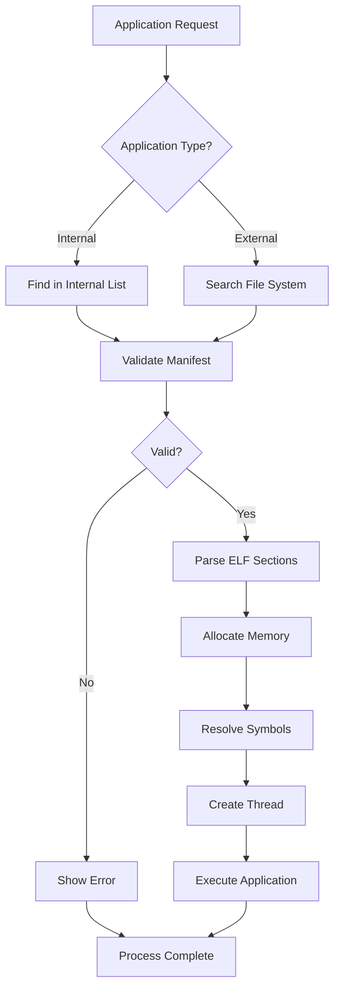
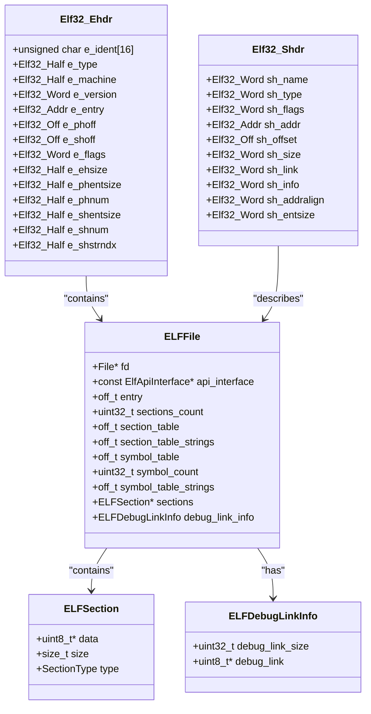
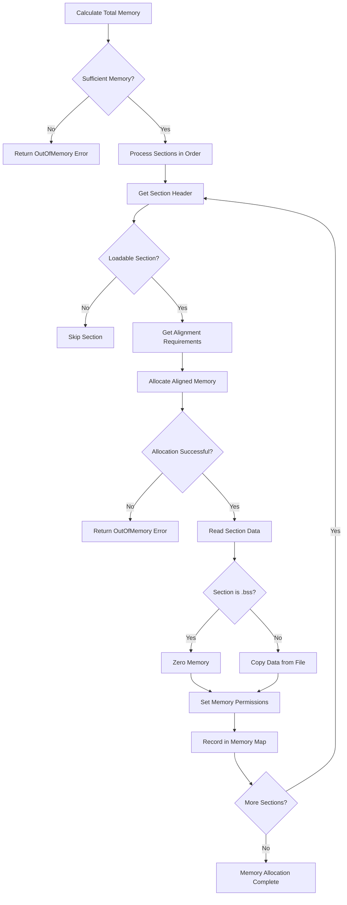
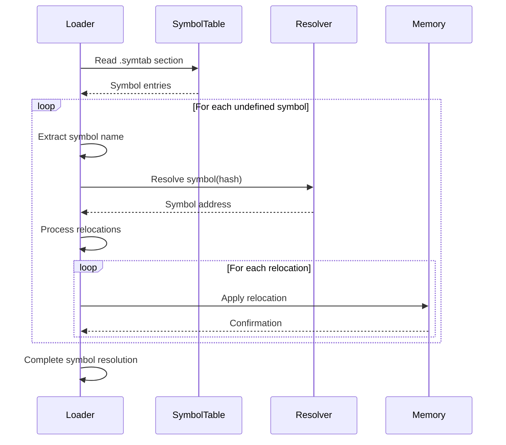
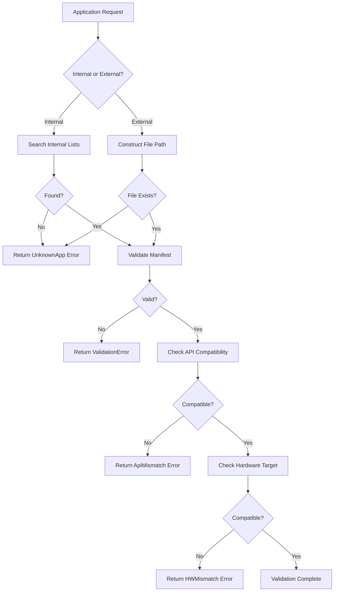
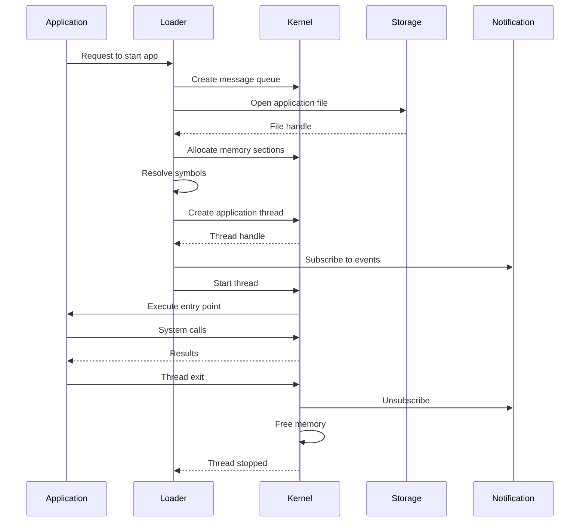
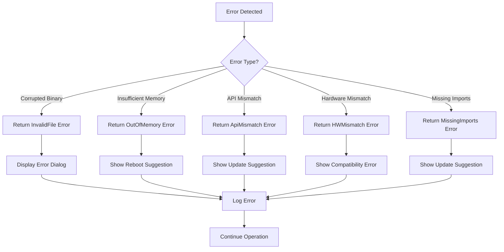

# Application Loading

<cite>
**Referenced Files in This Document**   
- [loader.c](file://applications/services/loader/loader.c)
- [loader.h](file://applications/services/loader/loader.h)
- [loader_i.h](file://applications/services/loader/loader_i.h)
- [flipper_application.c](file://lib/flipper_application/flipper_application.c)
- [flipper_application.h](file://lib/flipper_application/flipper_application.h)
- [elf.h](file://lib/flipper_application/elf/elf.h)
- [elf_file.c](file://lib/flipper_application/elf/elf_file.c)
- [elf_file.h](file://lib/flipper_application/elf/elf_file.h)
- [application_manifest.c](file://lib/flipper_application/application_manifest.c)
- [application_manifest.h](file://lib/flipper_application/application_manifest.h)
</cite>

## Table of Contents
1. [Introduction](#introduction)
2. [Application Loading Process](#application-loading-process)
3. [ELF Binary Format Parsing](#elf-binary-format-parsing)
4. [Memory Layout Allocation](#memory-layout-allocation)
5. [Symbol Resolution](#symbol-resolution)
6. [Application Discovery and Validation](#application-discovery-and-validation)
7. [Loader and OS Kernel Interaction](#loader-and-os-kernel-interaction)
8. [Error Handling and Common Issues](#error-handling-and-common-issues)
9. [Conclusion](#conclusion)

## Introduction

The Flipper Zero firmware implements a sophisticated application loading mechanism based on the ELF (Executable and Linkable Format) standard. This system enables dynamic loading of applications from the file system while maintaining strict compatibility checks and memory management. The loader component is responsible for discovering applications, validating their integrity, parsing their binary format, allocating memory, resolving symbols, and ultimately executing them within the constrained embedded environment of the Flipper Zero device.

The application loading process is designed to be both secure and efficient, ensuring that only compatible applications are loaded while minimizing memory overhead. The system supports both standalone applications and plugins, with different loading semantics for each type. Applications are packaged as FAP (Flipper Application Package) files, which are essentially ELF binaries with custom sections containing metadata and assets.

This document provides a comprehensive analysis of the application loading sub-component, detailing the step-by-step process from application discovery to execution, with particular focus on the ELF-based loading mechanism, memory management, and error handling strategies.

**Section sources**
- [loader.c](file://applications/services/loader/loader.c#L1-L1142)
- [flipper_application.c](file://lib/flipper_application/flipper_application.c#L1-L392)

## Application Loading Process

The application loading process in Flipper Zero firmware follows a structured sequence of operations that ensures applications are loaded safely and efficiently. The process begins when a user or system component requests to start an application, typically through the `loader_start` function in the loader service. This initiates a message-based communication flow through a message queue, allowing the loader to handle requests asynchronously while maintaining thread safety.

The loading process can be divided into several distinct phases: application discovery, validation, ELF parsing, memory allocation, symbol resolution, and execution. Each phase builds upon the previous one, with strict error checking at each step. The loader first determines whether the requested application is an internal application (bundled with firmware) or an external application (stored on the file system). Internal applications are referenced by name in predefined arrays, while external applications are located by searching the file system.

For external applications, the loader uses the `flipper_application_preload` function to validate the ELF header, check the application manifest, and verify compatibility with the current hardware and firmware version. This preloading phase ensures that the application meets all requirements before any memory is allocated. If validation passes, the loader proceeds to map the application sections into memory, resolve external symbols, and create a thread for execution at the entry point specified in the ELF header.

The entire process is designed to be robust against corrupted or incompatible applications, with comprehensive error handling that provides meaningful feedback to users through the device's GUI. The loader also manages application lifecycle events, publishing messages to a pubsub system when applications start or stop, allowing other system components to react appropriately.

**Diagram sources**
- [loader.c](file://applications/services/loader/loader.c#L43-L202)
- [flipper_application.c](file://lib/flipper_application/flipper_application.c#L157-L209)

**Section sources**
- [loader.c](file://applications/services/loader/loader.c#L43-L800)
- [flipper_application.c](file://lib/flipper_application/flipper_application.c#L157-L209)

## ELF Binary Format Parsing

The Flipper Zero application loader implements a specialized ELF parser optimized for the constraints of the embedded environment. The parser is designed to handle the ELF32 format, which is used for all Flipper Zero applications, and focuses on the essential sections needed for execution while ignoring unnecessary metadata. The parsing process begins with validation of the ELF header, which contains critical information about the binary format and structure.

The ELF header (Elf32_Ehdr) is the first structure read from the application file and contains key fields such as the magic number (0x7F followed by 'ELF'), file type (ET_DYN for shared objects), machine architecture (EM_ARM for ARM processors), and offsets to the program and section headers. The loader verifies that these values match the expected configuration for Flipper Zero applications. In particular, it checks that the e_ident[EI_CLASS] field indicates a 32-bit object (ELFCLASS32) and that the e_ident[EI_DATA] field specifies little-endian byte ordering (ELFDATA2LSB).

Following header validation, the loader processes the section header table, which describes all sections in the ELF file. Unlike traditional ELF loaders that might process program headers, the Flipper Zero loader focuses on section headers as they provide more granular control over memory allocation. Key sections processed include .text (executable code), .data (initialized data), .bss (uninitialized data), .symtab (symbol table), .strtab (string table), and custom sections like .fapmeta (application manifest) and .fapassets (embedded assets). The loader reads each section header to determine the section's size, memory alignment requirements, and file offset.

The parsing process is implemented in the `elf_file_load_section_table` function, which iterates through all section headers and categorizes sections based on their type and name. For each loadable section, the loader allocates appropriately aligned memory and reads the section data from the file. The parser also handles special sections like .gnu_debuglink, which contains a checksum for debugging symbols, and custom Flipper-specific sections that contain application metadata and icons.

**Diagram sources**
- [elf.h](file://lib/flipper_application/elf/elf.h#L44-L92)
- [elf_file.h](file://lib/flipper_application/elf/elf_file.h#L1-L65)
- [elf_file.c](file://lib/flipper_application/elf/elf_file.c#L447-L897)

**Section sources**
- [elf.h](file://lib/flipper_application/elf/elf.h#L44-L92)
- [elf_file.c](file://lib/flipper_application/elf/elf_file.c#L447-L897)

## Memory Layout Allocation

Memory layout allocation in the Flipper Zero application loader is a critical process that ensures applications are loaded into appropriate memory regions with correct alignment and protection attributes. The loader implements a careful memory management strategy that balances the need for efficient memory usage with the requirements of position-independent code execution. When an application is loaded, the loader allocates memory for each loadable section based on the section's attributes specified in the ELF section headers.

The allocation process begins by calculating the total memory required for all loadable sections, taking into account alignment constraints specified by the sh_addralign field in each section header. The loader uses aligned_malloc to allocate memory with the required alignment, ensuring that sections are properly aligned for optimal CPU access. For example, code sections are typically aligned to 16-byte boundaries, while data sections may have different alignment requirements based on the data types they contain.

The loader distinguishes between different section types when allocating memory. Code sections (.text) are allocated with execute and read permissions but not write permissions, implementing a form of W^X (Write XOR Execute) protection to enhance security. Data sections (.data, .rodata) are allocated with read and write permissions, while uninitialized data sections (.bss) are allocated with read and write permissions but do not consume space in the ELF file itself. The loader zeros the memory for .bss sections before handing control to the application.

Memory allocation is performed in a way that supports position-independent code, which is essential for the dynamic loading model used by Flipper Zero. Applications are not loaded at fixed addresses but rather at addresses determined at load time, requiring the use of relative addressing and proper relocation processing. The loader maintains a memory map of allocated sections, recording the virtual address, size, and permissions of each section, which is used later for symbol resolution and debugging purposes.

The allocation process also includes checks for available memory, with the loader verifying that sufficient contiguous memory is available before proceeding. If memory allocation fails due to insufficient RAM, the loader returns an appropriate error code, allowing the system to handle the out-of-memory condition gracefully, typically by displaying an error message to the user and suggesting a device reboot to free up memory.

**Diagram sources**
- [elf_file.c](file://lib/flipper_application/elf/elf_file.c#L472-L490)
- [flipper_application.c](file://lib/flipper_application/flipper_application.c#L216-L231)

**Section sources**
- [elf_file.c](file://lib/flipper_application/elf/elf_file.c#L472-L490)
- [flipper_application.c](file://lib/flipper_application/flipper_application.c#L216-L231)

## Symbol Resolution

Symbol resolution is a crucial phase in the Flipper Zero application loading process, enabling applications to access functions and variables provided by the operating system and other libraries. The symbol resolution system is designed to be efficient and secure, allowing applications to use the firmware's API while maintaining compatibility across different firmware versions. The process involves locating symbols in the application's symbol table, resolving their addresses, and applying relocations to fix up references in the loaded code.

The symbol resolution process begins with the loader examining the application's symbol table (.symtab section), which contains entries for all defined and undefined symbols. Each symbol entry includes the symbol name (as an index into the string table), value (address), size, type, and binding information. The loader iterates through the symbol table to identify undefined symbols (those with a value of 0), which represent external references that need to be resolved.

For each undefined symbol, the loader uses a resolver callback mechanism to find the corresponding address in the running system. The resolver is provided by the `ElfApiInterface` structure, which contains a function pointer to the symbol resolution routine. In the Flipper Zero firmware, this resolver typically hashes the symbol name and looks it up in a global symbol table maintained by the system. The use of symbol hashing rather than string comparison makes the resolution process more efficient, especially important in the resource-constrained embedded environment.

Once symbols are resolved, the loader processes relocation entries that specify where in the application's code or data these symbol addresses need to be inserted. The Flipper Zero loader supports both REL and RELA relocation types, with RELA relocations including an explicit addend value. Relocation processing involves calculating the final address by adding the symbol's resolved address to the relocation addend and then writing this value to the specified location in the loaded application image.

The symbol resolution system also supports versioning through the use of symbol version sections (.gnu.version), allowing the system to maintain backward compatibility while introducing new API functions. This enables applications compiled against older firmware versions to continue working on newer firmware, as long as the required symbols are still available. The loader checks symbol version information during the resolution process and can provide appropriate error messages if version incompatibilities are detected.

**Diagram sources**
- [elf_file.c](file://lib/flipper_application/elf/elf_file.c#L660-L666)
- [flipper_application.c](file://lib/flipper_application/flipper_application.c#L216-L231)

**Section sources**
- [elf_file.c](file://lib/flipper_application/elf/elf_file.c#L660-L666)
- [flipper_application.c](file://lib/flipper_application/flipper_application.c#L216-L231)

## Application Discovery and Validation

Application discovery and validation is the initial phase of the loading process, where the loader locates the requested application and verifies its integrity and compatibility. This phase is critical for system stability and security, preventing the execution of corrupted, incompatible, or malicious applications. The discovery process differs for internal applications (bundled with the firmware) and external applications (stored on the file system), but both follow a rigorous validation procedure.

For internal applications, discovery involves searching predefined arrays of application descriptors, such as FLIPPER_APPS, FLIPPER_SETTINGS_APPS, and FLIPPER_SYSTEM_APPS. These arrays contain metadata about each bundled application, including its name, icon, stack size, and entry point. The loader performs a linear search through these arrays to find a match for the requested application name or ID. Once found, the loader can proceed directly to validation, as internal applications are inherently trusted and do not require file system access.

External application discovery begins with constructing the file path, typically under the /ext/apps/ directory. The loader then checks for the existence of the file using the storage system before attempting to open it. This file system search allows users to install additional applications on the device's SD card, extending its functionality beyond the base firmware. The loader supports both FAP (compiled) and JS (JavaScript) applications, with different handling for each type.

Validation of external applications is a multi-step process that ensures the application meets all requirements before loading. First, the loader validates the ELF header to confirm it is a valid ELF file with the correct architecture (ARM) and bitness (32-bit). Next, it processes the .fapmeta section to extract and validate the application manifest, which contains metadata such as the application name, version, API version requirements, and hardware target compatibility. The loader checks that the application's required API version is compatible with the current firmware version, preventing applications from using unsupported or deprecated functions.

Additional validation includes checking the application's hardware target against the current device to ensure compatibility, and verifying that the application has not been corrupted. If any validation step fails, the loader returns an appropriate error code, such as LoaderStatusErrorInvalidFile, LoaderStatusErrorInvalidManifest, or LoaderStatusErrorHWMismatch. These errors are translated into user-friendly messages displayed through the device's GUI, helping users understand why an application failed to load.

**Diagram sources**
- [loader.c](file://applications/services/loader/loader.c#L762-L800)
- [flipper_application.c](file://lib/flipper_application/flipper_application.c#L100-L121)

**Section sources**
- [loader.c](file://applications/services/loader/loader.c#L762-L800)
- [flipper_application.c](file://lib/flipper_application/flipper_application.c#L100-L121)

## Loader and OS Kernel Interaction

The interaction between the application loader and the OS kernel in Flipper Zero firmware is a carefully orchestrated process that ensures applications are integrated safely into the running system. This interaction occurs at multiple levels, from memory management and thread creation to system call handling and resource access. The loader acts as a bridge between the static firmware and dynamically loaded applications, mediating their access to kernel services and system resources.

At the core of this interaction is the message queue and pubsub system that enables asynchronous communication between the loader and other system components. The loader uses a message queue (implemented with furi_message_queue) to receive requests from various parts of the system, such as the GUI or CLI, and process them in a serialized manner. This ensures thread safety and prevents race conditions when multiple components attempt to load applications simultaneously. The pubsub system allows the loader to broadcast events, such as application startup or shutdown, to interested subscribers, enabling system-wide coordination of application lifecycle events.

When creating a new application thread, the loader interacts directly with the FreeRTOS kernel through the FuriThread abstraction. The loader allocates a thread with the stack size specified in the application manifest and sets up the thread's entry point to a wrapper function that handles initialization and cleanup. Before starting the thread, the loader configures heap tracing based on the system's debug settings and manages power state by calling furi_hal_power_insomnia_enter for applications that should prevent the device from sleeping.

The loader also interacts with the kernel's memory management system, using aligned_malloc for section allocation and ensuring that memory is properly freed when applications terminate. It works with the storage subsystem to access application files on the file system, handling both internal flash and external SD card storage transparently. The loader coordinates with the notification system to ensure that all notifications are completed before an application thread exits, preventing race conditions with the display and audio subsystems.

Security is a key aspect of the loader-kernel interaction, with the loader enforcing access controls and compatibility checks before allowing applications to run. It validates that applications are compiled for the correct hardware target and firmware API version, preventing incompatible or potentially harmful code from executing. The loader also manages API access through the ElfApiInterface, which acts as a contract between applications and the system, ensuring that only approved functions are accessible.

**Diagram sources**
- [loader.c](file://applications/services/loader/loader.c#L43-L202)
- [flipper_application.c](file://lib/flipper_application/flipper_application.c#L233-L253)

**Section sources**
- [loader.c](file://applications/services/loader/loader.c#L43-L202)
- [flipper_application.c](file://lib/flipper_application/flipper_application.c#L233-L253)

## Error Handling and Common Issues

Error handling in the Flipper Zero application loader is comprehensive and user-focused, designed to provide clear feedback when applications fail to load while maintaining system stability. The loader implements a multi-layered error handling strategy that addresses various failure modes, from corrupted binaries to insufficient memory. Each potential failure point in the loading process has specific error codes and recovery strategies, ensuring that issues are handled appropriately without crashing the entire system.

Common issues encountered during application loading include corrupted binaries, insufficient memory, and version incompatibilities. Corrupted binaries are detected during the ELF header validation and section loading phases, with the loader returning LoaderStatusErrorInvalidFile if the file structure is invalid or if section data cannot be read correctly. Insufficient memory is detected during the memory allocation phase, with the loader checking available heap space before allocating memory for application sections. If insufficient memory is available, the loader returns LoaderStatusErrorOutOfMemory and may suggest a device reboot to free up memory.

Version incompatibilities are a frequent source of loading failures, occurring when an application is compiled against a different firmware API version than the one currently running. The loader detects these incompatibilities during the manifest validation phase, checking the application's required API version against the current firmware's API version. If the application requires an older API version, the loader may still allow loading but with a warning, while applications requiring a newer API version are blocked with a LoaderStatusErrorApiMismatch error.

The loader provides detailed error messages through both programmatic interfaces and the device's GUI. When errors occur, the loader sets a descriptive error message that can be retrieved by calling components, and also displays user-friendly error dialogs with suggestions for resolution. For example, an API mismatch error might suggest updating either the application or the firmware, while a hardware target mismatch might indicate that the application is not compatible with the current device model.

The loader also implements defensive programming practices to handle unexpected conditions gracefully. It uses assertions and bounds checking throughout the code to catch programming errors during development, while using more robust error checking in production builds. The loader's message queue design ensures that even if one loading operation fails, subsequent requests can still be processed, preventing a single failed application from blocking the entire system.

**Diagram sources**
- [loader.c](file://applications/services/loader/loader.c#L106-L176)
- [flipper_application.c](file://lib/flipper_application/flipper_application.c#L277-L309)

**Section sources**
- [loader.c](file://applications/services/loader/loader.c#L106-L176)
- [flipper_application.c](file://lib/flipper_application/flipper_application.c#L277-L309)

## Conclusion

The application loading system in Flipper Zero firmware represents a sophisticated solution for dynamic application loading in a resource-constrained embedded environment. By leveraging the ELF format and implementing a multi-phase loading process, the system achieves a balance between flexibility, security, and efficiency. The loader's design enables users to extend the device's functionality with third-party applications while maintaining system stability and security through rigorous validation and error handling.

Key strengths of the loading system include its comprehensive validation of application integrity and compatibility, efficient memory management that supports position-independent code, and robust symbol resolution that enables applications to use the firmware's API safely. The separation of concerns between the loader service and the ELF parsing library promotes code reuse and maintainability, while the message-based architecture ensures thread safety and responsive user interaction.

The system's error handling is particularly noteworthy, providing clear feedback to users when applications fail to load while maintaining overall system stability. By categorizing errors and providing specific guidance for resolution, the loader helps users troubleshoot common issues like version incompatibilities and insufficient memory. This user-centric approach to error handling enhances the overall user experience, making the device more accessible to users of all skill levels.

Future improvements to the loading system could include enhanced security features such as code signing verification, more sophisticated memory protection mechanisms, and improved debugging support through extended symbol information. However, the current implementation already provides a solid foundation for application loading that effectively meets the needs of the Flipper Zero platform, enabling a rich ecosystem of applications while maintaining the reliability and security expected from a hardware hacking tool.

**Section sources**
- [loader.c](file://applications/services/loader/loader.c#L1-L1142)
- [flipper_application.c](file://lib/flipper_application/flipper_application.c#L1-L392)