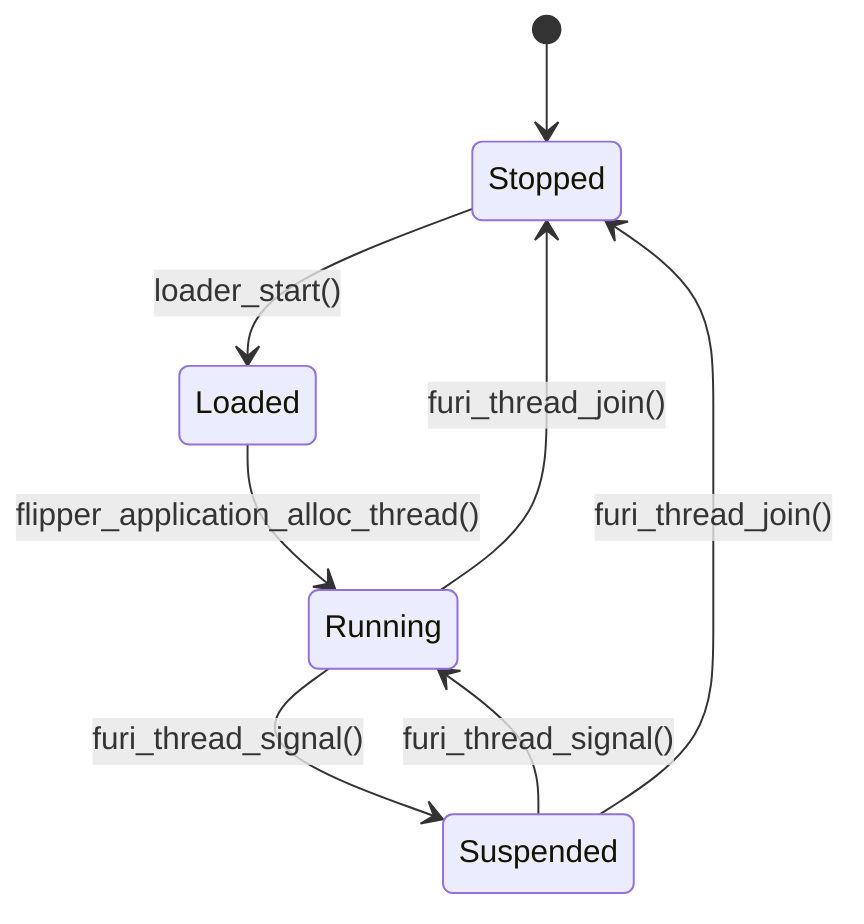
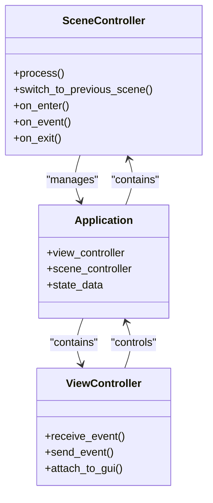
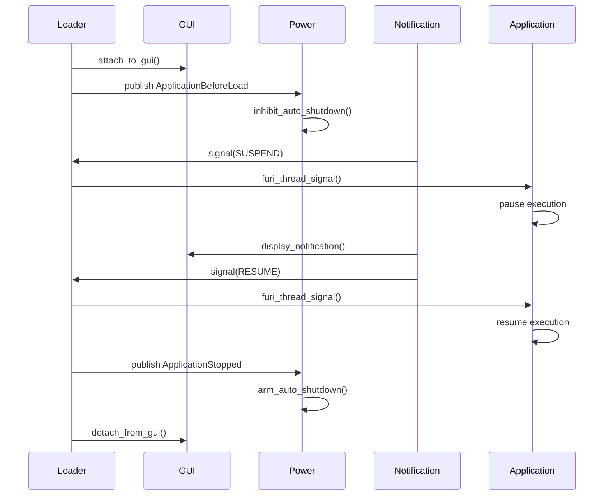

# Lifecycle Management

<cite>
**Referenced Files in This Document**   
- [loader.h](file://applications/services/loader/loader.h)
- [loader_i.h](file://applications/services/loader/loader_i.h)
- [loader.c](file://applications/services/loader/loader.c)
- [flipper_application.h](file://lib/flipper_application/flipper_application.h)
- [application_manifest.h](file://lib/flipper_application/application_manifest.h)
- [scene_controller.hpp](file://lib/app-scened-template/scene_controller.hpp)
- [view_controller.hpp](file://lib/app-scened-template/view_controller.hpp)
- [gui.c](file://applications/services/gui/gui.c)
- [power.c](file://applications/services/power/power_service/power.c)
</cite>

## Table of Contents
1. [Introduction](#introduction)
2. [Application Lifecycle States](#application-lifecycle-states)
3. [Lifecycle Transitions](#lifecycle-transitions)
4. [Lifecycle Management APIs](#lifecycle-management-apis)
5. [Application State Management](#application-state-management)
6. [Integration with System Services](#integration-with-system-services)
7. [Common Issues and Best Practices](#common-issues-and-best-practices)
8. [Conclusion](#conclusion)

## Introduction
The Flipper Zero firmware implements a comprehensive lifecycle management system that controls the execution state of applications on the device. This system manages the complete lifecycle of applications from loading to termination, ensuring proper resource management, state preservation, and integration with system services. The lifecycle manager coordinates with various system components including the GUI framework, power management, and notification systems to provide a cohesive user experience. This document details the application lifecycle states, transition mechanisms, APIs for lifecycle management, and integration points with other system services.

**Section sources**
- [loader.h](file://applications/services/loader/loader.h#L1-L128)
- [loader_i.h](file://applications/services/loader/loader_i.h#L1-L89)

## Application Lifecycle States
The Flipper Zero application lifecycle consists of four primary states: loaded, running, suspended, and stopped. When an application is loaded, it has been successfully preloaded into memory with its manifest validated and resources allocated, but the application thread has not yet started execution. The running state indicates that the application thread is active and processing events, with the application fully interactive with the user interface. The suspended state occurs when an application is temporarily paused, typically when another application takes focus or the system enters a low-power mode, preserving the application's state in memory while halting execution. The stopped state represents a terminated application where all resources have been released and the application thread has completed execution. Applications transition through these states in response to user actions, system events, and API calls, with the lifecycle manager ensuring proper state transitions and resource cleanup.

**Section sources**
- [loader_i.h](file://applications/services/loader/loader_i.h#L11-L26)
- [loader.c](file://applications/services/loader/loader.c#L652-L1060)

## Lifecycle Transitions
Application lifecycle transitions are managed through a message-driven architecture within the loader service. When an application starts, the loader first validates the application manifest and checks for compatibility with the current hardware and API version. If validation passes, the loader allocates a thread for the application and transitions it from the loaded to running state. During execution, applications can be suspended when system events such as incoming notifications or low battery conditions occur, with the loader managing the suspension by signaling the application thread. When an application stops, either through user action or completion of its main function, the loader performs cleanup operations including joining the application thread, releasing allocated memory, and publishing a stopped event to the pubsub system. The transition to suspended state is handled through the FuriThread signaling mechanism, allowing applications to gracefully pause execution and preserve their state. Each transition is accompanied by appropriate callbacks to ensure that applications can respond to state changes and perform necessary cleanup or initialization operations.

**Diagram sources**
- [loader.c](file://applications/services/loader/loader.c#L652-L1060)
- [flipper_application.h](file://lib/flipper_application/flipper_application.h#L113-L114)

## Lifecycle Management APIs
The Flipper Zero firmware provides a comprehensive set of APIs for managing application lifecycles through the loader service. The primary interface is exposed through the `loader_start()` function, which initiates application execution by name and passes optional arguments, returning a status code indicating success or failure. For applications requiring GUI-based error reporting, the `loader_start_with_gui_error()` function provides built-in error display capabilities. The `loader_signal()` function allows the system to send signals to running applications, enabling state transitions such as suspension or termination. Applications can query their own state using `loader_get_application_name()`, which retrieves the name of the currently running application. The loader also provides locking mechanisms through `loader_lock()` and `loader_unlock()` functions, preventing concurrent application execution and ensuring system stability. These APIs are accessed through the FuriRecord system, with the loader service registered under the "loader" record name, allowing both system components and applications to interact with the lifecycle manager.

**Section sources**
- [loader.h](file://applications/services/loader/loader.h#L42-L123)
- [loader.c](file://applications/services/loader/loader.c#L922-L1058)

## Application State Management
Application state management in the Flipper Zero firmware is implemented through a combination of the scene manager and view controller patterns. The scene controller, defined in the app-scened-template library, manages application flow between different logical states or "scenes" within an application. Each scene provides `on_enter()`, `on_event()`, and `on_exit()` callbacks that are invoked during state transitions, allowing applications to initialize resources, handle events, and clean up when leaving a scene. The view controller manages the presentation layer, handling input events and view transitions through a message queue system. Applications preserve context across state changes by maintaining state in their application instance, which persists for the duration of the application's lifecycle. The scene controller's `process()` method implements the main application loop, continuously receiving events and dispatching them to the current scene until an exit condition is met. This architecture ensures that application state is properly preserved during suspension and restored upon resumption, providing a seamless user experience.

**Diagram sources**
- [scene_controller.hpp](file://lib/app-scened-template/scene_controller.hpp#L144-L167)
- [view_controller.hpp](file://lib/app-scened-template/view_controller.hpp#L86-L100)

## Integration with System Services
The lifecycle manager integrates closely with other system services to provide a cohesive user experience. With the GUI framework, the lifecycle manager coordinates view dispatcher attachment and detachment, ensuring that only one application controls the display at a time. When an application starts, the GUI service attaches the application's view dispatcher, and when the application stops, it detaches and restores the previous interface. The power management service subscribes to loader events through the pubsub system, receiving notifications when applications start or stop. This allows the power service to inhibit automatic shutdown while applications are running and re-enable it when applications stop, preventing unexpected power-off during active use. The notification system can signal running applications to temporarily suspend execution when important notifications arrive, allowing the notification to be displayed without interference. These integrations are implemented through the FuriPubSub system, with the loader publishing events that other services can subscribe to, creating a loosely coupled architecture that enables flexible interaction between system components.

**Diagram sources**
- [loader.c](file://applications/services/loader/loader.c#L1033-L1035)
- [power.c](file://applications/services/power/power_service/power.c#L284-L295)
- [gui.c](file://applications/services/gui/gui.c#L695-L721)

## Common Issues and Best Practices
Common issues in application lifecycle management include improper state transitions, memory leaks during suspension, and race conditions during termination. Improper state transitions often occur when applications fail to properly handle the back button event or do not implement appropriate scene exit logic, leading to inconsistent application state. Memory leaks during suspension can happen when applications allocate resources in `on_enter()` callbacks but fail to release them in corresponding `on_exit()` callbacks, particularly when the application is suspended before reaching the normal exit path. Race conditions during termination may occur when multiple threads or callbacks attempt to modify shared state simultaneously without proper synchronization. Best practices to address these issues include always pairing resource allocation with deallocation in scene callbacks, using the FuriMessageQueue for thread-safe communication between components, and implementing proper error handling in all lifecycle methods. Applications should preserve minimal state necessary for restoration and avoid holding references to system resources that could prevent proper cleanup. Additionally, applications should respond promptly to suspension signals and avoid performing long-running operations in lifecycle callbacks to maintain system responsiveness.

**Section sources**
- [scene_controller.hpp](file://lib/app-scened-template/scene_controller.hpp#L152-L166)
- [view_controller.hpp](file://lib/app-scened-template/view_controller.hpp#L86-L100)
- [loader.c](file://applications/services/loader/loader.c#L1010-L1029)

## Conclusion
The Flipper Zero firmware's lifecycle management system provides a robust framework for controlling application execution and state. By implementing a clear state model with well-defined transitions, the system ensures predictable application behavior and proper resource management. The integration with system services through the pubsub pattern enables coordinated operation between components while maintaining loose coupling. The provided APIs give both system components and applications the tools needed to manage lifecycles effectively, from startup to termination. By following best practices for state management and resource cleanup, developers can create applications that integrate seamlessly with the system and provide a reliable user experience. The architecture balances simplicity for basic applications with flexibility for complex use cases, making it suitable for the diverse range of applications that run on the Flipper Zero platform.