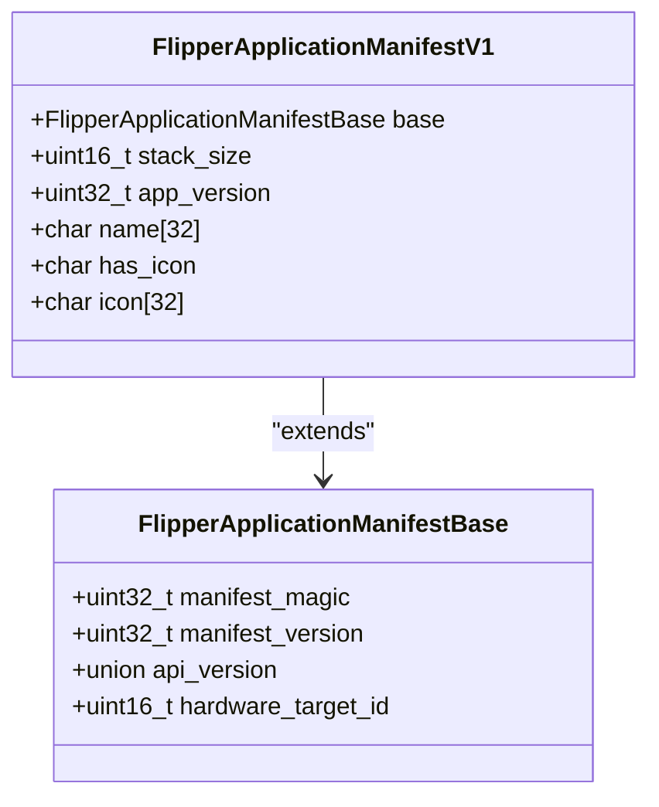
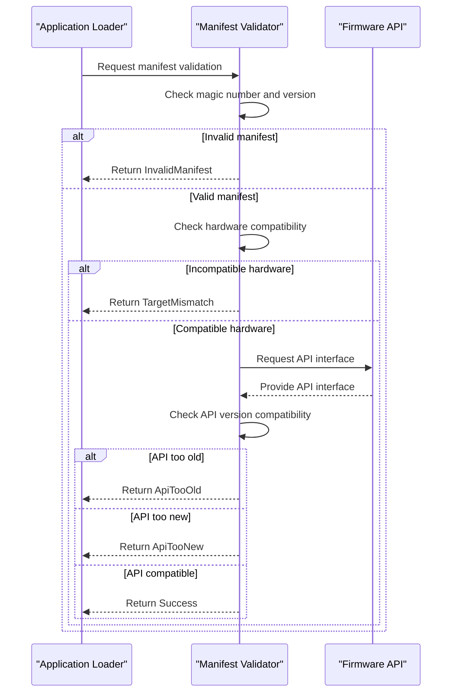
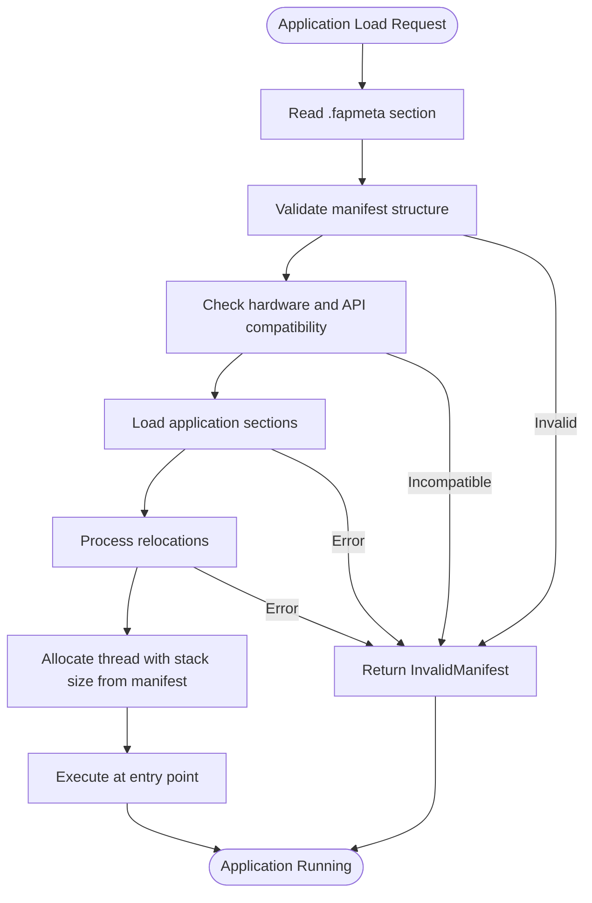
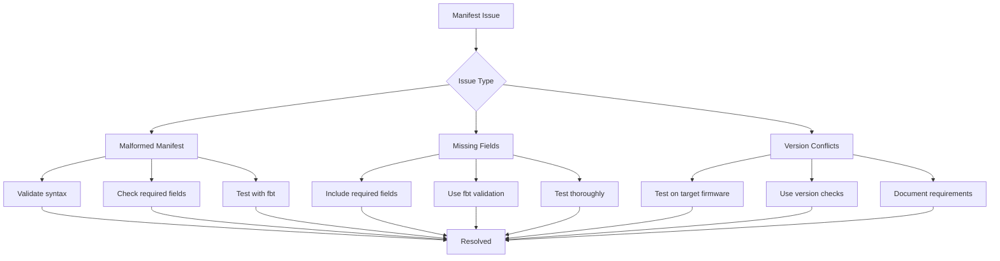
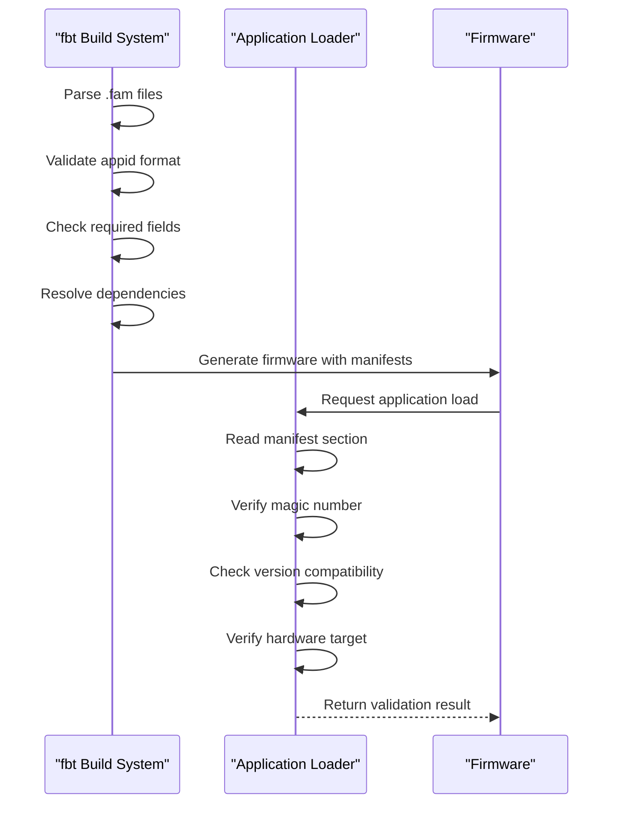

# Manifest System

<cite>
**Referenced Files in This Document**   
- [application_manifest.h](file://lib/flipper_application/application_manifest.h)
- [application_manifest.c](file://lib/flipper_application/application_manifest.c)
- [flipper_application.c](file://lib/flipper_application/flipper_application.c)
- [flipper_application.h](file://lib/flipper_application/flipper_application.h)
- [AppManifests.md](file://documentation/AppManifests.md)
- [elfmanifest.py](file://scripts/fbt/elfmanifest.py)
- [appmanifest.py](file://scripts/fbt/appmanifest.py)
- [loader_menu.c](file://applications/services/loader/loader_menu.c)
- [accessor/application.fam](file://applications/debug/accessor/application.fam)
- [debug/application.fam](file://applications/debug/application.fam)
- [examples/application.fam](file://applications/examples/application.fam)
</cite>

## Table of Contents
1. [Introduction](#introduction)
2. [Manifest File Structure](#manifest-file-structure)
3. [Manifest Validation Process](#manifest-validation-process)
4. [Application Loader Integration](#application-loader-integration)
5. [Manifest Field Reference](#manifest-field-reference)
6. [Common Issues and Solutions](#common-issues-and-solutions)
7. [Security and Integrity Verification](#security-and-integrity-verification)
8. [Conclusion](#conclusion)

## Introduction

The Manifest System in Flipper Zero firmware serves as the metadata framework for all applications, services, and system components. This system enables the firmware to properly identify, validate, and load applications while ensuring compatibility and security. The manifest system consists of two primary components: the build-time `.fam` files and the runtime binary manifests embedded in `.fap` files.

The manifest system plays a crucial role in the Flipper Zero ecosystem by providing a standardized way to describe application properties, dependencies, and requirements. This documentation will explore the structure, validation, and usage of manifests throughout the application lifecycle, from build time to execution.

**Section sources**
- [AppManifests.md](file://documentation/AppManifests.md#L1-L140)

## Manifest File Structure

The manifest system operates at two levels: build-time manifests (`.fam` files) and runtime manifests (embedded in `.fap` files). The build-time manifests are Python-based configuration files that define application properties during the build process, while the runtime manifests are binary structures embedded in the compiled application files.

The build-time `.fam` files use a Python-based syntax with the `App()` function to define application properties. These files are processed by the `fbt` build system to generate the final firmware configuration. The runtime manifests are binary structures defined in C that are embedded in the `.fap` files and read by the application loader at runtime.

The binary manifest structure is defined in `application_manifest.h` and consists of a base structure with version, API compatibility, and hardware target information, followed by application-specific data such as name, version, stack size, and icon data.

**Diagram sources**
- [application_manifest.h](file://lib/flipper_application/application_manifest.h#L23-L43)

**Section sources**
- [application_manifest.h](file://lib/flipper_application/application_manifest.h#L1-L89)
- [AppManifests.md](file://documentation/AppManifests.md#L7-L139)

## Manifest Validation Process

The manifest validation process occurs when an application is loaded and involves several checks to ensure the application is compatible with the current firmware and hardware. The validation process is implemented in `application_manifest.c` and called from `flipper_application.c` during the application loading sequence.

The validation process includes the following steps:
1. Magic number verification to confirm the manifest structure
2. Version compatibility checking
3. Hardware target compatibility verification
4. API version compatibility assessment

The validation functions return specific status codes that indicate the result of each check, allowing the loader to provide meaningful error messages when an application cannot be loaded due to manifest issues.

**Diagram sources**
- [application_manifest.c](file://lib/flipper_application/application_manifest.c#L6-L50)
- [flipper_application.c](file://lib/flipper_application/flipper_application.c#L101-L120)

**Section sources**
- [application_manifest.c](file://lib/flipper_application/application_manifest.c#L6-L50)
- [flipper_application.c](file://lib/flipper_application/flipper_application.c#L101-L120)

## Application Loader Integration

The manifest system is tightly integrated with the application loader, which uses manifest information to guide the loading process. The loader uses the manifest data to determine how to allocate memory, set up the execution environment, and display the application in menus.

The integration occurs in several stages:
1. Preload: The loader reads the manifest section (`.fapmeta`) from the application file
2. Validation: The manifest is validated for compatibility
3. Loading: The application is loaded into memory based on manifest specifications
4. Execution: The application is started with the specified entry point

The loader also uses manifest information to populate the application menu, using the application name and icon data from the manifest to display the application in the user interface.

**Diagram sources**
- [flipper_application.c](file://lib/flipper_application/flipper_application.c#L157-L209)
- [loader_menu.c](file://applications/services/loader/loader_menu.c#L96-L120)

**Section sources**
- [flipper_application.c](file://lib/flipper_application/flipper_application.c#L157-L209)
- [loader_menu.c](file://applications/services/loader/loader_menu.c#L96-L120)

## Manifest Field Reference

The manifest system supports a comprehensive set of fields that define application properties and behavior. These fields are divided into build-time fields (in `.fam` files) and runtime fields (in binary manifests).

### Build-time Fields (.fam files)

The build-time fields are defined in the `App()` function in `.fam` files and include:

| Field | Description | Required |
|-------|-------------|----------|
| appid | Application ID within the build system | Yes |
| apptype | Application type (SERVICE, SYSTEM, APP, PLUGIN, etc.) | Yes |
| name | Display name in menus | No |
| entry_point | C function to use as entry point | No |
| stack_size | Stack size in bytes for application | No |
| icon | Animated icon from built-in assets | No |
| fap_icon | PNG file (10x10px, 1-bit) for FAP icon | No |
| fap_version | Application version (major.minor) | No |
| requires | List of required applications | No |
| conflicts | List of conflicting applications | No |
| targets | Hardware targets compatible with application | No |

### Runtime Fields (Binary Manifest)

The runtime fields are embedded in the `.fap` file and include:

| Field | Description | Size |
|-------|-------------|------|
| manifest_magic | Magic number (0x52474448) | 4 bytes |
| manifest_version | Manifest format version | 4 bytes |
| api_version | API version compatibility | 4 bytes |
| hardware_target_id | Compatible hardware target | 2 bytes |
| stack_size | Stack size in bytes | 2 bytes |
| app_version | Application version | 4 bytes |
| name | Application name | 32 bytes |
| has_icon | Flag indicating icon presence | 1 byte |
| icon | Icon data | 32 bytes |

**Section sources**
- [AppManifests.md](file://documentation/AppManifests.md#L13-L139)
- [application_manifest.h](file://lib/flipper_application/application_manifest.h#L15-L43)
- [elfmanifest.py](file://scripts/fbt/elfmanifest.py#L48-L82)

## Common Issues and Solutions

Several common issues can occur with manifests, and understanding these issues and their solutions is crucial for developers.

### Malformed Manifests

Malformed manifests typically result from incorrect syntax in `.fam` files or corruption in `.fap` files. Symptoms include:
- Application not appearing in menus
- "Invalid manifest" error when attempting to load
- Build failures with manifest parsing errors

Solutions:
- Validate `.fam` file syntax using Python interpreter
- Ensure all required fields are present
- Check for proper indentation and syntax in Python code

### Missing Fields

Missing required fields can cause applications to fail to load or behave unexpectedly. Common missing fields include:
- Missing `appid` or `apptype`
- Missing `entry_point` for non-plugin applications
- Missing `requires` for plugins

Solutions:
- Always include required fields in `.fam` files
- Use the `fbt` build system to validate manifests during build
- Test applications thoroughly before distribution

### Version Conflicts

Version conflicts occur when an application's API version requirements are incompatible with the current firmware. This can happen when:
- Application requires a newer API version than available
- Application is too old for current API version
- Hardware target is incompatible

Solutions:
- Test applications on target firmware versions
- Use version compatibility checks in code
- Provide clear version requirements in documentation

**Diagram sources**
- [appmanifest.py](file://scripts/fbt/appmanifest.py#L105-L187)
- [application_manifest.c](file://lib/flipper_application/application_manifest.c#L6-L50)

**Section sources**
- [appmanifest.py](file://scripts/fbt/appmanifest.py#L105-L187)
- [application_manifest.c](file://lib/flipper_application/application_manifest.c#L6-L50)

## Security and Integrity Verification

The manifest system includes several security and integrity verification mechanisms to ensure applications are safe to load and execute.

### Magic Number Verification

The manifest includes a magic number (0x52474448) that must match exactly for the manifest to be considered valid. This prevents loading of corrupted or malformed manifests.

### Version Compatibility

The manifest system verifies API version compatibility to prevent applications from accessing APIs they weren't designed for. This includes checks for:
- API version too old
- API version too new
- Hardware target compatibility

### Build-time Validation

The `fbt` build system performs validation of `.fam` files during the build process, ensuring that:
- Application IDs follow proper naming conventions
- Required fields are present
- Conflicting applications are not included together

These verification mechanisms work together to create a secure environment where only properly formatted and compatible applications can be loaded and executed.

**Diagram sources**
- [application_manifest.c](file://lib/flipper_application/application_manifest.c#L6-L50)
- [appmanifest.py](file://scripts/fbt/appmanifest.py#L105-L187)

**Section sources**
- [application_manifest.c](file://lib/flipper_application/application_manifest.c#L6-L50)
- [appmanifest.py](file://scripts/fbt/appmanifest.py#L105-L187)

## Conclusion

The Manifest System in Flipper Zero firmware provides a robust framework for defining, validating, and loading applications. By using a combination of build-time `.fam` files and runtime binary manifests, the system ensures that applications are properly configured, compatible with the current firmware and hardware, and securely loaded.

The system's validation process, integration with the application loader, and security mechanisms work together to create a reliable environment for application execution. Understanding the manifest structure, validation process, and common issues is essential for developers creating applications for the Flipper Zero platform.

By following best practices for manifest creation and validation, developers can ensure their applications are compatible, secure, and properly integrated with the Flipper Zero ecosystem.