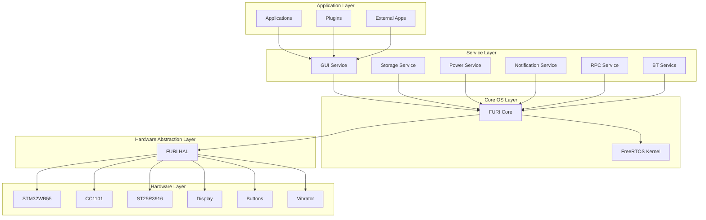
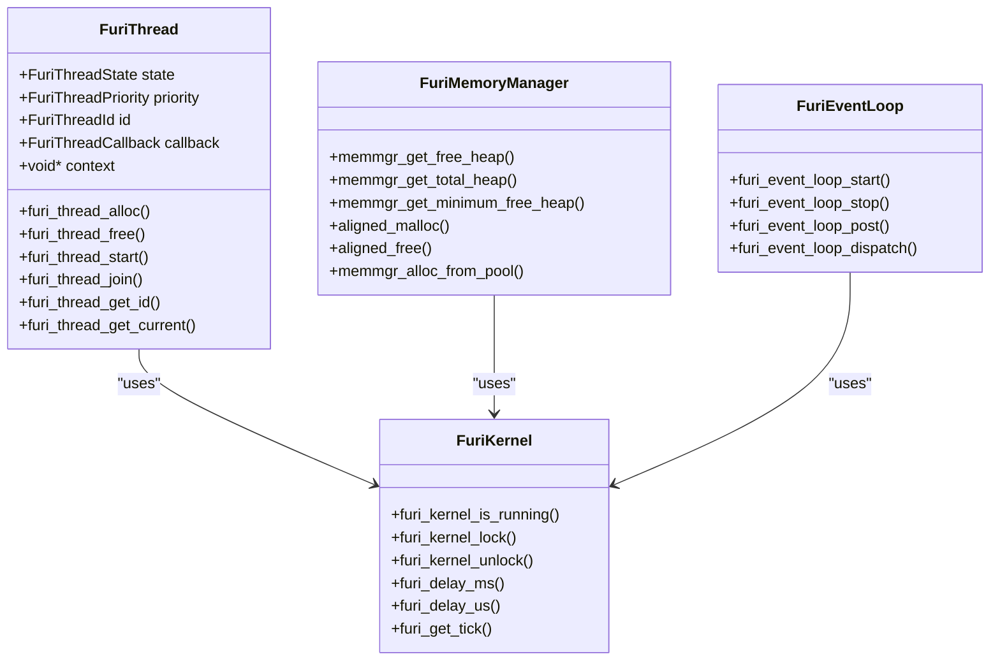
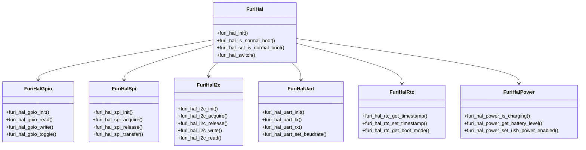
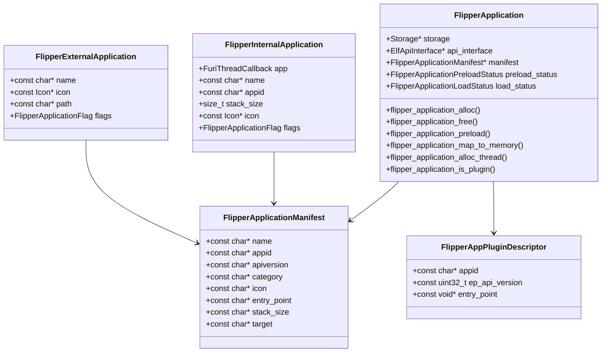
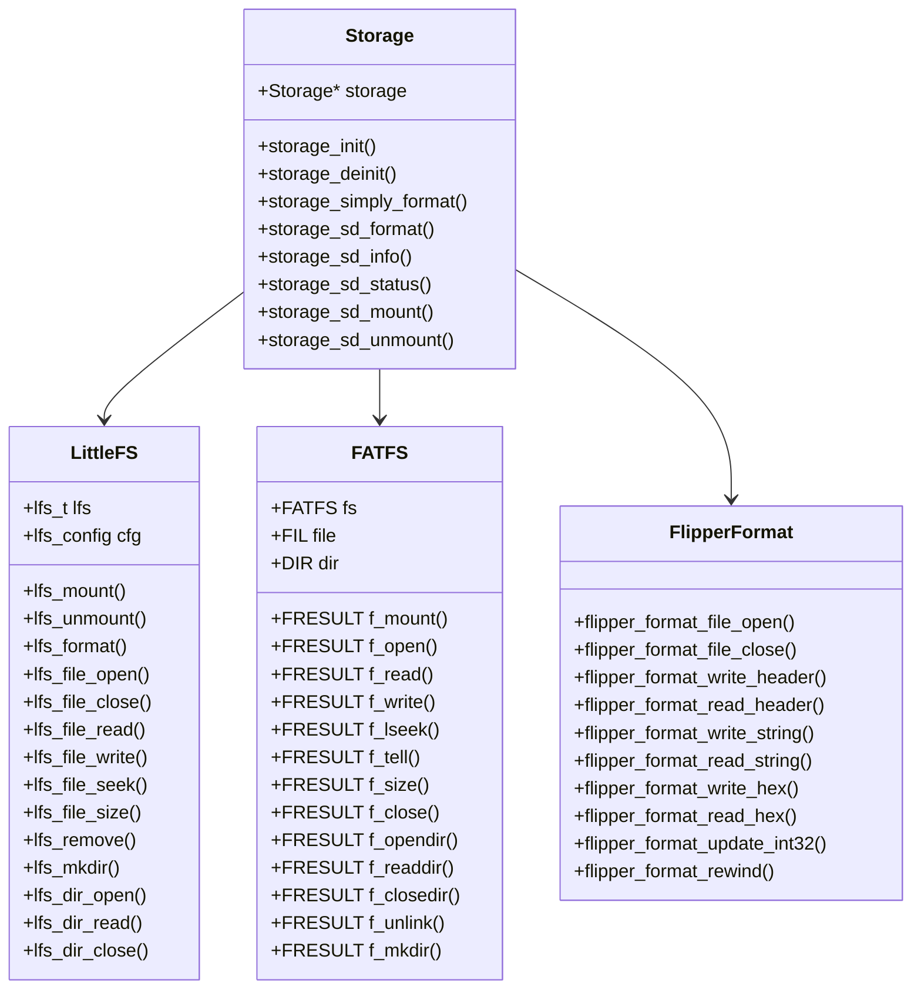
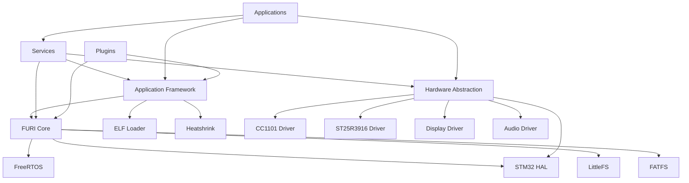

# Core Architecture

<cite>
**Referenced Files in This Document**   
- [furi.h](file://furi\furi.h)
- [furi.c](file://furi\furi.c)
- [flipper.h](file://furi\flipper.h)
- [flipper.c](file://furi\flipper.c)
- [furi_hal.h](file://targets\furi_hal_include\furi_hal.h)
- [kernel.h](file://furi\core\kernel.h)
- [thread.h](file://furi\core\thread.h)
- [memmgr.h](file://furi\core\memmgr.h)
- [flipper_application.h](file://lib\flipper_application\flipper_application.h)
- [applications.h](file://applications\services\applications.h)
- [lfs.h](file://lib\littlefs\lfs.h)
- [ff.h](file://lib\fatfs\ff.h)
</cite>

## Table of Contents
1. [Introduction](#introduction)
2. [Project Structure](#project-structure)
3. [Core Components](#core-components)
4. [Architecture Overview](#architecture-overview)
5. [Detailed Component Analysis](#detailed-component-analysis)
6. [Dependency Analysis](#dependency-analysis)
7. [Performance Considerations](#performance-considerations)
8. [Troubleshooting Guide](#troubleshooting-guide)
9. [Conclusion](#conclusion)

## Introduction
The Flipper Zero firmware is a sophisticated embedded system designed for hardware interaction and analysis. This document provides comprehensive architectural documentation for the core components of the firmware, focusing on the layered architecture with clear separation between hardware abstraction, core services, and applications. The system employs a modular design with service-oriented architecture and plugin-based extensibility, enabling flexible expansion and customization. Built on FreeRTOS, the firmware manages real-time operations while providing a rich set of services for application development. The architecture emphasizes security, memory management, and real-time performance across various hardware interfaces and communication protocols.

## Project Structure

```mermaid
graph TD
A[Firmware Root] --> B[Applications]
A --> C[furi]
A --> D[lib]
A --> E[targets]
A --> F[documentation]
A --> G[scripts]
B --> B1[Main]
B --> B2[Services]
B --> B3[Settings]
B --> B4[Debug]
B --> B5[External]
B --> B6[Examples]
C --> C1[Core]
C --> C2[furi.c]
C --> C3[furi.h]
C --> C4[flipper.c]
C --> C5[flipper.h]
D --> D1[flipper_application]
D --> D2[littlefs]
D --> D3[fatfs]
D --> D4[FreeRTOS-glue]
D --> D5[subghz]
D --> D6[nfc]
D --> D7[ibutton]
D --> D8[infrared]
E --> E1[furi_hal_include]
E --> E2[f7]
E --> E3[f18]
F --> F1[devboard]
F --> F2[file_formats]
F --> F3[js]
G --> G1[fbt_tools]
G --> G2[scripts]
```

**Diagram sources**
- [furi\furi.h](file://furi\furi.h)
- [applications\services\applications.h](file://applications\services\applications.h)
- [lib\flipper_application\flipper_application.h](file://lib\flipper_application\flipper_application.h)

**Section sources**
- [furi\furi.h](file://furi\furi.h)
- [applications\services\applications.h](file://applications\services\applications.h)

## Core Components

The Flipper Zero firmware consists of several core components that work together to provide a robust platform for hardware interaction and analysis. The FURI (Flipper Universal Runtime Interface) core provides the foundational operating system services including threading, memory management, and inter-process communication. The hardware abstraction layer (HAL) offers a consistent interface to the underlying hardware components, while the application framework enables the development and execution of both built-in and third-party applications. The system leverages FreeRTOS for real-time task scheduling and synchronization, with careful attention to memory constraints and power efficiency. The plugin architecture allows for extensibility while maintaining system stability and security.

**Section sources**
- [furi\furi.h](file://furi\furi.h)
- [furi\flipper.h](file://furi\flipper.h)
- [furi\core\kernel.h](file://furi\core\kernel.h)
- [furi\core\thread.h](file://furi\core\thread.h)

## Architecture Overview

**Diagram sources**
- [furi\furi.h](file://furi\furi.h)
- [targets\furi_hal_include\furi_hal.h](file://targets\furi_hal_include\furi_hal.h)
- [applications\services\applications.h](file://applications\services\applications.h)

**Section sources**
- [furi\furi.h](file://furi\furi.h)
- [furi\flipper.h](file://furi\flipper.h)
- [targets\furi_hal_include\furi_hal.h](file://targets\furi_hal_include\furi_hal.h)

## Detailed Component Analysis

### FURI Core Analysis

The FURI (Flipper Universal Runtime Interface) core serves as the foundation of the Flipper Zero firmware, providing essential operating system primitives and services. It acts as a middleware layer between the FreeRTOS kernel and the higher-level application framework, offering a more user-friendly API while maintaining real-time performance characteristics. The core components include thread management, memory allocation, event handling, and inter-process communication mechanisms.

**Diagram sources**
- [furi\core\thread.h](file://furi\core\thread.h)
- [furi\core\kernel.h](file://furi\core\kernel.h)
- [furi\core\memmgr.h](file://furi\core\memmgr.h)
- [furi\core\event_loop.h](file://furi\core\event_loop.h)

**Section sources**
- [furi\furi.h](file://furi\furi.h)
- [furi\furi.c](file://furi\furi.c)
- [furi\core\thread.h](file://furi\core\thread.h)
- [furi\core\kernel.h](file://furi\core\kernel.h)

### Hardware Abstraction Layer Analysis

The Hardware Abstraction Layer (HAL) provides a consistent interface to the underlying hardware components of the Flipper Zero device, insulating higher-level software from hardware-specific details. This layer enables portability across different hardware revisions and simplifies the development of applications that interact with physical components.

**Diagram sources**
- [targets\furi_hal_include\furi_hal.h](file://targets\furi_hal_include\furi_hal.h)
- [targets\furi_hal_include\furi_hal_gpio.h](file://targets\furi_hal_include\furi_hal_gpio.h)
- [targets\furi_hal_include\furi_hal_spi.h](file://targets\furi_hal_include\furi_hal_spi.h)
- [targets\furi_hal_include\furi_hal_i2c.h](file://targets\furi_hal_include\furi_hal_i2c.h)
- [targets\furi_hal_include\furi_hal_uart.h](file://targets\furi_hal_include\furi_hal_uart.h)
- [targets\furi_hal_include\furi_hal_rtc.h](file://targets\furi_hal_include\furi_hal_rtc.h)
- [targets\furi_hal_include\furi_hal_power.h](file://targets\furi_hal_include\furi_hal_power.h)

**Section sources**
- [targets\furi_hal_include\furi_hal.h](file://targets\furi_hal_include\furi_hal.h)
- [targets\furi_hal_include\furi_hal_gpio.h](file://targets\furi_hal_include\furi_hal_gpio.h)
- [targets\furi_hal_include\furi_hal_spi.h](file://targets\furi_hal_include\furi_hal_spi.h)

### Application Framework Analysis

The application framework in Flipper Zero firmware provides a structured environment for developing and executing both built-in and third-party applications. It manages the lifecycle of applications, handles inter-application communication, and provides access to system services through a well-defined API.

**Diagram sources**
- [lib\flipper_application\flipper_application.h](file://lib\flipper_application\flipper_application.h)
- [applications\services\applications.h](file://applications\services\applications.h)

**Section sources**
- [lib\flipper_application\flipper_application.h](file://lib\flipper_application\flipper_application.h)
- [applications\services\applications.h](file://applications\services\applications.h)

### Storage Subsystem Analysis

The storage subsystem in Flipper Zero firmware provides persistent data storage capabilities using both LittleFS and FATFS file systems. This dual approach allows for efficient storage management while maintaining compatibility with standard file system formats.

**Diagram sources**
- [lib\littlefs\lfs.h](file://lib\littlefs\lfs.h)
- [lib\fatfs\ff.h](file://lib\fatfs\ff.h)
- [lib\flipper_format\flipper_format.h](file://lib\flipper_format\flipper_format.h)

**Section sources**
- [lib\littlefs\lfs.h](file://lib\littlefs\lfs.h)
- [lib\fatfs\ff.h](file://lib\fatfs\ff.h)
- [lib\flipper_format\flipper_format.h](file://lib\flipper_format\flipper_format.h)

## Dependency Analysis

**Diagram sources**
- [furi\furi.h](file://furi\furi.h)
- [lib\flipper_application\flipper_application.h](file://lib\flipper_application\flipper_application.h)
- [targets\furi_hal_include\furi_hal.h](file://targets\furi_hal_include\furi_hal.h)

**Section sources**
- [furi\furi.h](file://furi\furi.h)
- [lib\flipper_application\flipper_application.h](file://lib\flipper_application\flipper_application.h)
- [targets\furi_hal_include\furi_hal.h](file://targets\furi_hal_include\furi_hal.h)

## Performance Considerations

The Flipper Zero firmware is designed with careful attention to performance and resource constraints typical of embedded systems. The architecture balances real-time requirements with power efficiency and memory usage. The use of FreeRTOS enables deterministic task scheduling with minimal overhead, while the FURI core provides higher-level abstractions that simplify development without sacrificing performance. Memory management is optimized through the use of static allocation where possible and careful heap management for dynamic allocation. The system employs various techniques to minimize power consumption, including sleep modes and peripheral power management. Real-time performance is maintained through priority-based scheduling and careful management of interrupt service routines. The file system implementation is optimized for the flash memory characteristics of the device, with wear leveling and efficient block management.

**Section sources**
- [furi\core\memmgr.h](file://furi\core\memmgr.h)
- [furi\core\kernel.h](file://furi\core\kernel.h)
- [furi\core\thread.h](file://furi\core\thread.h)

## Troubleshooting Guide

When diagnosing issues with the Flipper Zero firmware, it is important to understand the system architecture and component interactions. Common issues often relate to memory allocation, thread synchronization, or hardware interface problems. The system provides extensive logging capabilities through the FURI logging subsystem, which can be accessed via the debug interface. Memory issues can be diagnosed using the heap monitoring functions provided by the memory manager. Thread-related issues can be investigated using the thread enumeration and status reporting functions. Hardware interface problems can often be traced through the HAL layer, which provides consistent error reporting across different peripheral types. The build system includes tools for analyzing application size and memory usage, which can help identify potential resource constraints. When developing plugins, it is important to adhere to the API versioning system to ensure compatibility with the host application.

**Section sources**
- [furi\core\log.h](file://furi\core\log.h)
- [furi\core\memmgr.h](file://furi\core\memmgr.h)
- [furi\core\thread.h](file://furi\core\thread.h)
- [targets\furi_hal_include\furi_hal.h](file://targets\furi_hal_include\furi_hal.h)

## Conclusion

The Flipper Zero firmware architecture represents a sophisticated embedded system design that balances functionality, performance, and extensibility. The layered architecture with clear separation between hardware abstraction, core services, and applications enables robust and maintainable software development. The use of FreeRTOS provides a solid foundation for real-time operations, while the FURI core adds higher-level abstractions that simplify application development. The plugin-based extensibility model allows for community-driven expansion of functionality while maintaining system stability. The comprehensive hardware abstraction layer ensures portability across different hardware revisions and simplifies interaction with physical components. The storage subsystem provides reliable persistent data storage with support for both custom and standard file system formats. Overall, the architecture demonstrates careful consideration of the constraints and requirements of an embedded hardware analysis tool, resulting in a flexible and powerful platform for security research and hardware interaction.