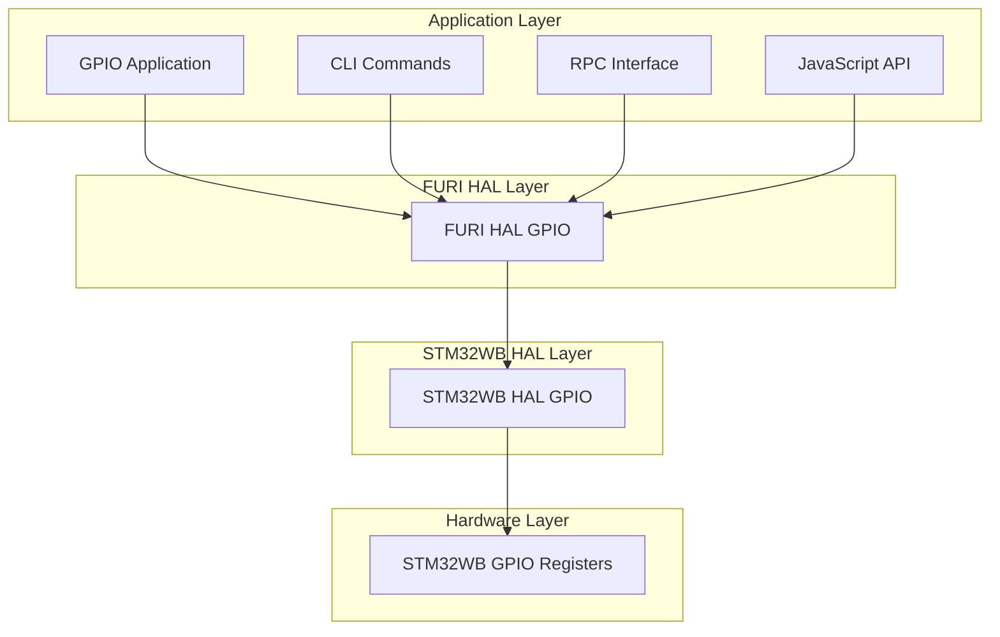
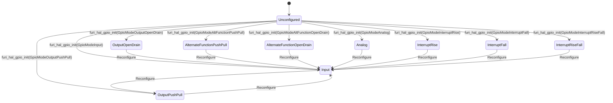
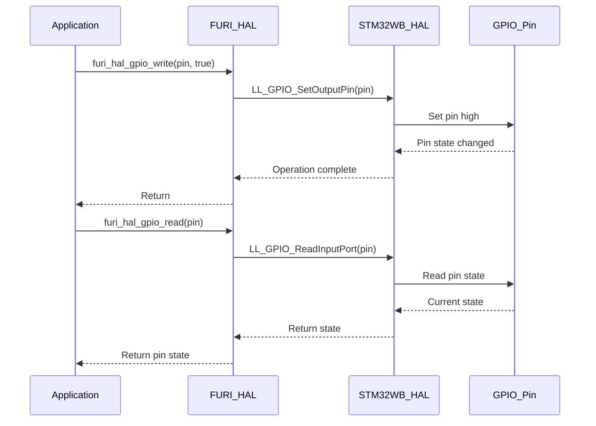
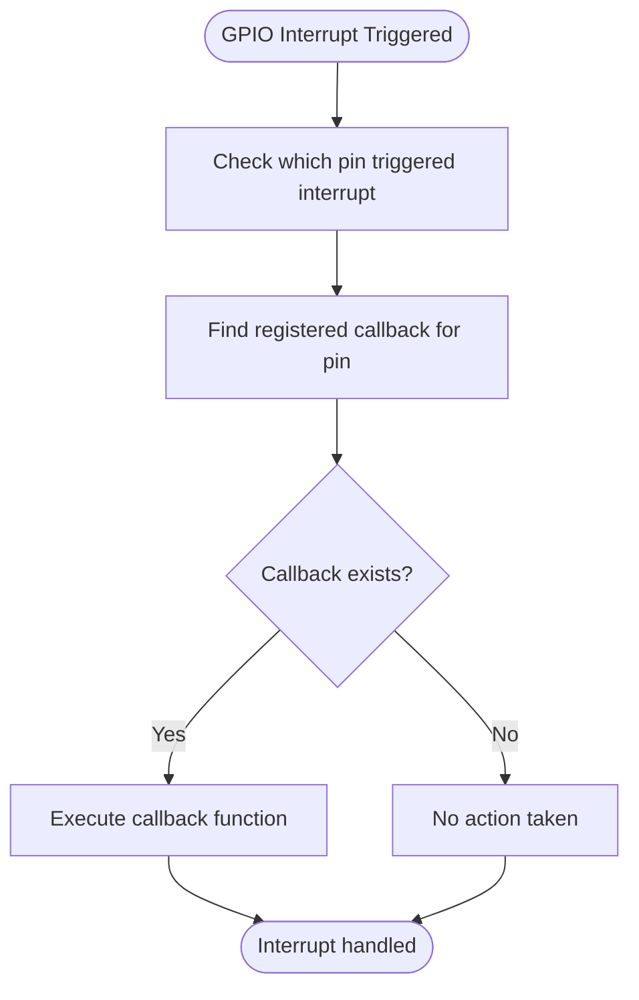
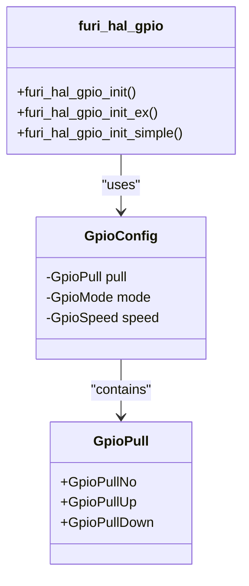
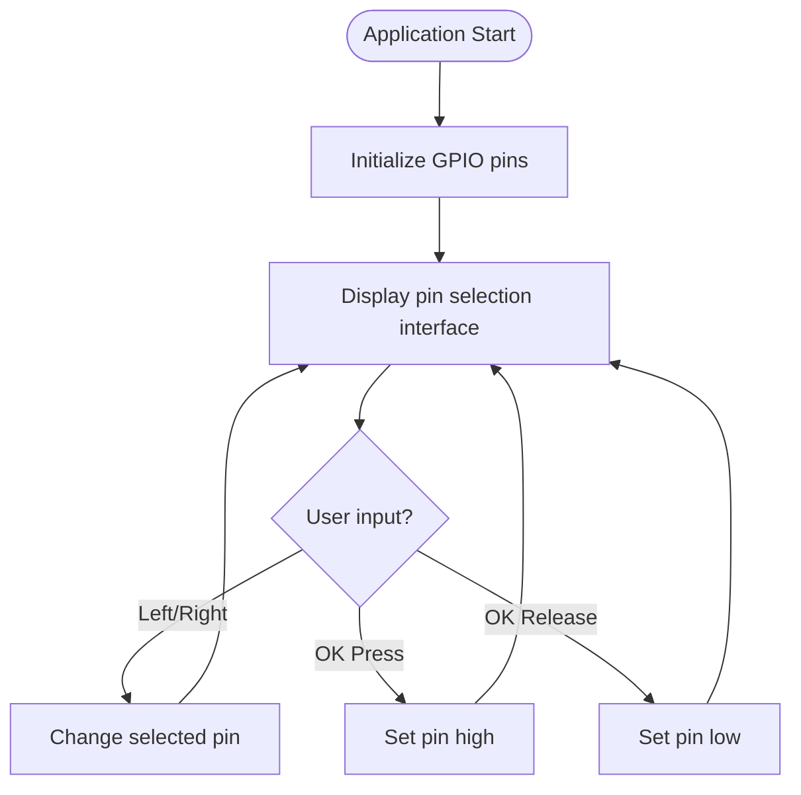
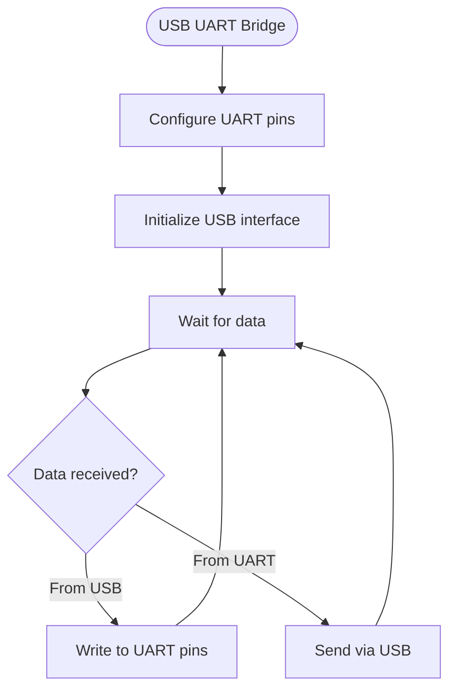
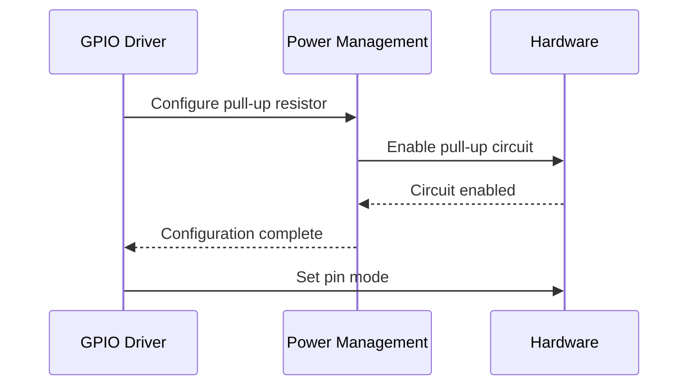
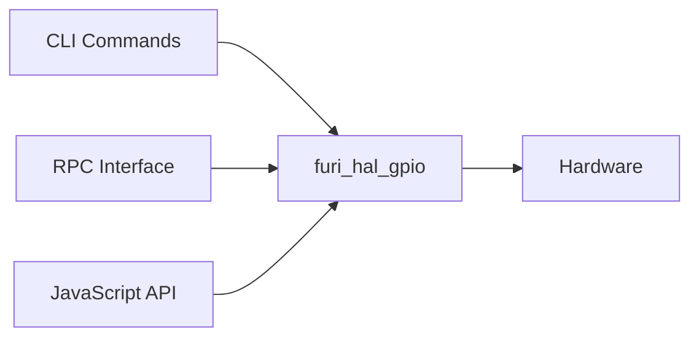

# GPIO Interface

<cite>
**Referenced Files in This Document**   
- [furi_hal_gpio.c](file://targets/f7/furi_hal/furi_hal_gpio.c)
- [furi_hal_gpio.h](file://targets/f7/furi_hal/furi_hal_gpio.h)
- [gpio_app.c](file://applications/main/gpio/gpio_app.c)
- [gpio_app_i.h](file://applications/main/gpio/gpio_app_i.h)
- [gpio_test.c](file://applications/main/gpio/views/gpio_test.c)
- [gpio_usb_uart.c](file://applications/main/gpio/views/gpio_usb_uart.c)
- [cli_command_gpio.c](file://applications/services/cli/cli_command_gpio.c)
- [rpc_gpio.c](file://applications/services/rpc/rpc_gpio.c)
- [furi_hal_resources.h](file://targets/f7/furi_hal/furi_hal_resources.h)
- [stm32wbxx_hal_gpio.h](file://lib/stm32wb_hal/Inc/stm32wbxx_hal_gpio.h)
- [stm32wbxx_hal_gpio.c](file://lib/stm32wb_hal/Src/stm32wbxx_hal_gpio.c)
- [js_gpio.c](file://applications/system/js_app/modules/js_gpio.c)
</cite>

## Table of Contents
1. [Introduction](#introduction)
2. [GPIO Architecture Overview](#gpio-architecture-overview)
3. [Pin Configuration and Modes](#pin-configuration-and-modes)
4. [Input/Output Operations](#inputoutput-operations)
5. [Interrupt and Event Handling](#interrupt-and-event-handling)
6. [Pull-up/Pull-down Resistor Control](#pull-uppull-down-resistor-control)
7. [API Functions and Usage](#api-functions-and-usage)
8. [Application Examples](#application-examples)
9. [Integration with Other Components](#integration-with-other-components)
10. [Common Issues and Troubleshooting](#common-issues-and-troubleshooting)
11. [Performance Optimization](#performance-optimization)

## Introduction

The GPIO (General Purpose Input/Output) interface in the Flipper Zero firmware provides a comprehensive system for controlling and monitoring external hardware through programmable pins. This documentation details the implementation of the GPIO driver, covering pin configuration, input/output modes, interrupt handling, and pull-up/pull-down resistor control. The system is designed to be accessible to beginners while providing sufficient technical depth for experienced developers regarding register-level operations and performance optimization.

The GPIO subsystem is built on multiple layers, with the STM32WB HAL (Hardware Abstraction Layer) providing low-level register access, FURI HAL offering a simplified interface, and application-level components providing user-friendly tools for GPIO manipulation. This layered architecture allows for both high-level convenience and low-level control when needed.

**Section sources**
- [furi_hal_gpio.c](file://targets/f7/furi_hal/furi_hal_gpio.c#L1-L343)
- [furi_hal_gpio.h](file://targets/f7/furi_hal/furi_hal_gpio.h#L1-L100)

## GPIO Architecture Overview

The GPIO architecture in Flipper Zero consists of multiple layers that provide abstraction from the hardware registers to user applications. At the lowest level, the STM32WB microcontroller's GPIO registers are accessed through the STM32WB HAL library. Above this, the FURI HAL layer provides a simplified interface with safety checks and additional functionality. The application layer then builds on this foundation to provide user-facing tools and utilities.

**Diagram sources **
- [furi_hal_gpio.c](file://targets/f7/furi_hal/furi_hal_gpio.c#L1-L343)
- [stm32wbxx_hal_gpio.h](file://lib/stm32wb_hal/Inc/stm32wbxx_hal_gpio.h#L1-L329)

**Section sources**
- [furi_hal_gpio.c](file://targets/f7/furi_hal/furi_hal_gpio.c#L1-L343)
- [stm32wbxx_hal_gpio.h](file://lib/stm32wb_hal/Inc/stm32wbxx_hal_gpio.h#L1-L329)

## Pin Configuration and Modes

The GPIO driver supports multiple pin configuration modes, each serving different purposes in hardware interfacing. The available modes include input, output (push-pull and open-drain), alternate function (for peripheral interfaces), analog, and various interrupt modes.

The configuration process involves setting the pin mode, pull-up/pull-down resistors, speed, and alternate function (when applicable). The FURI HAL provides several functions for pin initialization, with `furi_hal_gpio_init()` being the most comprehensive, allowing specification of all parameters.

**Diagram sources **
- [furi_hal_gpio.c](file://targets/f7/furi_hal/furi_hal_gpio.c#L62-L191)
- [stm32wbxx_hal_gpio.h](file://lib/stm32wb_hal/Inc/stm32wbxx_hal_gpio.h#L47-L125)

**Section sources**
- [furi_hal_gpio.c](file://targets/f7/furi_hal/furi_hal_gpio.c#L62-L191)
- [stm32wbxx_hal_gpio.h](file://lib/stm32wb_hal/Inc/stm32wbxx_hal_gpio.h#L47-L125)

## Input/Output Operations

The GPIO interface provides functions for reading from and writing to GPIO pins. These operations are essential for digital communication with external devices and sensors.

For output operations, the system supports setting pin state to high or low using `furi_hal_gpio_write()`. The function directly manipulates the BSRR (Bit Set/Reset Register) of the GPIO peripheral, ensuring atomic operations that are safe from interruption. For input operations, `furi_hal_gpio_read()` reads the current state of a pin from the IDR (Input Data Register).

**Diagram sources **
- [furi_hal_gpio.c](file://targets/f7/furi_hal/furi_hal_gpio.c#L196-L250)
- [stm32wbxx_hal_gpio.c](file://lib/stm32wb_hal/Src/stm32wbxx_hal_gpio.c#L369-L404)

**Section sources**
- [furi_hal_gpio.c](file://targets/f7/furi_hal/furi_hal_gpio.c#L196-L250)
- [stm32wbxx_hal_gpio.c](file://lib/stm32wb_hal/Src/stm32wbxx_hal_gpio.c#L369-L404)

## Interrupt and Event Handling

The GPIO subsystem provides robust interrupt and event handling capabilities, allowing applications to respond to external hardware events efficiently. The system supports rising edge, falling edge, and both edge interrupts, as well as event generation without CPU intervention.

Interrupt handling is implemented through a callback mechanism. When an interrupt occurs, the EXTI (External Interrupt) handler calls a registered callback function. The FURI HAL layer manages a table of interrupt callbacks, allowing multiple applications to register for GPIO interrupts on different pins.

**Diagram sources **
- [furi_hal_gpio.c](file://targets/f7/furi_hal/furi_hal_gpio.c#L196-L343)
- [stm32wbxx_hal_gpio.c](file://lib/stm32wb_hal/Src/stm32wbxx_hal_gpio.c#L515-L551)

**Section sources**
- [furi_hal_gpio.c](file://targets/f7/furi_hal/furi_hal_gpio.c#L196-L343)
- [stm32wbxx_hal_gpio.c](file://lib/stm32wb_hal/Src/stm32wbxx_hal_gpio.c#L515-L551)

## Pull-up/Pull-down Resistor Control

The GPIO driver provides control over internal pull-up and pull-down resistors, which are essential for ensuring defined logic levels when pins are not actively driven. The system supports three pull configurations: no pull (floating), pull-up, and pull-down.

Pull resistor configuration is handled through the `furi_hal_gpio_init()` function, which sets both the GPIO peripheral's pull configuration and the power management unit (PWR) settings. This dual configuration ensures proper operation in different power modes.

**Diagram sources **
- [furi_hal_gpio.c](file://targets/f7/furi_hal/furi_hal_gpio.c#L105-L124)
- [stm32wbxx_hal_pwr_ex.c](file://lib/stm32wb_hal/Src/stm32wbxx_hal_pwr_ex.c#L332-L367)

**Section sources**
- [furi_hal_gpio.c](file://targets/f7/furi_hal/furi_hal_gpio.c#L105-L124)
- [stm32wbxx_hal_pwr_ex.c](file://lib/stm32wb_hal/Src/stm32wbxx_hal_pwr_ex.c#L332-L367)

## API Functions and Usage

The GPIO API provides a comprehensive set of functions for pin manipulation, organized into initialization, input/output, and interrupt handling categories. The API is designed to be intuitive while providing access to all hardware capabilities.

### Core API Functions

| Function | Parameters | Return Value | Description |
|--------|-----------|-------------|-------------|
| furi_hal_gpio_init | pin, mode, pull, speed | void | Initialize GPIO pin with specified parameters |
| furi_hal_gpio_init_simple | pin, mode | void | Initialize GPIO pin with default pull and speed |
| furi_hal_gpio_write | pin, state | void | Set GPIO pin output state |
| furi_hal_gpio_read | pin | bool | Read GPIO pin input state |
| furi_hal_gpio_add_int_callback | pin, callback, context | void | Register interrupt callback for pin |
| furi_hal_gpio_remove_int_callback | pin | void | Remove interrupt callback for pin |
| furi_hal_gpio_enable_int_callback | pin | void | Enable interrupt for pin |
| furi_hal_gpio_disable_int_callback | pin | void | Disable interrupt for pin |

The API follows a consistent pattern where functions are prefixed with `furi_hal_gpio_` and parameters are passed in a logical order. The `furi_hal_gpio_init_simple()` function is recommended for basic use cases, while `furi_hal_gpio_init()` provides full control over pin configuration.

**Section sources**
- [furi_hal_gpio.c](file://targets/f7/furi_hal/furi_hal_gpio.c#L58-L250)
- [furi_hal_gpio.h](file://targets/f7/furi_hal/furi_hal_gpio.h#L1-L100)

## Application Examples

The GPIO subsystem is used in various applications within the Flipper Zero firmware, demonstrating different use cases and patterns.

### GPIO Test Application

The GPIO test application allows users to interactively test GPIO pins by configuring them as outputs and toggling their state. This application demonstrates the use of the GPIO API in a user-facing context.

**Diagram sources **
- [gpio_test.c](file://applications/main/gpio/views/gpio_test.c#L1-L150)
- [gpio_app.c](file://applications/main/gpio/gpio_app.c#L24-L136)

### USB UART Bridge

The USB UART bridge application demonstrates advanced GPIO usage by implementing a serial communication interface over USB. This application configures GPIO pins for UART communication and handles data transmission and reception.

**Diagram sources **
- [gpio_usb_uart.c](file://applications/main/gpio/views/gpio_usb_uart.c#L1-L163)
- [usb_uart_bridge.c](file://applications/main/gpio/usb_uart_bridge.c#L1-L100)

**Section sources**
- [gpio_test.c](file://applications/main/gpio/views/gpio_test.c#L1-L150)
- [gpio_usb_uart.c](file://applications/main/gpio/views/gpio_usb_uart.c#L1-L163)
- [gpio_app.c](file://applications/main/gpio/gpio_app.c#L24-L136)

## Integration with Other Components

The GPIO interface integrates with several other components in the Flipper Zero system, enabling complex functionality and user interaction.

### Power Management Integration

The GPIO subsystem works closely with the power management system to ensure proper operation in different power states. When configuring pull resistors, both the GPIO peripheral and the power management unit (PWR) are configured to maintain consistent behavior across power modes.

**Diagram sources **
- [furi_hal_gpio.c](file://targets/f7/furi_hal/furi_hal_gpio.c#L105-L124)
- [stm32wbxx_hal_pwr_ex.c](file://lib/stm32wb_hal/Src/stm32wbxx_hal_pwr_ex.c#L332-L367)

### CLI and RPC Integration

The GPIO functionality is exposed through both CLI (Command Line Interface) and RPC (Remote Procedure Call) interfaces, allowing external control and scripting.

**Diagram sources **
- [cli_command_gpio.c](file://applications/services/cli/cli_command_gpio.c#L77-L156)
- [rpc_gpio.c](file://applications/services/rpc/rpc_gpio.c#L135-L173)
- [js_gpio.c](file://applications/system/js_app/modules/js_gpio.c#L32-L47)

**Section sources**
- [cli_command_gpio.c](file://applications/services/cli/cli_command_gpio.c#L77-L156)
- [rpc_gpio.c](file://applications/services/rpc/rpc_gpio.c#L135-L173)
- [js_gpio.c](file://applications/system/js_app/modules/js_gpio.c#L32-L47)

## Common Issues and Troubleshooting

Several common issues can occur when working with GPIO pins, and understanding these can help in troubleshooting and preventing problems.

### Pin Contention

Pin contention occurs when multiple software components attempt to control the same GPIO pin simultaneously. This can lead to unpredictable behavior and potential hardware damage. The system does not currently have a built-in mechanism to prevent pin contention, so careful software design is required.

### Signal Integrity

Signal integrity issues can arise from improper pull resistor configuration, long wire runs, or electromagnetic interference. Using appropriate pull resistors and minimizing wire length can help mitigate these issues.

### Timing Constraints

GPIO operations have timing constraints that must be considered in high-speed applications. The time required for pin state changes and interrupt response should be accounted for in timing-critical applications.

**Section sources**
- [furi_hal_gpio.c](file://targets/f7/furi_hal/furi_hal_gpio.c#L1-L343)
- [cli_command_gpio.c](file://applications/services/cli/cli_command_gpio.c#L93-L101)

## Performance Optimization

The GPIO subsystem includes several features for performance optimization, particularly in interrupt handling and atomic operations.

### Critical Sections

The GPIO driver uses critical sections (disabling interrupts) during pin configuration to ensure atomicity and prevent race conditions. This is particularly important when configuring interrupt modes to avoid missing interrupts during reconfiguration.

### Direct Register Access

For performance-critical applications, direct register access through the LL (Low Layer) functions can provide faster operation than the HAL functions. However, this bypasses safety checks and should be used with caution.

### Batch Operations

While the current API focuses on single-pin operations, understanding the underlying register structure can enable batch operations for improved performance when manipulating multiple pins simultaneously.

**Section sources**
- [furi_hal_gpio.c](file://targets/f7/furi_hal/furi_hal_gpio.c#L87-L193)
- [stm32wbxx_hal_gpio.c](file://lib/stm32wb_hal/Src/stm32wbxx_hal_gpio.c#L164-L404)