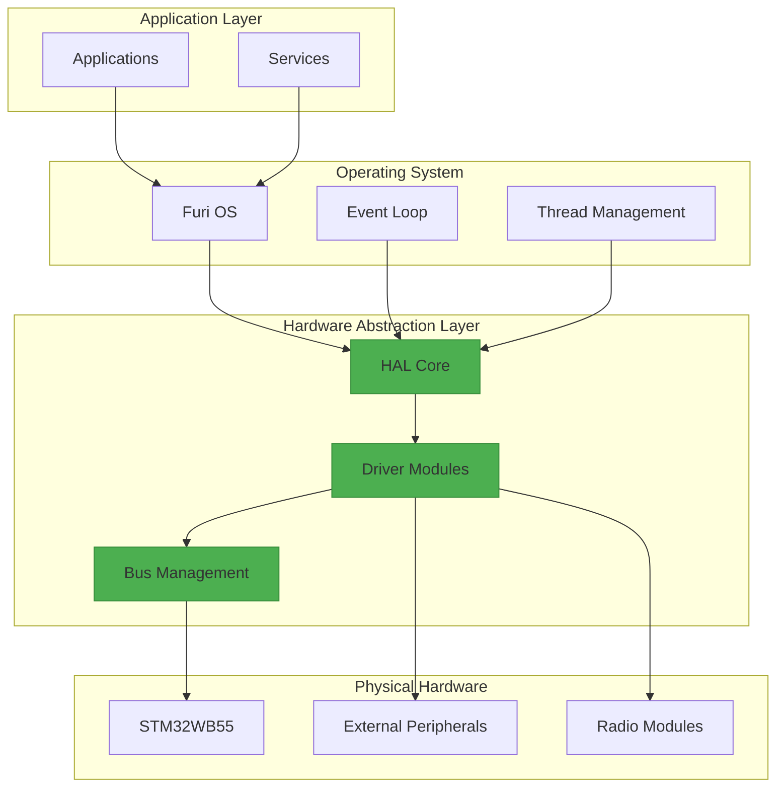
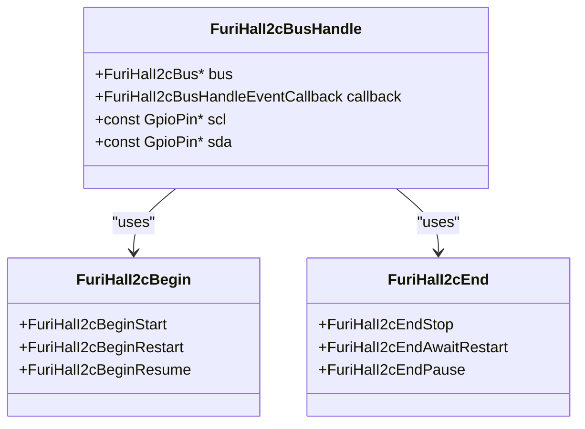
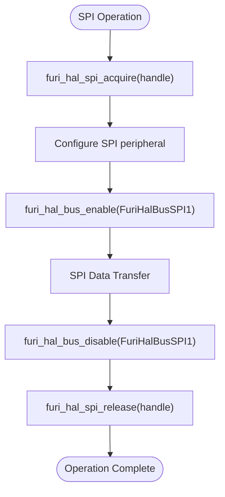
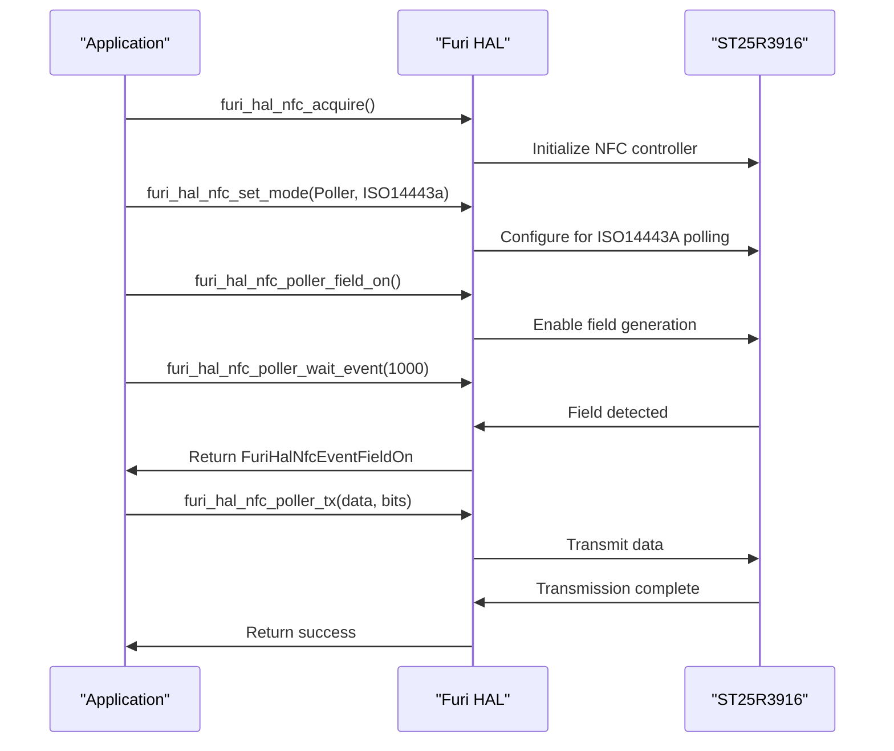
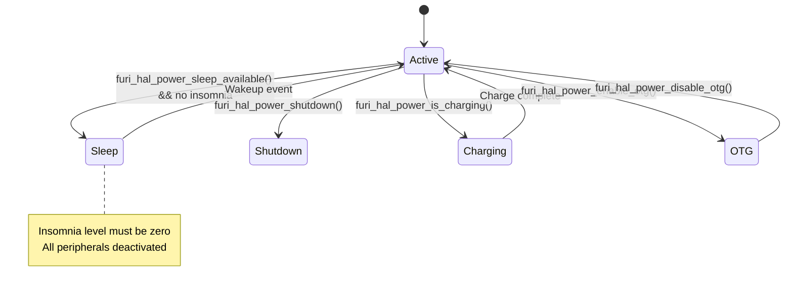

# Hardware Abstraction Layer

<cite>
**Referenced Files in This Document**   
- [furi_hal.h](file://targets/furi_hal_include/furi_hal.h)
- [furi_hal_i2c.h](file://targets/furi_hal_include/furi_hal_i2c.h)
- [furi_hal_spi.h](file://targets/furi_hal_include/furi_hal_spi.h)
- [furi_hal_power.h](file://targets/furi_hal_include/furi_hal_power.h)
- [furi_hal_nfc.h](file://targets/furi_hal_include/furi_hal_nfc.h)
- [furi_hal_adc.h](file://targets/furi_hal_include/furi_hal_adc.h)
- [furi_hal_bt.h](file://targets/furi_hal_include/furi_hal_bt.h)
- [furi_hal_usb.h](file://targets/furi_hal_include/furi_hal_usb.h)
- [furi_hal_bus.h](file://targets/f7/furi_hal/furi_hal_bus.h)
- [furi_hal.c](file://targets/f7/furi_hal/furi_hal.c)
- [furi_hal_bus.c](file://targets/f7/furi_hal/furi_hal_bus.c)
</cite>

## Table of Contents
1. [Introduction](#introduction)
2. [Architecture Overview](#architecture-overview)
3. [Core Components](#core-components)
4. [Hardware Module Interfaces](#hardware-module-interfaces)
5. [Initialization and Power Management](#initialization-and-power-management)
6. [Interrupt and Real-Time Considerations](#interrupt-and-real-time-considerations)
7. [Memory and Performance Optimization](#memory-and-performance-optimization)
8. [Error Handling and Reliability](#error-handling-and-reliability)
9. [Conclusion](#conclusion)

## Introduction

The Hardware Abstraction Layer (HAL) in the Flipper Zero firmware provides a consistent interface between the operating system services and the underlying hardware peripherals. This architectural layer enables application developers to interact with hardware components through standardized APIs without requiring direct register manipulation or hardware-specific knowledge. The HAL is designed with modularity, reliability, and real-time performance in mind, supporting critical hardware interfaces including GPIO, I2C, SPI, UART, NFC, power management, and various radio technologies.

The HAL implementation follows a driver-based architecture where each hardware module has dedicated driver components that manage initialization, configuration, data transfer, and power state transitions. This documentation details the architectural patterns, component interactions, and technical decisions behind the HAL implementation, providing insight into how the Flipper Zero firmware achieves reliable hardware operation across diverse use cases.

**Section sources**
- [furi_hal.h](file://targets/furi_hal_include/furi_hal.h#L1-L62)

## Architecture Overview

The Hardware Abstraction Layer in Flipper Zero firmware follows a modular driver architecture that sits between the core OS services and physical hardware components. The HAL provides hardware-agnostic APIs that abstract the complexities of direct hardware register manipulation while maintaining the performance characteristics required for real-time operations.

**Diagram sources**
- [furi_hal.h](file://targets/furi_hal_include/furi_hal.h#L13-L43)
- [furi_hal.c](file://targets/f7/furi_hal/furi_hal.c#L43-L72)

## Core Components

The HAL architecture is built around several core components that provide foundational services for hardware interaction. The central component is the HAL core, exposed through `furi_hal.h`, which coordinates initialization of all hardware modules and provides system-level services. The HAL implements a two-phase initialization process with `furi_hal_init_early()` for essential subsystems and `furi_hal_init()` for full system initialization.

Bus management is handled by the `furi_hal_bus` subsystem, which controls clocking and reset states for peripheral buses (AHB, APB) on the STM32WB55 microcontroller. This component ensures proper power sequencing and resource allocation for hardware peripherals. The bus management system uses critical sections to protect register access during state transitions, ensuring thread safety in the real-time environment.

The HAL employs a handle-based resource management pattern where drivers acquire and release hardware resources through dedicated handle structures. This approach prevents resource conflicts between different system components and applications. For example, SPI and I2C interfaces use bus handle structures that manage GPIO configuration, clock enablement, and mutual exclusion during data transfers.

**Section sources**
- [furi_hal.h](file://targets/furi_hal_include/furi_hal.h#L49-L62)
- [furi_hal.c](file://targets/f7/furi_hal/furi_hal.c#L43-L72)
- [furi_hal_bus.h](file://targets/f7/furi_hal/furi_hal_bus.h#L10-L68)
- [furi_hal_bus.c](file://targets/f7/furi_hal/furi_hal_bus.c#L88-L144)

## Hardware Module Interfaces

### I2C Interface

The I2C hardware module provides a comprehensive interface for communicating with I2C slave devices. The API supports standard operations including transmit (TX), receive (RX), and transmit-receive (TRX) transactions with configurable timing parameters. The implementation includes support for advanced I2C features such as repeated start conditions and clock stretching through the `FuriHalI2cBegin` and `FuriHalI2cEnd` enumeration types.

**Diagram sources**
- [furi_hal_i2c.h](file://targets/furi_hal_include/furi_hal_i2c.h#L16-L43)
- [furi_hal_i2c.h](file://targets/furi_hal_include/furi_hal_i2c.h#L54-L65)

### SPI Interface

The SPI subsystem implements a flexible interface for serial peripheral communication with support for DMA transfers. The design uses a bus and handle pattern where the bus represents the physical SPI peripheral and handles represent individual device connections. Each handle includes callback functions for bus events such as activation and deactivation, allowing for automatic GPIO and clock management.

The SPI implementation includes mutex protection for shared buses, ensuring that only one device can communicate at a time. The driver supports both standard SPI transactions and DMA-based transfers for high-throughput applications. Bus configuration is managed through event callbacks that enable and disable the peripheral clock as needed, optimizing power consumption.

**Diagram sources**
- [furi_hal_spi.h](file://targets/furi_hal_include/furi_hal_spi.h#L46-L60)
- [furi_hal_spi_config.c](file://targets/f7/furi_hal/furi_hal_spi_config.c#L101-L115)
- [furi_hal_spi_config.c](file://targets/f18/furi_hal/furi_hal_spi_config.c#L121-L135)

### NFC Interface

The NFC hardware module provides low-level access to the ST25R3916 NFC frontend controller. The interface supports multiple NFC technologies including ISO14443A/B, ISO15693, and FeliCa through the `FuriHalNfcTech` enumeration. The driver implements both poller (reader) and listener (tag) modes, enabling the Flipper Zero to interact with NFC devices or emulate NFC tags.

The NFC API uses an event-driven model where operations are initiated and then events are waited upon using `furi_hal_nfc_poller_wait_event()` or `furi_hal_nfc_listener_wait_event()`. This asynchronous approach allows for efficient handling of timing-critical NFC protocols while maintaining system responsiveness. The implementation includes specialized functions for protocol-specific operations such as ISO14443A short frame transmission and collision resolution parameter configuration.

**Diagram sources**
- [furi_hal_nfc.h](file://targets/furi_hal_include/furi_hal_nfc.h#L76-L93)
- [furi_hal_nfc.h](file://targets/furi_hal_include/furi_hal_nfc.h#L199-L208)
- [furi_hal_nfc.h](file://targets/furi_hal_include/furi_hal_nfc.h#L224-L237)

### Power Management Interface

The power management subsystem provides comprehensive control over the Flipper Zero's power system, including battery monitoring, charging control, and sleep management. The interface abstracts the BQ25896 charger and BQ27220 fuel gauge ICs, providing a unified API for power-related operations.

Key features include battery capacity monitoring, charge state detection, and OTG (On-The-Go) power supply control. The implementation includes "insomnia" mode management to prevent unwanted sleep during critical operations, with balanced entry and exit functions to ensure proper power state transitions. The API also provides methods for suppressing charging during sensitive operations to maintain clean power supply.

**Diagram sources**
- [furi_hal_power.h](file://targets/furi_hal_include/furi_hal_power.h#L18-L22)
- [furi_hal_power.h](file://targets/furi_hal_include/furi_hal_power.h#L44-L60)
- [furi_hal_power.h](file://targets/furi_hal_include/furi_hal_power.h#L96-L105)

## Initialization and Power Management

The HAL implements a sophisticated initialization sequence that ensures proper hardware configuration and power sequencing. The two-phase initialization process begins with `furi_hal_init_early()` which configures only essential subsystems such as the cortex core, clock system, and basic bus interfaces. This early initialization enables the system to reach a stable state before proceeding with full initialization.

The main initialization function `furi_hal_init()` sequentially initializes all hardware modules in a carefully ordered sequence to prevent dependency issues. The initialization order follows hardware dependency relationships, starting with low-level components like clock and interrupt controllers before initializing higher-level peripherals. Conditional compilation directives control the initialization of certain modules based on build configuration, such as excluding NFC and Sub-GHz initialization in RAM execution mode.

Power management is integrated throughout the HAL, with each driver module responsible for managing its own power state. The bus management system plays a crucial role in power optimization by disabling clock signals to unused peripherals and asserting reset lines to minimize power consumption. The implementation includes special modes like "suppress charge" which temporarily disables charging to provide clean power for sensitive measurements.

```mermaid
flowchart TD
Start([System Boot]) --> EarlyInit["furi_hal_init_early()"]
EarlyInit --> Cortex["furi_hal_cortex_init_early()"]
EarlyInit --> Clock["furi_hal_clock_init_early()"]
EarlyInit --> Bus["furi_hal_bus_init_early()"]
EarlyInit --> DMA["furi_hal_dma_init_early()"]
EarlyInit --> Resources["furi_hal_resources_init_early()"]
EarlyInit --> OS["furi_hal_os_init()"]
EarlyInit --> SPIConfig["furi_hal_spi_config_init_early()"]
EarlyInit --> I2C["furi_hal_i2c_init_early()"]
EarlyInit --> Light["furi_hal_light_init()"]
EarlyInit --> RTC["furi_hal_rtc_init_early()"]
EarlyInit --> Version["furi_hal_version_init()"]
EarlyInit --> MainInit["furi_hal_init()"]
MainInit --> MPU["furi_hal_mpu_init()"]
MainInit --> ADC["furi_hal_adc_init()"]
MainInit --> ClockFull["furi_hal_clock_init()"]
MainInit --> Random["furi_hal_random_init()"]
MainInit --> Serial["furi_hal_serial_control_init()"]
MainInit --> RTCFull["furi_hal_rtc_init()"]
MainInit --> Interrupt["furi_hal_interrupt_init()"]
MainInit --> Flash["furi_hal_flash_init()"]
MainInit --> ResourcesFull["furi_hal_resources_init()"]
MainInit --> SPI["furi_hal_spi_config_init()"]
MainInit --> Speaker["furi_hal_speaker_init()"]
MainInit --> Crypto["furi_hal_crypto_init()"]
MainInit --> I2CFull["furi_hal_i2c_init()"]
MainInit --> Power["furi_hal_power_init()"]
MainInit --> LightFull["furi_hal_light_init()"]
MainInit --> BT["furi_hal_bt_init()"]
MainInit --> Memory["furi_hal_memory_init()"]
MainInit --> USB["furi_hal_usb_init()"]
MainInit --> Vibro["furi_hal_vibro_init()"]
MainInit --> End([System Ready])
```

**Diagram sources**
- [furi_hal.c](file://targets/f18/furi_hal/furi_hal.c#L9-L31)
- [furi_hal.c](file://targets/f7/furi_hal/furi_hal.c#L43-L72)
- [furi_hal_power.h](file://targets/furi_hal_include/furi_hal_power.h#L50-L60)

## Interrupt and Real-Time Considerations

The HAL architecture is designed with real-time performance as a primary consideration, particularly for timing-critical operations such as NFC communication and radio protocols. The implementation uses direct register access and minimal abstraction layers to reduce latency in interrupt handling and time-sensitive operations.

Interrupt management is centralized through the `furi_hal_interrupt` module, which provides a consistent interface for configuring and handling hardware interrupts. The system uses FreeRTOS primitives for interrupt service routine (ISR) to task communication, ensuring that time-consuming operations are deferred to task context while maintaining rapid interrupt response.

For NFC operations, the HAL implements precise timing control through dedicated hardware timers that measure carrier cycles with microsecond accuracy. The `furi_hal_nfc_timer_fwt_start()` and `furi_hal_nfc_timer_block_tx_start()` functions provide frame wait time and block transmission timing for compliance with NFC protocol specifications. These timing functions are critical for reliable communication with NFC devices and tags.

The SPI and I2C drivers use DMA where available to minimize CPU utilization during data transfers, allowing the processor to handle other tasks while large data transfers occur in the background. Interrupt priorities are carefully assigned to ensure that time-critical operations such as NFC communication take precedence over less time-sensitive tasks.

**Section sources**
- [furi_hal_nfc.h](file://targets/furi_hal_include/furi_hal_nfc.h#L322-L357)
- [furi_hal.c](file://targets/f7/furi_hal/furi_hal.c#L50)
- [furi_hal_spi.h](file://targets/furi_hal_include/furi_hal_spi.h#L119-L124)

## Memory and Performance Optimization

The HAL implementation employs several strategies to optimize memory usage and performance in the resource-constrained environment of the Flipper Zero. Driver modules are designed to minimize RAM usage by using static allocation where possible and avoiding dynamic memory allocation in time-critical paths.

The bus management system optimizes power consumption by disabling unused peripherals and their clock domains. The `furi_hal_bus_disable()` function not only disables the peripheral clock but also asserts the reset line, ensuring that unused peripherals consume minimal power. This approach is particularly important for battery-powered operation and extended device runtime.

Performance-critical operations such as NFC communication use direct hardware register access rather than higher-level abstraction layers to minimize overhead. The implementation avoids unnecessary data copying and uses efficient bit manipulation techniques for register operations. For example, the I2C driver uses hardware-assisted CRC calculation when available to reduce CPU load during data transfers.

The HAL also implements resource pooling for frequently used operations. The SPI and I2C drivers maintain mutexes for shared buses, preventing resource conflicts while minimizing the overhead of mutual exclusion. Handle-based resource management ensures that hardware resources are properly released after use, preventing resource leaks in long-running applications.

**Section sources**
- [furi_hal_bus.c](file://targets/f7/furi_hal/furi_hal_bus.c#L242-L273)
- [furi_hal_spi.h](file://targets/furi_hal_include/furi_hal_spi.h#L52-L60)
- [furi_hal_i2c.h](file://targets/furi_hal_include/furi_hal_i2c.h#L58-L65)

## Error Handling and Reliability

The HAL implements comprehensive error handling mechanisms to ensure reliable hardware operation across various conditions. Each hardware module returns explicit error codes that indicate the nature of any failure, allowing calling code to handle errors appropriately. The NFC module, for example, defines specific error types for communication timeouts, buffer overflows, and incomplete frames.

Resource management follows strict acquisition and release patterns to prevent deadlocks and resource leaks. The handle-based design ensures that hardware resources are properly released even in error conditions. The implementation uses critical sections to protect register access during state transitions, preventing race conditions in multi-threaded environments.

For power-sensitive operations, the HAL includes validation checks to ensure that operations are only performed when power conditions are suitable. The power management system monitors battery voltage and temperature, preventing operations that could damage the battery or result in unreliable operation. The system also includes protection against improper state transitions, such as attempting to disable a peripheral that is already disabled.

The initialization sequence includes comprehensive self-tests to verify hardware functionality before enabling system operation. If critical hardware components fail to initialize properly, the system can enter a safe state or report the error to the user interface. This approach ensures that the device remains in a known, safe state even when hardware issues occur.

**Section sources**
- [furi_hal_nfc.h](file://targets/furi_hal_include/furi_hal_nfc.h#L62-L71)
- [furi_hal_bus.c](file://targets/f7/furi_hal/furi_hal_bus.c#L176-L207)
- [furi_hal_power.h](file://targets/furi_hal_include/furi_hal_power.h#L27-L42)

## Conclusion

The Hardware Abstraction Layer in the Flipper Zero firmware provides a robust, modular interface between the operating system and hardware peripherals. Through its driver-based architecture, the HAL enables reliable access to critical hardware components while abstracting the complexities of direct register manipulation. The implementation demonstrates careful consideration of real-time performance, power efficiency, and system reliability, making it well-suited for the diverse use cases of the Flipper Zero platform.

Key architectural strengths include the two-phase initialization system, handle-based resource management, and comprehensive error handling. The modular design allows for independent development and testing of hardware drivers while maintaining a consistent API for application developers. The integration of power management throughout the HAL ensures optimal battery life and system stability.

Future enhancements could include additional power optimization features, improved error recovery mechanisms, and expanded support for new hardware peripherals. The current architecture provides a solid foundation for these improvements while maintaining backward compatibility with existing applications and services.