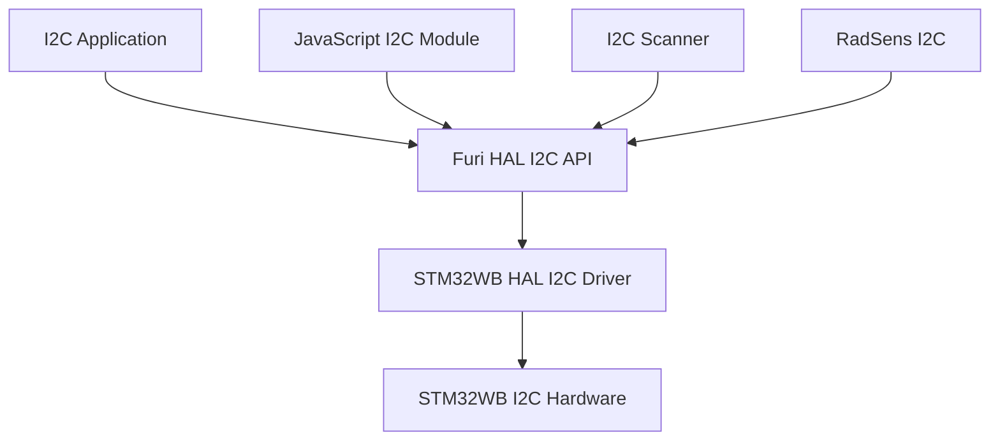
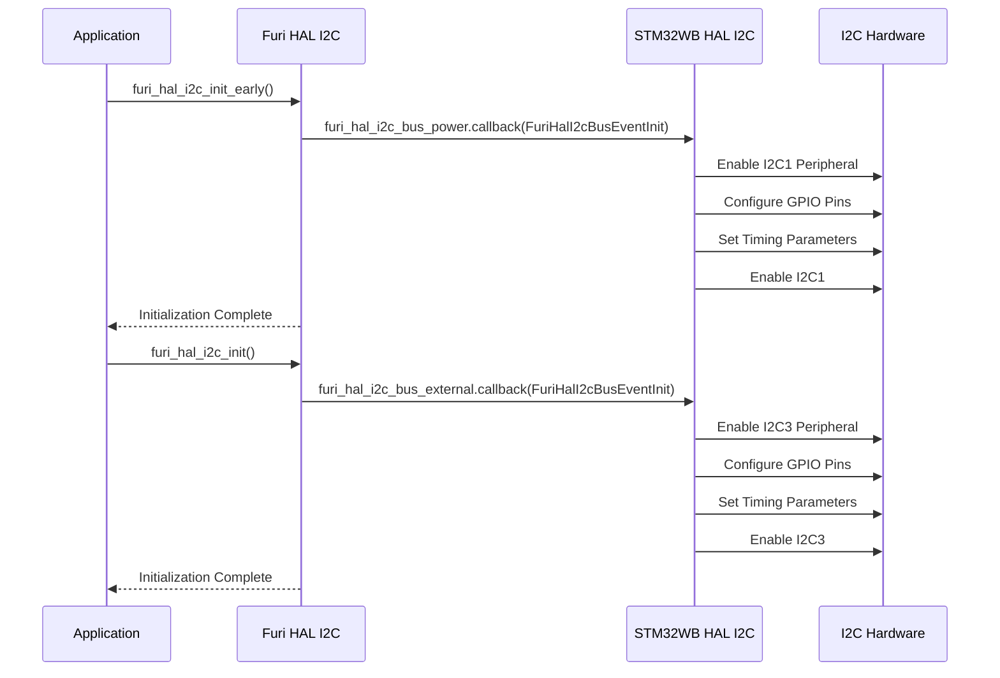
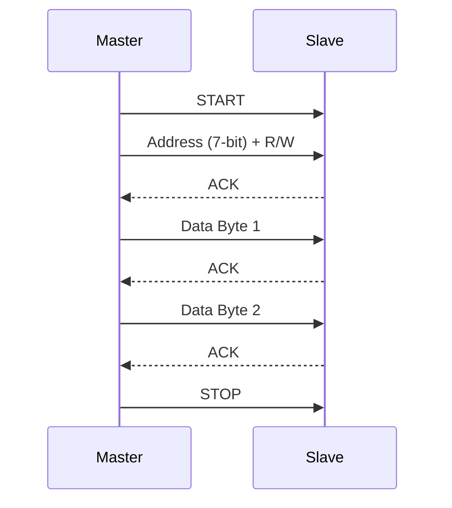

# I2C Interface

<cite>
**Referenced Files in This Document**   
- [furi_hal_i2c.h](file://targets/f7/furi_hal/furi_hal_i2c.h)
- [furi_hal_i2c.c](file://targets/f7/furi_hal/furi_hal_i2c.c)
- [furi_hal_i2c_config.h](file://targets/f7/furi_hal/furi_hal_i2c_config.h)
- [furi_hal_i2c_config.c](file://targets/f7/furi_hal/furi_hal_i2c_config.c)
- [rad_sens_i2c.c](file://applications/external/radsens/rad_sens_i2c.c)
- [gpio_i2c_scanner_control.c](file://applications/main/gpio/gpio_i2c_scanner_control.c)
- [js_i2c.c](file://applications/system/js_app/modules/js_i2c.c)
- [stm32wbxx_hal_i2c.c](file://lib/stm32wb_hal/Src/stm32wbxx_hal_i2c.c)
</cite>

## Table of Contents
1. [Introduction](#introduction)
2. [I2C Architecture Overview](#i2c-architecture-overview)
3. [Bus Configuration and Initialization](#bus-configuration-and-initialization)
4. [API Functions and Usage Patterns](#api-functions-and-usage-patterns)
5. [Master/Slave Mode Configuration](#masterslave-mode-configuration)
6. [Clock Speed Settings](#clock-speed-settings)
7. [Address Handling](#address-handling)
8. [Error Recovery Mechanisms](#error-recovery-mechanisms)
9. [Application Examples](#application-examples)
10. [Integration with Other Components](#integration-with-other-components)
11. [Common Issues and Troubleshooting](#common-issues-and-troubleshooting)
12. [Timing Diagrams and Bus Arbitration](#timing-diagrams-and-bus-arbitration)

## Introduction

The I2C (Inter-Integrated Circuit) interface in the Flipper Zero firmware provides a robust communication protocol for connecting various peripheral devices such as sensors, memory modules, and other external components. This documentation details the implementation of the I2C driver, covering master/slave mode configuration, clock speed settings, address handling, error recovery mechanisms, and API functions. The I2C subsystem is designed to be accessible to beginners while providing sufficient technical depth for experienced developers, including timing diagrams and bus arbitration details.

**Section sources**
- [furi_hal_i2c.h](file://targets/f7/furi_hal/furi_hal_i2c.h#L1-L288)

## I2C Architecture Overview

The I2C architecture in the Flipper Zero firmware consists of multiple layers, including the hardware abstraction layer (HAL), bus configuration, and application-level interfaces. The system supports two I2C buses: an internal power bus (I2C1) and an external bus (I2C3). Each bus has its own configuration and handles, allowing for independent operation and resource management.



**Diagram sources**
- [furi_hal_i2c.h](file://targets/f7/furi_hal/furi_hal_i2c.h#L1-L288)
- [furi_hal_i2c.c](file://targets/f7/furi_hal/furi_hal_i2c.c#L1-L417)

**Section sources**
- [furi_hal_i2c.h](file://targets/f7/furi_hal/furi_hal_i2c.h#L1-L288)
- [furi_hal_i2c.c](file://targets/f7/furi_hal/furi_hal_i2c.c#L1-L417)

## Bus Configuration and Initialization

The I2C buses are configured and initialized through a series of steps that ensure proper setup and resource allocation. The initialization process includes setting up the GPIO pins, configuring the I2C timing parameters, and enabling the I2C peripheral.

### Internal Power Bus (I2C1)
- **Pins**: PA9 (SCL), PA10 (SDA)
- **Clock Speed**: 400 kHz for hardware version > 10, 100 kHz otherwise
- **Configuration**: Analog filter enabled, digital filter disabled, clock stretching enabled

### External Bus (I2C3)
- **Pins**: PC0 (SCL), PC1 (SDA)
- **Clock Speed**: 100 kHz
- **Configuration**: Analog filter enabled, digital filter disabled, clock stretching enabled

The initialization process is handled by the `furi_hal_i2c_init_early` and `furi_hal_i2c_init` functions, which set up the necessary hardware and software components.



**Diagram sources**
- [furi_hal_i2c_config.c](file://targets/f7/furi_hal/furi_hal_i2c_config.c#L1-L167)
- [furi_hal_i2c.c](file://targets/f7/furi_hal/furi_hal_i2c.c#L12-L23)

**Section sources**
- [furi_hal_i2c_config.c](file://targets/f7/furi_hal/furi_hal_i2c_config.c#L1-L167)
- [furi_hal_i2c.c](file://targets/f7/furi_hal/furi_hal_i2c.c#L12-L23)

## API Functions and Usage Patterns

The I2C API provides a set of functions for performing various operations, including data transfer, device readiness checks, and register/memory access. These functions are designed to be intuitive and easy to use, while still offering advanced features for more complex scenarios.

### Core API Functions

| Function | Description | Parameters | Return Value |
|--------|-----------|----------|-------------|
| `furi_hal_i2c_tx` | Transmit data to an I2C device | `handle`, `address`, `data`, `size`, `timeout` | `true` on success, `false` on failure |
| `furi_hal_i2c_rx` | Receive data from an I2C device | `handle`, `address`, `data`, `size`, `timeout` | `true` on success, `false` on failure |
| `furi_hal_i2c_trx` | Transmit and receive data in a single transaction | `handle`, `address`, `tx_data`, `tx_size`, `rx_data`, `rx_size`, `timeout` | `true` on success, `false` on failure |
| `furi_hal_i2c_is_device_ready` | Check if an I2C device is ready for communication | `handle`, `i2c_addr`, `timeout` | `true` if device is ready, `false` otherwise |
| `furi_hal_i2c_read_reg_8` | Read an 8-bit register from an I2C device | `handle`, `i2c_addr`, `reg_addr`, `data`, `timeout` | `true` on success, `false` on failure |
| `furi_hal_i2c_read_reg_16` | Read a 16-bit register from an I2C device | `handle`, `i2c_addr`, `reg_addr`, `data`, `timeout` | `true` on success, `false` on failure |
| `furi_hal_i2c_read_mem` | Read data from a memory address on an I2C device | `handle`, `i2c_addr`, `mem_addr`, `data`, `len`, `timeout` | `true` on success, `false` on failure |
| `furi_hal_i2c_write_reg_8` | Write an 8-bit value to a register on an I2C device | `handle`, `i2c_addr`, `reg_addr`, `data`, `timeout` | `true` on success, `false` on failure |
| `furi_hal_i2c_write_reg_16` | Write a 16-bit value to a register on an I2C device | `handle`, `i2c_addr`, `reg_addr`, `data`, `timeout` | `true` on success, `false` on failure |
| `furi_hal_i2c_write_mem` | Write data to a memory address on an I2C device | `handle`, `i2c_addr`, `mem_addr`, `data`, `len`, `timeout` | `true` on success, `false` on failure |

### Usage Patterns

#### Basic Data Transfer
```c
FuriHalI2cBusHandle* handle = &furi_hal_i2c_handle_external;
uint8_t tx_data[] = {0x01, 0x02, 0x03};
uint8_t rx_data[3];
uint32_t timeout = 100;

furi_hal_i2c_acquire(handle);
bool success = furi_hal_i2c_trx(handle, 0x50, tx_data, 3, rx_data, 3, timeout);
furi_hal_i2c_release(handle);
```

#### Register Access
```c
FuriHalI2cBusHandle* handle = &furi_hal_i2c_handle_external;
uint8_t reg_value;
uint32_t timeout = 100;

furi_hal_i2c_acquire(handle);
bool success = furi_hal_i2c_read_reg_8(handle, 0x50, 0x01, &reg_value, timeout);
furi_hal_i2c_release(handle);
```

#### Memory Access
```c
FuriHalI2cBusHandle* handle = &furi_hal_i2c_handle_external;
uint8_t mem_data[16];
uint32_t timeout = 100;

furi_hal_i2c_acquire(handle);
bool success = furi_hal_i2c_read_mem(handle, 0x50, 0x10, mem_data, 16, timeout);
furi_hal_i2c_release(handle);
```

**Section sources**
- [furi_hal_i2c.h](file://targets/f7/furi_hal/furi_hal_i2c.h#L77-L283)
- [furi_hal_i2c.c](file://targets/f7/furi_hal/furi_hal_i2c.c#L232-L416)

## Master/Slave Mode Configuration

The I2C driver supports both master and slave modes, allowing the Flipper Zero to act as either a controller or a peripheral device. The mode is configured during the initialization of the I2C bus and can be changed dynamically if needed.

### Master Mode
In master mode, the Flipper Zero initiates and controls the communication with other I2C devices. The master mode is the default configuration and is used for most applications.

### Slave Mode
In slave mode, the Flipper Zero responds to requests from other I2C masters. This mode is useful for creating custom I2C peripherals or for debugging purposes.

### Configuration
The mode is configured through the `LL_I2C_InitTypeDef` structure, which is passed to the `LL_I2C_Init` function during initialization. The `PeripheralMode` field is set to `LL_I2C_MODE_I2C` for both master and slave modes, but the behavior is determined by the application logic.

```c
LL_I2C_InitTypeDef I2C_InitStruct;
I2C_InitStruct.PeripheralMode = LL_I2C_MODE_I2C;
I2C_InitStruct.AnalogFilter = LL_I2C_ANALOGFILTER_ENABLE;
I2C_InitStruct.DigitalFilter = 0;
I2C_InitStruct.OwnAddress1 = 0;
I2C_InitStruct.TypeAcknowledge = LL_I2C_ACK;
I2C_InitStruct.OwnAddrSize = LL_I2C_OWNADDRESS1_7BIT;
I2C_InitStruct.Timing = FURI_HAL_I2C_CONFIG_POWER_I2C_TIMINGS_100;
LL_I2C_Init(handle->bus->i2c, &I2C_InitStruct);
```

**Section sources**
- [furi_hal_i2c_config.c](file://targets/f7/furi_hal/furi_hal_i2c_config.c#L137-L144)
- [stm32wbxx_hal_i2c.c](file://lib/stm32wb_hal/Src/stm32wbxx_hal_i2c.c#L367-L381)

## Clock Speed Settings

The I2C clock speed is configured through the timing parameters in the `LL_I2C_InitTypeDef` structure. The Flipper Zero supports different clock speeds for the internal and external buses.

### Internal Power Bus (I2C1)
- **Standard Mode**: 100 kHz
- **Fast Mode**: 400 kHz (for hardware version > 10)

### External Bus (I2C3)
- **Standard Mode**: 100 kHz

The timing parameters are calculated using the STM32CubeMX tool and are defined in the `furi_hal_i2c_config.c` file.

```c
#define FURI_HAL_I2C_CONFIG_POWER_I2C_TIMINGS_100 0x10707DBC
#define FURI_HAL_I2C_CONFIG_POWER_I2C_TIMINGS_400 0x00602173
```

The timing parameters are set based on the hardware version:

```c
if(furi_hal_version_get_hw_version() > 10) {
    I2C_InitStruct.Timing = FURI_HAL_I2C_CONFIG_POWER_I2C_TIMINGS_400;
} else {
    I2C_InitStruct.Timing = FURI_HAL_I2C_CONFIG_POWER_I2C_TIMINGS_100;
}
```

**Section sources**
- [furi_hal_i2c_config.c](file://targets/f7/furi_hal/furi_hal_i2c_config.c#L12-L18)
- [furi_hal_i2c_config.c](file://targets/f7/furi_hal/furi_hal_i2c_config.c#L100-L104)

## Address Handling

The I2C driver supports both 7-bit and 10-bit addressing modes. The address is specified in the API functions and is automatically converted to the appropriate format.

### 7-bit Addressing
- **Range**: 0x00 to 0x7F
- **Usage**: Most common addressing mode

### 10-bit Addressing
- **Range**: 0x000 to 0x3FF
- **Usage**: For devices that require more address space

The address is specified in the API functions as a 16-bit value, and the `ten_bit` parameter is used to indicate whether the address is 10-bit.

```c
bool furi_hal_i2c_tx_ext(
    FuriHalI2cBusHandle* handle,
    uint16_t address,
    bool ten_bit,
    const uint8_t* data,
    size_t size,
    FuriHalI2cBegin begin,
    FuriHalI2cEnd end,
    uint32_t timeout);
```

**Section sources**
- [furi_hal_i2c.h](file://targets/f7/furi_hal/furi_hal_i2c.h#L98-L106)
- [furi_hal_i2c.c](file://targets/f7/furi_hal/furi_hal_i2c.c#L215-L230)

## Error Recovery Mechanisms

The I2C driver includes several error recovery mechanisms to handle common issues such as bus contention, clock stretching, and NACK conditions.

### Timeout Handling
Each I2C operation has a timeout parameter that specifies the maximum time to wait for the operation to complete. If the operation does not complete within the specified time, it is considered a failure.

### NACK Handling
If a device does not acknowledge a byte, the I2C driver will detect the NACK condition and return an error. The application can then retry the operation or take appropriate action.

### Bus Contention
The I2C driver uses mutexes to prevent multiple threads from accessing the bus simultaneously. This prevents bus contention and ensures that each operation is completed before the next one begins.

### Clock Stretching
The I2C driver supports clock stretching, which allows a slave device to hold the clock line low to slow down the communication. The driver will wait for the clock line to be released before continuing.

```c
static bool furi_hal_i2c_wait_for_idle(I2C_TypeDef* i2c, FuriHalI2cBegin begin, FuriHalCortexTimer timer) {
    do {
        if(furi_hal_cortex_timer_is_expired(timer)) {
            return false;
        }
    } while(begin == FuriHalI2cBeginStart && LL_I2C_IsActiveFlag_BUSY(i2c));
    return true;
}
```

**Section sources**
- [furi_hal_i2c.c](file://targets/f7/furi_hal/furi_hal_i2c.c#L53-L63)
- [furi_hal_i2c.c](file://targets/f7/furi_hal/furi_hal_i2c.c#L111-L114)

## Application Examples

### RadSens I2C Communication
The RadSens application uses the I2C interface to communicate with a radiation sensor. The application reads data from the sensor and updates the model with the latest values.

```c
bool rad_sens_read_data(RadSensModel* model) {
    furi_hal_i2c_acquire(I2C_BUS);

    uint32_t timeout = furi_ms_to_ticks(100);
    model->connected = false;
    model->verified = false;

    if(furi_hal_i2c_is_device_ready(I2C_BUS, RAD_SENS_ADDRESS, timeout) > 0) {
        model->connected = true;

        uint8_t buffer[4];
        uint8_t device_id = 0;

        buffer[0] = RAD_SENS_ID_RG;
        if(furi_hal_i2c_tx(I2C_BUS, RAD_SENS_ADDRESS, buffer, 1, timeout)) {
            if(furi_hal_i2c_rx(I2C_BUS, (uint8_t)RAD_SENS_ADDRESS, buffer, 1, timeout)) {
                device_id = buffer[0];
            }
        }

        if(device_id == RAD_SENS_ID) {
            model->verified = true;

            // Read dynamic intensity
            buffer[0] = RAD_SENS_DYN_INTENSITY_RG;
            if(furi_hal_i2c_tx(I2C_BUS, RAD_SENS_ADDRESS, buffer, 1, timeout)) {
                if(furi_hal_i2c_rx(I2C_BUS, (uint8_t)RAD_SENS_ADDRESS, buffer, 3, timeout)) {
                    model->dyn_intensity =
                        (((uint32_t)buffer[0] << 16) | ((uint32_t)buffer[1] << 8) |
                         (uint32_t)buffer[2]);
                }
            }

            // Read static intensity
            buffer[0] = RAD_SENS_STAT_INTENSITY_RG;
            if(furi_hal_i2c_tx(I2C_BUS, RAD_SENS_ADDRESS, buffer, 1, timeout)) {
                if(furi_hal_i2c_rx(I2C_BUS, (uint8_t)RAD_SENS_ADDRESS, buffer, 3, timeout)) {
                    model->stat_intensity =
                        (((uint32_t)buffer[0] << 16) | ((uint32_t)buffer[1] << 8) |
                         (uint32_t)buffer[2]);
                }
            }

            // Read impulses
            buffer[0] = RAD_SENS_IMP_CNT_RG;
            if(furi_hal_i2c_tx(I2C_BUS, RAD_SENS_ADDRESS, buffer, 1, timeout)) {
                if(furi_hal_i2c_rx(I2C_BUS, (uint8_t)RAD_SENS_ADDRESS, buffer, 2, timeout)) {
                    model->new_impulse_count = (((uint16_t)buffer[0] << 8) | (uint16_t)buffer[1]);
                    model->impulse_count += model->new_impulse_count;
                }
            }
        }
    }

    furi_hal_i2c_release(I2C_BUS);

    return model->verified;
}
```

**Section sources**
- [rad_sens_i2c.c](file://applications/external/radsens/rad_sens_i2c.c#L1-L62)

### I2C Scanner
The I2C scanner application scans the I2C bus for connected devices and displays their addresses.

```c
void gpio_i2c_scanner_run_once(I2CScannerState* i2c_scanner_state) {
    //Reset the number of items for rewriting the array
    i2c_scanner_state->items = 0;
    furi_hal_i2c_acquire(&furi_hal_i2c_handle_external);

    uint32_t response_timeout_ticks = furi_ms_to_ticks(5.f);

    //Addresses 0 to 7 are reserved and won't be scanned
    for(int i = FIRST_NON_RESERVED_I2C_ADDRESS; i <= HIGHEST_I2C_ADDRESS; i++) {
        if(furi_hal_i2c_is_device_ready(
               &furi_hal_i2c_handle_external,
               i << 1,
               response_timeout_ticks)) { //Bitshift of 1 bit to convert 7-Bit Address into 8-Bit Address
            i2c_scanner_state->responding_address[i2c_scanner_state->items] = i;
            i2c_scanner_state->items++;
        }
    }

    furi_hal_i2c_release(&furi_hal_i2c_handle_external);
}
```

**Section sources**
- [gpio_i2c_scanner_control.c](file://applications/main/gpio/gpio_i2c_scanner_control.c#L1-L24)

## Integration with Other Components

The I2C interface integrates with other components such as the power management system and interrupt controller to provide a seamless user experience.

### Power Management
The I2C buses are powered down when not in use to conserve power. The `furi_hal_i2c_acquire` and `furi_hal_i2c_release` functions manage the power state of the buses.

```c
void furi_hal_i2c_acquire(FuriHalI2cBusHandle* handle) {
    furi_hal_power_insomnia_enter();
    // Lock bus access
    handle->bus->callback(handle->bus, FuriHalI2cBusEventLock);
    // Ensure that no active handle set
    furi_check(handle->bus->current_handle == NULL);
    // Set current handle
    handle->bus->current_handle = handle;
    // Activate bus
    handle->bus->callback(handle->bus, FuriHalI2cBusEventActivate);
    // Activate handle
    handle->callback(handle, FuriHalI2cBusHandleEventActivate);
}

void furi_hal_i2c_release(FuriHalI2cBusHandle* handle) {
    // Ensure that current handle is our handle
    furi_check(handle->bus->current_handle == handle);
    // Deactivate handle
    handle->callback(handle, FuriHalI2cBusHandleEventDeactivate);
    // Deactivate bus
    handle->bus->callback(handle->bus, FuriHalI2cBusEventDeactivate);
    // Reset current handle
    handle->bus->current_handle = NULL;
    // Unlock bus
    handle->bus->callback(handle->bus, FuriHalI2cBusEventUnlock);
    furi_hal_power_insomnia_exit();
}
```

### Interrupt Controller
The I2C driver uses interrupts to handle asynchronous events such as data reception and transmission completion. The interrupt controller is configured to handle these events efficiently.

**Section sources**
- [furi_hal_i2c.c](file://targets/f7/furi_hal/furi_hal_i2c.c#L25-L51)

## Common Issues and Troubleshooting

### Bus Contention
Bus contention occurs when multiple devices try to control the bus simultaneously. This can be prevented by using mutexes to ensure that only one thread accesses the bus at a time.

### Clock Stretching
Clock stretching is a feature that allows a slave device to hold the clock line low to slow down the communication. The I2C driver supports clock stretching, but it can cause delays in the communication. If clock stretching is not needed, it can be disabled in the configuration.

### NACK Conditions
A NACK (Not Acknowledged) condition occurs when a device does not acknowledge a byte. This can be caused by a variety of issues, such as incorrect addressing, bus noise, or a faulty device. The application should handle NACK conditions by retrying the operation or taking appropriate action.

**Section sources**
- [furi_hal_i2c.c](file://targets/f7/furi_hal/furi_hal_i2c.c#L111-L114)
- [furi_hal_i2c.c](file://targets/f7/furi_hal/furi_hal_i2c.c#L284-L313)

## Timing Diagrams and Bus Arbitration

### Timing Diagram
The timing diagram below shows the sequence of events during an I2C transaction.



### Bus Arbitration
Bus arbitration is the process by which multiple masters on the same bus determine which one has control. The I2C protocol uses a wired-AND mechanism to resolve conflicts. If two masters start a transaction at the same time, the one that transmits a 0 bit while the other transmits a 1 bit will win the arbitration and continue the transaction.

**Diagram sources**
- [furi_hal_i2c.c](file://targets/f7/furi_hal/furi_hal_i2c.c#L166-L183)

**Section sources**
- [furi_hal_i2c.c](file://targets/f7/furi_hal/furi_hal_i2c.c#L166-L183)