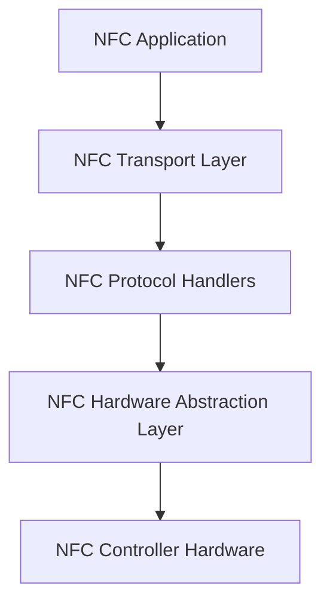
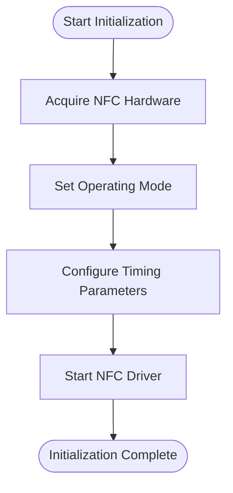
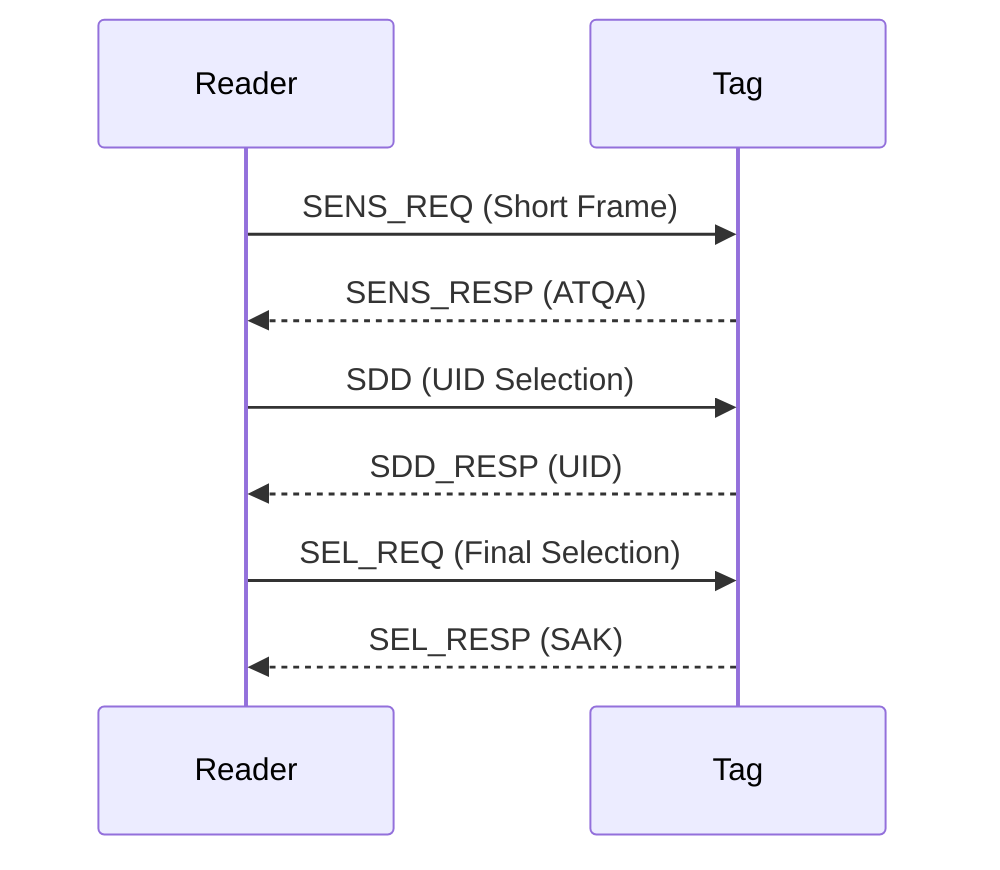
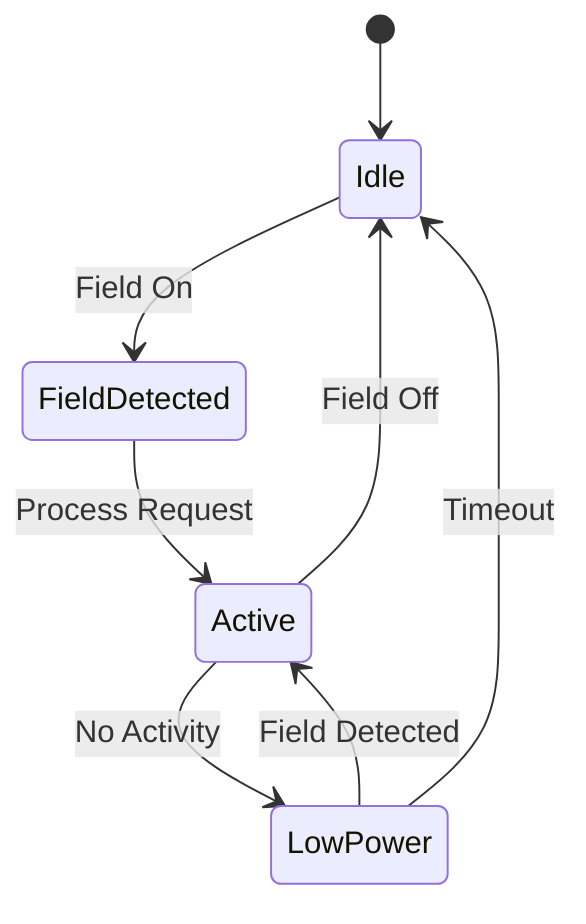
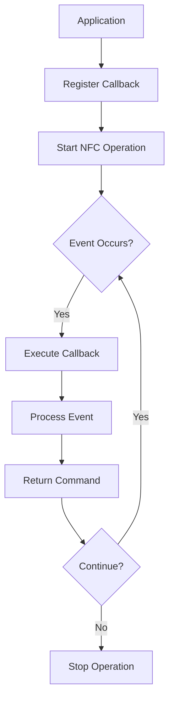
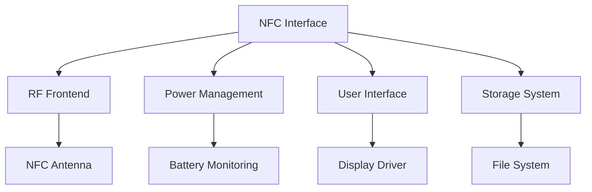

# NFC Interface

<cite>
**Referenced Files in This Document**   
- [nfc.h](file://lib/nfc/nfc.h)
- [nfc.c](file://lib/nfc/nfc.c)
- [furi_hal_nfc.h](file://targets/furi_hal_include/furi_hal_nfc.h)
- [nfc_scanner.h](file://lib/nfc/nfc_scanner.h)
- [nfc_poller.h](file://lib/nfc/nfc_poller.h)
- [iso14443_3a.h](file://lib/nfc/protocols/iso14443_3a/iso14443_3a.h)
- [iso15693_3.h](file://lib/nfc/protocols/iso15693_3/iso15693_3.h)
- [iso14443_crc.h](file://lib/nfc/helpers/iso14443_crc.h)
- [iso14443_4_layer.h](file://lib/nfc/helpers/iso14443_4_layer.h)
- [nfc_app.c](file://applications/main/nfc/nfc_app.c)
</cite>

## Table of Contents
1. [Introduction](#introduction)
2. [NFC Driver Architecture](#nfc-driver-architecture)
3. [Initialization and Configuration](#initialization-and-configuration)
4. [Protocol Handling](#protocol-handling)
5. [Field Detection and Power Management](#field-detection-and-power-management)
6. [API Functions and Usage Patterns](#api-functions-and-usage-patterns)
7. [Application Examples](#application-examples)
8. [Component Relationships](#component-relationships)
9. [Common Issues and Troubleshooting](#common-issues-and-troubleshooting)
10. [Performance and Signal Integrity](#performance-and-signal-integrity)

## Introduction
The NFC Interface sub-component in the Flipper Zero firmware provides a comprehensive implementation for Near Field Communication operations, supporting multiple protocols including ISO14443 and ISO15693. This documentation details the implementation of the NFC driver, covering initialization sequences, protocol handling, field detection, power management, and API usage patterns. The system is designed to be accessible to beginners while providing sufficient technical depth for experienced developers regarding timing requirements and signal integrity.

## NFC Driver Architecture
The NFC driver architecture is implemented as a layered system with clear separation of concerns. At the lowest level, the hardware abstraction layer (HAL) provides direct access to the NFC controller hardware. Above this, the transport layer manages the core NFC operations, while protocol-specific implementations handle the various NFC standards.

**Diagram sources**
- [nfc.h](file://lib/nfc/nfc.h)
- [furi_hal_nfc.h](file://targets/furi_hal_include/furi_hal_nfc.h)

**Section sources**
- [nfc.h](file://lib/nfc/nfc.h#L1-L404)
- [furi_hal_nfc.h](file://targets/furi_hal_include/furi_hal_nfc.h#L1-L495)

## Initialization and Configuration
The NFC driver initialization process follows a well-defined sequence to ensure proper hardware setup and configuration. The initialization begins with acquiring exclusive access to the NFC hardware through `furi_hal_nfc_acquire()`, followed by setting the operating mode and technology configuration.

The configuration process involves setting various timing parameters that are critical for proper NFC operation. These include frame delay times, guard times, and mask receive times, all of which are specified in carrier cycles or microseconds. The driver supports both poller (reader) and listener (emulator) modes, with different configuration requirements for each.

**Diagram sources**
- [nfc.c](file://lib/nfc/nfc.c#L268-L285)
- [furi_hal_nfc.h](file://targets/furi_hal_include/furi_hal_nfc.h#L163-L171)

**Section sources**
- [nfc.c](file://lib/nfc/nfc.c#L241-L285)
- [furi_hal_nfc.h](file://targets/furi_hal_include/furi_hal_nfc.h#L104-L171)

## Protocol Handling
The NFC driver supports multiple protocols through a modular architecture. The primary protocols implemented are ISO14443 (types A and B) and ISO15693, each with their own specific implementation files and configuration parameters.

### ISO14443 Protocol
The ISO14443 protocol implementation includes support for both type A and type B variants. For ISO14443-3A, the driver handles the complete initialization sequence including SENS_REQ, SDD, and SEL_REQ commands. The implementation includes specific timing parameters such as FDT_POLL_FC (1620 carrier cycles) and guard time (5000 microseconds).

**Diagram sources**
- [iso14443_3a.h](file://lib/nfc/protocols/iso14443_3a/iso14443_3a.h#L10-L20)
- [nfc.c](file://lib/nfc/nfc.c#L525-L573)

### ISO15693 Protocol
The ISO15693 implementation supports the full range of commands defined in the standard, including inventory, read, write, and lock operations. The protocol uses different timing parameters compared to ISO14443, with FDT_POLL_FC set to 4202 carrier cycles and a guard time of 5000 microseconds.

The driver handles both 1-of-4 and 1-of-256 modulation schemes, with automatic detection capabilities. The command structure includes flags for subcarrier selection, data rate, and inventory mode, allowing for flexible configuration based on the specific tag requirements.

**Section sources**
- [iso15693_3.h](file://lib/nfc/protocols/iso15693_3/iso15693_3.h#L10-L34)
- [furi_hal_nfc.h](file://targets/furi_hal_include/furi_hal_nfc.h#L449-L471)

## Field Detection and Power Management
The NFC driver implements sophisticated field detection and power management features to optimize battery usage and ensure reliable operation. Field detection is handled through hardware interrupts that trigger when an external field is detected or lost.

Power management is implemented through a low-power mode that can be entered when the NFC interface is not actively in use. The driver automatically transitions between active and low-power states based on field detection and operational requirements. When operating as a listener (emulator), the driver can enter sleep mode to conserve power while maintaining the ability to respond to reader requests.

**Diagram sources**
- [furi_hal_nfc.h](file://targets/furi_hal_include/furi_hal_nfc.h#L177-L191)
- [nfc.c](file://lib/nfc/nfc.c#L114-L138)

**Section sources**
- [furi_hal_nfc.h](file://targets/furi_hal_include/furi_hal_nfc.h#L177-L191)
- [nfc.c](file://lib/nfc/nfc.c#L107-L167)

## API Functions and Usage Patterns
The NFC driver provides a comprehensive API for both high-level and low-level operations. The API is designed to be intuitive while providing the necessary control for advanced use cases.

### Core API Functions
The primary API functions are defined in the `nfc.h` header file and include:

- `nfc_alloc()` and `nfc_free()`: Memory management for NFC instances
- `nfc_config()`: Configuration of operating mode and technology
- `nfc_start()` and `nfc_stop()`: Control of the NFC operation lifecycle
- `nfc_poller_trx()`: Data transmission and reception in poller mode
- `nfc_listener_tx()`: Data transmission in listener mode

### Event-Driven Architecture
The NFC driver uses an event-driven architecture where operations are controlled through callback functions. Events such as field detection, data reception, and transmission completion trigger the callback, allowing the application to respond appropriately.

**Diagram sources**
- [nfc.h](file://lib/nfc/nfc.h#L87-L88)
- [nfc.c](file://lib/nfc/nfc.c#L114-L167)

**Section sources**
- [nfc.h](file://lib/nfc/nfc.h#L124-L255)
- [nfc.c](file://lib/nfc/nfc.c#L341-L358)

## Application Examples
The NFC interface is used in various applications within the Flipper Zero ecosystem, demonstrating different usage patterns and capabilities.

### NFC Card Reading
The primary use case involves reading NFC cards using the scanner and poller components. The typical sequence involves:

1. Allocating an NFC instance
2. Configuring for poller mode with ISO14443A technology
3. Starting the scanner to detect available protocols
4. Using the poller to read card data once a protocol is detected
5. Processing and displaying the retrieved data

### NFC Emulation
The listener mode enables NFC emulation, allowing the Flipper Zero to act as an NFC tag. This involves:

1. Configuring the NFC instance for listener mode
2. Setting up the response data (UID, ATQA, SAK)
3. Starting the listener to respond to reader requests
4. Handling data exchange as required by the protocol

**Section sources**
- [nfc_app.c](file://applications/main/nfc/nfc_app.c)
- [nfc_scanner.h](file://lib/nfc/nfc_scanner.h)

## Component Relationships
The NFC interface interacts with several other components in the system, forming a cohesive ecosystem for NFC operations.

The RF frontend handles the analog signal processing, while the power management system ensures optimal power usage during NFC operations. The user interface component provides feedback to the user, and the storage system persists NFC data for later retrieval.

**Diagram sources**
- [nfc.h](file://lib/nfc/nfc.h)
- [furi_hal_nfc.h](file://targets/furi_hal_include/furi_hal_nfc.h)

**Section sources**
- [nfc.h](file://lib/nfc/nfc.h)
- [furi_hal_nfc.h](file://targets/furi_hal_include/furi_hal_nfc.h)

## Common Issues and Troubleshooting
Several common issues can arise during NFC operations, and the driver includes mechanisms to handle these situations.

### Field Interference
Field interference can occur when multiple NFC devices are in close proximity. The driver implements timing parameters and guard times to minimize interference effects. Applications should implement retry logic and error handling for cases where interference prevents successful communication.

### Tag Compatibility
Not all NFC tags are fully compliant with the standards, leading to compatibility issues. The driver includes tolerance for minor deviations in timing and protocol implementation. For problematic tags, applications may need to adjust timing parameters or implement custom communication sequences.

### Power Consumption
NFC operations can be power-intensive, especially in listener mode. The power management system helps mitigate this by entering low-power states when possible. Applications should monitor battery levels and adjust NFC usage accordingly.

**Section sources**
- [nfc.c](file://lib/nfc/nfc.c)
- [furi_hal_nfc.h](file://targets/furi_hal_include/furi_hal_nfc.h)

## Performance and Signal Integrity
The NFC driver is optimized for both performance and signal integrity, with careful attention to timing requirements and signal quality.

### Timing Requirements
Precise timing is critical for NFC operations, with various parameters specified in carrier cycles (13.56 MHz). The driver implements hardware timers to ensure accurate timing for frame delays, guard times, and response windows. Deviations from specified timing can lead to communication failures.

### Signal Integrity
Signal integrity is maintained through proper impedance matching, filtering, and signal conditioning in the RF frontend. The digital signal processing components ensure clean data transmission and reception, with error detection and correction mechanisms for reliable communication.

**Section sources**
- [nfc.c](file://lib/nfc/nfc.c)
- [furi_hal_nfc.h](file://targets/furi_hal_include/furi_hal_nfc.h)