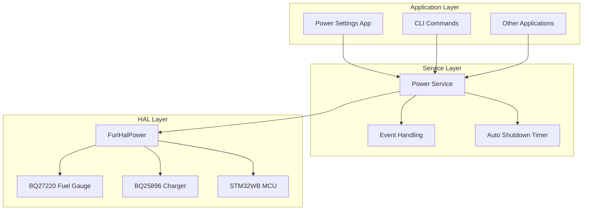
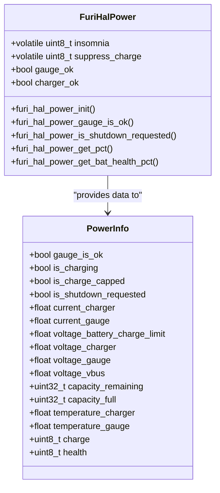
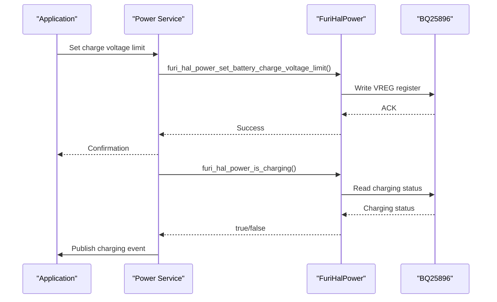
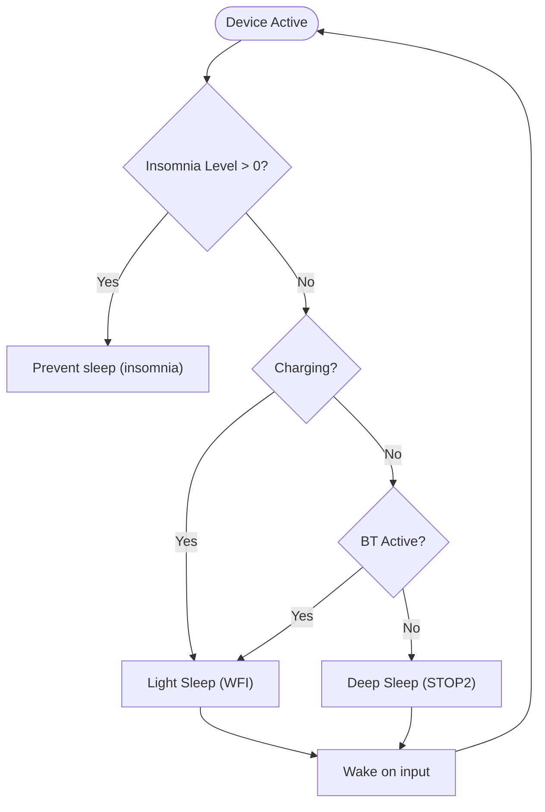
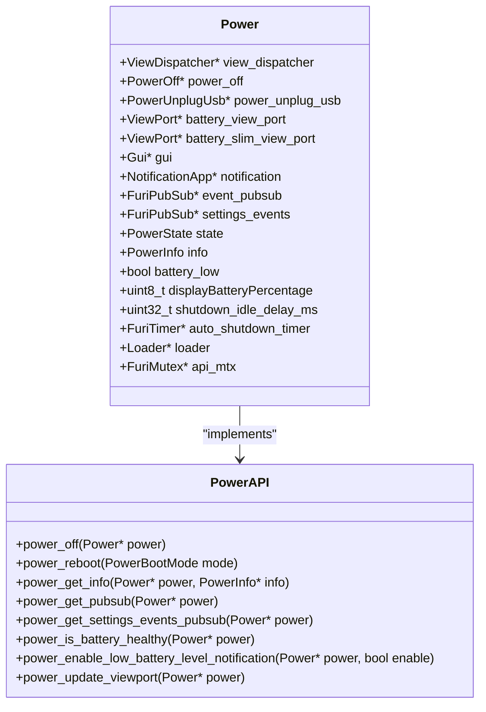
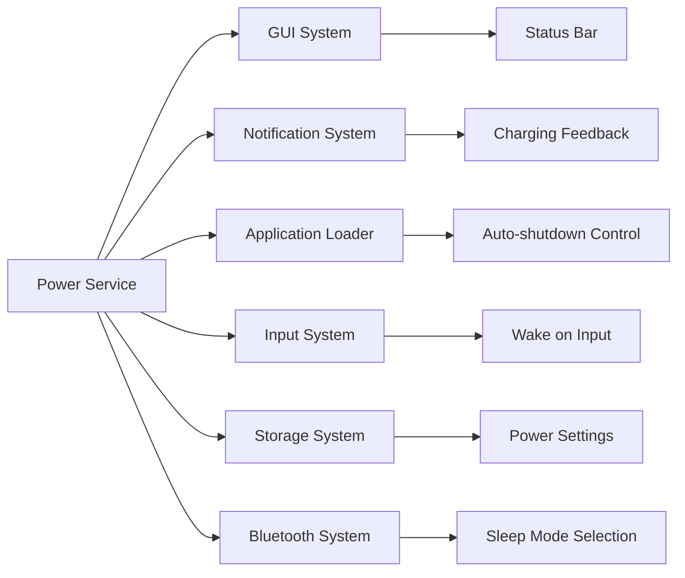
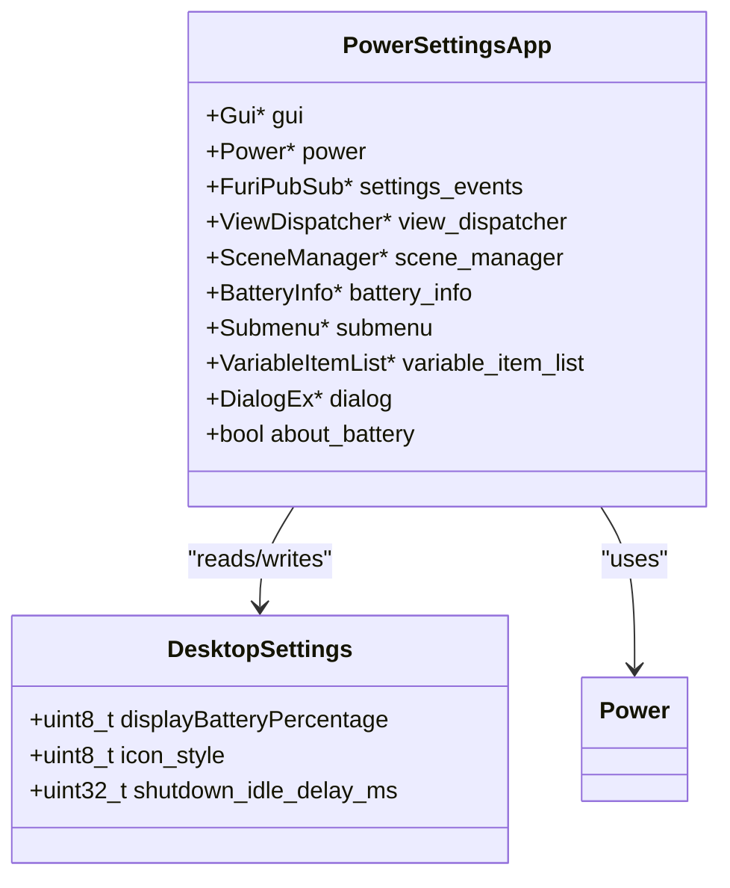
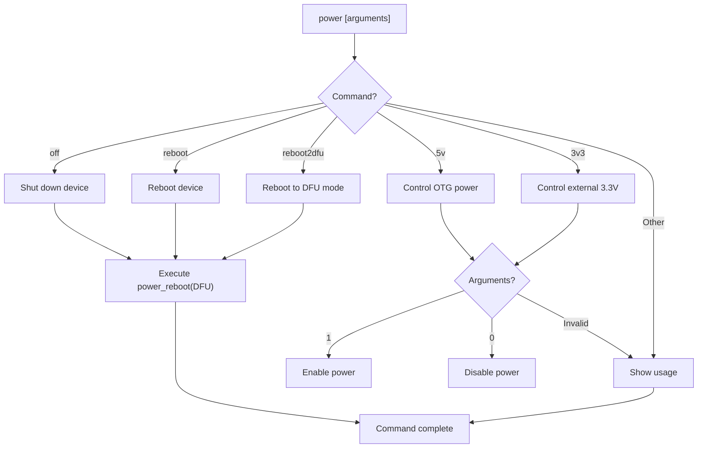

# Power Management

<cite>
**Referenced Files in This Document**   
- [furi_hal_power.h](file://targets/furi_hal_include/furi_hal_power.h)
- [power.c](file://applications/services/power/power_service/power.c)
- [power.h](file://applications/services/power/power_service/power.h)
- [power_api.c](file://applications/services/power/power_service/power_api.c)
- [power_i.h](file://applications/services/power/power_service/power_i.h)
- [furi_hal_power.c](file://targets/f7/furi_hal/furi_hal_power.c)
- [power_settings.c](file://applications/services/power/power_settings.c)
- [power_settings.h](file://applications/services/power/power_settings.h)
- [battery_info.c](file://applications/settings/power_settings_app/views/battery_info.c)
- [battery_info.h](file://applications/settings/power_settings_app/views/battery_info.h)
- [power_settings_app.c](file://applications/settings/power_settings_app/power_settings_app.c)
- [power_cli.c](file://applications/services/power/power_cli.c)
- [power_cli.h](file://applications/services/power/power_cli.h)
</cite>

## Table of Contents
1. [Introduction](#introduction)
2. [Power Management Architecture](#power-management-architecture)
3. [Battery Monitoring and State Detection](#battery-monitoring-and-state-detection)
4. [Voltage Regulation and Charging Control](#voltage-regulation-and-charging-control)
5. [Sleep Modes and Power Optimization](#sleep-modes-and-power-optimization)
6. [Power Management API](#power-management-api)
7. [Integration with Other Components](#integration-with-other-components)
8. [Configuration and User Settings](#configuration-and-user-settings)
9. [Troubleshooting and Common Issues](#troubleshooting-and-common-issues)
10. [CLI Commands and Debugging](#cli-commands-and-debugging)

## Introduction

The Power Management sub-component in the Flipper Zero firmware provides comprehensive control over the device's power system, including battery monitoring, charging regulation, sleep modes, and energy optimization. This documentation details the implementation of the power management system, covering both the hardware interface layer (HAL) and the application-level services that manage power states.

The system is designed to maximize battery life while ensuring reliable operation and accurate battery status reporting. It interfaces with multiple hardware components including the BQ27220 fuel gauge for battery monitoring and the BQ25896 charger IC for power regulation. The architecture follows a layered approach with clear separation between hardware abstraction, service logic, and user interface components.

**Section sources**
- [furi_hal_power.h](file://targets/furi_hal_include/furi_hal_power.h#L1-L227)
- [power.c](file://applications/services/power/power_service/power.c#L1-L673)

## Power Management Architecture

The power management system follows a layered architecture with distinct components handling different aspects of power control:

**Diagram sources **
- [power.c](file://applications/services/power/power_service/power.c#L324-L672)
- [furi_hal_power.c](file://targets/f7/furi_hal/furi_hal_power.c#L54-L744)

The architecture consists of three main layers:
- **Application Layer**: User-facing components like the Power Settings application and CLI commands
- **Service Layer**: The core power service that manages state transitions, event handling, and auto-shutdown functionality
- **HAL Layer**: Hardware abstraction layer that interfaces directly with power management ICs and MCU peripherals

The Power service runs as a dedicated thread and maintains the current power state, battery information, and handles events from various system components. It uses FreeRTOS timers for auto-shutdown functionality and pubsub mechanisms to communicate state changes to other system components.

**Section sources**
- [power.c](file://applications/services/power/power_service/power.c#L324-L672)
- [furi_hal_power.c](file://targets/f7/furi_hal/furi_hal_power.c#L54-L744)

## Battery Monitoring and State Detection

The battery monitoring system provides accurate battery level reporting and health assessment through the BQ27220 fuel gauge IC. The system implements multiple methods for battery state detection and ensures reliable operation even under challenging conditions.

**Diagram sources **
- [furi_hal_power.h](file://targets/furi_hal_include/furi_hal_power.h#L18-L227)
- [power.h](file://applications/services/power/power_service/power.h#L37-L59)

The battery monitoring system implements several key functions:
- **State of Charge (SoC) measurement**: Uses the BQ27220 fuel gauge to provide accurate battery percentage (0-100%)
- **Battery health assessment**: Reports battery health as a percentage, with levels below 70% considered unhealthy
- **Shutdown request detection**: Monitors the fuel gauge's SYSDWN flag to detect when the battery requests system shutdown
- **Temperature monitoring**: Reads battery temperature from both the charger and fuel gauge ICs
- **Capacity tracking**: Provides remaining, full charge, and design capacity values in mAh

The system includes robust error handling and initialization routines that verify the fuel gauge is properly initialized and has loaded the correct profile before relying on its measurements.

**Section sources**
- [furi_hal_power.h](file://targets/furi_hal_include/furi_hal_power.h#L18-L227)
- [furi_hal_power.c](file://targets/f7/furi_hal/furi_hal_power.c#L106-L272)
- [power.c](file://applications/services/power/power_service/power.c#L401-L427)

## Voltage Regulation and Charging Control

The voltage regulation system manages the charging process and power delivery through the BQ25896 charger IC. It provides precise control over charging parameters and implements safety features to protect the battery.

**Diagram sources **
- [furi_hal_power.h](file://targets/furi_hal_include/furi_hal_power.h#L129-L142)
- [furi_hal_power.c](file://targets/f7/furi_hal/furi_hal_power.c#L367-L379)
- [power.c](file://applications/services/power/power_service/power.c#L374-L390)

Key voltage regulation features include:
- **Adjustable charge voltage limit**: Allows setting the battery charge voltage limit between 3.5V and 4.4V
- **Charge current monitoring**: Provides real-time current measurement from both charger and fuel gauge
- **Charging state detection**: Differentiates between active charging, charging complete, and not charging states
- **OTG (On-The-Go) power delivery**: Enables 5V output for powering external devices
- **External 3.3V control**: Manages power to external GPIO and SD card

The system implements charge capping functionality that can suppress charging when the battery reaches a user-defined threshold, helping to extend battery lifespan by avoiding full charge cycles.

**Section sources**
- [furi_hal_power.h](file://targets/furi_hal_include/furi_hal_power.h#L129-L142)
- [furi_hal_power.c](file://targets/f7/furi_hal/furi_hal_power.c#L367-L379)
- [power.c](file://applications/services/power/power_service/power.c#L530-L542)

## Sleep Modes and Power Optimization

The sleep management system implements multiple power-saving modes to maximize battery life during periods of inactivity. It balances power savings with responsiveness to user input and system events.

**Diagram sources **
- [furi_hal_power.c](file://targets/f7/furi_hal/furi_hal_power.c#L162-L265)
- [power.c](file://applications/services/power/power_service/power.c#L244-L323)

The power optimization system includes:
- **Insomnia management**: Prevents the device from sleeping when certain applications are active
- **Auto-shutdown timer**: Automatically powers off the device after a configurable idle period
- **Deep sleep mode**: Uses STOP2 mode for maximum power savings when Bluetooth is not active
- **Light sleep mode**: Uses WFI (Wait For Interrupt) mode for quick wake-up when charging or BT is active
- **Application-aware power management**: Subscribes to loader events to inhibit auto-shutdown during application execution

The insomnia system uses a reference counting mechanism where applications can call `furi_hal_power_insomnia_enter()` and `furi_hal_power_insomnia_exit()` to prevent the device from sleeping during critical operations.

**Section sources**
- [furi_hal_power.h](file://targets/furi_hal_include/furi_hal_power.h#L44-L61)
- [furi_hal_power.c](file://targets/f7/furi_hal/furi_hal_power.c#L144-L165)
- [power.c](file://applications/services/power/power_service/power.c#L244-L323)

## Power Management API

The power management system provides a comprehensive API for applications to interact with power functions, monitor battery status, and respond to power events.

**Diagram sources **
- [power.h](file://applications/services/power/power_service/power.h#L11-L116)
- [power_api.c](file://applications/services/power/power_service/power_api.c#L7-L66)
- [power_i.h](file://applications/services/power/power_service/power_i.h#L26-L57)

The API provides the following key functions:

### Power Control Functions
- **power_off()**: Safely powers off the device, showing appropriate UI feedback
- **power_reboot()**: Reboots the device, with options for normal boot or DFU mode
- **furi_hal_power_shutdown()**: Switches the MCU to SHUTDOWN mode for minimal power consumption

### Battery Information Functions
- **power_get_info()**: Retrieves comprehensive battery information including charge level, health, and electrical parameters
- **furi_hal_power_get_pct()**: Gets the current battery charge as a percentage (0-100%)
- **furi_hal_power_get_bat_health_pct()**: Gets the battery health as a percentage
- **furi_hal_power_get_battery_voltage()**: Gets the battery voltage from either the charger or fuel gauge
- **furi_hal_power_get_battery_current()**: Gets the battery current from either the charger or fuel gauge

### Event and Notification Functions
- **power_get_pubsub()**: Gets the pubsub handler for power events (charging state changes, battery level changes)
- **power_enable_low_battery_level_notification()**: Enables or disables low battery level notifications
- **power_update_viewport()**: Updates the battery status display in the UI

### Configuration Functions
- **furi_hal_power_set_battery_charge_voltage_limit()**: Sets the battery charge voltage limit
- **furi_hal_power_suppress_charge_enter/exit()**: Enters/exits charge suppression mode
- **furi_hal_power_enable/disable_external_3_3v()**: Controls power to external peripherals

Applications can subscribe to power events to receive notifications about charging state changes and battery level changes, allowing them to optimize their behavior based on power conditions.

**Section sources**
- [power.h](file://applications/services/power/power_service/power.h#L11-L116)
- [power_api.c](file://applications/services/power/power_service/power_api.c#L7-L66)
- [furi_hal_power.h](file://targets/furi_hal_include/furi_hal_power.h#L72-L208)

## Integration with Other Components

The power management system integrates closely with several other components in the Flipper Zero firmware, creating a cohesive power-aware ecosystem.

**Diagram sources **
- [power.c](file://applications/services/power/power_service/power.c#L324-L672)
- [battery_info.c](file://applications/settings/power_settings_app/views/battery_info.c#L1-L190)

Key integration points include:

### GUI System Integration
- **Battery status display**: The power service maintains ViewPorts for the battery icon in the status bar
- **Multiple display styles**: Supports various battery display styles including percentage, retro segmented, and bar displays
- **Charging animation**: Shows a lightning bolt icon when charging with appropriate visual effects

### Notification System Integration
- **Charging feedback**: Plays specific vibration sequences when charging starts, stops, or completes
- **Low battery warnings**: Provides haptic and visual feedback when battery is low
- **Power events**: Notifies users of significant power events like full charge

### Application Loader Integration
- **Auto-shutdown control**: Subscribes to loader events to inhibit auto-shutdown during application execution
- **Application lifecycle awareness**: Arms the auto-shutdown timer when applications stop and disarms it when they start

### Input System Integration
- **Activity detection**: Resets the auto-shutdown timer on input events to keep the device awake during use
- **Wake from sleep**: Input events wake the device from sleep modes

### Storage System Integration
- **Settings persistence**: Saves and loads power-related settings such as auto-shutdown timeout
- **Configuration storage**: Stores user preferences for battery display and power management

### Bluetooth System Integration
- **Sleep mode selection**: Considers Bluetooth activity when selecting between light sleep and deep sleep modes
- **Power-aware operation**: Adjusts power management behavior based on Bluetooth connectivity state

These integrations ensure that the power management system works harmoniously with other components to provide a seamless user experience while maximizing battery life.

**Section sources**
- [power.c](file://applications/services/power/power_service/power.c#L324-L672)
- [battery_info.c](file://applications/settings/power_settings_app/views/battery_info.c#L1-L190)
- [power_settings_app.c](file://applications/settings/power_settings_app/power_settings_app.c#L23-L148)

## Configuration and User Settings

The power management system provides configurable settings that allow users to customize power behavior according to their preferences and usage patterns.

**Diagram sources **
- [power_settings_app.c](file://applications/settings/power_settings_app/power_settings_app.c#L23-L148)
- [power_settings.c](file://applications/services/power/power_settings.c#L3-L12)
- [power.h](file://applications/services/power/power_service/power.h#L11-L116)

Configurable settings include:

### Battery Display Settings
- **Display style**: Users can choose from multiple battery display styles:
  - Default bar display
  - Percentage display (black on white or white on black)
  - Retro segmented display (3 or 5 segments)
  - Bar display with percentage
- **Icon style**: Users can select between slim and stock battery icons

### Auto-Shutdown Settings
- **Idle timeout**: Configurable auto-shutdown delay (0 to disable, or time in milliseconds)
- **Charging behavior**: Auto-shutdown timer is reset when charging to ensure the battery can charge fully

### Charging Settings
- **Charge capping**: Optional feature to stop charging at a user-defined percentage to extend battery lifespan
- **Charge voltage limit**: Adjustable charging voltage to optimize for battery health or charging speed

### Power Events
- **Low battery notifications**: Users can enable or disable low battery level notifications
- **Charging feedback**: Haptic feedback when charging state changes

The settings are persisted to non-volatile storage and are loaded at startup. The system uses a pubsub mechanism to notify interested components when settings change, allowing for dynamic updates without requiring a restart.

**Section sources**
- [power_settings_app.c](file://applications/settings/power_settings_app/power_settings_app.c#L23-L148)
- [power_settings.c](file://applications/services/power/power_settings.c#L3-L12)
- [power.h](file://applications/services/power/power_service/power.h#L11-L116)

## Troubleshooting and Common Issues

This section addresses common issues related to power management and provides guidance for troubleshooting and resolution.

### Battery Calibration Issues
Battery calibration problems can occur due to inaccurate fuel gauge readings or incorrect battery profiles. The system includes several mechanisms to address these issues:

- **Gauge initialization**: The system verifies the fuel gauge is properly initialized and has loaded the correct profile
- **Self-diagnostics**: The BQ27220 fuel gauge performs self-diagnostics to ensure accurate readings
- **Battery presence detection**: The system checks the BATTPRES flag to verify the battery is present

If battery calibration issues persist, users can try:
- Fully charging and discharging the battery to recalibrate the fuel gauge
- Checking for firmware updates that may include improved battery profiles
- Verifying the battery is properly seated and making good contact

### Low-Power Mode Transition Problems
Issues with entering or exiting low-power modes can affect battery life and device responsiveness. Common causes include:

- **Insomnia level imbalance**: Applications must properly pair `furi_hal_power_insomnia_enter()` and `furi_hal_power_insomnia_exit()` calls
- **Peripheral interference**: Active peripherals may prevent deep sleep mode
- **Bluetooth activity**: BT connections keep the system in light sleep mode

To troubleshoot:
- Check for applications that may be holding insomnia level
- Verify no peripherals are actively drawing power
- Monitor BT connectivity state

### Inaccurate Battery Level Reporting
Inaccurate battery level reporting can be caused by:
- **Aging battery**: Battery capacity degrades over time, affecting SoC calculations
- **Temperature effects**: Extreme temperatures can temporarily affect voltage readings
- **Calibration drift**: The fuel gauge may require recalibration

The system provides battery health percentage to help identify aging batteries. Users with consistently inaccurate readings should:
- Perform a full charge/discharge cycle
- Check battery health percentage (below 70% indicates potential issues)
- Consider battery replacement if health is poor

### Charging Issues
Common charging problems include:
- **Failure to charge**: Verify USB connection and cable quality
- **Intermittent charging**: Check for loose connections or damaged charging port
- **Slow charging**: Ensure using a capable power source (minimum 500mA)

The system provides detailed charging diagnostics through the battery information screen, showing:
- Charging current
- Input voltage
- Charge state
- Temperature readings

**Section sources**
- [furi_hal_power.c](file://targets/f7/furi_hal/furi_hal_power.c#L106-L272)
- [power.c](file://applications/services/power/power_service/power.c#L429-L471)
- [battery_info.c](file://applications/settings/power_settings_app/views/battery_info.c#L1-L190)

## CLI Commands and Debugging

The power management system includes CLI commands for debugging and advanced control, accessible through the serial interface.

**Diagram sources **
- [power_cli.c](file://applications/services/power/power_cli.c#L8-L123)
- [power_cli.h](file://applications/services/power/power_cli.h#L1-L13)

Available CLI commands include:

### Power Control Commands
- **power off**: Safely shuts down the device
- **power reboot**: Reboots the device
- **power reboot2dfu**: Reboots into DFU (Device Firmware Upgrade) mode for firmware updates

### Power Output Commands
- **power 5v 1**: Enables 5V OTG output for powering external devices
- **power 5v 0**: Disables 5V OTG output
- **power 3v3 1**: Enables 3.3V output to external GPIO and SD card (debug builds only)
- **power 3v3 0**: Disables 3.3V output to external GPIO and SD card (debug builds only)

### Debug Information
The system provides extensive debug information through:
- **power info get**: Retrieves detailed power information in structured format
- **power debug get**: Provides low-level debug information from power management ICs
- **Battery information screen**: Graphical display of battery parameters in the settings app

These CLI commands are particularly useful for:
- Testing power output capabilities
- Diagnosing charging issues
- Performing firmware updates via DFU mode
- Debugging power consumption patterns

**Section sources**
- [power_cli.c](file://applications/services/power/power_cli.c#L8-L123)
- [power_cli.h](file://applications/services/power/power_cli.h#L1-L13)
- [furi_hal_power.c](file://targets/f7/furi_hal/furi_hal_power.c#L510-L744)