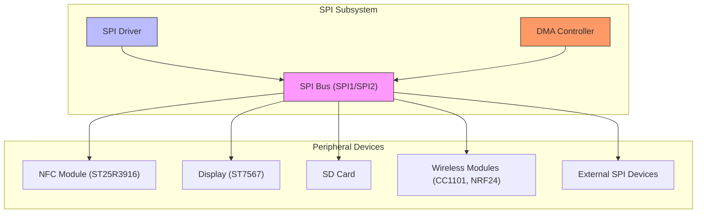
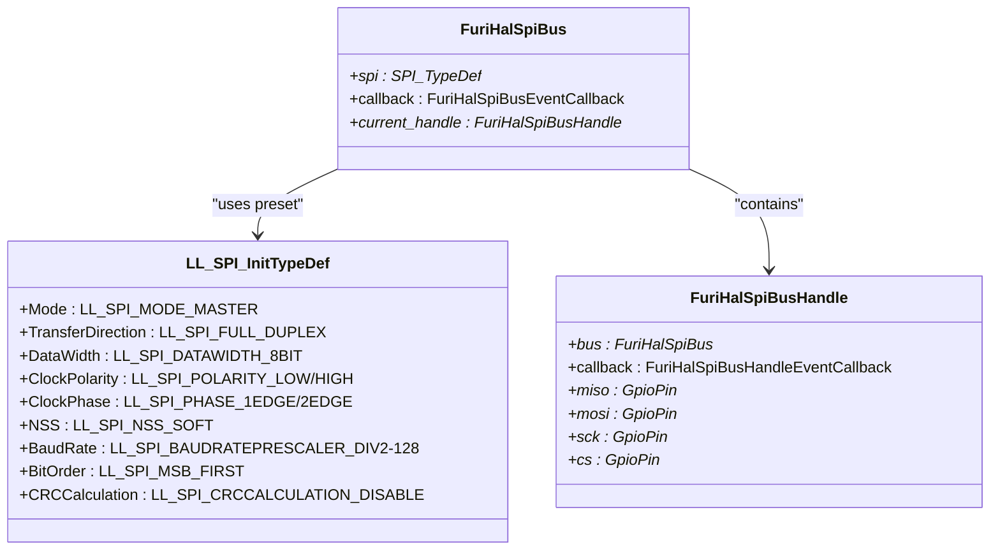
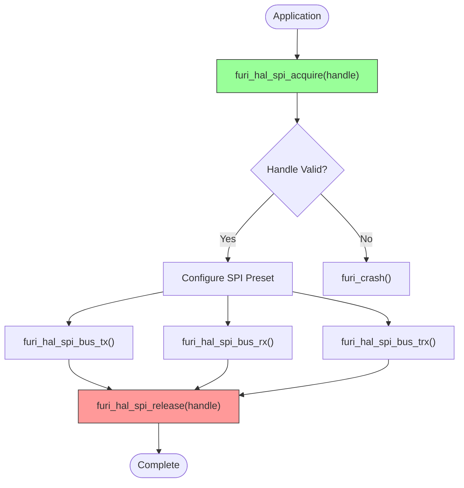
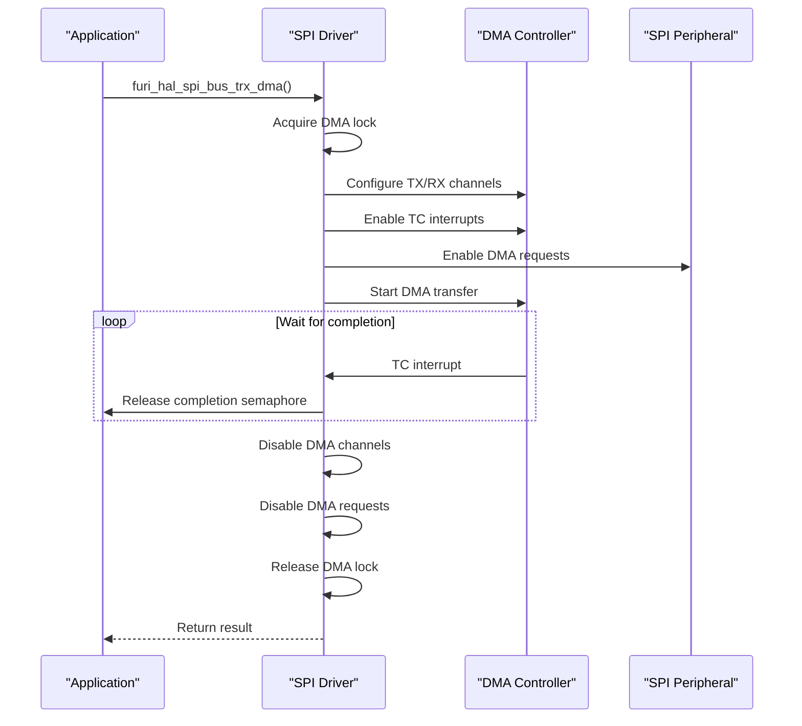
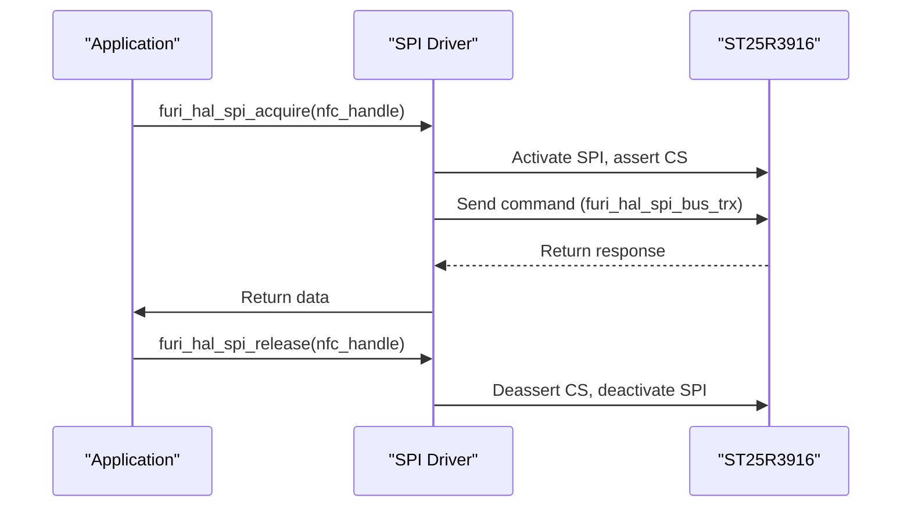
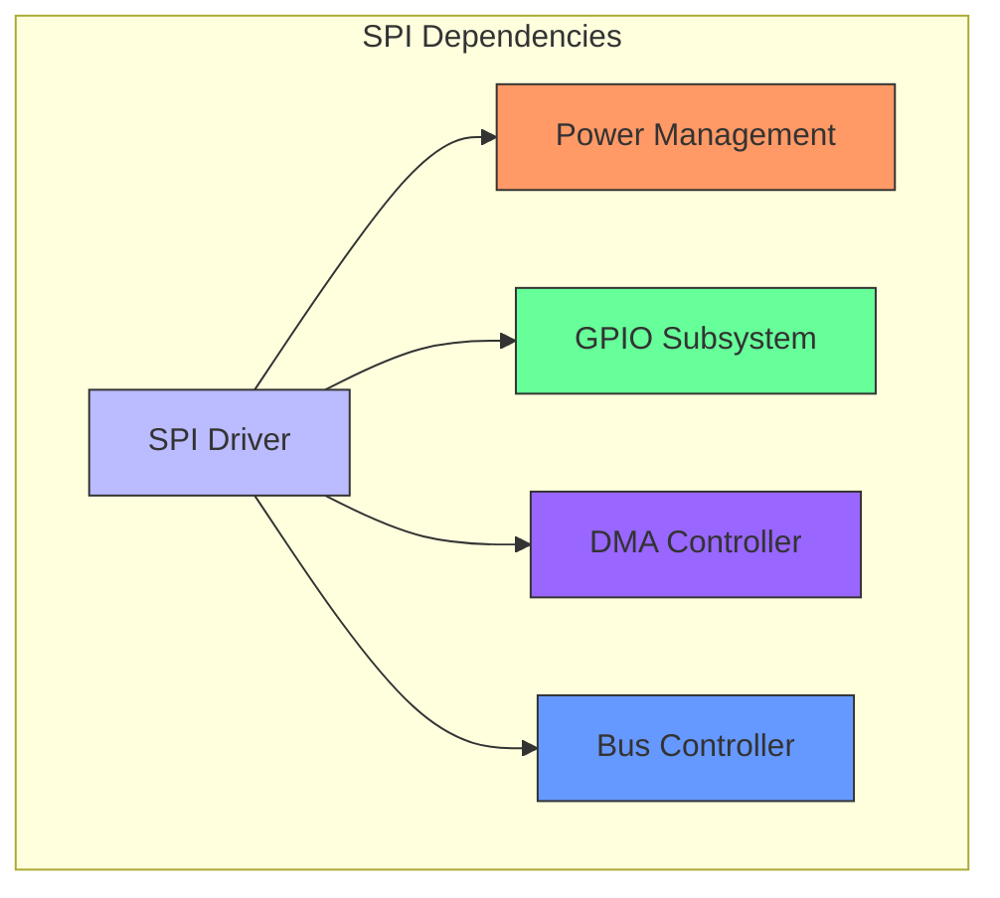

# SPI Interface

<cite>
**Referenced Files in This Document**   
- [furi_hal_spi.h](file://targets/furi_hal_include/furi_hal_spi.h)
- [furi_hal_spi.c](file://targets/f7/furi_hal/furi_hal_spi.c)
- [furi_hal_spi_config.h](file://targets/f7/furi_hal/furi_hal_spi_config.h)
- [furi_hal_spi_config.c](file://targets/f7/furi_hal/furi_hal_spi_config.c)
- [furi_hal_spi_types.h](file://targets/f7/furi_hal/furi_hal_spi_types.h)
- [furi_hal_sd.c](file://targets/f7/furi_hal/furi_hal_sd.c)
- [cc1101.c](file://lib/drivers/cc1101.c)
- [nrf24.c](file://applications/external/nrf24channelscanner/lib/nrf24/nrf24.c)
- [platform.c](file://applications/external/esubghz_chat/lib/nfclegacy/ST25RFAL002/platform.c)
</cite>

## Table of Contents
1. [Introduction](#introduction)
2. [SPI Architecture Overview](#spi-architecture-overview)
3. [SPI Configuration and Modes](#spi-configuration-and-modes)
4. [API Functions and Usage](#api-functions-and-usage)
5. [DMA Support](#dma-support)
6. [Application Examples](#application-examples)
7. [Component Relationships](#component-relationships)
8. [Common Issues and Troubleshooting](#common-issues-and-troubleshooting)
9. [Performance Optimization](#performance-optimization)
10. [Conclusion](#conclusion)

## Introduction
The SPI (Serial Peripheral Interface) subsystem in the Flipper Zero firmware provides a robust interface for communicating with various peripheral devices such as displays, wireless modules, and SD cards. This document details the implementation of the SPI driver, covering mode selection, clock configuration, data frame handling, and DMA support. The documentation is designed to be accessible to beginners while providing technical depth for experienced developers regarding register configuration and performance optimization.

## SPI Architecture Overview



**Diagram sources**
- [furi_hal_spi_config.c](file://targets/f7/furi_hal/furi_hal_spi_config.c#L118-L145)
- [furi_hal_spi_types.h](file://targets/f7/furi_hal/furi_hal_spi_types.h#L30-L35)

**Section sources**
- [furi_hal_spi_config.c](file://targets/f7/furi_hal/furi_hal_spi_config.c#L76-L447)
- [furi_hal_spi_types.h](file://targets/f7/furi_hal/furi_hal_spi_types.h#L14-L63)

## SPI Configuration and Modes

The Flipper Zero implements two SPI buses (SPI1 and SPI2) with multiple preset configurations for different peripheral requirements. The system supports all four SPI modes (0-3) through clock polarity and phase settings.

### SPI Presets
The firmware defines several preset configurations optimized for specific peripherals:

- **furi_hal_spi_preset_2edge_low_8m**: Mode 3 (CPOL=1, CPHA=1) at 8MHz for ST25R3916 NFC module
- **furi_hal_spi_preset_1edge_low_8m**: Mode 0 (CPOL=0, CPHA=0) at 8MHz for CC1101 wireless module  
- **furi_hal_spi_preset_1edge_low_4m**: Mode 0 (CPOL=0, CPHA=0) at 4MHz for ST7567 display
- **furi_hal_spi_preset_1edge_low_16m**: Mode 0 (CPOL=0, CPHA=0) at 16MHz for SD card (fast mode)
- **furi_hal_spi_preset_1edge_low_2m**: Mode 0 (CPOL=0, CPHA=0) at 2MHz for SD card (slow mode) and external devices

### Bus Configuration
The system implements two main SPI buses:
- **SPI Bus R (Radio)**: SPI1 connected to NFC, Sub-GHz, and external peripherals
- **SPI Bus D (Display)**: SPI2 connected to display and SD card

Each bus handles clock polarity, phase, data width (8-bit), and baud rate configuration through the LL_SPI_InitTypeDef structure.



**Diagram sources**
- [furi_hal_spi_config.c](file://targets/f7/furi_hal/furi_hal_spi_config.c#L11-L74)
- [furi_hal_spi_types.h](file://targets/f7/furi_hal/furi_hal_spi_types.h#L30-L58)

**Section sources**
- [furi_hal_spi_config.c](file://targets/f7/furi_hal/furi_hal_spi_config.c#L11-L74)
- [furi_hal_spi_config.h](file://targets/f7/furi_hal/furi_hal_spi_config.h#L9-L23)

## API Functions and Usage

The SPI interface provides a comprehensive API for communication with peripheral devices. All operations require acquiring the bus before use and releasing it afterward to ensure proper resource management.

### Core API Functions



**Diagram sources**
- [furi_hal_spi.c](file://targets/f7/furi_hal/furi_hal_spi.c#L51-L78)
- [furi_hal_spi.h](file://targets/furi_hal_include/furi_hal_spi.h#L52-L60)

### Function Details

#### furi_hal_spi_acquire
Acquires the SPI bus for exclusive use. This function:
- Enters power insomnia mode to prevent sleep during SPI operations
- Locks the bus mutex to prevent concurrent access
- Activates the SPI peripheral
- Sets up GPIO pins for SPI operation
- Asserts the chip select (CS) line

#### furi_hal_spi_release
Releases the SPI bus after use. This function:
- Deasserts the chip select (CS) line
- Deinitializes GPIO pins to analog mode
- Disables the SPI peripheral
- Unlocks the bus mutex
- Exits power insomnia mode

#### furi_hal_spi_bus_tx
Transmits data to a peripheral device:
- Takes a transmit buffer and size parameter
- Implements blocking transmission with timeout
- Handles FIFO management and completion checking
- Returns true on success, false on failure

#### furi_hal_spi_bus_rx
Receives data from a peripheral device:
- Takes a receive buffer and size parameter
- Transmits dummy bytes (0xFF) while receiving
- Implements blocking reception with timeout
- Returns true on success, false on failure

#### furi_hal_spi_bus_trx
Performs simultaneous transmit and receive operations:
- Supports full-duplex communication
- Can handle different transmit and receive buffers
- Uses dummy data (0xFF) when transmit buffer is NULL
- Manages both TX and RX FIFOs during operation

**Section sources**
- [furi_hal_spi.c](file://targets/f7/furi_hal/furi_hal_spi.c#L51-L171)
- [furi_hal_spi.h](file://targets/furi_hal_include/furi_hal_spi.h#L62-L107)

## DMA Support

The SPI subsystem includes DMA (Direct Memory Access) support for high-performance data transfers, particularly important for SD card operations and large data transfers.

### DMA Configuration
The system uses DMA2 with dedicated channels for SPI1 and SPI2:
- **SPI1**: RX on DMA2 Channel 6, TX on DMA2 Channel 7
- **SPI2**: RX on DMA2 Channel 6, TX on DMA2 Channel 7

The DMA implementation uses semaphores for synchronization:
- `spi_dma_lock`: Ensures only one DMA transaction at a time
- `spi_dma_completed`: Signals transaction completion

### furi_hal_spi_bus_trx_dma Function
This function enables DMA-based SPI transactions:
- Automatically falls back to blocking mode if the scheduler is not running
- Configures DMA channels for both transmit and receive operations
- Sets up interrupt service routines for completion detection
- Implements timeout handling for robust operation
- Properly cleans up DMA configuration after completion

The function handles three operational modes:
1. **TX-only mode**: Uses only the TX DMA channel
2. **RX-only mode**: Uses both TX and RX channels with dummy data for TX
3. **TRX mode**: Uses both TX and RX channels with actual data



**Diagram sources**
- [furi_hal_spi.c](file://targets/f7/furi_hal/furi_hal_spi.c#L194-L378)
- [furi_hal_spi.h](file://targets/furi_hal_include/furi_hal_spi.h#L119-L124)

**Section sources**
- [furi_hal_spi.c](file://targets/f7/furi_hal/furi_hal_spi.c#L194-L378)
- [furi_hal_spi.h](file://targets/furi_hal_include/furi_hal_spi.h#L109-L124)

## Application Examples

### Display Communication (ST7567)
The display subsystem uses the SPI Bus D with the furi_hal_spi_bus_handle_display handle:
- Preset: furi_hal_spi_preset_1edge_low_4m (Mode 0, 4MHz)
- CS: gpio_display_cs
- Implementation in u8g2 library integration

### SD Card Operations
The SD card driver uses both fast and slow SPI modes:
- **Fast mode**: furi_hal_spi_preset_1edge_low_16m (16MHz) for normal operations
- **Slow mode**: furi_hal_spi_preset_1edge_low_2m (2MHz) for initialization

The SD card driver extensively uses DMA for block transfers:
```c
furi_check(furi_hal_spi_bus_trx_dma(
    furi_hal_sd_spi_handle, 
    tx_data, 
    rx_data, 
    block_size, 
    SD_TIMEOUT_MS));
```

### Wireless Module (NRF24)
External applications like nrf24channelscanner use SPI for NRF24L01+ communication:
- Uses furi_hal_spi_bus_trx for register read/write operations
- Implements proper chip select management
- Handles timeout conditions during communication

### NFC Module (ST25R3916)
The NFC subsystem communicates with the ST25R3916 chip using:
- Preset: furi_hal_spi_preset_2edge_low_8m (Mode 3, 8MHz)
- Special GPIO configuration for transparent mode when deactivated
- Full duplex communication for command/response protocol



**Diagram sources**
- [furi_hal_spi_config.c](file://targets/f7/furi_hal/furi_hal_spi_config.c#L328-L335)
- [furi_hal_sd.c](file://targets/f7/furi_hal/furi_hal_sd.c#L269-L299)
- [nrf24.c](file://applications/external/nrf24channelscanner/lib/nrf24/nrf24.c#L54)
- [platform.c](file://applications/external/esubghz_chat/lib/nfclegacy/ST25RFAL002/platform.c#L67)

**Section sources**
- [furi_hal_sd.c](file://targets/f7/furi_hal/furi_hal_sd.c#L269-L299)
- [cc1101.c](file://lib/drivers/cc1101.c#L14-L184)
- [nrf24.c](file://applications/external/nrf24channelscanner/lib/nrf24/nrf24.c#L45-L54)

## Component Relationships

### Integration with Power Management
The SPI subsystem integrates with the power management system through:
- Power insomnia mode during SPI operations to prevent sleep
- furi_hal_power_insomnia_enter() on acquire
- furi_hal_power_insomnia_exit() on release
- Ensures stable power during critical communication sequences

### GPIO Resource Management
The system uses a structured approach to GPIO management:
- Dedicated GPIO pins for each SPI function (MISO, MOSI, SCK, CS)
- Proper initialization and deinitialization in event callbacks
- Pull-up/pull-down configurations optimized for each peripheral
- Speed settings (VeryHigh) for reliable high-speed operation

### Bus Arbitration
The implementation includes mutex-based arbitration:
- furi_hal_spi_bus_r_mutex for SPI1 bus
- furi_hal_spi_bus_d_mutex for SPI2 bus
- Prevents concurrent access from multiple threads
- Ensures data integrity during multi-threaded operations



**Diagram sources**
- [furi_hal_spi.c](file://targets/f7/furi_hal/furi_hal_spi.c#L54-L77)
- [furi_hal_spi_config.c](file://targets/f7/furi_hal/furi_hal_spi_config.c#L102-L115)
- [furi_hal_spi_config.c](file://targets/f7/furi_hal/furi_hal_spi_config.c#L127-L139)

**Section sources**
- [furi_hal_spi.c](file://targets/f7/furi_hal/furi_hal_spi.c#L54-L78)
- [furi_hal_spi_config.c](file://targets/f7/furi_hal/furi_hal_spi_config.c#L101-L145)

## Common Issues and Troubleshooting

### Clock Synchronization
Common clock issues and solutions:
- **Clock polarity/phase mismatch**: Verify the correct preset is used for the peripheral
- **Clock speed too high**: Use slower presets during initialization, then switch to faster mode
- **Clock jitter**: Ensure proper power supply and decoupling capacitors

### Chip Select Management
Proper chip select handling is critical:
- Always acquire the SPI handle before communication
- Ensure CS is properly asserted (low) during transactions
- Verify CS is deasserted (high) after release
- Check for floating CS lines when bus is inactive

### Buffer Overflow Conditions
Prevention strategies:
- Always check buffer sizes before transmission
- Implement proper timeout handling
- Clear overflow flags after operations
- Monitor FIFO levels during long transfers

### Error Handling
The system implements robust error handling:
- furi_check() for parameter validation
- furi_crash() for unrecoverable programming errors
- Timeout mechanisms for blocking operations
- Semaphore-based synchronization for DMA operations

### Debugging Tips
- Use furi_hal_spi_bus_trx instead of separate tx/rx calls when possible
- Verify the correct SPI handle is acquired before use
- Check that the bus is not already in use by another component
- Monitor power consumption during SPI operations
- Use logic analyzer to verify signal integrity

**Section sources**
- [furi_hal_spi.c](file://targets/f7/furi_hal/furi_hal_spi.c#L80-L89)
- [furi_hal_spi.c](file://targets/f7/furi_hal/furi_hal_spi.c#L124-L125)
- [furi_hal_spi.c](file://targets/f7/furi_hal/furi_hal_spi.c#L347-L350)

## Performance Optimization

### Baud Rate Selection
Optimize baud rates based on peripheral requirements:
- Use 16MHz for SD card read/write operations
- Use 8MHz for CC1101 and NFC communications
- Use 4MHz for display updates
- Use 2MHz for initialization sequences and external devices

### DMA Utilization
Maximize DMA usage for:
- Large data transfers (SD card blocks)
- Continuous data streaming
- Background operations that don't require CPU intervention
- Operations where CPU resources are needed for other tasks

### Transaction Batching
Improve efficiency by:
- Combining multiple small transactions when possible
- Minimizing bus acquire/release cycles
- Using full-duplex communication instead of separate tx/rx calls
- Prefetching data when predictable access patterns exist

### Power Management
Balance performance and power consumption:
- Use fastest acceptable speed for time-critical operations
- Switch to lower speeds when possible to reduce power
- Minimize time in power insomnia mode
- Release the bus promptly after operations complete

## Conclusion
The SPI interface in the Flipper Zero firmware provides a flexible and robust communication channel for various peripheral devices. The implementation supports multiple SPI modes, baud rates, and includes DMA support for high-performance applications. The architecture emphasizes resource management through proper bus arbitration, power management integration, and error handling. Developers should follow best practices for chip select management, clock configuration, and buffer handling to ensure reliable communication with peripheral devices. The comprehensive API and preset configurations simplify development while providing the flexibility needed for various peripheral requirements.