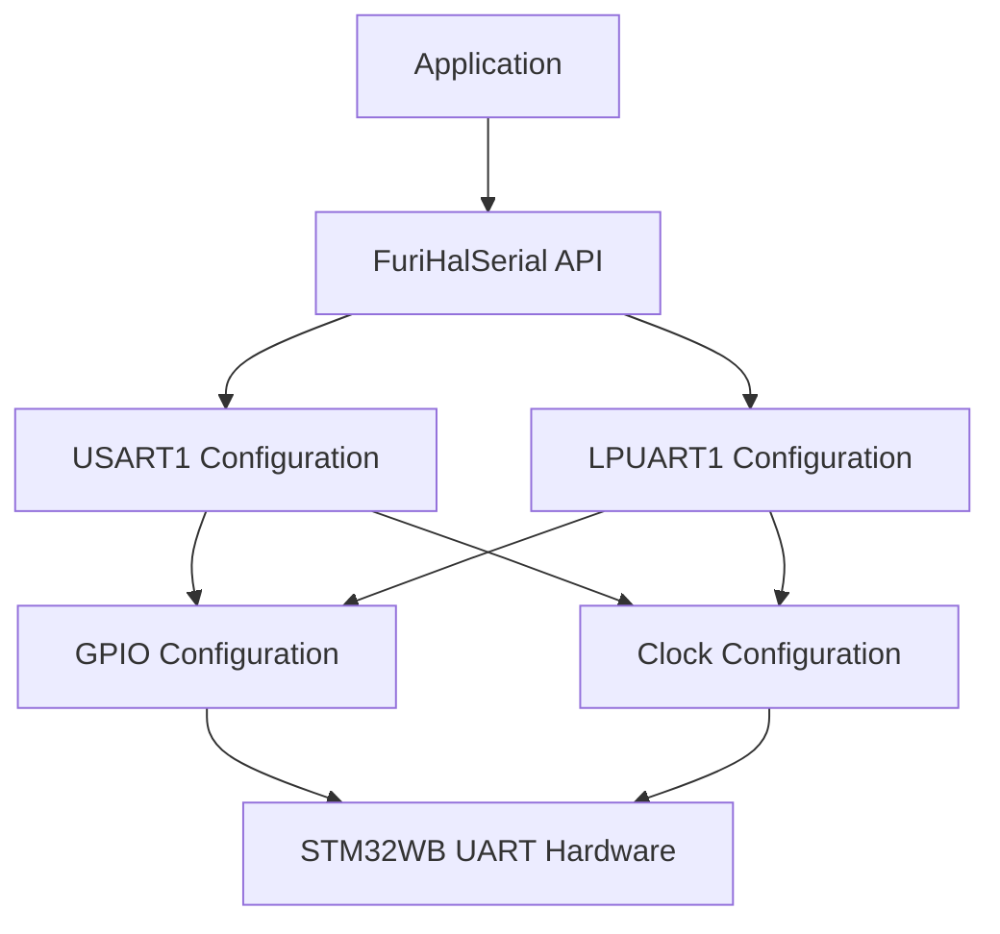
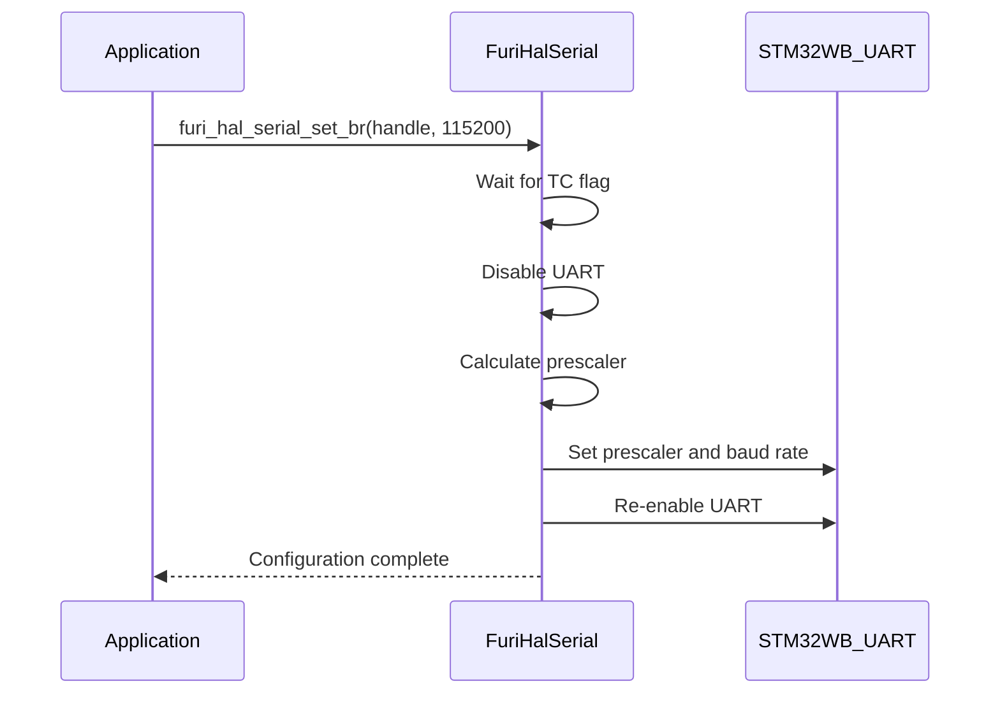
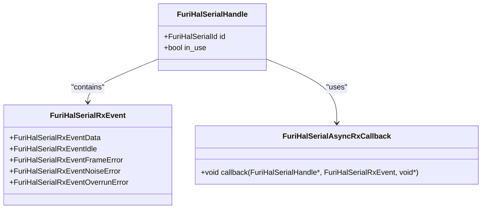
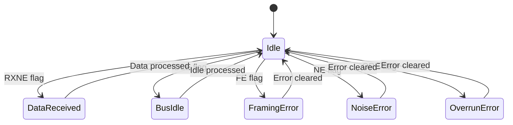
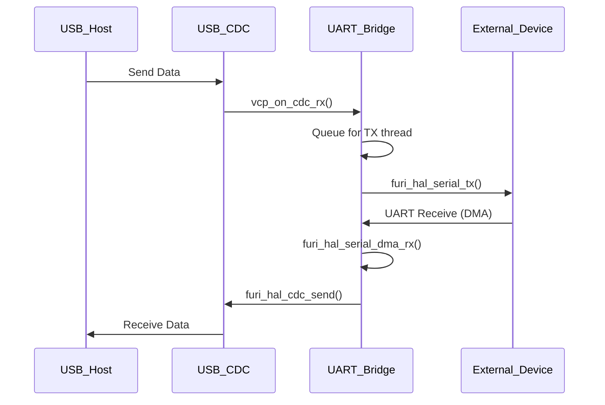

# UART Interface

<cite>
**Referenced Files in This Document**   
- [furi_hal_serial.h](file://targets/f7/furi_hal/furi_hal_serial.h)
- [furi_hal_serial.c](file://targets/f7/furi_hal/furi_hal_serial.c)
- [furi_hal_serial_control.h](file://targets/f7/furi_hal/furi_hal_serial_control.h)
- [furi_hal_serial_control.c](file://targets/f7/furi_hal/furi_hal_serial_control.c)
- [furi_hal_serial_types.h](file://targets/f7/furi_hal/furi_hal_serial_types.h)
- [furi_hal_serial_types_i.h](file://targets/f7/furi_hal/furi_hal_serial_types_i.h)
- [uart_echo.c](file://applications/debug/uart_echo/uart_echo.c)
- [usb_uart_bridge.c](file://applications/main/gpio/usb_uart_bridge.c)
- [stm32wbxx_hal_uart.h](file://lib/stm32wb_hal/Inc/stm32wbxx_hal_uart.h)
- [stm32wbxx_hal_uart.c](file://lib/stm32wb_hal/Src/stm32wbxx_hal_uart.c)
</cite>

## Table of Contents
1. [Introduction](#introduction)
2. [UART Hardware and Configuration](#uart-hardware-and-configuration)
3. [Baud Rate Configuration](#baud-rate-configuration)
4. [Data, Stop, and Parity Settings](#data-stop-and-parity-settings)
5. [Flow Control Options](#flow-control-options)
6. [UART API Functions](#uart-api-functions)
7. [Interrupt and DMA Handling](#interrupt-and-dma-handling)
8. [FIFO Management](#fifo-management)
9. [Error Handling](#error-handling)
10. [Power Management Integration](#power-management-integration)
11. [Practical Usage Examples](#practical-usage-examples)
12. [Troubleshooting Common Issues](#troubleshooting-common-issues)

## Introduction
The UART Interface in the Flipper Zero firmware provides a comprehensive serial communication system that enables debugging, external device communication, and protocol implementation. This document details the implementation of the UART driver, covering configuration parameters, API functions, interrupt handling, and practical usage patterns. The system is built on a layered architecture that abstracts the STM32WB HAL UART implementation with a higher-level Flipper HAL interface, providing both simplicity for beginners and advanced capabilities for experienced developers.

**Section sources**
- [furi_hal_serial.h](file://targets/f7/furi_hal/furi_hal_serial.h#L1-L251)
- [furi_hal_serial.c](file://targets/f7/furi_hal/furi_hal_serial.c#L1-L974)

## UART Hardware and Configuration
The Flipper Zero implements two UART interfaces: USART1 and LPUART1, both managed through the STM32WB microcontroller. The system provides a hardware abstraction layer that simplifies access to these interfaces while maintaining full control over configuration parameters. The UART driver supports standard serial communication parameters including baud rate, data bits, stop bits, parity, and flow control.

The Flipper HAL Serial interface provides two UART channels:
- **USART1**: Standard UART interface with higher performance capabilities
- **LPUART1**: Low-power UART interface optimized for power efficiency

These interfaces are accessed through the `FuriHalSerialId` enumeration, which defines the available UART channels in the system.



**Diagram sources**
- [furi_hal_serial.h](file://targets/f7/furi_hal/furi_hal_serial.h#L8-L13)
- [furi_hal_serial.c](file://targets/f7/furi_hal/furi_hal_serial.c#L44-L85)

## Baud Rate Configuration
The UART driver supports a wide range of baud rates from 9600 to 4,000,000 baud, allowing for flexible communication with various external devices. The baud rate configuration is handled through the `furi_hal_serial_set_br()` function, which dynamically adjusts the UART prescaler and baud rate registers to achieve the desired communication speed.

The system validates baud rate support through the `furi_hal_serial_is_baud_rate_supported()` function, which checks if the requested baud rate falls within the supported range (9600-4000000). When changing baud rates, the driver ensures transmission completion before reconfiguration to prevent data corruption.



**Diagram sources**
- [furi_hal_serial.h](file://targets/f7/furi_hal/furi_hal_serial.h#L60-L65)
- [furi_hal_serial.c](file://targets/f7/furi_hal/furi_hal_serial.c#L579-L606)

## Data, Stop, and Parity Settings
The UART interface implements standard 8N1 configuration by default (8 data bits, no parity, 1 stop bit), which is the most common serial communication configuration. The driver supports the following configuration options:

- **Data bits**: 8 bits (fixed in current implementation)
- **Stop bits**: 1 bit (fixed in current implementation)
- **Parity**: None (fixed in current implementation)

These settings are configured during initialization in the `furi_hal_serial_usart_init()` and `furi_hal_serial_lpuart_init()` functions using the STM32 LL (Low Layer) HAL functions. The configuration is set through the `LL_USART_InitTypeDef` and `LL_LPUART_InitTypeDef` structures, which define the UART parameters.

The current implementation maintains fixed settings for data bits, stop bits, and parity to simplify the interface and ensure compatibility with most external devices. Advanced configuration options could be added through extension of the API if required for specific use cases.

**Section sources**
- [furi_hal_serial.c](file://targets/f7/furi_hal/furi_hal_serial.c#L274-L283)
- [furi_hal_serial.c](file://targets/f7/furi_hal/furi_hal_serial.c#L477-L485)

## Flow Control Options
The UART driver supports both hardware and software flow control mechanisms to manage data transmission and prevent buffer overruns. Hardware flow control is implemented through RTS/CTS signals, while software flow control uses XON/XOFF characters.

The USB UART bridge application demonstrates flow control implementation by mapping USB CDC control lines (DTR/RTS) to GPIO pins that can be connected to external devices. The system supports three configurable flow control pin pairs:
- Pins 2 and 3 (GPIO_PA7, GPIO_PB2)
- Pins 6 and 7 (GPIO_PB2, GPIO_PC3)
- Pins 16 and 15 (GPIO_PC0, GPIO_PC1)

Flow control is managed through the `usb_uart_update_ctrl_lines()` function, which reads the USB CDC control line state and updates the corresponding GPIO outputs. This allows external devices to signal when they are ready to receive data (RTS) or when the Flipper Zero should pause transmission (DTR).

**Section sources**
- [usb_uart_bridge.c](file://applications/main/gpio/usb_uart_bridge.c#L20-L24)
- [usb_uart_bridge.c](file://applications/main/gpio/usb_uart_bridge.c#L167-L175)

## UART API Functions
The Flipper HAL provides a comprehensive API for UART communication with functions for initialization, data transmission, reception, and configuration. The API is designed to be intuitive while providing access to advanced features.

### Core API Functions



**Diagram sources**
- [furi_hal_serial_types.h](file://targets/f7/furi_hal/furi_hal_serial_types.h#L8-L23)
- [furi_hal_serial.h](file://targets/f7/furi_hal/furi_hal_serial.h#L89-L109)

#### Initialization and Configuration
- `furi_hal_serial_init()`: Initializes the UART interface with specified baud rate
- `furi_hal_serial_deinit()`: De-initializes the UART interface
- `furi_hal_serial_suspend()`: Suspends UART operation while preserving settings
- `furi_hal_serial_resume()`: Resumes UART operation from suspended state
- `furi_hal_serial_set_br()`: Changes the baud rate dynamically

#### Data Transmission
- `furi_hal_serial_tx()`: Transmits data in semi-blocking mode
- `furi_hal_serial_tx_wait_complete()`: Waits for transmission completion

#### Asynchronous Reception
- `furi_hal_serial_async_rx_start()`: Starts asynchronous reception with callback
- `furi_hal_serial_async_rx_stop()`: Stops asynchronous reception
- `furi_hal_serial_async_rx_available()`: Checks if data is available for reading
- `furi_hal_serial_async_rx()`: Reads received data byte

#### DMA-Based Reception
- `furi_hal_serial_dma_rx_start()`: Starts DMA-based reception
- `furi_hal_serial_dma_rx_stop()`: Stops DMA-based reception
- `furi_hal_serial_dma_rx()`: Reads data from DMA buffer

**Section sources**
- [furi_hal_serial.h](file://targets/f7/furi_hal/furi_hal_serial.h#L24-L247)

## Interrupt and DMA Handling
The UART driver implements a sophisticated interrupt and DMA handling system to efficiently manage data reception while minimizing CPU overhead. The system uses both interrupt-driven and DMA-based reception methods, allowing applications to choose the appropriate approach based on their requirements.

### Interrupt Handling Architecture
The interrupt system is configured through the `furi_hal_interrupt_set_isr()` function, which registers interrupt service routines (ISRs) for UART events. The driver uses separate ISRs for USART1 and LPUART1:
- `furi_hal_serial_usart_irq_callback()` for USART1
- `furi_hal_serial_lpuart_irq_callback()` for LPUART1

These ISRs handle various UART events including data reception, idle line detection, and error conditions. The ISRs process the hardware flags and convert them into higher-level events that are passed to the application callback.

### DMA Reception Implementation
The DMA-based reception system uses circular DMA buffers to efficiently capture incoming data without CPU intervention. The implementation includes:

- 256-byte circular DMA buffer (`FURI_HAL_SERIAL_DMA_BUFFER_SIZE`)
- Half-transfer (HT) and transfer-complete (TC) interrupt handling
- Circular DMA mode for continuous data capture
- Buffer management with read and write pointers

The DMA system triggers callbacks when half the buffer is filled or when the buffer is completely filled, allowing applications to process data in chunks without missing incoming bytes.

```mermaid
flowchart TD
A[UART Receive] --> B{DMA Enabled?}
B --> |Yes| C[DMA Transfers Data to Circular Buffer]
C --> D[HT/TC Interrupt]
D --> E[Application Callback]
E --> F[Process Data with furi_hal_serial_dma_rx()]
B --> |No| G[Interrupt-Driven Reception]
G --> H[Application Callback]
H --> I[Process Data with furi_hal_serial_async_rx()]
```

**Diagram sources**
- [furi_hal_serial.c](file://targets/f7/furi_hal/furi_hal_serial.c#L96-L142)
- [furi_hal_serial.c](file://targets/f7/furi_hal/furi_hal_serial.c#L185-L233)

## FIFO Management
The UART driver leverages the hardware FIFO (First-In-First-Out) buffers available in the STM32WB microcontroller to improve data throughput and reduce interrupt frequency. Both USART1 and LPUART1 interfaces have built-in FIFOs that can store multiple data bytes.

The FIFO is enabled during initialization using the `LL_USART_EnableFIFO()` and `LL_LPUART_EnableFIFO()` functions. The driver configures the FIFO threshold to optimize performance based on the communication requirements.

For DMA-based reception, the system implements a software FIFO using the circular DMA buffer. This dual-layer FIFO system (hardware FIFO + software circular buffer) provides robust protection against data loss during high-speed communication or when the CPU is busy with other tasks.

The buffer management system tracks the read and write positions in the circular buffer:
- `buffer_rx_index_write`: Position where DMA writes incoming data
- `buffer_rx_index_read`: Position from which the application reads data

This implementation allows for efficient data transfer between the DMA controller and the application without requiring data copying.

**Section sources**
- [furi_hal_serial.c](file://targets/f7/furi_hal/furi_hal_serial.c#L284-L285)
- [furi_hal_serial.c](file://targets/f7/furi_hal/furi_hal_serial.c#L486-L487)

## Error Handling
The UART driver implements comprehensive error handling to detect and report communication issues. The system monitors for several types of errors:

- **Framing Error**: Incorrect start/stop bit timing
- **Noise Error**: Signal interference on the line
- **Overrun Error**: Receiver buffer overflow
- **Parity Error**: Data corruption (though parity is disabled in current configuration)

These errors are detected through hardware flags in the UART status register and reported to the application through the receive callback mechanism. The `FuriHalSerialRxEvent` enumeration defines the error types that can be reported:



**Diagram sources**
- [furi_hal_serial.h](file://targets/f7/furi_hal/furi_hal_serial.h#L90-L96)
- [furi_hal_serial.c](file://targets/f7/furi_hal/furi_hal_serial.c#L109-L124)

The error handling system clears the error flags after detection to prevent repeated interrupts for the same error condition. Applications can choose to receive error notifications by setting the `report_errors` parameter to `true` when starting asynchronous reception.

## Power Management Integration
The UART interface is integrated with the Flipper Zero's power management system to optimize energy consumption. The driver supports suspend and resume operations that can be used during low-power modes:

- `furi_hal_serial_suspend()`: Disables the UART hardware while preserving configuration
- `furi_hal_serial_resume()`: Re-enables the UART hardware with previous configuration

The serial control system also provides global suspend and resume functions:
- `furi_hal_serial_control_suspend()`: Suspends all serial interfaces
- `furi_hal_serial_control_resume()`: Resumes all serial interfaces

These functions are typically called during power state transitions to ensure proper handling of UART interfaces when entering or exiting low-power modes.

The LPUART1 interface is specifically designed for low-power operation and can maintain communication while consuming minimal power, making it suitable for battery-powered applications.

**Section sources**
- [furi_hal_serial.h](file://targets/f7/furi_hal/furi_hal_serial.h#L35-L49)
- [furi_hal_serial_control.h](file://targets/f7/furi_hal/furi_hal_serial_control.h#L15-L27)

## Practical Usage Examples
The Flipper Zero firmware includes several practical examples that demonstrate UART usage patterns for different applications.

### UART Echo Application
The UART echo application (`uart_echo.c`) demonstrates a complete UART implementation for debugging and testing. It shows how to:

1. Acquire the UART interface using `furi_hal_serial_control_acquire()`
2. Initialize the UART with a specified baud rate
3. Configure asynchronous reception with error reporting
4. Implement a worker thread to handle received data
5. Echo received data back to the sender
6. Display received data on the screen

The application uses a stream buffer to transfer data between the interrupt context and the worker thread, ensuring thread-safe communication.

### USB UART Bridge
The USB UART bridge application (`usb_uart_bridge.c`) demonstrates how to bridge USB CDC communication with UART. This implementation:

1. Uses DMA for efficient UART reception
2. Implements flow control through GPIO pins
3. Handles USB CDC control signals (DTR, RTS)
4. Supports dynamic configuration changes
5. Manages bidirectional data flow between USB and UART

The bridge uses separate threads for RX and TX operations to ensure responsive performance and prevent blocking.



**Diagram sources**
- [uart_echo.c](file://applications/debug/uart_echo/uart_echo.c#L106-L138)
- [usb_uart_bridge.c](file://applications/main/gpio/usb_uart_bridge.c#L87-L106)

## Troubleshooting Common Issues
### Buffer Overruns
Buffer overruns occur when data is received faster than it can be processed. Prevention strategies include:

- Using DMA-based reception instead of interrupt-driven reception
- Increasing the stream buffer size
- Optimizing the data processing code
- Implementing flow control

### Framing Errors
Framing errors indicate timing issues in the communication. Solutions include:

- Verifying baud rate matching between devices
- Checking for cable length and signal integrity issues
- Ensuring proper grounding between devices
- Reducing communication speed if necessary

### Baud Rate Mismatch
Baud rate mismatch is a common cause of communication failure. To avoid this:

- Verify both devices use the same baud rate
- Use standard baud rates when possible (9600, 115200, etc.)
- Implement baud rate detection if supported by the protocol
- Double-check configuration code for correct values

### Interrupt Priority Issues
The UART driver uses appropriate interrupt priorities to ensure reliable operation:

- UART interrupts are set to normal priority by default
- DMA interrupts are configured with high priority
- Critical sections are protected to prevent race conditions

Applications should avoid using higher interrupt priorities that could interfere with UART operation.

**Section sources**
- [furi_hal_serial.c](file://targets/f7/furi_hal/furi_hal_serial.c#L109-L124)
- [furi_hal_serial.c](file://targets/f7/furi_hal/furi_hal_serial.c#L304-L308)
- [furi_hal_interrupt.h](file://targets/f7/furi_hal/furi_hal_interrupt.h#L62-L76)