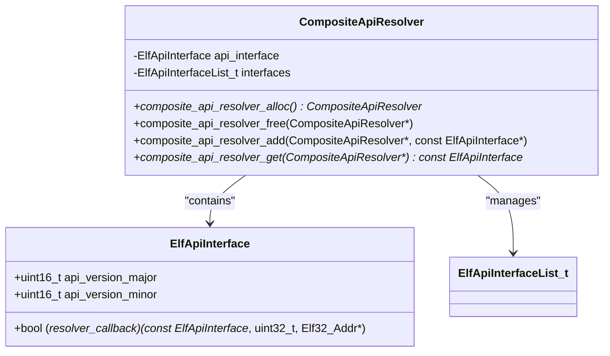
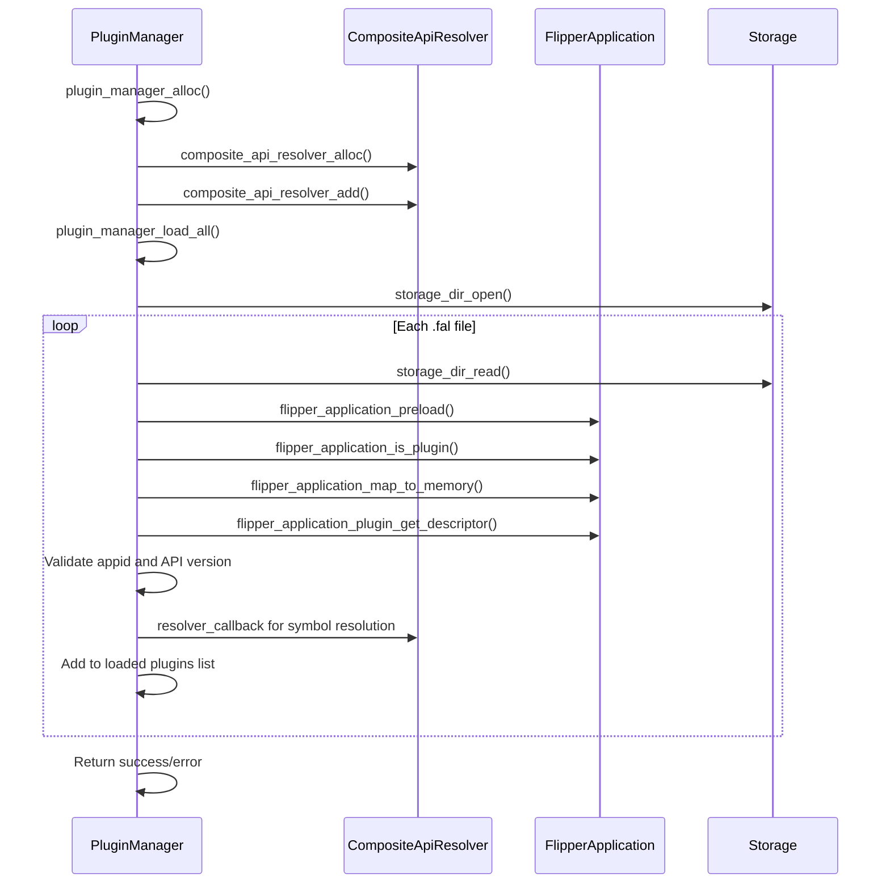
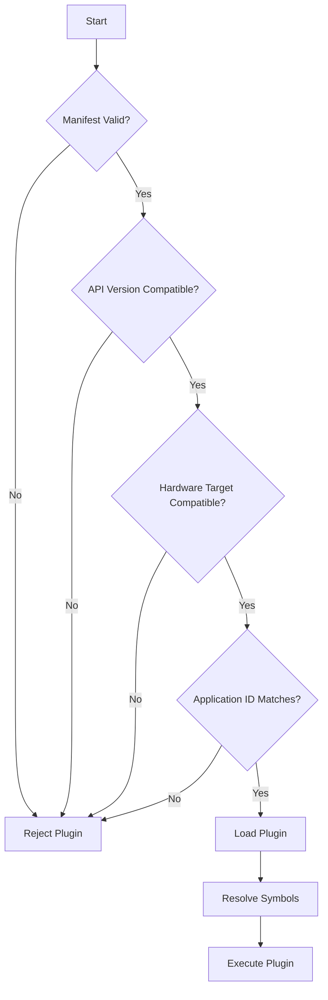

# Dependency Resolution

<cite>
**Referenced Files in This Document**   
- [composite_resolver.h](file://lib/flipper_application/plugins/composite_resolver.h)
- [composite_resolver.c](file://lib/flipper_application/plugins/composite_resolver.c)
- [plugin_manager.h](file://lib/flipper_application/plugins/plugin_manager.h)
- [plugin_manager.c](file://lib/flipper_application/plugins/plugin_manager.c)
- [application_manifest.h](file://lib/flipper_application/application_manifest.h)
- [application_manifest.c](file://lib/flipper_application/application_manifest.c)
- [elf_api_interface.h](file://lib/flipper_application/elf/elf_api_interface.h)
- [plugin_interface.h](file://applications/examples/example_plugins/plugin_interface.h)
- [example_plugins.c](file://applications/examples/example_plugins/example_plugins.c)
- [js_modules.c](file://applications/system/js_app/js_modules.c)
- [appmanifest.py](file://scripts/fbt/appmanifest.py)
- [fbt_extapps.py](file://scripts/fbt_tools/fbt_extapps.py)
</cite>

## Table of Contents
1. [Introduction](#introduction)
2. [Core Components](#core-components)
3. [Architecture Overview](#architecture-overview)
4. [Domain Model for Plugin Dependencies](#domain-model-for-plugin-dependencies)
5. [Composite Resolver Implementation](#composite-resolver-implementation)
6. [Plugin Manager Integration](#plugin-manager-integration)
7. [Dependency Resolution Process](#dependency-resolution-process)
8. [Version Compatibility and API Management](#version-compatibility-and-api-management)
9. [Manifest-Based Dependency Declaration](#manifest-based-dependency-declaration)
10. [Error Handling and Conflict Resolution](#error-handling-and-conflict-resolution)
11. [Developer Guidance for Plugin Dependencies](#developer-guidance-for-plugin-dependencies)
12. [Conclusion](#conclusion)

## Introduction
The Flipper Zero firmware implements a sophisticated plugin system that relies on a robust dependency resolution mechanism to ensure proper loading and execution of plugins. This document details the implementation of the composite resolver, which manages plugin dependencies and ensures version compatibility across the system. The dependency resolution system is designed to handle both direct and transitive dependencies while maintaining strict API version compatibility and hardware target constraints. The system enables modular extension of functionality while ensuring stability and compatibility across different firmware versions and hardware configurations.

## Core Components
The dependency resolution system in the Flipper Zero firmware consists of several key components that work together to manage plugin loading and dependency resolution. The core components include the Composite API Resolver, Plugin Manager, Application Manifest system, and ELF API Interface. These components work in concert to validate plugin compatibility, resolve symbol dependencies, and manage the loading process. The system is designed to be extensible while maintaining strict compatibility checks to prevent runtime errors and ensure system stability.

**Section sources**
- [composite_resolver.h](file://lib/flipper_application/plugins/composite_resolver.h)
- [plugin_manager.h](file://lib/flipper_application/plugins/plugin_manager.h)
- [application_manifest.h](file://lib/flipper_application/application_manifest.h)
- [elf_api_interface.h](file://lib/flipper_application/elf/elf_api_interface.h)

## Architecture Overview
The dependency resolution architecture in the Flipper Zero firmware follows a layered approach where the Plugin Manager coordinates the loading process while delegating API resolution to the Composite API Resolver. The system uses manifest files to declare plugin metadata and dependencies, which are validated during the loading process. The architecture supports both built-in and external plugins, with the ability to resolve dependencies across different application domains.

```mermaid
graph TD
A[Plugin Manager] --> B[Composite API Resolver]
A --> C[Application Manifest]
B --> D[ELF API Interface]
C --> E[Firmware Version]
C --> F[Hardware Target]
A --> G[Storage System]
G --> H[Plugin Files (.fal)]
B --> I[Symbol Resolution]
A --> J[Dependency Validation]
J --> K[API Version Check]
J --> L[Application ID Check]
J --> M[Hardware Compatibility]
```

**Diagram sources**
- [plugin_manager.h](file://lib/flipper_application/plugins/plugin_manager.h)
- [composite_resolver.h](file://lib/flipper_application/plugins/composite_resolver.h)
- [application_manifest.h](file://lib/flipper_application/application_manifest.h)

## Domain Model for Plugin Dependencies
The domain model for plugin dependencies in the Flipper Zero firmware is based on several key entities that define the relationships and constraints between plugins and the host system. The model includes the Application Manifest, which contains metadata about the plugin including its ID, API version, and hardware target compatibility. The ELF API Interface defines the contract for symbol resolution, while the Plugin Descriptor contains runtime information about loaded plugins. The system uses a combination of application IDs and API versions to ensure compatibility between plugins and their host applications.

### Key Domain Entities
- **Application Manifest**: Contains plugin metadata including magic number, version, API version, and hardware target ID
- **Plugin Descriptor**: Runtime representation of a loaded plugin with entry point and API version information
- **API Interface**: Defines the resolver callback function and API version for symbol resolution
- **Composite Resolver**: Aggregates multiple API resolvers to handle dependencies from different sources

**Section sources**
- [application_manifest.h](file://lib/flipper_application/application_manifest.h)
- [plugin_manager.h](file://lib/flipper_application/plugins/plugin_manager.h)
- [elf_api_interface.h](file://lib/flipper_application/elf/elf_api_interface.h)

## Composite Resolver Implementation
The Composite API Resolver is implemented as a container that aggregates multiple API resolvers and provides a unified interface for symbol resolution. It maintains a list of resolver interfaces and iterates through them in order when resolving symbols. The resolver uses the API version from the first resolver added to the composite, ensuring consistency across the resolution process. The implementation uses the m-list library to manage the collection of resolver interfaces efficiently.

### Key Implementation Details
- **Resolver Aggregation**: The composite resolver can incorporate multiple resolver interfaces, allowing it to resolve symbols from different sources
- **Ordered Resolution**: Resolvers are called in the order they were added, with the first successful resolution returning the symbol address
- **API Version Consistency**: The composite resolver uses the API version from the first resolver added, ensuring version consistency across all resolvers
- **Memory Management**: The resolver handles allocation and deallocation of its internal data structures, including the list of resolver interfaces



**Diagram sources**
- [composite_resolver.h](file://lib/flipper_application/plugins/composite_resolver.h)
- [composite_resolver.c](file://lib/flipper_application/plugins/composite_resolver.c)

**Section sources**
- [composite_resolver.h](file://lib/flipper_application/plugins/composite_resolver.h)
- [composite_resolver.c](file://lib/flipper_application/plugins/composite_resolver.c)

## Plugin Manager Integration
The Plugin Manager serves as the primary interface for loading and managing plugins, integrating closely with the Composite API Resolver to handle dependency resolution. It validates plugins against several criteria including application ID, API version, and hardware compatibility before loading them into memory. The Plugin Manager maintains a list of loaded plugins and provides access to their descriptors and entry points.

### Integration Points
- **API Interface Injection**: The Plugin Manager accepts an API interface parameter during initialization, which is used to resolve plugin dependencies
- **Composite Resolver Usage**: When plugins require access to multiple API sources, the Plugin Manager can use a Composite API Resolver to aggregate these sources
- **Error Handling**: The Plugin Manager returns specific error codes for different failure modes, including application ID mismatch and API version mismatch
- **Bulk Loading**: Supports loading all plugins from a directory, filtering by file extension (.fal)



**Diagram sources**
- [plugin_manager.h](file://lib/flipper_application/plugins/plugin_manager.h)
- [plugin_manager.c](file://lib/flipper_application/plugins/plugin_manager.c)

**Section sources**
- [plugin_manager.h](file://lib/flipper_application/plugins/plugin_manager.h)
- [plugin_manager.c](file://lib/flipper_application/plugins/plugin_manager.c)

## Dependency Resolution Process
The dependency resolution process in the Flipper Zero firmware follows a systematic approach to ensure that all plugin dependencies are properly resolved before execution. The process begins with manifest validation, followed by API version compatibility checks, and concludes with symbol resolution through the Composite API Resolver. This multi-stage process ensures that only compatible and valid plugins are loaded into the system.

### Resolution Workflow
1. **Manifest Validation**: The system first validates the plugin's manifest to ensure it has the correct magic number and version
2. **Application ID Check**: Verifies that the plugin's application ID matches the expected value for the host application
3. **API Version Check**: Compares the plugin's API version with the host's API version to ensure compatibility
4. **Hardware Target Check**: Validates that the plugin is compatible with the current hardware target
5. **Symbol Resolution**: Uses the Composite API Resolver to resolve any external symbols required by the plugin
6. **Memory Mapping**: Maps the plugin's code and data into memory for execution

The resolution process is designed to fail fast when incompatibilities are detected, preventing potentially unstable plugins from being loaded. Each step in the process is logged for debugging purposes, and specific error codes are returned to indicate the nature of any failures.

**Section sources**
- [plugin_manager.c](file://lib/flipper_application/plugins/plugin_manager.c)
- [application_manifest.c](file://lib/flipper_application/application_manifest.c)
- [composite_resolver.c](file://lib/flipper_application/plugins/composite_resolver.c)

## Version Compatibility and API Management
The Flipper Zero firmware implements a robust version compatibility system to ensure that plugins are compatible with the host application's API. The system uses a major.minor versioning scheme for API compatibility, where major version changes indicate breaking changes and minor version changes indicate backward-compatible additions. The compatibility checks are performed during the plugin loading process to prevent version mismatches.

### Compatibility Rules
- **Major Version**: Plugins must have the same major version as the host application's API
- **Minor Version**: Plugins can have a minor version less than or equal to the host application's API version
- **Backward Compatibility**: The system assumes that newer minor versions are backward compatible with older ones
- **Forward Compatibility**: Plugins with newer minor versions than the host API are rejected

The version compatibility system is implemented in the `flipper_application_manifest_is_too_old` and `flipper_application_manifest_is_too_new` functions, which compare the plugin's API version with the host's API version. This ensures that plugins cannot rely on API features that are not available in the current firmware version.



**Diagram sources**
- [application_manifest.h](file://lib/flipper_application/application_manifest.h)
- [application_manifest.c](file://lib/flipper_application/application_manifest.c)

**Section sources**
- [application_manifest.h](file://lib/flipper_application/application_manifest.h)
- [application_manifest.c](file://lib/flipper_application/application_manifest.c)

## Manifest-Based Dependency Declaration
Plugins in the Flipper Zero firmware declare their dependencies and compatibility requirements through the application manifest, a structured data format embedded in the plugin binary. The manifest contains critical metadata that the system uses to validate compatibility and resolve dependencies. This declarative approach allows the system to make informed decisions about plugin loading without executing potentially unsafe code.

### Manifest Structure
- **Magic Number**: Identifies the file as a valid Flipper application manifest
- **Manifest Version**: Specifies the version of the manifest format
- **API Version**: Declares the major and minor version of the API the plugin requires
- **Hardware Target ID**: Specifies the hardware platform the plugin is compatible with
- **Application ID**: Identifies the host application the plugin is designed for
- **Plugin Metadata**: Includes name, version, icon, and other descriptive information

The manifest-based approach enables static analysis of plugin requirements before loading, reducing the risk of runtime errors. The build system generates the manifest automatically from plugin source code, ensuring consistency between the declared dependencies and the actual code.

**Section sources**
- [application_manifest.h](file://lib/flipper_application/application_manifest.h)
- [application_manifest.c](file://lib/flipper_application/application_manifest.c)

## Error Handling and Conflict Resolution
The dependency resolution system in the Flipper Zero firmware includes comprehensive error handling mechanisms to address common issues such as circular dependencies, version conflicts, and missing API symbols. The system is designed to detect and report these issues early in the loading process, preventing unstable or incompatible plugins from being executed.

### Common Issues and Solutions
- **Circular Dependencies**: Detected during the resolution process by tracking dependency chains; resolved by rejecting plugins that create circular references
- **Version Conflicts**: Handled by the API version compatibility checks; plugins with incompatible API versions are rejected with a specific error code
- **Missing API Symbols**: Detected during symbol resolution; the system logs missing symbols and rejects the plugin if critical symbols cannot be resolved
- **Hardware Incompatibility**: Checked against the hardware target ID in the manifest; plugins for different hardware targets are rejected

The system uses a combination of compile-time checks (through the build system) and runtime checks (during plugin loading) to ensure dependency integrity. Error messages are logged with sufficient detail to help developers diagnose and fix issues with their plugins.

**Section sources**
- [plugin_manager.h](file://lib/flipper_application/plugins/plugin_manager.h)
- [plugin_manager.c](file://lib/flipper_application/plugins/plugin_manager.c)
- [application_manifest.c](file://lib/flipper_application/application_manifest.c)

## Developer Guidance for Plugin Dependencies
For plugin developers, properly specifying dependencies is crucial for ensuring smooth integration with the Flipper Zero firmware. Developers should follow several best practices when creating plugins to ensure compatibility and reliability.

### Best Practices
- **API Versioning**: Always specify the minimum API version required by your plugin, and test against multiple firmware versions
- **Application ID**: Use the correct application ID for the host application you are extending
- **Hardware Target**: Specify the appropriate hardware target ID to ensure your plugin only loads on compatible devices
- **Symbol Dependencies**: Minimize external symbol dependencies and use stable API functions whenever possible
- **Manifest Accuracy**: Ensure the manifest accurately reflects the plugin's requirements and capabilities

Developers should also test their plugins against different firmware versions to ensure backward compatibility and use the provided build tools to validate their manifests before deployment.

**Section sources**
- [plugin_interface.h](file://applications/examples/example_plugins/plugin_interface.h)
- [example_plugins.c](file://applications/examples/example_plugins/example_plugins.c)

## Conclusion
The dependency resolution system in the Flipper Zero firmware provides a robust and flexible mechanism for managing plugin dependencies and ensuring version compatibility. By combining manifest-based declarations with runtime validation and composite API resolution, the system enables a rich ecosystem of plugins while maintaining system stability and security. The architecture supports both simple and complex dependency scenarios, making it suitable for a wide range of applications. For developers, following the established patterns and best practices ensures that plugins integrate smoothly with the system and provide a reliable experience for users.